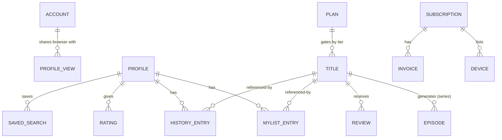
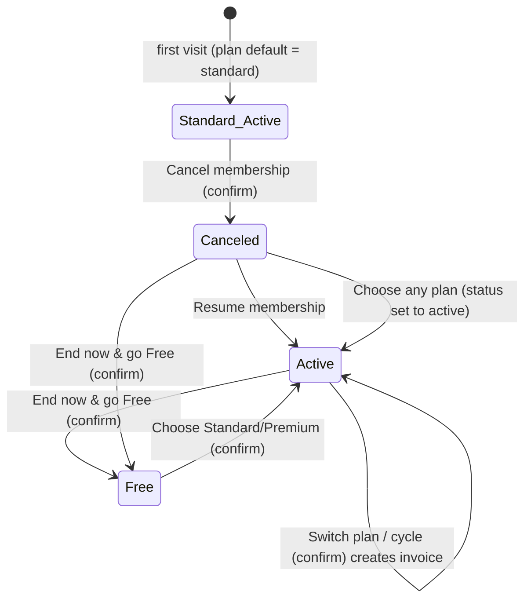
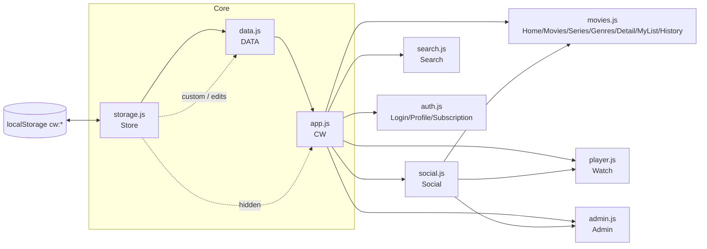
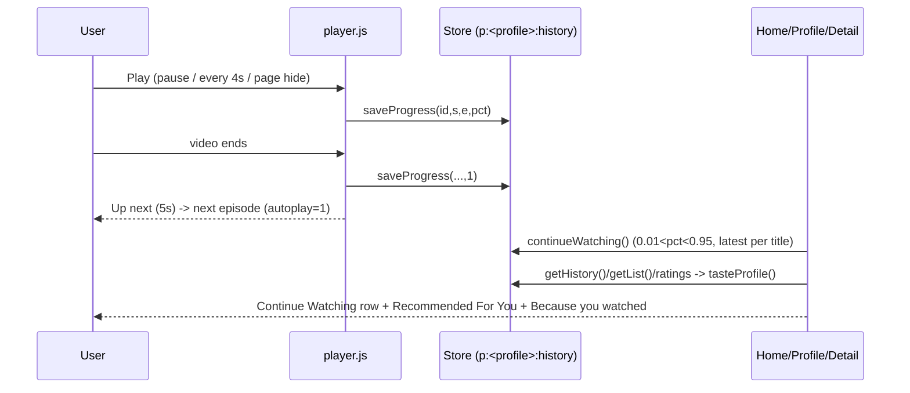

# CineWave — Project Guideline

> Audience: end users, developers, QA and business/product teams.
> Basis: this document was derived strictly from the source code in this folder (all HTML, CSS-referenced structure, `js/*.js`, `README.md`). Statements that are not directly visible in code are labelled **Assumption** or **Unknown / not implemented**.
> UI language is English with an optional Vietnamese (VI) label set; where the UI shows Vietnamese terms they are quoted in parentheses.

---

## Table of Contents

1. [Project Overview](#1-project-overview)
   - 1.1 Purpose · 1.2 Tech stack · 1.3 File structure · 1.4 How to run · 1.5 Data storage (localStorage keys) · 1.6 Seed / mock data · 1.7 Demo credentials
2. [User Guideline](#2-user-guideline)
   - 2.1 Roles and profiles · 2.2 Screen map · 2.3 Global UI (header, menus, notifications) · 2.4 Step-by-step tasks
3. [Business Guideline](#3-business-guideline)
   - 3.1 Entities · 3.2 Statuses and state transitions · 3.3 Permission matrix · 3.4 Plans, pricing and formulas · 3.5 Content rules (tiers, Kids Mode) · 3.6 Ranking and recommendation formulas · 3.7 Validation summary · 3.8 Key scenarios
4. [Feature Details](#4-feature-details)
5. [Key Workflows and Module Relationships](#5-key-workflows-and-module-relationships)
6. [Known Limitations and Gaps](#6-known-limitations-and-gaps)
7. [QA Test Checklist](#7-qa-test-checklist)
8. [Appendix: Glossary and Constants](#8-appendix-glossary-and-constants)

---

## 1. Project Overview

### 1.1 Purpose

CineWave is a **fictional movie / TV-series streaming web app** built as a portfolio demo. It simulates the customer-facing experience of a streaming service (browse, search, watch, lists, profiles, plans) plus a small admin dashboard. **There is no backend**: everything (accounts, subscriptions, reviews, analytics) is simulated in the browser and persisted in `localStorage`. Nothing is secure and no payment is processed (stated in the UI and in `README.md`).

### 1.2 Tech stack

| Item | Value |
|---|---|
| Markup | Static HTML5 pages (13 pages) |
| Styling | 4 CSS files: `style.css` (tokens/layout), `components.css`, `responsive.css`, `features.css` |
| Logic | Vanilla JavaScript (no framework, no bundler, no build step, no package manager) |
| Persistence | `localStorage` (prefix `cw:`), `sessionStorage` (key `cw:session`) |
| Cross-tab sync | `BroadcastChannel` (Watch Party only) |
| Artwork | Posters, backdrops, episode thumbnails are generated at runtime as SVG data-URIs (`data.js`); no binary assets |
| Video | 3 public open-licence sample clips; falls back to a timer-based simulated player |
| Charts (admin) | Hand-written inline SVG |
| Fonts/CDN | None referenced by the HTML (only the video URLs below are external) |

External URLs used (all in `js/data.js`, `VIDEOS`):
1. `https://archive.org/download/ElephantsDream/ed_1024_512kb.mp4`
2. `https://interactive-examples.mdn.mozilla.net/media/cc0-videos/flower.mp4`
3. `https://test-videos.co.uk/vids/bigbuckbunny/mp4/h264/720/Big_Buck_Bunny_720_10s_1MB.mp4`

### 1.3 File structure

```
cinewave/
├── index.html          Home (data-page="home")
├── movies.html         Movies listing            (data-page="movies")
├── series.html         TV Series listing         (data-page="series")
├── genres.html         Genres browsing           (data-page="genres")
├── movie-detail.html   Title detail              (data-page="detail")   ?id=<n>
├── watch.html          Video player              (data-page="watch")    ?id=<n>&s=&e=
├── search.html         Advanced search           (data-page="search")   ?q=&filters
├── my-list.html        My List                   (data-page="mylist")
├── history.html        Watch history             (data-page="history")
├── profile.html        Profile & settings        (data-page="profile")
├── subscription.html   Membership plans          (data-page="subscription")
├── login.html          Login / Register          (data-page="login")
├── admin.html          Admin dashboard           (data-page="admin")
├── css/  style.css · components.css · responsive.css · features.css
├── js/
│   ├── storage.js   Store: localStorage wrapper, profiles, My List, history, searches, settings, plan, seed
│   ├── data.js      DATA: catalogue (52 titles), artwork generators, episode generator, video URLs
│   ├── app.js       CW: shell (header/footer/drawer/bottom nav), i18n, cards/rows/grids, search core,
│   │                recommendations, toasts/modals, notifications, theme, profile switch
│   ├── social.js    Social: ratings & reviews, Watch Party
│   ├── movies.js    Home, Movies, Series, Genres, Detail, My List, History pages
│   ├── player.js    Watch page (custom player)
│   ├── search.js    Search page
│   ├── auth.js      Login/Register, Profile & settings, Subscription pages
│   └── admin.js     Admin dashboard
├── assets/icons/favicon.svg ; assets/images/README.md ; assets/posters/README.md (placeholders only)
└── README.md
```

Script loading order on each page (dependencies flow left to right):
`storage.js → data.js → app.js → [social.js] → page script`
(`search.html`, `login.html`, `profile.html`, `subscription.html` do **not** load `social.js`; `watch.html`, `movie-detail.html`, `admin.html` and the browse pages do.)

### 1.4 How to run

1. Open `index.html` directly in a modern browser, **or** serve the folder with any static server (e.g. `python -m http.server`, `npx serve`).
2. No install/build step. An internet connection is only needed for the sample video clips; offline, the player automatically switches to simulated playback.
3. To reset to a clean state: **Profile → Settings → Reset demo data** (see 4.11), or clear site data in the browser.

> **Assumption:** Opening via `file://` works because there are no module imports or fetch calls; `BroadcastChannel` (Watch Party sync) behaviour under `file://` origins was not verified.

### 1.5 Data storage (localStorage keys)

All keys are prefixed with `cw:` and stored as JSON strings via `Store.get/set`. Keys marked **per profile** are stored as `cw:p:<profileId>:<key>`.

| Key | Scope | Content | Written by |
|---|---|---|---|
| `theme` | global | `"dark"` \| `"light"` | header menu, profile settings |
| `lang` | global | `"en"` \| `"vi"` | header selector, profile settings |
| `profiles` | global | array of `{id,name,kids,hue}` (only written after a rename) | rename |
| `profile` | global | active profile id (default `personal`) | profile switch |
| `p:<id>:list` | per profile | My List `[{id, at}]` (newest first) | My List toggle |
| `p:<id>:history` | per profile | `[{id, s, e, pct, at}]`, max 100, newest first | player, "mark watched", history page |
| `p:<id>:ratings` | per profile | `{titleId: stars}` | reviews |
| `p:<id>:helpful` | per profile | review ids the profile marked helpful | reviews |
| `p:<id>:saved` | per profile | saved searches `[{label,q,f}]` max 8 | search page |
| `searches` | global | recent search strings, max 8 | header/search page |
| `settings` | global | `{autoNext, subtitle, quality, reduceMotion, subSize?}` | profile settings, player |
| `plan` | global | `"free"` \| `"standard"` \| `"premium"` (default `standard`) | subscription |
| `sub` | global | subscription record (status, cycle, renews, method, promo, devices, invoices) | subscription |
| `notifs` | global | notifications list | seed, notification actions |
| `seeded` | global | `true` once demo seed has run | storage.js |
| `user` | global | signed-in user `{name,email,role?}` (when "Remember me") | login/register/sign out |
| `accounts` | global | registered demo accounts `[{name,email,ck}]` | register |
| `hidden` | global | array of hidden title ids | admin |
| `featured` | global | array of pinned title ids (home hero) | admin |
| `custom` | global | admin-added titles `[{id,raw}]` | admin |
| `edits` | global | per-title overrides `{id:{title,viTitle,tier,description}}` | admin |
| `reviews` | global | user-written reviews | reviews |
| `votes` | global | helpful vote deltas `{reviewId:n}` | reviews |
| `flags` | global | reported review ids | reviews |
| `modRemoved` | global | review ids removed by admin | admin |
| `adminUsers` | global | admin overrides for generated users `{index:{plan,status}}` | admin |
| `speed`, `volume`, `muted`, `theater` | global | player preferences | player |
| `sessionStorage["cw:session"]` | session | signed-in user when "Remember me" is unchecked | login |

`Store` falls back to an in-memory object if `localStorage` throws (e.g. blocked storage); data is then lost on reload.

### 1.6 Seed / mock data

- **Catalogue**: 52 fictional titles hard-coded in `data.js` `RAW` (31 movies, 21 series; 29 have a 4K version). IDs 1–52. (`README.md` also says 52; the header comment in `data.js` says "50 titles" — the comment is stale.) Descriptions, cast, director and English/VI titles are generated deterministically from title hash.
- **Reviews**: 3–6 synthetic "community" reviews are generated per title (deterministic).
- **Analytics** (admin): 28 generated users, generated view counts and daily views; all fake.
- **First-visit seed** (`Store.seed`, runs once, flag `seeded`), affects only the **Personal** profile:
  - My List: ids 1, 18, 32, 6, 27 (The Last Journey, Jade Emperor's Road, The Signal Room, Bamboo Kingdom, Kitsune Tales).
  - History: id 1 at 72%; id 3 (Monsoon Hearts) S1E2 40%; id 7 (Hanoi Rewind) S1E1 65%; id 24 (Sakura Protocol) S1E2 55%; id 2 (Saigon Midnight) 100%; id 25 (Ramen at the End of the World) 100%.
  - 4 notifications (3 unread).
  - Kids and Guest profiles start empty.
- **Subscription seed** (created lazily on first visit of the Membership page): status `active`, cycle `monthly`, renews in 21 days, 3 devices, 3 invoices of 79,000 ₫.

### 1.7 Demo credentials

| Account | Email | Password | Role |
|---|---|---|---|
| Demo viewer ("Demo Viewer") | `demo@cinewave.test` | `demo1234` | user |
| Site admin ("Site Admin") | `admin@cinewave.test` | `admin1234` | admin |

The login page has **Fill demo user** and **Fill admin** buttons that pre-fill these values. Any visitor can also register a new account (stored locally). Accounts are verified by a simple non-cryptographic checksum (djb2) — explicitly *not secure* (warning shown on the login page).

---

## 2. User Guideline

### 2.1 Roles and profiles

There are two independent concepts:

**A. Account role** (only matters for the Admin dashboard)

| Role | How obtained | What it changes |
|---|---|---|
| Anonymous visitor | default | Can use every viewer feature (no login is required to watch, list, rate, subscribe-simulate). |
| Registered user | Register or demo login | Only difference: name/email shown in header/profile/reviews. |
| Admin | Log in as `admin@cinewave.test` | Adds "Admin dashboard" link in profile menu and access to `admin.html`. |

**B. Viewing profile** ("Who's watching?", fixed set of three)

| Profile | Kids flag | Effect |
|---|---|---|
| Personal | no | Full catalogue; carries the seeded demo data. |
| Kids | yes | Kids Mode: only kid-safe titles, reduced navigation, enlarged UI (`body.kids`), kids banner on home. |
| Guest | no | Full catalogue, empty list/history. |

Each profile keeps its **own** My List, watch history/Continue Watching, ratings, helpful votes and saved searches. Plan, settings, theme, language, recent searches and the signed-in user are **shared** across profiles.

### 2.2 Screen map

| Screen | URL | Purpose |
|---|---|---|
| Home | `index.html` | Hero carousel, Continue Watching, themed rows, recommendations |
| Movies | `movies.html` | Filterable grid of movies (`?sort=new`, `?country=Vietnam` etc.) |
| TV Series | `series.html` | Series hero, rows, filterable grid of series |
| Genres | `genres.html` (`?g=Action`) | Genre tiles + filtered grid |
| Title detail | `movie-detail.html?id=` | Info, episodes, cast, trailer, reviews, related |
| Watch | `watch.html?id=&s=&e=` | Custom player, episode list, Watch Party, reviews |
| Search | `search.html` | Live/advanced search with operators, filters, saved searches |
| My List | `my-list.html` | Saved titles for the active profile |
| Watch history | `history.html` | History with resume/remove/clear |
| Profile & settings | `profile.html` (`#overview`,`#profiles`,`#settings`) | Overview, profile rename/switch, settings, reset |
| Membership | `subscription.html` | Plans, billing period, manage plan, card, promo, devices, invoices |
| Login / Register | `login.html` (`#register`, `?next=`) | Demo authentication |
| Admin | `admin.html` (`#overview`..`#revenue`) | Overview, Content, Users, Reviews, Revenue |

### 2.3 Global UI (every page)

- **Header**: logo; nav links (Home, Movies, TV Series, Genres, Trending, New Releases, My List); search box with live suggestions; language selector (EN/VI); notification bell (red dot = unread count); avatar menu.
- **Avatar menu**: "Who's watching?" (switch profile), Profile, Watch history, Subscription, Admin dashboard (admin only), Theme toggle (dark/light), Sign in / Sign out.
- **Kids profile**: header shows only Home, Movies, TV Series, My List.
- **Mobile/compact**: hamburger drawer (Menu) plus a bottom nav (Home, Movies, Series, Search, My List). Search icon expands the search field.
- **Footer**: about text and links.
- **Toasts** (3.2 s) and modal dialogs for confirmations.
- **Notifications**: click an item to mark it read; "Mark all as read" (VI: "Đánh dấu đã đọc"). Empty text: "You're all caught up."
- **Language**: switching reloads the page. Only a limited label set is translated (see 4.13).

### 2.4 Step-by-step usage

**Browse and find a title**
1. Open Home. Use the hero (auto-advances every 7 s; pauses on hover/focus; prev/next arrows, dots, swipe) or scroll the rows (left/right arrows on each row, "See all" link).
2. Use Movies / TV Series / Genres for filtered grids. Change any dropdown (Genre, Country, Year, Quality, Rating, Sort) — results update instantly; **Clear** resets. Click **Load more (n)** for the next 24.
3. Hover a card to see the overlay (rating, year, runtime, age, description, play button, + list button). A lock badge ("Standard"/"Premium") means your plan is too low.

**Search**
1. Type in the header box or open Search. Suggestions (Title / Genre / Actor / Director) appear while typing; Arrow keys navigate, Esc closes.
2. Press Enter/Search. Use the left filter panel (genres are multi-select "any of", country, rating, type, quality, sort, year range, max age, runtime, hide finished).
3. Use operators, e.g. `genre:action year:2025 rating:>8 actor:kim type:series country:korea`.
4. **Save search** (next to the result count) stores the query + filters; saved and recent searches show when the search box is empty.

**Watch a movie**
1. Open a title → **Watch Now** (or "Continue Watching" if progress exists; **Start over** restarts).
2. On the Free plan an ad overlay appears first ("Skip ad" becomes available after 3 s; auto-starts at 5 s).
3. Use the on-screen controls or keyboard shortcuts (see 4.6). Progress is saved automatically.

**Watch a series episode**
1. Open a series → choose the Season dropdown → click an episode (or **Watch Now**, which resumes the latest unfinished episode, else S1·E1).
2. On the Watch page use the Episodes side list, Previous/Next buttons, or let **Auto-next** play the next episode after a 5-second "Up next" countdown (can be cancelled).
3. On the detail page, per-episode **Mark watched** toggles the episode as 100% watched / unwatched.

**My List**
1. Click the **+** on any card/hero/detail/watch page to add; click again (✓) to remove.
2. Open **My List**: filter by type/genre, sort by Recently added / Title A–Z / Rating / Year, or press **Remove**.

**Continue Watching / History**
1. Home and Series pages show *Continue Watching* cards (progress bar, % watched, minutes remaining).
2. **Watch history** lists every entry; **Continue Watching / Watch again**, **Remove** for one entry, **Clear history** for all (confirmation dialog).

**Rate and review**
1. On Detail or Watch pages scroll to *Ratings & reviews*. Click 1–5 stars, optionally type up to 500 characters, **Post review**.
2. Edit by changing stars/text and pressing **Update review**; **Delete** removes it. Mark others' reviews **Helpful** (toggle) or **Report**.
3. Your ratings shape "Recommended For You".

**Change plan / manage membership**
1. Open Subscription. Choose Monthly/Yearly, press a plan button, confirm the dialog.
2. Manage: cancel, resume, end now (go Free), add a demo card (brand + last 4 digits), apply promo `CINE10`, sign out a device, download an invoice `.txt`.

**Profiles, theme, settings**
1. Avatar → choose a profile (page reloads; on Detail/Watch pages you are sent to Home).
2. Profile page → *Profiles* tab: rename (max 16 chars). *Settings* tab: theme, language, default subtitles, default quality, auto-next, **Reset demo data**.

**Watch Party** (on the Watch page)
1. Click the group icon (or press `P`) → **Start a party**. Share the invite link (**Copy invite link**) or enter a 4–6 character code and **Join**.
2. Open the link in a second tab of the same browser to see real sync; demo guests (Mai, Kenji, Sofia) join automatically.

**Admin** (admin account only) — see 4.12.

---

## 3. Business Guideline

### 3.1 Entities

**Title (Movie/Series)** — `DATA.movies[]`

| Field | Meaning / rule |
|---|---|
| `id` | 1–52 built-in; admin-added start at 1000 (`custom: true` when id ≥ 1000) |
| `title`, `viTitle`, `originalTitle` | English title, Vietnamese title, original (VI title if country is Vietnam, else English) |
| `type` | `movie` \| `series` |
| `year`, `duration` | Duration in minutes (per episode for series) |
| `rating` | Critic-style score 0–10 (fixed per title; new admin titles get 7.5) |
| `genres[]` | From: Action, Adventure, Animation, Comedy, Crime, Drama, Fantasy, Horror, Romance, Sci-Fi, Thriller, Documentary, Family |
| `country`, `region` | Region ∈ Vietnam, South Korea, China, Japan, US, otherwise **Europe** |
| `quality[]` | `["HD"]` or `["HD","4K"]` |
| `ageRating` | `All`, `7+`, `13+`, `16+`, `18+` |
| `tier` | `free` \| `standard` \| `premium` (see 3.5) |
| `seasons`, `episodesPerSeason` | Series only; **6 episodes per season** always |
| `director`, `cast[5]`, `audio[]`, `subtitles[]` | Generated; subtitles always Vietnamese + English |
| `trend`, `addedDaysAgo` | Derived sort keys (see 3.6) |
| `video`, `trailer` | One of the three sample clips |

**Episode** (generated, not stored): `{n, season, title, duration, thumb, description}`; title cycles through "The Beginning, The Journey, The Secret, The Return, The Choice, The Storm, The Reveal, The Finale"; duration = title duration + `((n*3+season) % 7) − 3` minutes.

**Profile** `{id, name, kids, hue}` — three fixed profiles (Personal, Kids, Guest).

**History entry** `{id, s, e, pct, at}` — `s`,`e` are 0 for movies; `pct` 0–1 clamp; unique per (id, s, e); newest first; max 100.

**My List entry** `{id, at}`. **Review** `{id, titleId, profile, name, rating 1–5, text ≤500, at}` (+ synthetic reviews with `synthetic:true`).

**Subscription** `{status: active|canceled, cycle: monthly|yearly, renews, method{brand,last4,name}|null, promo|null, devices[], invoices[]}`. **Invoice** `{id "INV-xxxx", date, desc, amount}`.

**Account** `{name, email, ck(checksum), role?}`. **Notification** `{id, icon, text, at, read}`.

Relationships:



Note: the account is *not* linked to profiles in code; profiles and the plan are per browser, not per account.

### 3.2 Statuses and state transitions

**Title publication** (admin): `Published` ⇄ `Hidden` (switch). Hidden titles are removed from `CW.catalog()` (home, lists, search, suggestions, recommendations).

**Watch progress** (per title/episode): `Not started` → `In progress` (pct between 0.01 and 0.95, appears in Continue Watching) → `Finished` (pct ≥ 0.95; shown as "Watched"/"Finished"; excluded from Continue Watching). "Mark watched" sets pct = 1; "✓ Watched" click removes the history entry (back to Not started).

**Subscription**



`Canceled` is only a flag with a message ("Cancels <date>", "Access continues until <date> (n days)"); **no code downgrades the plan when the date passes** (Unknown / not implemented).

**User (admin view)**: `active` ⇄ `suspended` (Suspend / Reinstate). Only affects admin-panel statistics (MRR counts only `active`).

**Review**: visible → `reported` (flag) → `removed` (admin) ⇄ restored. Removed reviews disappear from lists and the average.

**Watch Party**: no room → in room (`create`/`join`) → left (`leave`/leaving page).

**Player states**: locked (gate) | ad (Free plan) | loading → playing/paused → ended → (Up next countdown → next episode).

### 3.3 Permission matrix

| Capability | Anonymous | Registered | Admin | Kids profile |
|---|---|---|---|---|
| Browse, search, watch (subject to plan) | Yes | Yes | Yes | Only kid-safe titles |
| My List, history, ratings/reviews | Yes | Yes | Yes | Yes (separate data) |
| Change plan / promo / card (simulated) | Yes | Yes | Yes | Yes (no PIN) |
| Switch profile | Yes | Yes | Yes | Yes (no PIN) |
| Open `admin.html` | No ("Admin access only") | No | Yes | Same as account |
| Publish/hide, feature, edit, add, delete titles | No | No | Yes | – |
| Suspend users, change user plans, moderate reviews | No | No | Yes | – |
| Watch a title above your plan tier | Blocked by gate overlay | same | same | same |

Admin check: `user().role === "admin"` from `cw:user`/`cw:session` in the browser (client-side only; see limitations).

### 3.4 Plans, pricing and formulas

| Plan | Monthly price | Video quality (marketing) | Devices (marketing / list limit) | Ads | Titles unlocked |
|---|---|---|---|---|---|
| Free | 0 ₫ | 480p | 1 | Simulated ad (5 s) | tier `free` only |
| Standard (default, "Most popular") | 79,000 ₫ | 1080p | 3 | No | `free` + `standard` |
| Premium | 129,000 ₫ | 4K + HDR | 5 | No | all (`premium` incl.) and 4K quality option |

Tier rank: `free=0 < standard=1 < premium=2`. A title is **locked** when `rank(title.tier) > rank(current plan)`.

Formulas (`auth.js`):
- Yearly price = `round(monthly × 10 / 1000) × 1000` → Standard 790,000 ₫, Premium 1,290,000 ₫ ("save 2 months").
- Yearly plan card shows per-month = `round(monthly × 10 / 12 / 1000) × 1000` → Standard 66,000 ₫, Premium 108,000 ₫, plus "Billed <per-month × 12> yearly" → 792,000 ₫ / 1,296,000 ₫ (note the small mismatch vs. the invoice amount, see §6).
- Invoice amount on plan change = `priceOf(plan, cycle) × (promo ? 0.9 : 1)`, rounded; description `"<Plan> plan — <cycle>"` + `" (CINE10 −10%)"` if promo used. Free plan creates no invoice.
- Renewal date on plan change = now + 30 days (monthly) or 365 days (yearly).
- Promo `CINE10` (case-insensitive): 10% off the *next* invoice; consumed (set to null) at the next plan change. It also changes the displayed price in "Your plan".
- Currency format: `Intl.NumberFormat("vi-VN")` + "₫" (e.g. `79.000₫`).
- "Minutes watched" on the membership page = Σ `pct × title.duration` over history (uses movie/series per-episode duration).

Admin revenue (fake): `PRICE = {free:0, standard:79000, premium:129000}`; MRR = Σ price of *active* generated users; ARPU = MRR / active users; "Churn" is the constant `2.4%`; MRR trend months = `MRR × (0.62 + i × 0.075)` for Apr..Sep.

### 3.5 Content rules

**Tier assignment (built-in titles)** — `data.js`:
1. `premium` if 4K available **and** rating ≥ 8.5 (Spring in Busan, Kitsune Tales, Orbit Zero, The Signal Room → 4 titles).
2. else `standard` if year = 2026 **or** id is even (30 titles).
3. else `free` (18 titles).
Admin can override the tier through edits.

**Kids Mode kid-safe rule** (`CW.kidSafe`): age rating number ≤ 7 (`All`=0, `7+`=7) **and** no genre in {Horror, Crime, Thriller}. Currently 14 titles qualify (e.g. Bamboo Kingdom, Kitsune Tales, Wild Wonders, Tet Reunion). Kids Mode applies to catalogue, search, suggestions, recommendations, detail and watch pages (direct URLs show "Not available in Kids Mode").

**Hidden titles** are removed from the catalogue helper; see limitation about direct URLs.

### 3.6 Ranking and recommendation formulas

| Formula | Definition |
|---|---|
| `trend` | `round(rating×10 + (year−2020)×4 + (hash(title) % 25))` |
| `addedDaysAgo` | `(2026 − year)×120 + hash(title) % 100` |
| Sort *Trending* | `trend` desc |
| Sort *Top rated* | `rating` desc |
| Sort *Newest* | `year` desc, then `addedDaysAgo` asc |
| Sort *Title A–Z* | `localeCompare` |
| Continue Watching | latest history entry per title with `0.01 < pct < 0.95` |
| Taste profile | History: `(0.4 + pct) × e^(−age/14 days)` per genre (region ×0.6, type ×0.4); My List: +1.2; star rating: `(stars − 3) × 1.4` |
| Recommendation score | `(signal ? genreScore×3 + regionScore×0.9 + typeScore×0.4 : 0) + rating/10×1.4 + trend/140 + (year 2026 ? 0.25 : 0)`; excludes titles already started or rated |
| Match % | `72 + 26 × (score − min)/(max − min)` across returned list (range 72–98) |
| Reason label | No signal: "Trending this week" (trend > 100) or "Highly rated". With signal: "Because you watched <title>", else "You like <genre>", else "Popular right now" |
| "Because you watched X" rows | Up to 2 rows from most recent distinct history titles; score = shared genres×2 + same region 1 + same type 0.5 + rating/20; needs score ≥ 2 and ≥ 4 items; excludes finished titles |
| Text search score | per token: title starts-with 6 / title contains 4 / people contains 2 / other 1, × match quality (1 exact substring, 0.5 fuzzy) |

### 3.7 Validation summary

See per-feature details in §4. Highlights: email regex `^[^\s@]+@[^\s@]+\.[^\s@]+$`; register name ≥ 2 chars; password ≥ 8 chars; confirm must match; card last-4 exactly 4 digits; review text ≤ 500 chars; chat ≤ 140 chars; profile name ≤ 16 chars; party code ≥ 4 chars; admin new title requires a title.

### 3.8 Key scenarios (business)

| # | Scenario | Result |
|---|---|---|
| S1 | Fresh visitor on default plan Standard opens a Premium title (e.g. Orbit Zero) | Card shows "Premium" lock; detail page shows notice "This title needs the Premium plan"; watch page shows gate "Premium plan required" with **View plans** / **Back** |
| S2 | User switches to Free, plays a `free` title | Ad overlay for 5 s (skippable after 3 s), then playback |
| S3 | User on Free opens a `standard` title | Gate overlay "Standard plan required" |
| S4 | Kids profile opens `watch.html?id=2` directly | "Not available in Kids Mode" |
| S5 | Admin hides a title | Vanishes from all lists/search/recommendations in that browser; still reachable by direct URL (see §6) |
| S6 | User finishes ep 6 of last season with Auto-next on | Toast "You've reached the end. Enjoy!" |
| S7 | User applies CINE10 then changes plan | Invoice = 90% of price, promo cleared |
| S8 | User cancels membership | Status "Cancels <date>"; access unchanged; can Resume |

---

## 4. Feature Details

### 4.1 Authentication (login / register / forgot password) — `auth.js`, `login.html`

- **Inputs (login)**: Email, Password, Remember me (checked by default).
- **Validation messages**: `Enter a valid email address.` · `Enter your password.` · on mismatch (form-level): `Email or password is incorrect. (Demo: demo@cinewave.test / demo1234)`.
- **Lookup**: email lower-cased/trimmed; match against built-in DEMO, ADMIN, then `cw:accounts`; checksum of `email:password`.
- **Success**: toast `Welcome, <name>!`, redirect after 700 ms to `?next=` value or `index.html`.
- **Remember me**: checked → user saved in `localStorage cw:user`; unchecked → `sessionStorage cw:session` (cleared when the tab closes), `cw:user` set to null.
- **Register inputs**: Name, Email, Password, Confirm password. Messages: `Please enter your name.` (trimmed < 2 chars) · `Enter a valid email address.` · `That email is already registered in this demo.` · `Use at least 8 characters.` · `Passwords do not match.` On success the user is signed in with "remember" = true.
- **Show/Hide** button toggles the password field type. `#register` in the URL opens the Register tab.
- **Forgot password**: modal "Reset password (demo)"; toast `Demo: a reset link would be sent now` for a valid email, `Enter a valid email first` (error) otherwise. Nothing is sent/changed.
- **Sign out** (avatar menu): removes session + `cw:user`, toast `Signed out`, page reload.
- **Edge cases**: duplicate email vs. built-in accounts is rejected; registering does not create an admin; no password reset/change; no lockout after failures.

### 4.2 Home — `movies.js: home`

- **Hero**: up to 6 slides = admin-pinned (`featured`, only if visible in catalogue) + top-trending remainder. Eyebrow: "Featured tonight" (first) / "Featured" / Kids: "Picked for kids", plus country. Buttons: Watch Now, Add to My List/In My List, More Info. Auto-rotates every 7 s unless `prefers-reduced-motion`; pauses on mouse-over/focus; supports swipe (>50 px).
- **Rows (non-Kids)**: Continue Watching (if any) → Trending Now → Popular Movies → New Releases → Top Rated → Recommended For You (with "% match" and reason) → up to 2 "Because you watched …" rows → Action, Comedy, Romance, Horror, Sci-Fi (top rated, 14) → Vietnamese/Korean/Chinese/US Movies (by region, trending) → European Picks → Browse by Genre chips.
- **Rows (Kids)**: banner "Welcome to Kids Mode", Continue Watching, Trending Now, Animation, Family, Educational (Documentary), Popular Series, New Releases.
- **Loading**: a skeleton is shown for 280 ms (simulated latency); errors render "Couldn't load content" + **Try again**.
- **Anchor**: `index.html#trending`, `#new` scroll to the row.

### 4.3 Movies / TV Series listing — `movies.js: listing`

- **Filters**: Genre, Country (Vietnam, South Korea, China, Japan, US, Europe), Year (2026/2025/2024), Quality (HD/4K), Rating (8.0+/7.0+/6.0+), Sort (Trending/Top rated/Newest/Title A–Z). State is mirrored into the URL query (`history.replaceState`), so links like `movies.html?country=Vietnam` and `?sort=new` work.
- **Count**: `"<n> movies"` / `"<n> series"`.
- **Empty**: "No matches — No titles match these filters. Try widening your search." with **Reset filters**.
- **Paging**: 24 per page, button `Load more (<remaining>)`.
- **Series page** adds: hero (top 4 rated series), rows Continue Watching (series only), Popular Series, New Series; these extra rows are hidden while any filter (other than sort) is active.

### 4.4 Genres — `movies.js: genres`

- Tiles for every genre that has ≥ 1 visible title, with counts (`<n> titles`). Without a valid `?g=`, heading "Pick a genre to start browsing" and a Trending row is shown.
- With a genre: filters Type, Country, Year, Sort; grid of matching titles. Unknown genre values are treated as no selection.

### 4.5 Title detail — `movies.js: detail`

- **Data shown**: eyebrow (Movie / "TV Series · n season(s)"), title, Original and "Tiếng Việt" titles, chips (quality, rating, year, runtime, genres, age, country), community rating (from reviews, link to `#reviews`), resume progress line, genre chips, description, director, starring, action buttons (Watch/Continue `S<s>:E<e>`, **Start over** when progress exists, Trailer, My List), info grid (Country, Year, Genre, Duration, Quality, Audio, Subtitle, Age rating, Director, Access), Cast (links to a search for that name), Trailer card, Reviews, Related Movies (shared genres, sorted by rating then number of shared genres, 14).
- **Lock notice**: `This title needs the <Standard|Premium> plan. View plans` when `locked`.
- **Series**: Season dropdown (defaults to the latest-progress season), episode list (thumbnail, duration, description, progress, **Mark watched** toggle, play), summary "`<done> of <n> episodes watched`" (done = pct ≥ 0.95). Toasts: `Marked as watched` / `Marked as unwatched`.
- **Errors**: unknown/invalid id → "Couldn't load content — We couldn't find that title." Kids + not kid-safe → "Not available in Kids Mode … Switch to another profile to view this title." with **Back to home**.
- **Trailer**: modal video (`#t=0,45`, first 45 seconds of a sample clip). If load fails: "Trailer unavailable — The demo clip could not be loaded (are you offline?)." Button **Watch now** in the modal navigates to the watch page.

### 4.6 Watch page / Player — `player.js`

**Access**
- Missing/invalid id or Kids-unsafe → same messages as 4.5.
- `s` and `e` are clamped to `[1, seasons]` / `[1, 6]`; non-numeric defaults to 1.
- Locked title → gate overlay (`Standard`/`Premium plan required`, "You're on the <plan> plan. Upgrade to watch this title. (Demo — no real payment.)"), controls hidden.

**Playback source**
- Tries `m.video`, then the other two clips in turn; an 8-second watchdog with no metadata, or a media error, moves to the next; after the last one it switches to **SimMedia** (timer-based, duration `150 + (id % 5) × 30` seconds), shows "Simulated playback" tag and toast `Demo stream unreachable — using simulated playback`.
- Progress is stored as a **fraction of the clip**, not of the nominal runtime.

**Controls**: Play/Pause, Previous/Next episode (only if they exist), Back/Forward 10 s, Mute + volume slider, time `mm:ss / mm:ss · <chapter>`, seek bar with hover tooltip and chapter ticks (chapters at 0, 10%, 38%, 66%, 90%: Opening, Act I–III, Finale), Subtitles menu (Off / Vietnamese / English + text size Small/Medium/Large), Speed (0.5, 0.75, 1, 1.25, 1.5, 2), Quality (Auto, 360p, 480p, 720p, 1080p, plus 4K when the title has 4K), Audio track, Watch Party, Picture-in-Picture (if supported; not in simulation), Theater mode, Fullscreen (tries to lock landscape).

**Keyboard** (ignored while typing in inputs/selects, with Ctrl/Meta/Alt, or on locked titles):

| Key | Action |
|---|---|
| Space / K | Play/Pause |
| J / ← | Back 10 s |
| L / → | Forward 10 s |
| M | Mute |
| F | Fullscreen |
| T | Theater mode |
| P | Watch Party panel |
| C | Toggle English demo subtitles (Off ↔ English) |
| ↑ / ↓ | Volume ± 0.1 |

Double-click left 35% of the video = −10 s (toast "−10s"); right 35% = +10 s.

**Rules**
- *Free-plan ad*: on first Play when plan = free → 5-second ad; "Skip ad" enabled once ≤ 2 s remain (after 3 s); ad end starts playback. Ad is shown once per page load.
- *Skip intro*: button visible while 2 s < time < 15 s; click jumps to 15 s, toast `Intro skipped`.
- *Resume*: on load, if saved pct is between 0.01 and 0.95 (and no `restart=1`), jumps there and shows chip `Resumed at m:ss` with **Start over** (8 s). Note `restart=1` only suppresses the resume; the stored progress is overwritten only when playback saves again.
- *Saving progress*: on `pause`, on page hide, at most every 4 s during play, only when time ≥ 3 s (except forced); on `ended` saves 100%.
- *Auto-next*: if a next episode exists and setting `autoNext` is on → overlay "Up next … Starting in 5s" with **Play now** / **Cancel**; navigates to `watch.html?...&autoplay=1`. Otherwise toast `You've reached the end. Enjoy!`.
- *Quality*: choosing 4K without Premium → error toast `4K needs the Premium plan` (menu shows a lock icon on 4K for non-Premium). Other choices: toast `Quality: <val> (demo — single source)`; the badge changes but the source does not. Audio: toast `Audio: <val> (demo — single track)`.
- *Subtitles* are generated demo cues (8 lines in English/Vietnamese cycling every 5 s, visible ~3.6 s of each 5 s); toast `<lang> demo subtitles on` / `Subtitles off`.
- *Side panel*: series → Episodes with season selector and per-episode progress; movie → "More like this" (6).
- Volume/mute/speed/theater preferences persist in `localStorage`.

### 4.7 Search — `search.js` + `CW.search` in `app.js`

- **Idle state** (no text and no filter other than sort): Saved searches (per profile), Recent searches (with **Clear**), Popular searches (`Saigon, Romance, Sci-Fi, Animation, Thriller, Kim, Nguyễn, 2026, genre:action rating:>8, type:series country:korea`), operator tip, Trending grid (12).
- **Text matching** is diacritic-insensitive (NFD, `đ→d`) over: title, original title, VI title, director, cast, genres, country, region, year, and the words "series tv phim bo" / "movie phim le". Every token must match (AND). Fuzzy: tokens of ≥ 4 letters may match a word of the title data with edit distance ≤ 1 (token length 4–6) or ≤ 2 (longer), score ×0.5.
- **Operators** (`key:value`, quote values with spaces): `genre`, `year` (exact), `country`, `type` (`tv|series|show*` → series, otherwise movie), `quality` (uppercased), `age` (max age), `rating` (`>`/`=` stripped → minimum), `actor`/`director`/`cast` (added to text tokens). Unknown keys are left as plain text. Country aliases: `korea|kr` → South Korea; `us|usa|america` → US; `eu|europe` → Europe; others capitalised.
- **Filters panel**: Genres (multi, "any of"), Country, Rating, Type, Quality, Sort (Relevance default / Trending / Top rated / Newest / Title A–Z), Year from/to (2024–2026), Max age (Any/All ages/7+/13+/16+), Runtime (short < 60, medium 60–110, long > 110 min), "Hide titles I've finished" (pct ≥ 0.95). **Clear all** resets.
- **Results line**: `<n> result(s) for “<text>”`, **Save search**, chips for applied operators/filters. Toast on save: `Search saved — find it on the empty search page` (max 8 saved, same label replaced).
- **Empty result**: "No results found — We couldn't find anything for “<q>”. Check the spelling, try fewer words, or clear some filters." + popular chips. With filters only: "No titles match those filters."
- **Live search**: results update 220 ms after typing; URL updated via `replaceState`. Suggestions: up to 8 (≤ 5 titles, then genres, actors, directors). Header form submit stores a recent search and goes to `search.html?q=`.
- **Recent searches**: max 8, case-insensitive de-duplication.

### 4.8 My List — `movies.js: myList`

- Per profile; toggling shows toasts `Added "<title>" to My List` (success) / `Removed "<title>" from My List` (info). Count: `<n> saved`. Filters Type/Genre, sort (Recently added default, Title, Rating, Year). Kids profile also hides non-kid-safe saved titles.
- Empty: "Your list is empty — Tap the + on any title to save it here for later." (**Browse movies**). Filtered empty: "Nothing matches these filters".

### 4.9 Watch history — `movies.js: historyPage`

- Rows: thumbnail with progress bar, title (link), `S<s> · E<e> — <episode title>` or "Movie", "Watched <date time>", `Finished` (≥ 95%) or `<n>% complete`. Actions: **Continue Watching** / **Watch again**, **Remove** (toast `Removed from history`), **Clear history** → confirm "Clear watch history? — This also clears your Continue Watching progress for this profile." → toast `Watch history cleared`.
- Empty: "No watch history yet — Titles you watch will show up here."

### 4.10 Ratings & reviews — `social.js`

- **Score**: average of all visible reviews (synthetic + user-written, excluding admin-removed); distribution 5★..1★ bars.
- **Synthetic reviews**: 3–6 per title, rating `clamp(1..5, round(rating/2 + ((hash%7)−3)×0.4))`, dates within last 60 days.
- **Posting**: pick stars (required) + optional text (max 500). One review per (title, profile); posting again updates it. Toasts: `Pick a star rating first` (error), `Thanks for your review! It now shapes your recommendations.`, `Review updated`, `Review deleted`. Name shown = signed-in user name, else profile name; own review tagged "You".
- **Sorting**: Most helpful (default), Newest, Highest rated, Lowest rated.
- **Helpful**: toggle per profile; count = base + vote delta.
- **Report**: only on others' reviews; adds to global `flags`; toast `Thanks — the review was reported to moderators`; button becomes "Reported" (disabled).
- **Empty**: "No reviews yet — be the first."

### 4.11 Profile & settings — `auth.js: profilePage`

- **Header**: avatar, name (signed-in user name or profile name), email or "Not signed in · Sign in", active profile, plan pill, **Manage plan**.
- **Overview tab**: Continue Watching, My List row (or empty state), "Your taste" bars (top 5 genres; text "Watch, rate or save a few titles…" when no signal), Recently watched (last 5).
- **Profiles tab**: rename (maxlength 16, empty rejected silently), toast `Profile renamed` then reload; switch buttons. Kids profile description: "Kids Mode · ages 7 and under".
- **Settings tab** (each change toasts `Setting saved`): Theme (Dark/Light), Preferred language (English/Tiếng Việt — reloads), Default subtitles (Off/Vietnamese/English), Default quality (Auto, 360p, 480p, 720p, 1080p, 4K), Play next episode automatically. **Reset demo data** → confirm "Reset all demo data? — Profiles, lists, history, account and plan will return to their defaults." → clears all `cw:` keys and session, redirects to Home (seed re-runs).
- Hash `#profiles` / `#settings` opens the tab.

### 4.12 Subscription — `auth.js: subscriptionPage`

- **Billing toggle**: Monthly / "Yearly save 2 months".
- **Plan cards**: name, blurb, price ("Free" or `<price>/month`), "Billed … yearly" line when yearly, quality/devices facts, feature list. Button labels: `Current plan` (disabled), `Choose <Plan>` (upgrade or current is Free), `Switch to <Plan>` (downgrade).
- **Change plan**: modal "Switch to <Plan>?" (shows monthly list price and "Demo only — no payment is taken and no card details are collected."), **Confirm** → plan set, subscription updated (cycle, active, renewal), invoice added (paid plans), toast `You're now on the <Plan> plan (demo)`.
- **Manage membership**
  - *Your plan*: status pill (`Free` / `Active` / `Cancels <date>`), renewal text `Renews <date> (<n> days) · <price> / month|year`. Buttons: **Cancel membership** (confirm "Cancel membership? — You'll keep access until the end of the billing period. (Demo — nothing is charged.)", toast `Membership will end on <date>`), **Resume membership** (toast `Membership resumed`), **End now & go Free** (confirm "End now and switch to Free? — You'll lose access to paid titles immediately.", toast `You're on the Free plan`). Free plan shows no such buttons.
  - *Payment method*: form Brand (Visa/Mastercard/JCB), Last 4 digits, Name on card (max 30). Error toast `Enter exactly 4 digits`; success `Demo card saved`. Warning: never enter real card data (only brand + 4 digits stored).
  - *Promo*: `CINE10` → `CINE10 applied — 10% off your next invoice`; other codes → error `That code isn't valid`.
  - *Devices* (`n of limit`): **Sign out** removes a device (toast `Device signed out`); empty: "No signed-in devices."
  - *Billing history*: table Invoice, Date, Description, Amount; **Download** produces `<INV-id>.txt` ("CINEWAVE (DEMO INVOICE) … This is a simulated invoice. No payment was processed.").

### 4.13 Theme, language, notifications

- **Theme**: `data-theme` on `<html>`, initial value applied by an inline script in each `<head>` to avoid flash; `meta theme-color` updated (`#0b0d14` dark / `#f4f5fa` light).
- **Language**: only the strings in `VI` (nav labels, some row titles, buttons like Watch Now → "Xem ngay", Sign in → "Đăng nhập", Notifications → "Thông báo") are translated; everything else remains English. `<html lang>` is updated. Dates on the History page use the `vi-VN` locale when VI.
- **Notifications**: 4 seeded items; unread count on the bell dot; per-item and bulk mark-as-read; toast `All notifications marked as read`.

### 4.14 Watch Party — `social.js: party`

- **Start**: generates a 6-character code from `ABCDEFGHJKLMNPQRSTUVWXYZ23456789` (no I, O, 0, 1). **Join**: input uppercase, min 4 chars else toast `Enter the room code`. Invite link: `watch.html?id=..[&s=&e=]&party=<CODE>` (opening it auto-joins).
- **Sync**: play/pause/seek broadcast via `BroadcastChannel("cw-party-<CODE>")` to other tabs of the same browser; receivers adjust when drift > 1.5 s. The checkbox "Sync my player with the party" toggles following (toasts `Your player follows the party` / `You're watching independently`). System lines in chat announce joins/leaves/control actions.
- **Demo guests** (bots): Mai, Kenji, Sofia join at ~1.8 s, 5 s, 8.2 s; random chat lines every 12–24 s and emoji reactions every 9–18 s **while playing**; they reply to your chat after 1.5–3 s.
- **Chat**: max 140 chars; last 60 messages kept; reactions 😂 😮 ❤️ 👏 🔥 float over the video.
- **Copy invite link**: uses the clipboard API; if unavailable, the URL is shown in a toast.
- **Leaving**: **Leave party** (toast `You left the watch party`).

### 4.15 Admin dashboard — `admin.js`

Access: not admin → "Admin access only — Sign in with the demo admin account (admin@cinewave.test / admin1234) to open the dashboard." + **Sign in as admin** (`login.html?next=admin.html`). All data is labelled "Demo data".

| Tab | Content / rules |
|---|---|
| Overview | KPIs: Published titles (`published / total`, hidden count), Active users (generated active + 1 "you"), Views (14 days) with % change, Monthly revenue (demo MRR). Charts: views per day (line), plan distribution (donut), top 7 titles by views, views by genre (top 6). |
| Content | Search titles (title/VI title, diacritic-insensitive), status filter (Published/Hidden), table (Title, Type, Year, Access, Views, Published switch, Featured checkbox, Edit / Delete). **Publish switch**: toggles `hidden`; toasts `Title hidden from the site` / `Title published`. **Featured**: pins to home hero (`Pinned to the home hero` / `Removed from home hero`). **Edit** (modal): title (empty keeps old), Vietnamese title, access tier, description → saved to `edits`, page reloads. **Add title** (modal): title required (`Title is required`), Vietnamese title, type, year (1990–2030 attribute), genres (comma separated; only valid genre names are kept, default "Drama"), country (default Vietnam), minutes (min 5), age rating, tier; creates id ≥ 1000, rating fixed 7.5, quality HD, series = 1 season; reload. **Delete** only for admin-added titles (confirm "Delete this title? — It will be removed from the catalogue."). |
| Users | 28 generated users + "You · admin". Search name/email, plan filter. Change plan (select, toast `Plan updated`) and **Suspend/Reinstate** (toast `User suspended|active`). Persisted in `adminUsers`. |
| Reviews | Filter Reported / Removed / All; list newest first (max 60); **Remove/Restore** (toast `Review removed` / `Review restored`). |
| Revenue | KPIs MRR, ARPU, Paying users, Churn (constant 2.4%); Revenue by plan; MRR trend; invoices created in this browser (first 8) or "Open the Membership page to generate demo invoices." |

Analytics formulas: `views(m) = 1200 + hash(title)%8000 + trend×20 + realPlays×150` (realPlays = number of history entries of that title in the current profile); daily views `21000 + 4200·sin(i/2.2) + hash("d"+i)%3500 + i×380` (+ `historyCount × 120` on the last day).

### 4.16 Layout, responsiveness and accessibility (observed)

Skip link, ARIA roles/labels on carousel, dialogs, menus, tabs, sliders and live regions; keyboard support in suggestions (arrows/Esc), dialogs (`<dialog>`), menus (Esc closes); `prefers-reduced-motion` disables hero autoplay; drawer and bottom nav for compact widths (`responsive.css`).

---

## 5. Key Workflows and Module Relationships

### 5.1 Module dependency



`DATA` reads admin `custom` and `edits` from `Store` at script load, so admin changes need a page reload (the admin UI does it). `CW.catalog()` reads `hidden` at load and the active profile's Kids flag.

### 5.2 Page → module → shared state

| Page | Scripts | Reads | Writes |
|---|---|---|---|
| index, movies, series, genres, movie-detail, my-list, history | app, social, movies | catalogue, history, list, ratings, featured, plan | list, history (mark watched/remove/clear), reviews |
| watch | app, social, player | as above + settings, speed/volume | history, settings (subtitle/quality/subSize), speed, volume, muted, theater |
| search | app, search | catalogue, searches, saved | searches, saved |
| login, profile, subscription | app, auth | accounts, sub, plan, settings | user, accounts, sub, plan, settings, profiles, all (reset) |
| admin | app, social, admin | everything | hidden, featured, custom, edits, adminUsers, modRemoved |

### 5.3 Watch → progress → recommendations



### 5.4 Playback gate decision

```mermaid
flowchart TD
  A[Open watch.html?id] --> B{Title exists?}
  B -- no --> E1[Error: couldn't find that title]
  B -- yes --> C{Kids profile and not kid-safe?}
  C -- yes --> E2[Not available in Kids Mode]
  C -- no --> D{rank(title.tier) > rank(plan)?}
  D -- yes --> G[Gate overlay: plan required]
  D -- no --> F{Plan = free?}
  F -- yes --> AD[5s ad on first Play]
  F -- no --> P[Play]
  AD --> P
  P --> V{Sample clip loads within 8s?}
  V -- yes --> R[Real video]
  V -- no, all 3 fail --> SIM[Simulated playback]
```

### 5.5 Subscription flow

```mermaid
flowchart LR
  A[Choose plan + billing] --> B[Confirm modal]
  B --> C[Store.plan = plan]
  B --> D[sub: cycle, status=active, renews]
  D --> E{Paid plan?}
  E -- yes --> F[Invoice = price x cycle x promo]
  F --> G[promo cleared]
  E -- no --> G
  C --> H[locked() re-evaluated on every page]
```

### 5.6 Search pipeline

`parseQuery(q)` (operators → filter object) → `applyFilters(catalog(), filters)` (genre any-of, country=region, year, yearFrom/To, rating ≥, type, quality, age ≤, runtime bucket, hide finished) → token scoring (`tokenScore`, fuzzy) → sort (relevance or chosen sort) → `CW.grid` (24/page).

### 5.7 Admin effects on the public site

```
Publish switch  -> cw:hidden   -> CW.catalog() on next page load -> all lists/search/reco
Featured check  -> cw:featured -> Home hero (pinned first)
Edit / Add      -> cw:edits / cw:custom -> DATA.movies at load (page reload)
Review remove   -> cw:modRemoved -> Social.allFor() excludes it
User plan/susp. -> cw:adminUsers -> admin statistics only (no effect on viewer plan)
```

---

## 6. Known Limitations and Gaps

**Security / architecture**
1. Authentication and admin authorization are purely client-side. Any visitor can gain admin by writing `cw:user` = `{"name":"x","email":"x","role":"admin"}` in `localStorage`. Passwords use a djb2 checksum. (Acknowledged as demo in the UI.)
2. `login.html?next=` is used verbatim in `location.href` (possible open redirect / `javascript:` URL). *(Observation; low impact in a demo.)*
3. No server, so no real accounts across devices, payments, downloads or DRM. Account ↔ profile ↔ plan are not linked: plan, profiles, lists belong to the browser, not to the signed-in account.
4. Kids Mode and profile switching have no PIN; any user can leave Kids Mode from the avatar menu.

**Catalogue / content**
5. Hidden titles are removed only from `CW.catalog()`. Direct URLs (`movie-detail.html?id=`, `watch.html?id=`), Continue Watching cards/History (via `getM`), and My List entries resolve hidden titles (My List filter only removes non-kid-safe/missing titles).
6. Admin Edit updates `title`, `viTitle`, `tier`, `description` only; `originalTitle` is not updated. Deleting a custom title leaves its entry in `edits`, `hidden`, `featured`, user lists and history (history/list entries for missing ids are skipped).
7. Admin "Add title": no validation of year range on submit beyond HTML attributes, free-text country (unknown countries are grouped as region "Europe"), rating fixed to 7.5, no 4K, series always 1 season × 6 episodes, tier is applied through an `edits` record.
8. All series have exactly 6 episodes per season regardless of runtime metadata. Episode data is generated (titles repeat).
9. Only 3 filter years (2024–2026) although titles can have other years (admin-added).
10. `data.js` header comment says 50 titles; actual count is 52.

**Player**
11. Only a 10–60 s sample clip plays; progress = fraction of the clip. Audio/quality/subtitle selections are cosmetic ("demo — single source/track"). Subtitle cues are fake.
12. Plan quality/device limits (480p for Free, 3/5 devices) are display-only; only the 4K menu option is enforced (Premium). The device list is pre-seeded; devices cannot be added and no limit is enforced.
13. The Free-plan ad plays on every page load (each episode) and cannot be avoided except by "Skip ad" after 3 s.
14. `?autoplay=1` (auto-next) calls play programmatically; browsers may block autoplay without user gesture (Unknown; not verified).
15. **Continue Watching edge case**: `continueWatching()` keeps only the *latest* history entry per title and then requires it to be unfinished. If the most recently watched episode is finished, the title disappears from Continue Watching and `playUrl` for the series falls back to S1·E1 even if other episodes are in progress.
16. "Start over" (`restart=1`) only skips the resume jump; the stored progress remains until new progress is saved.
17. Picture-in-picture is disabled in simulated mode.

**Subscription**
18. Yearly display inconsistency: card "Billed" line = per-month rounded × 12 (Standard 792,000 ₫; Premium 1,296,000 ₫) but the invoice uses price × 10 (790,000 ₫ / 1,290,000 ₫). The confirmation modal always shows the **monthly** price, even in Yearly mode.
19. Cancelled memberships never expire: no logic downgrades the plan at the renewal date; renewal never auto-charges or auto-creates invoices.
20. Choosing "Free" through the plan card does not ask for the confirmation dialog text of "End now" and leaves `sub.renews` untouched.
21. `CINE10` can be "applied" while on Free and stays applied until the next plan change; "10% off your next invoice" is the only promo; no expiry or single-use tracking.
22. Card form: `last4` and name only (no brand/last-4 masking beyond that), invoices IDs are derived from the invoice count (`INV-1000+count+4`).

**Search / recommendations**
23. `country:` operator compares to `region`; `country:sweden`, `country:uk` etc. return nothing (use `country:europe`). Multi-word values need quotes.
24. Search-page year filter offers a range only; the `year:` operator is an exact match and not shown in the filter panel.
25. `settings.reduceMotion` exists in defaults but has no UI or usage found (Unknown / not implemented).

**Social**
26. Reviews are local to the browser (not shared between users). A profile's review removed by an admin: the profile's form treats it as "new" but a repeat submit reuses the same id, so it stays removed (edge case).
27. Watch Party works only between tabs of the same browser (BroadcastChannel); other devices cannot connect. Bots are scripted.

**Admin**
28. All analytics, users, MRR, churn (2.4%) are generated constants/formulas; user plan changes do not affect any real viewer.
29. Notifications are static seeds; no event creates new notifications (Unknown / not implemented).
30. Internationalisation covers a small set of labels only; no plural/format handling beyond those.

**Accessibility/other (observed)**
31. Kids-mode search still exposes operators; results are filtered by the catalogue.
32. Stale/unused: `[data-i18n]` handler exists but no page uses the attribute.

---

## 7. QA Test Checklist

Preconditions: use a fresh browser profile (or **Reset demo data**). Default state: profile Personal, plan Standard, seeded data, not signed in. "Expected" derives from code behaviour.

### 7.1 Bootstrap and shell

| ID | Steps | Expected |
|---|---|---|
| SH-01 | Open `index.html` first time | Skeleton ~0.3 s then rows; hero with up to 6 slides; Continue Watching shows 4 seeded cards; bell shows 3 |
| SH-02 | Reload page | Seed does not duplicate (flag `cw:seeded`) |
| SH-03 | Toggle Theme in avatar menu; reload | Theme persists; no flash of wrong theme |
| SH-04 | Change language to VI | Page reloads; nav shows Trang chủ, Phim lẻ, Phim bộ…; untranslated text remains English |
| SH-05 | Open bell → click a notification | Item becomes read; dot count decreases |
| SH-06 | Bell → Mark all as read | Toast "All notifications marked as read"; dot hidden; button disabled |
| SH-07 | Narrow window (<~768px) | Hamburger drawer and bottom nav appear; drawer closes on link click / Esc |
| SH-08 | Storage blocked (private mode) | App still renders (in-memory fallback); data lost on reload |

### 7.2 Authentication

| ID | Steps | Expected |
|---|---|---|
| AU-01 | Login with empty fields | "Enter a valid email address." and "Enter your password." |
| AU-02 | Login `demo@cinewave.test` / wrong pw | Message "Email or password is incorrect. (Demo: demo@cinewave.test / demo1234)" |
| AU-03 | Login demo / `demo1234` | Toast "Welcome, Demo Viewer!" → Home after ~0.7 s; header profile item shows "Profile · Demo Viewer" |
| AU-04 | Email in uppercase (`DEMO@CineWave.test`) | Login succeeds (lower-cased) |
| AU-05 | Remember me unchecked, close tab, reopen | Signed out; checked → still signed in |
| AU-06 | Register name "A" | "Please enter your name." |
| AU-07 | Register existing email (demo or admin) | "That email is already registered in this demo." |
| AU-08 | Register password 7 chars / mismatch | "Use at least 8 characters." / "Passwords do not match." |
| AU-09 | Valid register | Signed in; account persists in `cw:accounts`; can log in again after sign out |
| AU-10 | Fill demo user / Fill admin buttons | Fields prefilled; focus on password |
| AU-11 | Forgot password with invalid / valid email | "Enter a valid email first" (error) / "Demo: a reset link would be sent now" |
| AU-12 | `login.html#register` | Register tab opens |
| AU-13 | `login.html?next=admin.html` then login as admin | Redirect to admin dashboard |
| AU-14 | Sign out | Toast "Signed out", page reload, menu shows "Sign in" |
| AU-15 | Show/Hide password button | Toggles text/password and label |

### 7.3 Browse, filters, listing

| ID | Steps | Expected |
|---|---|---|
| BR-01 | Movies page | Title "Movies", count "31 movies" (Personal, no hidden) |
| BR-02 | Series page | Count "21 series"; hero of 4; extra rows visible |
| BR-03 | Apply any filter on Series | Extra rows hidden; URL query updated; Clear restores |
| BR-04 | Movies → Genre=Action + Rating 8.0+ | Only movies with action genre and rating ≥ 8 |
| BR-05 | Filter yielding nothing | "No matches" state with Reset filters |
| BR-06 | Load more | Adds next 24 titles; count decreases; button disappears at end |
| BR-07 | `movies.html?sort=new` | Sorted year desc |
| BR-08 | `genres.html` (no g) / `?g=Horror` / `?g=Foo` | Prompt + Trending row / filtered grid / prompt |
| BR-09 | Card lock badge | On Standard plan only 4 Premium titles show "Premium" lock |
| BR-10 | Hero arrows, dots, swipe, hover pause | Slides change; autoplay every 7 s; pauses on hover |
| BR-11 | OS reduced motion on | Hero does not auto-rotate |

### 7.4 Detail page

| ID | Steps | Expected |
|---|---|---|
| DT-01 | `movie-detail.html?id=1` | Shows details, 72% progress line, "Continue Watching" + "Start over" |
| DT-02 | `?id=999` / no id | "Couldn't load content — We couldn't find that title." |
| DT-03 | Series (id 3) | Season dropdown (2), 6 episodes; default season 1 (latest progress) |
| DT-04 | Mark watched on an episode | Toast; button "✓ Watched"; season progress count increments; History gets entry 100% |
| DT-05 | Click "✓ Watched" | Toast "Marked as unwatched"; history entry removed |
| DT-06 | Trailer button (online / offline) | Modal plays first 45 s / shows "Trailer unavailable" |
| DT-07 | Cast card click | Opens search for that person |
| DT-08 | Premium title on Free/Standard plan | Notice "needs the Premium plan" with link |
| DT-09 | Kids profile + non-kid-safe id | "Not available in Kids Mode" |

### 7.5 Player

| ID | Steps | Expected |
|---|---|---|
| PL-01 | Open `watch.html?id=2` (plan Standard) | Player loads; Play works; time updates |
| PL-02 | Block network to video hosts | After failures/8 s: toast "Demo stream unreachable — using simulated playback", "Simulated playback" tag, playback works |
| PL-03 | Free plan, play free title | Ad overlay 5 s; Skip ad disabled until 3 s; then video starts |
| PL-04 | Free plan, standard/premium title | Gate overlay with correct plan name; controls hidden |
| PL-05 | Keyboard: Space, K, J, L, ←, →, M, F, T, P, C, ↑, ↓ | Actions as in 4.6; no effect while typing in an input |
| PL-06 | Double-click left / right / centre | −10 s / +10 s / nothing |
| PL-07 | Seek by dragging | Time label updates live; applied on release |
| PL-08 | Speed menu 2× | Speed button shows "2×"; persists after reload |
| PL-09 | Quality menu on non-Premium | 4K shows lock; selecting shows error toast "4K needs the Premium plan"; other values toast "Quality: … (demo — single source)" |
| PL-10 | Title without 4K | 4K option absent |
| PL-11 | Subtitles English/Vietnamese/Off + text size | Cue text appears periodically; size cycles Small/Medium/Large |
| PL-12 | Skip intro | Button visible only between 2 s and 15 s; jumps to 15 s |
| PL-13 | Pause after ≥3 s; reload | Progress saved; "Resumed at m:ss" chip; Start over resets to 0 |
| PL-14 | `?restart=1` | No resume jump |
| PL-15 | Series ep 1 → end with Auto-next on | "Up next … 5s" countdown; Cancel stops; Play now / timeout goes to ep 2 with autoplay |
| PL-16 | Auto-next off in Settings | No countdown; toast "You've reached the end. Enjoy!" |
| PL-17 | Last episode of last season | No Next button; end toast |
| PL-18 | `s=99&e=99` on series | Clamped to last season/episode 6 |
| PL-19 | Prev button on S1E1 | Not rendered |
| PL-20 | Side episode list season change | List redraws with progress bars |
| PL-21 | Theater mode (T) reload | Preference persisted |

### 7.6 Search

| ID | Steps | Expected |
|---|---|---|
| SR-01 | Open search empty | Popular searches, Trending grid, operator tip |
| SR-02 | Type "saigon" | Results after ~220 ms including "Saigon Midnight"; suggestions list shows Title entries |
| SR-03 | Type "Sai Gon" / "sai gon" vs. diacritics ("Sài Gòn") | Diacritic-insensitive match for VI titles |
| SR-04 | Typo "smaurai" | "Iron Samurai 2099" found (fuzzy) |
| SR-05 | `genre:action year:2025 rating:>8` | Chips show applied operators; results satisfy all |
| SR-06 | `type:series country:korea` | Only Korean series |
| SR-07 | `country:sweden` | 0 results (limitation) ; `country:europe` returns European titles |
| SR-08 | No results query "zzzzzz" | "No results found …" text and popular chips |
| SR-09 | Multi-genre chips + Hide finished + runtime | Filters combine; finished titles disappear |
| SR-10 | Save search, reload with empty box | Appears in Saved searches; click restores query+filters; ✕ deletes |
| SR-11 | Recent searches | Max 8, latest first, case-insensitive dedupe; Clear works |
| SR-12 | Header search submit | Navigates to `search.html?q=` and adds recent search |
| SR-13 | Kids profile search "Saigon" | No results (mature/crime hidden) |
| SR-14 | Arrow keys in suggestions, Esc | Focus moves / list closes |

### 7.7 My List, History

| ID | Steps | Expected |
|---|---|---|
| ML-01 | Click + on a card | Toast `Added "…" to My List`; all buttons for that title sync to ✓ |
| ML-02 | My List page (Personal seeded) | "5 saved"; filters/sorts work |
| ML-03 | Remove | Item disappears; count updates; empty state when 0 |
| ML-04 | Switch profile Kids → list | Kids list independent (empty) |
| HI-01 | History page | 6 seeded entries; finished ones show "Finished" and "Watch again" |
| HI-02 | Remove single / Clear (cancel then confirm) | Toasts as documented; empty state |
| HI-03 | Cleared history | Continue Watching row disappears on Home |

### 7.8 Reviews

| ID | Steps | Expected |
|---|---|---|
| RV-01 | Submit without stars | Error toast "Pick a star rating first" |
| RV-02 | Post 5★ with text | Success toast; list shows review tagged "You"; average/count update |
| RV-03 | Change and update | "Review updated"; no duplicate |
| RV-04 | Text >500 chars | Textarea stops at 500 |
| RV-05 | Helpful toggle twice | +1 then back |
| RV-06 | Report a review | Toast; button "Reported" disabled; appears in Admin → Reviews → Reported |
| RV-07 | Delete own review | Toast "Review deleted"; rating removed; recommendations update |
| RV-08 | Sort options | Order changes accordingly |
| RV-09 | Other profile | Can post its own review for the same title |

### 7.9 Profile & settings

| ID | Steps | Expected |
|---|---|---|
| PR-01 | Avatar → Kids | Toast "Switched to Kids — Kids Mode on"; page reloads; nav reduced; kids banner on Home |
| PR-02 | Switch profile while on watch/detail page | Redirect to Home |
| PR-03 | Rename profile 17+ chars | Input limited to 16 chars |
| PR-04 | Rename to blank | Nothing happens |
| PR-05 | Settings: subtitle/quality/auto-next | Toast "Setting saved"; persisted; used by the player |
| PR-06 | Reset demo data → Cancel / Reset | Cancel: no change; Reset: redirect Home, seed restored, plan = Standard |
| PR-07 | "Your taste" | Bars appear after history/list exist; text prompt when empty profile |
| PR-08 | `profile.html#settings` | Settings tab opens |

### 7.10 Subscription

| ID | Steps | Expected |
|---|---|---|
| SU-01 | Open page first time | Standard is "Current plan"; Manage shows Active, renews in ~21 days, 3 devices, 3 invoices |
| SU-02 | Yearly toggle | Standard shows 66.000₫/month, "Billed 792.000₫ yearly"; Premium 108.000₫ / 1.296.000₫ |
| SU-03 | Choose Premium (monthly) → Confirm | Toast; invoice INV-1007 129.000₫; 4K/Premium titles unlocked |
| SU-04 | Choose Premium (yearly) | Invoice 1.290.000₫ (mismatch with card line — known) |
| SU-05 | Apply `cine10` then change plan | Invoice ×0.9, description contains "(CINE10 −10%)", promo cleared |
| SU-06 | Invalid promo | Error toast "That code isn't valid" |
| SU-07 | Card last4 "12a4" | Error toast "Enter exactly 4 digits" |
| SU-08 | Valid card | "Demo card saved"; shows brand •••• last4 and name |
| SU-09 | Cancel membership → Cancel/Confirm | Pill "Cancels <date>", Resume button appears |
| SU-10 | End now & go Free | Plan Free, buttons hidden, locked badges on standard/premium titles |
| SU-11 | Sign out device | Device removed; count `(2 of 3)` |
| SU-12 | Download invoice | `INV-xxxx.txt` downloaded with demo text |
| SU-13 | Free → Standard | Button label "Choose Standard"; Premium → Standard shows "Switch to Standard" |

### 7.11 Kids Mode

| ID | Steps | Expected |
|---|---|---|
| KD-01 | Kids Home | Only 14 kid-safe titles across rows; hero label "Picked for kids" |
| KD-02 | Kids: Movies/Series/Genres/Search | Only kid-safe titles |
| KD-03 | Kids: `watch.html?id=2` | "Not available in Kids Mode" |
| KD-04 | Kids UI | Enlarged (class `kids`); header shows Home, Movies, TV Series, My List only |

### 7.12 Watch Party

| ID | Steps | Expected |
|---|---|---|
| WP-01 | Start a party | 6-char code (no I/O/0/1); members shows You; bots join over ~8 s |
| WP-02 | Join with 3-char code | Error toast "Enter the room code" |
| WP-03 | Second tab, same code | "<name> joined the party"; play/pause/seek syncs both ways |
| WP-04 | Uncheck sync | Toast; local actions no longer broadcast/applied |
| WP-05 | Chat, emoji reaction | Message appears; bot reply within ~3 s; emoji floats on video |
| WP-06 | Copy invite link | Toast "Invite link copied" (or URL toast) ; link auto-joins |
| WP-07 | Leave | Toast "You left the watch party" |

### 7.13 Admin

| ID | Steps | Expected |
|---|---|---|
| AD-01 | Open `admin.html` unauthenticated / as demo user | "Admin access only" with Sign in as admin |
| AD-02 | Login as admin | Avatar menu shows "Admin dashboard"; five tabs |
| AD-03 | Overview | KPIs "Published titles 52 / 52", charts render; values stable across reloads (deterministic) |
| AD-04 | Content: hide a title | Toast; row dimmed; Overview shows hidden count; title absent from Home/Search |
| AD-05 | Content: feature a title | Home hero starts with that title |
| AD-06 | Edit title (tier → premium; blank title) | Saved; title unchanged if blank; tier lock reflected |
| AD-07 | Add title with empty name | Error toast "Title is required" |
| AD-08 | Add valid title | New id ≥ 1000, badge "Added", appears in Movies; Delete available only for it |
| AD-09 | Delete added title | Confirm; removed after reload |
| AD-10 | Users: suspend/reinstate; change plan | Toasts; MRR changes accordingly |
| AD-11 | Reviews: remove/restore reported review | Toasts; review disappears/reappears on detail page |
| AD-12 | Revenue: invoices | Empty message until Membership page visited |

### 7.14 Non-functional / regression checks

| ID | Check |
|---|---|
| NF-01 | No console errors on any of the 13 pages (fresh state and seeded state) |
| NF-02 | All pages render on desktop, tablet and phone widths; no horizontal scroll |
| NF-03 | Keyboard-only navigation: skip link, menus, dialogs, carousel, star input |
| NF-04 | Dark/light contrast of key components |
| NF-05 | Images/posters render (SVG data-URIs) with and without network |
| NF-06 | Corrupt a `cw:*` value manually (invalid JSON) | App falls back to defaults (Store.get returns default on parse error) |
| NF-07 | Data isolation between profiles (list, history, ratings, saved searches) |

---

## 8. Appendix: Glossary and Constants

| Term | Meaning |
|---|---|
| Tier | Access level of a title: free / standard / premium |
| Locked | `rank(title.tier) > rank(plan)` |
| Kid-safe | Age ≤ 7 and no Horror/Crime/Thriller genre |
| Continue Watching | Latest history entry per title with 1% < progress < 95% |
| Finished | Progress ≥ 95% |
| MRR / ARPU | Monthly recurring revenue / average revenue per user (admin, generated) |
| Vietnamese terms seen in UI | Phim lẻ (Movies), Phim bộ (TV Series), Thể loại (Genres), Xu hướng (Trending), Mới phát hành (New Releases), Danh sách của tôi (My List), Xem tiếp (Continue Watching), Xem ngay (Watch Now), Chi tiết (More Info), Đăng nhập / Đăng xuất (Sign in / Sign out), Thông báo (Notifications), Gói thành viên (Subscription), Hồ sơ (Profile), Lịch sử xem (Watch history), Chế độ trẻ em (Kids Mode) |

Key constants: hero autoplay 7000 ms; list/grid page size 24; skeleton delay 280 ms (search 200 ms); search debounce 220 ms; recent searches 8; saved searches 8; history max 100; toast duration 3200 ms; ad length 5 s (skip enabled at ≤ 2 s remaining); auto-next countdown 5 s; progress save interval 4 s and minimum 3 s; finish threshold 0.95; resume minimum 0.01; player watchdog 8 s; skip intro window 2–15 s; episodes per season 6; profile name max 16; review max 500; chat max 140; party code 6 chars (join ≥ 4); promo `CINE10` = 10%.
