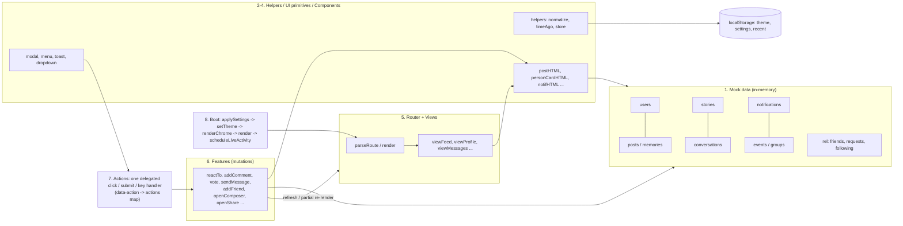
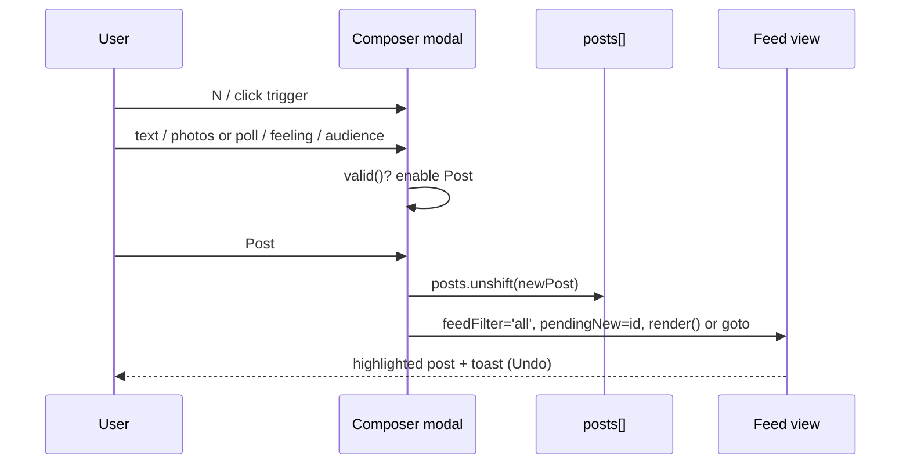

# Connect — Project Guideline

A complete guideline for the **Connect** social-network prototype (static HTML/CSS/JS, no backend). It is written for end users, developers, QA and business/product teams.

> Scope and honesty note: everything below is derived from the actual source (`index.html`, `js/app.js`, `README.md`; `css/style.css` was only used for confirming the design system exists). Where the code is silent, the item is marked **Assumption** or **Unknown / not implemented**. Nothing here is a real product rule unless it is enforced in code.

---

## Table of Contents

1. [Project Overview](#1-project-overview)
2. [User Guideline](#2-user-guideline)
3. [Business Guideline](#3-business-guideline)
4. [Feature Details](#4-feature-details)
5. [Key Workflows and Module Relationships](#5-key-workflows-and-module-relationships)
6. [Known Limitations and Gaps](#6-known-limitations-and-gaps)
7. [QA Test Checklist](#7-qa-test-checklist)
8. [Appendix: Constants, Routes, Shortcuts](#8-appendix-constants-routes-shortcuts)

---

## 1. Project Overview

### 1.1 Purpose

Connect is a **front-end-only prototype of a Facebook-style social network** (feed, stories, reactions, comments, polls, friends, messaging, groups, events, notifications, saved items, memories, search, settings, dark mode). It is a UI/UX demo: all "users" are fictional, all activity is simulated in the browser, and nothing is sent to a server.

The signed-in demo user is always **Minh Nguyễn** (`u1`, handle `minh.nguyen`, Đà Nẵng). There is **no real login form and no credentials** (see 1.6).

### 1.2 Tech stack

| Layer | Technology |
|---|---|
| Markup | Single `index.html` app shell (top bar, sidebars, mobile bottom nav, inline SVG icon sprite) |
| Styling | Plain CSS (`css/style.css`), design tokens, light + dark theme, responsive rules |
| Logic | Vanilla JavaScript (ES2020+, `'use strict'`), one file `js/app.js` (~2,230 lines), no framework, no bundler, no dependencies |
| Font | Google Fonts "Be Vietnam Pro" (400-800) loaded from `fonts.googleapis.com` (the only external network resource) |
| Routing | Hash router (`#/feed`, `#/profile/u3` ...) |
| Data | In-memory JS arrays/objects seeded at load; a few UI preferences in `localStorage` |
| Backend | None |

### 1.3 File structure

```
connect/
├── index.html          App shell: <head> (theme pre-paint script), SVG icon sprite,
│                       top bar (search, primary nav, theme, notifications, account),
│                       3-column layout (#sidebarLeft, #main, #sidebarRight),
│                       mobile bottom nav, toast root, <noscript> message
├── css/style.css       Design tokens (light/dark), components, responsive rules
├── js/app.js           Everything: mock data, helpers, UI primitives, components,
│                       views/router, features, action dispatcher, boot
├── assets/
│   ├── logo.svg, favicon.svg
│   └── photos/*.svg    13 illustrated "photos" (abstract, beach, coffee, fireworks, forest,
│                       halong, hoian, lanterns, pho, skyline, sunset, terraces, workspace)
└── README.md           Short developer README
```

`js/app.js` is organised in 8 numbered sections: 1 Mock data, 2 Helpers, 3 UI primitives, 4 Components, 5 Views & router, 6 Features, 7 Actions & events, 8 Boot.

### 1.4 How to run

1. No build, no server needed. Open `connect/index.html` directly in a modern browser (works from `file://`), **or** serve the folder with any static server (e.g. `python -m http.server`, then open `http://localhost:8000/connect/`).
2. JavaScript must be enabled (otherwise the `<noscript>` text "Connect needs JavaScript to run. Please enable it and reload the page." is shown).
3. Internet is only needed for the Google Font; without it the browser falls back to a default font (Assumption: CSS defines a fallback stack; not verified in this review).
4. It is deployed as a static page (the parent repo is a GitHub Pages site), so the URL form is `.../connect/` (Assumption based on folder name).

### 1.5 Data storage

**In memory only (lost on reload):** users, posts, memories, stories, conversations, notifications, events, groups, relationships (`rel`), saved posts (`ui.saved`), hidden posts, votes, reactions, comments, uploaded images (kept as base64 data URLs), the user's own story.

**`localStorage` (via `store.get/set`, wrapped in try/catch so failure is silent):**

| Key | Value | Written when | Default |
|---|---|---|---|
| `connect:theme` | `"light"` or `"dark"` (JSON string) | Theme toggled; also on boot (`setTheme` is called at boot) | If absent: `prefers-color-scheme` of the OS, else light |
| `connect:settings` | JSON `{ defaultPrivacy, activeStatus, previews, sounds, reduceMotion }` | Any Settings change | `{ defaultPrivacy:'friends', activeStatus:true, previews:true, sounds:false, reduceMotion:false }` |
| `connect:recent` | JSON array of recent search strings (max 6) | Each executed search / Clear | `['Hội An', 'cà phê muối']` |

The theme is applied by an inline script in `<head>` before first paint to avoid a flash. "Reset demo data" performs `location.reload()`; it does **not** clear the three localStorage keys.

### 1.6 Seed / mock data and demo credentials

- **Demo credentials: none.** The "Log out" flow only shows a full-screen overlay with a "Log back in as Minh Nguyễn" button; there is no username/password anywhere. **Unknown / not implemented:** registration, real authentication, sessions.
- **Users (14):** `u1` Minh Nguyễn (you), `u2` An Trần, `u3` Sarah Johnson, `u4` David Lee, `u5` Linh Phạm (birthday today), `u6` Hoàng Lê, `u7` Mai Võ, `u8` Kenji Tanaka, `u9` Priya Sharma, `u10` Tuấn Đặng, `u11` Emma Wilson, `u12` Bảo Ngọc, `u13` Lucas Martin, `u14` Thảo Vy. Each has `lang` (`vi`/`en`), avatar gradient colors, online flag / `lastSeen`, profile details and a cover photo.
- **Relationships of the signed-in user (`rel`):** friends = u2, u3, u4, u5, u6, u7, u8, u10; incoming requests = u12, u13; outgoing = none; following = u3, u8, u10; dismissed suggestions = none.
- **Posts (12):** p1-p12 covering text, single image, multi-image (up to 5), video, shared post (p5 shares p9), and poll (p6). **Memories (2):** m1 (3 years ago), m2 (6 years ago), both authored by you.
- **Stories (7):** u3, u5, u8, u7, u10 unseen; u4, u6 seen.
- **Conversations (7):** c1-c7 with u2, u3, u5, u4, u6, u8, u7. Unread: c1 = 2, c2 = 1.
- **Notifications (10):** n1-n10, 5 unread (n1-n5).
- **Events (5):** e1-e5 (dates are relative to load time: +2, +3, +4, +9, +12 days). e1 status `going`, e2 `interested`.
- **Groups (6):** g1 Đà Nẵng Foodies (joined), g2 UX Designers Vietnam (joined, private), g3 Vietnam Travel Tips (EN), g4 Hội Nhiếp Ảnh Phong Cảnh, g5 Cà Phê & Chuyện (joined), g6 Expats in Đà Nẵng (private).
- **Trends (5):** DaNangFireworks, HoiAn, CaPheMuoi, MuCangChai, UXDesign (static counts).
- **Saved at start:** p10, p9.
- **Time:** all seed timestamps are relative to `Date.now()` at page load, so the demo always looks "fresh".

---

## 2. User Guideline

### 2.1 Roles

Connect has **one role only**: the signed-in user (Minh Nguyễn). Every other person is a passive, simulated user. There is no admin, moderator, or group-owner role in code.

| Perspective | What the user can do |
|---|---|
| You (u1) | Everything in the UI: post, react, comment, share, vote, chat, manage friends, follow, create stories and groups, edit profile, change settings |
| Other users | Only "react" via scripted simulations (auto-accept friend request, auto-reply in chat, comment like, timed notification/message) |

### 2.2 Screens / pages

| Screen | Route | How to reach | Purpose |
|---|---|---|---|
| Home (feed) | `#/feed` (default/fallback) | Logo, Home icon, "Home" in sidebar | Stories, composer, filtered feed |
| Single post | `#/post/:id` | Click a post's time; notification links; "Shared to your feed → View" | One post with all comments expanded |
| Profile | `#/profile/:id` (`#/profile` = you) | Click a name/avatar, or your name in sidebar | Cover, stats, tabs: Posts, About, Friends, Photos |
| Friends | `#/friends` (`/requests`, `/suggestions`, `/all`) | Friends icon/sidebar | Requests, suggestions, all friends |
| Messages | `#/messages` and `#/messages/:convId` | Chat icon, "Message" buttons | Chat list + conversation |
| Groups | `#/groups` | Groups icon/sidebar | Your groups + Discover; create group |
| Events | `#/events` | Sidebar "Events", "See all" | Upcoming / Your events |
| Saved | `#/saved` | Sidebar, account menu | Posts saved |
| Memories | `#/memories` | Sidebar | "On this day" posts |
| Notifications | `#/notifications` | "See all notifications" in bell dropdown | Full list with All/Unread filter |
| Search results | `#/search/:query` | Press Enter in search box, click a hashtag | People, groups, posts |
| Settings | `#/settings` | Sidebar, account menu | Appearance, privacy, notifications, account |

Overlays (not routes): post composer, share dialog, reactions list, lightbox, story viewer, story creator, edit profile, create group, group preview, new message, keyboard shortcuts, call screen, confirm dialogs, context menus, toasts, logout screen.

Unknown routes fall back to the feed. `#/profile/<unknown id>` shows your own profile. `#/post/<unknown id>` shows "This post isn't available".

### 2.3 Layout and navigation

- **Desktop:** top bar (logo, search, 4 primary icons Home/Friends/Messages/Groups, theme toggle, notifications bell, account avatar) + left sidebar (your profile, Home, Friends, Groups, Messages, Saved, Memories, Events, Settings, "Your groups") + main column + right sidebar (birthday widget, Contacts, People you may know, Trending, Upcoming events).
- **Tablet/mobile (<= 900 px):** left sidebar becomes a slide-in **drawer** (menu button or bottom "Menu"). **<= 560 px:** search collapses to an icon; a back arrow closes it. Bottom nav: Home, Friends, **+ (Create post)**, Chats, Menu.
- Badges: red counters on Friends (pending requests), Messages (number of unread *conversations*), Bell (unread notifications). Browser tab title shows `(n) Page · Connect` where n = unread notifications + unread conversations.
- The "Skip to content" link jumps to `#main` (accessibility).

### 2.4 Step-by-step: main tasks

**Create a post**
1. Click "What's on your mind, Minh?" (or press `N`, or mobile "+" button, or the Photo/Poll/Feeling shortcuts).
2. Choose audience (Public / Friends / Only me; default from Settings, initially Friends).
3. Type text and/or add photos (sample gallery or "Upload from device") or a poll or a feeling.
4. Click **Post** (disabled until valid). The post appears at the top of the feed with a highlight; a toast "Your post is live" offers **Undo**.

**Create a poll post**
1. Open the composer, click the poll tool. Type the question in the main text box (post text becomes the question).
2. Fill at least 2 options (max 4; up to 80 chars each). The button reads "Add a question and 2 options" until valid.
3. Post. The poll runs "7 days" (label only).

**React, comment, share, save**
- Click **Like** to like / unlike. Hover (desktop) or long-press (touch, 420 ms) to open the 6-reaction picker (Like, Love, Haha, Wow, Sad, Angry). Choosing the reaction you already have removes it.
- Click the reaction summary (e.g. "You and 12 others") to see who reacted (filter by type).
- Type in "Write a comment…" and press Enter/Send. Under a comment: **Like**, **Reply** (pre-fills `@FirstName `), **Delete** (own comments only, with Undo).
- **Share:** choose audience, optional message, "Share to feed"; or send to a friend in Messages; or Copy link / More options.
- **Save:** bookmark toggle; find under Saved.
- **Post menu (…):** Save/Unsave, Copy link, Edit audience (own posts) or Hide post (others'), Delete post (own) or Message author (others').

**Vote in a poll**
1. Click an option. Results (percentages) appear with an animation; your choice shows a check.
2. Click another option to change your vote ("Vote changed"), or **Remove my vote**.

**Stories**
- View: click a story tile; tap right/left or use arrows to advance; hold to pause; Space toggles pause; reply to others' stories with text or a heart.
- Create: "Create story" tile or "Add to story" on your profile; choose Text (140 chars, 6 backgrounds) or Photo (sample or upload, optional 80-char caption); **Share to story**.

**Friends**
- Add friend from profile / suggestions / search / right sidebar. After 7-10 s the other person "accepts" automatically.
- Incoming requests (u12, u13): **Confirm** or **Delete** from Friends > Requests, the bell dropdown, or their profile.
- Unfriend / Follow-Unfollow / Message from the "Friends" button menu.

**Messaging**
1. Open Messages (desktop auto-opens the most recent chat). Use the pencil icon for "New message" (friends only), or "Message" buttons anywhere.
2. Type and press **Enter** (Shift+Enter for newline). Buttons: photo, emoji (12 emojis), quick 👍, phone/video call (simulated).
3. The contact shows "typing…" and replies with a canned message.

**Groups and events**
- Groups: Join / Preview / View group; inside the preview: Invite friends, Leave group. "Create group" needs a name.
- Events: toggle **Interested** / **Going** (click again to remove). "Your events" tab lists events with a status.

**Search**
1. Click the search box (or press `/`). With empty input you see recent searches (Clear to wipe).
2. Type: quick results (up to 5 people, 3 groups). Press Enter or "See all results…" for the full results page.
3. Accents are optional ("ca phe" finds "cà phê"; "d" matches "đ").

**Notifications**
- Bell dropdown shows 8 latest; filter All/Unread; "Mark all as read"; clicking an item marks it read and navigates to its link.

**Profile**
- Own profile: Edit cover, change profile picture, Edit profile (name required, bio 160 chars), Add to story.
- Other profile: Add friend / Confirm / Request sent, Message, Follow / Following.

**Settings** (auto-saved): Theme (Light/Dark), Reduce motion, Default audience, Show active status, Message previews, Sounds, Edit profile, Reset demo data, Log out.

### 2.5 Keyboard shortcuts (from the in-app dialog and code)

| Key | Action |
|---|---|
| `/` | Focus search (opens mobile search on <= 560 px) |
| `N` | Open the "Create post" composer |
| `Esc` | Close menu, emoji panel, top modal, dropdown, drawer, mobile search, reaction picker (in that priority) |
| `←` `→` | Previous/next photo (lightbox) or story slide; also seek -10 s / +10 s when the video seek bar is focused |
| `Space` | Pause/resume story |
| `Enter` | Send message |
| `Shift+Enter` | New line in message |
| `Tab` | Focus is trapped inside open modals |

Shortcuts `/` and `N` are ignored while typing in a field, while a modal is open, with Ctrl/Alt/Meta, or while the logout screen is displayed.

---

## 3. Business Guideline

### 3.1 Domain overview

A single-user-perspective social graph: the signed-in user has **friends** (mutual), **followings** (one-way), and pending **requests** (in/out). Content (posts, stories) appears in the user's feed based on friend/follow relationships. Engagement = reactions, comments, shares, polls, saves. Communication = 1:1 chats. Community = groups and events.

### 3.2 Entities

**User**

| Field | Type / values | Notes |
|---|---|---|
| id | `u1`..`u14` | `ME = 'u1'` |
| name, handle | string | Handle shown as `@handle` |
| lang | `vi` / `en` | Picks canned chat-reply language and birthday wish text |
| colors | [c1, c2] | Gradient avatar with initials (first + last word initial); `photo` overrides (only set after upload) |
| online, lastSeen | bool, timestamp | Presence: "Active now" / "Active 2h ago" / "Offline" |
| bio, location, work, education, hometown, joined, website, relationship | string | Shown in Intro/About via `infoItems` |
| cover | image path/data URL | Profile cover |
| followers, following | number | `followers` changes when you follow/unfollow |
| friendCount | number (optional) | Display value; for you it is `rel.friends.size` |
| birthday | bool | u5 only; drives the birthday widget |

**Post** (also used for memories)

| Field | Values / notes |
|---|---|
| id, userId, time | `p1`..; generated ids via `uid('p')` |
| type | `text`, `image`, `images`, `video`, `shared`, `poll` |
| privacy | `public` (Public), `friends` (Friends), `private` (Only me) |
| text, location, feeling | Optional; hashtags (`#word`) and newlines rendered; feeling renders "is feeling …" |
| images | [{src, alt}] (grid shows max 4 + "+N") |
| video | {poster, duration (s), title}; `views` string |
| sharedId | Id of original post (type `shared`) |
| poll | {options:[{id,text,votes}], myVote, endsIn} |
| reactions | map key -> count (`like, love, haha, wow, sad, angry`) |
| myReaction | one of the keys or null |
| shares | count |
| comments | [{id, userId, text, time, likes, liked}] |

**Story**: `{ userId, seen, slides:[{type:'image'|'text', src|text|bg, caption?, time}] }`.
**Conversation**: `{ id, userId, unread, seen, typing?, messages:[{from, text | image | postRef, time, ctx?}] }` (1:1 only).
**Notification**: `{ id, type, userId, text, time, read, link }`; types: `reaction, comment, friend_request, friend_accept, follow, message, event, group, birthday`.
**Event**: `{ id, title, date, place, cover, going, interested, status: 'going'|'interested'|null, host }`.
**Group**: `{ id, name, members, cover, joined, privacy: public|private, desc, activity, discussion:[{userId,text,time}] }`.
**Relationships (`rel`)**: `friends` (Set), `requestsIn` (array), `requestsOut` (Set), `following` (Set), `dismissed` (Set).
**Settings**: see 1.5. **UI state** (`ui`): route, feed filter, tabs, expanded comment threads, video playback, saved set (initial p10, p9), hidden set, own story, recent searches.

**Relationships between entities**

```
User 1─* Post ─* Comment (each Comment -> User)
Post 0..1─ Post          (type 'shared' -> sharedId)
Post 0..1─ Poll ─* Option
User 1─* Story ─* Slide
Me 1─* Conversation *─1 User ─* Message (Message may reference Post via postRef)
Me ─(friends|following|requestsIn|requestsOut|dismissed)─ User
Notification -> User (actor), -> link (post/profile/messages/events/groups)
Event.host -> User;  Group.discussion[].userId -> User
```

### 3.3 Relationship states and transitions (friend graph)

`relationOf(id)` returns one of: `me`, `friend`, `incoming`, `outgoing`, `none`.

| From | Action | To | Side effects |
|---|---|---|---|
| none | Add friend | outgoing | Toast with Undo; 7-10 s later auto-accept (see below) |
| outgoing | Cancel request / Undo toast | none | Toast "Friend request cancelled" (Cancel button) |
| outgoing | (simulated) auto-accept after 7000 + rand(0..3000) ms | friend | Adds `friend_accept` notification "accepted your friend request. Say hi 👋", toast, chime, badge bump |
| incoming | Confirm | friend | Matching `friend_request` notification is converted to `friend_accept` ("is now your friend. Say hi 👋") and marked read |
| incoming | Delete | none | Matching `friend_request` notifications removed |
| friend | Unfriend (confirm dialog) | none | Also removes from `following`; toast "X was removed from your friends" |
| any non-me | Follow / Unfollow | following on/off | `followers` +1 / -1 on that user; independent of friend state |
| suggestion | Remove (x) | dismissed | Hidden from suggestions permanently (in session) |

`suggestions()` = all users except you, friends, incoming requesters and dismissed users (so people with an outgoing request still appear, labelled "Requested").

The friend action for an outgoing request is cancelled if the user cancels before the timer fires (the timer checks `requestsOut.has(id)`).

### 3.4 Permissions per role (single-role; ownership rules)

| Capability | Own content | Others' content | Enforced in code |
|---|---|---|---|
| Edit audience of a post | Yes | No (menu shows Hide instead) | Menu only |
| Delete a post | Yes (confirm dialog) | No | Menu only |
| Hide a post | n/a | Yes (session only, with Undo) | Yes |
| Delete a comment | Yes (own comments show Delete) | No | UI only |
| Like / reply to comment | Yes | Yes | - |
| Edit profile / cover / avatar | Yes | No buttons on others | UI only |
| View story reply box | Hidden on own story | Shown | Yes |
| Vote in poll | Own poll allowed | Allowed | No restriction |
| Message | Only friends listed in "New message" | Any user via profile "Message" | Chat with non-friend shows "You are not friends yet." |
| Privacy visibility (Friends / Only me) | **Not enforced** for readers (see limitations) | | Label/icon only |

### 3.5 Statuses

| Object | Statuses |
|---|---|
| Friend relation | none / outgoing / incoming / friend (3.3) |
| Event status (per user) | `null` (none), `interested`, `going` (mutually exclusive, toggle off by re-click) |
| Poll | Not voted (`myVote=null`) / voted (`myVote=optionId`); "ended" is **not implemented** (`endsIn` is a label) |
| Message delivery (last own message) | "Sent" (`seen=false`) then "Seen" (`seen=true`, set ~0.9 s after your message by the simulation) |
| Conversation | `unread` count, `typing` flag |
| Notification | unread / read |
| Story | unseen (colored ring) / seen (grey ring); set when opened |
| Group membership | joined / not joined; privacy public / private (label only) |
| Presence | Active now / Active {time} ago / Offline; your own presence follows the "Show active status" setting |
| Post | visible / hidden (session) / deleted (removed from array) |
| Reaction (mine) | null or one of 6 keys |

### 3.6 Calculations and display formulas

| Item | Formula / rule |
|---|---|
| Reaction total | Sum of all `reactions` values |
| Reaction summary label | Own reaction present: total = 1 -> "You"; else "You and {plural(total-1,'other')}"; no own reaction -> `fmtCount(total)`. Top 3 emojis by count. Nothing shown if total = 0 |
| Toggle reaction (`reactTo`) | key given: same as current -> remove; different -> switch (old -1, new +1). No key (Like button): has any reaction -> remove; none -> 'like'. Counts floor at 0 |
| Poll percent | `round(votes / totalVotes * 100)`; 0 if total 0. Percentages shown only after you have voted. Change vote: old option -1, new +1. Remove vote: -1 |
| `fmtCount(n)` | >= 1,000,000 -> `x.xM`; >= 10,000 -> rounded `K`; >= 1,000 -> `x.xK`; else raw. `.0` trimmed |
| `plural(n, w)` | `"{fmtCount(n)} {w}{s if n≠1}"` |
| `timeAgo` | < 1 min "Just now"; < 1 h "{m}m" / "{m} min ago"; < 24 h "{h}h" / "{h} hour(s) ago"; exactly 1 day (long form) "Yesterday at HH:MM"; < 7 d "{d}d" / "{d} days ago"; else date (`en-GB`, year shown only if not current year) |
| Presence text | "Active now", "Active {timeAgo} ago", or "Offline" |
| Friend count | You: `rel.friends.size`; others: `friendCount` field or synthetic list length |
| Mutual friends | Friends of the other user (synthetic, see below) intersected with your friends; none for yourself |
| Synthetic friends of others | `friendsOf(id)`: all users except that user, excluding index positions where `(i + idx) % 3 === 0`; purely deterministic filler |
| Unread badges | notifications: count of `read === false`; messages: number of conversations with `unread > 0`; requests: `requestsIn.length`; shown `99+` above 99 |
| Event counters | Changing status: previous counter -1, new counter +1; toggling off just decrements |
| Group members | Join +1, Leave -1; created group starts at 1 |
| Video progress | Simulated ticking every 250 ms by 0.25 s, up to `duration`; time format `m:ss` |
| Message grouping | Consecutive messages by same sender within 5 min on same day share a bubble group |
| Day separators | "Today", "Yesterday", or weekday + date |
| Big text style | Text posts with < 90 chars and no newline render in large type |
| Emoji-only bubble | Text of 1-12 pictographs/whitespace and no digits renders as large emoji |
| Story timer | 5000 ms per slide (`DURATION`) |
| Memory label | `{currentYear - postYear} years ago today` (year difference only) |

### 3.7 Important business scenarios

| Scenario | Expected behavior in the prototype |
|---|---|
| You follow a non-friend | Their posts enter your feed (feed = you + friends + followed) |
| You unfriend someone | They also leave `following`, so their posts leave your feed |
| You post with default privacy | Audience = Settings > Default audience (initially "Friends") |
| Friend request you send | Auto-accepted in ~7-10 s unless cancelled |
| Someone replies in chat | Canned reply in the contact's language after ~0.9 s + 1.4-2.8 s |
| You comment on someone else's post | The comment gets +1 like ~3.5 s later ("the author noticed") |
| Original of a shared post is deleted | The share shows "This post isn't available anymore." |
| Live events (timed after load) | +16 s: Sarah (u3) sends "Also, which beach is best for sunrise? 🌅" in c2; +30 s: p8 gets +1 Wow and a notification from u9 |

---

## 4. Feature Details

Format for each feature: inputs, outputs, rules, messages, edge cases. Character limits are HTML `maxlength` attributes.

### 4.1 Routing and shell
- **Input:** `location.hash`. Format `#/view[/param...]`; param is `decodeURIComponent`-ed (whole remainder joined with `/`).
- **Output:** renders into `#main`, sets `body.view-{name}`, toggles `is-wide` for profile, messages, friends, groups, events; updates active nav and page title (`{title} · Connect`).
- **Rules:** unknown view -> feed. Navigating scrolls to top and focuses `#main`. `refresh()` re-renders keeping scroll.
- **Edge cases:** A malformed percent sequence in the hash (e.g. `#/search/%E0%A4%A`) would make `decodeURIComponent` throw (no try/catch) - see limitations. Messages route on desktop (>= 769 px) with no id rewrites the URL (replaceState) to the latest conversation.

### 4.2 Feed
- **Sources:** posts by you, friends, or followed users; hidden posts excluded; sorted newest first.
- **Filters (chips):** All posts, Friends (friends only), Photos (`image`/`images`), Videos, Polls, My posts.
- **Loading:** first visit shows skeleton stories and 2 skeleton posts for 700 ms (`aria-busy`), then real content. Later visits are instant.
- **Empty state:** "No posts match this filter" / "Try another filter, or share something yourself." + "Create post".
- **End marker:** "You're all caught up".
- **Note:** There is no pagination or infinite scroll; all matching posts render at once.

### 4.3 Post composer
- **Inputs:** text (max 5000), audience, photos (samples: 9 built-in; upload: images only, up to 10 files per pick, no total cap), poll options, feeling (one of 8: happy, excited, relaxed, inspired, grateful, caffeinated, sleepy, motivated).
- **Validity (`valid()`):** poll mode -> non-empty text AND >= 2 non-empty options; otherwise non-empty text OR >= 1 image. Post button disabled otherwise. Button label in poll mode when invalid: "Add a question and 2 options".
- **Rules:** photos and poll are mutually exclusive (each tool is disabled while the other is active). Poll: 2 options minimum, 4 maximum, option text max 80; blank options are dropped on submit; options get ids `o0..`; `endsIn: '7 days'`; `votes: 0`. 1 image -> type `image`, >1 -> `images`. Sample photo already added is not added twice. Feeling can be toggled off by clicking again. Feeling can accompany any type.
- **Result:** new post at top; feed filter reset to "All posts"; `pendingNew` highlights it; if not on the feed, navigates to `#/feed`. Toast "Your post is live" with **Undo** (removes the post; only re-renders if you are still on the feed).
- **Edge cases:** whitespace-only text is invalid. Uploaded files that are not images are silently ignored; failed reads are dropped. Undo after navigating away removes the post from data but the visible page is not refreshed until next render.

### 4.4 Reactions
- **Inputs:** click Like (toggle) or a reaction option; long-press (touch) opens picker (`longPressed` guard prevents the click from also toggling).
- **Outputs:** footer re-rendered with emoji, colored label, updated summary.
- **Reaction list dialog ("Reactions"):** shows tabs All + each reaction type with counts. Listed people are **fabricated**: you (if reacted) plus other users assigned round-robin to reaction kinds, up to `min(total, 9)`; remaining shown as "and N others". Not real data.

### 4.5 Comments
- **Inputs:** text (max 1000, trimmed; empty ignored). Enter or Send.
- **Display:** last 2 comments by default; "View {n} more comment(s)" expands; the single post page expands all.
- **Actions:** Like toggle (count +1/-1, "👍 n" chip), Reply (fills `@FirstName `), Delete own comment with toast "Comment deleted" + **Undo** (re-inserts at original index).
- **Rules:** New comment is appended at the end (chronological). Comment counter in footer updates. If the post author is not you, the comment receives a +1 like after 3.5 s (only if still present).
- **Edge cases:** Reply does not create a nested thread (flat list). Comment text supports hashtags (linked) and newlines display.

### 4.6 Share
- **Share to feed:** creates `type: 'shared'` post with `sharedId` = original post id (if you share a shared post, the *original* is referenced), chosen audience (default from Settings), optional message. Increments `shares` on the post you clicked. Toast "Shared to your feed" + **View**.
- **Send in Messages:** one button per friend (online first). Sends a `postRef` message (+ optional text message) without triggering auto-reply; button marked "Sent" (a second click is ignored). Toast "Sent to {name}".
- **Copy link:** builds `{page url without hash}#/post/{id}`; uses Clipboard API, falls back to `execCommand('copy')`; toast "Link copied to clipboard" or "Copy failed. Select the address bar to copy the link." "More options" uses `navigator.share` when available, else copies.

### 4.7 Save, hide, delete, audience
- **Save:** toggles membership in `ui.saved` (in-memory). Toasts: "Saved to your collection" (View) / "Removed from saved" (Undo).
- **Hide post:** replaces the post with "Post hidden - You'll see fewer posts like this." + Undo. Hidden posts are excluded from feed and search until unhidden (session only). Note: "fewer posts like this" is only wording; nothing else is filtered.
- **Delete post:** confirm dialog "Delete post?" / "This post will be removed from your profile and your friends' feeds. You can't undo this." (Delete/Cancel). Removes from `posts`, from saved, fade-out, toast "Post deleted"; on the single post page navigates to the feed.
- **Edit audience:** sub-menu with three options (check mark on current); toast "Audience changed to {label}".

### 4.8 Polls
- **Vote:** clicking your current vote does nothing. First vote toast "Vote counted"; change -> "Vote changed".
- **Unvote:** "Remove my vote" link; decrements; no toast.
- **Display:** vote total "{n} vote(s)", "Ends in {endsIn}" (static label), percentages only after voting.
- **Edge cases:** seeded poll totals include other people's votes; no "poll closed" logic; you can vote in your own poll.

### 4.9 Video (simulated)
- Poster image with a play button; playing advances a fake progress bar (250 ms tick) - no real media. Only one video plays at a time; navigating pauses all (`stopVideos`). Clicking the track seeks; arrow keys on the focused track seek +-10 s. Replay restarts from 0 when finished. "12K views" is a static string.

### 4.10 Lightbox / photo viewer
- Opens from post images (`data-index`), profile photo grid, or chat images. Prev/next wrap around, swipe > 50 px, arrow keys (only when it is the top modal), counter "i / n" (hidden for single image), caption = post text truncated to 200 chars or image alt. Posts show at most 4 thumbnails; the 4th shows "+N" for extra images.

### 4.11 Stories
- **Viewer:** each slide lasts 5 s (progress bars); auto-advance across slides and users, closes after the last. Tap zones (left/right), hold >= 220 ms pauses, Space pauses, focusing the reply input pauses. Opening marks the user's story `seen`. Your own story shows "Your story" and no reply form. Arrow buttons disabled at very first/last slide.
- **Reply:** typing + Enter, or ❤️ button. Sends a chat message (with context label "You replied to their story") to that user's conversation (creates it if needed), triggers the auto-reply simulation, toast "Reply sent to {name}". Empty reply ignored.
- **Creator:** Text mode (max 140, 6 gradients) or Photo (sample / upload single image, caption max 80). "Share to story" is disabled until text is non-empty (text mode) or an image chosen (photo mode). On success toast "Your story is live for 24 hours" (View). **Note:** the 24-hour expiry is not implemented - only message text.
- Your story is stored in `ui.myStory` (multiple slides can be added) and appears first in the tray.

### 4.12 Friends module
- **Tabs:** Requests (default if any pending, else Suggestions), Suggestions, All friends (each with a count chip). Remembered in `ui.friendsTab`.
- **Empty states:** "No pending requests" / "When someone sends you a friend request, it will show up here."; "No new suggestions" / "Check back later for people you may know."; "No friends yet" / "Add people you know to see their posts and chat with them."
- **All friends:** sorted by name, live filter "Search your friends" (accent-insensitive), Message button and "more" menu (Message, Follow/Unfollow, Unfriend).
- **Unfriend dialog:** "Unfriend {name}?" / "{First} won't be notified. You'll stop seeing each other's friends-only posts." (Unfriend/Cancel).
- **Toasts:** "Friend request sent to {name}" (Undo), "{name} accepted your friend request" (Message), "You and {name} are now friends", "Request deleted", "Friend request cancelled".

### 4.13 Profile
- **Header:** cover, avatar (initials on gradient unless uploaded), name, `@handle`, bio, stats (posts = number of that user's non-memory posts, friends, followers, following), mutual friends line, action buttons (own vs other).
- **Tabs:** Posts (Intro, 9 photos, 6 friends preview, then posts; own profile also has a composer), About (info list + friends/followers), Friends (with search), Photos (all images from that user's posts and memories + cover, de-duplicated by `src`).
- **Empty:** "No posts yet" / own: "Share your first update with friends." / other: "{First} hasn't posted anything yet."
- **Edit profile:** fields Name (required, max 40), Bio (max 160, live counter "n/160"), Lives in (60), From (60), Work (80), Education (80), Website (80, no format validation), cover and avatar via image upload. Error text: **"Your name can't be empty."** Success toast "Profile saved". Changes apply to the in-memory user only. Cover/avatar quick-change toasts: "Profile picture updated" / "Cover photo updated".
- **Follow:** `aria-pressed` toggles "Follow" <-> "Following"; friend-menu Follow explains "See their public posts first" / "Stay friends but see fewer posts" (wording only).

### 4.14 Messaging
- **List:** sorted by last message time; search matches contact name and any message text (accent-insensitive); empty: "No conversations found" / "Try a different name or word." Preview: "typing…", "Say hello 👋" (no messages), "New message" (if previews off and unread), "You: " prefix, "📷 Photo", "Shared a post".
- **Chat:** header (presence, voice/video call icons, profile link), body with day separators, grouped bubbles, time, "Seen"/"Sent" under your last message, typing indicator. Empty chat shows contact card: "You're friends on Connect." or "You are not friends yet." + "Say hello 👋".
- **Composer:** textarea (max 2000, auto-grows to 120 px), Enter sends, Shift+Enter newline, IME composing respected, emoji popover (12 emojis: 😀 😂 😍 🥰 😮 😢 👍 🙏 🎉 🔥 ❤️ ☕), photo attach (images only; each selected image is sent as its own message; up to 10 per pick), quick 👍 (sends text "👍").
- **Simulation (`simulateReply`):** after 900 ms the chat is marked Seen and typing starts; after a further 1400-2800 ms a random canned reply (6 Vietnamese or 6 English, by the contact's `lang`) is added. Re-sending cancels pending timers of the previous simulation. Shared-post sends and story replies use the same mechanism (except the share dialog, which disables auto-reply).
- **Incoming when chat not open:** unread +1, toast "**{name}**: {preview}" (Reply), chime (if Sounds on), badge bump. If previews are off, toast text is "sent you a message".
- **Read state:** opening a conversation resets its `unread` to 0.
- **New message dialog:** lists **friends only**, search by name; choosing opens (or creates) the conversation.
- **Birthday wish:** widget "Send wish" (u5) opens chat with the text prefilled (Vietnamese "Chúc mừng sinh nhật {First}! 🎂🎉" or English "Happy birthday, {First}! 🎂🎉"), not auto-sent.
- **Call (simulated):** modal "Calling…" / "Starting video call…"; at 1.5 s "Ringing…"; at 6 s either "{First} didn't answer. Try sending a message." (contact online) or "{First} is offline right now." (offline). No media/audio. End button closes.
- **Mobile:** list and chat are separate panes (back arrow "Back to chats").

### 4.15 Groups
- **Cards:** name, Public/Private label, member count, description, "activity" line (joined groups only), buttons.
- **Preview modal:** cover, description, "Recent discussion" (static seed posts), Join / (Invite friends, Leave group).
- **Join:** `joined=true`, members +1, sidebar refresh, toast "You joined {name}". **Leave:** confirm "Leave {name}?" / "You'll stop seeing posts from this group. You can join again any time." (Leave group); members -1; toast "You left {name}". **Invite friends:** toast "Invites sent to {min(3, friend count)} friends" (no real invite).
- **Create group:** Name (required, max 60), Description (max 200; default "A new group on Connect."), Privacy (Public / Private). Error: **"Give your group a name to continue."** Result: added first, `joined: true`, `members: 1`, random sample cover, `activity: 'Created just now'`, seed welcome post "Welcome to {name}! Introduce yourself 👋"; toast "{name} was created".
- **Empty states:** "You haven't joined any groups" / "Groups are where people with shared interests talk. Pick one below to get started."; "You've joined every suggested group".
- **Not implemented:** posting inside a group, member lists, admin roles, real private-group access control.

### 4.16 Events
- Only events with `date > now` are listed, sorted ascending. Tabs: **Upcoming** (all) and **Your events** (status set).
- Card: date chip, weekday/date/time, title, place, "{going} going, {interested} interested", Interested and Going buttons (toggle, mutually exclusive).
- Toasts: "You're going to {title}", "Marked as interested", "Removed from your events".
- Empty: "No events on your list" / "Mark events as Interested or Going and they will be collected here." + "Browse upcoming events".
- **Not implemented:** create event, event detail page, RSVP by others, past-event display. `host` is stored but not displayed.

### 4.17 Notifications
- Dropdown (8 latest) and full page. Filter All / Unread. Empty: "You're all caught up" / "New activity on your posts and requests will show up here."
- Each item: actor avatar with type badge, "{Name} {text}", time; friend-request items with pending requests show inline Confirm/Delete.
- Clicking marks it read and navigates to `link` (if already on that hash, re-renders).
- "Mark all as read" -> toast "All notifications marked as read".
- New notifications are created for: accepted friend request, the timed Wow reaction. Your own actions do not generate notifications.

### 4.18 Saved and Memories
- **Saved:** lists saved posts/memories newest first; "{n} item(s)". Empty: "Nothing saved yet" / "Tap Save on any post to keep it here for later." + "Browse your feed".
- **Memories:** heading "On this day, {d Month}"; shows **all** memories regardless of today's date, labelled "{n} years ago today". You can save/react/comment like normal posts. Deleting a memory does not work (see limitations).

### 4.19 Search
- **Dropdown:** empty input -> recent searches (or hint "Search for people, groups or posts. Accents are optional: “ca phe” finds “cà phê”."). Typing (100 ms debounce) -> People (name match, max 5), Groups (name match, max 3), "See all results for “…”".
- **Results page:** matching against normalized text (lowercase, diacritics removed, đ->d). People: name + handle + location. Groups: name + description. Posts: text + author name + location, excluding hidden. Matches highlighted with `<mark>` in post text and people names. Heading: `Results for “{q}”`, count "{n} result(s)".
- **No result message:** "No results found" / `Nothing matches “{q}”. Check the spelling or try a shorter word. Accents are optional, so “ca phe” also finds “cà phê”.`
- **Recents:** max 6, case-insensitive de-dupe, most recent first, persisted.
- **Hashtags:** `#tag` in text (must be preceded by start/whitespace) links to `#/search/%23tag`; trends link the same way. The leading `#` is stripped when highlighting.
- **Edge cases:** an empty query route (`#/search`) matches everything (empty string is included in every text). Search of posts ignores the friend/follow/privacy filters used by the feed.

### 4.20 Settings, theme, logout, reset
- **Theme:** toggle in top bar, account menu, or Settings segmented control; persisted; updates `<meta name="theme-color">` (`#121B1A` dark, `#FFFFFF` light).
- **Toggles:** each shows toast "{label} on/off"; Sounds on plays a test chime. Reduce motion adds `body.reduce-motion`. Active status off makes you appear offline in your own UI (avatar dots); no other user sees it (Assumption: cosmetic).
- **Default audience:** select; toast "New posts will default to {label}".
- **Reset demo data:** confirm "Reset demo data?" / "All posts, comments, messages and friend changes from this session will be undone." (Reset) -> page reload.
- **Log out:** confirm "Log out of Connect?" / "You can log back in any time. This demo keeps your session on this device." (Log out) -> overlay "See you soon, Minh" / "You've logged out of Connect." with button "Log back in as Minh Nguyễn"; clicking it removes the overlay and toasts "Welcome back, Minh". No data or state is cleared; the underlying app remains loaded.

### 4.21 Toasts, dialogs, accessibility
- Toasts: max 3 visible (oldest dropped), auto-dismiss 3.6 s by default, optional action button (clears the timer), `role="status"`.
- Modals: stackable, focus trapped, Esc closes top one, focus restored to the trigger, body scroll locked.
- Menus: arrow-key navigation; Tab closes.
- Accessibility features present: skip link, ARIA roles/labels, `aria-pressed/expanded/live`, screen-reader-only text, reduce-motion option, noscript notice.

---

## 5. Key Workflows and Module Relationships

### 5.1 Architecture and data flow



Pattern: **state -> pure HTML-string component -> `innerHTML` -> event delegation**. Mutations directly change the data objects and then call a targeted refresher (`refreshFooter`, `refreshComments`, `updatePoll`, `renderConvList`, `paintChat`) or the whole view (`refresh()`). Cross-module refresh after friend changes goes through `afterRelationChange()` (badges, right sidebar, notification dropdown, and the current view if it is friends/profile/search/notifications/feed).

### 5.2 Event flow (delegation)

```
click anywhere
 -> close dropdowns/menus/emoji/reaction picker if click outside
 -> el = closest('[data-action]')  -> actions[name](el, event)
submit  -> forms[data-form]  (comment | message)
change  -> [data-setting] (default privacy)
keydown -> Esc chain, Tab trap, '/' 'N' shortcuts, Enter send, video seek
pointerdown -> long-press on Like (touch) opens reaction picker
hashchange -> render()
```

### 5.3 Workflow: creating a post



### 5.4 Workflow: friend request lifecycle

```
none --Add friend--> outgoing --(7-10 s timer)--> friend
  ^                     |  ^                          |
  |   Cancel / Undo ----+  |                          | Unfriend (confirm)
  +------------------------+--------------------------+
incoming --Confirm--> friend           incoming --Delete--> none
```
After each transition: badges update, right sidebar (contacts, suggestions) re-renders, and notification dropdown/current view refresh.

### 5.5 Workflow: messaging and simulated reply

```
Send (Enter) -> push message {from:ME} -> seen=false ("Sent")
   -> paintChat + renderConvList
   -> +900 ms: seen=true, typing=true
   -> +1.4-2.8 s: typing=false, push random canned reply (by contact.lang)
        -> onIncoming: if chat open -> paint; else unread+1, toast, chime, badge bump
```

### 5.6 Workflow: share

```
Share button -> modal
  ├─ Share to feed -> new 'shared' post (sharedId = original) -> shares+1 on clicked post -> feed re-render (if on feed)
  ├─ Send to friend -> convWith(friend) -> message{postRef} (+ text) -> bubble links to #/post/:id
  └─ Copy link / native share
```

### 5.7 Module dependency summary

| Module | Depends on | Notes |
|---|---|---|
| Views | Components, data, `ui` state | Read-only on data except through features |
| Components | data, helpers | Pure string builders |
| Features | data, Components (partial refresh), toast/modal | All writes happen here |
| Actions | Features, UI primitives | Single dispatch table `actions` |
| Notifications badge | `notifications`, `conversations`, `rel.requestsIn` | `updateBadges()` |
| Sidebars | `rel`, `groups`, `events`, `users`, `trends` | Re-rendered on relation/group/event changes |
| Search | `users`, `groups`, `posts`, `normalize`, `highlight` | Separate dropdown and results view |

---

## 6. Known Limitations and Gaps

Observed in code (no fixes implied).

| # | Area | Observation |
|---|---|---|
| 1 | Persistence | All content is in memory; reload restores seed data. Only theme, settings and recent searches persist. |
| 2 | Authentication | No real login/registration; the logout screen is cosmetic and clears nothing. **Unknown / not implemented:** multi-user accounts, passwords, session expiry. |
| 3 | Privacy enforcement | Audience (Public/Friends/Only me) is a label. Profile and search show posts regardless of audience or friendship. Seeded "friends" posts from non-friends could appear in search. "Only me" has no filtering effect. |
| 4 | Story expiry | "Live for 24 hours" text only; stories never expire. |
| 5 | Poll closing | `endsIn` is static text ("2 days", "7 days"); no deadline or close logic. |
| 6 | Reactions list | Reactor names are synthetic (round-robin over other users), not tied to real data. |
| 7 | Friends of others | `friendsOf`/mutual friends for other users are generated by an index formula; not real relations. |
| 8 | Memories | Shows all seeded memories regardless of date; cannot create memories. Post menu "Delete" on your memory shows the confirm/toast and fades the element, but `deletePost` only filters `posts`, so the memory remains after re-render. Its "shares" count and edit-audience also work only in memory. |
| 9 | Search edge | Empty query route returns everything. Malformed `%` in hash can throw in `parseRoute` (no try/catch). |
| 10 | Notifications | No delete/dismiss; limited generation (only accept and one timed reaction); comment/reaction by other users are not generated from real actions. Notification link `#/events`/`#/groups` open lists, not the specific item. |
| 11 | Messaging | 1:1 only; no delete/edit/reactions on messages; no group chats; unread badge counts conversations, not messages; replies are random canned text; calls have no media; conversation created via "Message" persists even if empty (listed with "Say hello 👋"). |
| 12 | Groups | No posting, members, admins or real privacy; "Invite friends" only shows a toast. |
| 13 | Events | No create/edit/detail; `host` not displayed; past events hidden; going/interested counters only reflect your own toggle. |
| 14 | Files | Uploaded images are read as base64 data URLs with no size limit or compression (large files may bloat memory). Non-image files ignored silently. |
| 15 | Validation | Website field has no URL validation; group/profile names have length limits only through `maxlength`; text content has no profanity/spam checks. |
| 16 | Video | Simulated progress only; no real video. |
| 17 | Performance | Feed renders all posts at once; whole `innerHTML` re-renders on `refresh()`; no virtualization. |
| 18 | Timing | Simulations (friend acceptance, replies, 16 s and 30 s live events) use `setTimeout`; they may fire while the user is on another page or after a log out overlay. Undo of "Your post is live" does not refresh non-feed views. |
| 19 | Follow semantics | Follow button on friends menu is described as "See their public posts first"; the feed does not implement priority ordering, only inclusion. "Hide post" says "fewer posts like this" but only hides that single post. |
| 20 | i18n | UI is English; content in seed data is mixed Vietnamese/English. No language switch. |
| 21 | Accessibility | Reaction list, timeouts (3.6 s toasts) and hover pickers rely on pointer support; Escape handling is thorough, but no automated a11y test exists. |
| 22 | Testing | No automated tests, linting or build pipeline in the folder. |
| 23 | External dependency | Google Fonts request; offline/CSP-restricted environments fall back to default fonts (Assumption). |

---

## 7. QA Test Checklist

Legend: P = precondition. Expected results derive from the code. Use a fresh reload for each section unless noted. Browsers: latest Chrome/Edge/Firefox/Safari; also test `file://` and http.

### 7.1 Boot, theme, storage
- [ ] Open the app: feed shows skeletons ~0.7 s, then stories and posts; no console errors.
- [ ] First visit with OS dark mode and no `connect:theme` -> dark theme; with light OS -> light.
- [ ] Toggle theme (top bar, account menu, Settings): UI changes, icon swaps sun/moon, reload keeps the choice, `connect:theme` set.
- [ ] Each Settings change writes `connect:settings`; reload keeps them.
- [ ] Disable storage / private mode: app still works, settings just don't persist.
- [ ] Disable JavaScript: noscript message is shown.
- [ ] Reload after making posts/comments: data is reset (except theme/settings/recent).

### 7.2 Navigation and routing
- [ ] Every sidebar link, top icon and bottom-nav item routes correctly and highlights (`aria-current`).
- [ ] `#/unknown` opens feed; `#/profile` opens your profile; `#/profile/zzz` opens your profile; `#/post/zzz` shows "This post isn't available" with "Go to your feed".
- [ ] `#/friends` opens Requests (2 pending) by default; after clearing requests opens Suggestions.
- [ ] `#/messages` on >= 769 px rewrites to the latest conversation; on < 769 px shows the list only.
- [ ] Browser Back/Forward work; single post "Back" button uses history or goes to feed.
- [ ] Tab title shows `(n) Title · Connect` with n = unread notifs (5) + unread conversations (2) = `(7)` initially.

### 7.3 Feed and filters
- [ ] Initial feed shows only posts by you, friends (u2-u8, u10) and followed (u3, u8, u10); no posts by u9, u11-u14.
- [ ] Filters: Friends, Photos, Videos, Polls, My posts each show the correct subset; empty filter shows the empty state with "Create post".
- [ ] Posts sorted newest first; "You're all caught up" at the end.
- [ ] Stories tray scroll buttons work.

### 7.4 Composer
- [ ] `N` opens the composer only when not typing and no modal is open; ignored with Ctrl/Meta/Alt.
- [ ] Post button disabled with empty/whitespace text; enabled with text or image.
- [ ] Poll: disabled until question + 2 non-empty options; label "Add a question and 2 options"; add up to 4 options (Add option disappears at 4); remove option only when > 2; "Remove poll".
- [ ] Photos disabled while poll active and vice versa.
- [ ] Add sample photo twice -> only one copy; remove photo works; upload non-image ignored; upload > 10 images picks first 10.
- [ ] Feeling toggles on/off, label "is feeling …" on the post header.
- [ ] Audience defaults to Settings value; icon follows selection.
- [ ] Max lengths: text 5000, option 80.
- [ ] After posting: at top with highlight, filter reset to All, toast Undo removes the post.
- [ ] Posting from another page navigates to `#/feed`.
- [ ] Short text (< 90 chars, no newline) renders large; hashtags become links.

### 7.5 Reactions, comments, share, save
- [ ] Click Like -> "Like" active, counts +1; click again -> removed.
- [ ] Pick Love then Haha -> Love -1, Haha +1; pick same again -> removed. Counts never negative.
- [ ] Summary text: "You", "You and N others", `fmtCount` for others' totals (e.g. 1.2K).
- [ ] Touch long-press (420 ms) opens the picker without also toggling like.
- [ ] Reactions dialog: tabs filter; "and N others" appears when total > listed.
- [ ] Comment: empty ignored; text added at bottom; count updates; after ~3.5 s gets 1 like (non-own posts only).
- [ ] "View n more comments" expands; single post page shows all.
- [ ] Reply pre-fills "@FirstName "; Delete shown only on your comments; Undo restores at the original position.
- [ ] Like comment toggles count and state.
- [ ] Share to feed: creates shared post with embedded original, `shares` +1, toast View; sharing a shared post embeds the original; deleting the original later shows the "isn't available" block.
- [ ] Share to friend: bubble "Shared a post" links to the post; button becomes "Sent"; second click ignored; no auto-reply.
- [ ] Copy link copies `...#/post/{id}`; toast text correct.
- [ ] Save/unsave: toasts, label toggles, Saved page updates; initial saved = p9, p10.
- [ ] Post menu differs for own vs others; Escape/click-outside/scroll closes; arrow-key navigation works.
- [ ] Hide post shows placeholder with Undo; hidden post absent from feed/search until Undo.
- [ ] Delete own post: confirm dialog; Cancel keeps it; Delete removes + toast; on `#/post/id` redirects to feed.
- [ ] Edit audience changes icon/label and toast.

### 7.6 Polls
- [ ] Before voting: no percentages. After voting: percentages sum ~100 (rounding), your option checked, total votes +1.
- [ ] Change vote moves the count; same option click does nothing; Remove my vote returns to pre-vote state.
- [ ] User-created poll starts at 0 votes, "0 votes", "Ends in 7 days".

### 7.7 Media
- [ ] Lightbox opens at the clicked image; prev/next wrap; keyboard arrows; swipe; Esc closes; counter hidden for a single image.
- [ ] 5-image post shows 4 tiles with "+1".
- [ ] Video: play/pause, seek by click and arrow keys (+-10 s), only one plays at once, navigating away pauses, replay after end restarts.

### 7.8 Stories
- [ ] Unseen rings become seen after viewing; auto-advance every 5 s; hold pauses; Space pauses; focusing reply pauses.
- [ ] Reply text sends a chat message and toast "Reply sent to {First}"; heart sends ❤️; own story has no reply box.
- [ ] Creator: text disabled until non-empty; photo needs an image; caption max 80; text max 140; toast "Your story is live for 24 hours".
- [ ] Own story appears first labelled "Your story".

### 7.9 Friends and relationships
- [ ] Add friend on a suggestion: button changes to "Request sent"/"Requested"; after 7-10 s becomes friend + notification + toast; count updates in Friends tabs and Contacts.
- [ ] Undo/Cancel before timer -> stays non-friend, no later acceptance.
- [ ] Confirm request (u12) -> friend; related notification changes to "is now your friend"; Requests badge decrements.
- [ ] Delete request -> removed from list and notifications.
- [ ] Unfriend flow (confirm) removes from contacts, friends list, following; feed loses their posts (unless Follow again).
- [ ] Dismiss suggestion removes the person; "No new suggestions" when none left.
- [ ] Search friends filter is accent-insensitive.
- [ ] Follow/Unfollow changes follower count by 1 and feed inclusion.

### 7.10 Profile
- [ ] Own vs other profile controls correct; tabs switch without page change; Friends tab search works.
- [ ] Edit profile: empty name shows "Your name can't be empty."; bio counter n/160; save updates name in sidebar, posts, top bar; Cancel discards.
- [ ] Change cover/avatar via upload updates immediately; non-image ignored.
- [ ] Photos tab de-duplicates images and includes the cover.

### 7.11 Messaging
- [ ] Unread badges: Messages = 2 initially; opening c1 clears its count; toast + badge for new messages when not viewing that chat.
- [ ] Enter sends, Shift+Enter newline, empty/whitespace not sent; textarea max 2000; emoji insert at cursor; 👍 sends "👍" (big emoji bubble).
- [ ] After sending: "Sent" -> "Seen" (~0.9 s) -> typing -> reply in the contact's language.
- [ ] Rapid sends do not create duplicate replies (timers cancelled).
- [ ] Attach image: appears as a photo bubble; click opens lightbox; list preview "You: 📷 Photo".
- [ ] Conversation search matches name and message text, accent-insensitive; empty state text.
- [ ] New message dialog lists only friends; picking opens the chat; chat with a non-friend (via profile) shows "You are not friends yet."
- [ ] Previews off: unread preview reads "New message" and toast says "sent you a message".
- [ ] Call: statuses at 0/1.5/6 s; offline vs online wording; closing early clears timers.
- [ ] At 16 s after load, c2 receives "Also, which beach is best for sunrise? 🌅".
- [ ] Mobile: list/chat panes swap, back arrow works.

### 7.12 Groups and events
- [ ] Join increments members and adds to sidebar "Your groups"; Leave (confirm) decrements; Cancel keeps.
- [ ] Preview modal shows correct buttons for joined vs not joined; Invite toast "Invites sent to 3 friends".
- [ ] Create group: empty name -> "Give your group a name to continue."; success adds it first with 1 member and welcome message; navigates to Groups if elsewhere.
- [ ] Events: Interested/Going toggle exclusivity and counters; "Your events" tab; empty-state action returns to Upcoming; right-sidebar "Upcoming events" shows next 2 future events.

### 7.13 Notifications
- [ ] Unread styling; clicking marks read and navigates; badge decrements.
- [ ] Filter Unread hides read ones; Mark all as read -> badge cleared + toast.
- [ ] Friend-request notifications show inline Confirm/Delete only while the request is pending.
- [ ] At 30 s after load: p8 Wow +1 and new unread notification from Priya; badge bumps.

### 7.14 Search
- [ ] `/` focuses search; recent searches shown ("Hội An", "cà phê muối"); Clear empties them.
- [ ] Query "ca phe" matches "cà phê"; "dang" matches "Đặng"; case-insensitive.
- [ ] Dropdown limits: 5 people, 3 groups; Enter or "See all results" navigates; results highlight terms.
- [ ] No-result message text exactly as specified; result count pluralization.
- [ ] Clicking `#HoiAn` opens `#/search/%23HoiAn` with results.
- [ ] Recent list keeps 6 items and de-duplicates ignoring case; persists after reload.

### 7.15 Settings, dialogs, accessibility, responsive
- [ ] Each setting toggles with toast; Reduce motion disables animations; Show active status off removes your green dot.
- [ ] Default audience change affects new composer and share dialogs.
- [ ] Reset demo -> confirm -> reload with seed data; settings persist.
- [ ] Log out -> confirm -> overlay; `/` and `N` shortcuts disabled; "Log back in" restores and toasts.
- [ ] Modals: focus trapped, Esc closes top-most, focus returns; menus/dropdowns close on outside click and Esc.
- [ ] Keyboard-only walkthrough of feed, composer, menus; skip link works.
- [ ] Breakpoints ~900 px (drawer), 769 px (messages panes), 560 px (mobile search); no horizontal scroll.
- [ ] Toast stack never exceeds 3.

---

## 8. Appendix: Constants, Routes, Shortcuts

**Routes:** `feed`, `post/:id`, `profile[/:id]`, `friends[/requests|suggestions|all]`, `groups`, `events`, `saved`, `memories`, `notifications`, `search/:q`, `settings`, `messages[/:convId]`.

**Reactions:** like 👍 (brand color), love ❤️, haha 😂, wow 😮, sad 😢, angry 😡.

**Privacy:** public (Public, globe), friends (Friends, users), private (Only me, lock).

**Feelings:** 😊 happy, 🥳 excited, 😌 relaxed, 🤩 inspired, 🙏 grateful, ☕ caffeinated, 😴 sleepy, 💪 motivated.

**Timers/limits (from code):**

| Constant | Value |
|---|---|
| Story slide duration | 5000 ms |
| Story hold-to-pause | 220 ms |
| Reaction long-press | 420 ms |
| Feed skeleton | 700 ms |
| Friend auto-accept | 7000 + rand(3000) ms |
| Chat "seen/typing" delay | 900 ms; reply after 1400 + rand(1400) ms |
| Comment auto-like | 3500 ms |
| Live activity | 16000 ms (message), 30000 ms (reaction + notification) |
| Call status | "Ringing…" 1500 ms; final 6000 ms |
| Toast timeout / max visible | 3600 ms / 3 |
| Search debounce | 100 ms |
| Recent searches | 6 |
| Max uploads per pick | 10 images |
| Poll options | 2-4, 80 chars each |
| Text limits | post 5000, comment 1000, message 2000, story text 140, story caption 80, story reply 300, bio 160, name 40, group name 60, group description 200, location/hometown 60, work/education/website 80 |
| Notification dropdown size | 8 |
| Search dropdown size | 5 people, 3 groups |
| Suggestions in sidebar | 3 |
| Upcoming events in sidebar | 2 |

**localStorage keys:** `connect:theme`, `connect:settings`, `connect:recent`.

**Backend integration hint (from README/code comments):** replace the data arrays and mutation helpers (`reactTo`, `addComment`, `sendMessage`, `addFriend`, ...) with API calls; views only read from the data objects.
