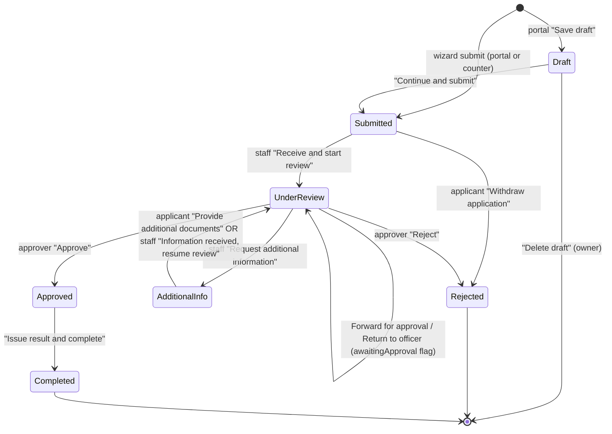
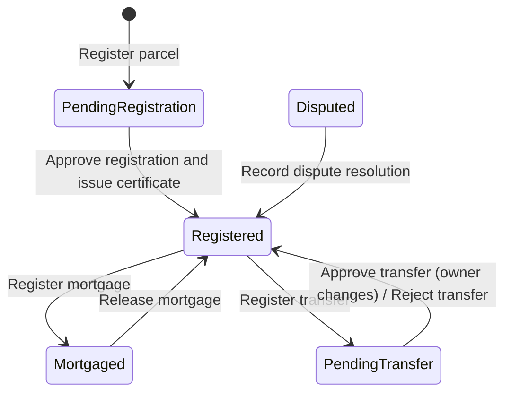
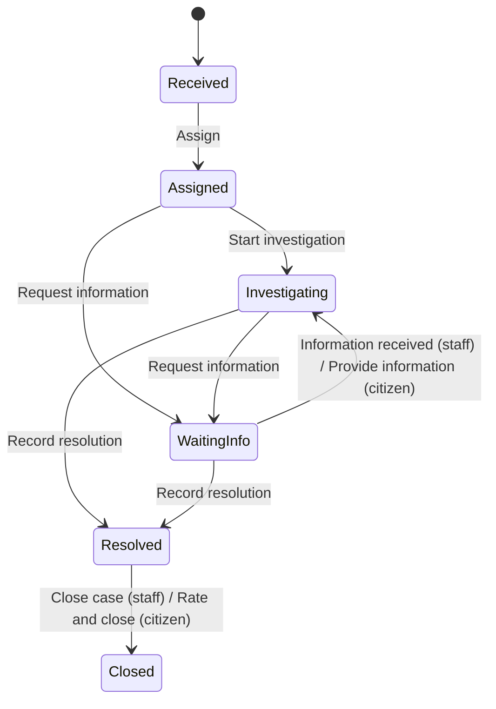
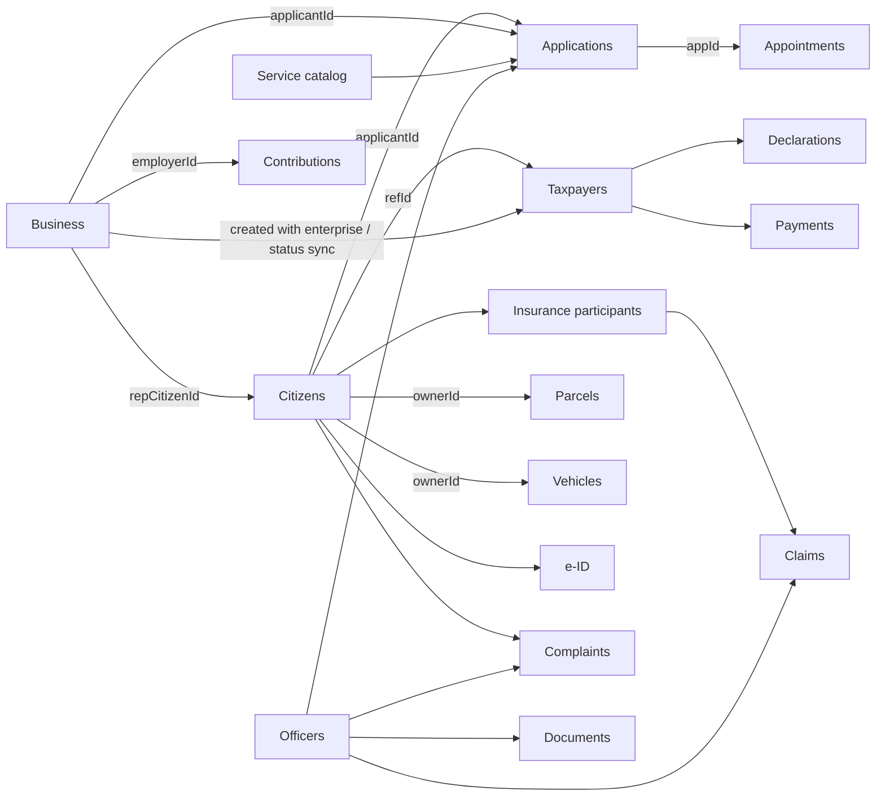

# e-Gov Administration (Demo) - Project Guideline

> Audience: end users, developers, QA engineers and business analysts.
> Scope: strictly derived from the source code in this folder (`index.html`, `css/`, `js/`). Where the code does not define a rule, the item is marked **Assumption** or **Unknown / not implemented**.
> Vietnamese UI terms are given in parentheses, e.g. Public services (Dịch vụ công). The UI is written in English and translated through a partial `vi` dictionary in `js/core/i18n.js`; untranslated phrases fall back to English.

---

## Table of contents

1. [Project overview](#1-project-overview)
   - 1.1 Purpose
   - 1.2 Tech stack
   - 1.3 File structure
   - 1.4 How to run
   - 1.5 Data storage (localStorage) and seed data
   - 1.6 Demo credentials
   - 1.7 Routing and URL parameters
2. [User guideline](#2-user-guideline)
   - 2.1 Roles
   - 2.2 Common UI (shell, search, notifications, tables, forms)
   - 2.3 Screen-by-screen reference
   - 2.4 Step-by-step task guides
3. [Business guideline](#3-business-guideline)
   - 3.1 Permission model
   - 3.2 Entities and relationships
   - 3.3 Statuses and state transitions
   - 3.4 Formulas, constants and numbering
   - 3.5 Notifications and audit rules
4. [Feature details](#4-feature-details)
5. [Key workflows and module relationships](#5-key-workflows-and-module-relationships)
6. [Known limitations and gaps](#6-known-limitations-and-gaps)
7. [QA test checklist](#7-qa-test-checklist)
8. [Appendix: glossary](#8-appendix-glossary)

---

## 1. Project overview

### 1.1 Purpose

A front-end-only demonstration of a Vietnamese digital-government administration platform for a fictional local authority ("Da Nang City People's Committee", unit code `H17`, hotline `1022`). It lets three audiences try the same system:

- **Public servants** (staff) process citizen applications, maintain registers (citizens, tax, social insurance, land, vehicles, businesses), handle official documents, complaints, electronic identity, procedures and reports.
- **Citizens** and **Business users** ("portal" roles) submit and track their own applications, book appointments, send feedback, manage their e-ID and (business) pay tax.
- **Administrators** manage users, settings and data (export / import / reset).

All people, companies, IDs, plates and parcels are fictional. There is **no backend**; every rule is enforced in the browser only.

### 1.2 Tech stack

| Item | Value |
|---|---|
| Languages | HTML5, CSS3, vanilla JavaScript (ES2015+, no modules, no transpiler) |
| Frameworks / build | None. No npm, no bundler |
| Global namespace | `window.GA` (scripts share it through plain `<script>` tags, because ES modules are blocked on `file://`) |
| Fonts | Be Vietnam Pro, Tinos from Google Fonts (falls back to system fonts offline) |
| Charts | Custom SVG (`GA.ui.chart.bar / line / donut / hbar`) in `js/core/components.js` |
| Cadastral map | Deterministic inline SVG generated in `js/modules/land.js` (illustrative, not GIS) |
| Persistence | Browser `localStorage` |
| Router | Hash router (`#/module/param?query`) in `js/app.js` |

### 1.3 File structure

```
egov-admin/
  index.html                  Page shell + ordered <script> list
  README.md                   Existing short readme
  GUIDELINE.md                This document
  css/styles.css              Design system, layout, print styles
  js/core/i18n.js             GA.t('English text', params) + Vietnamese dictionary (partial)
  js/core/utils.js            Icons, formatting (dd/mm/yyyy, 1.250.000 d), dates, CSV, address builder
  js/core/store.js            localStorage persistence, audit log, notifications, session
  js/data/mock-data.js        Seeded generator for every demo collection (VERSION = 3)
  js/core/components.js       Badges, toasts, modals, forms + validation, tabs, DataTable, SVG charts
  js/modules/_shared.js       Shared helpers: scoped(), address fields, OPEN_APP/DONE_APP/OPEN_CP
  js/modules/dashboard.js     Staff dashboard / portal home
  js/modules/citizens.js      Population register
  js/modules/services.js      Applications, service catalog, appointments, submission wizard
  js/modules/tax.js           Taxpayers, declarations, payments, debt
  js/modules/insurance.js     Social insurance participants, claims, employer contributions
  js/modules/land.js          Parcels, cadastral map, transfers, mortgages, certificates
  js/modules/vehicles.js      Vehicle registration, plates, inspection
  js/modules/business.js      Enterprise registration
  js/modules/documents.js     Incoming / outgoing / internal documents, digital signature
  js/modules/procedures.js    Administrative procedure catalogue
  js/modules/identity.js      Digital identity (e-ID) accounts
  js/modules/complaints.js    Public complaints and feedback
  js/modules/reports.js       Reports and statistics
  js/modules/admin.js         Users and roles, audit log (module "users"); System settings (module "settings")
  js/app.js                   Roles/permissions, login, layout, global search, notifications, router
```

Script load order (from `index.html`): `i18n` -> `utils` -> `store` -> `mock-data` -> `components` -> `_shared` -> modules (dashboard, citizens, services, tax, insurance, land, vehicles, business, documents, procedures, identity, complaints, reports, admin) -> `app`. `app.js` boots on `DOMContentLoaded`.

### 1.4 How to run

1. Open `index.html` in a modern browser (Chrome, Edge, Firefox, Safari). Double-clicking works; no web server is required.
2. Sign in with one of the demo accounts (see 1.6). One-click role buttons are on the login page.
3. To restart from pristine data: user menu -> **Reset demo data** (Đặt lại dữ liệu) or System settings -> Data -> **Reset demo data**.

Requirements: JavaScript enabled (a `<noscript>` message is shown otherwise); `localStorage` available for persistence (see 1.5). Internet only needed for Google Fonts.

### 1.5 Data storage and seed data

**localStorage keys** (defined in `js/core/store.js`):

| Key | Content |
|---|---|
| `ga.egov.demo.data` | One JSON document with every collection, `settings`, `stats`, `version`, `generatedAt` |
| `ga.egov.demo.session` | `{ userId, at }` of the signed-in user (removed on sign-out) |

**Behaviour**

- On boot, `Store.init()` parses `ga.egov.demo.data`. If missing, unparsable, or `version !== GA.data.VERSION` (currently `3`), the data is **regenerated** from the seed and saved (an old blob of a different version is silently discarded).
- If `localStorage` throws (private mode, blocked), the app keeps working in memory only; Settings -> Data shows "session only, localStorage unavailable". Nothing persists.
- The audit trail is capped at **400** entries; notifications at **120** entries (oldest dropped).
- Language (`settings.lang`) is stored inside the data blob, so it is shared by all users of the browser and is reset to `en` by **Reset demo data**.
- Export (JSON) / Import: Settings -> Data (System Administrator only). Import requires a JSON object containing `citizens` and `settings`, otherwise the error "This file is not an e-Gov demo data export." is shown; on success the version is overwritten with the current one and the page reloads.

**Seed generator** (`js/data/mock-data.js`): deterministic PRNG (`mulberry32(20260929)`), so IDs and content are the same on every fresh install; **dates are generated relative to "today"**, so dates shift with the real clock. Any timestamp that would fall in the future is pulled back to just before "now".

| Collection (store key) | ID pattern | Seed count | Notes |
|---|---|---|---|
| `departments` | `D01`-`D13` | 13 | D01 = Public Administrative Service Center (PASC) |
| `officers` | `OF01`-`OF18` | 18 | Linked to users by `officerId` |
| `services` | `SV01`-`SV16` | 16 | Public service catalog (used by the application wizard) |
| `procedures` | `PR-001`... | 22 (16 from services + 6 extra) | Administrative procedure catalogue (separate copy of service data) |
| `citizens` | `CT-0001`... | 38 | `CT-0001` = Nguyen Minh Khoa, `CT-0002` = Tran Thi Thu Huong |
| `businesses` | `BUS-0001`... | 24 | `BUS-0001` = demo business (code `0401798231`) |
| `applications` | `APP-0001`... | 28 | `APP-0001` = "Additional Information Required" for the citizen demo |
| `appointments` | `APT-0001`... | 14 | 9 future (one of them Cancelled), 5 past |
| `taxpayers` | `TP-0001`... | 24 (one per business) + 14 individuals | |
| `declarations`, `taxPayments` | `DC-00001`, `PM-00001` | generated | Closed taxpayers get none |
| `taxTrend` | - | 12 months | Collected vs target (national-style baseline, target 2,950 billion VND per month) |
| `insParticipants`, `insClaims`, `insContributions` | `SI-`, `CL-`, `CB-` | 26 / 20 / up to 36 | Contributions: up to 12 employers x last 3 months |
| `parcels` | `LP-0001`... | 26 | 14 in Da Nang, rest spread over 5 provinces |
| `vehicles` | `VH-0001`... | 26 | |
| `documents` | `DOC-0001`... | 24 (9 incoming, 7 outgoing, 8 internal) | |
| `identities` | `ID-0001`... | 24 | |
| `complaints` | `CP-0001`... | 24 | |
| `users` | `US-001`... | 20 | 9 demo accounts + 11 staff accounts (one Locked) |
| `notifications` | `NT-1`... | 8 | 4 staff, 3 for citizen `CT-0001`, 1 for `CT-0002` |
| `audit` | `AU-0`... | 26 | |
| `stats` | - | object | City-wide baseline numbers (see below) |
| `settings` | - | object | Language, address model, page size, org profile, toggles |

City-wide baselines (`stats`): citizens 1,245,380; applicationsYtd 168,420; taxpayers 142,300; businesses 38,760; parcels 412,900; vehicles 1,086,500; docsIncomingYtd 24,680; onTimeRate 98.2; satisfaction 94.6; plus `svcMonthly` (12 months of online/counter volumes). These are fixed demo numbers shown on the dashboard and reports next to counts computed from the ~20-40 stored records.

Default `settings`: `lang: 'en'`, `addressModel: '3-level'`, `pageSize: 10`, `dateFormat: 'dd/mm/yyyy'`, `orgName: "Da Nang City People's Committee"`, `orgVi: 'Uy ban nhan dan thanh pho Da Nang'` (with Vietnamese diacritics in code), `orgCode: 'H17'`, `orgAddress: '24 Tran Phu, Hai Chau, Da Nang (demo address)'`, `hotline: '1022'`, `notifyEmail: true`, `notifySms: false`, `notifyDeadline: true`, `sessionTimeout: 30`, `maintenance: false`.

Provinces available for addresses (5): Da Nang City, Hanoi, Ho Chi Minh City, Hai Phong City, Quang Nam Province, each with a small list of districts/wards (pre-2025 three-level names).

ID formats used by the seed (modelled on real conventions, values invented): Citizen ID 12 digits (province code 3 + gender/century digit 1 + birth year 2 + serial 6); enterprise/tax code 10 digits (province prefix 2 + 8 digits); insurance number 10 digits (province 2 + 8); plates "43A-123.45" (cars) and "43-B1 234.56" (motorbikes).

### 1.6 Demo credentials

Password for **every** account (including accounts created later in Users & roles): `Demo@2026` (hard-coded comparison in `js/app.js`; username match is case-insensitive).

| Username | Role (`ROLES` key) | Person | Linked record |
|---|---|---|---|
| `admin` | System Administrator (Quan tri he thong) `sysadmin` | Tran Quoc Bao | officer OF01 |
| `officer` | Government Officer (Can bo, cong chuc) `officer` | Nguyen Thi Thu Ha | OF02 |
| `manager` | Department Manager (Lanh dao don vi) `manager` | Le Van Hung | OF03 |
| `psofficer` | Public Service Officer (Can bo mot cua) `psofficer` | Pham Ngoc Lan | OF04 |
| `tax` | Tax Officer (Can bo thue) `tax` | Hoang Minh Tuan | OF05 |
| `land` | Land Management Officer (Can bo dia chinh) `land` | Vo Thanh Long | OF06 |
| `insurance` | Social Insurance Officer (Can bo BHXH) `insurance` | Dang Thi Mai | OF07 |
| `citizen` | Citizen (Cong dan) `citizen` (portal) | Nguyen Minh Khoa | citizen `CT-0001` |
| `business` | Business User (Doanh nghiep) `business` (portal) | Tran Thi Thu Huong | citizen `CT-0002`, business `BUS-0001` |

(Names appear with Vietnamese diacritics in the app.) Eleven further staff accounts are generated from officers OF08-OF18. Their username is derived from the officer name (given name + initials, lowercase, no diacritics, dots removed); OF13 (Truong Thi Yen, username `yentt`) is seeded as **Locked** and is a ready-made test for the locked-account message. Roles for these accounts follow the department (D13 -> psofficer, D04 -> land, D07 -> tax, D08 -> insurance, others -> officer).

**Assumption:** the exact generated usernames of OF08-OF18 other than `yentt` should be read from Users & roles (they are displayed there).

Role switching: the top-bar role pill (Switch demo role) lists the 9 demo accounts and signs in as the chosen one **without a password**. A session is restored on reload unless the user is Locked. The "Keep me signed in on this device" checkbox on the login form has no effect (session is always stored).

### 1.7 Routing and URL parameters

Hash routes: `#/<module>[/<id>][?query]`. Unknown modules show "Page not found"; a module the role cannot view shows "Access restricted" (with the role name and page) plus a "Back to dashboard" button. Route changes close open modals and scroll to top.

| Route | Module | Sub-routes / query |
|---|---|---|
| `#/dashboard` | Dashboard | - |
| `#/citizens`, `#/citizens/CT-0001` | Citizens | detail by id |
| `#/services`, `#/services/APP-0001` | Public services | `?tab=apps|catalog|appointments`, `?status=` (pre-filter) |
| `#/procedures` | Procedures | `?code=<procedure code>` opens detail |
| `#/identity` | Digital identity | `?id=ID-0001` opens account |
| `#/complaints`, `#/complaints/CP-0001` | Complaints | `?status=` |
| `#/tax` | Tax | `?tab=tp|decl|pay|debt|rep`, `?id=TP-0001` |
| `#/insurance` | Social insurance | `?tab=part|claims|contr|rep`, `?id=SI-0001` |
| `#/land` | Land | `?tab=map|reg|tr|rep`, `?prov=`, `?id=LP-0001` |
| `#/vehicles` | Vehicles | `?id=VH-0001` |
| `#/business` | Business registration | `?id=BUS-0001` |
| `#/documents` | Electronic documents | `?tab=incoming|outgoing|internal`, `?id=DOC-0001` |
| `#/reports` | Reports | `?r=svc|cp|tax|reg|doc` |
| `#/users` | Users & roles | `?tab=users|roles|audit` |
| `#/settings` | System settings / Preferences | `?tab=gen|org|not|data|about` |

The `?id=` / `?code=` parameter opens a record once and is then removed from the URL (`history.replaceState`, silently skipped on `file://` restrictions).

---

## 2. User guideline

### 2.1 Roles

Nine roles exist (`ROLES` in `js/app.js`). Two are "portal" roles (Citizen, Business User) and only see their own records; the other seven are staff roles.

| Role | Sidebar modules visible | Modules where the role can create/edit (`edit`) | Notes |
|---|---|---|---|
| System Administrator | All 15 | All | Also user management, settings, data tools, delete citizen |
| Government Officer | Dashboard, Citizens, Public services, Vehicles, Documents, Procedures, Complaints, Reports, Settings | Citizens, Public services, Documents, Complaints, Vehicles | Can forward applications for approval, cannot approve |
| Department Manager | Dashboard, Public services, Documents, Procedures, Complaints, Reports, Users & roles, Settings | Public services, Documents, Procedures, Complaints | Approves applications, signs documents; views users (read-only) |
| Public Service Officer | Dashboard, Public services, Procedures, Citizens, Digital identity, Complaints, Settings | Public services, Citizens, Digital identity, Complaints | One-stop desk: receives applications |
| Tax Officer | Dashboard, Tax, Business registration, Reports, Settings | Tax, Business registration | |
| Land Management Officer | Dashboard, Land, Citizens, Public services, Reports, Settings | Land | View-only on Citizens and Services |
| Social Insurance Officer | Dashboard, Social insurance, Citizens, Reports, Settings | Social insurance | View-only on Citizens |
| Citizen | Dashboard ("My dashboard"), Public services ("My applications"), Procedures, Public complaints ("My feedback"), Digital identity ("My e-ID account"), Settings ("Preferences") | none via `edit`; portal-specific actions coded explicitly | Own records only |
| Business User | Dashboard, Public services ("My applications"), Business registration ("My enterprise"), Tax ("My tax account"), Procedures, Complaints, Settings | same as above | Own enterprise, tax account, applications |

Sidebar groups: Overview; Citizens & services; Sector management; Office; Analytics & system. Badges on the sidebar count pending items: staff see open applications (Submitted / Under Review / Additional Information Required), open complaints, and documents "Awaiting receipt" or "Awaiting signature"; portal users see only their applications needing additional information.

### 2.2 Common UI

**Login page.** Fields Username (Ten dang nhap) and Password (Mat khau); a show/hide password button; EN/VI toggle; a "Demo accounts" grid with one-click sign-in per role. Validation and errors:

| Condition | Message |
|---|---|
| Empty username or password | "This field is required." (focus moves to the field) |
| Unknown user or password not `Demo@2026` | "The username or password is incorrect. Demo accounts use the password Demo@2026." |
| User status `Locked` | "This account is locked. Contact the system administrator." |
| Success | Toast "Signed in as {name} ({role})." and redirect to `#/dashboard` |

**Shell.** Government band (Socialist Republic of Viet Nam, demo flag, hotline), sidebar (mobile: hamburger + scrim), top bar with:

- **Global search** - minimum 2 characters, accent- and case-insensitive (Vietnamese diacritics and "d/dd" are normalised). Results grouped, max 5 per group, only for modules the role can view. Arrow keys move, Enter opens the highlighted (or first) result, Esc closes. Staff searches: Citizens (name, ID, phone), Applications (code, applicant, service), Public services, Procedures, Businesses, Land parcels (certificate, owner, "thua <no>", street), Vehicles (plate with or without separators, owner, chassis), Documents (number, summary, sender), Complaints. Portal users search only their own applications/complaints plus services and procedures. Empty result: "No results for “{q}”."
- **Language toggle** EN / VI (rebuilds the shell).
- **Role pill** (switch demo role, no password).
- **Bell** (notifications): unread dot (shows count up to `9+`), list of the latest 20, "Mark all as read", click marks read and follows the notification link. Empty: "You have no notifications."
- **User menu**: email, e-ID / Settings link, **Reset demo data** (confirm dialog "All changes made in this browser will be discarded and the original demo data restored."; keeps you signed in as the same username), **Sign out**.

**Notifications audience.** Staff see notifications with `audience = 'staff'`. Portal users see notifications whose audience equals their citizen id or business id. Staff never see citizen-addressed messages.

**Data tables (every list page).** Search box (debounced 160 ms, accent-insensitive, searches configured columns), dropdown filters, optional date range (From / To, compares first 10 chars of the date field), sortable column headers (click toggles asc/desc), row click opens the record, per-row action buttons, **Export CSV** (exports the currently filtered rows, UTF-8 with BOM, file `<name>-<yyyy-mm-dd>.csv`; HTML tags stripped), pagination with page size 10 / 20 / 50 (default from Settings -> Rows per page), footer "Showing {from}-{to} of {total}". Empty result: "No records match these filters." + "Try clearing the search or choosing a different filter."

**Forms (modal forms).** Required fields are marked `*`. On **Save**, all fields are validated; the first invalid field is focused and a toast "Some fields need attention. Check the highlighted fields." appears. Generic messages:

| Rule | Message |
|---|---|
| Required empty | "This field is required." |
| Pattern mismatch | The field's own message, else "Check the format of this field." |
| Number below `min` | "Enter a value of at least {min}." (numbers only; `max` is only an HTML attribute, not validated by code) |
| Email format `^[^\s@]+@[^\s@]+\.[^\s@]+$` | "Enter a valid email address, like name@example.vn." |
| Custom `validate()` | Field-specific text (quoted in section 4) |

Country-style dependent selects: Province -> District -> Ward (District is hidden/optional under the 2-level address model, see 4.15).

**Confirm dialogs** with an optional reason box: if the box is `required` and empty, the dialog stays open and shows "This field is required."

**Toasts** auto-dismiss after 4.8 s; types success / error / warning / info.

### 2.3 Screen-by-screen reference

For each screen: purpose, who can see it, main elements.

#### Dashboard (Bang dieu khien)

- **Staff** ("Government administration dashboard"): 10 KPI tiles (Total citizens, Online service applications, Pending applications, Completed applications, Taxpayers, Registered businesses, Land records, Registered vehicles, Incoming documents, Pending complaints), each linking to its module if the role may view it; 5 charts (applications by month stacked online/counter, application status donut, complaints by category, tax collection trend, workload by department); **Needs attention** list (max 8, only modules the role can view: overdue applications, new applications awaiting reception, very urgent documents, documents awaiting signature, urgent/near-due complaints, tax debts over 90 days, benefit claims awaiting review, parcels pending transfer or disputed); **Recent activity** (latest 8 audit entries).
- **Portal** ("Hello, {name}"): identity card with citizen ID and e-ID level/status, warning box "{n} application(s) need your action" (Draft or Additional Information Required), KPIs (My applications, In progress, Completed, and Tax payable for business or My feedback for citizens), "Popular online services" quick-start buttons (up to 8; business users see business/enterprise/tax services, citizens see non-business services), recent applications, upcoming appointments (Booked and date >= today), enterprise card (business), latest 4 notifications.

#### Citizens (Cong dan) - staff only

- **List**: KPIs (Citizens in register view, Permanent residents, Temporarily absent, Moved out or deceased); table with filters Province/City, Gender, Residence type, Status; **Add citizen** (edit roles).
- **Detail** (`#/citizens/CT-xxxx`): header with status badge, actions Change status, Edit profile (edit roles), Print; tabs Overview (personal info, residence and contact, chip-based ID card), Family (with "Add member"), Administrative history (with "Record event"), Linked records (applications, tax, insurance, land, vehicles, enterprises, e-ID, complaints; modules the role cannot view show "Restricted for your role").

#### Public services (Dich vu cong) - staff and portal

- Page header buttons: **Book appointment**; **Receive application** (staff with edit) / **Submit new application** (portal).
- KPIs differ for staff (Received (register), Being processed, Overdue, Completed on time) and portal (Total applications, In progress, Needs your action, Completed).
- Tabs: **Applications** (table), **Service catalog** (cards by field with "Requirements" and "Apply online"/"Receive"), **Appointments** (table).
- **Application detail** (`#/services/APP-xxxx`): stepper (Submitted -> Under Review -> Decision -> Result returned), callouts for "Additional information required" and "Reason for rejection", panels for details, documents (with counts), applicant, processing, appointment, history; action buttons depend on role and status (section 3.3).

#### Administrative procedures (Thu tuc hanh chinh)

- Catalogue table with filters Field, Handling unit, Availability, Status; KPIs (Published procedures, Fully online, Counter only, Average processing time). Row opens a detail modal (required documents, workflow steps with share bars). Manager and sysadmin can Add, Edit, Suspend / Reactivate.

#### Digital identity (Dinh danh dien tu)

- **Staff**: KPIs (e-ID accounts, Level 2 verified %, Pending verification, Locked accounts), accounts table, "Security notifications" list; account modal with linked services, login history, verification history, security notifications.
- **Portal**: "My e-ID account" - identity summary, "Lock my account" button (only when Active), same four tabs, link toggles.

#### Public complaints (Phan anh, kien nghi)

- List with KPIs (Total received / My submissions, Open, Overdue, Satisfaction), filters Status / Category / Priority / Department; **Record complaint** (staff) / **Send feedback** (portal). Detail page with stepper (Received, Assigned, Investigating, Resolved, Closed), description, resolution, citizen feedback, handling, progress timeline.

#### Tax administration (Quan ly thue) / My tax account

- KPIs; tabs **Taxpayers**, **Declarations**, **Payments**, **Obligations and debt**, **Tax reports** (staff only). Taxpayer modal with declarations and payment history, actions Submit declaration, Record payment / Pay tax, Send debt reminder (staff).

#### Social insurance (Bao hiem xa hoi) - staff only

- KPIs; tabs **Participants**, **Benefit claims**, **Employer contributions**, **Reports**. Participant modal (employment history, claims, health insurance card) and Claim modal (stepper).

#### Land management (Quan ly dat dai) - staff only

- KPIs; tabs **Cadastral map** (province selector, land-use highlight filter, clickable parcels, side panel with legend), **Parcel register**, **Transfers**, **Reports**. Parcel modal with tabs Parcel information / Transfer history / Certificate (specimen).

#### Vehicle registration (Dang ky phuong tien) - staff only

- KPIs; one table; vehicle modal with owner data, inspection, history, registration document chips.

#### Business registration (Dang ky kinh doanh)

- **Staff**: KPIs, enterprises table + "Enterprises by type" donut; modal with details and tabs Registration history / Applications.
- **Portal**: "My enterprise" with details and **Request change of details**, which opens the application wizard for service `SV16` (Change of enterprise registration details).

#### Electronic documents (Van ban dien tu) - staff only

- KPIs; tabs **Incoming**, **Outgoing**, **Internal**; **New document** dropdown (edit roles). Document modal shows a Decree-30-style facsimile ("Preview - fictional document"), metadata, digital signature block, and processing workflow.

#### Reports & statistics (Bao cao thong ke) - staff only

- Report chips (only reports whose module the role can view): Public service delivery, Complaints and feedback, Tax revenue, Registers overview, Document processing. Each has 4 KPIs, 2 charts, a summary table, **Export CSV**, **Print report**.

#### Users & roles (Nguoi dung & phan quyen)

- Tabs **Users**, **Roles and permissions** (permission matrix), **Audit log**. Only the System Administrator sees create/edit/lock/delete/reset actions; others see a note "You can view accounts and the audit log. Only the System Administrator can change users and roles."

#### System settings (Cai dat he thong) / Preferences

- Staff: tabs General, Organisation, Notifications (+ Security), Data (admin only), About. Portal: a single General tab (display settings + notification toggles).

### 2.4 Step-by-step task guides

#### T1. Sign in and switch role
1. Open `index.html`. Click a demo role button, or type username + `Demo@2026` and press **Sign in**.
2. To try another role, click the role pill in the top bar and choose a role (no password needed).
3. To sign out use the user menu -> **Sign out**.

#### T2. Citizen submits an application (portal)
1. Sign in as `citizen`. Go to **My applications** and click **Submit new application** (or start from a quick-start card on the dashboard, or **Apply online** in the catalog).
2. Step 1 **Choose service**: search (name, Vietnamese name, field, code) and select one radio option. Continue. If nothing is selected: "Choose a service to continue."
3. Step 2 **Applicant and documents**: applicant details are pre-filled (citizen; business services use the business account if the user has one). For each required document click **Attach** (PDF/JPG/PNG up to 10 MB) or **Use sample file**. Continue. Errors: "Select the applicant." / "Attach all required documents. Missing: {list}".
4. Step 3 **Review and submit**: choose Result delivery (Online (electronic result) / Collect at the counter / Postal delivery (VNPost)), Payment method if the fee is > 0 (Online payment (VNPay-style gateway) / Bank transfer / Pay at the counter), optional note, tick the declaration "I declare that the information provided is accurate and take responsibility under the law." Otherwise: "Confirm the declaration to submit."
5. Click **Submit application**. Toast "Application {code} submitted. Expected result by {date}." and you land on the detail page (status Submitted). Alternatively **Save draft** (step 2 or 3) to continue later ("Draft saved. You can continue later from My applications.").

#### T3. Staff processes an application (full flow)
1. `psofficer` opens the application (status Submitted) -> **Receive and start review** -> choose the processing officer (defaults to an officer of the handling department) and note -> **Receive and assign**. Status -> Under Review; documents marked Received/Uploaded become Valid; the applicant is notified "Your application is being reviewed".
2. `psofficer` (or `officer`) -> **Forward for approval**; type an appraisal opinion (required) -> flag `awaitingApproval`; the badge "Awaiting approval" appears.
3. `manager` opens the application -> **Approve** (optional note) or **Reject** (reason required) or **Return to officer** (instructions required). Approve generates a result number and notifies the applicant.
4. `manager`/`psofficer` -> **Issue result and complete** and confirm. Status -> Completed; applicant notified "Your result is ready".
5. Any time in Under Review: **Request additional information** (text required) -> status Additional Information Required; the citizen gets a warning notification. When the citizen uploads (T4) or staff clicks **Information received, resume review**, the status returns to Under Review.

#### T4. Citizen provides additional information
1. Sign in as `citizen`, open the application marked *Additional Information Required* (APP-0001 in the seed).
2. Click **Provide additional documents**, attach a file or **Use sample file** for every requested item; "Attach every requested document." appears if any is missing.
3. **Send documents** -> status Under Review; staff notified "Applicant provided additional information".

#### T5. Book, cancel and check in an appointment
1. In **Public services** click **Book appointment** (or the detail-page button). Staff must select a Citizen. Optionally select the related application (non-draft only). Choose Purpose (Submit original documents / Receive result / Consultation on procedure / Supplement dossier), Location (4 options), one of the next 10 weekdays, and a free time slot (07:30, 08:30, 09:30, 10:30, 13:30, 14:30, 15:30, 16:30; slots already Booked at the same date+location are disabled).
2. **Confirm booking** -> ticket `B<count+101>`; notification "Appointment confirmed".
3. Cancel: row action **Cancel appointment** (confirm). Staff can also **Check in** (status Completed, displayed as "Checked in") or **Mark no-show**.

#### T6. Withdraw or delete (portal)
- Status Submitted: **Withdraw application** (reason required) -> the application becomes Rejected with note "Withdrawn by applicant: <reason>".
- Status Draft: **Continue and submit** or **Delete draft** (confirm).

#### T7. Rate a completed service (portal)
Completed application -> **Rate this service** -> pick 1-5 stars (else "Choose a rating.") + optional comment -> **Send rating**. **Download result** produces a text file `result-<code>.txt`.

#### T8. Sign an outgoing document
1. `officer`/`manager`: **Electronic documents -> Outgoing**, open a document with status Drafting -> **Submit for signature** (signature status Pending, notification to staff).
2. `manager` opens it (status Awaiting signature) -> **Sign digitally** -> enter any 6-digit passcode -> **Sign**. Status Signed with signature stamp.
3. **Issue and send** -> status Issued; **Archive** -> Archived.
Non-approvers see "Waiting for leadership signature" and the toast "Only department leadership can sign. Switch to the Department Manager role to try it."

#### T9. Register an incoming document
**New document -> Register incoming document**, fill the form (see 4.10), **Register**. The document starts as Processing with registration number "Den so N" (Den so = incoming book number).

#### T10. Register a land transfer and approve it
1. `land`: **Land -> Parcel register** (or click a parcel on the map -> **Open parcel record**). Parcel must be Registered. **Register transfer** -> select type, transferee (citizen), value, contract number, date -> **Record pending transfer**. Status Pending transfer.
2. A user with approval rights (`land` itself or `admin`) opens the parcel -> **Approve transfer** (confirm) or **Reject transfer** (reason required).

#### T11. Pay tax / submit a declaration (business)
Sign in as `business`, **My tax account** -> **Submit declaration** (form, period, amount, tick the digital signature box) or **Pay tax** (type, amount >= 1,000, channel Online banking / Mobile payment, date).

#### T12. Register a vehicle or enterprise, add a citizen
Use the primary button on the respective page (Register vehicle / Register enterprise / Add citizen) and fill the form; see the validation tables in section 4.

#### T13. Administer users and data
`admin`: Users & roles -> **Add user** / row actions (Edit, Lock/Unlock, Reset password, Delete non-demo users). Settings -> Data -> Export / Import / Reset.

---

## 3. Business guideline

### 3.1 Permission model

Permissions are implemented as three checks in `js/app.js` (UI-only; no server enforcement):

| Check | Rule |
|---|---|
| `canView(module)` | module is in the role's `modules` list |
| `can('edit', module)` | module is in the role's `edit` list |
| `can('approve', module)` | role has `approve: true` (sysadmin, manager), **or** the role can edit the module and the module is one of `tax`, `land`, `insurance`, `vehicles`, `business`, `identity` |
| `can('admin')` | user role is `sysadmin` |

Consequences:
- **Approve applications** (module `services`) and **sign documents** (`documents`): only System Administrator and Department Manager. Others with edit rights can only *forward* an application for approval.
- For tax / land / insurance / vehicles / business / identity the editor is also the approver (no separation of duties in code). The only place where the distinction is actually used to gate a button is Land (`Approve transfer`, `Reject transfer`, `Approve registration and issue certificate`).
- Portal roles: `edit` list is empty. Their own actions are hard-coded on `app.portal`.

**Permission matrix** (V = view, E = create/edit, A = approve or sign) as rendered on Users & roles -> Roles and permissions:

| Module | SysAdmin | Officer | Manager | PS Officer | Tax | Land | Insurance | Citizen | Business |
|---|---|---|---|---|---|---|---|---|---|
| Dashboard | V E A | V | V A | V | V | V | V | V | V |
| Citizens | V E A | V E | - | V E | - | V | V | - | - |
| Public services | V E A | V E | V E A | V E | - | V | - | V E | V E |
| Administrative procedures | V E A | V | V E A | V | - | - | - | V | V |
| Digital identity | V E A | - | - | V E A | - | - | - | V | - |
| Public complaints | V E A | V E | V E A | V E | - | - | - | V E | V E |
| Tax administration | V E A | - | - | - | V E A | - | - | - | V |
| Social insurance | V E A | - | - | - | - | - | V E A | - | - |
| Land management | V E A | - | - | - | - | V E A | - | - | - |
| Vehicle registration | V E A | V E A | - | - | - | - | - | - | - |
| Business registration | V E A | - | - | - | V E A | - | - | - | V |
| Electronic documents | V E A | V E | V E A | - | - | - | - | - | - |
| Reports & statistics | V E A | V | V A | - | V | V | V | - | - |
| Users & roles | V E A | - | V A | - | - | - | - | - | - |
| System settings | V E A | V | V A | V | V | V | V | V | V |

Notes on the matrix: the matrix is computed from the role definitions; "A" for Manager on view-only modules (e.g. Reports, Users) is a display artefact of `approve: true` and has no functional effect. Portal "E" on Public services and Complaints is shown by the matrix; in reality portal users can create/withdraw their own records only.

**Record-level scoping** (`GA.mod.scoped`) for portal users:

| Collection | Visible when |
|---|---|
| applications, appointments | `applicantId` is the user's citizen id or business id |
| complaints, identities | `citizenId` equals the user's citizen id |
| businesses | business id or `repCitizenId` is owned |
| taxpayers | `refId` is owned |
| declarations, taxPayments | belongs to a visible taxpayer |

Direct URLs to another person's application/complaint show "Application not found" / "Complaint not found" ("This application does not exist or you do not have access to it."). Staff see everything in modules they can view.

### 3.2 Entities and relationships

Key fields only (all entities also carry `id`, and most `createdAt` / `updatedAt`; `Store.update` stamps `updatedAt`).

| Entity | Key fields | Relationships |
|---|---|---|
| **Department** | id `Dxx`, name, vi, short, level, head | referenced by officers, services, procedures, applications, complaints, users |
| **Officer** | id `OFxx`, name, dept, title, email, phone | `Application.officerId`, `Complaint.officerId`, `Document.handlerId`, `InsClaim.officerId`, `User.officerId` |
| **User** | username, name, role, dept, title, email, status (`Active`/`Locked`), twoFactor, lastLogin, officerId, subjectId (citizen), businessId, demo | portal users link to `Citizen` and `Business` |
| **Citizen** | fullName, cid (12 digits, unique), dob, gender, ethnicity, religion, nationality, hometown, occupation, maritalStatus, phone, email, residenceType (`Permanent`/`Temporary`), status, household, idIssued, idExpiry, province/district/ward/street, `family[]` {relation,name,dob,cid}, `history[]` {date,action,unit,ref} | Hub: linked to applications (`applicantId`), taxpayer (`refId`), insurance participant (`citizenId`), parcels/vehicles (`ownerId`), businesses (`repCitizenId`), identity, complaints |
| **Business** | name, nameEn, code (10 digits, also tax code), type, representative, repCitizenId, industryCode, industry, capital, employees, regDate, status, phone, email, address, `history[]` | 1:1 taxpayer (created automatically), employer of insurance contributions, applicant of business services |
| **Service** (catalog) | id `SVxx`, code, name, vi, field, dept, days, fee, level, docs[], business (flag) | Used by the application wizard; `Application.serviceId` |
| **Procedure** | id `PR-xxx`, code, name, vi, field, dept, days, fee, level, availability, docs[], legal, status, serviceId, result, workflow[] {step,days,dept} | Independent copy of service data (see limitations); `serviceId` links to a Service when present |
| **Application** | code, serviceId/serviceName/field/dept, applicantId/Name/Type, submittedAt, deadline, status, officerId, channel, fee, paid, `documents[]` {name,file,status}, `history[]` {time,status,by,note}, awaitingApproval, resultNo, note, delivery, rating/ratingComment | Applicant = Citizen or Business; has appointments by `appId` |
| **Appointment** | applicantId/Name, purpose, appId, location, date, slot, status (`Booked`/`Completed`/`Cancelled`/`No-show`), ticket | optional link to Application |
| **Taxpayer** | mst, name, type (`Business`/`Household`/`Individual`), refId, taxOffice, status (`Active`/`Suspended`/`Closed`), method, industry, debt, debtDays, address | refId -> Business or Citizen |
| **Declaration** | taxpayerId, form, formName, period, dueDate, submittedAt, amount, status | -> Taxpayer |
| **TaxPayment** | taxpayerId, date, amount, taxType, channel, ref, status (`Completed`/`Pending`) | -> Taxpayer |
| **InsParticipant** | insNo, citizenId, employerId/Name, salary, startDate, months, status, healthCard, healthCardExpiry, hospital, `employment[]` | -> Citizen, Business |
| **InsClaim** | code, participantId, type, submittedAt, amount, status, officerId, paidAt, note | -> InsParticipant |
| **InsContribution** | employerId, period `MM/YYYY`, employees, payroll, due, paid, status | -> Business |
| **Parcel** | parcelNo, sheetNo, area, purpose (code), term, origin, ownerId/Name/Type, certNo, certBook, certIssued, status, value, mortgagee, `transfers[]`, pendingTransfer, address | Owner = Citizen or Business |
| **Vehicle** | plate, ownerId/Name/Type, type, brand, model, year, color, engineNo, chassisNo, regDate, certNo, `inspection` {status,expires,center}, status, `history[]` | Owner = Citizen or Business |
| **Document** | direction, type/typeCode, number, regNo, summary/summaryVi, sender/recipient, date, receivedAt, priority, status, deadline, handlerId, pages, confidential, `signature`, `workflow[]` | handler = Officer |
| **Identity (e-ID)** | citizenId, account (phone), level, status, createdAt, verifiedAt, method, `linked[]`, `logins[]`, `alerts[]`, `verifications[]` | -> Citizen |
| **Complaint** | code, citizenId, category, title, description, dept, priority, status, officerId, deadline, channel, location, resolution, feedback {rating,comment}, `timeline[]` | -> Citizen, Department |
| **Notification** | title, body, type, audience (`staff` or subject id), read, link, time | |
| **Audit** | time, user, role, action, target, detail | |

```
Citizen 1---* Application *---1 Service
Citizen/Business 1---* Application 1---* Appointment
Citizen 1---0..1 Identity (e-ID)
Citizen 1---0..1 Taxpayer(Individual)   Business 1---1 Taxpayer(Business/Household)
Taxpayer 1---* Declaration     Taxpayer 1---* TaxPayment
Citizen 1---0..1 InsParticipant 1---* InsClaim      Business 1---* InsContribution
Citizen/Business 1---* Parcel    Citizen/Business 1---* Vehicle
Citizen 1---* Complaint          Business *---1 Citizen (legal representative)
Officer 1---* (Application | Complaint | Document | InsClaim)
```

### 3.3 Statuses and state transitions

Badge colour groups (from `components.js`): green = Approved, Completed, Active, Operating, Paid, Registered, Valid, Resolved, Signed, Issued, Verified, Success, Accepted, Level 2, Online, Receiving pension, Uploaded, Checked in; blue = Submitted, Under Review, Processing, Assigned, Investigating, Awaiting signature, Booked, Received, Drafting, Pending review, Amended, Online & counter, Level 1, Individual, Business, Household; amber = Additional Information Required, Waiting for Information, Due soon, Pending, Partially paid, Temporarily suspended, Suspended, Mortgaged, Pending transfer, Pending registration, Urgent, High, Medium, Late, Awaiting receipt, etc.; red = Rejected, Expired, Overdue, Disputed, Dissolved, Very urgent, Failed, Locked, Deregistered, Seized, In debt, Invalid, No-show, Deceased, Counter only.

#### 3.3.1 Application (public service)



| Status | Who can act | Available actions |
|---|---|---|
| Draft | Portal owner | Continue and submit; Delete draft |
| Submitted | Staff edit (services): psofficer, officer, manager, sysadmin. Owner | Receive and start review (requires selecting an officer); Assign officer; Print receipt; owner: Withdraw application, Book appointment |
| Under Review | Approvers (manager, sysadmin): Approve, Reject; editors who cannot approve (officer, psofficer): Forward for approval (only if not already awaitingApproval); approvers: Return to officer (only if awaitingApproval); editors/approvers: Request additional information; Reassign officer | |
| Additional Information Required | Staff: Information received, resume review; Owner: Provide additional documents | |
| Approved | Staff edit or approve: Issue result and complete | |
| Rejected / Completed | none (terminal) | Completed: owner Download result, Rate this service |

Other application rules:
- **Book appointment** button is shown to the owner for any status except Draft and Rejected.
- **Assign officer / Reassign** is available to staff (edit or approve) for any status not in {Approved, Rejected, Completed, Draft}; it appends a history entry with the same status ("Assigned to <name>") and creates a staff notification.
- **Mark valid** on a document row is available to editors when the document is Received or Uploaded.
- Application document statuses: Uploaded (draft), Received (submitted), Valid (after reception/mark valid), Missing.
- Approve issues result number `<100 + count of applications that already have a result number>/<GCN if field is Land else KQ>-<yy>`.

#### 3.3.2 Appointment
`Booked -> Completed` (staff Check in; displayed "Checked in") | `Booked -> No-show` (staff) | `Booked -> Cancelled` (staff or owner). Rows in any other status have no actions.

#### 3.3.3 Citizen register status
`Active`, `Temporarily absent`, `Moved out`, `Deceased`. "Change status" allows any status other than the current one (reason/legal basis required, stored in history `ref`, truncated to 40 chars). Editing the profile can also change status (adds a history event "Register status changed to <status>"). Address change adds "Residence address updated" (Ward Police, ref `CT01-<5 digits>`).

#### 3.3.4 Tax declaration and debt
- Declaration: created as **Pending review** -> staff (tax, admin) **Accept declaration** -> Accepted, or **Request amendment** (reason required) -> Amended (taxpayer notified "Supplementary declaration requested"). Statuses Accepted / Amended / Late / Pending review; `Late` exists only in seed data.
- Taxpayer status: Active / Suspended / Closed (Closed and Suspended follow business status changes; see 3.3.9). Closed taxpayers cannot be paid or declared for.
- Debt stage badge (Obligations tab): `debtDays > 90` -> "Enforcement notice" (badge Overdue); `> 30` -> "Reminder sent" (badge Due soon); otherwise "Monitoring".

#### 3.3.5 Social insurance
- Participant status: `Active`, `Suspended`, `Reserved`, `Receiving pension` (staff can switch to any other value; the reason is required but not stored).
- Claim: `Submitted -> Under Review -> Approved -> Paid`, or `Under Review -> Rejected` (reason required).
- Contribution: `Paid`, `Partially paid`, `Pending`, `Overdue`. Record payment: `paid = min(due, paid + amount)`; status Paid if `paid >= due`, else Partially paid.

#### 3.3.6 Land parcel

The status `Disputed` is only present in seed data (no UI action creates it). While a parcel is Disputed, Pending transfer or Mortgaged the buttons "Register transfer" / "Register mortgage" are not offered (they only appear when status is Registered); the disputed callout states "Transfers and mortgages are blocked until it is resolved."

#### 3.3.7 Vehicle
`Active -> Transfer pending` (Transfer ownership) `-> Active` (Complete transfer); `Active -> Deregistered` (Revoke registration, reason required; terminal, no actions); `Seized -> Active` (Release vehicle; `Seized` exists only in seed). Inspection status: Valid / Expired / Due soon / Failed / Not required (seed) - updated only by **Record inspection**.

#### 3.3.8 Document
- Incoming: `Awaiting receipt -> Processing` (Receive and register) `-> Completed` (Mark as completed) `-> Archived`. Newly registered incoming documents start at Processing.
- Outgoing and internal: `Drafting -> Awaiting signature` (Submit for signature) `-> Signed` (Sign digitally, approver) `-> Issued` (Issue and send) `-> Archived`. Archive is offered for Completed or Issued.
- Signature status: Valid / Pending / Unsigned.

#### 3.3.9 Business / enterprise
`Operating <-> Temporarily suspended`; `Operating -> Under dissolution -> Dissolved` (terminal). Each change needs a "Legal basis / notice number" (required) and appends a history entry. Linked taxpayer status is synchronised: Dissolved -> Closed; Operating -> Active; anything else (Temporarily suspended, Under dissolution) -> Suspended.

#### 3.3.10 e-ID account
`Pending verification -> Active` (Approve verification); `Active -> Locked` (staff with reason, or holder); `Locked -> Active` (staff Unlock only); Level 1 -> Level 2 (staff Upgrade, only when Active). The account holder cannot unlock or upgrade in the portal.

#### 3.3.11 Complaint

Assign/Reassign while already past Received does not change the status; it only updates dept/officer and appends a timeline entry.

#### 3.3.12 Procedure
`Active`, `Under amendment` (seed only), `Suspended`. Toggle: Active -> Suspended; any other status -> Active.

### 3.4 Formulas, constants and numbering

| Item | Rule (from code) |
|---|---|
| Application deadline (wizard) | `today + ceil(service.days * 1.4)` **calendar** days (`U.addDays`). Seed uses `submitted + ceil(days*1.4) + (days > 5 ? 2 : 0)`. Labels say "working days" but the calculation is calendar days |
| Application code | `000.00.<10 + dept number, 2 digits>.H17-<yymmdd>-<count of applications + 1, 4 digits>` |
| Application id | `APP-` + (max numeric id + 1), 4 digits |
| Application paid flag | `paid = !fee OR payMethod != "Pay at the counter"` (no real payment) |
| Overdue application | open status (Submitted, Under Review, Additional Information Required) and `deadline < today` |
| Completed on time (list KPI) | share of Completed applications whose Completed history time (date part) `<= deadline` |
| Complaint code | `PA-<year>-<1000 + count of complaints + 1, 4 digits>` |
| Complaint deadline | today + 3 (Urgent) / 7 (High) / 15 (Normal) calendar days |
| Appointment ticket | `B` + (count of appointments + 101), 3+ digits |
| Appointment slots | 8 fixed slots; one booking per date + location + slot (Booked only); next 10 weekdays (Sat/Sun skipped) |
| Tax: late-payment interest | Displayed as `debt * 0.0003 * debtDays` (0.03% per day, simple) in the Obligations tab and text "Late payment interest of 0.03% per day applies."; **not added to the debt** |
| Tax: declaring | `debt += amount` when amount > 0, `debtDays = existing debtDays || 1`; dueDate = today + 5; status Pending review |
| Tax: payment | `debt = max(0, debt - amount)`; if debt becomes 0 then `debtDays = 0`; payment status Completed, reference `GNT` + last 10 digits of `Date.now()` |
| Tax: next due date (business KPI) | the 20th of the current month, or of next month if today > 20 |
| Tax: enforcement warning | `debtDays > 90` |
| Insurance: employee contribution estimate | `salary * 0.105 * months` (label "10.5% of salary: pension, sickness, unemployment, health") |
| Insurance: employer due | seed `payroll * 0.32` (column "Due (32%)") |
| Insurance: collection rate | `sum(paid) / sum(due)` for the latest period in the contribution list |
| Insurance: health card renewal | `max(expiry, today) + 365` days |
| Insurance: claim code | `BHXH-<month 2 digits><last 6 digits of Date.now()>` |
| Insurance: claim amount minimum | 100,000 VND |
| Land: registration key | `parcelNo + sheetNo + ward` must be unique |
| Land: certificate number | random `<A/B/C/D/Đ/E/G/H>Đ <6 digits>`; book `CS <30000+random>` |
| Vehicle plate | regex `^\d{2}[A-Z]{1,2}-\d{3}\.\d{2}$` (cars) or `^\d{2}-[A-Z]\d \d{3}\.\d{2}$` (motorbikes); unique among all vehicles |
| Vehicle VIN | `^[A-HJ-NPR-Z0-9]{17}$` |
| Vehicle inspection validity | 6 / 12 / 24 months = `today + round(months * 30.4)` days; new car/truck registration gets Valid for 730 days; two-wheelers: no inspection |
| Enterprise code | province prefix (2 digits) + 8 random digits, unique; doubles as tax code |
| Document deadline | issue date + 1 (Very urgent) / 3 (Urgent) / 10 (Normal) calendar days |
| Incoming registration number | `Đến số <4800 + document count>` |
| Citizen record reference | `NK-<last 6 digits of Date.now()>` |
| Document number format | `^\d+\/[A-ZĐa-z0-9-]+$` (e.g. `1234/UBND-VP`) and unique |
| Result number (application) | see 3.3.1 |
| ID generator | `Store.nextId(collection, prefix, width)` = prefix + (max numeric part of existing ids + 1) padded (default width 4) |
| Currency format | `1.250.000 ₫` (vi-VN grouping); short forms "nghìn tỷ ₫", "tỷ ₫", "triệu ₫" |
| Date format | `dd/mm/yyyy`; date-time `dd/mm/yyyy hh:mm` |
| Relative time | "just now", "N min ago", "N h ago", "N d ago", older -> date |

### 3.5 Notifications and audit rules

Every state-changing action calls `Store.log(action, target, detail)` (user name, role, time). Notifications are created as follows:

| Trigger | Audience | Title |
|---|---|---|
| Staff moves application to Under Review / Additional Information Required / Approved / Rejected / Completed | applicant (citizen or business id) | "Your application is being reviewed" / "Additional documents required" / "Your application was approved" / "Your application was not approved" / "Your result is ready" |
| Portal user submits (Submitted) or resubmits documents (Under Review) | staff | "New online application" / "Applicant provided additional information" |
| Staff assigns an application / a document / forwards for approval / submits a document for signature | staff | "Application assigned to you" / "Document assigned to you" / "Application awaiting your approval" / "Document awaiting your signature" |
| Appointment booked | applicant | "Appointment confirmed" |
| Tax payment recorded by staff | taxpayer subject | "Tax payment received" |
| Tax debt reminder | taxpayer subject | "Tax debt reminder" |
| Declaration submitted / land transfer registered | staff | "New tax declaration" / "Land transfer awaiting approval" |
| Amendment requested | taxpayer subject | "Supplementary declaration requested" |
| Land transfer approved | transferee citizen | "Land transfer registered" |
| Insurance claim status change | participant citizen | "Benefit claim <status>" |
| e-ID verification/unlock/upgrade | citizen | e.g. "e-ID account activated", "e-ID account unlocked", "e-ID upgraded to Level 2" |
| Complaint step by staff / by citizen | citizen / staff | "Your feedback was assigned" etc. / "Citizen responded to feedback" |
| Complaint created by portal | staff | "New citizen feedback" (type error if Urgent) |

Notes: some staff notifications (e.g. "Application assigned to you") are addressed to the generic `staff` audience, not to the assigned officer. Settings toggles for email/SMS/deadline reminders are stored but not used (see section 6).

---

## 4. Feature details

Conventions: "Inputs" list form fields (`*` = required); messages are quoted from code.

### 4.1 Authentication and session

- **Inputs:** username, password.
- **Rules:** password must equal `Demo@2026`; username matched case-insensitively against `users`.
- **Outputs:** session stored; `lastLogin` updated; audit "Signed in" with role; redirect to `#/dashboard`.
- **Errors:** see the login table in 2.2.
- **Edge cases:** Locked users cannot sign in (also blocked at boot restore: they are sent back to the login page); role switching bypasses password and the Locked check for the target account (the switch lists only demo accounts which are never locked by seed, but a demo account *can* be locked in Users & roles - `login()` does not check status); sign-out clears the session and the hash.

### 4.2 Global search
See 2.2. Edge cases: fewer than 2 characters closes the panel; search runs on focus and (debounced 120 ms) on input; navigation clears the input.

### 4.3 Citizens

**Add / Edit citizen** (modal, size xl). Sections Identity, Contact, Residence.

| Field | Rules / messages |
|---|---|
| Full name * | At least 2 words: "Enter the full name with family name and given name." |
| Personal identification number * | Exactly 12 digits: "The citizen ID has exactly 12 digits."; unique: "This ID number is already on the register." |
| Date of birth * | Not in the future: "Date of birth cannot be in the future." |
| Gender * | Male / Female |
| Ethnicity | default Kinh; Religion (None, Buddhism, Catholicism, Protestantism, Cao Dai, Hoa Hao); Nationality default Vietnamese; Place of origin; Occupation; Marital status (Single, Married, Divorced, Widowed); ID card issue date (not future); Register status (Active, Temporarily absent, Moved out, Deceased) |
| Phone number * | 10 digits starting with 0 (spaces/dots ignored): "Enter a 10-digit Vietnamese phone number starting with 0." Stored as `0905 123 456` |
| Email | Standard email format |
| Residence type | Permanent / Temporary; Household book / household head (free text) |
| Province/City *, District *, Ward/Commune *, House number, street * | Dependent selects; District optional under the 2-level model |

- **Create:** new id `CT-####`; history seeded with "Record created in population register" (unit = current user's department name, reference `NK-…`); `idExpiry` empty. Toast "{name} was added to the register." then opens the detail page.
- **Edit:** if nothing changed -> toast "No changes to save." (the modal then closes, because `onSubmit` returns nothing). Address change and status change append history events; audit lists the changed field names.
- **Delete** (System Administrator only, list row action): confirm text "Delete the record of {name} ({cid})? In a real register records are archived, not deleted. This demo removes it from this browser." No cascade to linked records.
- **Change status** (detail): New status (all except current) + Reason / legal basis (required).
- **Add family member:** Relationship (Wife, Husband, Son, Daughter, Father, Mother, Sibling, Grandparent) *, Full name *, Date of birth * (not future), Citizen ID (12 digits, optional: "Leave blank for children without an ID yet."). No duplicate check. "On register" column links if a citizen with the same ID exists.
- **Record event:** Event (Birth registration, Marriage registration, Divorce recorded, Permanent residence updated, Temporary residence registered, Chip-based ID card issued, Name change registration, Death registration) *, Date * (not future, default today), Handling unit * (default the user's department name), Reference number. Events are sorted by date. Recording an event does **not** change the citizen's marital or register status.
- **Edge cases:** ID card "Valid until" shows "See card" when `idExpiry` is empty; the KPI tiles "Citizens in register view" count stored sample records.

### 4.4 Public services: application wizard, list, detail
Covered in 2.4 T2-T7 and 3.3.1. Additional details:

- **Service availability in wizard:** portal user without a business account cannot see business-only services (`business: true`: SV06 New enterprise registration, SV16 Change of enterprise registration details). A business-role user with `businessId` uses the business as applicant for those services and the citizen for others (`st.applicantId` is set from `service.business`).
- **Staff at the counter:** must choose the Applicant (citizens not Deceased, or businesses for business services): "Select the applicant." The help text reads "Receiving at the counter on behalf of the applicant." Channel is stored as `Counter` (portal `Online`). Staff cannot save drafts (Save draft is portal only) - the application is created as Draft and immediately moved to Submitted on "Submit application".
- **File rules:** wizard accepts `.pdf,.jpg,.jpeg,.png`, over 10 MB -> toast "File is larger than 10 MB." Only the file *name* is stored; content is discarded. "Use sample file" fabricates a name from the document title. The "Provide additional documents" dialog has no type/size check.
- **Tables:** filters Status, Field, Department (staff), Deadline (Overdue / Due within 2 days, staff); date range "Submitted from" / "To"; default sort submittedAt desc.
- **Deadline display:** `days overdue` (red), `Due today` / `N days left` (amber when <= 2 days), otherwise `N days left`; completed/decided applications show only the date.
- **Print receipt** calls `window.print()`.
- **Rating:** stored on the application (`rating`, `ratingComment`) - not aggregated anywhere.
- **Request additional information** appends a new document entry named after the request text (first 80 chars) with status Missing, and states "The applicant will be notified and the processing clock paused until they respond." (the pause is not implemented).

### 4.5 Administrative procedures
- **Add / Edit procedure** (manager, sysadmin): Procedure code * (`^\d\.\d{6}(\.\d{3}\.\d{2}\.\d{2}\.H\d{2})?$`, message "Use the national format, e.g. 1.004194 or 1.004194.000.00.00.H17."; unique: "This code is already used."; read-only when editing), Procedure name (English) *, Ten thu tuc (Vietnamese) *, Field * (existing fields only), Handling unit *, Processing time (working days) * (min 1), Fee (0+), Availability (Online, Online & counter, Counter only), Service level (Full online, Partial online, Information only), Legal basis, Required documents (one per line) *.
- On save a 4-step workflow is generated: Receive and check (10% of days, min 0.5, unit D01), Appraise dossier (60%, min 1), Approve and sign result (20%, min 0.5), Return result (0.5 day, D01). On edit the workflow is regenerated only if `days` changed.
- New procedures get status Active, empty `serviceId`, result "Administrative decision / certificate" and are **not** available in the application wizard.
- **Apply online / Receive application** appears in the detail modal only if the procedure is linked to a service, Active, and availability != Counter only.
- Deep link `?code=` opens the detail dialog.

### 4.6 Tax
- **Record / Pay tax:** Tax type * (Value added tax, Corporate income tax, Personal income tax, Household business tax, Licence fee, Late payment interest; default by taxpayer type), Amount (₫) * min 1,000 (default = outstanding debt), Payment channel * (portal: Online banking, Mobile payment; staff: Online banking, Tax e-portal, State Treasury counter, Mobile payment), Payment date * (default today, not in the future by HTML `max`). Toast "Payment {ref} recorded." plus " Remaining debt: {d}" when debt remains. Payment can exceed the debt (debt is floored at 0).
- **Submit declaration:** Declaration form * (by taxpayer type: Business: 01/GTGT, 03/TNDN, 05/KK-TNCN; Household: 01/CNKD; Individual: 02/QTT-TNCN), Tax period * pattern `^(\d{2}/\d{4}|Q[1-4]/\d{4}|\d{4})$` ("Use MM/YYYY, Q1/YYYY or YYYY."), Tax payable (₫) * min 0, digital-signature checkbox * ("The declaration must be digitally signed." - enforced through a toast in `onSubmit`; the field-level check is not attached because checkbox wrappers have no `data-field`). Toast "Declaration {f} for {p} submitted. Acknowledgement sent by email."
- **Debt reminder** (staff, taxpayer with debt): notification to the taxpayer; toast "Reminder sent to {n}."
- **Amendment request:** reason required; sets declaration to Amended.
- **Filters:** Taxpayers (Type, Status, Debt: In debt / No debt / Over 90 days); Declarations (Status, Form, "Submitted from"); Payments (Channel, Status, "Paid from"); Debt (Debt age: Up to 30 days / 31 to 90 days / Over 90 days).
- **Portal (business):** actions available only when the business has a taxpayer (first non-closed taxpayer is used). KPIs: Tax payable (= sum of debt), Declarations submitted, Paid this year, Next due date.
- **Closed taxpayers:** no declare / pay actions.
- **Tax reports tab** (staff): Monthly budget revenue (collected vs target), Debt by taxpayer type, Largest debtors (top 8), Payments by channel.

### 4.7 Social insurance
- **New benefit claim** (from participant modal): Benefit type * (Sickness, Maternity [females only], Unemployment, Pension, One-time withdrawal, Occupational accident, Funeral allowance), Claimed amount (₫) * min 100,000, Supporting documents (text). Status Submitted, no eligibility validation.
- **Claim processing:** Start review (Submitted -> Under Review); Approve or Reject (Under Review); Confirm payment (Approved -> Paid, `paidAt` = today). Reject dialog: "Claim {c}: {t} for {n}." with a required "Reason" (stored in the claim note). Toast "Claim {c} is now {s}."
- **Change participant status:** New status (excluding the current) + Reason (required, not stored) - toast "Status updated."
- **Renew health insurance card:** toast "Health insurance card valid until {d}."
- **Employer contribution actions** (unpaid rows only): Record payment (Amount * min 1,000, default outstanding) / Send reminder (audit only; toast "Reminder sent to {n}.").
- **Filters:** Participants (Status; Health card: Expired / Expires within 30 days); Claims (Status, Benefit type, "Submitted from"); Contributions (Period, Status).
- **Reports tab:** Participants by status, Claims by benefit type, Contribution collection by month (due vs paid, million VND).

### 4.8 Land
- **Register parcel** (creates `Pending registration` with transfer entry "Application for first issuance"): Parcel no. * (`^\d{1,4}$`, "Use 1 to 4 digits."), Map sheet no. * (`^\d{1,3}$`, "Use 1 to 3 digits."), Area (m²) * min 1 (step 0.1), Land use purpose * (ODT, ONT, TMD, SKC, DGD, CLN, LUC), Term of use * (Long-term, 50 years, 70 years), Origin of use * (4 options), Land user * (citizen or business), Estimated value, address (Province, District, Ward, Street). Duplicate: toast "Parcel {n} on sheet {s} already exists in {w}." (modal stays open).
- **Edit parcel** (any status): same form; status and certificate are unchanged.
- **Register transfer / mortgage / release / approve / reject:** see T10 and 3.3.6. Transfer form: Transfer type * (Sale, Gift, Inheritance, Capital contribution), Transferee * (living citizens except the current owner), Contract value * (default parcel value), Notarised contract no. *, Contract date * (not future). Approve dialog text: "Update the register so that {to} becomes the land user of parcel {n}, and issue certificate changes. This cannot be undone in the demo." After approval owner type becomes Individual; parcel value is replaced by the contract value if given.
- **Mortgage form:** Mortgagee * (4 fictional banks), Mortgage contract no. *, Secured amount * min 1,000,000. Adds "Mortgage registered" to the transfer history. Release dialog: "Confirm that {bank} has confirmed full repayment and the mortgage can be removed from certificate {c}."
- **Dispute resolution:** Outcome * (Reconciled at ward level / Decided by the People's Committee / Court judgment in effect) + Decision reference *; status -> Registered.
- **Map:** 9 blocks x 6 lots per province view; registered parcels are placed on lots deterministically; other lots show placeholder numbers; parcel colours by purpose; red dot = Disputed, amber dot = Mortgaged; clickable/keyboard-accessible; side panel shows the register entry. Note "Illustrative map, not to scale". Selecting from the register (**Show on map**) switches tabs and province.
- **Certificate tab:** printable specimen with "Specimen, demo only" stamp.

### 4.9 Vehicles
- **Register vehicle:** Plate number * (formats above; messages "Use 43A-123.45 (cars) or 43-B1 234.56 (motorcycles)." and "This plate is already registered."), Vehicle type * (Car, Motorcycle, Electric scooter, Truck), Make *, Model *, Model year * (min 1990; `max` not enforced), Color * (7 options), Engine number * (`^[A-Z0-9-]{6,20}$`, "Use 6–20 capital letters, digits or hyphens."), Chassis number (VIN) * ("A VIN has 17 characters and excludes I, O and Q."), Owner * (Active citizens only). Result: Active vehicle, owner type Individual, first-registration history, toast "Vehicle {p} registered."
- **Transfer ownership** (Active only): New owner * (Active citizens except current), Sale contract / invoice no. *, checkbox "New owner keeps the plate number (identity-based plates)" (no effect on data). Status becomes Transfer pending; toast "Transfer filed. Status: transfer pending until documents are verified." **Complete transfer** returns to Active.
- **Record inspection** (cars/trucks, not Deregistered): Inspection center *, Validity * (12 / 24 / 6 months), Result * (Passed / Failed). Passed -> Valid with new expiry, toast "Inspection valid until {d}."; Failed -> status Failed, expiry unchanged, warning "Inspection failed. Vehicle must be repaired and re-inspected."
- **Revoke registration:** reason required ("Reason (scrapped, exported, lost…)"); message "Revoke the registration and plate {p}? The plate is returned to the pool."
- **Motorcycles/scooters:** "Periodic inspection is not required for motorcycles and scooters in this demo."
- **Filters:** Type, Status, Inspection (Expired / Expires within 30 days / Valid), Province/City, "Registered from".

### 4.10 Electronic documents
- **Create (Register incoming / Draft outgoing / Draft internal)**, fields: Document type * (CV Official letter, QĐ Decision, TB Notice, BC Report, KH Plan, GM Invitation, CT Directive, TTr Submission), Number and symbol * (must match `^\d+\/[A-ZĐa-z0-9-]+$`: "Use the format number/SYMBOL, e.g. 1234/UBND-VP."; default for outgoing `<count+400>/UBND-VP`; for incoming "Number and symbol (as printed)"), Issuing authority * (incoming) or Recipient * (outgoing, default "Departments, agencies and ward People's Committees"), Date issued * (not future), Priority * (Normal, Urgent, Very urgent), Handler / Drafting officer *, Summary (English) *, Trich yeu (Vietnamese summary) *, Pages (min 1), Signer (4 names). Duplicate number: toast "A document with this number already exists." Result toast "Document {n} saved."
- **Deadline** = issue date + 1 / 3 / 10 days by priority.
- **Incoming actions:** Receive and register (Awaiting receipt), Assign handler (Processing; Handling officer *, Deadline * min today, Instructions), Mark as completed (clears deadline), Archive (Completed).
- **Outgoing/internal:** Submit for signature, Sign digitally, Issue and send (toast "Issued to {r} via the inter-agency document exchange."), Archive.
- **Sign dialog:** shows signer (current user), position, generated certificate id, provider "Government Specialised CA (demo)"; passcode field "One-time passcode sent to your phone" requires 6 digits (`^\d{6}$`); help "Demo: any 6 digits are accepted."; error "Enter the 6-digit passcode." The signature title becomes the signer's job title in upper case.
- **Preview:** facsimile per Decree 30/2020/ND-CP (national header, org, number "So: …", type title, body text with generated boilerplate, recipients, signature block). **Print** uses `window.print()`; **Download** yields a `.txt` stub.
- **Restricted flag:** seed doc `DOC-0024` has confidentiality "Restricted", shown as a red badge only; no access control.
- **Filters:** Type, Priority, Status (incoming vs outgoing/internal sets), date range "Issued from".

### 4.11 Digital identity
See 3.3.10. Actions and texts: Approve verification (toast e-ID account activated), Upgrade to Level 2 (confirm "Confirm the citizen appeared in person, the chip was read and the face matched the national population database."), Unlock account, Lock account (reason required; message "Lock the e-ID account of {n}? All linked services will stop accepting sign-ins."), Portal: Lock my account ("Lock your e-ID now if you suspect someone else is using it. You will need to verify your identity to unlock."). Linked services (8): National Public Service Portal, e-Tax services, Social insurance online, Health insurance card, Driver's licence, Banking eKYC, Electronic health book, Residence information; toggling is allowed for Level 2 accounts, or for the National Public Service Portal at Level 1 ("Requires Level 2" otherwise). Staff without edit rights see disabled switches. Portal Level 1 callout: "Upgrade to Level 2 at your ward police station to use banking eKYC, driver's licence and health records."

### 4.12 Complaints
- **Submit** (portal or staff): Citizen * (staff only), Category * (Land & housing -> D04, Environment & sanitation -> D04, Urban order & construction -> D05, Traffic & infrastructure -> D05, Public services -> D01, Social welfare -> D11, Officer conduct -> D09), Priority * (Normal / High / Urgent), Subject * (min 10 characters: "Describe the subject in at least 10 characters."), Description * (min 20: "Add more detail (at least 20 characters)."), Location, Channel (portal: Web portal / Mobile app; staff: Hotline 1022 / Counter / Web portal / Mobile app / Email). Subtitle: "Responses are due within 15 days (3 days for urgent matters)" (High = 7 days is coded but not stated). Toast "Feedback {c} received. Response due by {d}."
- **Staff actions:** Assign (Department *, Officer * filtered by department; toast "Assigned to {n}."), Start investigation, Request information ("What is needed?" required; "Ask the citizen for more details. The response deadline is paused."), Information received, Record resolution ("Resolution" required; "Describe how the issue was resolved. The citizen will be asked to rate the response."), Close case.
- **Citizen actions:** Provide information (reply required, moves to Investigating) and Rate and close (stars required: "Choose a rating."; comment optional, default "—").
- **KPI Satisfaction:** average of ratings with one decimal and comma (e.g. `4,2 / 5`).

### 4.13 Business registration
- **Register enterprise**: Enterprise name (Vietnamese) *, English name, Enterprise type * (Single-member LLC, Multi-member LLC, Joint stock company, Private enterprise, Partnership, Household business), Main industry (VSIC) * (10 codes), Charter capital (₫) * min 1,000,000, Employees (min 0, default 1), Legal representative * (Active citizens aged 18+), Phone * ("Enter a 10-digit Vietnamese phone number starting with 0."), Email, address. Creates the enterprise (status Operating, history "First registration, enterprise registration certificate issued"), **and a taxpayer** (`TP-…`, method "Credit method (VAT)"). Toast "Enterprise registered. Code {c} also serves as the tax code."
- **Register change:** when any of name / type / industry / capital / representative / street / ward / province changes, a history entry "Change registered: <fields>" (reference `TĐ-…`) is added; otherwise toast "Contact details updated." Toast "Change registered."
- **Status changes:** see 3.3.9. Dialog messages: "{n} ({c}) will change to {s}." with required "Legal basis / notice number".
- **Portal:** read-only details; "Request change of details" starts application SV16.

### 4.14 Reports
Five reports (see 2.3). Data mix: KPIs and monthly volume charts use the fixed `stats` baselines; tables/charts of registers are computed from stored records. Footnote on page: "City totals are demonstration baselines; detail tables are computed from the records stored in this browser." **Export CSV** exports the summary table (file `report-<id>-<date>.csv`, audited as "Exported report"). **Print report** = browser print.

### 4.15 Settings, users and data
- **Language** (any user), **Rows per page** (10/20/50, clamped), **Date format** (disabled, dd/mm/yyyy), **Administrative address model** (admin only): `3-level` (province, district, ward) or `2-level` (province, ward/commune). Under 2-level: `U.address()` omits districts; forms make District optional with the help "2-level model: district is kept for reference only."; ward options for a province without a district selection list all wards of the province; citizen detail marks the district "(former unit)".
- **Organisation profile** (staff view; admin edits): Organisation name (English), (Vietnamese), Unit code, Hotline, Address - all required ("This field is required."). Saved to settings and reflected in the banner, sidebar footer and login page.
- **Notifications** toggles (Email, SMS, Deadline reminders; Maintenance banner for admin) and **Session timeout** (5-240 minutes, clamped): values are stored only.
- **Data** (admin): Export JSON (`egov-demo-data-<date>.json`), Import (see 1.5), Reset. Shows storage mode and blob size in KB.
- **Users** (admin): Full name *, Username * (`^[a-z0-9._]{3,30}$`: "Use 3–30 lowercase letters, digits, dots or underscores."; unique: "This username is taken."; read-only when editing), Email * , Role *, Department, Position, Require two-factor authentication. New user toast "User {u} created. A temporary password was sent by email." (no email is sent; the password is `Demo@2026`). Editing your own account cannot remove the admin role: "You cannot remove your own administrator role." Lock/Unlock (cannot lock yourself: "You cannot lock your own account."), Reset password (audit + toast "A password reset link was sent to {e}."), Delete (non-demo users only; confirm "Delete the account {u}? Its audit history is kept.").
- **Audit log:** searchable/filterable list (Role, date range "From"); CSV export only for admin.

### 4.16 Charts and components (developer notes)
`GA.ui.chart.bar` (stacked or grouped), `line` (area/dash options), `donut` (center label), `hbar` (single or multi-part). Modals support sizes (`''`, `lg`, `xl`), sticky footers and `left`-aligned action buttons. `GA.ui.formModal(o)` runs `ui.validate` then `o.onSubmit(values, modal)`; returning `false` keeps the modal open.

---

## 5. Key workflows and module relationships

### 5.1 Module dependency / data flow

```
                     +---------------------+
                     |  index.html scripts |
                     +----------+----------+
                                |
      i18n -> utils -> store -> mock-data (GA.data.generate) -> components (GA.ui) -> _shared (GA.mod) -> modules -> app (router, shell)

  Browser localStorage <--- Store.save() ---  GA.store (state: all collections)
          ^                                     ^   ^   ^
          |                                     |   |   +-- Store.log(...)   -> audit (max 400)
   Store.init()/reset()/importJSON()            |   +------ Store.notify(...) -> notifications (max 120) -> bell / portal dashboard
                                                +---------- modules read/write via find/where/insert/update/remove
```

- `app.js` owns role permissions, session, shell, search index and routing; each module exports `GA.modules.<name> = { render(el, params, query), ... }`.
- Modules call each other through routes (`#/…`) and a few direct calls: Business portal, Dashboard and Procedures call `GA.modules.services.startApplication`; Citizens detail reads all other registers for "Linked records".
- All lists use the shared `DataTable`; all forms use `ui.formModal` + `ui.validate`.

### 5.2 Cross-module relationships



### 5.3 Application lifecycle across roles

```
Citizen (portal)                Staff (psofficer/officer)              Manager / Admin
----------------                --------------------------             -----------------
Choose service
Attach documents
Submit ---------------------->  [notify staff "New online application"]
 status: Submitted
                                Receive & assign officer
                                 status: Under Review   ----> [notify citizen]
                                Request additional info
 <---[notify: docs required]     status: Additional Information Required
Provide documents -----------> [notify staff]  status: Under Review
                                Forward for approval  ---------->  [notify staff "awaiting approval"]
                                                                   Approve (result no.) / Reject / Return
 <---[notify approved/rejected] 
                                Issue result & complete (status: Completed) ----> [notify citizen]
Download result, Rate service
```

### 5.4 Document (outgoing) lifecycle

`Drafting` --Submit for signature--> `Awaiting signature` --(manager) Sign digitally (6-digit passcode)--> `Signed` --Issue and send--> `Issued` --Archive--> `Archived`. Each step ticks the next unfinished workflow step (Drafted by specialist, Reviewed by division head, Signed digitally, Issued and sent, Filed) with actor and time; incoming: Received and registered, Assigned by leadership, Processed by specialist, Filed.

### 5.5 Enterprise -> tax coupling

Registering an enterprise inserts a taxpayer with the same code. Changing enterprise status updates the taxpayer status (Dissolved -> Closed, Operating -> Active, otherwise Suspended). Tax debt and social-insurance contribution status appear in the enterprise detail panel ("Tax status", "Social insurance").

### 5.6 Persistence flow

Every mutation: module -> `Store.insert/update/remove` -> in-memory state changed -> `localStorage.setItem(ga.egov.demo.data, JSON)` -> module re-renders itself (`refresh()`), often calling `Store.log` and `Store.notify` (which updates the bell through `app.refreshBell`). The sidebar counters refresh on each route change.

---

## 6. Known limitations and gaps

Observed in code (not speculation). Items marked (Assumption) are interpretations.

**Security / access**
1. All permissions are UI-only; `localStorage` can be edited. The README states this too.
2. One shared hard-coded password (`Demo@2026`), including for accounts created in Users & roles; "Reset password" only logs and shows a toast; 2FA flag is display-only.
3. Role switching from the top bar skips authentication and the Locked check for the target account.
4. Locking a user does not end their existing session until reload/next boot.
5. Users created with portal roles (Citizen / Business User) have no `subjectId` / `businessId`, so they see no data and some flows that call `app.me()` (for example submitting feedback) can fail (Assumption: TypeError because `me` is null).
6. A non-demo administrator can delete their own account (no self-delete guard); only self-lock and self-demotion are guarded.
7. Confidential documents ("Restricted") are not access-controlled.

**Business logic gaps**
8. Deadlines labelled "working days" are computed as calendar days. "Processing clock paused" (additional information request) and "response deadline is paused" (complaints) are stated but not implemented.
9. Withdrawn applications become `Rejected` (no distinct Withdrawn status).
10. Application code uses `count + 1` (can duplicate after deleting a draft); complaint code and appointment ticket also use counts; entity ids use max+1.
11. No real payment: `paid` is derived from the chosen method; tax payments are recorded manually; interest of 0.03%/day is displayed but not added to debt. Declaring tax adds the declared amount straight to debt.
12. Declarations are always created as "Pending review" regardless of the due date; `Late` exists only in seed data.
13. Insurance claim approval has no eligibility check (contribution months, sex for maternity except in the type list); the participant status change reason is discarded; reminders are audit-only.
14. Land: no UI to mark a parcel as Disputed or Seized; transferee must be a citizen (businesses cannot receive); approval by the same role that registered the transfer (no maker-checker); editing a parcel whose stored `term` (for example "Until 2058" in seed) is not among the form options may silently change the term on save (Assumption based on select rendering with `noBlank`).
15. Vehicles: the "keep plate" checkbox is ignored; revoked plates still block re-registration ("returned to the pool" is not implemented); seed owner type for organisations is `Organisation` but the yellow-plate test checks `Business`, so only trucks render yellow plates; inspection `Expired` status is not auto-updated over time (only the "expires within 30 days" list is date-computed); `year` max is not enforced.
16. Procedures and Services are duplicated data sets that are not synchronised (editing a procedure does not change the service catalog or fees used by the wizard; suspending a procedure does not stop online applications). Seed default workflow step shares sum to 1.5 of the processing time (Assumption: unintended).
17. Documents: `placeholder` text says the number is "Issued automatically when left blank", but the field is required and validated; the outgoing signer chosen in the form does not set the signature title (hard-coded PHÓ CHỦ TỊCH); any approver may sign regardless of the designated signer; the "Reviewed by division head" step is auto-completed on "Submit for signature"; no upload of attachments (only a count).
18. Appointments: no limit per citizen, no time-zone or holiday handling (only Sat/Sun excluded), staff row actions (Check in / No-show) are not restricted by an edit permission (any staff role that can open Public services).
19. Ratings on applications are stored but not aggregated; dashboard/report "Satisfaction" values come from fixed baselines.
20. Settings toggles `notifyEmail`, `notifySms`, `notifyDeadline`, `maintenance`, `sessionTimeout`, `dateFormat` and the login "Keep me signed in" checkbox have no runtime effect. No email/SMS is sent anywhere.
21. Staff notifications use a single `staff` audience; nothing is addressed to an individual officer.
22. Deleting a citizen does not cascade to applications, tax, insurance, parcels, vehicles, e-ID or complaints.
23. Dashboard "Completed applications" adds `round(applicationsYtd * 0.93)` to the count of stored completed records (mixed baseline + sample).
24. Form validation: numeric `max` is not checked; checkbox `required` validation is bypassed (the wrapper lacks `data-field`), so the tax declaration signature is enforced only by a toast.
25. Uploaded files are not stored (name only); file type/size checks exist only in the submission wizard.
26. Vietnamese translation is partial (`vi` dictionary covers navigation, actions, statuses, common labels).
27. Data version bump (`VERSION`) discards a browser's saved data without warning.
28. Address data covers only 5 provinces with a few units each, using pre-2025 names.
29. Print styles rely on `window.print()`; documents are HTML facsimiles, not PDFs; "Download" outputs plain text stubs.

**Unknown / not implemented (no code found):** server API, real VNeID/SSO, real digital-signature verification, payment gateway, e-mail/SMS, file storage, multi-tenant separation, concurrency control across browser tabs, accessibility audit results, automated tests.

---

## 7. QA test checklist

Preconditions unless stated: fresh data (Reset demo data), Chrome, English UI. "Expected" values are taken from the code.

### 7.1 Authentication and shell
| # | Steps | Expected |
|---|---|---|
| A1 | Submit login with both fields empty | "This field is required." under Username, focus on Username |
| A2 | Username `admin`, empty password | "This field is required." under Password |
| A3 | `admin` / wrong | Red banner "The username or password is incorrect. Demo accounts use the password Demo@2026." |
| A4 | `ADMIN` / `Demo@2026` | Signs in (case-insensitive), toast "Signed in as Tran Quoc Bao (System Administrator)." |
| A5 | `yentt` / `Demo@2026` | "This account is locked. Contact the system administrator." |
| A6 | Click each of the 9 demo buttons | Sign-in, redirect to `#/dashboard`, sidebar matches role table |
| A7 | Reload while signed in | Session restored, same user |
| A8 | Sign out | Login page, session key removed |
| A9 | Role pill -> choose another role | Signed in as that role, no password prompt |
| A10 | As `citizen`, open `#/tax` | "Access restricted" page naming role and page |
| A11 | Open `#/unknown` | "Page not found" |
| A12 | Toggle EN/VI | Navigation and common labels switch; unknown phrases stay English; persists after reload |
| A13 | User menu -> Reset demo data -> Cancel / Confirm | Cancel keeps data; Confirm shows "Demo data restored." and you remain signed in |
| A14 | Block localStorage (private mode) | App works; Settings -> Data shows "session only…"; changes lost on reload |

### 7.2 Global search and tables
| # | Steps | Expected |
|---|---|---|
| S1 | Type 1 character | No panel |
| S2 | Type `nguyen` as officer | Citizens matching with/without diacritics (e.g. Nguyễn) |
| S3 | Type plate without separators (e.g. `43A12345`) as officer | Vehicle result |
| S4 | Type `zzzz` | "No results for “zzzz”." |
| S5 | As citizen, search another person's name | No citizens group; only own applications/complaints/services |
| S6 | ArrowDown, Enter | Navigates to first/highlighted result, input cleared |
| T1 | On any table: search, filter, sort, change page size | Rows, counts and "Showing x-y of z" update; page resets to 1 on search/filter |
| T2 | Filter to no rows | "No records match these filters." |
| T3 | Export CSV | File downloads with UTF-8 BOM and filtered rows |
| T4 | Set Settings -> Rows per page = 20, open a table | Default page size 20 |

### 7.3 Citizens
| # | Steps | Expected |
|---|---|---|
| C1 | As `officer`, Add citizen with empty form | Toast "Some fields need attention…", required messages |
| C2 | Full name single word | "Enter the full name with family name and given name." |
| C3 | ID `12345` | "The citizen ID has exactly 12 digits." |
| C4 | ID `048090012345` (exists) | "This ID number is already on the register." |
| C5 | DOB tomorrow | Date cannot be future (browser max / "Date of birth cannot be in the future.") |
| C6 | Phone `12345` | "Enter a 10-digit Vietnamese phone number starting with 0." |
| C7 | Valid new citizen | Toast "{name} was added to the register."; detail page; history has "Record created in population register" |
| C8 | Edit without changes, Save | Toast "No changes to save." |
| C9 | Edit province/street | History event "Residence address updated" |
| C10 | Change status with empty reason | "This field is required." |
| C11 | Add family member with ID `123` | "The citizen ID has exactly 12 digits." |
| C12 | As `officer`, no delete action; as `admin` delete works with confirm | Record removed |
| C13 | As `land`, open citizen | View only (no Add/Edit/Status); linked records show restricted rows for modules not visible |
| C14 | Switch address model to 2-level (admin), edit a citizen | District optional; addresses omit district |

### 7.4 Public services and applications
| # | Steps | Expected |
|---|---|---|
| P1 | As `citizen`, start wizard, Continue with nothing selected | "Choose a service to continue." |
| P2 | Step 2 without attachments | "Attach all required documents. Missing: …" |
| P3 | Attach file > 10 MB | Toast "File is larger than 10 MB." |
| P4 | Step 3 without ticking declaration | "Confirm the declaration to submit." |
| P5 | Complete with "Use sample file" and submit | Status Submitted, code format `000.00.NN.H17-yymmdd-####`, deadline = today + ceil(days*1.4) days, staff bell +1 |
| P6 | Business-only service as `citizen` | Not listed (SV06, SV16) |
| P7 | Save draft, reopen, Continue and submit | Draft becomes Submitted; Delete draft removes it |
| P8 | As `psofficer` Receive without selecting officer | "This field is required." |
| P9 | Receive with officer | Status Under Review; docs Valid; citizen notified |
| P10 | As `officer`, Under Review | Buttons: Forward for approval, Request additional information, Assign; **no** Approve/Reject |
| P11 | Forward with empty opinion | Dialog stays open, "This field is required." |
| P12 | As `manager` Approve | Status Approved, result number `<n>/KQ-yy` (or `/GCN-yy` for Land) |
| P13 | Reject without reason | Blocked; with reason -> Rejected, citizen notified with reason callout |
| P14 | Return to officer (after forward) | `awaitingApproval` false, badge gone |
| P15 | Request additional info | Status Additional Information Required; new Missing document; citizen warning notification |
| P16 | Citizen Provide documents partially | "Attach every requested document." |
| P17 | Citizen Provide all | Status Under Review, staff notified |
| P18 | Staff "Information received, resume review" | Missing docs become Received (`supplement.pdf`) |
| P19 | Complete an Approved application | Status Completed; citizen sees Download result and Rate |
| P20 | Rate with no stars | Toast "Choose a rating." |
| P21 | Withdraw a Submitted application without reason | Blocked; with reason -> Rejected "Withdrawn by applicant: …" |
| P22 | As `citizen`, open another citizen's application URL | "Application not found" |
| P23 | As `land`, open an application | No action buttons (view only) |
| P24 | Filters: Deadline = Overdue / Due within 2 days | Only open applications matching |
| P25 | Counter receive (staff): no applicant selected | "Select the applicant." |

### 7.5 Appointments
| # | Steps | Expected |
|---|---|---|
| AP1 | Book without slot | Slot field flagged: "Choose an available time slot." |
| AP2 | Book as staff without citizen | "This field is required." |
| AP3 | Book a slot, reopen booking for same date/location | Slot disabled |
| AP4 | Weekend dates | Not offered |
| AP5 | Book successfully | Toast "Appointment booked. Ticket {n} on {d} at {s}."; citizen notified |
| AP6 | Cancel | Status Cancelled, slot freed |
| AP7 | Staff Check in / No-show | Completed (shown "Checked in") / No-show; portal users don't see these actions |

### 7.6 Tax
| # | Steps | Expected |
|---|---|---|
| X1 | Record payment with amount 500 | "Enter a value of at least 1.000." |
| X2 | Payment less than debt | Debt reduced; toast includes "Remaining debt: …" |
| X3 | Payment >= debt | Debt 0, debtDays 0 |
| X4 | Declare with period `13/2026` | Accepted by the pattern (only `\d{2}/\d{4}` is checked, month range is not validated) |
| X5 | Declare invalid period `2026-08` | "Use MM/YYYY, Q1/YYYY or YYYY." |
| X6 | Declare without ticking signature | Error toast "The declaration must be digitally signed." |
| X7 | Declare with amount > 0 | Declaration Pending review; taxpayer debt increased; staff notified |
| X8 | Accept declaration / Request amendment (empty reason) | Accepted / dialog blocks empty reason; Amended + taxpayer notified |
| X9 | Send debt reminder | Toast "Reminder sent to {n}."; citizen/business bell +1 |
| X10 | Debt over 90 days | Red callout "Debt over 90 days. Enforcement measures may be applied…"; stage "Enforcement notice" |
| X11 | Closed taxpayer | No pay/declare actions |
| X12 | As `business` | Only own taxpayer(s); no Tax reports tab; channels limited to Online banking / Mobile payment |

### 7.7 Social insurance
| # | Steps | Expected |
|---|---|---|
| I1 | New claim with amount 50,000 | "Enter a value of at least 100.000." |
| I2 | Male participant | Maternity not offered |
| I3 | Claim flow Submitted -> Under Review -> Approved -> Paid | Steps in stepper; `paidAt` today; participant notified |
| I4 | Reject without reason | Dialog blocks; with reason -> Rejected, note saved |
| I5 | Record contribution payment partial | Status Partially paid; full -> Paid; overpayment capped at due |
| I6 | Renew health card | Expiry moves +365 days from later of expiry/today |
| I7 | As `officer` | Insurance not in sidebar; direct URL -> Access restricted |

### 7.8 Land
| # | Steps | Expected |
|---|---|---|
| L1 | Register parcel with parcel no. `12345` | "Use 1 to 4 digits." |
| L2 | Sheet no. `1234` | "Use 1 to 3 digits." |
| L3 | Duplicate parcel/sheet/ward | Toast "Parcel {n} on sheet {s} already exists in {w}."; modal stays |
| L4 | New parcel | Status Pending registration, no certificate; approve -> Registered, certificate issued |
| L5 | Register transfer on Registered parcel | Status Pending transfer; staff notification; callout "Transfer in progress" |
| L6 | Approve transfer | Owner changed, transfer history added, parcel Registered, transferee notified |
| L7 | Reject transfer without reason | Blocked; with reason -> Registered, pending cleared |
| L8 | Register mortgage (< 1,000,000) | "Enter a value of at least 1.000.000." |
| L9 | Mortgaged parcel | Only Release mortgage offered; release restores Registered |
| L10 | Disputed parcel | Red callout; only Record dispute resolution; requires outcome + reference |
| L11 | Map: click a parcel, keyboard Enter on a parcel, change province, land-use highlight | Side panel updates; non-matching parcels dimmed |
| L12 | "Show on map" from register | Switches to map tab, correct province and selection |

### 7.9 Vehicles
| # | Steps | Expected |
|---|---|---|
| V1 | Plate `ABC` | "Use 43A-123.45 (cars) or 43-B1 234.56 (motorcycles)." |
| V2 | Existing plate | "This plate is already registered." |
| V3 | VIN with letter O or 16 chars | "A VIN has 17 characters and excludes I, O and Q." |
| V4 | Engine number `abc` | "Use 6–20 capital letters, digits or hyphens." |
| V5 | Valid registration (car) | Active; inspection Valid for 730 days |
| V6 | Transfer ownership -> Complete transfer | Transfer pending -> Active; history entries |
| V7 | Record inspection Failed | Status Failed, expiry unchanged, warning toast |
| V8 | Revoke without reason | Blocked; with reason -> Deregistered and no further actions |
| V9 | Motorcycle detail | No inspection action; info callout shown |
| V10 | Filter Inspection = Expires within 30 days | Only cars/trucks expiring in 0-30 days |

### 7.10 Business
| # | Steps | Expected |
|---|---|---|
| B1 | Register enterprise with age < 18 representative | Not selectable (only Active citizens aged 18+) |
| B2 | Charter capital 500,000 | "Enter a value of at least 1.000.000." |
| B3 | Valid registration | Code = province prefix + 8 digits; taxpayer created; toast mentions the code |
| B4 | Suspend without legal basis | Blocked; with basis -> Temporarily suspended, taxpayer Suspended |
| B5 | Start dissolution -> Register dissolution | Under dissolution (taxpayer Suspended) -> Dissolved (taxpayer Closed), no more actions |
| B6 | Register change (edit name) | History "Change registered: name" |
| B7 | As `business` | "My enterprise" read-only page; Request change of details opens SV16 wizard |

### 7.11 Documents
| # | Steps | Expected |
|---|---|---|
| D1 | Number `abc` | "Use the format number/SYMBOL, e.g. 1234/UBND-VP." |
| D2 | Duplicate number | Toast "A document with this number already exists." |
| D3 | Register incoming | Status Processing, regNo "Đến số …", deadline by priority |
| D4 | Receive an Awaiting receipt seed doc | Status Processing, workflow tick |
| D5 | Assign handler with past deadline | Date input min = today |
| D6 | Outgoing: Submit for signature as `officer` | Awaiting signature |
| D7 | As `officer` on Awaiting signature | Button "Waiting for leadership signature" -> info toast |
| D8 | As `manager` Sign with `12345` | Field invalid ("Enter the 6-digit passcode.") |
| D9 | Sign with `123456` | Status Signed, stamp on preview, toast "Document signed. Signature verified." |
| D10 | Issue and send, then Archive | Issued (toast names recipient) -> Archived |
| D11 | Tabs and `?id=` deep link | Correct tab opens and modal appears |

### 7.12 Procedures
| # | Steps | Expected |
|---|---|---|
| R1 | As `manager`, add procedure with code `123` | Format error message |
| R2 | Duplicate code | "This code is already used." |
| R3 | Days = 0 | "Enter a value of at least 1." |
| R4 | Valid add | Active, 4-step workflow (10/60/20% + 0.5 day) |
| R5 | Suspend / Reactivate | Status toggles, toast "Procedure status: …" |
| R6 | As `officer` | Read-only (no Add/Edit/Suspend) |
| R7 | New procedure detail | No Apply button (no linked service) |

### 7.13 Identity
| # | Steps | Expected |
|---|---|---|
| E1 | As `psofficer`, approve a Pending verification account | Active, `verifiedAt` today, citizen notified |
| E2 | Upgrade Level 1 -> Level 2 | Confirm dialog, level and method updated |
| E3 | Lock without reason | Blocked; with reason -> Locked + High alert |
| E4 | Unlock | Active + verification entry |
| E5 | Toggle a linked service on Level 1 (not National Public Service Portal) | Shows "Requires Level 2" (no switch) |
| E6 | As `citizen`: Lock my account | Locked; no unlock option in portal |
| E7 | As `tax` | Identity not in sidebar |

### 7.14 Complaints
| # | Steps | Expected |
|---|---|---|
| M1 | Subject < 10 chars | "Describe the subject in at least 10 characters." |
| M2 | Description < 20 chars | "Add more detail (at least 20 characters)." |
| M3 | Submit as citizen with Urgent | Deadline +3 days; staff notification type error |
| M4 | Staff: Assign -> Start investigation -> Request information (empty) | Blocked until text entered |
| M5 | Citizen: Provide information | Status Investigating; staff notified |
| M6 | Staff: Record resolution -> Close case | Resolved -> Closed |
| M7 | Citizen: Rate and close without stars | "Choose a rating." |
| M8 | Assign form: change department | Officer list filtered by department |
| M9 | KPI Satisfaction | Average rating with comma decimal |

### 7.15 Reports, users, settings, data
| # | Steps | Expected |
|---|---|---|
| U1 | As `tax`, Reports | Chips limited to Tax revenue and Registers overview |
| U2 | Export CSV / Print | File `report-<id>-<date>.csv`; print dialog |
| U3 | As `manager`, Users & roles | Read-only note, no row actions |
| U4 | As `admin`, add user with username `AB` | "Use 3–30 lowercase letters, digits, dots or underscores." |
| U5 | Username taken | "This username is taken." |
| U6 | Lock yourself | "You cannot lock your own account." |
| U7 | Change own role | "You cannot remove your own administrator role." |
| U8 | Delete a demo user | No delete action offered |
| U9 | Sign in as newly created user with `Demo@2026` | Succeeds |
| U10 | Settings -> Organisation: clear a field, Save | "This field is required." |
| U11 | Address model 2-level | District hidden in addresses; forms District optional |
| U12 | Export JSON, Reset, Import same file | Data restored after reload |
| U13 | Import a non-export JSON | Error "This file is not an e-Gov demo data export." |
| U14 | Audit log | New actions appear, newest first, capped at 400 |
| U15 | Notification bell | Mark all read clears dot; click an item follows its link |

### 7.16 Non-functional
| # | Check | Expected |
|---|---|---|
| N1 | Responsive (<= 900 px) | Sidebar collapses to hamburger with scrim; tables scroll |
| N2 | Keyboard | Skip link, Esc closes dropdowns/search, Enter opens table rows, modal focus |
| N3 | File protocol | Works from `file://` without server |
| N4 | Cross-browser | Chrome, Edge, Firefox, Safari render and persist data |
| N5 | Time-based data | Statuses like overdue/due soon depend on the current date; verify after date change |

---

## 8. Appendix: glossary

| Term | Meaning |
|---|---|
| PASC | Public Administrative Service Center (Trung tam Phuc vu hanh chinh cong), department D01 |
| One-stop desk (Mot cua) | Counter where applications are received; role Public Service Officer |
| CID | Citizen identification number (So dinh danh ca nhan), 12 digits |
| MST | Tax code (Ma so thue); equals CID for individuals, enterprise code for businesses |
| BHXH / BHYT | Social insurance / health insurance |
| GCN | Land-use right certificate (Giay chung nhan) - result numbers for Land end with `GCN` |
| VSIC | Vietnam Standard Industrial Classification (industry codes) |
| VNeID | National electronic identification app (referenced only in text; not integrated) |
| Decree 30 | Decree 30/2020/ND-CP on official-document layout, used for the document facsimile |
| Portal roles | Citizen and Business User (own records only) |
| Register view | The small sample of records stored in the browser, versus the city-wide baseline numbers |
