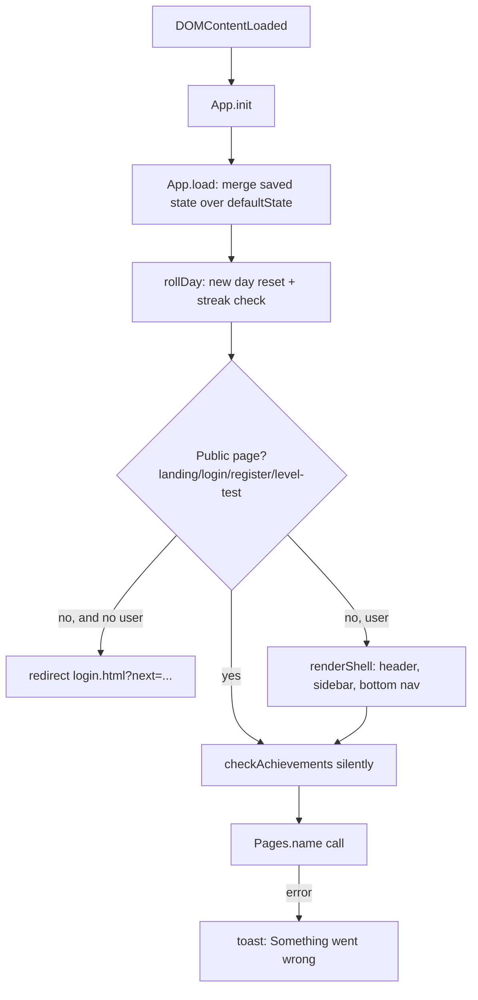
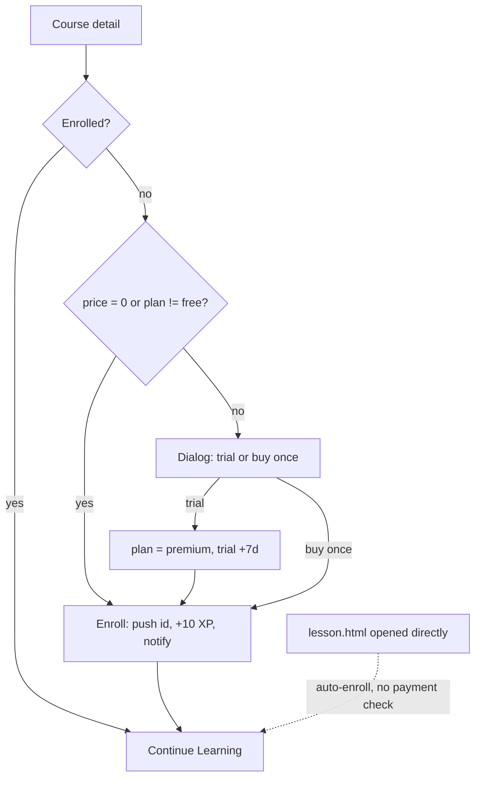
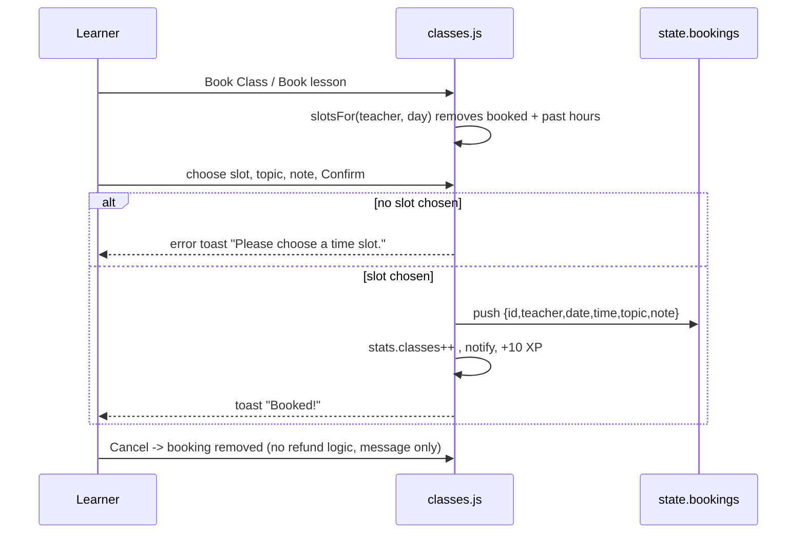

# EnglishUp — Product, Business and QA Guideline

> Scope: this document describes the **actual behaviour** of the code in the `englishup/` folder (static HTML/CSS/JS demo, no backend).
> Anything that is not visible in the code is labelled **Assumption** or **Unknown / not implemented**. Vietnamese UI text is kept in parentheses or quotes exactly as in the code.

---

## Table of Contents

1. [Project overview](#1-project-overview)
   - 1.1 Purpose · 1.2 Tech stack · 1.3 File structure · 1.4 How to run · 1.5 Storage (localStorage keys) · 1.6 Seed / mock data · 1.7 Demo credentials · 1.8 Script loading order
2. [User guideline](#2-user-guideline)
   - 2.1 Roles · 2.2 Global UI (shell) · 2.3 Screen-by-screen guide · 2.4 Step-by-step tasks
3. [Business guideline](#3-business-guideline)
   - 3.1 Entities · 3.2 Gamification rules (XP, level, streak, goals, badges) · 3.3 Statuses and state transitions · 3.4 Permissions per role · 3.5 Pricing and formulas · 3.6 Scoring formulas · 3.7 Validation summary · 3.8 Business scenarios
4. [Feature details](#4-feature-details)
5. [Key workflows and module relationships](#5-key-workflows-and-module-relationships)
6. [Known limitations and gaps](#6-known-limitations-and-gaps)
7. [QA test checklist](#7-qa-test-checklist)
8. [Appendix — constants and reference tables](#8-appendix--constants-and-reference-tables)

---

## 1. Project overview

### 1.1 Purpose

**EnglishUp — "Learn English. Speak with Confidence."** is a front-end-only demo of an English-learning product aimed at **Vietnamese learners** (CEFR A1–C2). It demonstrates:

- a marketing landing page with pricing;
- account registration/login (simulated);
- a CEFR level test with a recommended learning path;
- courses and a lesson player;
- practice modules: pronunciation coach, AI speaking scenarios, vocabulary (spaced repetition), grammar, listening;
- AI tutor and writing checker (rule-based mock "AI");
- live-class marketplace with 1-on-1 teacher booking (simulated);
- gamification (XP, levels, streak, badges, daily challenge, leaderboard);
- progress analytics, profile, subscription and settings.

There is **no backend**. All "AI", payment, booking, email and Google-login behaviour is simulated in the browser (README: "Nothing leaves your browser").

### 1.2 Tech stack

| Item | Value |
|---|---|
| Markup | HTML5, one file per page (20 pages) |
| Styling | Plain CSS: `style.css` (tokens, dark theme, layout), `components.css`, `pages.css`, `responsive.css` |
| Scripting | Vanilla ES6+ JavaScript, `'use strict'`, no framework, no bundler, no npm |
| Font | Google Fonts "Be Vietnam Pro" (loaded from `fonts.googleapis.com`; the only external dependency) |
| Audio | Browser Web Speech API — `speechSynthesis` (text-to-speech) for all audio; `SpeechRecognition` only in Speaking practice |
| Charts | Hand-written CSS/SVG helpers (`barChart`, `lineChart`, `ring`, `progressBar`) |
| Icons | Inline SVG (`ICONS` map in `utils.js`) and emoji |
| Persistence | Browser `localStorage` |

### 1.3 File structure

```
englishup/
├── index.html               Landing page (data-page="landing")
├── login.html               Login + forgot password
├── register.html            Registration
├── level-test.html          CEFR level test (public)
├── dashboard.html           Student dashboard
├── courses.html             Course catalogue
├── course-detail.html       Course detail / enroll
├── lesson.html              Lesson player
├── pronunciation.html       AI Pronunciation Coach
├── speaking.html            Speaking practice (10 scenarios)
├── vocabulary.html          Vocabulary builder (5 modes)
├── grammar.html             Grammar (7 topics)
├── listening.html           Listening (10 clips)
├── live-classes.html        Teacher marketplace + my bookings
├── teacher.html             Teacher profile + booking
├── ai-tutor.html            AI English Tutor (chat)
├── writing-checker.html     AI Writing Checker
├── practice.html            Practice hub + daily challenge
├── progress.html            Progress analytics
├── achievements.html        Level, badges, leaderboard
├── profile.html             Profile, #subscription, #settings
├── README.md                Short project README
├── GUIDELINE.md             This file
├── assets/{audio,images,icons}/README.txt   Placeholders only (no binary assets needed)
├── css/  style.css · components.css · pages.css · responsive.css
└── js/
    utils.js       helpers, Store, icons, toast, modal, TTS, charts
    data.js        ALL mock content (DATA.*)
    app.js         App state, shell (header/sidebar), XP/streak/badges, search, notifications,
                   landing page logic, shared checkGrammar()
    auth.js        login, register, Google (simulated), level test
    dashboard.js   dashboard
    courses.js     course list + course detail
    lessons.js     lesson player
    vocabulary.js  vocabulary builder
    pronunciation.js
    speaking.js
    grammar.js
    listening.js
    classes.js     live classes + teacher page (Pages['live-classes'], Pages.teacher)
    tutor.js       AI tutor + writing checker
    progress.js    progress, achievements, practice hub (Pages.progress / achievements / practice)
    profile.js     profile, subscription, settings
```

Page → script mapping (each HTML loads `utils.js`, `data.js`, `app.js`, then one page script):

| `data-page` | Page script |
|---|---|
| landing | (none; logic is inside `app.js`) |
| login, register, level-test | `auth.js` |
| dashboard | `dashboard.js` |
| courses, course-detail | `courses.js` |
| lesson | `lessons.js` |
| vocabulary / pronunciation / speaking / grammar / listening | same-named `.js` |
| live-classes, teacher | `classes.js` |
| ai-tutor, writing-checker | `tutor.js` |
| progress, achievements, practice | `progress.js` |
| profile | `profile.js` |

### 1.4 How to run

1. Open `index.html` in a modern browser (Chrome or Edge recommended for better English voices). No server, install or build step is required.
2. Optional: serve the folder over http(s) (e.g. any static server). This matters for **one** feature: real speech recognition in Speaking practice works only over http(s) (`location.protocol !== 'file:'`); when opened as a local file the answer is simulated.
3. Internet is only needed for the Google Font; the app works offline otherwise (font falls back).

### 1.5 Storage (localStorage keys)

| Key | Content | Written by |
|---|---|---|
| `englishup_state` | The entire learner state (JSON, see below) | `App.save()` |
| `englishup_users` | Array of registered accounts `{name, email, password, level, goal, hue}` (password in **plain text**) | `App.saveUsers()` (register, profile save) |
| `englishup_remember` | Email string when "Remember me" is ticked on login | `login` |
| `englishup_collapsed` | `true/false` — desktop sidebar collapsed | sidebar toggle |

If `localStorage` is blocked/full, `Store` swallows errors (state then lives only in memory for the page).

**`englishup_state` fields** (from `defaultState()` plus fields added lazily by pages):

| Field | Meaning | Default (demo seed) |
|---|---|---|
| `user` | Logged-in session `{name,email,level,goal,hue}` or `null` | `null` |
| `xp` | Total XP | 1240 |
| `streak` / `lastActive` | Current streak days / last active date `YYYY-MM-DD` | 12 / today |
| `todayDate`, `todayMinutes`, `dailyGoal` | Day marker, minutes today, goal | today, 20, 30 |
| `weekly` | 7 numbers, Monday = index 0, minutes per weekday | `[25,35,20,45,30,40,15]` |
| `totalMinutes` | Lifetime minutes | 2840 |
| `stats` | `lessons 47, speaking 34, pronunciation 58, wordsBase 386, grammar 12, classes 0, pronBest 87, challenges 3, speakingScores[7], vocabGrowth[7]` (+ `writing` added lazily) | see left |
| `skills` | Speaking 72, Listening 65, Vocabulary 81, Grammar 70, Pronunciation 76 (percent) | see left |
| `enrolled` | Course ids | `['c3','c5','c11']` |
| `completed` | `{courseId: [lessonIds]}` | c3: c3-1..c3-4; c5: c5-1, c5-2 |
| `lastLesson` | `{course, lesson}` | `{c3, c3-5}` |
| `todayDone` | Today's completed activity keys (`lesson`, `vocabulary`, `pronunciation`, `speaking`, `grammar`, `listening`) | `[]` |
| `favorites` | Favourite vocab ids | `[]` |
| `srs` | `{wordId: {box, due}}` spaced-repetition data | `{}` |
| `notes` | `{lessonId: text}` | `{}` |
| `settings` | `dark false, sound true, speed 1, notifications true, hints 'vi', privacy 'public', reminder '20:00'` | see left |
| `notifications` | List (max 30) `{id, icon, text, time, read}` | 10 seeded, all unread |
| `bookings` | Live-class bookings | `[]` |
| `challenge` | `{date, words, pron, speak, claimed}` | zeros |
| `plan` | `free \| basic \| premium \| pro` (see gap G-7 for `*-trial` values) | `free` |
| `planTrialEnds` | `dd/mm/yyyy` text (lazily set) | undefined |
| `levelTest` | `{level, score, date}` or `null` | `null` |
| `pronHistory` | Last 40 attempts `{id,text,score,date,t}` | `[]` |
| `grammarBest`, `listenDone`, `tutor` | Lazily created: best score per grammar topic; best score per listening clip; `{messages, fixes}` | – |

Loading merges saved data over defaults (shallow, with deep merge for `stats`, `settings`, `challenge`).

### 1.6 Seed / mock data (`js/data.js`)

| Dataset | Count / detail |
|---|---|
| `DATA.levels` | A1 Beginner, A2 Elementary, B1 Intermediate, B2 Upper Intermediate, C1 Advanced, C2 Proficient |
| `DATA.categories` | General English, Communication, Professional English, Exam Preparation |
| `DATA.courses` | **17** courses (c1–c17). Price 0 for c1 and c5 (free); others 149,000–399,000đ |
| `DATA.lessons` | **30** hand-written lessons = 6 each for **c3, c5, c11, c14, c15**. Other 12 courses have `syllabus` (6 titles each) and their lessons are **auto-generated** at runtime (`generateLesson`) |
| `DATA.vocab` | **50** words (ids `w1`–`w50`), topics daily/emotions/work/tech/travel/ielts, levels A2–C1 |
| `DATA.grammar` | **7** topics (tenses, articles, prepositions, modals, conditionals, passive, relative) with **20** questions in total |
| `DATA.listening` | **10** clips (ls1–ls10), **20** questions |
| `DATA.scenarios` | **10** speaking scenarios (s1–s10), 3 turns each (30 AI turns) |
| `DATA.pronunciation` | **10** sentences (p1–p10) |
| `DATA.teachers` | **10** teachers (t1–t10), prices 160,000–350,000đ per 50 min, weekly slot templates |
| `DATA.levelTest` | **16** questions (weights 1–5) |
| `DATA.xpLevels` | 5 XP levels; `DATA.achievements` 10 badges; `DATA.leaderboard` 8 fake users; `DATA.notifications` 10; `DATA.plans` 4 |
| `DATA.grammarRules` | 22 regex rules ("mock AI" grammar engine); `DATA.betterWords` (15 entries), `DATA.naturalWords` (13 entries) |

### 1.7 Demo credentials

| Account | Email | Password |
|---|---|---|
| Built-in demo (default when `englishup_users` is absent) | `phuong@englishup.vn` | `demo123` |
| Google (simulated, no password) | `phuong.nguyen@gmail.com` (Nguyen Thi Phuong) or `quan.tran@gmail.com` (Tran Minh Quan) | – |

The login page has a "Demo account" box with a button that fills the demo credentials and submits.

### 1.8 Script loading order (why it matters)

`utils.js` (globals `$`, `Store`, `toast`, `openModal`, `speak`, charts) → `data.js` (`DATA`) → `app.js` (`App`, `Pages`, `defaultState`, `checkGrammar`) → page script (registers `Pages.<name>`). On `DOMContentLoaded`, `App.init()` loads state, applies theme, runs the auth guard, renders the shell, checks badges, then calls `Pages[document.body.dataset.page]()`. Any exception inside the page function is caught and shown as toast **"Something went wrong on this page. Please reload."**

---

## 2. User guideline

### 2.1 Roles

The app has **one real role: the logged-in learner (student)**. There is no admin, teacher-login or back-office UI.

| Role | What it is in the code | Access |
|---|---|---|
| Visitor (not logged in) | `App.state.user === null` | Only *public pages*: `index`, `login`, `register`, `level-test` (constant `PUBLIC_PAGES`). Any other page redirects to `login.html?next=<page>` |
| Learner (Free plan) | Logged in, `plan = 'free'` | All learner pages (see gap G-6: plan limits are not enforced) |
| Learner (Basic / Premium / Pro) | Logged in, plan set in Profile | Same as above; plan changes only labels, the sidebar "Go Premium" card and the enroll flow |
| Teacher | **Data only** (`DATA.teachers`) — profile shown to learners | No login, no teacher-side features |

**Unknown / not implemented:** admin/instructor dashboards, teacher schedule management, multi-user sharing of data (all data is per-browser).

### 2.2 Global UI (the "shell")

Shown on every non-public page (`App.renderShell`).

| Element | Behaviour |
|---|---|
| Skip link | "Skip to content" (keyboard accessibility) |
| Top bar | Logo → dashboard; **global search**; level pill (e.g. "B1 Intermediate", links to Achievements); streak pill (🔥 n, links to Progress); **hint language select** (🇻🇳 VI / 🇬🇧 EN); **notifications** bell; **account menu** |
| Global search | Needs **≥ 2 characters** (debounced 150 ms). Searches page names, course title/category, vocabulary word/Vietnamese, grammar name/title, teacher name/specialty. Shows max **8** results with type badges. Enter opens the first result; Arrow keys move through results. Empty result text: `No results for "<q>". Try "improve", "IELTS" or "present perfect".` |
| Notifications | Badge shows unread count (`9+` if more than 9). Click an item to mark it read; "Mark all as read". Empty state "You are all caught up". Max 30 kept |
| Account menu | Profile, Settings, Subscription (shows plan id), Dark mode switch, Log out |
| Sidebar | Groups **Learn** (Dashboard, Learn, Courses), **Skills** (Speaking, Pronunciation, Vocabulary, Grammar, Listening), **Practice** (Live Classes, Practice, AI Tutor, Writing Checker), **You** (Progress, Achievements, Subscription, Settings). On Free plan an upgrade card "Go Premium — Try 7 days free" appears |
| Mobile | ≤ 768 px: sidebar becomes a drawer (hamburger); a **bottom nav** shows Home / Learn / Practice / Progress / Profile. Desktop: hamburger collapses the sidebar (remembered in `englishup_collapsed`) |
| Toasts | Bottom notifications: success, error, info, warning, xp (⚡) |
| Modals | Close with ✕, Escape, or clicking the overlay; focus is trapped |
| Hint language | "VI" shows Vietnamese hints (`.vi-hint`, translation boxes); "EN" hides them (`data-hints="en"`) |
| Dark mode | Toggle in account menu or Settings; applied before paint via inline script on landing page |

### 2.3 Screen-by-screen guide

| # | Screen (file) | What the user sees / can do |
|---|---|---|
| 1 | **Landing** `index.html` | Hero with animated pronunciation demo ("Listen" reads "I would like to improve my English."), features, "Why EnglishUp", learning paths, testimonials, **pricing** (monthly/yearly switch), CTA buttons. If logged in, CTAs point to the dashboard and "Log in" becomes "Go to dashboard". Footer links About/Blog/Contact/Help Center/Terms/Privacy and Fb/YT/TT show toast "*<label> page is coming soon in this demo.*" (`data-soon`). Newsletter form validates email |
| 2 | **Login** `login.html` | Email + password, Show/Hide password, Remember me, Google (simulated), "Demo account" button, "Forgot password" view |
| 3 | **Register** `register.html` | Full name, email, password (with strength meter), confirm, level, learning goal, Terms checkbox, Google option |
| 4 | **Level test** `level-test.html` | Intro (16 questions, ~10 minutes, 4 skills) → questions one at a time → result with level, per-skill percentages and recommended path |
| 5 | **Dashboard** | Greeting, level/XP pills, **Daily goal** ring (editable), **Continue learning** card, **Today's lessons** (4 shortcuts), **Streak** card, **Weekly activity** bar chart, **Skills** bars, **Today's challenge** mini card, **Leaderboard** mini, side card (upcoming class / level-test prompt / "Talk to a teacher") |
| 6 | **Courses** | Category tabs, search, level filter, sort (popular / rating / price / level), "My courses" toggle, "Recommended for your level" note; grouped by category when no filter |
| 7 | **Course detail** | Hero (rating, students, lessons, duration), Enroll / Continue / Preview lesson 1, what you will learn, curriculum (lock icons before enrolment), reviews (static text), teacher card, "This course includes" |
| 8 | **Lesson player** | Left: lesson list + progress. Centre: simulated video, tabs Vocabulary / Explanation / Examples / Practice, Previous / Mark Complete / Next. Right: progress ring, notes (autosave), tip |
| 9 | **Pronunciation** | Sentence with tappable words, Listen / Slow, record button, result (score ring, Accuracy/Fluency/Intonation, coach tips), Compare modal, stats, sentence list, recent attempts |
| 10 | **Speaking** | Scenario list with category chips; chat with AI partner; suggested phrases, vocabulary hints, mic button, Translation switch, Restart; summary card at the end |
| 11 | **Vocabulary** | KPIs, topic filter, favourites filter, word search, 5 modes (Flashcards, Multiple Choice, Fill in the Blank, Matching, Listening), word list with memory dots |
| 12 | **Grammar** | Topic tabs (best score badge), lesson explanation (EN + VI), practice questions with instant feedback and result screen |
| 13 | **Listening** | Player (play/pause, replay, speed 0.75/1/1.25x, seek), Transcript and Vietnamese translation toggles, questions, clip list with best scores |
| 14 | **Live classes** | "Your upcoming classes" (Join / Cancel), 7 filters, teacher cards (Profile / Book Class) |
| 15 | **Teacher profile** | About, certifications, 14-day calendar, slots, reviews, booking card, "Message" |
| 16 | **AI Tutor** | Chat with 6 quick-action modes, "Try these" sentences, message/correction counters |
| 17 | **Writing Checker** | Text area (3,000 chars), 3 sample texts, 4 actions: Check Grammar / Improve Writing / Make It More Natural / Translate to Vietnamese |
| 18 | **Practice hub** | Today's Challenge (3 tasks, claim +100 XP) + 9 tool cards |
| 19 | **Progress** | 6 KPIs, weekly chart, weekly goal ring, skill rings, monthly chart, vocabulary growth, speaking scores, 12-week heatmap |
| 20 | **Achievements** | XP level card and path, badges (progress bars), leaderboard (This week / All time) |
| 21 | **Profile** `profile.html` | Profile card, personal information form, **Subscription** (`#subscription`), **Settings** (`#settings`), Reset demo data, Log out |

### 2.4 Step-by-step tasks

**A. Sign in with the demo account**
1. Open `login.html` (or click *Log in* on the landing page).
2. Click **Demo account → button**, or type `phuong@englishup.vn` / `demo123`, then **Log in**.
3. After ~0.7 s you are redirected to `dashboard.html` (or to the page in `?next=`).

**B. Create an account**
1. Open `register.html` (from the landing page: *Start Learning*).
2. Fill name (≥ 2 chars), a valid unused email, password (≥ 6 chars), confirm password, level (pre-filled from the level test if taken), goal.
3. Tick the Terms box → **Create account**. You land on the dashboard with 50 XP, a 1-day streak, no enrolled courses and a welcome notification.

**C. Take the level test and follow the recommendation**
1. `level-test.html` → **Start the test**.
2. Answer each question (click, or press 1–4 / A–D). *Next* is disabled until you pick an answer; *Previous* is allowed. Listening questions have a **Play audio** button (replay allowed; turn sound on).
3. On question 16 press **Submit** (button replaces *Next*). If any question is unanswered you get a warning and are taken to that question.
4. Read the result (level, score, skill %, recommended path). Click **Start recommended course** (logged in) or **Create free account** (visitor). **Retake test** restarts.

**D. Enroll in a course and learn**
1. `courses.html` → filter/search → open a course.
2. Free course: **Enroll for free**. Paid course on the Free plan: **Enroll for <price>** opens a dialog — choose *Start Premium free trial* (7 days free) or *Buy this course* (demo, no payment) → **Confirm**.
3. Click **Start first lesson / Continue Learning**.
4. In the lesson: (optional) play the simulated video; read tabs; answer *Practice* questions; write notes; click **Mark Complete** (+20 XP). Use *Next* to move on.
5. When all lessons are complete you get "Course complete!" (+100 XP).

**E. Practise pronunciation**
1. `pronunciation.html` → pick a sentence → **Listen** (or **Slow**); click a word to hear it slowly (a tip toast appears if the sentence defines one).
2. Click the microphone (**Start Recording**), read aloud, click stop (auto-stops after 8 s). Recording shorter than 0.8 s is rejected.
3. Read the score, per-word marks (✓ ⚠ ✕) and tips; **Record again**, **Compare**, or **Next sentence**.

**F. Speaking conversation**
1. `speaking.html` → choose a scenario (or *Start: Ordering Coffee*).
2. Read the AI line (it is also spoken). Answer by typing, clicking a suggested phrase, or the mic.
3. Grammar mistakes trigger a "Quick correction" card. After 3 turns you get a score summary and +30 XP.

**G. Vocabulary review**
1. `vocabulary.html` → *Flashcards*: click the card (or Space) to flip; **I know** (→) or **Review** (←); **Listen** (L); **☆ Favorite**.
2. Other modes: Multiple Choice / Fill in the Blank / Listening (8 questions), Matching (5 pairs).

**H. Book a live class**
1. `live-classes.html` → filter → **Book Class** (or open a teacher profile → choose day and time → **Book lesson**).
2. In the dialog choose a slot, topic, optional note → **Confirm booking · <price>**.
3. The class appears under "Your upcoming classes" with **Join** (waiting-room dialog only) and **Cancel** (free cancellation message, removes the booking).

**I. Claim the daily challenge**
1. `practice.html` (or dashboard mini card). Complete: 10 new words (Flashcards "I know" on new words), 5 pronunciation attempts, 5 speaking minutes.
2. When all three are complete, **Claim +100 XP** becomes enabled. It can be claimed once per day.

**J. Change subscription**
1. `profile.html#subscription` → Monthly/Yearly switch → choose plan → payment method dialog → confirm.
2. First paid selection from Free shows **Start 7-day free trial** ("You pay 0đ today"). **Cancel subscription** returns to Free.

**K. Reset**
`Profile → Settings → Reset demo data → Reset`: restores default progress (keeps you logged in) and reloads the page.

---

## 3. Business guideline

### 3.1 Entities

| Entity | Key fields | Relationships |
|---|---|---|
| **User (account)** — `englishup_users` | name, email, password, level, goal, hue | 1 account ⇢ *the single* `englishup_state` (state is not partitioned per account, see G-2) |
| **Session user** — `state.user` | name, email, level (default `B1`), goal (default "Speak confidently at work"), hue (default 235) | Set on login, cleared on logout |
| **Course** | id, title, category, level, duration (text), rating, students, price (VND), emoji, hue, teacher, tags[], desc, outcomes[], syllabus[] (optional) | Belongs to 1 category; taught by 1 teacher (`teacher`); has N lessons; `tags` match vocabulary topics |
| **Lesson** | id (`<course>-<n>`), course, n, title, duration ("N min"), script, vocab[[word,ipa,vi]], explain{en,vi}, examples[[en,vi]], practice[{q,options,answer,vi}] | Belongs to a course. Hand-written for c3,c5,c11,c14,c15; otherwise generated with `generated:true`, duration `8 + (i*3) % 7` min |
| **Enrolment** | `state.enrolled[]`, `state.completed[courseId][]`, `state.lastLesson` | User ↔ Course |
| **Vocabulary word** | id, word, ipa, pos, vi, example, exVi, topic, level | Topics via `DATA.vocabTopics`; SRS record in `state.srs[id]` |
| **SRS record** | box (0–5), due (date) | One per learned word |
| **Grammar topic** | id, name, emoji, title, formula, example(+Vi), en, vi, tip, examples[], questions[{q,options,answer,vi}] | 7 topics |
| **Listening clip** | id, title, level, topic, transcript, vi, questions[] | 10 clips |
| **Scenario** | id, title, category, emoji, level, desc, role, turns[{ai, vi, suggestions[], hints[[word,vi]]}] | 10 scenarios × 3 turns |
| **Pronunciation sentence** | id, text, level, focus, hard[] (words likely to be flagged), tips{word:tip} | 10 |
| **Teacher** | id, name, country, flag, rating, classes, spec, topics[], levels[], price (VND per 50 min), years, intro, certs[], langs, reviews[], slots{weekday(0=Sun..6):[HH:MM]} | Teacher ↔ Course (`course.teacher`); Teacher ↔ Booking |
| **Booking** | id (`b<timestamp>`), teacher, date (`YYYY-MM-DD`), time (`HH:MM`), topic, note | User ↔ Teacher |
| **Plan** | id (free/basic/premium/pro), name, monthly price, desc, features[], popular | `state.plan` |
| **Achievement (badge)** | id, icon, name, desc, metric, target | Unlocked ids in `state.unlocked` |
| **Notification** | id, icon, text, time (free text), read | `state.notifications` (max 30) |
| **Daily challenge** | date, words, pron, speak, claimed | Reset every new day |
| **Level-test result** | level, score, date | `state.levelTest` |

### 3.2 Gamification rules

**XP awards (all from code)**

| Action | XP | Where / condition |
|---|---|---|
| Lesson marked complete | +20 | Once per lesson |
| Course completed (all lessons done) | +100 | On the completing lesson, in addition to +20 |
| Correct lesson practice answer | +5 | Each correct answer (see G-10 about repeats) |
| Enroll in a course | +10 | Each successful enrolment |
| Level test finished | +30 | Only if logged in (see G-11) |
| Flashcard "I know" on a *new* word (box 0) | +5 | Also `challenge.words += 1` |
| Vocabulary quiz (choice / blank / listening) | +3 × correct answers | On finishing 8 questions (skipped question = 0) |
| Matching game finished | `max(5, 15 − 2 × mistakes)` | |
| Pronunciation attempt | +10, or +15 if score ≥ 90 | Every attempt |
| Speaking conversation completed | +30 | After the 3rd turn |
| Grammar: correct answer | +5 | |
| Grammar: topic completed | +20 | Every completion (incl. retries) |
| Listening: correct answer | +5 | |
| Listening: clip completed (all questions answered) | +15 | |
| Class booked | +10 | |
| AI Tutor | +10 on every 5th message (persistent counter); +25 when the 6-question mock interview ends | |
| Writing Checker | +10 for "Apply all" and +10 for "Use this version" | |
| Daily challenge claimed | +100 | Once per day, all 3 tasks done |

The Achievements page text says: "How to earn XP: lesson +20 · pronunciation +10–15 · conversation +30 · grammar +20 · daily challenge +100."

**XP levels** (`DATA.xpLevels`; level = highest row whose `min` ≤ XP)

| Level | Name | Min XP |
|---|---|---|
| 1 | Beginner | 0 |
| 2 | Explorer | 500 |
| 3 | Speaker | 1,500 |
| 4 | Communicator | 3,500 |
| 5 | Fluent | 7,000 (max) |

Progress to next level: `(xp − cur.min) / (next.min − cur.min) × 100`. On a level-up, a notification "Level up! You are now Level N — Name." and a modal "Level up! 🎉" appear. A user on the demo seed (1,240 XP) starts at Level 2.

**Streak and daily reset**
- `rollDay()` (each page load): if `todayDate ≠ today` → reset `todayMinutes = 0`, `todayDone = []`, `challenge` (all zero, `claimed=false`). If `lastActive` is neither today nor yesterday → `streak = 0`.
- `touch()` (on XP gain or minutes logged): if `lastActive ≠ today` → `streak = (lastActive == yesterday) ? streak + 1 : 1`; set `lastActive = today`; toast "🔥 N-day streak!".
- Streak is therefore earned by **any XP or study-minute event**.

**Daily goal**
- Options: 10, 15, 20, 30, 45, 60 minutes (Dashboard "Edit" dialog and Profile "Daily target"). Default 30.
- `logMinutes(min)` adds to `todayMinutes`, `totalMinutes` and the weekday slot (Monday = 0). When it crosses the goal (`wasBelow` and now ≥ goal) → notification "Daily goal complete! Great job today." and toast "🎯 Daily goal complete! Hoàn thành mục tiêu hôm nay."
- Dashboard ring % = `todayMinutes / dailyGoal × 100`. Weekly goal (Progress) = `dailyGoal × 7`.

**Study minutes logged per activity**

| Activity | Minutes |
|---|---|
| Lesson complete | `parseInt(lesson.duration)` or 10 |
| Flashcards | 2 min for every 5th graded card (`qi % 5 === 4`) |
| Vocabulary quiz finished | 3 |
| Matching finished | 2 |
| Pronunciation attempt | 1 |
| Speaking conversation | `max(2, round(elapsed_ms / 60000))` |
| Grammar topic finished | 4 |
| Listening clip finished | 3 |
| AI Tutor message | 1 |

**Badges** (`metric ≥ target` → unlocked; checked on every page init and after each XP award)

| Id | Badge | Metric (source) | Target |
|---|---|---|---|
| a1 | 🌟 First Step | lessons (`stats.lessons`) | 1 |
| a2 | 🔥 7 Day Streak | streak | 7 |
| a3 | 💪 30 Day Streak | streak | 30 |
| a4 | 🎯 100 Lessons | lessons | 100 |
| a5 | 🗣 50 Speaking Sessions | speaking (`stats.speaking`) | 50 |
| a6 | 📚 1,000 Words | words = `stats.wordsBase + count(srs box>0)` | 1000 |
| a7 | 🎙 Clear Speaker | pronBest (`stats.pronBest`) | 95 |
| a8 | 🧠 Grammar Guru | grammar (`stats.grammar` = completed grammar practices) | 50 |
| a9 | 👩‍🏫 Class Act | classes (`stats.classes`) | 1 |
| a10 | 🏆 English Master | xp | 7000 |

Toast + notification "Badge unlocked: …" only appear after the app has booted (`_booted`), so badges already earned at page load are unlocked silently.

**Skill percentages** (`state.skills`, shown on Dashboard/Progress): +1 (max 100) for Pronunciation when attempt score ≥ 85; Speaking when conversation score ≥ 80; Grammar when a topic result ≥ 80%; Listening when a clip is answered 100% correctly. Vocabulary skill is never changed by code (see G-14).

**Daily challenge** (`App.challengeTasks`)

| Task | Need | Counter incremented by |
|---|---|---|
| Learn 10 new words ("Học 10 từ mới") | 10 | Flashcard "I know" on a word in box 0 |
| Complete 5 pronunciation exercises ("Hoàn thành 5 bài phát âm") | 5 | Each pronunciation analysis |
| Speak for 5 minutes ("Nói tiếng Anh 5 phút") | 5 | Speaking conversation adds `mins` (≥ 2) |

Displayed values are capped at need. Reward +100 XP once per day; `stats.challenges` increments on claim.

### 3.3 Statuses and state transitions

| Object | States | Transitions |
|---|---|---|
| **Session** | Anonymous → Logged in | login / register / Google → `state.user` set. Logout → `user = null`, go to `login.html` (progress stays in storage) |
| **Course (per learner)** | Not enrolled → Enrolled → In progress → Completed | Enroll (button) or **auto-enroll when a lesson page is opened**. Completed when `completed[course].length === lessons.length` (no separate flag; UI shows 100%) |
| **Lesson** | Not done → Done | "Mark Complete" (one-way; clicking again shows *"This lesson is already complete. Bài này đã hoàn thành."*). No "un-complete" |
| **Vocabulary word (SRS box)** | box 0 (new/relearn) → 1 → 2 → 3 → 4 → 5 | "I know": `box = min(box+1, 5)`, `due = today + SRS_DAYS[box]`. "Review": `box = 0`, `due = today`, card re-queued at the end |
| **Booking** | Booked → (Cancelled = deleted) / Past (hidden from lists) | Book → stored. Cancel → removed from array. Past bookings stay in storage but are filtered from UI (`date >= today`). No "completed" status |
| **Subscription** | free ⇄ basic / premium / pro; "trial" as a date label only | See 3.5 |
| **Daily challenge** | Open → All done → Claimed | Claim is one-way for the day; new day resets |
| **Badge** | Locked → Unlocked | One-way, stored ids |
| **Notification** | Unread → Read | Click item or "Mark all as read" |
| **Pronunciation session** | idle → recording → analyzing → done | See 4.5 |

SRS interval table (`SRS_DAYS = [0, 1, 3, 7, 14, 30]`):

| Box after "I know" | Next review in |
|---|---|
| 1 | 1 day |
| 2 | 3 days |
| 3 | 7 days |
| 4 | 14 days |
| 5 | 30 days (stays in box 5) |

### 3.4 Permissions per role

| Capability | Visitor | Learner |
|---|---|---|
| View landing, pricing, login, register | Yes | Yes (login/register redirect to dashboard if already logged in) |
| Take the level test | Yes (result saved to local state; XP not awarded) | Yes (+30 XP, user level updated) |
| All other pages | No → redirect `login.html?next=…` | Yes |
| Enroll in paid course | – | Any plan (free plan sees a purchase/trial dialog; no real gating, see G-6) |
| Book a class | – | Any plan (no plan check) |
| Edit profile / plan / settings | – | Yes |
| Admin, teacher, content-management features | Unknown / not implemented | Unknown / not implemented |

### 3.5 Pricing and calculation formulas

**Plans** (`DATA.plans`)

| Plan | Monthly | Yearly per-month price* | Billed yearly (×12) | Features (text only) |
|---|---|---|---|---|
| Free | 0đ | 0đ | "Free forever" | 3 lessons per day; Basic pronunciation check; 50 flashcards; Level test |
| Basic | 99,000đ | 69,000đ | 828,000đ | Unlimited lessons; Full vocabulary builder; Grammar & listening; Progress reports |
| Premium (popular) | 199,000đ | 139,000đ | 1,668,000đ | Everything in Basic; AI Pronunciation Coach; AI Tutor & Writing Checker; All speaking scenarios |
| Pro | 399,000đ | 279,000đ | 3,348,000đ | Everything in Premium; 4 live classes per month; IELTS / TOEIC courses; Personal study plan |

\* `yearlyPerMonth = round(monthly × 0.7 / 1000) × 1000` (labelled "-30%" in Profile). Formatting: `fmtVND(n)` = `0đ` for 0, otherwise thousands separated with commas plus `đ`.

**Trial / subscription rules (as implemented)**
- Trial is offered **only when the current plan is `free`**: dialog shows "You pay 0đ today. Cancel anytime during the 7-day trial." and `planTrialEnds = today + 7 days` formatted `dd/mm/yyyy`. Profile displays "Free trial until dd/mm/yyyy".
- Switching between paid plans (`Switch plan`): dialog "Confirm", no trial, `planTrialEnds` unchanged.
- "Downgrade to Free" (and dialog-less) sets `plan = 'free'`, `planTrialEnds = null`.
- **Cancel subscription** dialog: "You will keep premium features until the end of the current period, then move to the Free plan." but the code sets `plan = 'free'` **immediately** (see G-8).
- Payment methods shown (not stored, not validated): MoMo, ZaloPay, Visa / Mastercard, Bank transfer (VietQR). "Demo only — no real payment is made."
- No trial expiry logic exists: `planTrialEnds` is never compared with today (G-9).

**Course enrolment pricing**
- `price = 0` → "Enroll for free". Paid: label "Enroll for <price>".
- Enrol immediately when `price = 0` **or** `plan !== 'free'` (any paid plan gets every course; text: "Included in Premium").
- Free plan + paid course → dialog: (a) *Start Premium free trial* — "7 days free, then 199,000đ/month. Access every course." → sets `plan = 'premium'` and `planTrialEnds`; (b) *Buy this course* — "One-time payment of <price>. Demo — no payment is taken." → only enrols (no purchase record).

**Live class pricing**
- Each teacher has `price` for a 50-minute session (160,000–350,000đ). Booking button label `Confirm booking · <price>`. No wallet, no payment, no plan/credit deduction (Pro's "4 live classes per month" is not enforced).
- Price filter buckets: "Under 200,000đ" (0–200000), "200,000đ – 300,000đ" (200000–300000), "Over 300,000đ" (300000–9999999); ranges are inclusive, so exactly 200,000 and 300,000 belong to two buckets.
- Marketing/UI price statements are inconsistent: landing says "from 180,000đ", dashboard says "Classes from 160,000đ" (the real minimum is 160,000đ, teacher t9).
- Cancellation: booking text "free cancellation up to 12 hours before" / "Bạn có thể hủy miễn phí trước giờ học 12 tiếng." The cancel dialog **always** states a full refund (see G-13).

**Leaderboard formulas** (`achievements` page, fake data)
- Weekly: other users `round(xp × 0.12 + (8 − index) × 15)`; you `round(xp × 0.3)`.
- All time: other users `xp`; you `xp`.
- Dashboard mini board uses all-time values (`DATA.leaderboard` + you).

### 3.6 Scoring formulas

| Area | Formula |
|---|---|
| **Level test** | `total = Σ weights (=42)`, `got = Σ weights of correct`, `pct = round(got / total × 100)`. Level: `<20` A1, `<38` A2, `<58` B1, `<75` B2, `<90` C1, otherwise C2. Category % = correct / questions in that category (Vocabulary, Grammar, Listening, Reading) |
| **Pronunciation** | `score = floor(0.4 × accuracy + 0.3 × fluency + 0.3 × intonation)`. Sentence p1 on the **first attempt of the session**: accuracy 92, fluency 81, intonation 88 → score 87, flagged word "to". Otherwise `base = prev ? min(prev.score + rand(1,6), 97) : rand(72,90)` (prev = last saved attempt of that sentence); `acc = clamp(base + rand(−3,5), 60, 99)`, `flu = clamp(base + rand(−8,3), 55, 98)`, `into = clamp(base + rand(−4,4), 58, 98)`. Each `hard` word is flagged with probability 0.25 if base > 90 else 0.6; a flagged word becomes "bad" with probability 0.4 when score < 75 |
| **Speaking** | `score = trunc(clamp(92 − 6 × corrections + min(userWords, 40)/8, 55, 98))` |
| **Writing Checker** | `words = /[a-z']+/g matches`; `uniq = unique/total`; `grammar = clamp(round(100 − issues × 60 / max(words/6, 4)), 35, 99)`; `vocab = clamp(round(60 + uniq×25 + (avgWordLen − 4)×6 − basicWords×4), 40, 97)`; `natural = clamp(round(92 − formalWords×5 − issues×2), 45, 98)`. Colour: ≥ 85 green, ≥ 70 amber, else red |
| **Course progress** | `round(completedLessons / totalLessons × 100)` (`totalLessons` ≥ 1) |
| **Words learned** | `stats.wordsBase (386) + count(srs box > 0)` |
| **Audio duration (Listening)** | Estimated `round(words / (2.6 × rate))` seconds |
| **Progress page – monthly** | Fake array `[320,410,380,520,610]` + last value `max(240, round(weeklyTotal × 3.2))` for Apr–Sep |
| **Progress page – vocab growth** | `stats.vocabGrowth` with the last point replaced by current words learned |
| **Progress page – heatmap** | 84 days; deterministic pseudo-data; days inside the current streak forced active; today = `min(4, ceil(todayMinutes/12))` |

### 3.7 Validation summary

| Where | Rule | Message (exact) |
|---|---|---|
| Login email | required | `Please enter your email. Vui lòng nhập email.` |
| Login email | regex `^[^\s@]+@[^\s@]+\.[^\s@]{2,}$` | `Email is not valid. Email không hợp lệ.` |
| Login password | length ≥ 6 | `Password must be at least 6 characters. Mật khẩu tối thiểu 6 ký tự.` |
| Login credentials | email (case-insensitive, trimmed) exists and password matches exactly | `Email or password is incorrect. Email hoặc mật khẩu không đúng. Try the demo account below.` |
| Forgot password | valid email | `Email is not valid. Email không hợp lệ.` (then shows "sent" view with the email) |
| Register name | trimmed length ≥ 2 | `Please enter your full name. Vui lòng nhập họ tên.` |
| Register email | valid format | `Email is not valid. Email không hợp lệ.` |
| Register email | unique (case-insensitive) | `This email is already registered. Email này đã được đăng ký.` |
| Register password | ≥ 6 chars | `Password must be at least 6 characters. Mật khẩu tối thiểu 6 ký tự.` |
| Register confirm | equals password and non-empty | `Passwords do not match. Mật khẩu không khớp.` |
| Register level | required | `Please choose your level. Hãy chọn trình độ.` |
| Register terms | checked | `Please accept the Terms to continue.` |
| Level test submit | all answered | `Please answer question N. Bạn chưa trả lời câu N.` (warning toast, jumps to N) |
| Profile name | trimmed ≥ 2 | `Please enter your name. Vui lòng nhập họ tên.` |
| Profile email | regex `^\S+@\S+\.\S+$` | `Invalid email. Email không hợp lệ.` |
| Booking | slot chosen | `Please choose a time slot. Vui lòng chọn giờ học.` |
| Message to teacher | non-empty | `Please write a message.` |
| Writing Checker | ≥ 3 words | `Please write at least one full sentence. Hãy viết ít nhất một câu hoàn chỉnh.` |
| Newsletter (landing) | `^\S+@\S+\.\S+$` | `Please enter a valid email. Email không hợp lệ.` |
| Pronunciation | recording ≥ 0.8 s | `Recording was too short. Hãy đọc cả câu rồi mới dừng.` |
| Writing text area | `maxlength=3000` | counter "N words · X/3000" |

### 3.8 Business scenarios (worked examples)

1. **New visitor to first lesson:** Landing → Take a Free Level Test → result B2 → *Create free account* → Register (level pre-filled B2; note "Based on your level test result: B2 Upper Intermediate") → dashboard (XP 50, streak 1) → Courses → recommended B2 courses (IELTS Preparation c15, Business English c12 are the B2 path) → enroll → lesson.
2. **Free user buys a paid course:** Course detail → Enroll for 199,000đ → choose "Start Premium free trial" → plan becomes `premium`, trial end +7 days → all later paid courses enrol instantly.
3. **Streak break:** Learner last active 3 days ago opens any page → `rollDay` sets streak 0 → studying today makes `touch()` set streak 1 (not +1).
4. **Daily goal crossing:** goal 30, `todayMinutes` 20; completing a 12-minute lesson → 32 ≥ 30 → notification + toast; the dashboard ring turns green at ≥ 100%.
5. **Class booking conflict:** booking the same teacher/date/time twice is prevented (slot disappears). Booking two different teachers at the same time is allowed (G-15).
6. **Weekly leaderboard rank:** Learner with 1,240 XP → weekly XP 372 vs seeded weekly values (e.g., top user 6820×0.12+120 = 938).

---

## 4. Feature details

Format: **Inputs → Outputs → Rules → Errors → Edge cases**.

### 4.1 Authentication (`auth.js`, `app.js`)

**Login**
- Inputs: email, password, remember-me checkbox. Buttons: Log in, Demo account, Continue with Google, Forgot password link.
- Rules: validation order email → password (see 3.7). Simulated 700 ms loading ("Logging in…"). User lookup in `App.users()` (case-insensitive email, exact password). Remember me writes `englishup_remember` (prefills email next visit) else removes it.
- Output: `App.login(user)` sets `state.user`; toast `Welcome back, <given name>!`; redirect via `goNext()` → `?next=` if it matches `^[\w-]+\.html` else `dashboard.html`.
- Given name = last word of the full name (Vietnamese order): "Nguyen Thi Phuong" → "Phuong". Initials = first letters of the last two words.
- Edge: already logged in → immediate redirect to dashboard. `#forgot` hash opens the forgot view.

**Forgot password**: only validates the email format, waits 800 ms, then shows a confirmation with the email. No account lookup, no email is sent.

**Google login (simulated)**: modal "Continue with Google" with 2 fixed accounts. Logs in immediately (level = last level-test level or `B1`), toast `Welcome, <name>!`. The Google account is **not** added to `englishup_users`.

**Register**
- Inputs: name, email, password, confirm, level (default B1, or level-test result), goal (6 options: Speak confidently at work, Pass IELTS 6.5+, Prepare for job interviews, Travel abroad, Daily conversation, English for developers), terms.
- Password strength meter: +1 for length ≥ 6, +1 for ≥ 10, +1 for mixed case, +1 for digit **and** symbol; labels `Too short, Weak, Fair, Good, Strong` (indexes 0–4).
- On submit: all fields validated; the first invalid field is focused; 800 ms "Creating account…"; account stored (`hue = rand(180,300)`); state reset for the new learner: `xp 50, streak 1, lastActive today, todayMinutes 0, weekly zeros, totalMinutes 0, enrolled [], completed {}, lastLesson null`, one notification "Welcome to EnglishUp! Start with a 10-minute lesson today.", `unlocked []`, stats zeroed (`speakingScores [0]`, `vocabGrowth [0]`), all skills 10. Query `?plan=<id>` (from landing pricing buttons) with id ≠ `free` sets `plan = '<id>-trial'` (see G-7). Toast `Account created! Chào mừng <name> 🎉`, redirect to dashboard after 600 ms.

**Logout**: clears `state.user`, stops audio, redirects to `login.html`.

**Auth guard**: any non-public page without `state.user` → `login.html?next=<file+query+hash>`.

### 4.2 Level test (`auth.js`, `DATA.levelTest`)
- 16 questions: Vocabulary ×4, Grammar ×5, Listening ×3 (audio via TTS), Reading ×4; weights 1–5 (total 42).
- Behaviour: progress bar, category badge, options as radio buttons, keyboard `1–4` / `A–D`, answers editable when navigating back. Listening question: "Play audio" (rate 0.95) with caption "You can replay it. Có thể nghe lại."
- Result view: level badge, name, `Score N/100`, CEFR scale highlighting, level description, 4 category bars, "Recommended learning path" list (`DATA.levelResults[level].skills`), primary CTA to the first recommended course (`path[0]`: A1 c1, A2 c2, B1 c3, B2 c15, C1 c4, C2 c4).
- Side effects: `state.levelTest = {level, score, date}`; if logged in, `user.level = level` (affects header pill, recommendations, teacher "Fits your level", Course "Recommended for your level" and Speaking is unaffected); +30 XP when logged in. 1.1 s "Analysing your answers…" spinner.
- Edge: `Retake test` resets answers only in memory.

### 4.3 Dashboard (`dashboard.js`)
- Greeting by hour: <12 morning, <18 afternoon, else evening, with Vietnamese hint.
- **Daily goal card**: ring, "N minutes remaining" or "Goal complete! 🎉"; button "Do a <min(left,10)>-min lesson" links to the last lesson (or courses).
- **Continue learning**: uses `state.lastLesson`; shows next lesson and course progress. Empty state: "Pick your first course" with *Browse courses* / *Take level test*.
- **Today's lessons**: 4 fixed shortcuts (Pronunciation /θ/ 10 min, Vocabulary 10 words 15 min, Listening ls4 12 min, Speaking s7 10 min). "Done" badge when the key is in `todayDone`; header shows `N/4 done`.
- **Streak card**: message "Streak saved for today. Hẹn gặp lại ngày mai!" if `lastActive == today`, otherwise "Keep your streak alive! Học ít nhất 1 bài hôm nay." Week dots mark the last `streak` days ending today (or yesterday).
- **Challenge mini**: shows tasks; button "Reward claimed ✓" / "Claim reward" / "Open challenge" (links to Practice).
- **Leaderboard mini**: top 5; if rank > 5 shows "You are #N. X XP to pass <name>."
- **Side card**: nearest future booking → "Upcoming class"; else if no level test → "Know your level"; else "Talk to a teacher".

### 4.4 Courses and lessons (`courses.js`, `lessons.js`)

**Course list**
- Filters: category tab (also via `?cat=`), text search (title + description + category), level, sort, "My courses" toggle (`aria-pressed`).
- Sorts: popular (students desc, default), rating desc, price asc, level (string compare A1…C2).
- Default view (All, no filters, sort popular) is grouped into 4 category sections with "View all". Otherwise a flat grid. Result count "N course(s)". Empty: "No courses match your filters" + *Clear filters*.
- Card shows lessons count (`courseLessons` length), duration text, rating, students, price/Free, progress and "Enrolled" badge when enrolled.

**Course detail**
- `?id=` (default `c3`); unknown id → "Course not found".
- Enroll button behaviour in 3.5. After enrolment: XP +10, notification "You enrolled in <title>.", `lastLesson` set if empty.
- Curriculum: lessons with `n > 1` show a lock icon when not enrolled (only visual; see G-5). Preview button plays lesson 1 script with TTS.
- "This course includes": `lessons × 2` practice questions, `lessons × 3` words (computed strings, not real counts).
- Reviews are hard-coded texts, teacher block links to teacher page.

**Lesson player**
- URL: `lesson.html?course=<id>&lesson=<id>`; defaults to last lesson / first enrolled / `c3`. Opening a lesson **auto-enrols** the course.
- Tabs: Vocabulary (with TTS per word), Explanation (EN + VI box), Examples (TTS), Practice (multiple-choice; feedback "Correct! Chính xác!" / "Not quite." plus VI explanation; +5 XP per correct).
- Simulated video: fixed 14 s progress animation regardless of lesson length, reads the script by TTS at rate 0.95; at the end toast "Video finished. Now try the practice questions!" and switches to the Practice tab. Time label shows a fake elapsed/total based on the lesson duration.
- Notes: textarea saved 400 ms after typing per lesson id; status "Saved ✓".
- Generated lessons (12 courses without hand-written content): 3 words drawn from vocab whose topic ∈ course tags (index `(n × 3 + k) mod pool`; fallback random 3 words), 2 practice questions "What does "<word>" mean?" with 3 random distractors, boilerplate script/explanation.
- Completion rules are in 3.2/3.3. `lastLesson` moves to the next lesson after completion.

### 4.5 Pronunciation Coach (`pronunciation.js`)
- Inputs: choice of sentence (`?s=p1..p10`), recording start/stop (simulated, **no microphone access**).
- Flow: idle → **recording** (timer 0.0s…, auto-stop at > 8 s) → **analyzing** (spinner 1.4 s) → **done**.
- Output: ring score (green ≥ 85, amber ≥ 70, red otherwise), Accuracy/Fluency/Intonation bars (`ok` ≥ 85, `mid` ≥ 70, `low`), verdict: ≥ 90 "Excellent! 🎉", ≥ 80 "Great job! 👏", ≥ 70 "Good effort 💪", else "Keep practicing". Words marked ✓ / ⚠ / ✕; tips list with fallback text `Nghe lại từ này ở tốc độ chậm và nhấn rõ âm cuối.` If nothing flagged: "All words sounded clear."
- Actions: Listen (rate 1), Slow (0.6), click a word (rate 0.7 + tip toast), *Compare* (modal with two pseudo waveforms; "You" replays at rate 0.8 — "Your recording is simulated"), *Record again*, *Next sentence* (wraps around).
- Side effects: `stats.pronunciation++`, `pronBest = max`, history (last 40), skill +1 (score ≥ 85), challenge `pron`, `todayDone`, +1 minute, XP 10/15.
- Stats panel: Best score, Average (of the stored last 40), Exercises, Today's challenge (`min(pron,5)/5`).

### 4.6 Speaking practice (`speaking.js`)
- Categories: All, Beginner, Daily Conversation, Travel, Workplace, Interview. Scenarios s1–s10 (`?scenario=`).
- Each of 3 turns: AI message (typing 700 ms, spoken by TTS, Vietnamese line shown when *Translation* is on), suggestions (click sends), vocabulary hints (click speaks), input via typing or mic.
- After each user message: `checkGrammar(text)`; if issues → "💡 Quick correction" card (struck-out original, corrected text, explanations EN + VI); else if ≤ 2 words → soft hint "Good! Try a full sentence next time, e.g. "<suggestion>"".
- End: message "Great conversation! Here is your feedback. 🎉", summary ring, counts (turns, words, corrections), buttons *Practice again*, *Next scenario*, *Work on pronunciation*. Score formula in 3.6; `stats.speaking++`, `speakingScores` (keep last 12), skill +1 if ≥ 80, challenge `speak += minutes`, +30 XP.
- Mic: if `SpeechRecognition` exists and protocol ≠ `file:` → real recognition (`en-US`); on error toast **"Microphone unavailable — using a simulated answer."**; otherwise the mic types a random suggested phrase word-by-word (simulation) and sends it after 400 ms.
- Input ignored while `busy` (AI typing).

### 4.7 Vocabulary (`vocabulary.js`)
- Filters: topic (7 options incl. All), favourites-only toggle (toast "No favorites yet. Nhấn ☆ trên thẻ để lưu từ." when empty), search (word or Vietnamese contains).
- KPIs: Words learned (`wordsLearned`), In this deck (`learned/50`), Due for review, Favorites.
- **Flashcards**: queue = words due (new, box 0, or `due ≤ today`) sorted by box asc; if none due, whole pool. Card front: word, IPA, POS, topic/level; back: meaning, example + VI, "Next review: in N days if you know it" (or "tomorrow" for new). Keyboard (when no input focused): Space flip, ← Review, → I know, L listen. Clicking a word in the list moves it to the front of the queue and switches to Flashcards.
- Empty queue: "All caught up!" (button *Study all words anyway*); end of queue: "Session complete" with *Review again*.
- **Multiple Choice**: 4 options (Vietnamese meanings); **Fill in the Blank**: example sentence with target replaced by `_____`, hint = Vietnamese + first letter; **Listening**: TTS word (Play / Slow 0.6), user types. Answer accepted case-insensitively if equals the base word or the inflected form found in the example (`\bword\w*`). *Skip* moves on (no score). Feedback shows "Correct!" or `Answer: <word>`.
- Quiz size: `min(8, pool)`; if the filtered pool has < 4 words the whole deck is used. Result ring; message ≥ 80 "Excellent! Xuất sắc!", ≥ 50 "Good job! Làm tốt lắm!", else "Keep practising! Cố lên!"; "You earned N XP."
- **Matching**: 5 random words; select one English and one Vietnamese tile; wrong pair = mistake + shake; finish message "All matched in Ns! N mistake(s)."

### 4.8 Grammar (`grammar.js`)
- Topic tabs show best score badge (`correct/total`, green when perfect). `?topic=` supported.
- Lesson pane: formula, example with TTS, EN explanation, VI box, tip, more examples.
- Practice: one question at a time; the blank `____` is highlighted; options A–D; after answering options are disabled, correct one marked; feedback `✓ Correct!` or `✕ Not quite. The answer is <letter>: "<option>"` plus VI explanation; button *Next question* / *See result*.
- Result: ring `correct/total`; ≥ 80% "Excellent work! 🎉", ≥ 50% "Good job! Keep going 💪", else "Let's review this topic 📖"; *Try again* / *Next: <topic>*.
- Side effects at result: `grammarBest[topic] = max(prev, correct)`, `stats.grammar++`, skill +1 if ≥ 80%, +4 min, +20 XP.

### 4.9 Listening (`listening.js`)
- Player uses TTS on the transcript. Speed chips 0.75x / 1x / 1.25x (restarts playback when changed). Position tracked via `onboundary` events or a fallback timer of `1000 / (2.6 × rate)` ms per word. Seek bar click jumps to a word index. Replay restarts.
- Toggles: Transcript (word highlighting while playing) and Vietnamese translation (hidden by default).
- Questions: each answer is final (buttons disabled); +5 XP per correct; when all answered: `listenDone[clip] = max(prev, score)`, +3 min, +15 XP, skill +1 only on a perfect score. Result strip with *Retry* (clears answers only) and *Next clip*. Messages: correct "✓ Correct!", wrong `✕ The correct answer is <letter>. Try listening again with the transcript.`
- Clip list shows best score badge. `?clip=` supported.
- If sound is off or TTS unsupported, `speak()` returns null → player stays stopped and a toast is shown.

### 4.10 Live classes and teacher profile (`classes.js`)
- **Free slot rule** `slotsFor(teacher, date)`: template `slots[date.getDay()]` minus already booked (same teacher/date/time in the user's bookings) minus, for today, times whose hour ≤ current hour.
- **Filters**: name/specialty/country search; level (teacher.levels includes); topic; price bucket; rating ≥ 4.7/4.8/4.9; availability (Today, Tomorrow, This week = next 7 days, Weekend = Sat/Sun within 14 days, Evenings = slot ≥ 18:00 within 14 days); sort: recommended (teachers whose levels include your level first, then rating), highest rated, price asc/desc, most classes. Count "N teacher(s) available". Empty: "No teachers match your filters".
- Card shows "Fits your level" badge, next free slot (`Today/Tomorrow/<date>` within 14 days) or "Fully booked this fortnight" (Book button disabled).
- **Booking dialog**: 7 days grid (starting today + `offset` when opened from a teacher page), topic (teacher topics + "Free conversation"), optional note, note "Bạn có thể hủy miễn phí trước giờ học 12 tiếng." Confirm → booking saved, `stats.classes++`, notification "Class booked with <name> on <date> at <time>.", toast `Booked! <name> · <date> <time>`, +10 XP.
- **My classes**: upcoming (date ≥ today) sorted by date+time. *Join* → "Classroom" waiting-room dialog ("The classroom opens 10 minutes before the start time…", *Test my microphone* toast "Microphone check passed ✓ (simulated)"). *Cancel* → confirm dialog → booking removed, toast "Class cancelled. Đã hủy lớp học."
- **Teacher page** (`?id=`, default t1): about, certifications, 14-day calendar (days without slots disabled), slot buttons, reviews (average of review ratings), booking card, "Message <first name>" (toast only: "Message sent. <name> usually replies within 2 hours."), *Intro* reads the intro via TTS. Times labelled "Vietnam time (GMT+7)".

### 4.11 AI Tutor (`tutor.js`)
- Modes: Free chat (default), Practice speaking, Correct my grammar, Improve my vocabulary, Practice interview, Practice conversation, Explain this sentence (`?mode=`; `?q=` pre-sends a message). Each mode starts with an intro message.
- Pipeline per message (`respond`): typing delay `600 + min(len × 8, 700)` ms → `checkGrammar` → route by rules:
  1. Greeting (≤ 3 words starting hi/hello/hey/chào/xin chào) and thanks (thanks/thank you/cảm ơn) get canned replies.
  2. `explain`: detects tense by regexes (present perfect continuous, present perfect, past continuous, future simple, second conditional, present continuous, passive, past simple, modal, default present simple) and shows Vietnamese explanation; translation only for known sample sentences, otherwise "Bản dịch đầy đủ chỉ hỗ trợ các câu mẫu trong bản demo — hãy thử "I have been working here for three years.""
  3. `vocab` (or chat containing "very good/bad/big/small/important/tired/happy/difficult/interesting"): exact vocabulary word → definition + link to Vocabulary Builder; else `betterWords` replacements; else generic advice.
  4. `interview`: 6 fixed questions; short answers (< 12 words) get the "a bit short" tip; after the 6th answer +25 XP.
  5. `grammar`: shows correction or "Perfect! I couldn't find any grammar mistakes. ✅".
  6. speaking/conversation/chat: topic-keyword follow-up question (work, movie, travel, food, weekend, study, family) or generic follow-up.
- Counters: `tutor.messages`, `tutor.fixes` (persisted); +1 minute per message; +10 XP every 5th message.
- Mic button only simulates typing a sample sentence.

### 4.12 Writing Checker (`tutor.js`)
- Input: text (max 3,000 chars, live counter), sample chips (Email to manager, About my weekend, IELTS opinion — clicking one fills text and runs Check Grammar).
- Actions:
  - **Check Grammar**: three score rings (Grammar / Vocabulary / Naturalness), text with numbered highlights, suggestion list with EN + VI explanation, *Apply* (per item), *Apply all* (+10 XP), *Copy corrected text*. No issues → "Great job! No grammar mistakes found." (badge "No errors").
  - **Improve Writing**: applies grammar fixes then `betterWords`; **Make It More Natural**: fixes then `naturalWords` (contractions etc.); shows change count, new scores, *Use this version* (+10 XP) / *Copy*.
  - **Translate to Vietnamese**: exact sentence pairs for the 3 sample texts or any sentence known in the demo content; unknown sentences show "— Bản dịch tự động chỉ hỗ trợ câu mẫu trong bản demo."
- 700 ms simulated processing. Each render increments `stats.writing`. Copy uses `navigator.clipboard`; failure toast "Copy not available in this browser."
- Grammar engine rules (22): "very like" → "really like"; "am/are agree"; "discuss about"; missing third-person -s (he/she/it/named nouns + common verbs); "have went" → "have gone"; "people is"; "make homework" → "do homework"; "since N years" → "for N years"; "married with"; "explain me"; "I am boring"; "can able to"; "more better"; "in the weekend"; "I have N years old"; "listen music"; "borrow me"; "informations"; "advices"; "I very <verb>"; "didn't went/saw/ate/came/bought"; lower-case "i". `checkGrammar` also capitalises the first letter and adds end punctuation to the corrected sentence and removes overlapping issues.

### 4.13 Practice hub, Progress, Achievements
- **Practice**: date heading, challenge card (per-task progress bar, count, *Start* links), claim button states: "N task(s) left" (disabled) → "🎁 Claim +100 XP" → "✓ Reward claimed — see you tomorrow!" (disabled). Modal "Challenge complete! 🏆". Nine tool cards link to modules (text says Grammar "7 key topics", Level Test "in 10 minutes").
- **Progress**: KPI cards (Total learning time `Xh Ym`, lessons, vocabulary learned, speaking sessions, streak, best pronunciation), charts described in 3.6. Weekly goal text: "You reached your weekly goal! 🎉" or `<N> more minutes to reach this week's goal.`
- **Achievements**: level hero, path, badge grid with progress `min(have,target)/target`, leaderboard tabs (This week default / All time), `#leaderboard` scrolls into view.

### 4.14 Profile, Subscription, Settings (`profile.js`)
- **Personal information**: name, email, English level (A1–C2), learning goal, daily target, avatar colour (hues 235, 265, 160, 200, 30, 340). Save validates name/email (3.7), updates `state.user`, `dailyGoal`, and the matching account in `englishup_users` (matched by *old* email; name/email/level only), toast "Profile saved. Đã lưu thông tin."
- **Settings**: Explanation language (Tiếng Việt + English / English only), Notifications switch, Daily reminder time (disabled when notifications off), Dark mode, Sound, Playback speed (0.75/1/1.25x + Test button "This is your English Up playback speed."), Privacy (Everyone / Friends only / Only me). Toasts confirm each change ("<label> on/off.", "Saved.", "Privacy updated.", "Reminder set for HH:MM.").
- **Reset demo data**: confirm dialog → `state = defaultState()` keeping only `user`, toast "Demo data reset.", page reloads after 600 ms. Does not touch `englishup_users`, `englishup_remember`, or `englishup_collapsed`.
- **Log out** button.

### 4.15 Shared utilities (`utils.js`)
- `toast(msg, type, ms)` types: success ✓, error !, info i, xp ⚡, warning !. Messages are inserted as HTML (callers use `esc()` for user data).
- `speak(text, {rate,onend,onstart})`: blocked with toast **"Sound is turned off. Bật âm thanh trong Settings."** when `settings.sound` is false, or **"Your browser does not support audio playback. Trình duyệt không hỗ trợ đọc văn bản."** without `speechSynthesis`. Picks an `en-US` voice (prefers Google/Samantha/Aria/Jenny). Default rate = `settings.speed`.
- `Store.get/set/remove` wrap JSON + try/catch.
- Charts and helpers: `barChart`, `lineChart` (min/max scale), `ring`, `progressBar` (clamped 0–100), `emptyState`, `stars`, `fmtVND`, `fmtNum`, `dateKey` (local date `YYYY-MM-DD`), `debounce`, `shuffle/sample`, `initials`, `givenName`.

---

## 5. Key workflows and module relationships

### 5.1 Module architecture

```
                 ┌───────────────────────────── browser ─────────────────────────────┐
  *.html ──────► │ utils.js  ──►  data.js  ──►  app.js  ──►  <page>.js                │
 (data-page)     │ (helpers,      (DATA.*        (App state,    (Pages.<name>()        │
                 │  Store, TTS,    mock content)  shell, XP,      renders the screen)   │
                 │  toast/modal)                  badges, search)                       │
                 └──────────────────────────────┬───────────────────────────────────────┘
                                                │ App.save()/Store
                                      localStorage: englishup_state · englishup_users
                                                    englishup_remember · englishup_collapsed
```

Boot sequence:



### 5.2 Data flow between modules

| Producer (page/module) | Writes to state | Consumed by |
|---|---|---|
| `lessons.js` (complete) | `completed`, `stats.lessons`, `lastLesson`, minutes, XP, `todayDone` | Dashboard (continue card, goal), Courses (progress), Progress, badges a1/a4 |
| `vocabulary.js` | `srs`, `favorites`, `challenge.words`, XP, minutes | `App.wordsLearned` → Progress, badges a6, Profile; Dashboard challenge |
| `pronunciation.js` | `stats.pronunciation/pronBest`, `pronHistory`, `skills.Pronunciation`, `challenge.pron` | Progress, badge a7, Practice/Dashboard challenge |
| `speaking.js` | `stats.speaking`, `speakingScores`, `skills.Speaking`, `challenge.speak` | Progress (line chart), badge a5, challenge |
| `grammar.js` | `stats.grammar`, `grammarBest`, `skills.Grammar` | badge a8, topic tabs |
| `listening.js` | `listenDone`, `skills.Listening` | Clip list badges |
| `classes.js` | `bookings`, `stats.classes` | Dashboard (upcoming class), badge a9 |
| `tutor.js` | `tutor`, `stats.writing` | Tutor side KPIs |
| `auth.js` | `user`, `levelTest`; resets learner stats on register | Everything (guard, level pill, recommendations) |
| `profile.js` | `user`, `dailyGoal`, `settings`, `plan`, `planTrialEnds` | Shell (sidebar upgrade card, level pill), audio, theme, enrol flow |
| `app.js` `addXP` / `logMinutes` / `touch` | `xp`, streak, `todayMinutes`, `weekly`, `totalMinutes`, notifications, `unlocked` | Dashboard, Achievements, Progress, header |
| `data.js` | – (read-only) | All modules; `checkGrammar` rules used by Speaking, Tutor and Writing Checker |

### 5.3 Learning loop (activity → reward)

```
 Activity (lesson / quiz / speaking / …)
        │
        ├─► App.logMinutes(min) ─► todayMinutes, weekly[day], totalMinutes ─► daily-goal check ─► notify
        │                         └► touch() ─► streak update
        ├─► App.addXP(n) ──────────► xp ─► level-up check ─► modal + notification
        │                          └► checkAchievements() ─► unlock badges ─► toast + notification
        ├─► App.markToday(key) ────► dashboard "Today's lessons" tick
        └─► App.bumpChallenge(key) ► daily challenge counters ─► Claim +100 XP (practice.js)
```

### 5.4 Enrolment and purchase flow



### 5.5 Live-class booking flow



### 5.6 Vocabulary SRS flow

```
new word (box 0) ──I know──► box1 (due +1d) ──I know──► box2 (+3d) ─► box3 (+7d) ─► box4 (+14d) ─► box5 (+30d)
      ▲                         │  any "Review" ⟶ box 0, due today, card re-queued in this session
      └─────────────────────────┘
```

### 5.7 Level test → registration → recommendations

`level-test` stores `state.levelTest` → `register` pre-fills level → after login, `user.level` drives: header pill, "Recommended for your level" on Courses (first 3 unenrolled courses with the exact level), teacher sorting/"Fits your level", Google login default level, Profile default level.

---

## 6. Known limitations and gaps

IDs are referenced elsewhere in this document.

| ID | Area | Observation (from code) |
|---|---|---|
| G-1 | Security/auth | Passwords stored in plain text in `localStorage`; no hashing, sessions, lockout, e-mail verification or real password reset. Fine for a demo only |
| G-2 | Multi-account | One shared `englishup_state` for all accounts in a browser. Register resets only a subset of fields; `favorites`, `srs`, `notes`, `settings`, `bookings`, `pronHistory`, `grammarBest`, `listenDone`, `tutor`, `levelTest`, `plan` etc. leak from the previous learner. Logging in as another user keeps the previous user's progress |
| G-3 | Google login | Simulated; account is not persisted in `englishup_users`; level comes from the level test or `B1` |
| G-4 | Profile save | Changing e-mail updates the account matched by the old e-mail only; no uniqueness check on the new e-mail; no password change UI; hue/goal not saved to `englishup_users` |
| G-5 | Content lock | Lesson locks on Course detail are visual only; `lesson.html?course=…&lesson=…` opens any lesson and **auto-enrols** the course without payment |
| G-6 | Plan enforcement | Free-plan limits ("3 lessons per day", "50 flashcards", AI features, "4 live classes per month") are **not enforced**; plans change labels, the upgrade card and enrolment only |
| G-7 | Register `?plan=` | Sets `plan = '<id>-trial'` (e.g. `premium-trial`), which is not a valid plan id: Profile falls back to showing the Free plan card, the "Current plan" highlight is missing and the sidebar upgrade card disappears (`plan !== 'free'`) |
| G-8 | Cancel subscription | Dialog promises access until period end, code switches to Free immediately |
| G-9 | Trial expiry | `planTrialEnds` is display-only; no expiry, no billing, no renewal logic |
| G-10 | XP farming | Lesson practice answers re-render when tabs are switched, so the same question can be answered again for +5 XP; Grammar (+20) and Listening (+15) completion XP repeat on every retry; Level test +30 XP repeats on each retake; flashcards "Review" then "I know" re-awards +5 and re-counts the daily-challenge word |
| G-11 | Level test (visitor) | For visitors the result is saved but no XP/level applied; level applied to user only if logged in at submit time. Result is not written to `englishup_users` |
| G-12 | Simulated AI | Pronunciation uses random numbers (no audio analysis); tutor/writing checker are regex/dictionary-based (22 rules); translation exists only for known sample sentences; speech recognition only in Speaking over http(s) |
| G-13 | Cancellation policy | The "12 hours before" rule is text only: the cancel dialog always says "You will get a full refund…" and cancel is allowed at any time; `stats.classes` is not decremented; badge "Class Act" stays unlocked |
| G-14 | Skills | `skills.Vocabulary` is never updated by activity; all skills are capped at 100 and only grow by +1 per qualifying activity; new accounts start at 10% |
| G-15 | Booking conflicts | No check for overlapping bookings across different teachers; no per-user limit; teacher availability is a weekly template (no real calendar, no timezone handling — times are treated as local browser time although labelled GMT+7); other users' bookings are unknown |
| G-16 | Badge text mismatch | "Grammar Guru — Answer 50 grammar questions correctly" is tied to `stats.grammar`, which counts completed practice sessions, not correct answers |
| G-17 | Leaderboard / progress fake data | Leaderboard, monthly chart, vocabulary-growth history and heatmap are synthetic; privacy setting has no effect; "Friends only" has no friend system |
| G-18 | Settings not functional | Notifications toggle and daily reminder time only store values (no reminders are scheduled); notification "time" strings are static text ("Just now", "Yesterday") |
| G-19 | Content inconsistencies | Level test is "~10 minutes" on its page but "5-minute test" on the dashboard; lowest class price is 160,000đ (dashboard) vs "from 180,000đ" (landing); README says "20+ grammar questions" (actual 20) and does not mention 22 grammar rules; landing "250,000+ learners" and testimonials are static marketing text |
| G-20 | Lessons | 12 of 17 courses use generated lessons with boilerplate content; simulated video always lasts 14 s; "Mark Complete" needs no video/practice completion; certificate of completion is advertised but not implemented; course "students" and ratings are static |
| G-21 | Accessibility/i18n | UI is English with Vietnamese hints; no full localisation; hints toggle hides `.vi-hint`, `.vi-inline`, `.msg-vi` and VI boxes only |
| G-22 | Data limits | `localStorage` errors are silently ignored (progress silently not saved if storage is full/blocked/private mode); multi-tab edits overwrite each other (last write wins) |
| G-23 | Search | Vocabulary search compares the lowercase query with `w.word.includes(q)` (case-sensitive on the word, which is already lowercase); no fuzzy search |
| G-24 | Streak edge | Any XP/minute event counts as "active"; `streak` becomes 0 at page load if a day was missed, even before studying |
| G-25 | Time | All date logic uses the browser's local date; changing system date can grant/break streaks and reset challenges |

**Unknown / not implemented:** backend/API, real payments, real e-mail, real video, real teacher scheduling, real audio recording/upload, admin panel, analytics, automated tests, notification delivery, certificates, data export.

---

## 7. QA test checklist

Legend: **P** = precondition. Use a clean browser profile (or clear `localStorage`) unless stated. "Today" means the machine date.

### 7.1 Access and authentication

| ID | Test | Steps | Expected |
|---|---|---|---|
| TC-A01 | Guard redirect | Open `dashboard.html` while logged out | Redirect to `login.html?next=dashboard.html…` |
| TC-A02 | Public pages | Open `index`, `login`, `register`, `level-test` logged out | Load without redirect |
| TC-A03 | Demo login | Click *Demo account* | ~0.7 s spinner, toast "Welcome back, Phuong!", dashboard shows XP 1,240, streak 12 |
| TC-A04 | Login empty email | Submit empty | "Please enter your email. Vui lòng nhập email." |
| TC-A05 | Login bad email | `abc` / `abc@x` | "Email is not valid. Email không hợp lệ." |
| TC-A06 | Login short password | 5 chars | "Password must be at least 6 characters. Mật khẩu tối thiểu 6 ký tự." |
| TC-A07 | Wrong password | valid email, wrong pw | Alert "Email or password is incorrect…" |
| TC-A08 | Email case | Log in as `PHUONG@ENGLISHUP.VN` / `demo123` | Success (email case-insensitive) |
| TC-A09 | Password case | `DEMO123` | Fail (password case-sensitive) |
| TC-A10 | Remember me | Tick, log in, log out, open login | Email prefilled and box ticked; untick + login clears it |
| TC-A11 | `next` param | `login.html?next=courses.html` then log in | Redirect to `courses.html`; `?next=http://evil` → dashboard |
| TC-A12 | Already logged in | Open `login.html` / `register.html` | Redirect to dashboard |
| TC-A13 | Forgot password | Link → invalid email / valid email | Error message / "sent" view showing the email; back link resets |
| TC-A14 | Show/Hide password | Click toggle | Input type switches, label Show/Hide |
| TC-A15 | Register validation | Submit each field invalid in turn | Exact messages in 3.7; first invalid field focused |
| TC-A16 | Duplicate email | Register `phuong@englishup.vn` (any case) | "This email is already registered. Email này đã được đăng ký." |
| TC-A17 | Password meter | Type `abc123`, `Abcdefgh12`, `Abcdefgh12!` | Labels progress Weak/Fair…/Strong (see rules) |
| TC-A18 | Register success | Valid data | Dashboard: XP 50, streak 1, no enrolled courses, welcome notification, skills 10% |
| TC-A19 | Logout & login new account | Log out; log in with the new credentials | Works; verify state leakage per G-2 |
| TC-A20 | Google simulated | Choose an account | Logged in, toast "Welcome, …!" |
| TC-A21 | `register.html?plan=premium` | Register | Plan becomes `premium-trial` (verify G-7 behaviour) |

### 7.2 Level test

| ID | Test | Steps | Expected |
|---|---|---|---|
| TC-L01 | Intro | Open page | 16 questions, ~10 minutes, 4 skills |
| TC-L02 | Next disabled | On a new question | *Next* disabled until an option is chosen |
| TC-L03 | Keyboard | Press 1–4 and a–d | Selects matching option |
| TC-L04 | Back navigation | Go back | Previous answer still selected |
| TC-L05 | Audio question | Play audio, sound off | Toast "Sound is turned off. Bật âm thanh trong Settings." |
| TC-L06 | Scoring extremes | Answer all correctly / all wrong | 100 → C2; 0 → A1 |
| TC-L07 | Boundary | Aim for 19/20/37/38/57/58/74/75/89/90 % (weights sum 42) | Level changes at `<20 <38 <58 <75 <90` |
| TC-L08 | Result | Finish | Category %, recommended list, CTA target course per level |
| TC-L09 | Logged-in effects | Finish while logged in | User level pill updates, +30 XP toast; visitor: CTA "Create free account", no XP |
| TC-L10 | Retake | Click *Retake test* | Restarts with no answers |

### 7.3 Dashboard, shell, settings

| ID | Test | Steps | Expected |
|---|---|---|---|
| TC-D01 | Greeting | Compare to local time | morning <12, afternoon <18, evening |
| TC-D02 | Edit goal | Edit → 45 min | Toast "Daily goal set to 45 minutes."; ring updates |
| TC-D03 | Goal complete | Complete lessons until minutes ≥ goal | Notification + toast once |
| TC-D04 | Continue card | Complete a lesson | Card advances to the next lesson |
| TC-D05 | Today's lessons | Do a pronunciation attempt | "Pronunciation" card shows Done, counter 1/4 |
| TC-D06 | Search min length | Type 1 char | No dropdown |
| TC-D07 | Search results | "IELTS", "improve", "present perfect", teacher name | Course/Word/Grammar/Teacher results (max 8); Enter opens first |
| TC-D08 | Search none | "zzzz" | "No results for “zzzz”…" |
| TC-D09 | Notifications | Open bell; click one; Mark all | Unread badge decreases; 9+ when >9 |
| TC-D10 | Hint language | Switch VI → EN | Vietnamese hints and VI boxes hidden; persists after reload |
| TC-D11 | Dark mode | Toggle from menu and Settings | Theme applied, persists, no flash on landing |
| TC-D12 | Responsive | ≤ 768 px | Drawer sidebar + bottom nav; desktop collapse persists |
| TC-D13 | Day rollover | Set `lastActive/todayDate` to 3 days ago in storage, reload | Streak 0, today minutes 0, challenge reset |
| TC-D14 | Consecutive day | `lastActive` yesterday, do an activity | Streak +1 and toast "🔥 N-day streak!" |
| TC-D15 | Sound off | Settings → Sound off, click any Listen | Toast "Sound is turned off…" and no audio |
| TC-D16 | Playback speed | Set 0.75x, listen | Slower default rate |
| TC-D17 | Reset demo data | Settings → Reset | XP 1,240, streak 12, enrolled c3/c5/c11, still logged in |
| TC-D18 | Profile save validation | Name 1 char / bad email | Messages per 3.7; success toast "Profile saved. Đã lưu thông tin." |
| TC-D19 | Reminder disabled | Turn notifications off | Reminder time input disabled |

### 7.4 Courses and lessons

| ID | Test | Steps | Expected |
|---|---|---|---|
| TC-C01 | Catalogue | Open `courses.html` | 17 courses grouped by 4 categories |
| TC-C02 | Filters | Category, level, search, sort each; combine | Correct counts; "N course(s)"; empty state + Clear filters |
| TC-C03 | My courses | Toggle | Only enrolled courses |
| TC-C04 | Sorting | Price, rating, level | Ascending price, descending rating, lexical level |
| TC-C05 | Course detail unknown id | `course-detail.html?id=zz` | "Course not found" |
| TC-C06 | Free enroll | c1 → Enroll for free | Enrolled, +10 XP, notification |
| TC-C07 | Paid enroll (Free plan) | c2 → Enroll | Dialog trial/buy; trial sets plan premium and shows "Free trial until dd/mm/yyyy" in Profile |
| TC-C08 | Paid enroll (paid plan) | With premium | Enrolls immediately |
| TC-C09 | Locked lessons | Non-enrolled | Lesson 2+ show lock icons |
| TC-C10 | Direct lesson URL | `lesson.html?course=c2&lesson=c2-3` when not enrolled | Opens and auto-enrols (documents G-5) |
| TC-C11 | Preview | Click Preview lesson 1 | Modal with script; Play speaks |
| TC-C12 | Lesson tabs | Vocabulary / Explanation / Examples / Practice | Content shown; TTS buttons work |
| TC-C13 | Practice answer | Correct / wrong | "Correct! Chính xác!" +5 XP / "Not quite." with VI text; options lock |
| TC-C14 | Video sim | Play | 14 s progress, script read, toast, auto-switch to Practice |
| TC-C15 | Mark complete | Click twice | +20 XP once; second click info toast "This lesson is already complete. Bài này đã hoàn thành." |
| TC-C16 | Course complete | Complete every lesson | +100 XP, modal "Course complete! 🏅", notification |
| TC-C17 | Notes | Type a note, reload | Note persisted; "Saved ✓" |
| TC-C18 | Prev/Next | First lesson: Previous disabled; last: Next disabled | As stated |
| TC-C19 | Generated lesson | Open any lesson of c1 | 3 words + 2 questions ("What does "…" mean?") |
| TC-C20 | Progress % | Complete 3 of 6 lessons | 50% on card and detail |

### 7.5 Practice modules

| ID | Test | Steps | Expected |
|---|---|---|---|
| TC-P01 | Pronunciation reference | Fresh session, p1, record ≥ 1 s | Score 87 (92/81/88), word "to" flagged with tip |
| TC-P02 | Too short | Start then stop < 0.8 s | Warning toast "Recording was too short…" |
| TC-P03 | Auto-stop | Record > 8 s | Stops automatically and analyses |
| TC-P04 | Rewards | After attempt | +10 XP (+15 if ≥ 90), +1 min, history updated, challenge pron +1 |
| TC-P05 | Compare / Slow / Next | Use buttons | Modal opens; slow speech; wraps p10→p1 |
| TC-P06 | Speaking flow | Complete s1 | 3 turns, summary, +30 XP, `stats.speaking` +1 |
| TC-P07 | Correction | Send "I very like coffee" | Correction card "I really like coffee." |
| TC-P08 | Short answer | Send "Yes" | Soft hint to use a full sentence |
| TC-P09 | Busy guard | Send during AI typing | Ignored |
| TC-P10 | Mic fallback | Open as `file://` | Simulated phrase typed then sent |
| TC-P11 | Translation toggle | Switch on | Vietnamese lines visible |
| TC-P12 | Flashcards | Flip, know, review, favourite, keyboard | Box/due updated; favourites persist; "Next review: …" text |
| TC-P13 | New word reward | "I know" on new word | +5 XP, challenge words +1; second time same word no reward until reset to box 0 |
| TC-P14 | SRS intervals | Check `englishup_state.srs` after repeated "I know" | Due offsets 1, 3, 7, 14, 30 days; box capped at 5 |
| TC-P15 | Quiz modes | Choice / Blank / Listening | 8 questions; skip works; ring; XP = 3 × correct |
| TC-P16 | Blank tolerance | Type inflected form from the example | Accepted; wrong word shows "Answer: …" |
| TC-P17 | Matching | Match all with 0 and 3 mistakes | XP 15 and 9; message with seconds |
| TC-P18 | Favourites filter | Toggle with none | Toast "No favorites yet…" and empty state |
| TC-P19 | Grammar | Answer all in a topic | Feedback texts, result ring, best badge, +20 XP + 5/correct |
| TC-P20 | Grammar thresholds | 80% / 50% | Messages "Excellent work! 🎉" / "Good job! Keep going 💪" |
| TC-P21 | Listening | Play, pause, speed, seek, replay | Progress bar & word highlight; speed restarts |
| TC-P22 | Listening answers | Answer all | Locked options, result strip, +15 XP, best score badge |
| TC-P23 | Tutor modes | Each quick action | Intro message per mode |
| TC-P24 | Tutor grammar | "She go to work every day." | Correction "She goes to work every day." |
| TC-P25 | Tutor explain | "I have been working here for three years." in Explain mode | Present perfect continuous + Vietnamese meaning |
| TC-P26 | Tutor interview | Answer 6 times | Next question each time, +25 XP after 6th |
| TC-P27 | Tutor XP | Send 5 messages | +10 XP on the 5th (and every 5th) |
| TC-P28 | Writing empty | Click Check Grammar with < 3 words | Error toast |
| TC-P29 | Writing sample | Click "Email to manager" | Runs check; multiple numbered issues; *Apply all* fixes text and re-checks |
| TC-P30 | Improve/Natural | Run both | Word replacements / contractions; *Use this version* +10 XP |
| TC-P31 | Translate | On sample vs custom text | Full VI for sample; placeholder text for unknown sentences |
| TC-P32 | Char limit | Paste > 3000 chars | Truncated at 3000; counter updated |

### 7.6 Live classes

| ID | Test | Steps | Expected |
|---|---|---|---|
| TC-B01 | Filters | Each filter and combos, Reset | Counts change; empty state offers reset |
| TC-B02 | Price boundary | Teacher with exactly 300,000 (t6) | Appears in both "200–300k" and "Over 300k" |
| TC-B03 | Availability | Today / Tomorrow / Week / Weekend / Evenings | Matches slot templates; past hours today excluded |
| TC-B04 | Book without slot | Confirm with no slot | Error toast "Please choose a time slot. Vui lòng chọn giờ học." and dialog stays open |
| TC-B05 | Book success | Choose slot → confirm | Booking listed, slot removed for that teacher, +10 XP, notification, `Class Act` badge unlocked |
| TC-B06 | Duplicate slot | Re-open same teacher/day | Booked slot no longer offered |
| TC-B07 | Join | Click Join | Waiting-room dialog; mic test toast keeps dialog open |
| TC-B08 | Cancel | Cancel booking | Booking removed; slot free again; toast "Class cancelled. Đã hủy lớp học." |
| TC-B09 | Teacher page | `teacher.html?id=t9`, invalid id | Profile of t9; invalid id → first teacher (t1) |
| TC-B10 | Calendar | Days without slots | Disabled/empty; first available day preselected |
| TC-B11 | Message | Empty message / valid | Error "Please write a message." / success toast |
| TC-B12 | Fully booked | Book all slots for 14 days of a teacher | Card shows "Fully booked this fortnight", button disabled |
| TC-B13 | Dashboard | With future booking | "Upcoming class" card with date and time |

### 7.7 Gamification, progress, subscription

| ID | Test | Steps | Expected |
|---|---|---|---|
| TC-G01 | Level thresholds | Set `xp` to 499/500/1499/1500/3499/3500/6999/7000 | Levels 1/2/2/3/3/4/4/5 |
| TC-G02 | Level-up modal | Cross 1,500 XP | Modal + notification, toast |
| TC-G03 | Badge unlock | Complete first lesson on a new account | "First Step" toast + notification + shows Unlocked |
| TC-G04 | Silent unlock | Edit storage so a metric qualifies, reload | Badge unlocked without toast |
| TC-G05 | Challenge tasks | Complete 10 new words / 5 pron / 5 speaking minutes | Each task turns done; claim enabled only when all done |
| TC-G06 | Claim once | Claim; click again / reload | +100 XP once; button disabled "✓ Reward claimed — see you tomorrow!" |
| TC-G07 | Next-day reset | Change dates to tomorrow | Challenge counters zero, claim available again |
| TC-G08 | Progress KPIs | Compare with state | Hours/minutes format, words learned = 386 + learned words |
| TC-G09 | Weekly goal | Compare `weekly` sum with goal × 7 | % and remaining minutes correct |
| TC-G10 | Leaderboard tabs | This week / All time | Values per formulas 3.5; user row highlighted "(You)" |
| TC-G11 | Pricing toggle | Landing & Profile monthly ↔ yearly | 99,000→69,000; 199,000→139,000; 399,000→279,000; "Billed X yearly" on landing |
| TC-G12 | Start trial | Free → Premium | Dialog "You pay 0đ today", plan updated, upgrade card removed, notification "Welcome to Premium!…" |
| TC-G13 | Switch plan | Premium → Pro | Button "Switch plan", no trial, `planTrialEnds` unchanged |
| TC-G14 | Downgrade | Any → Free | Toast "You are now on the Free plan." |
| TC-G15 | Cancel subscription | Cancel | Plan Free immediately (documents G-8) |
| TC-G16 | Persistence | Reload after each module | State restored (XP, minutes, srs, bookings…) |
| TC-G17 | Storage disabled | Block site data | App still renders; nothing persists; no crash |
| TC-G18 | Page error | Corrupt `englishup_state` with wrong types | Toast "Something went wrong on this page. Please reload." (or default state if JSON invalid) |

### 7.8 Cross-cutting and accessibility

| ID | Test | Expected |
|---|---|---|
| TC-X01 | Keyboard | All controls reachable; skip link works; modal focus trap; Escape closes modal/dropdowns |
| TC-X02 | Screen-reader labels | Buttons have `aria-label`; toasts use `role="status"` |
| TC-X03 | Reduced motion | Landing hero words show without animation |
| TC-X04 | Browsers | Chrome/Edge: English voice; Safari/Firefox: no crash if voices missing; browsers without TTS show the "does not support audio playback" toast |
| TC-X05 | Offline | Works without network except font |
| TC-X06 | Landing coming soon links | About/Blog/Contact/Help/Terms/Privacy/Fb/YT/TT | Toast "<label> page is coming soon in this demo." |
| TC-X07 | Newsletter | Invalid / valid email | Error toast / "Subscribed! Bạn sẽ nhận mẹo học tiếng Anh mỗi tuần." |

---

## 8. Appendix — constants and reference tables

**Query parameters supported**

| Page | Parameter | Meaning |
|---|---|---|
| login | `next`, `#forgot` | Redirect target (must match `^[\w-]+\.html`), open forgot view |
| register | `plan` | Plan id from pricing buttons (see G-7) |
| courses | `cat` | Preselect category |
| course-detail | `id` | Course id (default `c3`) |
| lesson | `course`, `lesson` | Course id, lesson id |
| vocabulary | `word` | Word id shown first |
| grammar | `topic` | Topic id |
| listening | `clip` | Clip id |
| speaking | `scenario` | Scenario id |
| pronunciation | `s` | Sentence id |
| live-classes | `topic` | Teacher topic filter |
| teacher | `id` | Teacher id (default first teacher) |
| ai-tutor | `mode`, `q` | Mode id; message auto-sent |
| profile | `#subscription`, `#settings` | Scroll targets |
| achievements | `#leaderboard` | Scroll to leaderboard |

**Level test → recommended path** (`DATA.levelResults`)

| Level | Courses (`path`) | Skills list |
|---|---|---|
| A1 | c1, c5 | Beginner English; Daily Conversation; Pronunciation Practice |
| A2 | c2, c5 | Daily Conversation; Vocabulary Builder; Pronunciation Practice |
| B1 | c3, c11 | Intermediate Speaking; Vocabulary Builder; Pronunciation Practice |
| B2 | c15, c12 | IELTS Preparation; Business English; AI Writing Checker |
| C1 | c4, c15 | Advanced English; IELTS Band 7.5+; Presentation English |
| C2 | c4, c9 | Advanced English; Presentation English; Live Classes |

**Courses**

| Id | Title | Category | Level | Price (đ) | Lessons source |
|---|---|---|---|---|---|
| c1 | Beginner English | General English | A1 | Free | generated (6) |
| c2 | Elementary English | General English | A2 | 149,000 | generated (6) |
| c3 | English Communication — Intermediate | General English | B1 | 199,000 | hand-written (6) |
| c4 | Advanced English | General English | C1 | 299,000 | generated (6) |
| c5 | Daily Conversation | Communication | A2 | Free | hand-written (6) |
| c6 | Travel English | Communication | A2 | 149,000 | generated (6) |
| c7 | English at Work | Communication | B1 | 199,000 | generated (6) |
| c8 | Meeting English | Communication | B1 | 199,000 | generated (6) |
| c9 | Presentation English | Communication | B2 | 249,000 | generated (6) |
| c10 | IT English | Professional English | B1 | 199,000 | generated (6) |
| c11 | English for Developers | Professional English | B1 | 249,000 | hand-written (6) |
| c12 | Business English | Professional English | B2 | 299,000 | generated (6) |
| c13 | Technical English | Professional English | B2 | 249,000 | generated (6) |
| c14 | Interview English | Professional English | B1 | 199,000 | hand-written (6) |
| c15 | IELTS Preparation | Exam Preparation | B2 | 399,000 | hand-written (6) |
| c16 | TOEIC 750+ | Exam Preparation | B1 | 299,000 | generated (6) |
| c17 | TOEFL iBT Essentials | Exam Preparation | B2 | 349,000 | generated (6) |

**Teachers (price per 50 min)**

| Id | Name | Country | Specialty | Price (đ) |
|---|---|---|---|---|
| t1 | Sarah Johnson | United States | English Communication | 250,000 |
| t2 | James Carter | United Kingdom | IELTS & Business English | 350,000 |
| t3 | Emily Nguyen | Australia | Beginner English | 180,000 |
| t4 | Michael Brown | Canada | English at Work & Meetings | 280,000 |
| t5 | Olivia Smith | Australia | Daily Conversation & Travel | 220,000 |
| t6 | Daniel Lee | United States | English for Developers | 300,000 |
| t7 | Hannah Wilson | United Kingdom | Presentations & TOEFL | 320,000 |
| t8 | Ryan Miller | United States | Interview English | 270,000 |
| t9 | Chloe Tran | Vietnam | Grammar & TOEIC | 160,000 |
| t10 | David Thompson | New Zealand | Technical English | 260,000 |

**Speaking scenarios:** s1 Ordering Coffee (Beginner, A1) · s2 Introducing Yourself (Beginner, A1) · s3 Making Weekend Plans (Daily Conversation, A2) · s4 Shopping for Clothes (Daily Conversation, A2) · s5 Asking for Directions (Travel, A2) · s6 Checking in at a Hotel (Travel, A2) · s7 Small Talk with a Colleague (Workplace, B1) · s8 Daily Stand-up (Workplace, B1) · s9 Interview: Tell Me About Yourself (Interview, B1) · s10 Interview: Strengths (Interview, B2).

**Pronunciation sentences:** p1 "I would like to improve my English." (A2) · p2 "I think three things are important." (B1) · p3 "She sells seashells by the seashore." (B1) · p4 "Could you please send me the file?" (A2) · p5 "The weather is very nice today." (A1) · p6 "I usually walk to work." (A2) · p7 "Let me check the schedule for next week." (B1) · p8 "Thank you for your help yesterday." (A1) · p9 "Our team released a new version last month." (B2) · p10 "Practice makes perfect." (A2).

**Listening clips:** ls1 John's Saturday (A2) · ls2 Booking a Table (A2) · ls3 Weather Forecast (B1) · ls4 Stand-up Meeting (B1) · ls5 At the Airport (A2) · ls6 Job Interview (B1) · ls7 Doctor Appointment (B1) · ls8 University Lecture (B2) · ls9 Hotel Complaint (B1) · ls10 Online Course Advert (B2).

**Grammar topics:** tenses (Present Perfect) · articles (A, An, The) · prepositions (In, On, At — time) · modals (Can, Should, Must) · conditionals (First & Second) · passive (The Passive Voice) · relative (Who, Which, That).

**Vocabulary topics:** daily (Daily life), emotions, work, tech, travel, ielts; SRS days `[0,1,3,7,14,30]`.

**Timing constants:** login 700 ms · register 800 ms · forgot 800 ms · level-test analysis 1,100 ms · pronunciation analysis 1,400 ms · recording auto-stop 8 s / minimum 0.8 s · lesson video simulation 14 s · AI typing 700 ms (speaking) / 600 + min(len×8,700) ms (tutor) · writing processing 700 ms · notes autosave 400 ms · search debounce 150 ms · toast default 3,000 ms.
