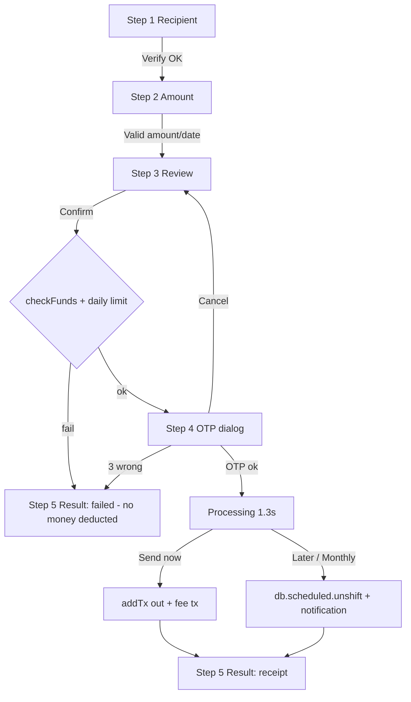
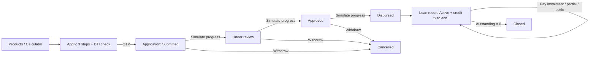

# FinBank Demo - Project Guideline

> Audience: end users (demo operators), developers, QA and business/product teams.
> Basis: this document is derived strictly from the source code in this folder (HTML, CSS, JS, mock data). Where the code does not define a rule, the item is marked **Assumption** or **Unknown / not implemented**. Currency is Vietnamese dong (VND). UI text is English; Vietnamese terms are given in parentheses where the code contains them.

---

## Table of Contents

1. [Project Overview](#1-project-overview)
   - 1.1 Purpose and disclaimer
   - 1.2 Tech stack
   - 1.3 File structure
   - 1.4 How to run
   - 1.5 Demo credentials and demo codes
   - 1.6 Data storage (localStorage / sessionStorage keys)
   - 1.7 Seed / mock data
2. [User Guideline](#2-user-guideline)
   - 2.1 Roles
   - 2.2 Global UI (shell, search, theme, mobile)
   - 2.3 Screen-by-screen reference
   - 2.4 Step-by-step task guides
3. [Business Guideline](#3-business-guideline)
   - 3.1 Domain entities
   - 3.2 Statuses and state transitions
   - 3.3 Permissions per role
   - 3.4 Limits, thresholds and constants
   - 3.5 Pricing / calculation formulas
   - 3.6 Business scenarios
4. [Feature Details](#4-feature-details)
5. [Key Workflows and Module Relationships](#5-key-workflows-and-module-relationships)
6. [Known Limitations and Gaps](#6-known-limitations-and-gaps)
7. [QA Test Checklist](#7-qa-test-checklist)
8. [Appendix - Message Catalogue and Glossary](#8-appendix)

---

# 1. Project Overview

## 1.1 Purpose and disclaimer

FinBank is a **front-end-only digital banking demo** (portfolio project). It simulates a Vietnamese retail bank web app (customer portal) and a staff back-office (admin portal). There is **no backend, no real authentication, no real money movement**. All names, account numbers and amounts are fictional. Every "server" interaction (OTP, eKYC, Napas transfers, QR scanning, loan approval, PDF generation) is simulated with `setTimeout` and local state.

Two applications share the same code base:

| App | Entry page | Purpose |
|---|---|---|
| Customer portal | `index.html` (login) then `dashboard.html` and 12 other pages | Retail banking for one demo customer (Nguyen Minh Anh, `CUS-0001`) |
| Admin portal | `admin.html` | Back-office: dashboard/KPIs, customers (KYC, lock), transactions (approve/reject/flag), products, reports |

## 1.2 Tech stack

| Layer | Detail |
|---|---|
| Markup | Static HTML5 pages, one per screen (`<div id="page">` is wrapped by the JS-built app shell) |
| Styling | Plain CSS with CSS variables: `css/style.css` (tokens, layout, dark theme via `[data-theme="dark"]`), `css/components.css`, `css/responsive.css` |
| Logic | Vanilla JavaScript (ES2015+), IIFE per file, no build step, no npm, no framework, no external libraries, no network calls (no `http` links found in HTML/CSS) |
| Charts | Hand-written inline SVG (`FB.chart.line/bar/donut/spark/ring`) |
| Persistence | Browser `localStorage` / `sessionStorage` only |
| Fonts | `Inter` requested, falls back to system fonts (not loaded from the network) |
| Images | `assets/images/` exists but is empty |
| Docs | No pre-existing README in this folder |

## 1.3 File structure

```
finbank/
+-- index.html            Login / Register / Forgot password / Locked view (auth shell = none)
+-- dashboard.html        Home
+-- accounts.html         Accounts, history, statements, open account
+-- transfers.html        FinBank / other bank / beneficiaries / international
+-- payments.html         QR pay (scan / generate), bills, top-up, history
+-- transactions.html     Full ledger search / filter / export / pending simulation
+-- savings.html          Deposits overview, products, open deposit, calculator, goals
+-- loans.html            Products, calculator, apply, my loans, applications
+-- cards.html            Credit card controls, pay bill, PIN, report lost
+-- finance.html          Personal finance: overview, budget, goals, insights
+-- notifications.html    Notification centre
+-- locator.html          Branch / ATM locator (fake SVG map)
+-- support.html          FAQ, chat bot, contact, tickets
+-- security.html         Password, PIN, 2FA, devices, limits, alerts & privacy
+-- profile.html          Personal info, ID, employment, preferences
+-- admin.html            Admin portal (self-contained shell, inline CSS)
+-- css/
|   +-- style.css  components.css  responsive.css
+-- js/
|   +-- data.js           Mock database (window.DB) - seed data + admin mock data
|   +-- app.js            Core: FB namespace, storage, formatting, modal/toast/OTP, charts, shell, idle timeout
|   +-- auth.js           index.html only: login, lock, biometric, register, forgot password
|   +-- dashboard.js accounts.js transfers.js payments.js transactions.js
|   +-- savings.js loans.js cards.js finance.js notifications.js
|   +-- locator.js support.js security.js profile.js
|   +-- admin.js          admin.html only
+-- assets/images/        (empty)
```

Script load order on every page is always `data.js` -> `app.js` -> page script. `data.js` exposes `window.DB`; `app.js` copies it into the persisted `FB.db`.

## 1.4 How to run

1. No install or build is required.
2. Either open `index.html` directly in a modern browser, or (recommended, to avoid `file://` storage quirks) serve the folder with any static server, e.g. `python -m http.server 8080` inside `finbank/`, then browse to `http://localhost:8080/index.html`.
3. Log in with the demo credentials below. Admin portal: open `admin.html`.
4. **Unknown:** the deployed public URL (the folder sits in a GitHub Pages style repo `phuongcao1995.github.io/finbank`, but no URL is declared in the code).

**Clock dependency:** many screens use the browser's real clock (`new Date()`), while a few use a hard-coded "today" of `2026-09-30` (Personal Finance goals, Security score, Admin dashboard text). Seed data is dated September 2026. Results such as "This month" totals on Accounts, deposit "days left", or card "days until due" therefore change depending on the date you run the demo.

## 1.5 Demo credentials and demo codes

| Item | Value | Where defined / used |
|---|---|---|
| Customer username | `minhanh` | `FB.DEMO_USER` (app.js). Case-sensitive. |
| Customer phone (alternative login) | `0912345678` (spaces are stripped from the typed value) | `FB.DEMO_USER.phone` |
| Customer password | `Demo@1234` | `FB.DEMO_USER.password` |
| OTP (every OTP prompt) | `123456` | `FB.DEMO_OTP`; shown in the OTP dialog |
| Payment PIN (QR pay, under 5,000,000 VND) | Any 6 digits (dialog says "Demo PIN: 123456 (any 6 digits work)") | payments.js `pinPrompt` |
| Security-centre transaction PIN | `123456` (6 digits) | security.js `P.pin` default |
| Card PIN | `1234` (4 digits) | cards.js `card.pin` default |
| Admin username / password | `admin` / `Admin@1234` (admin user: "Admin Tran Van Long", role "Risk & Ops") | admin.js `ADMIN` |
| Register form | Creates no account; any valid data then OTP `123456` shows a success dialog | auth.js |

## 1.6 Data storage

| Storage | Key | Content | Written by | Cleared by |
|---|---|---|---|---|
| localStorage | `fb_db_v1` | Entire mutable database `FB.db` (copy of `DB` + `__v: 1`) plus lazily added collections `scheduled`, `sessions`, `tickets`, `fraud` | `FB.save()` after every mutation | "Reset demo data" |
| localStorage | `fb_prefs` | Preferences: `biometric`, `twoFA`, `alerts`, `limitTx` (100,000,000), `limitDay` (500,000,000), `lang`, `timeoutMin` (5), plus `twoFAMethod`, `pin`, `pwdChanged`, `pwHash`, `secAlerts`, `privacy`, `notif`, `statement` | `FB.savePrefs()` | "Reset demo data" |
| localStorage | `fb_theme` | `light` or `dark` (default follows OS `prefers-color-scheme`) | `FB.setTheme` | never (not cleared by reset) |
| localStorage | `fb_session` | Login session when "Remember me" is ticked `{user, ts, remember}` | `FB.login(true)` | `FB.logout` |
| sessionStorage | `fb_session` | Login session when "Remember me" is NOT ticked (falls back to localStorage if sessionStorage fails) | `FB.login(false)` | `FB.logout`, tab close |
| localStorage | `fb_lock` | Login lock `{until: <epoch ms>}` (5 minutes) | auth.js | unlock via OTP or expiry; not cleared by reset |
| localStorage | `fb_admin_v1` | Admin overlay state: customer overrides `cust`, transaction overrides `tx`, alert decisions `alerts`, activity `log`, editable `savings`, `loans`, `cards`, `fees` | admin.js `persist()` | never by UI (not cleared by "Reset demo data") |
| sessionStorage | `fb_admin` | `"1"` when admin is signed in | admin.js | sign out / tab close |

Important behaviours:

- `FB.db` is created **once** from `data.js` and then persisted. Editing `data.js` later has **no visible effect** for a browser that already has `fb_db_v1`, unless the version check changes (`stored.__v === 1`) or the user uses "Reset demo data" (profile dropdown) / clears storage.
- All storage access is wrapped in try/catch; if storage is unavailable the app runs with in-memory data only.
- The admin portal reads the pristine `window.DB` (admin customers/transactions), **not** `FB.db`, so admin data is completely separate from what the customer does.

## 1.7 Seed / mock data (data.js)

| Dataset | Content |
|---|---|
| Customer | `CUS-0001` Nguyen Minh Anh, tier Gold, KYC Verified, member since 2019-03-04, income 45,000,000 VND/month, employer Saigon Tech Solutions JSC |
| Accounts (4) | `acc1` Current 1903 4567 4821: balance 85,250,000 / available 84,250,000, 0.1% - `acc2` Salary 1903 8821 7702: 18,400,000, 0.3% - `acc3` Savings 1903 2210 6655: 120,000,000, 5.4% - `acc4` Business (MINH ANH DESIGN STUDIO) 1903 7734 9018: 212,800,000 / available 210,800,000, 0.2%. Sum of balances = 436,450,000 |
| Credit card | "FinBank Platinum Visa" 4532 8801 2244 9134, limit 50,000,000, balance 12,640,000, minimum 1,264,000, statement 2026-09-25, due 2026-10-15, online on, international off, contactless on, 18,450 reward points |
| Banks | FinBank, Vietcombank, BIDV, VietinBank, Agribank, Techcombank, MB Bank, VPBank, ACB, TPBank |
| Beneficiaries (6) | Mom (TRAN THI HOA, Vietcombank), Bao (landlord), Nam, Linh, Tuan, Brother (FinBank) |
| Billers (6) | EVN HCMC (auto-pay on), SAWACO, FPT Telecom (auto-pay on), VTVcab, Bao Viet Life, Viettel Postpaid (not saved) |
| Transactions (25) | Sept 2026 ledger; statuses: Completed (majority), 1 Pending (Vietjet 2,340,000), 1 Failed (Shopee 1,290,000), 1 Cancelled (transfer to VO THUY LINH 1,000,000) |
| Deposits (3) | d1 Term 12M 80,000,000 @5.9% (matures 2027-03-10); d2 Term 6M 40,000,000 @5.3% (2026-12-05); d3 Term 3M 25,000,000 @4.2% (matures 2026-10-01, "Maturing soon") |
| Loan | `LN-2024-0387` Auto Loan, principal 480,000,000, outstanding 352,400,000, 8.5%, 60 months, 17 paid, monthly 9,850,000, next due 2026-10-05 |
| Loan application | `APP-260912-41` Personal Loan 100,000,000 / 24 months, status "Under review" (step 2) |
| Goals (4) | Emergency fund 120M/200M, Japan trip 22.5M/60M, MacBook Pro 41M/55M, Home down payment 205M/800M |
| Budgets (10), notifications (8), branches (8), FAQs (8), devices (4), login history (5) | Static lists |
| Statistics arrays | 12-month `income`, `expenses`, `balanceHistory`, `spendingByCategory` (used by charts and KPIs; **not** derived from the ledger) |
| Admin | 10 customers (`CUS-0001..0010`), 10 admin transactions (`TX-889120..889129`), KPI object, 12-month revenue / transaction series |
| Fees list | Interbank transfer: free up to 20M, 7,700 VND above - other-bank ATM withdrawal 3,300 - Platinum annual fee 990,000 - account maintenance free (min balance 50,000) - SMS banking 11,000/month |

---

# 2. User Guideline

## 2.1 Roles

| Role | How to get in | Scope |
|---|---|---|
| Guest (unauthenticated) | Any page other than `index.html`/`admin.html` redirects to `index.html?msg=login` | Login, register (simulated), forgot password (simulated) |
| Customer | Log in on `index.html` | All 13 customer pages. Single demo customer only; no multi-user support |
| Admin (staff, "Risk & Ops") | `admin.html` sign-in | Dashboard, Customers, Transactions, Products, Reports. **No sub-roles**: every admin can perform every admin action |

The admin sign-in is independent from the customer session (separate storage key `fb_admin`); being logged in to one does not log you in to the other.

## 2.2 Global UI (customer portal shell)

Built by `app.js` (`buildShell`) around each page's `<div id="page">`.

| Element | Behaviour |
|---|---|
| Sidebar (desktop) | Groups: **Main** (Dashboard, Accounts, Transfers, Payments & QR, Transactions), **Products** (Savings, Loans, Cards, Personal Finance), **Account** (Notifications with unread count badge, Branches & ATMs, Help & Support, Security, Profile). Footer: "Hotline 1900 5555 - 24/7 support - Demo project, no real money" |
| Top bar | Page title, global search ("Search transactions...": submit navigates to `transactions.html?q=<text>`), theme toggle, notification bell with unread dot and 5-item dropdown, profile menu |
| Profile menu | My profile, Security center, Help & support, **Reset demo data** (confirm dialog "This restores all mock data and settings to their defaults."), **Log out** (confirm dialog) |
| Mobile bottom nav | Home, Accounts, QR Pay (`payments.html#qr`), Transfer, More (opens "All services" sheet with every page, Theme, Log out) |
| Toasts | Bottom notices (auto-dismiss ~3.8 s): Success / Error / Warning / Notice |
| Skeletons | Most pages show loading placeholders for 400-700 ms before rendering |
| Idle timeout | After `prefs.timeoutMin` (default 5 min) of no click/keydown/mousemove/touch, a modal "Are you still there?" appears 30 s before logout with a 30 s countdown. "Stay signed in" resets; otherwise automatic logout to `index.html?msg=timeout` ("You were logged out due to inactivity. Please log in again.") |
| Themes | Light/dark; persisted in `fb_theme` |

## 2.3 Screen-by-screen reference

### Login page - `index.html`
Four views inside one page: **Log in**, **Open an account** (register), **Reset password** (forgot), **Account temporarily locked**.
- Log in: username or phone, password (show/hide eye), "Remember me", "Forgot password?", "Log in", "Log in with biometrics", "Fill for me" (fills demo credentials). A demo credentials box is displayed.
- Register: full name, phone, email, password with strength bar, terms checkbox ("Terms & Privacy (demo)" dialog), "Continue" then OTP then "Account created" dialog.
- Forgot: phone -> OTP -> new password + confirm.
- Locked view: countdown `m:ss`, "Unlock with OTP".
- Banners via `?msg=`: `timeout` and `login` only. If a session exists and there is no `msg=` in the URL, the page redirects to `dashboard.html`.

### Dashboard - `dashboard.html`
Greeting by hour (Good morning < 12, afternoon < 18, else evening), date line "Ho Chi Minh City (GMT+7)". Fraud banner (first unread `alert` notification) with **It was me / Not me**. Hero card with total balance and Hide/Show toggle (masks values with bullets), Available, "Savings & deposits", Monthly income. Financial health ring. 8 stat tiles with sparklines (each links to a page). Quick actions (Transfer, Pay bills, Deposit, Withdraw, Top up, Scan QR, Send money, Open savings, Apply loan). Charts: income vs expenses, spending by category (donut), balance history, monthly spending. Goals (first 3), AI insights, recommendations, recent 7 transactions (click for receipt dialog).

### Accounts - `accounts.html`
Account cards (click to select, eye to reveal full number), "Show numbers / Hide numbers" for all, **Open new account** wizard, account detail (numbers, balances, held/pending = balance - available, status, opened, branch, rate, currency VND, SWIFT `FNBKVNVX`, daily limit, "Overdraft: Not enabled"), "This month" money in/out/net, **Download statement**, links to Transfers/Transactions. Transaction history for the selected account with search, type, status, date range, sort and paging (8 per page). Deep link `accounts.html#acc2`.

### Transfers - `transfers.html`
Tabs: **FinBank account**, **Other bank**, **Saved beneficiaries**, **International**. 5-step wizard (Recipient, Amount, Review, OTP, Result). Side cards: Recent transfers (last 5), Scheduled transfers (with Cancel).

### Payments & QR - `payments.html`
Tabs (hash-linked): **QR Pay** (Scan / Generate), **Bills**, **Top-up**, **History** (bill/top-up/QR payments only).

### Transactions - `transactions.html`
Search (also `?q=`), date range, category, type, account, status, sort, filter chips with "Clear all", summary (income/expenses/net), table + mobile list, paging (10/page), CSV export, PDF export (toast only), and **simulated completion/failure/cancel for Pending items**.

### Savings - `savings.html`
Tabs: **Overview** (totals, deposits list, savings goals), **Products** (6 products), **Open deposit**, **Calculator**. Deep link `savings.html#open`.

### Loans - `loans.html`
Tabs: **Products**, **Calculator**, **Apply**, **My loans**, **Applications**. Deep link `loans.html#apply`.

### Cards - `cards.html`
Card visual, status badge, utilisation bar, overview stats, recent card transactions, controls (freeze, online, international, contactless), per-transaction limit slider, Show card number, Change PIN, Pay card bill, Report lost/stolen.

### Personal Finance - `finance.html`
Tabs: **Overview** (12-month totals, charts, expense auto-categoriser), **Budget**, **Goals**, **Insights** (prediction, health score, fraud alert, recommendations). Deep link `finance.html#insights`.

### Notifications - `notifications.html`
Filters (All, Unread, Money, Alerts, Bills, Security, Promotions), Mark all as read, Clear read, per-item delete, preference switches. The fraud notification (`n2`) has action buttons.

### Branches & ATMs - `locator.html`
Fake SVG map with pins and zoom (1x-2.5x), search, filters (All, Branch, ATM, Open now, Cash available), results sorted by distance, detail panel with "Get directions" (toast) and "Call".

### Help & Support - `support.html`
Tabs: **FAQ** (search + categories), **Live chat** (FinBot + "Talk to a human agent"), **Contact**, **Support tickets**.

### Security Center - `security.html`
Score card; tabs **Password**, **PIN**, **Authentication**, **Devices & sessions** (+ login history), **Limits**, **Alerts & privacy** (+ Danger zone). Deep links `#limits`, `#devices`.

### Profile - `profile.html`
Tabs: **Personal**, **Identification**, **Employment**, **Preferences**, **Security** (summary).

### Admin Portal - `admin.html`
Sign-in, then sections (hash routed): **Dashboard**, **Customers**, **Transactions**, **Products**, **Reports**. Links back to "Customer app".

## 2.4 Step-by-step task guides

### T1. Log in
1. Open `index.html`. Click **Fill for me** (or type `minhanh` / `Demo@1234`; phone `0912345678` also works).
2. Optionally tick **Remember me** (session stored in localStorage instead of sessionStorage).
3. Click **Log in** (about 0.9 s spinner). Because 2FA is on by default, enter OTP `123456` (auto-verifies when the 6th digit is typed).
4. You land on the Dashboard with toast "Welcome back, Minh Anh!" and a new "New login detected" notification.
- Biometric alternative: **Log in with biometrics** -> simulated scan (1.8 s) -> "Identity confirmed." -> logged in (no password, no OTP). If biometrics are off in Security: toast "Biometric login is turned off. Enable it in Security settings."

### T2. Unlock a locked login
After 3 wrong passwords in one page session the account locks for 5 minutes. Either wait for the countdown to finish or click **Unlock with OTP** and enter `123456`; toast "Account unlocked. Please log in."

### T3. Transfer money to a FinBank or other-bank account
1. Transfers -> choose tab **FinBank account** or **Other bank**.
2. Pick **From account**. For Other bank choose **Recipient bank**.
3. Type the recipient account number (digits and spaces; 6-16 digits) or, on the FinBank tab, click a "My accounts" chip.
4. Click **Verify recipient**. A green box "Recipient verified: NAME" enables **Continue**. (Account numbers ending `0000` return "Account not found"; the source account itself returns "Same account".)
5. Enter amount (VND, thousand separators are added live). Quick chips 500,000 ... 20,000,000. The panel shows available balance, fee and total debited; the amount is also spelled out in Vietnamese words.
6. Optional note (140 chars). Choose **Send now**, **Schedule for later** or **Repeat monthly** (date must be tomorrow or later). Optionally tick "Save NAME as a beneficiary".
7. **Review transfer** -> check details -> **Confirm & send** (or **Confirm & schedule**).
8. Enter OTP `123456`. After ~1.3 s a receipt appears (Reference `FT<yymmdd><4 digits>`); use **View / download receipt** (Print or .txt download).

### T4. Use a saved beneficiary
Transfers -> **Saved beneficiaries** -> search, click **Transfer** on a row (jumps straight to the amount step on the matching tab with recipient pre-verified). Use the star to favourite, bin to delete (confirm), **+ Add beneficiary** to add.

### T5. International transfer
Transfers -> **International**. Enter beneficiary name (Latin letters), bank, SWIFT/BIC (8 or 11 chars), IBAN/account (8-34 chars), country, purpose. Amount step: choose currency (USD, EUR, JPY, SGD), amount (10 to 1,000,000 units); see rate, VND equivalent, fee and total debited. Review, OTP, receipt. Estimated arrival is shown as "1-3 business days" (text only).

### T6. Pay a bill
Payments -> **Bills**. Either click a category tile, choose the provider, enter the Customer ID (6-20 letters/digits/dashes) and click **Get bill**; or use **Saved billers -> Pay now**. Review the invoice breakdown, choose **Pay from**, optionally "Save this biller", click **Pay <amount>**, confirm OTP. Toast "... paid to <provider>." and receipt.

### T7. Mobile top-up
Payments -> **Top-up**. Enter a 10-digit mobile number (carrier is auto-detected from the prefix, or pick manually), choose one of 20,000 / 50,000 / 100,000 / 200,000 / 500,000, choose account, **Continue** -> confirm dialog -> OTP -> receipt.

### T8. Pay with QR / generate a QR
- Pay: Payments -> **QR Pay** -> **Scan** -> **Simulate scan** (random merchant from 7). If the merchant fixes the amount it is displayed; otherwise type it (min 1,000). **Pay now** -> PIN dialog (any 6 digits) or OTP if amount is 5,000,000 or more.
- Receive: **Generate QR** -> pick receiving account, optional amount and note -> QR image updates live -> **Download** (SVG), **Share** or **Copy code**.

### T9. Open an additional account
Accounts -> **Open a new account**: choose type -> nickname (optional), fund-from account, initial deposit (min 100,000), accept terms -> review -> **Confirm & open** -> OTP -> receipt. New account number is `1903 xxxx xxxx`.

### T10. Download a statement
Accounts -> select account -> **Download statement** -> period (This month / Last month / Last 90 days / This year / Custom) and format. CSV produces a real file (UTF-8 with BOM); PDF/Excel only show a toast (no file).

### T11. Open a savings deposit
Savings -> **Open deposit** (or **Products -> Open this deposit**). Choose product/term, amount (>= product minimum), source account, renewal option (term products only), accept terms -> **OTP** -> receipt. See the live summary for interest and total at maturity.

### T12. Withdraw a deposit
Savings -> Overview -> deposit card -> **Withdraw early** (term) / **Withdraw** (flexible) -> choose destination account -> **Withdraw** -> confirm -> OTP. Principal + interest credited.

### T13. Calculate and apply for a loan
1. Loans -> **Calculator**: preset or custom, amount (slider/box), term, rate, method (Reducing balance / Flat rate). Download the schedule as CSV.
2. **Apply**: Step 1 product, amount, term, purpose; Step 2 employer, job title, monthly income (DTI check); Step 3 review + two consent boxes + **Submit application** -> OTP -> receipt "Application received".
3. **Applications**: the demo has no back office for this, so click **Simulate progress** to advance Submitted -> Under review -> Approved -> Disbursed. On Disbursed a loan appears in **My loans** and funds are credited to the Current Account.
4. **My loans -> Pay now / early repay**: next instalment, partial early repayment, or settle in full.

### T14. Control the credit card
Cards -> toggle switches (Freeze needs confirmation; enabling International shows the 2.5% conversion-fee warning), move the per-transaction limit slider and **Save limit** (OTP required only when increasing), **Show card number** (OTP; auto-hides after 30 s), **Change PIN**, **Pay card bill**, **Report lost or stolen** (irreversible).

### T15. Manage budgets and goals
Personal Finance -> **Budget** -> **+ Add budget** (category not yet budgeted, limit 100,000 - 500,000,000) / Edit / Remove. **Goals** -> **+ Create goal**, **Add contribution**. **Overview** -> "Auto-categorise an expense" to add a manual expense (updates ledger, budget and spending totals).

### T16. Security settings
Security Center -> Password (change with OTP), PIN, Authentication (2FA switch, method, biometric switch), Devices (trust / untrust / remove, log out sessions), Limits (sliders, presets; increasing needs OTP), Alerts & privacy (switches, download data, delete account by typing `DELETE`).

### T17. Get help
Support -> FAQ search; **Live chat** (try "balance", "limits", "loan rates"); **Talk to a human agent** (simulated agent "Linh" joins after 3.2 s); **Support tickets** -> create ticket, open a ticket to reply or close.

### T18. Reset the demo
Profile menu -> **Reset demo data** -> **Reset**. Clears `fb_db_v1` and `fb_prefs` and reloads. (Session, theme, lock and admin state remain.)

### T19. Admin: work a fraud alert
`admin.html` -> sign in `admin` / `Admin@1234` -> Dashboard -> **Fraud alerts** -> **Review** (mark "In review") or **Block** (transaction alert: mark the transaction Failed; customer alert: lock the customer). Both need a confirm dialog and are logged in "Recent activity".

### T20. Admin: KYC, lock, transactions, products, reports
- Customers: search / filter / sort, click a row -> **Approve KYC**, **Reject KYC** (reason >= 5 chars), **Lock/Unlock account**, **Reset password** (logs only), **Export CSV**.
- Transactions: tabs All / Pending / Failed / Suspicious; **Approve** / **Reject** for Pending rows; **Flag** for non-High risk rows.
- Products: 4 tabs (Savings, Loans, Credit cards, Fees); switch Active, **Edit**, **+ Add product / + Add fee**, **Delete** (custom products and all fees).
- Reports: choose type and period; **Export CSV** or **Export PDF** (opens print dialog).

---

# 3. Business Guideline

## 3.1 Domain entities

### 3.1.1 Customer (`DB.user`)
| Field | Meaning / rule |
|---|---|
| `id` | `CUS-0001` |
| `name`, `short`, `initials` | Full name; short display (last two words); initials (recomputed on profile save) |
| `phone`, `email`, `dob`, `gender`, `address` | Contact data. Changing phone or email requires OTP |
| `idNumber`, `idIssued`, `idPlace` | Citizen ID (CCCD); displayed masked `xxx *** *** xxx`; reveal requires OTP |
| `employer`, `job`, `income`, `empType` | Used as pre-fill and for loan DTI |
| `tier` (Gold), `kyc` (Verified), `since` | Display only; no logic |

### 3.1.2 Account (`DB.accounts[]`)
| Field | Meaning |
|---|---|
| `id` | `acc1..acc4`; new ones `acc<timestamp>` |
| `type` | Current Account / Salary Account / Savings Account / Business Account |
| `number` | Format `1903 xxxx xxxx`; masked as `**** **** <last4>` |
| `balance`, `available` | Ledger vs spendable; difference = "Held / pending" |
| `status`, `opened`, `branch`, `color`, `rate` | Display fields; `rate` is text such as `0.1%` (no interest is ever accrued) |
| `nickname` | Optional (new accounts) |

Relationships: Transaction.acc -> Account.id. `acc1` is the default funding account almost everywhere; `acc4` (business) is excluded from the "liquid" figure in the emergency-fund score.

### 3.1.3 Transaction (`DB.transactions[]`)
| Field | Meaning |
|---|---|
| `id` | `FB` + `yymmdd` + 4 digits (seed uses a sequence); transfer receipts use `FT...`, refs `RPL...`, tickets `TCK-...` |
| `date` | `YYYY-MM-DD HH:mm` |
| `desc`, `cat`, `type` (`in`/`out`), `amount` (positive integer VND) | |
| `acc` | Account id |
| `status` | Completed, Pending, Failed, Cancelled |
| `counterparty`, `channel` | Channels seen in code: Interbank, QR Payment, Card, Bill Payment, Top-up, Internal, Loan, Loan Payment, Card Payment, Manual |
| Categories (12) | food, shopping, transport, housing, entertainment, health, education, bills, travel, income, transfer, other |

### 3.1.4 Beneficiary, Biller, Scheduled transfer
- **Beneficiary**: `id, name (UPPERCASE Latin), bank, account, alias, fav`. Unique per (account digits, bank).
- **Biller**: `id, cat, provider, customerId, label, amount, due, saved, autopay` (+ `paidOn` after payment).
- **Scheduled transfer** (`db.scheduled`): `id (FT...), acc, name, bank, no, amount (VND), fee, note, when ('later'|'monthly'), date`. **Never executed** by the app.

### 3.1.5 Credit card (`DB.card`)
`limit, balance (amount owed), minPayment, dueDate, statementDate, frozen, lost, online, international, contactless, txLimit (default 20,000,000), pin (default '1234'), rewardPoints, replacementRef, lostReason`. Available credit = `limit - balance`. Utilisation = `balance / limit`.

### 3.1.6 Deposit and Savings product
- **Savings product**: `id s1..s6, name, term (months, 0 = flexible), rate (%/yr), min, desc, earlyPenalty`.
- **Deposit**: `id, product, amount, rate, opened, maturity ('' for flexible), renewal, status (Active | Maturing soon | Closed), closedOn`.

| Product | Term | Rate | Min deposit |
|---|---|---|---|
| Flexible Savings | none | 3.2% | 100,000 |
| Term Deposit 1M | 1 | 3.6% | 1,000,000 |
| Term Deposit 3M | 3 | 4.2% | 1,000,000 |
| Term Deposit 6M | 6 | 5.3% | 2,000,000 |
| Term Deposit 12M | 12 | 5.9% | 5,000,000 |
| Term Deposit 24M | 24 | 6.3% | 10,000,000 |

### 3.1.7 Loan product, Application, Loan
| Product | Rate | Max amount | Max term (months) |
|---|---|---|---|
| Personal Loan (`l1`) | 9.9% | 500,000,000 | 60 |
| Home Loan (`l2`) | 7.9% | 15,000,000,000 | 300 |
| Auto Loan (`l3`) | 8.5% | 2,000,000,000 | 96 |
| Business Loan (`l4`) | 10.5% | 5,000,000,000 | 84 |
| Credit Card Instalment (`l5`) | 0% | 100,000,000 | 24 |

- **Application**: `id APP-yymmdd-NN, product, amount, term, submitted, status, step (1-4), purpose, employer, income`.
- **Loan**: `id LN-<year>-<4 digits>, product, principal, outstanding, rate, term, term0 (original), paid, baseline, monthly, nextDue, start, status (Active | Closed), payments[]`.

### 3.1.8 Others
Notification (`id, type, title, body, time, read`; types: money, alert, card, bill, security, savings, promo), Goal (`id, name, icon, target, saved, deadline`), Budget (`cat, limit, spent`), Device / Session / Login history, Ticket (`id, category, priority, subject, created, status, attach, thread[]`), Branch/ATM (`kind, name, address, distance, hours, services, open, outOfCash, x, y`), Fraud state (`db.fraud {status: open|ok|blocked, amount 15,900,000, merchant, time}`).

### 3.1.9 Admin entities
- **Admin customer**: `id, name, phone, tier (Standard|Silver|Gold|Platinum), balance, kyc (Verified|Pending|Rejected), status (Active|Locked|Suspended), joined`.
- **Admin transaction**: `id TX-8891xx, time, from, to, amount, status (Completed|Pending|Failed), risk (Low|Medium|High)`.
- **Alert**: derived: every High-risk admin transaction + two fixed customer alerts (`AL-9001` Medium: 12 failed logins for CUS-0006; `AL-9002` High: card used in 3 countries for CUS-0005).
- **Product configs** (`S.savings`, `S.loans`, `S.cards`, `S.fees`): editable copies. Card product seeds: Standard / Gold / Platinum / Business with annual fee, limit range and cashback %.

### Relationship overview
```
Customer 1--* Account 1--* Transaction *--1 Category
Customer 1--1 Card            (card payments do not create ledger rows automatically)
Customer 1--* Beneficiary, Biller, Goal, Budget, Ticket, Notification, Device, Session
Account  *--* Deposit        (Deposit is funded from an Account; withdrawal credits an Account)
Loan Application 1--0..1 Loan (created on step 4 "Disbursed")
Loan 1--* Payment            (each payment also creates a Transaction)
Admin overlay (fb_admin_v1) is independent: it never writes into FB.db
```

## 3.2 Statuses and state transitions

### Transaction status (customer ledger)
| From | Trigger | To | Balance effect |
|---|---|---|---|
| (created) | `FB.addTx` default | Completed | Account `balance` and `available` change immediately (out: minus, in: plus) |
| (seed) Pending | "Simulate complete" | Completed | Applied now; if `type=out` and `available < amount` -> becomes **Failed** with toast "Insufficient balance - the transaction failed." |
| Pending | "Simulate fail" | Failed | None |
| Pending | "Cancel" (confirm) | Cancelled | None ("No funds will be moved.") |
| Completed / Failed / Cancelled | - | terminal | No action offered |

Only `Completed` transactions ever change balances at creation; Pending/Failed/Cancelled seed rows are not reflected in seed balances.

### Login / lock
`Logged out -> (3 wrong passwords in the same page load) -> Locked (5 min, key fb_lock) -> (timer end OR Unlock with OTP) -> Logged out (can retry)`. Correct login resets the in-memory failure counter.

### Card
| State | Set by | Effect |
|---|---|---|
| Active | default | all controls usable |
| Frozen | Freeze switch, dashboard "Not me", finance/notification "Not me - block card" | banner "Your card is frozen. All new card payments are declined until you unfreeze it."; Online/International/Contactless switches disabled; can be unfrozen |
| Blocked (lost) | Report lost/stolen | `lost=true, frozen=true`; number reveal, PIN change, limit slider and Report buttons disabled; **cannot be unblocked** (only demo reset); replacement ref `RPL...`, delivery "3-5 working days" |

### Deposit
`Active` -> (derived) `Maturing soon` when `daysLeft <= 7` (also for already-past maturity; no automatic maturity processing) -> `Closed` on withdrawal (`closedOn` stamped; shown faded, no buttons). Renewal setting can be changed only while not Closed and only for term deposits: `Pay out at maturity`, `Renew principal only`, `Renew principal + interest` (setting is stored, never executed).

### Loan application
`Submitted (1) -> Under review (2) -> Approved (3) -> Disbursed (4)`; advanced only by the "Simulate progress" button. `Cancelled` can be set from any non-final step via "Withdraw application" (confirm). Final = step >= 4.
- Approved: notification "Loan approved".
- Disbursed: loan record created (monthly = `round(PMT)`, nextDue = today + 1 month, status Active), credit transaction (`cat income`, channel `Loan`) into `acc1`.

### Loan
`Active -> Closed` when outstanding reaches 0 (full settlement or last instalment). Instalment status labels in the schedule: Paid, Due next, Overdue (nextDue earlier than today), Upcoming.

### Support ticket
`Open -> In progress` (on first user reply) `-> Closed` (user clicks "Close ticket"). `Resolved` exists only in seed data. Closed/Resolved tickets are read-only ("This ticket is closed/resolved. Create a new ticket if you need more help."). An automated agent reply is appended 2.2 s after each user reply.

### Fraud alert (customer)
`db.fraud.status`: `open -> ok` ("It was me") or `open -> blocked` ("Not me", also freezes the card). Note the inconsistency described in section 6 (dashboard banner uses a different code path).

### Admin
- KYC: `Pending/Rejected -> Verified` (Approve), `Pending/Verified -> Rejected` (Reject with reason). `Verified` hides the Approve button; `Rejected` hides Reject.
- Customer status: `Active <-> Locked` via Lock/Unlock (Unlock also resets `Suspended` to `Active`).
- Transaction: `Pending -> Completed` (Approve) or `Pending -> Failed` (Reject; note "Rejected by Admin Tran Van Long"); Flag sets `risk=High`, `flagged=true` (status unchanged).
- Alert: `open -> review` or `open -> blocked`; there is no way to reopen or undo.

## 3.3 Permissions per role

| Capability | Guest | Customer | Admin |
|---|---|---|---|
| View login / register / forgot pages | Yes | Redirected to dashboard if session exists (unless `msg=` present) | - |
| Any customer page | No (redirect to `index.html?msg=login`) | Yes | Only if also logged in as customer |
| Move money, pay, apply loan, manage card/security/profile | No | Yes (OTP/PIN gated as per 3.4) | No (admin has no customer functions) |
| Admin portal pages | Sign-in form only | Not implicitly | Yes |
| Approve/reject/flag transactions, lock customers, approve/reject KYC, edit products, run reports | No | No | Yes (all admins equal) |

There are no field-level or per-action role restrictions beyond this table. **Unknown / not implemented:** multiple staff roles (maker/checker, read-only auditors), and any effect of admin actions on the customer app.

## 3.4 Limits, thresholds and constants (as coded)

| Rule | Value | Source |
|---|---|---|
| OTP code / validity / attempts | `123456` / 60 s countdown / 3 attempts | app.js `FB.otp` |
| PIN vs OTP for QR payment | OTP if amount >= 5,000,000, else 6-digit PIN | payments.js `OTP_MIN` |
| Bill payment, Top-up | Always OTP | payments.js |
| Per-transaction limit (default) | 100,000,000 VND (range slider 1M - 500M) | `prefs.limitTx`, security.js `MAX_TX` |
| Daily limit (default) | 500,000,000 VND (range 1M - 1,000,000,000) | `prefs.limitDay`, `MAX_DAY` |
| Limit check on funds | `FB.checkFunds`: amount > available -> insufficient; amount > per-tx limit -> exceeds limit | app.js |
| Daily limit check | Only for immediate ("Send now") transfers: today's completed out-transfers (`cat=transfer`) + new amount | transfers.js |
| Login lockout | 3 failures -> 5 minutes | auth.js |
| Idle timeout | 5 min default; warning 30 s before | app.js |
| Card number auto-hide / ID reveal auto-hide | 30 s / 15 s | cards.js / profile.js |
| Domestic transfer min | 10,000 VND | transfers.js |
| International transfer | min 10, max 1,000,000 (in selected currency) | transfers.js |
| Interbank fee | 7,700 VND if amount > 20,000,000 (Other bank), else free; FinBank tab free | `fee()` |
| Intl. fee | `max(150,000, round(VND x 0.003 / 1000) x 1000) + 90,000` | `fee()` |
| Scheduled transfer date | Tomorrow or later | transfers.js |
| New account initial deposit | min 100,000 | accounts.js |
| Cardless deposit/withdraw code | multiples of 50,000 (min 50,000); valid "15 minutes" (text) | dashboard.js |
| Top-up amounts | 20k, 50k, 100k, 200k, 500k | data.js |
| QR amount (merchant enters) | min 1,000 | payments.js |
| Goal top-up (Savings page) | min 10,000; OTP if > 10,000,000 | savings.js |
| Card custom payment | min 10,000, max = card balance | cards.js |
| Loan apply amount | min 5,000,000 (1,000,000 for Card Instalment), max product max | loans.js |
| Loan apply income | min 5,000,000 | loans.js |
| DTI thresholds | <= 50% healthy, <= 70% high (extra review), > 70% blocked | loans.js |
| Early repayment fee | 1% of principal repaid; partial min 5,000,000 | loans.js `EARLY_FEE` |
| Non-term (early withdrawal) rate | 0.5% per year | savings.js `NON_TERM_RATE` |
| Budget alerts | >= 90% warning, > 100% exceeded | finance.js |
| Budget limit | 100,000 - 500,000,000 | finance.js |
| File uploads | PNG/JPEG/PDF, max 5 MB (only file name stored) | profile.js, support.js |

## 3.5 Pricing / calculation formulas

| Topic | Formula (from code) |
|---|---|
| Simple interest (deposits) | `interest = round(principal x rate/100 x days / 365)` |
| Deposit days at opening | term: days between opening and `addMonths(now, term)`; flexible: 365 for the yearly estimate |
| Early withdrawal | `held = max(1, days since opened)`; term deposit: rate 0.5%; flexible: its own rate; `payout = principal + round(principal x rate x held / 365)`; "forgone" = full-term interest - early interest |
| Savings calculator | `days = round(months x 30.4)`; simple = `round(P x r/100 x days/365)`; compound = `round(P x (1 + r/1200)^months - P)`; "Extra from compounding" = compound - simple. Principal >= 1,000,000; custom rate must be 0.1-20% ("Enter a rate between 0.1% and 20%.") |
| Loan payment (reducing balance) | `PMT = P x r / (1 - (1+r)^-n)`, `r = annual%/1200`; if rate = 0 then `P/n`. Interest each month = balance x r; last instalment principal = remaining balance |
| Loan payment (flat) | `totalInterest = P x rate/100 x n/12`; `payment = (P + totalInterest)/n`; principal per month = P/n |
| Loan DTI | `(sum of monthly payments of non-closed loans + PMT(new loan)) / declared income x 100` |
| Loan repayment - instalment | `interest = round(outstanding x r)`; `principal = min(outstanding, monthly - interest)`; charge = principal + interest |
| Loan repayment - partial | charge = `v + round(v x 1%)`; then term is recomputed as `paid + remaining projected instalments` (payment amount stays the same, so the loan ends sooner) |
| Loan repayment - settle | charge = `outstanding + round(outstanding x 1%)` |
| Credit card payment | `balance = max(0, balance - amt)`; `minPayment = 0` if balance is 0, else 0 if `amt >= minPayment`, else `min(balance, minPayment - amt)` |
| Card utilisation colour | >= 90% danger, >= 60% warning, else OK |
| Total debited (transfer) | `VND amount + fee` (international: `round(amount x fixed rate) + fee`) |
| FX rates (fixed) | 1 USD = 25,400; 1 EUR = 27,600; 1 JPY = 168; 1 SGD = 19,000 VND |
| Bill generation | Deterministic per (customer ID + provider) hash: electricity `kWh = 120 + h%380`, energy = kWh x ~2,100 rounded to 1,000, VAT 8%; water `m3 = 8 + h%30`, x 9,500 + environmental fee 10%, VAT 5%; internet/tv/postpaid plan `150,000 + (h%25) x 10,000`, VAT 10%; insurance `850,000 + (h%40) x 50,000`, no VAT; tuition `5,000,000 + (h%30) x 500,000` + facility fee 350,000; tax `300,000 + (h%50) x 20,000`; other `200,000 + (h%20) x 40,000`. Saved-biller "Pay now": total = stored amount, split as base = round(amount/1.1 to 1,000) + VAT 10%. Due date = today + 10 days; period = previous month |
| Goal monthly need | `ceil((target - saved) / monthsLeft)` (Savings page uses days/30.4; Finance page uses 30.44 days and rounds up to 1,000); `monthsLeft >= 1` |
| Spending prediction (Finance) | last 6 months: `avg`, least-squares `slope`; `pred = round((0.5 x avg + 0.5 x (avg + slope x (n - xm))) / 100,000) x 100,000`; range = pred x 0.92 to x 1.08 |
| Financial health score (Finance) | Weighted sum: Savings rate 30% (`min(100, rate/30 x 100)`, 6-month rate), Budget adherence 25% (share of budgets not over), Debt ratio 20% (`100 - max(0, ratio-10) x 3.3`, clamped; ratio = (sum loan monthly + card min) / income), Emergency fund 25% (`months = liquid / avg 6-mo expense`, `min(100, months/6 x 100)`; liquid excludes `acc4`). >= 75 Excellent, >= 55 Good, else Needs attention |
| Dashboard health score | `min(100, round(40 + rate x 60 + 10))`, `rate = (income[11] - expenses[11]) / income[11]`; >= 80 "Excellent - you are saving consistently." else "Good - room to improve." (different formula from Finance) |
| Security score | 2FA 25 + Biometric 15 + Password changed < 180 days 15 + custom PIN (not 123456) 10 + no untrusted devices 15 + login&transaction alerts 10 + daily limit <= 500M 10; >= 85 Strong, >= 60 Fair, else Weak |
| Password strength (register) | score = number of satisfied rules of {>=8 chars, lowercase, uppercase, digit, symbol}; labels Very weak..Very strong; submit requires score >= 4 |

## 3.6 Important business scenarios

1. **Ordinary domestic transfer**: verify -> amount -> review -> OTP -> debit source; if fee > 0 a second `Transfer fee - NAME` transaction (cat `other`, channel `Internal`) is created; success notification "Payment successful".
2. **Fee threshold**: Other bank transfer of exactly 20,000,000 is free; 20,000,001 costs 7,700.
3. **Insufficient funds / limit**: transfer fails at the Confirm click (before OTP) with result screen "Transfer failed" and text "... No money has been deducted."
4. **Repeated wrong OTP**: 3 wrong codes -> transfer cancelled ("Too many incorrect OTP attempts. For your safety the transfer was cancelled.").
5. **Scheduled/recurring transfer**: creates a `db.scheduled` row and a "Transfer scheduled" notification; no money moves, no execution engine.
6. **Fraud alert**: an unread `alert` notification triggers the dashboard banner; "Not me" freezes the card.
7. **Lost card**: block is permanent and generates replacement reference.
8. **Deposit lifecycle**: open (debit) -> Active -> Maturing soon -> early or normal withdrawal (credit) -> Closed. Maturity auto-payout/renewal is not implemented.
9. **Loan lifecycle**: apply -> (simulated) review/approve/disburse -> Active loan -> instalments / early repayment -> Closed.
10. **Admin blocks a high-risk transfer**: admin transaction marked Failed with note "Blocked by fraud team".

---

# 4. Feature Details

Message text below is quoted from the code. "Field" validation is done by `FB.field` unless stated.

## 4.1 Authentication (`auth.js`)

**Inputs:** username/phone, password, remember flag. **Output:** session + redirect to `dashboard.html`.

| Rule | Detail |
|---|---|
| Required | "Enter your username or phone number." / "Enter your password." |
| Credentials | `(u === 'minhanh' || u === '0912345678') && p === 'Demo@1234'`; spaces removed from username |
| Wrong credentials | Field message "Incorrect username or password. N attempt(s) remaining." + toast "Login failed. Check your credentials." |
| Lock | On the 3rd failure: toast (title "Security lock") "Account locked for 5 minutes." and view "Account temporarily locked". While locked, submitting the form shows the locked view |
| 2FA | If `prefs.twoFA` is true, OTP dialog "Two-factor verification". Wrong OTP 3 times -> toast "Verification failed. Please log in again." |
| Biometric | Button opens non-dismissable modal; success after 1.8 s; goes straight to session (bypasses password and OTP) |
| Post-login | Notification "New login detected: Login from desktop/mobile browser in Ho Chi Minh City." (location is fixed text) |

**Register:** Full name `^[A-Za-zÀ-ỹ ]{4,}$` -> "Enter your full name (letters only)."; phone `^0(3|5|7|8|9)\d{8}$` -> "Enter a valid Vietnamese mobile number (10 digits)."; email regex -> "Enter a valid email address."; password score < 4 -> "Password is too weak."; terms unchecked -> "Please accept the terms to continue."; then OTP "Verify your phone"; result dialog "Account created". No account is stored.

**Forgot password:** step 1 phone (`Enter a valid mobile number.`) -> OTP -> step 2 new password (score >= 4, "Use 8+ chars with upper, lower, number & symbol.") and confirm ("Passwords do not match.") -> toast "Password updated (demo). You can log in now." The typed password is discarded; the login password stays `Demo@1234`.

**Edge cases:** the failure counter is in memory, so reloading the page before the 3rd failure resets it; the lock flag, however, persists across reloads (`fb_lock`). Opening `index.html` when logged in redirects to the dashboard.

## 4.2 OTP dialog (`FB.otp`)
- 6 single-digit boxes; auto-advance; paste supports 6 digits; auto-verify when all filled.
- Messages: "Please enter all 6 digits." / "Code expired. Please request a new one." / "Incorrect OTP. N attempt(s) left." / "Too many attempts." Resend link appears at 0 s: toast "A new OTP has been sent." (does not reset the attempt counter).
- On 3 failures the dialog closes and calls the caller's `onFail`, or default toast "Too many wrong OTP attempts. Transaction cancelled."
- Cancel calls `onCancel`. The dialog is not dismissable by Esc/backdrop.

## 4.3 Dashboard (`dashboard.js`)
- Values: total = sum of `accounts.balance`; available = sum of `available`; Savings & deposits = balances of Savings-type accounts + **all** deposits (including Closed); Monthly income/expenses = `db.income[11]` / `db.expenses[11]` (static).
- Stat tile deltas and sparklines are hard-coded strings/arrays (e.g. "+3.4% vs last month", "Excellent - target 30%").
- Cardless deposit/withdraw dialog: message "Enter a multiple of 50,000 VND." (min and multiples); withdraw also runs `checkFunds`. A 6-digit code is displayed; **no transaction is created**.
- Fraud banner: "It was me" -> toast "Thanks for confirming."; "Not me" -> confirm "Block card?" ("We will freeze your card and open a fraud case...") -> `card.frozen = true`, toast "Card frozen. A specialist will call you within 30 minutes." (title "Fraud case opened").

## 4.4 Accounts (`accounts.js`)
- **Open account**: type required (Continue disabled until chosen); amount: "Enter an initial deposit.", "Minimum is 100,000.", "Insufficient balance in the source account."; terms: "Please accept the terms to continue." Creates the account, two ledger rows (debit source, credit new; channel Internal, `notify:false`), notification "New account opened", and receipt.
- **Statement**: errors "Please choose both start and end dates.", "Start date must be before end date.", "No transactions in this period." CSV columns: Date, Reference, Description, Category, Type (Credit/Debit), Status, Amount (VND) (debits negative). Includes Failed/Cancelled rows. PDF/Excel: toast "PDF|Excel statement for N transactions is ready (demo - no file generated)."
- **Copy account number**: toast "Account number copied." or "Copy is not available in this browser."
- History filter fields: search (description, reference, counterparty, category), type, status, from/to, sort (date/amount).

## 4.5 Transfers (`transfers.js`)
Inputs and rules are described in tasks T3-T5. Extra details:

| Item | Rule / message |
|---|---|
| Recipient bank | "Please choose a bank." |
| Account number | "Enter a valid account number (6-16 digits)." Input strips non-digits/spaces; maxlength 19 |
| Verify results | Not found: "Account not found. We could not find this account at <bank>. Please check the number and try again."; same account: "Same account. You cannot transfer to the account you are paying from."; success: "Recipient verified: NAME" |
| Recipient name resolution | Own account -> its holder name; matching beneficiary (same digits and bank) -> its name; otherwise a **pseudo-random name** chosen from a list of 10 by hashing the digits (deterministic per number) |
| Continue without verifying | Toast "Please verify the recipient first." (button is disabled until verified; changing account/bank/number resets verification) |
| Amount | "Please enter an amount." / "Minimum is 10,000 VND." / "Maximum is <limitTx> VND per transfer." (intl: min 10, max 1,000,000 in currency) |
| Schedule date | "Choose a date." / "Date must be in the future." |
| International fields | Name: "Use Latin letters only (min 3 characters)."; SWIFT: "SWIFT/BIC must be 8 or 11 characters, e.g. DBSSSGSG."; IBAN: "Enter a valid IBAN / account number (8-34 characters)."; SWIFT and IBAN inputs auto-uppercase and strip invalid characters |
| Review | Warning "Please double-check the recipient. Transfers cannot be reversed once completed. Never transfer to people you do not know." Total row = amount (VND) + fee |
| Failure reasons (result screen) | Insufficient: "Insufficient balance. Available: X VND"; limit: "Amount exceeds your per-transaction limit (X VND)."; daily: "This transfer would exceed your daily limit of X VND."; OTP: see 4.2. Buttons "Edit amount" and "New transfer" |
| Success titles | "Transfer successful", "International transfer submitted", "Transfer scheduled", "Monthly transfer set up" |
| Beneficiary modal | Name `^[A-Za-z .'-]{3,}$` -> "Use Latin letters without accents."; account -> 6-16 digits; duplicate -> "This beneficiary is already saved."; toast "Beneficiary added." |
| Delete beneficiary | Confirm "Remove NAME from your saved beneficiaries?"; toast "Beneficiary deleted." |
| Cancel scheduled | Confirm "Cancel this scheduled transfer? It will not be sent."; toast "Scheduled transfer cancelled." |

**Edge cases:** the per-transaction check includes the fee (it tests `amount + fee` against the limit). With the default 100M limit, an international transfer above roughly 3,900 USD fails at confirmation even though step 2 allows up to 1,000,000 units. Transfers to a FinBank account (including your own other account) only debit the source; **the destination is never credited** (see section 6).

## 4.6 Payments (`payments.js`)
- **QR scan**: merchants: Highlands Coffee (89,000), Phuc Long (75,000), WinMart+ (open amount), EVN HCMC (1,245,000), CGV (250,000), Petrolimex (open), Nguyen Kim (8,900,000 - triggers OTP). Toast "QR code detected: <name>" (title "Scan complete"). Torch button toggles a CSS state only.
- **QR pay errors**: "Enter the amount to pay." / "Minimum is 1,000."; funds/limit via `checkFunds`; failure screen "Payment failed ... No money has been deducted." with "Choose another account" and "Scan again".
- **PIN dialog**: "Please enter your PIN." / "PIN must be exactly 6 digits." Any 6 digits are accepted.
- **Generate QR**: payload `FINBANK|<account digits>|<amount>|<note>`; the drawn code is a decorative pseudo-QR (not decodable). Amount hint "Minimum is 1,000 VND." Actions: download `finbank-qr-<last4>.svg`, share (Web Share API or toast "Sharing is not supported here. Use Download or Copy instead."), copy ("QR code data copied." / "Could not copy." / "Clipboard is not available.").
- **Bills**: Customer ID -> "Enter your customer ID." / "Customer ID must be 6-20 letters, digits or dashes." IDs ending `0000` -> "No bill found - There is no outstanding bill for "<id>" at <provider>. Check the customer ID or try again later." Pay error box: "Payment cannot be made". After payment the bill panel shows "Bill paid". The saved biller's `amount` is updated to the paid total; there is **no paid/unpaid state**, so the same bill can be paid repeatedly.
- **Auto-pay**: enabling opens an explanatory dialog ("Concept demo: no automatic payments are actually executed."); disabling is immediate with toast "Auto-pay turned off for <provider>."
- **Delete biller**: confirm `Remove "<label>" from saved billers?`, toast "Biller removed."
- **Top-up**: "Enter the phone number." / "Enter a valid Vietnamese mobile number (10 digits)." / mismatch "This number belongs to X, not Y." / "Please select a carrier." / "Please choose an amount." / "Top-up cannot be made" + funds error. Carrier prefixes: Viettel `03[2-9], 086, 096, 097, 098`; Vinaphone `08[1-5], 088, 091, 094`; Mobifone `070, 076-079, 089, 090, 093`. Hint texts "Detected carrier: X" / "Carrier not recognised - please pick one above."
- **History**: chips All / Bill Payment / Top-up / QR Payment with counts; "Total paid" sums Completed rows in the filter; 8 per page.

## 4.7 Transactions (`transactions.js`)
- Filters combine with AND; free-text search covers description, reference, counterparty, channel, category name, account type and amount text.
- Invalid range: toast (title "Check date range") "The start date is after the end date." (results are still computed, typically empty).
- Summary excludes Failed and Cancelled from income/expense/net.
- Pending actions on each row (desktop and mobile): Simulate complete / Simulate fail / Cancel (see 3.2). Notifications: "Transaction completed", "Transaction failed", "Transaction cancelled".
- CSV filename `finbank-transactions-<YYYY-MM-DD>.csv`. Empty export: "There are no transactions to export." PDF: "PDF report of N transactions generated (demo - no file created)."
- Sorting via column headers (Date, Amount) or the sort dropdown.

## 4.8 Savings (`savings.js`)
- **Open deposit validation**: "Enter the deposit amount." / "Minimum is <product min>." / funds and per-tx limit error / "Please accept the terms to continue." Flexible savings disables the renewal selector.
- **Deposit card**: shows progress bar (term products), interest at maturity (or "Accrued interest" for flexible), "N days left".
- **Change renewal**: "No changes to save." if unchanged; toast "Renewal setting updated."
- **Withdraw**: warning "Withdrawing before <date> reduces interest to the non-term rate of 0.5%/year. You would forgo about X." Confirm "Close <product> and receive X? This cannot be undone." then OTP. Credit transaction "Early withdrawal - <product>" / "Withdrawal - <product>" (type in, cat transfer, channel Internal).
- **Goal top-up**: "Enter an amount." / "Minimum is 10,000." / funds error; toasts "Congratulations, you reached "<name>"!" or "X added to "<name>".". **Create goal**: "Give your goal a name." / "Name is too short." (<3) / "Enter a target amount." / "Minimum is 100,000." / "Choose a target date." / "Target date must be in the future." / "Starting amount cannot exceed the target."; starting amount debits `acc1`.
- **Calculator**: "Enter a principal of at least 1,000,000 VND." (warning card) and chart "Enter a principal to compare terms".

## 4.9 Loans (`loans.js`)
- **Calculator validation**: "Enter a loan amount." / "Minimum is 1,000,000." / "Maximum is <max>." / "Enter a rate between 0% and 30%." Invalid input renders "Check your inputs". Presets set the rate and cap the amount/terms. Term options are the subset of `[3, 6, 12, 24, 36, 48, 60, 84, 96, 120, 180, 240, 300]` not above the product max term.
- **Apply step 1**: "Enter the amount you want to borrow." / min-max errors / "Select a purpose." (7 purposes listed in the form). **Step 2**: "Enter your employer." / "Enter your job title." / "Enter your monthly income." / "Minimum is 5,000,000." DTI banner: healthy / "High - approval may need extra review." / "Above 70% - we cannot process this request. Lower the amount or extend the term." and blocking toast (title "Cannot continue"). **Step 3**: "Please accept both statements to submit."
- **Repay modal**: partial: "Enter an amount." / "Minimum is 5,000,000." / "Use "Settle loan in full" to close the loan." plus live hint "Fee X - total charged Y". Funds errors toast title "Cannot pay". After repayment: notification "Loan repayment received", receipt "Repayment successful" or "Loan fully repaid".
- **Schedule/history**: full schedule = paid instalments (reconstructed) + projected remaining; payment history lists recorded payments plus synthesized historic instalments (`ref LP<last4><nnn>`).

## 4.10 Cards (`cards.js`)
- **Freeze**: confirm messages "While frozen, all card payments will be declined. Recurring subscriptions may fail." / "Your card will be usable again immediately."
- **International**: "Foreign transactions carry a 2.5% currency conversion fee. Only enable this while you need it."
- **Limit slider**: 1,000,000 - 50,000,000, step 1,000,000; Save is disabled until changed; OTP ("Confirm higher limit") only for an increase; toast "Per-transaction limit set to X."
- **Change PIN**: "Enter your current PIN." / "PIN must be 4 digits." / "Current PIN is incorrect." / "Enter a new PIN." / "PIN is too easy to guess (e.g. 1111 or 1234)." / "New PIN must differ from the current PIN." / "Confirm your new PIN." / "PINs do not match." then OTP. Weak = four identical digits or any ascending/descending substring of `0123456789`/`9876543210` of length 4.
- **Pay bill**: "Nothing to pay for this option." / "Enter an amount." / "Minimum is 10,000." / "Maximum is <balance>." / funds error toast (title "Cannot pay"). If balance is 0: toast "Your card has no outstanding balance." Creates ledger row "Credit card payment - <card>" (cat bills, channel Card Payment) and notification "Card payment received".
- **Report lost**: reason required ("Please select a reason."), confirmation checkbox ("Please confirm to continue."), OTP "Confirm blocking card". Reasons: Card lost / Card stolen / Suspicious transactions / Card retained by ATM. Delivery: Home address or FinBank District 1 Branch.
- **Overview**: "Payment due date" shows "in N days" or "overdue" when a balance and minimum exist; highlighted red when <= 5 days. Interest rate displayed "24% per year" (static text).
- **Recent transactions** merges ledger rows with channel `Card`/`Card Payment` and three extra mock rows (Apple iCloud+, Lazada, Be Group) that exist only in the JS (not in the ledger).

## 4.11 Personal Finance (`finance.js`)
- **Categoriser**: rule table with keywords per category; the longest matching keyword wins; unmatched -> "No rule matched - it will be saved as "Other"." Add expense: "Enter a description." / "Enter an amount." / "Minimum is 1,000." / funds error (against `acc1`); confirm "Record X for "..." under <category>?"; creates ledger row (channel Manual, cat), increases matching budget `spent` and `spendingByCategory`.
- **Budget**: modal "Enter a limit." (100,000 - 500,000,000); toast "All categories already have a budget." when none free; banners "N budget(s) exceeded" / "N budget(s) close to the limit".
- **Goals**: create: "Name your goal." / "Enter a target." (min 1,000,000) / "Pick a deadline." / "Deadline must be in the future." (relative to fixed 2026-09-30) / "Saved amount must be less than the target."; contribution: min 10,000, max remaining, funds check; recommendation text "To hit all deadlines, set aside X per month" vs surplus (`income[11] - expenses[11]`).
- **Insights**: spending prediction chart, smart recommendations, financial health score, fraud card with **It was me** / **Not me - block card** (see 5.6).

## 4.12 Notifications (`notifications.js`)
Click an item to mark it read; **Mark all as read**; **Clear read** (confirm "Delete all notifications you have already read?"); delete (confirm). Grouping: Money = money+savings; Alerts = alert+card; Bills; Security; Promotions. Preference switches (push, SMS, email, promotions) are saved with toast "Notification preference saved." Note text: "Security alerts are always sent and cannot be turned off." Preferences do **not** filter which notifications are generated.

## 4.13 Locator (`locator.js`)
Filters: kind, "Open now" (static `open` flag), "Cash available" (excludes `outOfCash`), text search over name, address, services. Distances are static (formatted m/km). "Get directions" toast estimates `max(2, round(km x 4))` minutes by motorbike. The "You are here" marker is fixed.

## 4.14 Support (`support.js`)
- **FAQ**: 8 FAQs from data + 7 extras; categories derived by regex; search highlights matches; a result list of <= 3 auto-opens.
- **Chatbot rules** (first matching regex wins): balance, lost/stolen/freeze, transfer, limit, loan, saving/deposit/interest, hotline/contact, password/login/otp, branch/atm, greeting. Fallback: "I'm not sure about that one. Try "balance", "limits", "loan rates", or tap Talk to a human agent." After connecting to the agent, replies become generic ("Thanks for the details. Let me check that for you - ...").
- **Tickets**: categories Accounts, Cards, Transfers, Loans, Savings, Security, Other; priority Low/Normal/High/Urgent. Validation: "Enter a subject." / "Subject is too short." (< 5) / "Describe your issue." / "Please add a few more details (15+ characters)." / "File is larger than 5 MB." Reply: "Write a reply first." Close: confirm "Mark <id> as closed?".

## 4.15 Security (`security.js`)
- **Password change**: "Enter your current password." / "Current password is incorrect." (compares a hash of the entered value with `P.pwHash` or the hash of `Demo@1234`) / "Enter a new password." / "Password does not meet all requirements." / "New password must differ from current." / "Confirm your new password." / "Passwords do not match." Requirements list: 8+ chars, uppercase, lowercase, number, special, differs from current. Then confirm + OTP; success sets `pwdChanged` = `2026-09-30`.
- **PIN change (6 digits)**: "Enter your current PIN." / "Current PIN is incorrect." / "Enter a new PIN." / "PIN must be exactly 6 digits." / "PIN is too easy to guess (repeated or sequential digits)." / "New PIN must differ from current PIN." / "Confirm your new PIN." / "PINs do not match." + OTP.
- **2FA**: switch on requires OTP; switch off requires confirm ("Without 2FA, anyone with your password can move money...") plus OTP, and creates notification "2FA disabled". Method choices SMS OTP / Authenticator app / Smart OTP (each change needs OTP; purely cosmetic).
- **Biometric**: enabling runs the simulated prompt; disabling asks confirm.
- **Devices**: Untrust/Trust, Remove (danger confirm) for non-current devices; sessions: log out one (confirm) or all others (confirm + OTP).
- **Limits**: tx limit cannot exceed the day limit (sliders are kept consistent); presets Conservative (20M / 50M), Standard (100M / 500M), High (300M / 1B); "No changes to save." when unchanged; OTP when raising either limit; notification "Transfer limits updated" if the limit alert switch is on.
- **Privacy**: switches saved immediately (toast "Setting saved."); "Download my data" exports JSON (profile summary, masked accounts, settings); **Delete account** requires typing `DELETE` ("Type DELETE to continue." / "You must type DELETE in capital letters.") then OTP, then logs out with `?msg=deleted` (no data is deleted).

## 4.16 Profile (`profile.js`)
Validation: name "Use letters only (min 3 characters)."; DOB "You must be at least 18." (compares birth year only; `max=2008-01-01` on the input); phone "Enter a valid Vietnamese mobile number."; email "Enter a valid email address."; address "Address looks too short." (< 10). Changing phone or email requires OTP "Verify contact change" and creates notification "Contact details changed". ID upload: "Unsupported file type." / "File is larger than 5 MB." Employment: "Enter your employer." / "Enter your job title." / "Enter your income." / "Minimum is 1,000,000." / "Maximum is 10,000,000,000." Language "Tiếng Việt" only shows a toast (UI stays English). Statement delivery options: Email (PDF), In-app only, Paper statement (30,000 VND/month) - stored only.

## 4.17 Admin portal (`admin.js`)
- **Sign-in**: "Enter your username." / "Enter your password." / "Incorrect username or password." + toast "Invalid credentials. Use the demo hint below." (title "Sign in failed"). No lockout. Success toast "Welcome back, Admin Tran Van Long.".
- **Dashboard**: 7 KPI cards (customers 1,284,560; deposits 48.25 tn VND; loans 31.78 tn; daily tx 412,870; revenue 186.4 bn; failed 1,284; open fraud alerts = 17 minus alerts already actioned), revenue and transaction trend charts, transaction-status donut (Pending fixed 8,670; Blocked 312 + blocked alerts), Fraud alerts list (5 alerts) with confirm dialogs ("The transaction TX-... will be rejected and funds returned to the sender." / "The customer account CUS-... will be locked immediately." / "The alert will be assigned to you and marked as in review."), Recent activity (last 7 of the log + 4 static entries).
- **Customers**: search over name+id+phone (spaces ignored), filters KYC/Account/Tier, sortable columns, 6 per page. Detail modal shows derived accounts (if balance > 50,000,000, 70% Current + rest Savings; generated numbers), KYC document rows derived from KYC status, recent activity, and actions. Reject KYC reason: "Reason is required." / "Enter at least 5 characters." Toasts "KYC approved.", "KYC rejected.", "Account locked.", "Account unlocked.", "Password reset link sent to <phone>.".
- **Transactions**: search over id/from/to; risk filter; tabs with live counts; row and detail modal actions per 3.2. Confirm text for High-risk approval starts with "This transfer is rated HIGH risk."
- **Products** validation (`formModal`): Name min 3 chars ("Enter at least 3 characters."); rates "Enter a number with up to 2 decimals."; ints "Enter a whole number."; ranges via "Minimum is N." / "Maximum is N."; duplicates "A product with this name already exists." (fees: "A fee with this name already exists."); cards "Maximum limit must be at least the minimum limit."; toast "Please fix the highlighted fields." (title "Validation"). Field ranges: Savings term 0-120, rate 0.01-15, min deposit >= 1; Loans rate 0-30, max amount >= 1,000,000, max term 1-360; Cards annual fee >= 0, limits >= 1,000,000, cashback 0-10; Fees name >= 3 chars, value >= 1 char. Toggling Active shows "<name> is now active." / "<name> has been deactivated."
- **Reports**: 5 types x 3 periods (3, 6, 12 months) generated from seeded pseudo-random values (deterministic); CSV strips commas from cell values; PDF uses the browser print dialog (toast "Opening print dialog - choose "Save as PDF".").

---

# 5. Key Workflows and Module Relationships

## 5.1 Page/module architecture

```
                 +----------------------+
                 |     js/data.js       |  window.DB (pristine mock data)
                 +----------+-----------+
                            |
                 +----------v-----------+   localStorage: fb_db_v1, fb_prefs, fb_theme,
                 |      js/app.js       |   fb_session, (fb_lock via auth.js)
                 |  FB namespace:       |
                 |  db/save/prefs,      |   FB.init(): session guard (no session -> index.html?msg=login)
                 |  fmt, field, otp,    |   buildShell(): sidebar/topbar/bottom nav, idle timer
                 |  modal/toast/confirm,|
                 |  addTx/checkFunds,   |   Shared services used by every page module
                 |  chart, pager, tabs  |
                 +----------+-----------+
                            |
     +-----------+----------+----------+-------------+-----------+
     |           |          |          |             |           |
  auth.js   dashboard/   transfers/  savings/    security/    admin.js
  (index)   accounts/    payments/   loans/       profile/     (admin.html;
            transactions cards       finance      support/     reads window.DB
                                                  notifications only + fb_admin_v1)
                                                  locator
```

Pages are plain HTML files; navigation is by `<a href>`, deep links use hashes (`#qr`, `#bills`, `#topup`, `#open`, `#apply`, `#insights`, `#limits`, `#devices`, `#acc2`).

## 5.2 Shared money-movement pipeline (customer app)

```
UI form -> FB.field validation -> FB.checkFunds(accId, amount)
        -> authorization: FB.otp (all flows)  |  PIN prompt (QR < 5M only)
        -> setTimeout (simulated processing)
        -> FB.addTx({...})  : updates account balance/available (only if status Completed)
                              prepends to db.transactions, FB.notify(...) (unless notify:false)
        -> FB.save()        : persists db to localStorage
        -> receipt modal    : FB.receipt(...)  (Print / Download .txt)
```

Modules that call `FB.addTx`: Transfers (debit and fee), Accounts (open account: 2 rows), Payments (QR, bills, top-up), Savings (open deposit, withdrawal, goal top-up), Loans (disbursement, repayments), Cards (card bill payment), Finance (manual expense, goal contribution). Transactions page mutates existing Pending rows directly.

## 5.3 Transfer workflow (state machine)



## 5.4 Loan workflow



## 5.5 Deposit and savings goals

```
Open deposit --debit acc--> deposits[] (Active) --time--> "Maturing soon" (derived, <=7 days)
      |                                                    |
      +--------------- Withdraw (OTP) -----> Closed + credit acc (principal + interest)
Goals (db.goals) are shared by Savings page and Personal Finance page and by the Dashboard (first 3).
```

## 5.6 Fraud alert data flow (three entry points, two code paths)

```
db.notifications['n2'] (alert, unread)  --> Dashboard banner (reads notification)
db.fraud {status: open}                 --> Notifications page (n2 buttons), Finance > Insights card
Dashboard "It was me"/"Not me"  : sets n2.read=true, (Not me: card.frozen=true)   [does NOT touch db.fraud.status]
Notifications / Finance action  : sets db.fraud.status ok|blocked, (blocked: card.frozen=true), n2.read=true
```

## 5.7 Settings feeding business rules

| Setting (owner) | Consumed by |
|---|---|
| `prefs.limitTx` (Security > Limits) | `FB.checkFunds` -> every payment/transfer/deposit/repayment; transfers Step 2 max |
| `prefs.limitDay` (Security > Limits) | Transfers (Send now) daily check; Account detail "Daily limit"; security score; chatbot |
| `prefs.twoFA` (Security > Authentication) | Login OTP only |
| `prefs.biometric` | Login biometric button; security score |
| `prefs.timeoutMin` | Idle watcher (set to 0.6 by "Simulate idle timeout" and it stays until reset) |
| `card.txLimit`, `card.online`, `international`, `contactless` | Cards page only (not enforced anywhere else) |
| `db.user.income` | Loan application pre-fill and DTI; finance debt ratio |
| `db.budgets`, `db.spendingByCategory` | Finance; only manual expenses update them |

## 5.8 Admin data flow

```
window.DB.adminCustomers / adminTransactions / adminKpis (read-only source)
          + overlay S = localStorage fb_admin_v1 { cust{}, tx{}, alerts{}, log[], savings[], loans[], cards[], fees[] }
          -> custEff() / txEff() merge overlay onto source at render time
Admin actions write only to S (persist) -> never to FB.db (customer) -> customer app is unaffected
```

---

# 6. Known Limitations and Gaps

Observed directly in the code; ordered roughly by impact.

| # | Area | Observation |
|---|---|---|
| 1 | Security (by design) | No backend: credentials, OTP (`123456`) and admin password are in client JS; sessions are a flag in storage. Admin portal is not protected by the customer login and vice-versa |
| 2 | Transfers | Transfers to FinBank accounts (including your own other accounts) **only debit the source**; no credit row/balance is created for the destination |
| 3 | Scheduled/recurring transfers | Stored in `db.scheduled` but never executed; no balance is reserved; recurring "Monthly" has no engine |
| 4 | Password | Changing the password in Security or via "Forgot password" does not change the login: `auth.js` always compares with the constant `Demo@1234`. Register creates no user |
| 5 | PIN confusion | Three unrelated PINs exist: payment PIN prompt (any 6 digits, not checked against Security PIN), Security "transaction PIN" `123456`, and card PIN `1234` (4 digits) |
| 6 | Thresholds inconsistent | Security page says payments above 10,000,000 VND always require OTP and large-transaction alerts fire above 10,000,000; QR flow requires OTP from 5,000,000 and no large-transaction alert logic exists |
| 7 | Per-transaction limit side effects | `checkFunds` applies the limit (default 100M) to deposits, card payments, loan repayments and fee-inclusive transfer totals; a full loan settlement of ~352M or opening a deposit > 100M fails unless the limit is raised |
| 8 | Dashboard savings figure | Adds **all** deposits including Closed ones; also seed deposits (145M) are not part of any account balance, so total balance excludes them while the savings tile includes them |
| 9 | Static statistics | Income/expense series, spending by category, balance history, stat deltas ("+3.4% vs last month"), sparklines and the "43% of income" insight are hard-coded, not computed from the ledger; e.g. September savings rate computes to about 57% while the insight text says 43% |
| 10 | Two health scores | Dashboard and Personal Finance use different formulas and will not match |
| 11 | Fraud alert state | Dashboard banner path does not update `db.fraud`, so after "It was me / Not me" on the dashboard, the Notifications page and Finance > Insights still show the alert as open |
| 12 | Budgets | Only manual expenses from the categoriser update `budgets.spent`; QR/bill/top-up/transfer transactions do not |
| 13 | Deposits | No maturity processing (auto payout/renew); "Maturing soon" persists after the maturity date; interest is never credited except on withdrawal; account `rate` fields never accrue interest |
| 14 | Card | Card balance is not linked to ledger rows of channel `Card`; `txLimit`, `online`, `international`, `contactless` and the 24% APR are display-only; the lost-card block is irreversible without demo reset; statement/due dates are static |
| 15 | Loans | Approval logic is only the DTI check + manual "Simulate progress". Early repayment fee is always 1%, whereas the FAQ says it is free after 12 months. Loan monthly totals for the finance debt ratio include Closed loans; `Overdue` is display-only |
| 16 | FAQ vs product | FAQ mentions "Activate card", PDF statements for 24 months from Transactions, and early deposit withdrawal "No penalty on principal" - the app has no activation flow and PDF/Excel are toasts only |
| 17 | Exports | PDF/Excel statements and Transactions PDF are placeholders; only CSV/SVG/TXT/JSON downloads are real |
| 18 | Clock | Mixed use of real clock and hard-coded 2026-09-30 leads to different results by run date (e.g. Accounts "This month" may show 0, goal deadlines, "Overdue" labels, daily-limit accumulation only counts today's real date) |
| 19 | Data versioning | Persisted DB is never migrated; changing `data.js` needs a reset; some collections are created lazily (`scheduled`, `sessions`, `tickets`, `fraud`) only after the owning page runs |
| 20 | Reset scope | "Reset demo data" clears `fb_db_v1` and `fb_prefs` only; `fb_theme`, `fb_session`, `fb_lock` and all admin state (`fb_admin_v1`) survive |
| 21 | Idle demo | "Simulate idle timeout" sets `timeoutMin = 0.6` permanently (warning after ~6 s idle) until reset |
| 22 | Settings without effect | Language switch, statement delivery, notification preferences, privacy switches (e.g. hide balances by default), 2FA method, alert switches (except limit-change notification), profile "alerts" summary (always On because `prefs.alerts` has no UI) |
| 23 | Delete account | Only logs out with `?msg=deleted` (no banner defined for that message); no data removed |
| 24 | Login lock | Failure counter is in memory only (reload resets it); lock is per browser |
| 25 | Admin | Admin actions do not affect the customer app (a "Locked" customer can still log in); product edits do not change customer products; no audit trail beyond the 30-entry activity log; no maker-checker; unlock also clears "Suspended"; alerts cannot be reopened; annual fee of 0 cannot be typed (amount input clears a 0) so it fails as required |
| 26 | Validation gaps | Domestic transfer name lookup is random-but-deterministic (no real account directory); DOB age check uses year difference only; amount inputs accept digits only (no decimals) |
| 27 | Accessibility/i18n | English only; some content is emoji-dependent; only partial ARIA support |
| 28 | Goals | Savings page top-up has no maximum (can overshoot target); Finance page caps at the remaining amount; creating a goal on Finance with "Already saved" does not debit any account, whereas Savings page debits `acc1` |
| 29 | Bills | Paid bills are not marked paid; the same customer ID can be paid multiple times; "Pay now" on a saved biller fixes the total to the stored amount |
| 30 | Tickets / Chat | Agent replies are canned; ticket attachments store only the file name |

---

# 7. QA Test Checklist

Preconditions: fresh state (clear site data or use **Reset demo data**), desktop and mobile widths, light and dark themes. Use OTP `123456`. "Expected" values are derived from the code.

## 7.1 Authentication and session
| ID | Steps | Expected |
|---|---|---|
| AUTH-01 | Open a customer page (e.g. `dashboard.html`) with no session | Redirect to `index.html?msg=login`; banner "Please log in to continue." |
| AUTH-02 | Log in `minhanh` / `Demo@1234`, OTP `123456` | Dashboard, toast "Welcome back, Minh Anh!" |
| AUTH-03 | Log in with phone `0912 345 678` typed with spaces | Success |
| AUTH-04 | Empty username/password | "Enter your username or phone number." / "Enter your password." |
| AUTH-05 | Wrong password 1st and 2nd time | "Incorrect username or password. 2 attempts remaining." then "1 attempt remaining." |
| AUTH-06 | Third wrong password | Toast "Account locked for 5 minutes."; locked view with countdown; reload keeps locked |
| AUTH-07 | Locked view -> Unlock with OTP `123456` | Toast "Account unlocked. Please log in."; login usable |
| AUTH-08 | Wrong OTP 3 times at login | "Incorrect OTP. 2 attempt(s) left." ... "Too many attempts."; toast "Verification failed. Please log in again." |
| AUTH-09 | Wait 60 s on OTP dialog then submit | "Code expired. Please request a new one."; Resend link works |
| AUTH-10 | Remember me ticked, close and reopen tab | Still logged in; unticked -> logged out after tab close |
| AUTH-11 | Biometric button with biometrics on / off (Security) | On: success after ~1.8 s and no OTP; Off: warn toast |
| AUTH-12 | Register with invalid name/phone/email/weak password/no terms | Respective messages from 4.1; valid data + OTP shows "Account created" dialog; still cannot log in with new data |
| AUTH-13 | Forgot password full flow | Toast "Password updated (demo)."; old password `Demo@1234` still works |
| AUTH-14 | Idle for the set timeout (use Security > Simulate idle timeout) | Warning dialog with 30 s countdown; "Stay signed in" keeps session; expiry logs out with idle banner |
| AUTH-15 | Log out via profile menu | Confirm dialog; redirected to login |

## 7.2 Shell and global
| ID | Steps | Expected |
|---|---|---|
| UI-01 | Toggle theme; reload | Persisted (`fb_theme`) |
| UI-02 | Global search "grab" | Navigates to `transactions.html?q=grab` with chip "Search: "grab"" |
| UI-03 | Bell shows unread count equal to the notification page unread count | Match (seed has 4 unread: n1, n2, n3, n6; logging in adds one "New login detected") |
| UI-04 | Mobile: More sheet, QR Pay tab highlights on `payments.html#qr` | Correct active state |
| UI-05 | Reset demo data | Confirm, data restored, reload |

## 7.3 Accounts
| ID | Steps | Expected |
|---|---|---|
| ACC-01 | Load page | 4 cards, first selected; numbers masked `**** **** 4821` |
| ACC-02 | Click eye on one card / "Show numbers" | Reveal / hide all; Copy strips spaces |
| ACC-03 | `accounts.html#acc3` | Savings account preselected |
| ACC-04 | Filter history: type, status, date range, search, sort | Rows correct; empty state "No transactions found" |
| ACC-05 | Open account with amount 99,999 | "Minimum is 100,000." |
| ACC-06 | Open account amount > source available | "Insufficient balance in the source account." |
| ACC-07 | Open account valid + OTP | New card appears; source debited, new account credited (2 rows, Internal); notification "New account opened" |
| ACC-08 | Statement CSV for a period with data | File downloads with headers listed in 4.4; debits negative |
| ACC-09 | Statement PDF; period with no data; start > end (custom) | Toast only; "No transactions in this period."; "Start date must be before end date." |

## 7.4 Transfers
| ID | Steps | Expected |
|---|---|---|
| TRF-01 | Other bank, no bank selected, click Verify | "Please choose a bank." |
| TRF-02 | Account `123` | "Enter a valid account number (6-16 digits)." |
| TRF-03 | Account ending `0000` | "Account not found." |
| TRF-04 | FinBank tab, use the source account's own number | "Same account." |
| TRF-05 | Verify `0071 0012 3456` on Vietcombank | Name TRAN THI HOA |
| TRF-06 | Change bank/account after verification | Verification reset, Continue disabled |
| TRF-07 | Amount 9,999 / above limit / empty | "Minimum is 10,000 VND." / "Maximum is 100,000,000 VND per transfer." / "Please enter an amount." |
| TRF-08 | Amount 20,000,000 vs 20,000,001 (Other bank) | Fee "Free" vs 7,700 VND; FinBank tab always free |
| TRF-09 | Amount > available (acc2 18.4M -> 20M) | Result screen "Transfer failed" with "Insufficient balance. Available: 18,400,000 VND"; no balance change |
| TRF-10 | Successful immediate transfer | Balance -amount(-fee), new ledger row `Transfer to NAME - note`, fee row when applicable, notification, receipt ref `FT...` |
| TRF-11 | Wrong OTP x3 | Result "Too many incorrect OTP attempts..."; no debit; Cancel returns to Review |
| TRF-12 | Schedule for today | "Date must be in the future." (date input min = tomorrow) |
| TRF-13 | Schedule for tomorrow, then cancel from side card | Listed with badge count; cancel removes; no balance change |
| TRF-14 | Tick "Save as beneficiary" | Added to Saved beneficiaries with alias = last word of name |
| TRF-15 | Amount-in-words | 1,250,000 -> "Một triệu hai trăm năm mươi nghìn đồng" |
| TRF-16 | International: bad SWIFT `ABC` | "SWIFT/BIC must be 8 or 11 characters, e.g. DBSSSGSG." |
| TRF-17 | International 1,000 USD | Rate 25,400; equivalent 25,400,000; fee 240,000 (150,000 min, 0.3% = 76,000 -> below minimum, + 90,000); total 25,640,000 |
| TRF-18 | International 5,000 USD (127,000,000 VND) | Fails at confirm with per-transaction limit message (default 100M) |
| TRF-19 | Daily limit: with default 500M, send five 100M transfers of the same day (raise account funds first) | 6th blocked by "would exceed your daily limit" |
| TRF-20 | Beneficiaries: add duplicate, invalid name, delete, favourite sort, search | Messages as 4.5; favourites listed first |
| TRF-21 | Transfer to FinBank own account | Source debited; destination balance unchanged (documents gap #2) |

## 7.5 Payments
| ID | Steps | Expected |
|---|---|---|
| PAY-01 | QR scan, merchant with fixed amount < 5M | PIN prompt (any 6 digits ok; 5 digits -> "PIN must be exactly 6 digits."; empty -> "Please enter your PIN.") |
| PAY-02 | Nguyen Kim (8,900,000) | OTP prompt |
| PAY-03 | Open-amount merchant, empty/500 | "Enter the amount to pay." / "Minimum is 1,000." |
| PAY-04 | Amount > available | Failure screen with reason; "Choose another account" |
| PAY-05 | Successful QR payment | Ledger row (channel QR Payment), History tab updated |
| PAY-06 | Generate QR with amount, download/copy/share | SVG file `finbank-qr-4821.svg`; payload `FINBANK|190345674821|<amt>|<note>` |
| PAY-07 | Bills: ID `abc` / `EVN0000` | "Customer ID must be 6-20 letters, digits or dashes." / "No bill found" |
| PAY-08 | Bills: valid ID, pay, tick save | OTP always; ledger row category Bills channel Bill Payment; biller added |
| PAY-09 | Saved biller Pay now (EVN) | Invoice total 1,245,000 = 1,132,000 + 113,000 VAT (10%): verify split from `R(force/1.1)` |
| PAY-10 | Auto-pay switch on/off | Info dialog then "Auto-pay enabled for ..."; off -> immediate toast; nothing executes |
| PAY-11 | Top-up: enter `0912345678` | Prefix `091` -> carrier auto-detected as Vinaphone (hint "Detected carrier: Vinaphone") |
| PAY-12 | Top-up: number vs mismatching carrier | "This number belongs to X, not Y." |
| PAY-13 | Top-up with no carrier/amount | "Please select a carrier." / "Please choose an amount." |
| PAY-14 | History chips and counts, "Total paid" | Sum of Completed rows in the filter |

## 7.6 Transactions
| ID | Steps | Expected |
|---|---|---|
| TX-01 | Load | 25 rows, 10 per page, 3 pages; summary excludes Failed/Cancelled |
| TX-02 | Filter by status Pending | Only Vietjet 2,340,000 |
| TX-03 | Simulate complete on pending | acc1 debited 2,340,000; status Completed; notification "Transaction completed" |
| TX-04 | Simulate complete when account available is lower than amount | Status Failed; "Insufficient balance - the transaction failed." |
| TX-05 | Cancel pending (confirm) | Status Cancelled; no balance change |
| TX-06 | Date from > to | Warn toast "The start date is after the end date." |
| TX-07 | Export CSV with/without results | File `finbank-transactions-<date>.csv` / "There are no transactions to export." |
| TX-08 | Sort by amount (header click) | Toggles asc/desc |

## 7.7 Savings
| ID | Steps | Expected |
|---|---|---|
| SAV-01 | Overview totals | Total deposits 145,000,000 (3 active); next maturity 01/10/2026 |
| SAV-02 | Open 12M deposit with 4,999,999 | "Minimum is 5,000,000." |
| SAV-03 | Open 12M deposit 5,000,000 from acc1 | Summary interest = 5,000,000 x 5.9% x 365/365 = 295,000; total 5,295,000 (leap-year days may alter by 1 day) |
| SAV-04 | Open flexible deposit | Renewal selector disabled; maturity "Anytime" |
| SAV-05 | Open deposit above per-tx limit (>100M) | Limit error (documents gap #7) |
| SAV-06 | Change renewal without change | "No changes to save." |
| SAV-07 | Early withdraw a term deposit | Interest at 0.5%; forgone amount shown; OTP; deposit becomes Closed; credit row |
| SAV-08 | Calculator: principal 999,999 | Warning "Enter a principal of at least 1,000,000 VND." |
| SAV-09 | Calculator custom rate 25 / 0 | "Enter a rate between 0.1% and 20%." |
| SAV-10 | Calculator 100,000,000, 12M, auto | Simple = round(100,000,000 x 5.9% x 365/365) = 5,900,000 (days = round(12 x 30.4) = 365) ; compound greater |
| SAV-11 | Goal: create with past date / start > target | Messages 4.8; starting amount debits acc1 |
| SAV-12 | Goal top-up > 10,000,000 | OTP required; below -> no OTP |

## 7.8 Loans
| ID | Steps | Expected |
|---|---|---|
| LN-01 | Calculator defaults | 200,000,000, 60 months, 9.9%, reducing; monthly about 4.2M (verify against PMT) |
| LN-02 | Switch to Flat | Payment = (200,000,000 + 99,000,000)/60 = about 4,983,333; same each month |
| LN-03 | Rate 31 / amount 999,999 | Errors of 4.9 |
| LN-04 | Preset Credit Card Instalment | Rate 0, term options up to 24, max 100,000,000 |
| LN-05 | CSV download | `loan-schedule.csv` with rounded columns |
| LN-06 | Apply: amount below 5,000,000; no purpose | Min error; "Select a purpose." |
| LN-07 | Apply with income low so DTI > 70% | Red banner and blocking toast on Continue |
| LN-08 | Full application + OTP | Application `APP-yymmdd-NN` "Submitted"; notification |
| LN-09 | Simulate progress 3 times | Statuses Under review -> Approved -> Disbursed; loan added; +amount to acc1 |
| LN-10 | Withdraw application | Status Cancelled with alert "This application was withdrawn." |
| LN-11 | My loans seed | Outstanding 352,400,000; 17/60 instalments; next due 05/10/2026 |
| LN-12 | Pay next instalment | interest = round(outstanding x 8.5%/12); paid count +1; next due +1 month |
| LN-13 | Partial repay 4,999,999 / >= outstanding | "Minimum is 5,000,000." / "Use "Settle loan in full" to close the loan." |
| LN-14 | Partial repay 10,000,000 | Charge 10,100,000; outstanding -10,000,000; term shortened |
| LN-15 | Settle in full (with raised per-tx limit) | Charge outstanding + 1%; loan Closed; receipt "Loan fully repaid" |

## 7.9 Cards
| ID | Steps | Expected |
|---|---|---|
| CRD-01 | Load | Utilisation 25.3% (12,640,000 / 50,000,000) OK colour; available credit 37,360,000 |
| CRD-02 | Freeze / Unfreeze | Confirm; banner; other switches disabled while frozen |
| CRD-03 | Enable International | Warning about 2.5% fee |
| CRD-04 | Limit slider up vs down | OTP only when increasing |
| CRD-05 | Show card number | OTP; hidden again after 30 s |
| CRD-06 | Change PIN with `1111`, `1234`, current wrong | Weak / weak / "Current PIN is incorrect." |
| CRD-07 | Pay minimum 1,264,000 | Balance 11,376,000; minimum becomes 0; ledger row "Credit card payment" |
| CRD-08 | Pay custom 5,000 / above balance | "Minimum is 10,000." / "Maximum is 12,640,000." |
| CRD-09 | Pay statement balance | Balance 0; Pay bill later -> "Your card has no outstanding balance." |
| CRD-10 | Report lost | Reason + confirm + OTP; status Blocked; replacement ref; buttons disabled |

## 7.10 Personal finance, notifications, locator, support
| ID | Steps | Expected |
|---|---|---|
| FIN-01 | Categoriser "GrabFood" / "EVN electricity" / "xyz" | Food / Bills / Other with matched keyword messages; longest keyword wins ("grab ride" over "grab") |
| FIN-02 | Add expense 1,000 vs 999 | Accepts / "Minimum is 1,000." ; updates budget spent |
| FIN-03 | Budget seed | Shopping 5,420,000/5,000,000 shown as exceeded (+420,000); Food 97.8% and Housing 100% in "close to the limit" |
| FIN-04 | Add budget limit 99,999 / 500,000,001 | Min / max errors |
| FIN-05 | Goals recommendation | Monthly need computed with 30.44-day months; shows success/warn depending on surplus |
| FIN-06 | Insights: prediction, health score parts | Weights 30/25/20/25 sum 100 |
| NTF-01 | Filters and counts; mark all read; clear read | Counters and bell update |
| NTF-02 | Fraud notification "It was me" | `Verified by you` badge; card unaffected |
| NTF-03 | Fraud notification "Not me" | Card frozen (Cards page shows Frozen) |
| NTF-04 | Dashboard fraud "Not me" then open Notifications | Notification still shows action buttons (documents gap #11) |
| LOC-01 | Filters Open now / Cash available / Branch | ATM Vincom Dong Khoi and Tan Son Nhat hidden with Cash available; Thu Duc branch hidden with Open now |
| LOC-02 | Zoom + and - limits | Disabled at 2.5x and 1x |
| SUP-01 | FAQ search "limit" | Matching FAQs highlighted, opens automatically when <= 3 |
| SUP-02 | Chat "balance" | Lists 4 accounts and total 436,450,000 VND (plus new accounts) |
| SUP-03 | Talk to a human agent | Confirm; queue message; agent "Linh" joins after ~3.2 s |
| SUP-04 | Ticket subject 4 chars / message 14 chars / file > 5 MB | Respective errors |
| SUP-05 | Reply to open ticket; close ticket | Status In progress; canned reply after ~2.2 s; Closed is read-only |

## 7.11 Security and profile
| ID | Steps | Expected |
|---|---|---|
| SEC-01 | Initial security score | 60 / 100 "Fair" (2FA 25 + biometric 15 + alerts 10 + limit 10; missing password age 212 days, custom PIN, untrusted device) |
| SEC-02 | Change PIN from default to a new strong PIN | +10 points |
| SEC-03 | Remove untrusted device "Unknown Android" | +15 points |
| SEC-04 | Password change with wrong current | "Current password is incorrect." |
| SEC-05 | Password meets all rules + OTP | Success; `pwdChanged` updates (+15 points) ; login still uses `Demo@1234` |
| SEC-06 | Disable 2FA, log out and in | No OTP on login; other flows still ask OTP |
| SEC-07 | Limits: raise tx limit | OTP; lowering -> no OTP; tx slider cannot exceed day slider |
| SEC-08 | Presets Conservative | 20,000,000 / 50,000,000; then a transfer above 20M is blocked in Step 2 |
| SEC-09 | Log out all other sessions | Confirm + OTP; only current session remains |
| SEC-10 | Delete account: type "delete" | "You must type DELETE in capital letters." |
| PRF-01 | Edit name/phone/email/address with invalid data | Messages 4.16; header and top bar update after save |
| PRF-02 | Change phone | OTP required; notification "Contact details changed" |
| PRF-03 | ID reveal | OTP; auto-hide after 15 s |
| PRF-04 | Upload .txt / > 5 MB | "Unsupported file type." / "File is larger than 5 MB." |
| PRF-05 | Employment income 999,999 | "Minimum is 1,000,000." |

## 7.12 Dashboard
| ID | Steps | Expected |
|---|---|---|
| DSH-01 | Total balance | 436,450,000 VND (sum of 4 balances) initially |
| DSH-02 | Hide/Show | Values replaced with bullets |
| DSH-03 | Quick action Deposit 50,001 / 100,000 | "Enter a multiple of 50,000 VND." / code displayed, no ledger row |
| DSH-04 | Withdraw > available | Funds error text |
| DSH-05 | Health score | round(40 + rate x 60 + 10) using `income[11]`, `expenses[11]` (= 84) |

## 7.13 Admin
| ID | Steps | Expected |
|---|---|---|
| ADM-01 | Wrong credentials | "Incorrect username or password." |
| ADM-02 | Login `admin` / `Admin@1234` | Dashboard; session survives reload in same tab, ends when tab closes |
| ADM-03 | Alerts list | 5 alerts, sorted by time desc; "N open" badge; KPI "Open fraud alerts" = 17 minus handled |
| ADM-04 | Block a transaction alert | Transaction TX-889121 becomes Failed (Transactions tab); log entry; KPI decrements |
| ADM-05 | Block customer alert (AL-9001) | CUS-0006 already Locked; AL-9002 -> CUS-0005 becomes Locked |
| ADM-06 | Customers search "0903", filter KYC Pending, sort by balance | Correct rows; 6 per page |
| ADM-07 | Approve KYC on Pending customer | KYC Verified; button removed; activity entry |
| ADM-08 | Reject KYC reason "abc" / valid | "Enter at least 5 characters." / KYC Rejected, reason displayed |
| ADM-09 | Lock/Unlock | Status badge updates; Suspended customer -> Unlock -> Active |
| ADM-10 | Transactions Approve pending / Reject pending / Flag low-risk | Completed / Failed with note / Risk High with flag |
| ADM-11 | Export CSV (customers/transactions/report) | Files download; report CSV cells have commas removed |
| ADM-12 | Products: add savings product with rate 16, duplicate name, term 121 | Max / duplicate / max errors; success creates custom product with Delete button |
| ADM-13 | Card product with max limit < min | "Maximum limit must be at least the minimum limit." |
| ADM-14 | Toggle product active | Toast; persisted after reload |
| ADM-15 | Reports for each type and period | Same period gives same numbers (deterministic); PDF opens print dialog |
| ADM-16 | Customer app "Reset demo data" | Admin overlay data is preserved (documents gap #20) |

## 7.14 Cross-cutting / non-functional
| ID | Check |
|---|---|
| X-01 | Every OTP dialog: paste 123456, backspace navigation, Esc does not close |
| X-02 | Every toast/modal escapes user input (names with `<script>`, `"`) - `FB.esc` is used for rendering |
| X-03 | Storage disabled (private mode) - app still runs without persistence |
| X-04 | Responsive: 360 px, 768 px, 1280 px; bottom nav visible on mobile; tables collapse to stacked rows |
| X-05 | Dark theme legibility on charts, badges, alerts |
| X-06 | Keyboard: focus visible, Enter activates account cards, list rows, table rows (`tabindex=0`) |
| X-07 | Print styles: receipt Print and admin report Print hide toolbars |

---

# 8. Appendix

## 8.1 Glossary
| Term | Meaning |
|---|---|
| VND | Vietnamese dong, integer amounts, thousands separated by commas in the UI |
| Napas 247 | Vietnamese interbank instant payment network (referenced in copy, not implemented) |
| VietQR | National QR payment standard (simulated merchants and pseudo-QR) |
| CCCD | Citizen ID card ("Citizen ID (CCCD)") |
| CIC | Credit Information Centre (consent text on loan application) |
| eKYC | Electronic identity verification (simulated on register; admin KYC statuses) |
| DTI | Debt-to-income ratio (loan affordability) |
| PMT | Standard annuity payment formula |
| CASA | Demand deposits (admin report label "Demand (CASA)") |
| NPL | Non-performing loans (admin loan report column) |
| SWIFT `FNBKVNVX` | Fictional bank code shown on account detail |
| Hotline `1900 5555` | Fictional 24/7 support number used across the UI |

## 8.2 Vietnamese text in the UI
The UI is English. Vietnamese appears only in: the transfer amount-in-words line (e.g. "Một triệu hai trăm năm mươi nghìn đồng"), chatbot keyword patterns (`số dư`, `xin chào`, `chào`, `lãi suất vay`, `lãi`, `số điện thoại`), the language option "Tiếng Việt" (toast "Ngôn ngữ Tiếng Việt sẽ sớm được hỗ trợ (demo)."), and the "Citizen ID (CCCD)" label.

## 8.3 Developer notes
- Adding a page: create `<page>.html` with `<body data-page="<key>" data-title="Title"><div id="page">...</div>` and script order `data.js`, `app.js`, `<page>.js`; add the entry to `NAV` in `app.js` (and `BOTTOM` if needed). Pages without `data-shell="none"` are session-guarded.
- Persisted model changes: modify `data.js` **and** bump/handle `__v` (currently `1`) or instruct testers to reset, otherwise old localStorage wins.
- Shared helpers to reuse: `FB.field` (validation + message), `FB.checkFunds`, `FB.addTx` (only place that should change balances), `FB.otp`, `FB.receipt`, `FB.amountInput`, `FB.pager`, `FB.tabs`, `FB.chart.*`, `FB.toast`, `FB.confirm`, `FB.modal`, `FB.download`, `FB.csv`.
- IDs and references: `FB.uid(prefix)` = prefix + `yymmdd` + random 4 digits (collision possible but unlikely).
- Unknown / not implemented overall: real backend/API, real OTP delivery, multi-user data, i18n (Vietnamese UI), automated tests (none present in the folder), CI/deployment configuration.
