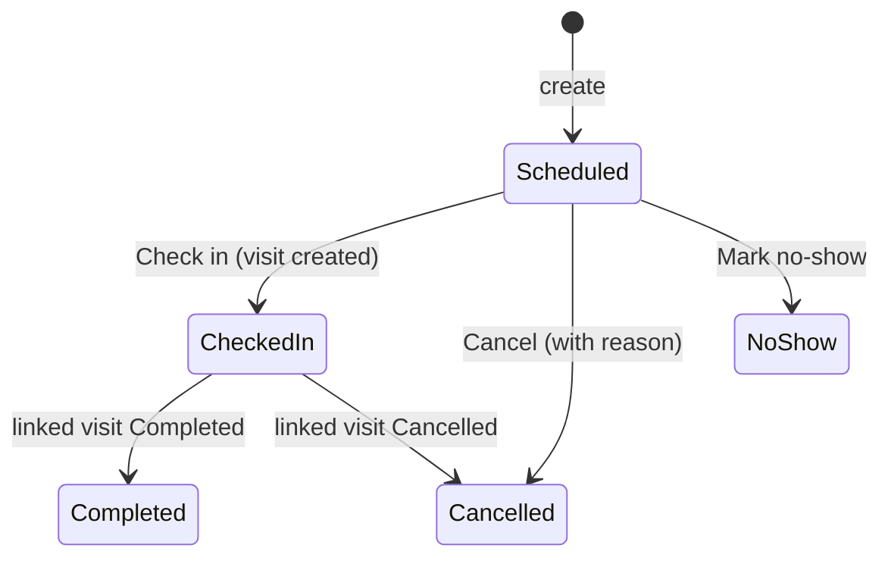
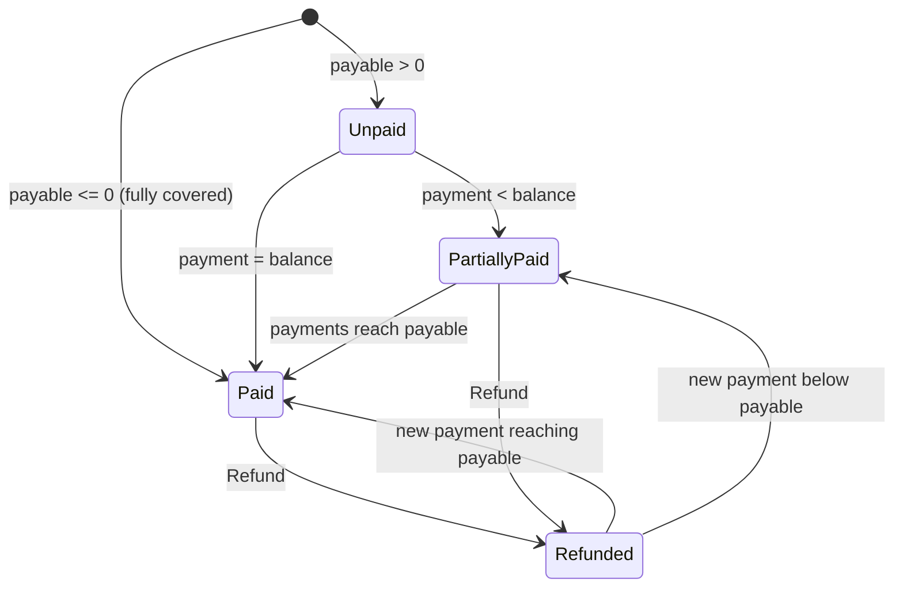
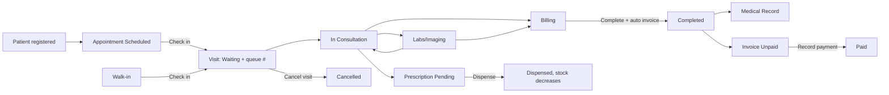
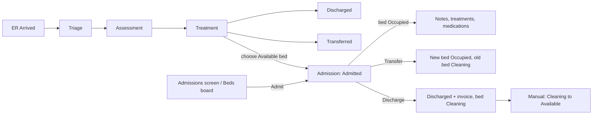
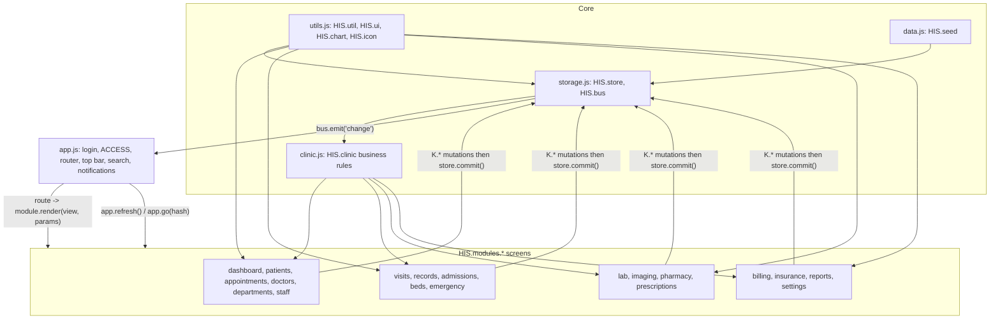

# MediPlus HIS - Complete Guideline (User, Business, Feature and QA)

> Scope: this document describes the **actual implementation** found in the source code of the `hospital-management` folder (static HTML/CSS/JS demo, no backend).
> Anything that is not visible in the code is labelled **Assumption** or **Unknown / not implemented**. No business rule has been invented.
> UI language is English. The few Vietnamese terms that appear (or are implied) are kept in parentheses, for example BHYT (Bao hiem y te, Vietnam health insurance).

---

## Table of contents

1. [Project overview](#1-project-overview)
   - 1.1 Purpose
   - 1.2 Tech stack
   - 1.3 File structure
   - 1.4 How to run
   - 1.5 Data storage (localStorage keys)
   - 1.6 Seed / mock data
   - 1.7 Demo credentials
   - 1.8 Glossary
2. [User guideline](#2-user-guideline)
   - 2.1 Roles and what each can open
   - 2.2 Application shell (login, sidebar, top bar, search, notifications, shortcuts)
   - 2.3 Screen-by-screen reference
   - 2.4 Step-by-step task guides
3. [Business guideline](#3-business-guideline)
   - 3.1 Entities and relationships
   - 3.2 Entity field dictionary
   - 3.3 Statuses and state transitions
   - 3.4 Permissions per role
   - 3.5 Pricing and calculation formulas
   - 3.6 Validation summary
   - 3.7 Key business scenarios
4. [Feature details](#4-feature-details)
5. [Key workflows and module relationships](#5-key-workflows-and-module-relationships)
6. [Known limitations and gaps](#6-known-limitations-and-gaps)
7. [QA test checklist](#7-qa-test-checklist)

---

# 1. Project overview

## 1.1 Purpose

MediPlus HIS is a **frontend-only Hospital Information System prototype** for the fictional "MediPlus General Hospital" (Da Nang, with Ha Noi and Ho Chi Minh City branches). It demonstrates the end-to-end flow of a Vietnamese hospital/clinic:

- patient registration, appointments, outpatient queue and electronic medical record (EMR);
- inpatient admission, bed management, emergency triage;
- laboratory, medical imaging, pharmacy and prescriptions;
- billing with BHYT-style insurance coverage, payments and refunds;
- dashboard, reports and settings.

It is a **UI prototype**. All patient, medical, financial and insurance data are fictional. There is no real authentication, no server, no medical advice (stated in the footer and README).

## 1.2 Tech stack

| Item | Detail |
|---|---|
| Markup | Plain HTML5 (`index.html`, single page) |
| Styling | 4 CSS files (`style.css`, `components.css`, `dashboard.css`, `responsive.css`); light/dark theme via `data-theme` attribute |
| Logic | Vanilla JavaScript, classic `<script>` tags (no modules, no bundler, no build step) |
| Namespace | Everything hangs off one global `window.HIS` (`HIS.util`, `HIS.ui`, `HIS.store`, `HIS.clinic`, `HIS.modules.*`, `HIS.app`, `HIS.chart`, `HIS.bus`, `HIS.REF`) |
| Routing | Hash router: `#/<module>/<param...>` |
| Persistence | Browser `localStorage` (JSON) |
| Charts | Own inline-SVG chart helpers (`HIS.chart`: bar, line, donut, hbars) - no library |
| External resource | Only Google Fonts "Be Vietnam Pro" (falls back to system font offline) |
| Time zone | Hard-coded `Asia/Ho_Chi_Minh` for "today", "now" and the clock |

## 1.3 File structure

```
hospital-management/
|-- index.html            Login screen + app shell + script includes (load order matters)
|-- README.md             Original short README
|-- GUIDELINE.md          This document
|-- css/
|   |-- style.css         Design tokens, layout, sidebar, top bar
|   |-- components.css    Shared UI kit (buttons, tables, modals, badges, forms, toasts)
|   |-- dashboard.css     Module screens (queue board, bed board, ER board, timeline), print styles
|   `-- responsive.css    Breakpoints (drawer sidebar, bottom nav)
`-- js/
    |-- utils.js          Helpers (dates, money, CSV), icons, badge tones, UI kit (modal, form, dataTable, toast), charts
    |-- storage.js        Store (localStorage), event bus, date shifting, ID counters, session, prefs
    |-- clinic.js         BUSINESS RULES: state machines, validations, billing maths, KPIs, notifications
    |-- data.js           Deterministic seed/mock data generator (HIS.seed)
    |-- app.js            Login, role map (ACCESS), sidebar nav, router, top bar, global search, shortcuts
    |-- dashboard.js  patients.js  appointments.js  doctors.js  departments.js  visits.js
    |-- records.js  admissions.js  beds.js  emergency.js  lab.js  imaging.js  pharmacy.js
    |-- prescriptions.js  billing.js  insurance.js  staff.js  reports.js  settings.js
```

Script load order (from `index.html`): `utils -> storage -> clinic -> data -> 19 module files -> app`. `app.js` boots last: it loads the store, applies the theme, restores the session or shows login.

## 1.4 How to run

1. Double-click `index.html` (works from `file://`) **or** serve the folder with any static server (for example `npx serve`, `python -m http.server`).
2. Use Chrome, Edge, Firefox or Safari.
3. Sign in with a demo account (section 1.7). Clicking an account card on the login screen signs in immediately.

No install, build or backend is needed. If the browser blocks `localStorage`, the app still runs in memory and shows the toast: **"Browser storage is unavailable. Changes will not be saved after reload."**

## 1.5 Data storage (localStorage keys)

| Key | Content | Notes |
|---|---|---|
| `mediplus-his-data` | The whole database as one JSON object (`HIS.store.data`) | Written by `saveNow()`; `commit()` triggers a debounced (250 ms) save |
| `mediplus-his-session` | `{ "username": "...", "at": "<timestamp>" }` | Only the username is stored; on reload the user is looked up in `data.users` |
| `mediplus-his-prefs` | `{ theme, sideMini, navCollapsed[], branch }` | Kept separate so **Reset demo data** does not log you out or reset theme |

Data object collections (`HIS.store.data`): `settings, branches, departments, doctors, staff, patients, beds, appointments, visits, labOrders, imagingOrders, medicines, prescriptions, invoices, admissions, emergencyCases, notifications, readNotifs, users, counters`, plus `version`, `anchorDate`, and lazily `permissions` (created when the Roles screen is opened).

Storage behaviour worth knowing:

- **Schema version**: `HIS.DATA_VERSION = 1`. If saved data has a different version or is corrupted, the app silently **re-seeds** (saved data is lost).
- **Date anchoring ("dates shift forward")**: on load, if `anchorDate` is earlier than today, every date string (`YYYY-MM-DD...`) in the data is shifted forward by the number of days elapsed, so the demo always has activity "today". Keys excluded from shifting: `dob, joined, contractEnd, month, manufacturedDate`. Side effect: insurance `validFrom/validTo` and medicine `expirationDate` **also shift** (they are not in the exclusion list), so relative expiry never really elapses.
- **IDs** are generated from counters in `data.counters` (`nextId`). New records use a different number format from seeded ones (for example seeded `AP-300001`, new `AP-000201`) - no collisions.
- **Multi-tab**: no cross-tab synchronisation. Last write wins.
- **Reset**: Settings -> System -> Reset demo data (with confirmation) deletes the data key and re-seeds. Session and prefs remain.
- **Export**: Settings -> System -> Export all data (JSON) downloads `mediplus-his-backup-<date>.json` (contains everything, including plain-text passwords). **There is no import.**

## 1.6 Seed / mock data

Generated by `HIS.seed()` with a fixed seed (`20260929`), so the same content is produced on every reset (relative to today's date).

| Data | Quantity / rule |
|---|---|
| Branches | 3: BR01 MediPlus General Hospital (Da Nang, Active, 320 beds), BR02 MediPlus Ha Noi Clinic (Active, 0 beds), BR03 MediPlus Saigon Medical Center (Ho Chi Minh City, **Opening Soon**, 180 beds) |
| Departments | 16 (DPT01 Internal Medicine ... DPT16 Dentistry). 8 are inpatient (DPT01, 02, 03, 04, 05, 06, 10, 11). 12 are "clinical" (bookable for appointments/visits). DPT12 Emergency, DPT13 Radiology, DPT14 Laboratory, DPT15 Pharmacy are non-clinical |
| Doctors | 26 (IDs `DR-101...`), fee picked from 200,000 / 250,000 / 300,000 / 350,000 / 400,000 / 500,000 VND; ~90% Available, rest Busy / On Leave; first doctor in each dept becomes the department head |
| Staff (non-doctor) | 35 (IDs `STF-200...`) roles: Administrator, Nurse, Pharmacist, Technician, Receptionist, Accountant; one receptionist is On Leave |
| Patients | 150 (`PT-00001...`); first 4 have fixed names (Nguyen Van An, Tran Thi Mai, Le Minh Duc, Pham Thi Huong); ~72% have insurance; coverage picked from 70/80/80/80/95/100; ~4% Inactive |
| Beds | ~90 beds in 30 rooms across the 8 inpatient departments; then 13 active admissions occupy beds, 4 beds set to Reserved, 3 to Cleaning, 2 to Maintenance |
| Appointments | From -20 to +12 days around today, Sundays skipped, ~5-9 per weekday, 3-6 on Saturday; time slots 08:00-11:00 and 13:30-16:00 (30-minute slots) |
| Visits | One per seeded appointment whose status is not Scheduled/Cancelled/No Show; completed ones have vitals, diagnosis + ICD-10, treatment plan, optional follow-up, labs (38%), imaging (16%), prescription (58%) and an invoice |
| Invoices / payments | Past invoices ~82% fully paid, some partially paid; today's invoices ~40% paid |
| Inpatient | 13 currently admitted + 12 already discharged (with room invoice) |
| Emergency | 9 cases for today at various triage levels and statuses |
| Pharmacy | 44 medicines (`MED-1001...`), random quantity 0-900, reorder level 20/30/50, expiry between -20 and +540 days from today |
| Notifications | Empty log at start; live notifications are computed (see 4.19) |

## 1.7 Demo credentials

From `data.js` (`users`). Passwords are stored in plain text in the data.

| Username | Password | Role | Display name |
|---|---|---|---|
| `admin` | `admin123` | Administrator | System Administrator |
| `doctor` | `doctor123` | Doctor | First seeded doctor (`DR-101`, name generated by seed) |
| `nurse` | `nurse123` | Nurse | Vo Thi Hoa |
| `pharmacist` | `pharma123` | Pharmacist | Mai Thi Quyen |
| `reception` | `reception123` | Receptionist | Ho Ngoc Diep |
| `accountant` | `account123` | Accountant | Phan Thanh Tam |

## 1.8 Glossary

| Term | Meaning in this system |
|---|---|
| BHYT (Bao hiem y te) | Vietnam social health insurance; modelled as a patient insurance record with a coverage percentage |
| MST (Ma so thue) | Tax code, a field in Hospital information settings |
| Visit | One outpatient encounter for one patient on one date (queue ticket + EMR content) |
| Encounter | The clinical content of a visit (vitals, complaint, diagnosis, plan) |
| EMR / Medical Record | A **completed** visit shown in the Medical Records screen |
| ICD-10 | Diagnosis code typed as free text |
| Triage level | Emergency urgency: Critical, Urgent, Moderate, Non-Urgent |
| Rx | Prescription |
| Queue number | Sequence number per department per date |
| VND | Only currency; whole numbers, rounded |

---

# 2. User guideline

## 2.1 Roles and what each can open

Access is a **hard-coded map in `app.js` (`ACCESS`)**. It controls sidebar items, direct URL access and global-search sections. It does **not** control individual buttons inside a screen (see 3.4 and 6).

| Module (sidebar) | Admin | Doctor | Nurse | Pharmacist | Receptionist | Accountant |
|---|:-:|:-:|:-:|:-:|:-:|:-:|
| Dashboard | Yes | Yes | Yes | Yes | Yes | Yes |
| Patients | Yes | Yes | Yes | - | Yes | - |
| Appointments | Yes | Yes | - | - | Yes | - |
| Visits | Yes | Yes | Yes | - | Yes | - |
| Medical Records | Yes | Yes | - | - | - | - |
| Doctors | Yes | - | - | - | - | - |
| Departments | Yes | - | - | - | - | - |
| Staff | Yes | - | - | - | - | - |
| Admissions | Yes | Yes | Yes | - | - | - |
| Beds & Rooms | Yes | - | Yes | - | - | - |
| Emergency | Yes | Yes | Yes | - | - | - |
| Laboratory | Yes | Yes | - | - | - | - |
| Medical Imaging | Yes | Yes | - | - | - | - |
| Pharmacy | Yes | - | - | Yes | - | - |
| Prescriptions | Yes | Yes | - | Yes | - | - |
| Billing | Yes | - | - | - | Yes | Yes |
| Insurance | Yes | - | - | - | - | Yes |
| Reports | Yes | - | - | - | - | Yes |
| Settings | Yes | - | - | - | - | - |

If a role opens a URL it may not access, the page shows **"No access"** with the text "Your role (X) cannot open Y. Ask an administrator for access." and a "Go to dashboard" button. An unknown module shows **"This page does not exist"**.

## 2.2 Application shell

### Login screen
- Fields: Username, Password. Button: Sign in.
- Empty field(s): **"Enter your username and password."**
- Wrong credentials: **"Username or password is incorrect. Try one of the demo accounts."**
- Below the form, one card per user in the data (username + role); clicking a card fills and signs in. Because cards come from `data.users`, new users created in Settings also appear as cards (with their password wired into the button - demo only).
- The session persists across reloads (`mediplus-his-session`) until you choose Log out.

### Sidebar
- Groups: Patient care; Doctors & departments; Inpatient & emergency; Diagnostics; Pharmacy; Finance; Insights; and Settings (single item). Only items allowed for the role are shown; empty groups are hidden.
- Group headers collapse/expand (state saved in prefs `navCollapsed`).
- **Live badges** on items: Appointments = today's appointments still Scheduled or Checked In; Visits = today's Waiting + Labs/Imaging; Beds & Rooms = available beds; Emergency = active ER cases; Laboratory = orders in Ordered/Collected/Processing; Pharmacy = medicines that are not "In Stock"; Prescriptions = Pending; Billing = Unpaid invoices.
- Collapse button (desktop) toggles a mini sidebar (pref `sideMini`); on screens <= 1180 px the sidebar becomes a drawer opened by the menu button; on mobile a bottom navigation bar shows up to 4 quick links (Dashboard, Patients, Appointments, Visits, Admissions, Beds - filtered by role) plus "More".
- "Log out" at the bottom of the sidebar and in the user menu.

### Top bar
| Element | Behaviour |
|---|---|
| Branch selector | Lists 3 branches; non-Active branches are disabled and labelled "(opening soon)". Selecting one saves pref `branch`, updates the sub-title under the brand and shows toast: **"Switched to <name>. Demo data is shared across branches."** (no data filtering by branch) |
| Global search | Type >= 2 characters. Searches patients (ID, name, phone, email; max 5), doctors (ID, name, specialty; max 4), invoices (ID, patient name; max 4), medicines (ID, name, generic name; max 4). Each group is shown only if the role can open that module. No match: **No matches for "<text>"**. Clicking a result navigates to the record |
| Clock | Date and HH:MM:SS in Vietnam time, updated every second |
| Language (EN / VI) | Choosing VI shows toast **"Tieng Viet is coming in the next release. Showing English."** (original text uses Vietnamese diacritics) and reverts to EN |
| Theme toggle | Light/dark; saved in prefs; default follows OS `prefers-color-scheme` |
| Notification bell | Red dot with unread count (9+ cap). Menu lists notifications, "Mark all as read", click an item to mark read and jump to its screen. Empty state: "No notifications"; when none unread: "All caught up" |
| User menu | Shows name, role, email; links: Settings (only if allowed), Keyboard shortcuts, Log out |

### Keyboard shortcuts
Active only when not typing in an input/textarea/select, no modal is open, and a user is signed in.

| Key | Action |
|---|---|
| `/` | Focus global search |
| `N` | Open "New appointment" dialog (only if role can open Appointments) |
| `Q` | Go to Visits (outpatient queue) (only if role can open Visits) |
| `Esc` | Close the top-most dialog |

### Common UI patterns
- **Data tables**: search box, dropdown filters ("<Label>: All"), optional date range (from/to), click column header to sort (asc/desc), pagination with rows-per-page 10/25/50/100 (default 10), "Showing a-b of n", "0 results", and **Export** (opens a CSV dialog: preview of first lines, "Copy to clipboard", "Download CSV"; file name `<name>-<today>.csv`, UTF-8 with BOM). If download is blocked: **"Download is blocked here. Use Copy instead."**
- **Dialogs (modals)**: stackable; close with X, `Esc`, clicking the backdrop, or the Cancel/Close button. Buttons that return `false` keep the dialog open (validation failed).
- **Toasts**: green (success), red (error, stay ~4.8 s), yellow (warning), blue (info); ~3.2 s otherwise.
- **Patient picker**: wherever a patient is required, a text input with suggestions (`datalist`) shows "Name - phone (PT-xxxxx)". You must pick a suggestion (or type the exact full name); otherwise an error such as **"Select a patient from the list."** appears.
- **Print**: "Print" buttons print only the top-most dialog (invoice, prescription, medical record, lab/imaging report).
- **Native form validation**: required, pattern, min/max messages come from the browser.

## 2.3 Screen-by-screen reference

| Screen (route) | What you see | Main actions |
|---|---|---|
| **Login** | Brand panel, sign-in form, demo account cards | Sign in |
| **Dashboard** `#/dashboard` | Greeting ("Good morning/afternoon/evening, <last name word>"); bed-occupancy ring; today strip (appointments, waiting patients, pending lab tests, revenue today); 8 KPI tiles (clickable); line chart of completed visits (14 days); donut of today's appointment statuses; bar chart of billed revenue (14 days); horizontal bars of visits by department (14 days, top 8); today's appointments table (first 8); patient queue table (first 8) | New appointment, Check in patient (if role allows); click rows to open appointment / visit |
| **Patients** `#/patients` | KPIs (total, active, with insurance, seen in last 30 days); searchable table (name, gender, DOB + age, phone, nationality, insurance badge, last visit, status) with filters Gender / Status / Insurance | Add patient; open profile |
| **Patient profile** `#/patients/<PT-id>` | Header (avatar, name, blood type, allergy and chronic tags, 4 stats: completed visits, admissions, total paid, last visit); tabs Personal information / Medical information / Insurance / Timeline | Edit profile; New appointment |
| **Appointments** `#/appointments` | KPIs; **List** view (table with filters Status/Department/Type, date range) or **Calendar** view (month grid with counts, day list) | New appointment; Check in; View; Reschedule; Mark no-show; Cancel |
| **Doctors** `#/doctors` | KPIs (total, available, on leave, specialties); table | Add doctor; open profile |
| **Doctor profile** `#/doctors/<DR-id>` | Stats (patients seen, visits in 30 days, today's appointments, fee); profile details; availability dropdown; today's appointments | Edit profile; change availability (saved immediately) |
| **Departments** `#/departments` | Cards (type, location, head doctor, doctors, nurses, patients today, beds, contact) | Open detail; Edit department (head doctor, location, phone) |
| **Staff** `#/staff` | KPIs; table combining doctors (read-only, links to Doctor profile) and non-doctor staff | Add staff; edit non-doctor staff |
| **Visits** `#/visits` | KPIs (today's visits, waiting, in consultation, labs/imaging, completed); 5-column **queue board** (Waiting, In Consultation, Labs/Imaging, Billing, Completed); department filter | Check in patient; click a card to open the visit dialog |
| **Visit dialog** | Flow strip, allergy alert, vital signs (BP, HR, Temp, RR, SpO2, Height, Weight, auto BMI), encounter form, lab/imaging list, prescription, billing summary, stage action buttons | Save encounter; Order lab test; Order imaging; Create prescription; move stage |
| **Medical Records** `#/records` | KPIs (records, this month, follow-up due, unique patients); table of completed visits | View record; Print |
| **Admissions** `#/admissions` | KPIs (currently admitted, admitted today, discharges today, avg expected stay); table | Admit patient; open admission (notes, treatment, medication, transfer, discharge) |
| **Beds & Rooms** `#/beds` | KPIs; legend; department filter; board grouped by building/floor/department with a tile per bed | Click bed: change status, open admission, admit |
| **Emergency** `#/emergency` | KPIs (active, critical, urgent, waiting for triage, avg wait); case cards sorted by triage severity then arrival | Register arrival; open case and move through statuses |
| **Laboratory** `#/lab` | 5 status KPIs; table | New test order; open order; collect, process, enter result, approve, print |
| **Medical Imaging** `#/imaging` | 4 status KPIs; table | New imaging order; schedule; mark performed; write report; print |
| **Pharmacy** `#/pharmacy` | KPIs (medicines, low stock, out of stock, expiring/expired); inventory table with stock bar | Add / edit medicine |
| **Prescriptions** `#/prescriptions` | KPIs (Pending, Dispensed, Cancelled); table | New prescription; open; Dispense; Cancel; Print |
| **Billing** `#/billing` | KPIs (unpaid, partially paid, revenue today, outstanding balance); invoice table | Create invoice; open invoice; Record payment; Refund; Print |
| **Insurance** `#/insurance` | KPIs; tabs "Patient coverage" and "Claims on invoices" | Edit patient insurance (opens patient form); open invoice |
| **Reports** `#/reports` | Date range (default last 30 days) + department filter; 10 report cards | Print; export CSV (patients, appointments, revenue) |
| **Settings** `#/settings[/section]` | Sections: Hospital information, Branches, Insurance defaults, Users, Roles & permissions, Notifications, Regional & language, System | Save each section; edit branches; add/edit users; export/reset data |

## 2.4 Step-by-step task guides

### Task A - Register a new patient
1. Sign in as Administrator, Doctor, Nurse or Receptionist. Open **Patients**.
2. Click **Add patient**.
3. Fill *Full name* (required) and *Phone* (required, 9-14 digits/spaces, optional leading `+`). Optionally date of birth (cannot be in the future), email, address, emergency contact, status.
4. Optionally add medical info (blood type, allergies and chronic conditions as comma-separated lists, notes) and insurance (provider, number, valid from/until, coverage %, referral hospital).
5. Click **Add patient**. Toast: `Patient <name> added (PT-xxxxx)`; you land on the new profile.

### Task B - Book an appointment
1. Press `N` or open **Appointments** -> **New appointment** (also available from a patient profile, pre-filled with the patient).
2. Pick the patient from the suggestion list.
3. Choose Department, then Doctor (list shows "Dr. name - working hours").
4. Choose Date (not earlier than today) and Time.
5. Optionally choose Type, Reason, Notes. Click **Create appointment**.
6. If the doctor already has an appointment at that exact date/time you see: **"Dr. <name> already has an appointment at <time> on <date>."** Choose another slot.

### Task C - Reschedule / cancel / no-show
1. Open the appointment (row or calendar day item). Only **Scheduled** appointments show action buttons.
2. **Reschedule** opens the form (patient fixed; you may change department/doctor/date/time/type/reason/notes). **Mark no-show** sets status "No Show". **Cancel** asks for a reason (Patient request, Doctor unavailable, Rescheduled, Duplicate booking, Other).

### Task D - Check a patient in (outpatient queue)
- **From an appointment**: Appointments list -> **Check in** (or Visits -> Check in patient -> choose "From today's appointment", or open the appointment -> Check in). Toast: `<patient> checked in - queue #n`.
- **Walk-in**: Visits -> **Check in patient** -> type patient, choose department and doctor (and reason) -> **Check in**. Errors: **"Select a patient from the list."**, **"Select a doctor."**
- The patient appears in the **Waiting** column.

### Task E - Run a consultation (doctor)
1. Visits board -> click the patient card -> **Start consultation** (stage becomes In Consultation).
2. Enter vitals (BMI is calculated from height and weight), chief complaint, symptoms, diagnosis, ICD-10 code, diagnosis type (Primary/Secondary), follow-up date, treatment plan, doctor's notes. Click **Save encounter**.
3. Optional: **Order lab test** (choose a test or "Other"), **Order imaging** (study type, body part), **Create prescription** (opens the prescription form pre-filled).
4. If tests were ordered, click **Send for labs / imaging**; when results are back click the stage buttons to return (**In Consultation**) or continue.
5. Click **Proceed to billing**, then **Generate invoice & complete** (or **Complete visit** if an invoice already exists). The visit moves to Completed, the appointment (if any) becomes Completed, and the record appears in Medical Records.

### Task F - Lab workflow
1. Order from the visit dialog (linked to the visit and billed on completion) or from Laboratory -> **New test order** (not linked to a visit).
2. Laboratory -> open order -> **Mark collected** -> **Start processing** -> **Enter result** (Result required; unit, reference range, flag Normal/High/Low/Critical) -> **Approve result** -> optional **Print report**.

### Task G - Imaging workflow
Imaging -> open order -> **Schedule** (date and time required) -> **Mark performed** -> **Write report** (radiologist, finding summary required, full report) -> **Print report**.

### Task H - Prescribe and dispense
1. Create: Prescriptions -> **New prescription** (or from the visit). Choose patient and doctor, add diagnosis, add at least one medicine row (medicine, dosage text, frequency, duration, quantity >= 1). **Create prescription**.
2. Dispense (pharmacist): open the prescription -> **Dispense**. Stock is checked; on success status becomes Dispensed and inventory decreases. On shortage: **"Insufficient stock for <medicine>: <n> <unit> available, <m> needed."**
3. **Cancel** is available only while Pending.

### Task I - Admit, care for, transfer and discharge an inpatient
1. Admissions -> **Admit patient** (or Beds board -> click an Available bed -> Admit). Pick patient, inpatient department, attending doctor, an available bed, expected discharge (default +3 days), reason.
2. Open the admission for **Nursing notes**, **Daily treatment** and **Medication** logs (only while Admitted).
3. **Transfer bed**: choose another Available bed; the old bed becomes Cleaning.
4. **Discharge**: write a summary, click **Discharge & generate invoice**. An invoice is created, the admission becomes Discharged and the bed becomes Cleaning.
5. Beds board -> click the bed -> **Mark Available** when cleaning is done.

### Task J - Handle an emergency case
1. Emergency -> **Register arrival** (existing patient, triage level, chief complaint required).
2. Open the case card: **Move to Triage** (choose level, ER doctor, room) -> **Move to Assessment** -> **Move to Treatment** -> then **Admitted** (choose an available bed), **Discharged** or **Transferred**.

### Task K - Bill a patient and take payment
1. Invoices are auto-created on visit completion and on inpatient discharge. Manual: Billing -> **Create invoice** (patient + at least one line item with description; category, qty, unit price).
2. Open the invoice -> **Record payment** (amount defaults to the balance; method Cash / Bank Transfer / Credit Card / QR Payment).
3. Partial payment -> status "Partially Paid"; full -> "Paid".
4. **Refund** (when something has been paid): enter amount (1 up to total paid) and optional reason.
5. **Print** for a printable invoice.

### Task L - Manage medicine stock
Pharmacy -> **Add medicine** or click a row to edit (name, generic name, category, unit, manufacturer, batch, expiration date, quantity, reorder level, selling price). To receive stock, edit the quantity manually (there is no dedicated stock-in function).

### Task M - Administer users and settings (administrator)
Settings -> Users -> **Add user** (username 3-20 chars of lowercase letters, digits, `.`, `_`; password at least 6 chars; role; email) or edit. Other sections: hospital info, branch edit, insurance defaults, notification toggles, regional, system (export/reset).

---

# 3. Business guideline

## 3.1 Entities and relationships

```mermaid
erDiagram
    DEPARTMENT ||--o{ DOCTOR : "has"
    DEPARTMENT ||--o{ BED : "owns (inpatient only)"
    PATIENT ||--o{ APPOINTMENT : "books"
    DOCTOR ||--o{ APPOINTMENT : "attends"
    APPOINTMENT ||--o| VISIT : "check-in creates"
    PATIENT ||--o{ VISIT : "has (walk-in or appointment)"
    VISIT ||--o{ LAB_ORDER : "orders"
    VISIT ||--o{ IMAGING_ORDER : "orders"
    VISIT ||--o| PRESCRIPTION : "issues (one id stored)"
    VISIT ||--o| INVOICE : "billed by"
    PRESCRIPTION }o--o{ MEDICINE : "items"
    PATIENT ||--o{ ADMISSION : "admitted"
    BED ||--o| ADMISSION : "current occupant"
    ADMISSION ||--o| INVOICE : "discharge bill"
    PATIENT ||--o{ EMERGENCY_CASE : "arrives"
    EMERGENCY_CASE ..> ADMISSION : "Admitted creates"
    INVOICE ||--o{ PAYMENT : "payments (embedded)"
    PATIENT ||--o| INSURANCE : "embedded object"
    USER }o..o| DOCTOR : "doctorId (seed only)"
```

Relationships are held by plain ID fields (for example `visit.patientId`, `visit.appointmentId`). There is no referential-integrity enforcement, and there is no delete feature for patients, doctors, appointments, visits, invoices, etc.

## 3.2 Entity field dictionary

**Patient** (`PT-00001`)

| Field | Notes |
|---|---|
| id, name, gender (Male/Female/Other), dob, phone, email, address, nationality (default Vietnamese), emergencyContact | Name and phone required in the UI form; `createPatient` itself only requires name ("Patient name is required.") |
| bloodType | A+, A-, B+, B-, AB+, AB-, O+, O-, or empty |
| allergies[], chronicConditions[], surgeries[], medications[] | Arrays of strings; surgeries and medications are display-only in the UI (not editable) |
| insurance {provider, number, validFrom, validTo, coveragePct, referralHospital} | Embedded. "Insured" means `number` is non-empty. "Active" = `validTo >= today` |
| status | Active / Inactive |
| notes, lastVisit, createdAt | `lastVisit` updated when a visit is completed |

**Doctor** (`DR-101`): id, name, gender, specialty (free text), departmentId, experience (years), phone, email, qualifications, certifications[], consultationFee (VND), workDays[], workHours (text), status (Available / Busy / On Leave), joined.

**Department** (`DPT01`): id, name, inpatient (bool), location, headDoctorId, phone.

**Staff** (`STF-200`): id, name, department (text), position, role (Nurse / Pharmacist / Technician / Receptionist / Accountant / Administrator), shift (Morning / Afternoon / Night / Office), phone, email, status (Active / On Leave / Inactive), joined.

**User**: name, username, password (plain), role (Administrator / Doctor / Nurse / Pharmacist / Receptionist / Accountant), email, optional doctorId.

**Appointment** (`AP-...`): id, patientId, doctorId, departmentId, date, time (HH:MM), type, reason, status, notes, createdAt, createdBy, cancelReason (when cancelled).
Types: General Consultation, Follow-up, Specialist Consultation, Health Check, Vaccination, Laboratory, Imaging, Surgery Consultation.

**Visit** (`VS-...`): id, appointmentId ('' for walk-in), patientId, doctorId, departmentId, date, queueNumber, checkinTime, stage, type ("Walk-in" when no appointment), reason, vitals {bp, hr, temp, rr, spo2, height, weight, bmi}, chiefComplaint, symptoms, diagnosis, icd10, diagnosisType (Primary/Secondary), treatmentPlan, doctorNotes, followUpDate, labOrderIds[], imagingOrderIds[], prescriptionId, invoiceId, consultStartedAt, completedAt.

**Lab order** (`LB-...`): id, patientId, doctorId, visitId, testName, category (Hematology, Biochemistry, Urine, General), orderedAt, status, result, unit, referenceRange, flag (Normal/High/Low/Critical), collectedAt, completedAt, approvedBy.

**Imaging order** (`IM-...`): id, patientId, doctorId, visitId, studyType (X-Ray, CT Scan, MRI, Ultrasound, Mammography), bodyPart, orderedAt, scheduledAt, performedAt, status, radiologist, result, reportText.

**Medicine** (`MED-1001`): id, name, genericName, category, unit (tablet, capsule, bottle, tube, inhaler, vial, ampoule, sachet), manufacturer, batch, expirationDate, quantity, reorderLevel, sellingPrice.
Categories: Analgesic, Antibiotic, Antihistamine, Antihypertensive, Antidiabetic, Vitamin, Antacid/GI, Respiratory, Dermatological, Cardiac, Antiplatelet, Other.

**Prescription** (`RX-...`): id, patientId, doctorId, visitId, diagnosis, items[{medicineId, medicineName, dosage, frequency, duration, route, instructions, qty, unitPrice}], status, createdAt, dispensedAt.

**Invoice** (`INV-...`): id, patientId, visitId, admissionId, date, items[{category, description, qty, unitPrice}], discount, coveragePct, insuranceProvider, subtotal, insuranceCovered, patientPayable, payments[{id `PMT-...`, amount, method, date, reference, status, cashier}], status, issuedBy.
Bill categories: Consultation, Laboratory, Imaging, Medicine, Room, Procedure, Surgery, Other.

**Bed**: id (`<dept>-<room>-<n>`), building, floor, departmentId, room, bedNumber, status, patientId. Label shown as `<room>-<bedNumber>`, for example `201-1`.

**Admission** (`AD-...`): id, patientId, doctorId, departmentId, bedId, admissionDate, expectedDischarge, actualDischarge, reason, status (Admitted / Discharged), nursingNotes[{at, by, note}], dailyTreatments[{at, by, note}], medications[{at, by, medicine, dose, route}], invoiceId.

**Emergency case** (`ER-...`): id, patientId, arrivalTime, triageLevel, chiefComplaint, assignedDoctorId, assignedRoom, status, notes.

**Notification**: id (`N<n>`), type, text, time, link, read. Log is capped to the newest 40.

**Branch**: id, name, city, address, beds, phone, director, status (Active / Opening Soon / Inactive).

## 3.3 Statuses and state transitions

### Appointment status
Values: `Scheduled, Checked In, Waiting, In Consultation, Completed, Cancelled, No Show`.



| Rule | Detail |
|---|---|
| Edit | `updateAppointment` throws "A completed appointment cannot be edited." / "A cancelled appointment cannot be edited." for Completed/Cancelled. The UI only offers Reschedule on Scheduled |
| Statuses Waiting / In Consultation | Exist in the status list and in seed data for today's appointments, but the app code never sets them (a check-in sets "Checked In" and stays so until the visit completes or is cancelled) |
| `setApptStatus` | No transition guard in code; the UI limits actions to Scheduled appointments |

### Visit (outpatient queue) stage
Values: `Waiting -> In Consultation -> Labs/Imaging -> Billing -> Completed`, plus `Cancelled`.

| From | Allowed next |
|---|---|
| Waiting | In Consultation, Cancelled |
| In Consultation | Labs/Imaging, Billing |
| Labs/Imaging | In Consultation, Billing |
| Billing | Completed |
| Completed | none |
| Cancelled | none |

Error for an illegal move: **"Visit cannot move from <A> to <B>."**
Side effects: entering In Consultation stamps `consultStartedAt` once; Completed stamps `completedAt`, sets linked appointment to Completed and sets `patient.lastVisit`; Cancelled sets linked appointment to Cancelled with reason "Visit cancelled at front desk".

### Bed status
Values: `Available, Occupied, Reserved, Cleaning, Maintenance`.

| From | Manual next (Beds board buttons) |
|---|---|
| Available | Reserved, Occupied, Maintenance |
| Reserved | Occupied, Available |
| Occupied | Cleaning |
| Cleaning | Available, Maintenance |
| Maintenance | Available |

Errors: **"Bed <label> is occupied. Discharge the patient first."** (Occupied -> anything except Cleaning), **"Bed cannot move from <A> to <B>."** Moving to any status other than Occupied clears `patientId`. System-driven changes: Admit -> Occupied; Discharge -> Cleaning; Transfer: old bed Cleaning, new bed Occupied.

### Admission status
`Admitted -> Discharged` (only). Errors: "This admission cannot be discharged." / "Only an admitted patient can be transferred."

### Emergency case status
`Arrived -> Triage -> Assessment -> Treatment -> (Admitted | Discharged | Transferred)`. Error: **"Case cannot move from <A> to <B>."** Discharged, Transferred and Admitted are terminal. Note: "active" cases (KPI, badge) are those **not** Discharged/Transferred, so "Admitted" ER cases still count as active.

### Lab order status
`Ordered -> Collected -> Processing -> Completed -> Approved`. Error: "Cannot move from <A> to <B>." (Entering a result sets Completed and stamps `completedAt`; approving sets `approvedBy` = current user's name.)

### Imaging order status
`Ordered -> Scheduled -> Performed -> Reported`. The UI enforces the order by only showing the next button.

### Prescription status
`Pending -> Dispensed` or `Pending -> Cancelled`. Errors: "Only a pending prescription can be dispensed." / "Only a pending prescription can be cancelled."

### Invoice status
Values: `Unpaid, Partially Paid, Paid, Refunded`.



Status is recalculated after every payment: balance <= 0 -> Paid, else Partially Paid. A refund sets status to Refunded regardless of the refunded amount (see limitation L-10).

### Doctor / Staff / Patient status
Doctor: Available, Busy, On Leave (free choice, no automatic change). Staff: Active, On Leave, Inactive. Patient: Active, Inactive (informational only; inactive patients can still be booked).

## 3.4 Permissions per role

Two layers exist:

1. **Enforced** - `ACCESS` map in `app.js` (module-level view; table in 2.1). Anyone who can open a module can perform **every** action in it (create, edit, change status, dispense, approve, refund...).
2. **Not enforced** - the "Roles & permissions" matrix in Settings (`view / create-edit / delete` per module, default derived from the same map, Administrator locked). The screen text says: *"Sidebar access follows the built-in role map; this matrix is stored for reference."* Saving it only writes `data.permissions`.

Additional behaviours:

- Global search hides result groups the role cannot open.
- Cross-module shortcuts can bypass the map: for example the Insurance screen (Accountant) opens the **patient edit form**; the Visit dialog (Receptionist/Nurse) can order labs, imaging and create prescriptions; the Patient profile (Nurse/Receptionist) can open "New appointment" even if the role has no Appointments access. Following an in-dialog link to a forbidden module shows the "No access" page.
- Users cannot change their **own** role: **"You cannot change your own role."**
- Data is not filtered by role or by owner (a Doctor sees all visits, not only their own).

## 3.5 Pricing and calculation formulas

All amounts are integer VND. Display format: `1,234,567 VND`; short form `K / M / B`.

| Calculation | Formula (from `clinic.js`) |
|---|---|
| Line amount | `round(qty x unitPrice)` |
| Subtotal | sum of line amounts |
| Insurance covered | `round(subtotal x coveragePct / 100)` (applies to the whole subtotal - all categories including medicine and room) |
| Patient payable | `max(0, subtotal - insuranceCovered - discount)` |
| Paid | sum of payments whose `status != 'Refunded'` |
| Balance | `patientPayable - paid` |
| Coverage % source | `invoice.coveragePct` = explicit value if given, else the patient's **active** insurance `coveragePct`, else 0. Active = insurance number present AND `validTo >= today` (`validFrom` is not checked) |
| Auto-paid on creation | If `patientPayable <= 0` the invoice starts as `Paid` |
| BMI | `weight / (height/100)^2` rounded to 1 decimal; shown as "-" if height or weight is missing |
| Bed occupancy % | `occupied beds / total beds x 100` (Reserved, Cleaning, Maintenance are counted as not occupied) |
| Stock status | `quantity <= 0` -> Out of Stock; `quantity <= reorderLevel` -> Low Stock; else In Stock |
| Expiry status | `days = expirationDate - today`; `< 0` -> Expired; `<= 60` -> Expiring Soon; else none |
| ER waiting minutes | minutes from `arrivalTime` to now (day difference x 1440 + minute-of-day difference) |
| Queue number | count of existing visits with the same department and date, plus 1 (cancelled visits are counted) |
| Age | completed years from DOB to today |

**Visit invoice line items** (`visits.js: buildInvoiceItems`, built when a visit is completed without an invoice):

| Item | Price rule |
|---|---|
| Consultation | `doctor.consultationFee` x 1 ("Consultation - <specialty>") |
| Laboratory (each lab order of the visit) | by category: Hematology 150,000; Biochemistry 180,000; Urine 120,000; General 150,000 (fallback 150,000) |
| Imaging (each imaging order) | X-Ray 200,000; CT Scan 1,400,000; MRI 2,500,000; Ultrasound 300,000; Mammography 650,000 (fallback 300,000) |
| Medicine (each prescription item) | `qty x unitPrice` (unit price copied from the medicine's selling price at prescribing time); included whatever the prescription status is |

**Inpatient invoice** (`admissions.js`, at discharge):

| Item | Rule |
|---|---|
| Room | qty = `max(1, days between admissionDate and today)`, unit price 550,000 ("Inpatient room - <department>") |
| Procedure | "Nursing care and daily monitoring" qty 1, 400,000 |
| Not billed | medication administrations, daily treatments, lab/imaging linked to the admission |

**Worked example.** A patient with active 80% insurance completes a visit: consultation 300,000 + 1 hematology test 150,000 + prescription 10 x 5,000 = 50,000 -> subtotal 500,000; insurance covered 400,000; discount 0; patient payable 100,000; status Unpaid; a 60,000 payment leaves 40,000 balance and status "Partially Paid".

## 3.6 Validation summary

| Area | Rule / message |
|---|---|
| Login | "Enter your username and password." / "Username or password is incorrect. Try one of the demo accounts." |
| Patient form | Name required; Phone required, pattern `\+?[0-9 ]{9,14}`; Email must be valid email format; DOB `max` = today; Coverage 0-100 |
| Appointment | "Select a patient." / "Select a doctor." / "Choose a date and time." / conflict message; date `min` = today (form); UI: "Select a patient from the list, or add them first from Patients." |
| Check-in | "Select a patient and doctor." (core); UI: "Select a patient from the list." / "Select a doctor." |
| Bed / admission | "Select a patient." / "Assign a bed." / "Bed <label> is not available." |
| Emergency | "Select or register a patient." (core); UI: "Select an existing patient, or add them from Patients first."; chief complaint required |
| Lab result | Result required (native) |
| Imaging | Schedule date-time required; report: finding summary required |
| Prescription | "Add at least one medicine." ; patient must be selected; qty min 1 |
| Payment | "Enter a valid amount." ; "Amount exceeds the balance due (<money>)." |
| Refund | "Refund must be between 1 and <paid money>." |
| Invoice creation (UI) | "Add at least one line item." (rows without a description are ignored) |
| Doctor form | Name, specialty, phone required |
| Staff form | Name, phone required |
| Medicine form | Name, generic name, expiration date, quantity (>= 0), selling price (>= 0) required |
| User form | Username `[a-z0-9._]{3,20}`, password `.{6,}` (required for new users), email required; "Username already exists."; "You cannot change your own role." |
| Settings | Hospital name, legal name, MST, address, phone required; email format; coverage 0-100; invoice symbol required |

## 3.7 Key business scenarios

| # | Scenario | Result |
|---|---|---|
| S1 | Book, check in, consult, bill, pay | Appointment Scheduled -> Checked In -> Completed; Visit Waiting -> ... -> Completed; invoice created; record shows in Medical Records |
| S2 | Walk-in patient without appointment | Visit with type "Walk-in", no appointment link; same stage flow |
| S3 | Double booking attempt | Blocked with conflict message for same doctor/date/time unless the other appointment is Cancelled/No Show |
| S4 | Visit with tests | Orders linked to the visit; invoice includes them if ordered before completion |
| S5 | Patient with active 80% insurance | Insurance covered = 80% of subtotal, patient pays 20% |
| S6 | Insurance expired (`validTo` < today) | Treated as no insurance -> coverage 0% on new invoices |
| S7 | Dispense with insufficient stock | Whole dispense rejected, no stock changes |
| S8 | Emergency to inpatient | ER case moved to Admitted with a chosen Available bed creates an Admission and occupies the bed |
| S9 | Discharge | Invoice generated (room nights x 550,000 + 400,000), bed -> Cleaning (not directly Available) |
| S10 | Bed transfer | Old bed -> Cleaning, new bed -> Occupied, nursing note "Transferred to <bed>" |
| S11 | Cancel a queued visit (Waiting only) | Visit Cancelled; linked appointment Cancelled |
| S12 | Overpay an invoice | Rejected with the balance shown |

---

# 4. Feature details

Each block lists inputs, outputs, rules, messages and edge cases.

## 4.1 Authentication and session
- **Inputs**: username, password (trimmed username, exact password). Or click a demo account card.
- **Rule**: exact match against `data.users` (plain text). No lockout, no password hashing, no timeout.
- **Outputs**: session key saved; app shown; router goes to `#/dashboard` if hash is empty/invalid.
- **Edge cases**: `settings.autoLogout` (30) exists in the seed but is **not used**. Logging out clears the session, closes all dialogs, resets the hash. If the stored session username no longer exists (for example after resetting data) the login screen is shown.

## 4.2 Dashboard
- **KPIs** (`K.kpis`): total patients; today's appointments; pending appointments (today, status Scheduled or Checked In); waiting (today's visits in Waiting or Labs/Imaging); admitted (status Admitted); available beds / total; occupancy %; active ER cases (not Discharged/Transferred); pending lab (Ordered/Collected/Processing); revenue today = payments collected on invoices **dated today**.
- **Charts**: "Patient visits" counts Completed visits per day (last 14 days); "Revenue" bars sum invoice **subtotals** (billed before insurance) per invoice date; "Visits by department" counts Completed visits in 14 days (top 8, clinical departments only).
- **Note**: "Revenue today" (collected, KPI and strip) and the "Revenue" chart (billed subtotal) use different definitions.
- The Doctor/Reception etc. see the same dashboard (only the New appointment / Check-in buttons depend on role).

## 4.3 Patients
- **List**: filters Gender (Male/Female), Status (Active/Inactive), Insurance (Insured/Uninsured); search on ID, name, phone, email; default sort by name; CSV export.
- **Create/edit form**: see 3.6. Allergies and chronic conditions: comma separated -> arrays (blank entries dropped). On edit, `surgeries` and `medications` are preserved but cannot be edited.
- **Insurance section**: saved even when the provider/number are blank; a patient counts as insured only if `number` is set. Coverage empty -> 0.
- **Profile tabs**: Personal, Medical ("None known" allergies, "None" for other lists), Insurance (badge Active/Expired, "No insurance on file" state), Timeline (completed visits and admissions only, newest first).
- **Edge cases**: no duplicate detection (same name/phone can be created twice); no delete; Inactive patients remain selectable everywhere.

## 4.4 Appointments
- **Create**: patient (picker), department (clinical departments only), doctor (filtered by department; shows all doctors of that department including On Leave), date (>= today), time (any time), type (8 types), reason, notes. Created with status Scheduled, `createdBy` = current user, and a notification "New appointment ...".
- **Conflict rule**: same `doctorId + date + time` among appointments not Cancelled/No Show (exclude itself when rescheduling). Message: `Dr. <name> already has an appointment at <time> on <date>.` (date shown in configured date format).
- **Not checked**: patient double booking, doctor working days/hours, doctor status On Leave, slot length, past times today.
- **Reschedule**: only patient is locked. Same conflict check. Toast `<id> updated`.
- **Cancel** stores `cancelReason`; **No show** just sets status.
- **List/Calendar**: List filters Status, Department, Type + date range; Calendar shows month grid with per-day counts (today highlighted), month navigation, "Today" button, and a day list beneath. KPI "Cancelled (30 days)" counts Cancelled appointments *created* in the last 30 days.
- **Deep link**: `#/appointments/<AP-id>` opens the detail dialog and rewrites the URL to `#/appointments`.
- **Check-in from an appointment** does not verify that the appointment date is today; a future-dated Scheduled appointment can be checked in (the visit is dated today).

## 4.5 Visits and encounter (EMR)
- **Check-in dialog**: "From today's appointment" select is shown only if there are Scheduled appointments today; choosing one hides the walk-in fields. Walk-in requires patient + doctor; department defaults to the doctor's department.
- **Queue board**: cards show `#queueNumber`, patient, doctor, department; department filter; shows only **today's** visits.
- **Encounter form**: vitals text inputs (BP free text like `120/80`), auto BMI; diagnosis, ICD-10 (free text, no code validation), diagnosis type (Primary/Secondary), follow-up date, treatment plan, notes. "Save encounter" saves everything at once; stage buttons do **not** auto-save unsaved text - save first.
- **Allergy alert**: red banner listing the patient's allergies (informational; no automatic drug-allergy check).
- **Orders**: lab (8 common tests or custom name), imaging (5 studies + free-text body part). Custom lab test with empty name: nothing happens (dialog stays open).
- **Prescription**: if none exists the "Create prescription" button opens the prescription form (patient/doctor/diagnosis pre-filled). If one exists it is listed with a link. Only one prescription id is stored per visit (a second creation from Prescriptions with the same visit is not possible from the UI).
- **Stage buttons**: "Start consultation", "Send for labs / imaging", "Proceed to billing", "Generate invoice & complete" / "Complete visit", "Cancel visit" (only from Waiting). Illegal moves show the error toast.
- **Complete**: generates the invoice if `invoiceId` is empty (see 3.5), then sets stage Completed and closes the dialog.
- **Edge cases**: a visit can be completed with no diagnosis; completing does not require lab results to be Approved or prescriptions to be dispensed.

## 4.6 Medical Records
- Lists **Completed** visits. KPIs: total records, this month, "With follow-up due" (follow-up date >= today), unique patients.
- Filters Department, Doctor, date range; search on patient, doctor, diagnosis, ICD-10, visit ID. Default sort: date descending.
- Record dialog shows vitals, complaint, symptoms, diagnosis (with ICD-10 and type), plan, notes, follow-up ("Not required" if empty), lab results table, imaging summary ("Pending report" if none), prescription lines; **Print** button.
- Deep link: `#/records/<VS-id>` opens the record.
- Read-only: records cannot be edited from this screen.

## 4.7 Doctors
- Table with department/status filters; profile shows metrics: patients seen (distinct patients with Completed visits), visits in last 30 days, today's appointments, fee.
- Add/edit form: name*, gender, department, specialty*, experience (0-50), fee (>= 0, step 10,000), phone*, email, qualifications, working hours, status. New doctors get `workDays` Mon-Fri, no certifications; `workDays` and certifications are not editable in the UI. ID = `DR-` + (100 + count + 1).
- Changing the availability dropdown saves immediately with toast `Dr. <name> marked <status>`.
- No delete; the Doctor role cannot open this module.

## 4.8 Departments
- Card grid; the detail dialog lists doctors. Edit: head doctor (only that department's doctors, or "None"), location, phone.
- The "Nurses" count is computed by a text match between the department name and the staff `department` field (see L-14).

## 4.9 Staff
- Merged list of doctors (read-only, opens Doctor profile) and other staff (opens edit form). Role filter includes Doctor. KPIs: total, doctors, nurses, on leave (a doctor's On Leave counts; Busy is shown as Active).
- Add staff: role cannot be Doctor; ID = `STF-` + (200 + count + 1).

## 4.10 Admissions
- **Admit**: patient (picker), inpatient department, attending doctor (filtered by department), bed (Available beds of that department; "No beds available" placeholder), expected discharge (default +3 days), reason. Admission date = today.
- **Rules**: bed must be Available; the same patient can be admitted more than once simultaneously (no check).
- **Detail dialog**: tabs Nursing notes / Daily treatment / Medication (each entry stamped with time and current user); Add note / Log treatment / Log medication (medicine text required, dose, route Oral/IV/IM/Topical). Empty text is silently ignored. All logging hidden once Discharged.
- **Transfer**: dropdown of all Available beds (any department). Error toast if the selection is empty/unavailable: `Bed  is not available.`
- **Discharge**: optional summary; creates the invoice first, then discharges (see 3.5). Summary saved as note "Discharge summary: <text>".
- KPI "Avg. expected stay" = average (expectedDischarge - admissionDate) of current admissions, in days.
- Deep link `#/admissions/<AD-id>`.

## 4.11 Beds and rooms
- Board grouped by building / floor / department; tile shows room-bed, status, patient name.
- Bed dialog shows department, location, status, patient (with link to the admission), next-status buttons ("Mark <status>"), and "Admit patient to this bed" for Available beds. That button opens the generic Admit dialog (the bed is **not** pre-selected).
- See 3.3 for transitions and messages.

## 4.12 Emergency
- **Register**: existing patient (no quick-registration; the hint says add the patient first), triage level (default Moderate), chief complaint (required). Creates case status Arrived, arrival time now; no doctor/room yet.
- **Move to Triage** opens a dialog: triage level, assigned doctor (Emergency department doctors only), room (free text).
- **Admit from emergency**: choose an available bed; if none, the dialog says "No beds are currently available." with only a Close button.
- **Board order**: Critical, Urgent, Moderate, Non-Urgent, then earliest arrival first. Card text shows minutes waiting (or the arrival date-time once Discharged/Transferred).
- Dashboard/sidebar count "active" as not Discharged/Transferred (Admitted still counts).
- No ER billing, no ER notes/vitals.

## 4.13 Laboratory
- **Order dialog (standalone)**: patient, ordering doctor (all doctors), test (8 common + "Other"). Note: choosing "Other" stores the literal test name "Other" (no free-text field in this dialog); category General.
- **Detail dialog**: shows results table for Completed/Approved; buttons per next state; "Enter result" opens result dialog; "Print report" only for Approved.
- **Flags**: Normal, High, Low, Critical (badge tones: Critical = red, High/Low = yellow, Normal = green).
- **Approval**: any user with access can approve; `approvedBy` = current user's display name. `settings.requireApprovalForLabResults` is not used.
- Notifications: "Lab test ordered: ..." and "Result ready: ...".

## 4.14 Medical imaging
- Order: patient, ordering doctor, study type (X-Ray, CT Scan, MRI, Ultrasound, Mammography), body part (free text, may be empty).
- Schedule: `datetime-local`, default = now. Perform: one click. Report: radiologist (list of Radiology doctors first, then all doctors), finding summary (required), full report.
- Report view shows radiologist and report text; Print report available when Reported.
- Note: the notification type `imaging` has no dedicated icon mapping (uses a default icon).

## 4.15 Pharmacy
- Table filters Category, Stock (In Stock / Low Stock / Out of Stock), Expiry (Expiring Soon / Expired); stock bar length = `quantity / (reorderLevel x 3)` capped at 100%.
- Add/edit as in 3.6. New ID `MED-` + (1000 + count + 1). No delete, no batch tracking beyond a text field, no stock movements log.
- Expired stock can still be prescribed and dispensed (no block).
- Deep link `#/pharmacy/<MED-id>` opens the edit form.

## 4.16 Prescriptions
- Create form rows: medicine (select of all medicines), dosage (free text, default "1 tablet"), frequency (Once daily / Twice daily / 3 times daily / Every 8 hours), duration (3/5/7/10/14 days), quantity (default 10, min 1). Route is fixed to Oral and instructions to "After meals" for UI-created prescriptions. Unit price is the medicine's current selling price.
- No check on stock, allergies, duplicates or expiry at creation.
- Dispense: all-or-nothing stock check, then decrement; sets `dispensedAt`. Messages in 3.6 and section 4.
- Detail dialog shows lines with amount `qty x unitPrice` and a Print button.
- Deep link `#/prescriptions/<RX-id>`.

## 4.17 Billing
- **Table**: filter Status; date range; columns include Balance. KPIs: Unpaid count, Partially Paid count, Revenue today (collected on invoices dated today), Outstanding balance (sum of balances of all invoices).
- **Create invoice**: patient + any number of lines (category, description, qty >= 1 default 1, unit price >= 0 step 1,000). Rows with empty description are dropped. Insurance coverage is taken automatically from the patient's active insurance; there is **no discount field** in the UI (the core supports `discount`).
- **Invoice document**: header from `settings.address`/`settings.phone` but the title is the fixed text "MediPlus General Hospital"; parties block; items; totals (Subtotal, Insurance covered, Discount, Patient payable, Paid, Balance due); payments table.
- **Record payment**: amount (min 1, default = balance), method (Cash, Bank Transfer, Credit Card, QR Payment). The `reference` field exists in the model but the UI does not capture it. Button hidden when balance <= 0.
- **Refund**: amount 1..total paid, reason optional. Adds a negative payment row with method "Refund" and sets the invoice to Refunded. Button hidden after the invoice is Refunded or when nothing has been paid.
- Deep link `#/billing/<INV-id>`.

## 4.18 Insurance
- "Patient coverage": insured patients (number present), provider/status filters (Active/Expired), click to open the patient edit form.
- "Claims on invoices": invoices with `insuranceCovered > 0`. This is a **read-only derived view** - there is no claim submission, approval, rejection or payment tracking.
- KPI "Total covered (all claims)" = sum of `insuranceCovered`.
- Route `#/insurance/patients` or `#/insurance/claims` selects the tab.
- Settings "Insurance defaults" (default coverage %, invoice symbol) are saved but not used by any calculation.

## 4.19 Notifications
Two sources merged and sorted newest first:

| Source | Content |
|---|---|
| Event log (`data.notifications`, newest 40) | New appointment; patient checked in (queue #); admission/discharge; emergency arrival; lab ordered / result ready; imaging ordered / report ready; prescription created / dispensed |
| Live computed (recalculated on every render) | "n appointments waiting to check in today"; "n patients waiting in the outpatient queue"; up to 3 completed lab results; up to 3 pending prescriptions; up to 3 medicines not In Stock; "n beds available across the hospital"; "n active emergency cases"; "n unpaid invoices" |

Each live type can be switched off in Settings -> Notifications (appointments, queue, lab, prescription, pharmacy, beds, emergency, billing). The "email" toggle is labelled "(simulated)" and does nothing. Read state is stored in `data.readNotifs` (IDs). Live IDs are stable (for example `live-appt`), so once marked read a live alert stays read until data reset.

## 4.20 Reports
- Filters: From (default today - 29 days), To (default today), Department (applies to visits and appointments only). The filter state is kept while navigating within the session (module-level variables).
- Sections: Patient statistics (new patients by `createdAt`, total, insured), Appointment statistics (total, completion rate = Completed / all appointments in range, donut by status), Doctor performance (top 10 by completed visits; revenue = visits x consultation fee, not real invoiced amounts), Department performance, Revenue (billed subtotal, insurance covered, collected; daily bar chart), Insurance (covered by provider), Pharmacy inventory (current, not date-filtered), Laboratory workload (by status, ordered date in range), Bed occupancy (current), Emergency statistics (cases by arrival date, average waiting time, by triage).
- Exports (CSV dialog): patients (ID, Name, Created), appointments (ID, Patient, Doctor, Date, Status), revenue (Date, Revenue). Other sections have no export.
- **Print** uses the browser print dialog for the whole page.

## 4.21 Settings
| Section | Behaviour |
|---|---|
| Hospital information | Editable fields stored in `settings`; invoice header uses only address and phone |
| Branches | Table with **Edit** only (no add/delete button in the UI even though the form supports create). Statuses Active / Opening Soon / Inactive |
| Insurance defaults | Default BHYT coverage % and invoice symbol (stored only) |
| Users | Add / edit users; password blank on edit keeps the existing one; no delete; new users also appear as cards on the login screen |
| Roles & permissions | Matrix for reference (see 3.4). Unchecking View clears Create/Delete for that module. Administrator column disabled |
| Notifications | Toggles (4.19) |
| Regional & language | Currency (VND only), language (choosing "Tieng Viet (coming soon)" shows "Vietnamese is coming soon. Keeping English."), time zone (fixed), date format options `DD/MM/YYYY`, `YYYY-MM-DD`, `DD MMM YYYY` |
| System | Version/storage size/record counts; Export JSON; Reset demo data (confirm dialog: "Reset all demo data?") |

Date-format note: the display function supports `DD/MM/YYYY` (default), `MM/DD/YYYY` and `YYYY-MM-DD`; the option `DD MMM YYYY` offered in the selector falls back to `DD/MM/YYYY`.

---

# 5. Key workflows and module relationships

## 5.1 Outpatient journey



## 5.2 Inpatient and emergency journey



## 5.3 Bed lifecycle

```
Available --Admit/Transfer in--> Occupied --Discharge/Transfer out--> Cleaning --Mark Available--> Available
   |  \--Mark Reserved--> Reserved --Mark Occupied / Mark Available
   \--Mark Maintenance--> Maintenance --Mark Available
```

## 5.4 Billing data flow

```
Visit completed (no invoice) --buildInvoiceItems--> K.generateInvoice --> Invoice (Unpaid/Paid)
Discharge dialog ---------- room + nursing items --> K.generateInvoice --> Invoice linked to admission
Billing > Create invoice -- manual items ----------> K.generateInvoice --> Invoice
Invoice --K.recordInvoicePayment--> payments[] --> status (Partially Paid / Paid)
Invoice --K.refundInvoice--------> negative row --> status Refunded
Invoice.insuranceCovered > 0 -----> Insurance > "Claims on invoices" (derived view)
```

## 5.5 Architecture and data flow between JS modules



Key mechanics:

1. **Boot**: `app.js` -> `store.load()` (read localStorage, else `HIS.seed()`; shift dates) -> theme -> restore session or show login.
2. **Routing**: `hashchange` -> `route()` -> checks `can(module)` -> `HIS.modules[mod].render(viewEl, params)`. Each render rebuilds its DOM (`innerHTML`) and re-binds handlers; there is no virtual DOM.
3. **Mutation path**: modules call `HIS.clinic.*` (which validate, mutate `store.data` and call `store.commit()`), or, for simple CRUD (patients edit, doctors, staff, medicines, settings), mutate objects directly then `store.commit()`.
4. **`commit()`**: debounced save to localStorage + `bus.emit('change')`; `app.js` listens (debounced 60 ms) to refresh notifications and sidebar badges. Screens refresh themselves by calling `HIS.app.refresh()` after actions.
5. **Cross-module calls**: visits -> `HIS.modules.prescriptions.openForm(...)`; dashboard -> `appointments.openForm/detail`, `visits.checkInDialog/openVisit`; beds -> `admissions.admitDialog`; insurance -> `patients.openForm`, `billing.detail`; patients -> `appointments.openForm`; emergency -> `K.setErStatus` -> `K.admit`; admissions -> `K.generateInvoice` + `K.dischargeAdmission`.
6. **Deep links**: `#/patients/<id>`, `#/doctors/<id>`, `#/appointments/<id>`, `#/records/<id>`, `#/admissions/<id>`, `#/prescriptions/<id>`, `#/billing/<id>`, `#/pharmacy/<id>`, `#/insurance/<tab>`, `#/settings/<section>`. Lab and Imaging have no deep link for a single order.

---

# 6. Known limitations and gaps

Observed in the code (behaviours, not opinions).

| ID | Area | Limitation |
|---|---|---|
| L-1 | Security | Demo login only: plain-text passwords in data and in the JSON export, no lockout, no session expiry (`autoLogout` unused), demo account buttons carry passwords. Not suitable for real data |
| L-2 | Permissions | Only module-level access is enforced. The Settings permission matrix is not used. Any role that can open a module can do all actions in it (for example a Doctor can dispense/cancel prescriptions; a Receptionist can order labs and edit clinical notes; anyone can approve lab results) |
| L-3 | Permissions bypass | Some screens open screens of other modules (Insurance -> patient edit; Patient profile -> New appointment) regardless of the role map |
| L-4 | Multi-branch | Branch selector changes only a preference; data is not branch-scoped. Branch add/delete is not exposed in the UI |
| L-5 | Language | Vietnamese UI is not implemented (toast says "coming in the next release") |
| L-6 | Settings not wired | `defaultCoveragePct`, `invoiceSymbol`, `requireApprovalForLabResults`, `autoLogout`, `hospitalName`/`legalName`/`taxId` (invoice title is hard-coded), email notification toggle, permissions matrix, date format `DD MMM YYYY` |
| L-7 | Appointments | No check of doctor working days/hours, On Leave status, patient overlap, time granularity, or past time on the current day. Doctors on leave are still selectable. Status values Waiting / In Consultation are never set by code. A future-dated appointment can be checked in |
| L-8 | Visits | Queue number counts cancelled visits. A patient can be checked in multiple times the same day. Encounter data is not auto-saved when changing stage. Orders added after the invoice was generated are not billed (invoice is only created at completion, so orders added before completion are billed; standalone lab/imaging orders are never billed) |
| L-9 | Billing | No discount field in the UI; no payment reference capture; insurance coverage applies to all categories at one percentage; coverage ignores `validFrom`; no tax/VAT; invoice numbering symbol not used |
| L-10 | Refunds | `invoicePaid` ignores payments with status `Refunded`, so the negative refund row is **not** subtracted. After a refund the invoice status becomes Refunded but Paid/Balance figures and "Revenue today" do not decrease. A partial refund also marks the whole invoice Refunded and disables further refunds |
| L-11 | Beds | For an Occupied bed the board offers "Mark Cleaning" (allowed by the code) which clears the bed's patient while the admission stays Admitted. Available -> Occupied and Reserved -> Occupied can be set manually with no patient |
| L-12 | Emergency | If admitting from ER fails (bed no longer Available), the case status and bed assignment may already have been changed in memory before the error is thrown (status set before `K.admit`). No ER vitals/notes/billing. Only existing patients can be registered |
| L-13 | Admissions | No check that the patient is already admitted; discharge invoice ignores medications, treatments, labs and imaging; ROOM_RATE and nursing charge are constants (550,000 / 400,000); transfer dialog does not exclude the current bed and lists beds from all departments |
| L-14 | Departments | "Nurses" count matches staff by text: staff whose department is "Nursing" reduce to an empty string that matches every department name, so all departments show the same (total) nurse count |
| L-15 | Pharmacy | No stock-in/adjustment log, no delete, expired medicine can still be dispensed, prescription creation does not check stock, allergies or interactions |
| L-16 | Prescriptions | Route/instructions are fixed (Oral / After meals) in the UI; one prescription id per visit field (a later prescription created for the same visit would overwrite the link) |
| L-17 | Lab | Standalone order with test "Other" saves the literal name "Other" (no custom-name field in that dialog); no barcode/sample IDs; no reference-range auto flagging (flag is manual) |
| L-18 | Insurance | No claim workflow (submission, rejection, payment), no real BHYT eligibility check; "claims" are just invoices with covered amount |
| L-19 | Reports | Doctor "Revenue" is visits x fee (not actual invoice amounts); several cards are not date-filtered (total patients, insured, pharmacy, beds); only 3 exports; no validation that From <= To |
| L-20 | Data | No delete for most entities; no import; no audit trail beyond `createdBy`/`by` fields; localStorage limits (about 5 MB) apply; schema version mismatch silently re-seeds; two tabs can overwrite each other |
| L-21 | Dates | Demo date shifting also moves insurance validity and medicine expiry dates, so "Expired" states seen in seed data are shifted, not real; "today" is always Vietnam time regardless of browser time zone |
| L-22 | IDs | New doctor/staff/medicine IDs are derived from list length (`count + 1`) - safe today but could collide if items were ever removed |
| L-23 | Dashboard | "Revenue today" (collected) and the revenue chart (billed subtotal) use different definitions |
| L-24 | Accessibility/UX | Patient picker requires selecting the datalist entry (or exact full name); nurse/receptionist see clinical fields without field-level restrictions |
| L-25 | Unknown | No automated tests, no CI, no documented browser support matrix beyond the README statement (Chrome, Edge, Firefox, Safari) |

---

# 7. QA test checklist

Preconditions unless stated: fresh data (Settings -> System -> Reset demo data), browser with localStorage enabled. Expected results come from the code above.

## 7.1 Login, session, shell

| ID | Test | Steps | Expected |
|---|---|---|---|
| T-001 | Empty login | Click Sign in with blank fields | "Enter your username and password." |
| T-002 | Wrong password | admin / wrong | "Username or password is incorrect. Try one of the demo accounts." |
| T-003 | Valid login | admin / admin123 | Dashboard shown, hash `#/dashboard` |
| T-004 | Demo card | Click the `nurse` card | Signed in as nurse without typing |
| T-005 | Session persistence | Login, reload | Still signed in |
| T-006 | Logout | User menu -> Log out | Login screen, session cleared, dialogs closed |
| T-007 | Role menus | Log in as each of the 6 roles | Sidebar matches table 2.1 exactly |
| T-008 | Forbidden URL | As pharmacist open `#/patients` | "No access" page with role name |
| T-009 | Unknown URL | Open `#/xyz` | "This page does not exist" |
| T-010 | Theme | Toggle theme, reload | Theme persists |
| T-011 | Language | Select VI | Info toast, selector back to EN |
| T-012 | Branch | Select Ha Noi | Toast "Switched to MediPlus Ha Noi Clinic. Demo data is shared across branches."; Saigon option disabled "(opening soon)" |
| T-013 | Shortcuts | Press `/`, `N`, `Q`, `Esc`; type "n" inside an input | `/` focuses search; `N` opens appointment form; `Q` goes to Visits; `Esc` closes dialog; typing in inputs triggers nothing |
| T-014 | Search | Type 1 char / 2+ chars of a patient name | 1 char: no panel; 2+: grouped results; nonsense text: "No matches for ..." |
| T-015 | Search by role | As reception search a doctor name | No Doctors group (role cannot open Doctors) |
| T-016 | Sidebar collapse | Collapse group and mini sidebar, reload | State persists |
| T-017 | Storage disabled | Block site data, load app | Warning toast about unavailable storage; app still works in memory |
| T-018 | Date shift | Edit `anchorDate` in stored JSON to 3 days earlier, reload | Appointments/visits appear shifted forward 3 days; `dob`/`joined` unchanged |

## 7.2 Patients

| ID | Test | Steps | Expected |
|---|---|---|---|
| T-020 | List | Open Patients | 150 rows total; 10 per page |
| T-021 | Filters | Filter Gender=Female, Insurance=Uninsured | Only matching rows; page resets to 1 |
| T-022 | Create minimal | Add patient with name + phone `0901234567` | Toast with new ID (PT-00151); redirected to profile |
| T-023 | Phone validation | Phone `abc` or `12345` | Browser pattern message; not saved |
| T-024 | Future DOB | Try DOB tomorrow | Rejected by max date |
| T-025 | Email invalid | `abc@` | Browser email validation |
| T-026 | Allergies parsing | Allergies "Penicillin, , Latex" | Two tags: Penicillin, Latex |
| T-027 | Insurance save | Add insurance number, validTo future, coverage 80 | Profile Insurance tab shows Active, 80% |
| T-028 | Expired insurance | Set validTo yesterday | Badge "Expired"; new invoice has 0% coverage |
| T-029 | Edit profile | Edit phone | "Patient profile saved"; surgeries/medications unchanged |
| T-030 | Timeline | Open a patient with visits | Completed visits and admissions listed newest first |

## 7.3 Appointments

| ID | Test | Steps | Expected |
|---|---|---|---|
| T-040 | Create | New appointment: patient, dept, doctor, tomorrow 09:00 | Toast "Appointment AP-... created for ..."; status Scheduled; notification added |
| T-041 | Conflict | Create second appointment same doctor/date/time | Error "Dr. X already has an appointment at 09:00 on <date>." dialog stays open |
| T-042 | Conflict released | Cancel the first, retry | Second one is accepted |
| T-043 | Past date | Choose yesterday | Browser min-date validation |
| T-044 | No patient | Leave patient blank / type unknown | "Select a patient from the list, or add them first from Patients." |
| T-045 | Reschedule | Reschedule to a busy slot | Conflict error; own slot not treated as conflict |
| T-046 | Cancel reasons | Cancel | Dropdown of 5 reasons; status Cancelled; detail shows "Cancel reason" |
| T-047 | No-show | Mark no-show | Status "No Show"; slot becomes free for booking |
| T-048 | Actions visibility | Open Completed appointment | No action buttons |
| T-049 | Calendar | Switch to Calendar, next month, Today | Counts per day; day list updates; Today highlights |
| T-050 | Filters/date range | Status=Cancelled + date range | Only matching rows |
| T-051 | Export | Export | CSV preview dialog; Download creates `appointments-<date>.csv` |
| T-052 | KPI | Compare "Today's appointments" with table | Equal |

## 7.4 Visits / queue / EMR

| ID | Test | Steps | Expected |
|---|---|---|---|
| T-060 | Check in from appointment | Scheduled today -> Check in | Appointment "Checked In"; visit in Waiting; queue # = count of dept visits today + 1 |
| T-061 | Walk-in | Check in without appointment | Visit type "Walk-in" |
| T-062 | Walk-in validation | No patient / no doctor | "Select a patient from the list." / "Select a doctor." |
| T-063 | Stage buttons | Waiting card | Only "Start consultation" and "Cancel visit" |
| T-064 | Illegal jump | (API) `K.setVisitStage` Waiting -> Billing | Error "Visit cannot move from Waiting to Billing." |
| T-065 | Save encounter | Fill vitals (height 170, weight 70) | BMI 24.2 shown and saved |
| T-066 | BMI missing | Clear weight | BMI "-" |
| T-067 | Orders | Order lab "CBC" and imaging "X-Ray / Chest" | Both listed with status Ordered; notifications created |
| T-068 | Complete without invoice | Billing -> "Generate invoice & complete" | Invoice created and linked; visit Completed; appointment Completed; patient.lastVisit = visit date |
| T-069 | Invoice content | Open the invoice | Consultation fee = doctor fee; CBC 150,000; X-Ray 200,000; medicines from prescription |
| T-070 | Cancel visit | Cancel from Waiting | Visit Cancelled; linked appointment Cancelled with reason "Visit cancelled at front desk" |
| T-071 | Dept filter | Choose a department | Board shows only that department |
| T-072 | Medical record | Open Medical Records | Completed visit present; dialog shows vitals, labs, imaging, prescription; Print works |
| T-073 | Follow-up KPI | Set follow-up date in the future | "With follow-up due" increments |

## 7.5 Laboratory and imaging

| ID | Test | Steps | Expected |
|---|---|---|---|
| T-080 | Lab flow | Ordered -> Collected -> Processing -> Enter result -> Approve | Status sequence; `collectedAt`, `completedAt`, `approvedBy` set |
| T-081 | Result required | Save empty result | Browser required message |
| T-082 | Flag display | Save with flag High | Yellow badge in table and detail |
| T-083 | Print gating | Print report on non-approved order | No print button; visible only when Approved |
| T-084 | Standalone lab order | Lab -> New test order with "Other" | Test name saved as "Other" (see L-17) |
| T-085 | Lab KPIs | Compare KPI tiles with table filter counts | Same numbers |
| T-086 | Imaging flow | Schedule -> Performed -> Report | Status sequence; scheduled/performed timestamps |
| T-087 | Schedule required | Clear date-time, save | Browser required message |
| T-088 | Report required | Empty finding summary | Browser required message |
| T-089 | Notification | Complete a lab result | Bell shows "Result ready: ..." |

## 7.6 Pharmacy and prescriptions

| ID | Test | Steps | Expected |
|---|---|---|---|
| T-100 | Stock badges | Set quantity 0 / equal to reorder level / above | Out of Stock / Low Stock / In Stock |
| T-101 | Expiry badges | Set expiry yesterday / +30 days / +90 days | Expired / Expiring Soon / none |
| T-102 | Add medicine | Add with required fields | ID `MED-<1000+count+1>`; listed |
| T-103 | Required fields | Blank generic name | Browser required message |
| T-104 | Create Rx | New prescription with 1 medicine, qty 10 | Status Pending; notification; sidebar badge +1 |
| T-105 | No items | Remove all rows | "Add at least one medicine." |
| T-106 | Dispense success | Dispense Rx where stock >= qty | Status Dispensed; stock reduced by qty |
| T-107 | Dispense insufficient | Rx qty greater than stock | "Insufficient stock for <name>: <n> <unit> available, <m> needed."; no stock change; status stays Pending |
| T-108 | Multi-item atomicity | 2 items, second insufficient | First item stock also unchanged |
| T-109 | Cancel | Cancel Pending Rx | Status Cancelled; no Dispense/Cancel buttons afterwards |
| T-110 | Dispense twice | Try dispensing a Dispensed Rx (button hidden) | Not possible from UI; API returns "Only a pending prescription can be dispensed." |
| T-111 | Expired medicine | Prescribe and dispense an Expired medicine | Allowed (documented gap) |
| T-112 | Print Rx | Print | Only the dialog content prints |

## 7.7 Billing and insurance

| ID | Test | Steps | Expected |
|---|---|---|---|
| T-120 | Manual invoice, insured | Patient with active 80%: one line 1 x 500,000 | Subtotal 500,000; covered 400,000; payable 100,000; Unpaid |
| T-121 | Uninsured | Patient without insurance | Covered 0; payable = subtotal |
| T-122 | 100% coverage | Patient with coverage 100 | Payable 0; invoice starts Paid |
| T-123 | Rounding | qty 3, price 33,333.4 | Line amount rounded to whole VND |
| T-124 | No lines | Create with blank descriptions | "Add at least one line item." |
| T-125 | Partial payment | Pay 60,000 of 100,000 | "Partially Paid"; balance 40,000 |
| T-126 | Full payment | Pay 40,000 | "Paid"; Record payment button disappears |
| T-127 | Overpay | Pay more than balance | "Amount exceeds the balance due (<amount> VND)." |
| T-128 | Zero/negative | Amount 0 | Browser min=1 message (or "Enter a valid amount.") |
| T-129 | Refund range | Refund 0 or more than paid | "Refund must be between 1 and <paid> VND." |
| T-130 | Refund | Refund valid amount | Status Refunded; refund row (negative, method Refund); Refund button hidden; note Paid/Balance unchanged (L-10) |
| T-131 | KPIs | Compare Unpaid, Partially Paid, Outstanding balance with data | Consistent with table balances |
| T-132 | Print | Print invoice | Only invoice prints |
| T-133 | Insurance tabs | Open Claims tab | Only invoices with covered > 0; totals match KPI |
| T-134 | Insurance edit | Click a coverage row | Patient edit form opens |
| T-135 | Accountant access | Log in as accountant; open Patients URL | "No access"; Insurance still opens patient form (L-3) |

## 7.8 Admissions, beds, emergency

| ID | Test | Steps | Expected |
|---|---|---|---|
| T-140 | Admit | Admit to an Available bed | Admission Admitted; bed Occupied with patient; notification |
| T-141 | No bed | Department with no available beds | Bed select shows "No beds available"; save -> "Assign a bed." |
| T-142 | Unavailable bed | Two users/tabs admit to same bed | Second gets "Bed <label> is not available." |
| T-143 | Notes/treatment/meds | Add each entry | Appear newest first with user and time; empty note ignored; medicine name required |
| T-144 | Transfer | Transfer to another Available bed | Old bed Cleaning, new bed Occupied, note "Transferred to <bed>" |
| T-145 | Discharge | Discharge after N days (N>=1) | Invoice: Room qty N x 550,000 + Nursing 400,000; admission Discharged; bed Cleaning; summary note; toast "Patient discharged and invoice generated" |
| T-146 | Same-day discharge | Discharge on admission day | Room qty = 1 |
| T-147 | Read-only after discharge | Open discharged admission | No logging controls, no Transfer/Discharge |
| T-148 | Bed transitions | Cleaning -> Available; Available -> Maintenance; Maintenance -> Available | Allowed |
| T-149 | Invalid bed transition | (API) Cleaning -> Occupied | "Bed cannot move from Cleaning to Occupied." |
| T-150 | Occupied bed rule | (API) Occupied -> Available | "Bed <label> is occupied. Discharge the patient first." |
| T-151 | Bed KPIs/occupancy | Compare Beds KPIs and Dashboard ring | Occupied/total x 100; Reserved/Cleaning/Maintenance not counted as occupied |
| T-152 | ER register | Register arrival with complaint | Case Arrived; notification "Emergency arrival: <name> - <level>" |
| T-153 | ER validation | No patient / empty complaint | Patient error message / browser required |
| T-154 | ER flow | Arrived -> Triage (dialog) -> Assessment -> Treatment | Each step allowed only in order; triage saves level, doctor, room |
| T-155 | ER admit | Treatment -> Admitted with a bed | Admission created; bed Occupied |
| T-156 | ER admit no bed | All beds unavailable | Dialog says "No beds are currently available." |
| T-157 | ER ordering | Mixed triage levels | Board sorted Critical, Urgent, Moderate, Non-Urgent, then arrival |
| T-158 | ER terminal | Discharge case | Card shows arrival date-time, not "min waiting"; KPI active count decreases |

## 7.9 Reports, dashboard, settings, notifications

| ID | Test | Steps | Expected |
|---|---|---|---|
| T-170 | Dashboard KPIs | Compare tiles with module screens | Values agree (waiting, admitted, beds, ER, lab) |
| T-171 | Revenue definitions | Compare "Revenue today" with chart's today bar | May differ (collected vs billed) |
| T-172 | Report range | Default range | Last 30 days through today |
| T-173 | Department filter | Select a department | Visit/appointment sections filter; pharmacy/beds/patient totals unchanged |
| T-174 | Report export | Export patients / appointments / revenue | CSV dialogs with expected headers |
| T-175 | Notifications read | Mark all as read | Count hidden; text "All caught up" |
| T-176 | Notification toggle | Turn off "Unpaid invoices" | Live billing alert disappears |
| T-177 | User create | Add user `test.user`, password `123456`, role Nurse | Appears in list and as login card; can log in |
| T-178 | User validation | Username `AB`, password `123` | Browser pattern messages |
| T-179 | Duplicate user | Reuse `admin` | "Username already exists." |
| T-180 | Own role | Edit own role | "You cannot change your own role." |
| T-181 | Permission matrix | Change and save matrix | Toast "Permissions saved for <role>"; sidebar unchanged (documented) |
| T-182 | Settings save | Change hospital phone | "Settings saved"; empty required field blocked |
| T-183 | Date format | Choose `YYYY-MM-DD` | Dates across app change; `DD MMM YYYY` behaves as `DD/MM/YYYY` |
| T-184 | Export JSON | Export all data | File downloads with all collections |
| T-185 | Reset | Reset demo data -> confirm | Fresh seed; session kept; redirected to dashboard; Cancel keeps data |
| T-186 | Schema version | Change `version` in stored JSON, reload | App re-seeds (data lost) |
| T-187 | Responsive | Resize < 1180 px and < mobile width | Drawer sidebar, bottom nav with "More" |
| T-188 | Print styles | Print invoice/Rx/record | Only the dialog is printed |

## 7.10 Regression hints (cross-module)

| ID | Test | Expected |
|---|---|---|
| T-190 | Complete visit -> check Medical Records, Billing, Patient timeline, Dashboard visits chart | Visit visible in all four |
| T-191 | Dispense prescription linked to a visit already completed | Invoice not changed (already generated) |
| T-192 | Discharge -> Beds board | Bed Cleaning; Beds "Available" KPI and sidebar badge unchanged until marked Available |
| T-193 | Cancel appointment then re-book same slot | Slot reusable (conflict excludes Cancelled/No Show) |
| T-194 | Two browser tabs editing | Last write wins; verify no crash (documented gap) |
