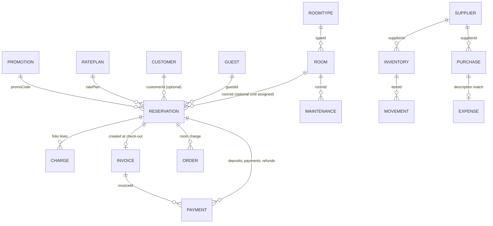
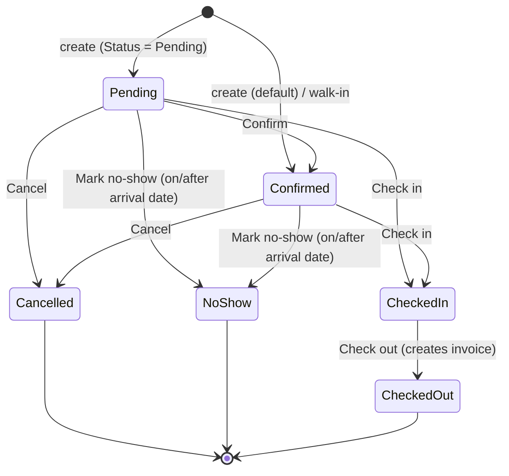
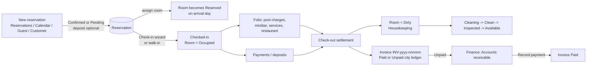
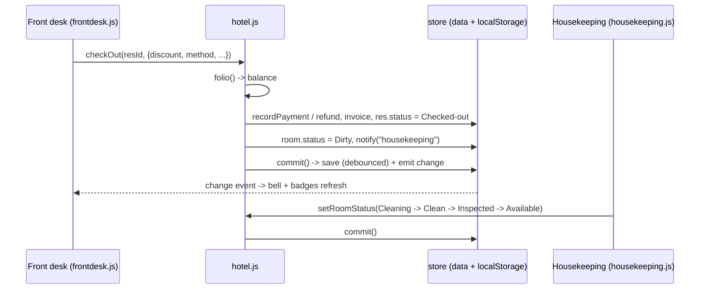

# Sunrise HMS - Hotel Management System: Project Guideline

Audience: end users (hotel staff), developers, QA engineers and business / product teams.

This guideline documents **what the code actually does** (HTML/CSS/JS in this folder). Nothing here is a wish list.
Where the code is silent, ambiguous or only partially implemented, the text is marked with one of these labels:

- **Assumption** - a reasonable reading of the code or of common hotel practice that is not proven by the code.
- **Unknown / not implemented** - something a reader might expect, but the code does not do it (or does it only cosmetically).
- **Observed behavior / quirk** - a real behavior of the current code that may surprise users or testers.

UI language is English. A few Vietnamese terms appear in the UI or data; the original term is kept in parentheses (see the glossary in section 1.9).

---

## Table of contents

1. [Project overview](#1-project-overview)
   1.1 Purpose and scope - 1.2 Tech stack - 1.3 File structure - 1.4 How to run - 1.5 Data storage and localStorage keys - 1.6 Seed / mock data - 1.7 Demo credentials - 1.8 Architecture in one page - 1.9 Glossary
2. [User guideline](#2-user-guideline)
   2.1 Roles and what they see - 2.2 Application shell (login, menu, top bar, search, shortcuts) - 2.3 Screen-by-screen reference - 2.4 Step-by-step task guides
3. [Business guideline](#3-business-guideline)
   3.1 Entities and relationships - 3.2 Statuses and state transitions - 3.3 Permissions per role - 3.4 Pricing and calculation formulas - 3.5 Validation catalogue - 3.6 Business scenarios
4. [Feature details](#4-feature-details)
5. [Key workflows and module relationships](#5-key-workflows-and-module-relationships)
6. [Known limitations and gaps](#6-known-limitations-and-gaps)
7. [QA test checklist](#7-qa-test-checklist)
8. [Appendix: message catalogue and constants](#8-appendix-message-catalogue-and-constants)

---

# 1. Project overview

## 1.1 Purpose and scope

Sunrise HMS is a **front-end-only demo** of a property management system for a fictional 4-star hotel, *Sunrise Da Nang Hotel* (268 Vo Nguyen Giap Street, Son Tra, Da Nang, Vietnam; legal entity "Sunrise Hospitality Joint Stock Company", tax code 0401856237). It simulates:

- Front office: reservations, calendar, arrivals/departures, in-house list, room board, an 8-step check-in wizard, check-out settlement, room transfer, stay extension, late check-out.
- Rooms division: room inventory, housekeeping cleaning cycle, maintenance tickets, lost and found.
- Revenue: guest folios, charges, minibar, services, restaurant POS, VAT invoices, payments, refunds, city ledger (bill to company), finance (AR/AP, expenses, cash, bank, VAT).
- Sales and people: guests, corporate/agency/OTA customers, promotions, staff.
- Purchasing: inventory, stock movements, suppliers, purchase orders.
- Insight: dashboard KPIs, five reports.
- Configuration: hotel data, rate plans, taxes, payment methods, users, notification and operations rules.

**It is not a production system.** There is no backend, no real authentication, no real payment, e-invoice, e-mail or VietQR integration (see section 6).

## 1.2 Tech stack

| Item | Detail |
|---|---|
| Markup | Single page `index.html` (HTML5). |
| Styling | 4 plain CSS files (design tokens, components, module screens/print, responsive). Light and dark theme through `data-theme` on `<html>`. |
| Scripting | Vanilla JavaScript (ES2018+ syntax), classic `<script>` tags (no modules, no bundler, no npm). All code shares one global namespace `window.HMS`. |
| Font | "Be Vietnam Pro" from Google Fonts (only external request; falls back to system font offline). |
| Charts | Hand-written inline SVG helpers in `utils.js` (`HMS.chart`: bar, line, donut, hbars). No chart library. |
| Persistence | Browser `localStorage`. |
| Server | None. |
| Routing | Hash router (`#/module/param`). |

## 1.3 File structure

```
hotel-management/
|-- index.html            Login screen + app shell + script includes (order matters)
|-- README.md             Short original readme
|-- GUIDELINE.md          This document
|-- css/
|   |-- style.css         Design tokens, layout, sidebar, top bar, login
|   |-- components.css    Buttons, forms, tables, modals, badges, toasts, tabs, charts
|   |-- dashboard.css     Module screens (dashboard, room board, housekeeping, POS, calendar, folio, invoice) and print rules
|   `-- responsive.css    Breakpoints (1400/1180/900/760/420 px), reduced-motion
`-- js/
    |-- utils.js          Formatting, dates (Vietnam time zone), CSV, icons, badge tones, UI kit (modal, form, dataTable, toast, confirm), charts
    |-- storage.js        HMS.store (localStorage persistence, ids, date shifting), HMS.bus (event bus), session and prefs
    |-- data.js           HMS.seed(): deterministic mock data generator, HMS.DATA_VERSION = 6
    |-- hotel.js          HMS.hotel (H): ALL business rules (availability, rates, promo, folio, reservation lifecycle, check-in/out, room status flow, KPIs, notifications)
    |-- app.js            Login, role map (ACCESS), sidebar, top bar, global search, notifications dropdown, router, keyboard shortcuts, boot
    |-- dashboard.js      Dashboard
    |-- frontdesk.js      Front Desk tabs, room board, check-in wizard, group check-in, assign room, check-out, transfer, extend, late check-out, notes
    |-- reservations.js   Reservation list, detail, create/modify form, cancel dialog
    |-- calendar.js       Room x date timeline with drag-and-drop
    |-- rooms.js          Room grid/list, room detail, add/edit/disable
    |-- guests.js         Guest directory and profile
    |-- housekeeping.js   Housekeeping board + lost and found; Maintenance module (both registered here)
    |-- billing.js        Folios, post charge, minibar, invoice view, fake QR
    |-- payments.js       Payment list, record payment, refund, confirm pending
    |-- services.js       Service catalogue and "post service to room"
    |-- restaurant.js     Restaurant POS (tables, orders, menu)
    |-- crm.js            Customers, Staff, Promotions (three modules)
    |-- inventory.js      Inventory + Suppliers (two modules)
    |-- reports.js        Reports (5 tabs) + Finance (7 tabs) (two modules)
    `-- settings.js       Settings (11 sections)
```

Script load order in `index.html`: `utils -> storage -> data -> hotel -> (modules) -> app`. `app.js` boots last.

## 1.4 How to run

1. Open `index.html` by double-clicking it (works from `file://`) or serve the folder with any static server.
2. Sign in with one of the demo accounts (section 1.7) - or click an account card on the login screen (this signs in immediately).
3. To start over: **Settings -> System -> Reset demo data**.

**Assumption:** `localStorage` under `file://` is available in the major browsers named in the README (Chrome, Edge, Firefox, Safari); behavior may differ per browser policy. If storage is blocked, the app shows the toast "Browser storage is unavailable. Changes will not be saved after reload." and works in memory only.

## 1.5 Data storage and localStorage keys

| Key | Content | Written by |
|---|---|---|
| `sunrise-hms-data` | The whole database as one JSON document (`version`, `anchorDate`, all collections, `counters`, `readNotifs`, optionally `permissions`). | `HMS.store.saveNow()` (debounced 250 ms after each `commit()`) |
| `sunrise-hms-session` | `{ username, at }` of the signed-in user. Password is not stored here. | login / logout |
| `sunrise-hms-prefs` | UI preferences: `theme`, `sideMini`, `navCollapsed` (collapsed menu groups), `branch`. | theme toggle, sidebar, branch select |

Store behavior (`storage.js`):

- **Load:** reads `sunrise-hms-data`. If JSON is valid **and** `version === HMS.DATA_VERSION (6)` it is used; otherwise (missing, corrupted, or different version) a **fresh seed** replaces it silently (**Observed behavior:** an upgrade of `DATA_VERSION` discards user-entered data).
- **Date anchoring ("dates shift forward"):** if the saved `anchorDate` is earlier than today (Vietnam time), *every* `YYYY-MM-DD...` string in the data is shifted forward by the number of elapsed days, except keys `dob`, `joined`, `contractEnd`, `month`. Result: the demo always has arrivals, departures and in-house guests "today". If the system date moves backwards (delta <= 0) nothing is shifted. **Observed behavior:** records you create are also shifted the next day, so the data is a rolling demo, not a historical ledger.
- **Ids:** `nextId(counter, prefix, pad)` increments `data.counters[counter]` and pads (e.g. `RSV-26001`, `G00271`, `PAY-50001`, `CHG000001`, `INV-2026-001201`).
- **Change event:** `commit()` saves (debounced) and emits `change`; `app.js` listens and re-renders the notification bell and sidebar badges.
- **Reset:** deletes data key, re-seeds, emits `change`. Session and prefs are kept (you stay signed in).
- **Export:** Settings -> System -> "Export all data (JSON)" downloads `sunrise-hms-backup-<date>.json`. **Unknown / not implemented:** there is no import/restore feature.

## 1.6 Seed / mock data (`data.js`)

Generated deterministically (seeded PRNG `20260928`) around "today":

| Collection | Seeded content |
|---|---|
| Hotel settings | Name, address, phone, tax code, check-in 14:00, check-out 12:00, VAT 10 %, service charge 0 %, invoice symbol `C26TSD`, bank Vietcombank Da Nang, all 6 payment methods on, all notification switches on except e-mail, `requireInspection: true`, `blockDirtyCheckin: true`, `allowOverbooking: false`, `autoLogout: 30`. |
| Branches | 4: BR01 Da Nang (120 rooms, Active), BR02 Hoi An (Active), BR03 Nha Trang (Active), BR04 Saigon Central (Opening Soon). Only names/metadata; there is one shared dataset. |
| Room types (7) | STS Standard Single 750,000; STD Standard Double 900,000; SUP Superior 1,100,000; DLX Deluxe 1,450,000; FAM Family 1,900,000; SUI Suite 2,800,000; PRE Presidential Suite 6,500,000 (VND / night). |
| Rate plans (6) | BAR 0 %; BB +200,000/night; NRF -10 %; CORP -15 %; LS -20 %; OTA +5 %. |
| Rooms | 120 rooms, 8 floors x 15. Rooms numbered `<floor><nn>`; positions 1-8 on each floor are "Ocean Wing / Sea view" (+100,000 over the type rate, except PRE), 9-15 "City Wing" (floor >= 5: "Han River view", else "City view"). Suites/Presidential have names (My Khe, Son Tra, ...). 10 rooms start blocked: 405, 212, 309, 511, 614, 107, 813 = Maintenance; 715, 213 = Out of Order; 110 = Out of Service. |
| Guests | 270 (4 fixed Vietnamese + generated; ~27 % foreign, Korea most frequent), ID types CCCD / Passport, some VIP, preferences, notes. |
| Customers | 12: 4 Corporate (FPT Software Da Nang, Viettel Da Nang, Samsung Electronics Vietnam, Vietnam Airlines), 3 Travel Agency, 4 Partner (Booking.com, Agoda, Expedia, Sun World Ba Na Hills), 1 Individual. Credit limits, terms (Net 15/30/45, Monthly commission, On departure), contract numbers, `contractEnd` `2026-12-31`. |
| Reservations | About 1,800 from 4 weeks ago to 5 weeks ahead, statuses assigned from the timeline; a 6-room group (rooms 301-306, `groupId GRP-FPT-01`, "FPT Software - Tech Summit") arriving today. |
| Charges / payments / invoices | Generated for checked-in and checked-out stays (restaurant, minibar, laundry, spa, transport, tours); deposits, settlements, some City Ledger (Pending) payments with unpaid invoices due in 30 days, a few refunds and pending bank transfers. |
| Housekeeping | Room statuses derived from the timeline (Occupied / Dirty / Cleaning / Clean / Inspected / Reserved / Available); attendants pre-assigned; notes on rooms 512 and 801. |
| Maintenance | 18 tickets `MT-1041...` (10 room tickets for the blocked rooms, elevator, pool pump, generator, kitchen hood, Wi-Fi, fire alarm, etc.). |
| Services | 21 catalogue items (transport, laundry, spa, room, F&B, leisure, tours, events). One is "Unavailable" (Meeting room - half day). |
| Restaurant | 27 menu items in 7 categories, 16 tables (Indoor 8 / Terrace 5 / Bar 3), 18 sample orders in mixed statuses. Two outlets: "Han River Kitchen", "Sky Lounge Bar". |
| Inventory | 35 items in 7 categories, minimum levels, several below minimum; 9 suppliers; purchase orders; stock movements. |
| Promotions | 9: EARLY30, LONGSTAY, WEEKEND10, WELCOME500, CORP15, SUMMER26 (expired), DIFF26 (expired), TET2027 (scheduled), HONEY. |
| Finance | Expenses (last ~35 days), 12-month history (occupancy, ADR, revenues, expenses) used by the Financial report and VAT tab. |
| Others | 28 staff, 6 lost-and-found items, 4 users, 3 log notifications. |

## 1.7 Demo credentials

Users are stored in plain text in the data (`users` collection) and the login screen lists them as clickable cards.

| Username | Password | Name | Role |
|---|---|---|---|
| `admin` | `admin123` | Le Thanh Hai | Administrator |
| `manager` | `manager123` | Nguyen Van An | Front Office Manager |
| `reception` | `reception123` | Pham Thu Trang | Receptionist |
| `housekeeping` | `house123` | Vo Thi Hoa | Housekeeper |

The role "General Manager" exists in the role list and in the access map, but **no demo user has it**; an admin can create one in Settings -> Users.

## 1.8 Architecture in one page

```
index.html
   |  loads (in order)
   v
utils.js  -> HMS.util (U), HMS.ui (UI), HMS.chart, HMS.icon
storage.js-> HMS.store (data + persistence), HMS.bus
data.js   -> HMS.seed()
hotel.js  -> HMS.hotel (H): every business rule + mutation API
modules   -> HMS.modules.<name> = { title, render(el, params), ...dialogs }
app.js    -> boot: store.load() -> theme -> session? start(user) : showLogin()
              router: location.hash -> HMS.modules[mod].render(view, params)
```

Design rules that matter to developers:

1. **All state is `HMS.store.data`.** Modules read it directly and mutate it either through `HMS.hotel` (preferred, enforces rules) or, for simple master data, directly followed by `HMS.store.commit()`.
2. **Business rules live in `hotel.js`.** UI modules catch thrown `Error`s and show `err.message` as a red toast (or inline `#rf-err` in the reservation form).
3. **Every module registers** `HMS.modules.<id> = { title, render }`. The router finds the module by the first hash segment. Route guard: `can(mod)` (role map in `app.js`).
4. **Views re-render**, not patch: after a change, `HMS.app.refresh()` re-runs the current module's `render`.
5. **Events:** only one bus event, `change`, emitted by `commit()`.

## 1.9 Glossary (English UI term with Vietnamese original where applicable)

| Term | Meaning |
|---|---|
| VND | Vietnamese dong; amounts are whole numbers, no decimals; displayed like `1,250,000 VND`. |
| MST (Ma so thue) | Tax code; validated as 10-14 characters of digits and hyphen. |
| VAT invoice / Red VAT invoice (Hoa don gia tri gia tang / hoa don do) | Invoice with company buyer details; the invoice screen shows "VAT INVOICE / Hoa don gia tri gia tang". |
| CCCD (Can cuoc cong dan) | Citizen ID card, default ID type. |
| City Ledger | Bill-to-company account (accounts receivable); a payment method available for Corporate / Travel Agency customers at check-out. |
| ADR | Average Daily Rate = room revenue / rooms sold. |
| RevPAR | Revenue per available room = room revenue / total rooms. |
| OOO / OOS | Out of Order / Out of Service. |
| OTA | Online travel agency (Booking.com, Agoda, Expedia). |
| Folio | The guest's running bill for a stay. |
| PCCC | Fire prevention (appears in a seeded maintenance note). |
| Form 01/GTGT | Monthly VAT declaration (mentioned in the Finance VAT tab hint). |
| Tieng Viet (Vietnamese UI) | Language switch exists but Vietnamese is **not implemented** ("coming in the next release"). |

---

# 2. User guideline

## 2.1 Roles and what they see

Access is decided by a hard-coded map in `app.js` (`ACCESS`). The role list appears in Settings, but the Settings -> Roles matrix is **not** what controls the menu (see 3.3).

| Module (menu item) | Administrator | General Manager | Front Office Manager | Receptionist | Housekeeper |
|---|:-:|:-:|:-:|:-:|:-:|
| Dashboard | Y | Y | Y | Y | Y |
| Front Desk | Y | Y | Y | Y | - |
| Reservations | Y | Y | Y | Y | - |
| Calendar | Y | Y | Y | Y | - |
| Rooms | Y | Y | Y | Y | Y |
| Guests | Y | Y | Y | Y | - |
| Housekeeping | Y | Y | Y | - | Y |
| Maintenance | Y | Y | Y | - | Y |
| Services | Y | Y | Y | Y | - |
| Restaurant | Y | Y | Y | Y | - |
| Billing | Y | Y | Y | Y | - |
| Payments | Y | Y | Y | Y | - |
| Finance | Y | Y | Y | - | - |
| Customers | Y | Y | Y | Y | - |
| Staff | Y | Y | Y | - | - |
| Promotions | Y | Y | Y | Y | - |
| Inventory | Y | Y | Y | - | Y |
| Suppliers | Y | Y | Y | - | - |
| Reports | Y | Y | Y | - | - |
| Settings | Y | Y | - | - | - |

If a user types a URL hash for a module they cannot open, the page shows "No access - Your role (X) cannot open Y. Ask an administrator for access." If the module id does not exist: "This page does not exist".

## 2.2 Application shell

### Login screen
- Fields: Username, Password. Button **Sign in**. Below: a card per user (click = sign in immediately).
- Errors: empty field -> "Enter your username and password." ; wrong credentials -> "Username or password is incorrect. Try one of the demo accounts."
- Session survives a page reload (session key). **Log out** is in the sidebar footer and in the user menu (top right).

### Sidebar (menu)
Groups: *Dashboard*, **Front office** (Front Desk, Reservations, Calendar, Rooms, Guests), **Rooms division** (Housekeeping, Maintenance), **Services & F&B** (Services, Restaurant), **Money** (Billing, Payments, Finance), **People & sales** (Customers, Staff, Promotions), **Purchasing** (Inventory, Suppliers), **Insights** (Reports), *Settings*. Only permitted items are shown; empty groups are hidden. Group headers collapse/expand (remembered). Live badges: Front Desk = arrivals still to check in today; Housekeeping = number of Dirty rooms; Inventory = items at or below minimum. A collapse button shrinks the sidebar (remembered on desktop); on narrow screens a hamburger opens a drawer and a bottom bar shows up to 4 quick links (Dashboard, Desk, Reservations, Calendar, Housekeeping, Rooms - whichever the role may open) plus "More".

### Top bar
| Control | Behavior |
|---|---|
| Branch select | Lists the 4 branches; non-Active ones are disabled "(opening soon)". Choosing one only changes the label and shows "Switched to X. Demo data is shared across branches." |
| Global search | Type >= 2 characters. Shows up to 5 Guests (name/phone/email/ID), last 5 Reservations (id, guest name, OTA reference) and up to 4 Rooms (number/name). Sections appear only if the role can open that module. Empty result: "No matches for ...". |
| Clock | Date and time in Asia/Ho_Chi_Minh, ticks every second. |
| Language EN/VI | Choosing VI shows "Tiếng Việt is coming in the next release. Showing English." and reverts. |
| Theme | Light/dark toggle, remembered; default follows the OS preference. |
| Notification bell | Red dot with unread count (9+ cap). Click an item = mark read and open its link. "Mark all as read". |
| User menu | My profile (if Staff allowed), Settings (if allowed), Keyboard shortcuts, Log out. |

### Keyboard shortcuts (not active while typing in a field or while a dialog is open)
| Key | Action |
|---|---|
| `/` | Focus global search |
| `N` | New reservation (only if role can open Reservations) |
| `C` | Open Calendar (only if role can open Calendar) |
| `Esc` | Close the top-most dialog |

### Common UI patterns
- **Data tables**: search box, dropdown filters, optional date range, click column header to sort, pagination (10/25/50/100 rows), **Export** button (opens "Export CSV" dialog with preview, *Copy to clipboard* and *Download CSV*).
- **Dialogs (modals)** stack; `Esc` or backdrop click closes. Forms use native browser validation (first invalid field is highlighted).
- **Toasts** (green success, yellow warn, blue info, red error) appear bottom of screen; errors stay longer (4.8 s vs 3.2 s).
- **KPI tiles** that have a link act as buttons.
- **Print**: folio, invoice, registration card and reports use the browser print dialog (only the top dialog is printed).

## 2.3 Screen-by-screen reference

### Dashboard (`#/dashboard`)
Greeting with hotel, date and guests in house. Buttons: *New reservation* (if allowed), *Walk-in check-in* (if allowed). Blocks: occupancy ring (tonight), ADR, RevPAR, rooms occupied, 7-night forecast; arrivals/departures/new bookings today; today's revenue vs yesterday; six room-status KPIs (Total, Available, Occupied, Reserved, Dirty/cleaning, Maintenance/OOO - each a link); revenue by day (14 days, stacked Rooms/F&B/Other); room status donut; occupancy trend (14 actual + 14 forecast); revenue by department; booking sources (30 days); "Arriving today" list (with *Check in*); "Departing today" list (with *Check out*); room type performance table (14 nights).

### Front Desk (`#/frontdesk[/arrivals|departures|inhouse|board]`)
Header buttons: *Walk-in guest*, *Quick check-out*, *Quick check-in*. Tabs:
- **Arrivals** - today's arrivals plus overdue arrivals (booked earlier, still Confirmed/Pending, not yet checked out). Columns: Guest, Room, Nights, Pax, ETA (or red "Due dd/mm/yyyy"), Source, Requests, Status, Deposit. Row actions: *Check in*, *Assign room* (when no room), *Group check-in* (group bookings), *Folio* (already checked in).
- **Departures** - today's departures (in-house or already checked out today) plus overdue in-house guests. Row actions: *Late check-out*, *Extend*, *Check out* (in-house) or *Invoice* (already out).
- **In-house** - all checked-in guests. Filters: room type, VIP. Actions: *Folio*, *Post charge*, "..." menu (Room transfer, Extend stay / change departure, Late check-out, Guest notes & requests, Open guest profile, Check out).
- **Room status board** - all rooms grouped by floor (top floor first), colored by status, filter chips per status. Click a tile for **Room actions** (see 4.9).

### Reservations (`#/reservations[/RSV-id]`)
KPIs: upcoming bookings, awaiting confirmation (Pending), booked in last 30 days (+room revenue), cancellation rate (30 days). Table with filters (Status, Source, Room type, Payment) and check-in date range. Actions: *Edit* (Pending/Confirmed only), *View* (detail dialog). Buttons *Calendar*, *New reservation*. A URL like `#/reservations/RSV-26010` opens that reservation's detail.

### Calendar (`#/calendar`)
Timeline rows = rooms, columns = days (7/14/21/30). Default start = today - 2 days, 14 days. Filters: room type, floor, booking status. Colors: Pending (orange), Confirmed (blue), Checked-in (violet), Checked-out (grey); hatched row = out of inventory. Header line shows "tonight X/Y sold" (includes confirmed/pending forecast). Warning strip lists bookings without a room in the window ("Assign room").
Interactions: click empty night = new reservation (2 nights) ; click a block = popup (Details, Transfer room, Extend stay); drag a block to another room/date = move (confirmation dialog first).

### Rooms (`#/rooms[/roomNo]`)
Type summary cards (first 4 types: occupied / total, from-rate, size). Grid or List view. List has filters (type, status, floor, wing). Click a room = detail dialog (rack rate, occupancy 30 days, last cleaned/attendant, amenities, current and upcoming bookings, recent stays, maintenance history, housekeeping note). Buttons (managers only): *Add room*, *Edit room*, *Disable/Enable room*. Everyone: *Room actions*.

### Guests (`#/guests[/G00001]`)
KPIs: profiles, in house now, VIP, repeat guests (>1 completed stay). Directory table. Profile page tabs: Personal information, Current reservation, Stay history, Payments, Requests, Notes (profile note + preference checkboxes). Buttons: *Mark/Remove VIP*, *Edit profile*, *New booking*.

### Housekeeping (`#/housekeeping[/lost]`)
Five status tiles (Dirty, Cleaning, Clean, Inspected, Maintenance/OOO; click to filter). Buttons: *Auto-assign rooms*, *Log lost item*. Tab **Cleaning board**: cards grouped by floor / attendant / priority / room; toggle "Include stay-over rooms". Card buttons: primary next step (Start cleaning -> Mark clean -> Pass inspection -> Release to sale), *Clean* (Dirty -> straight to Clean), *Fail - re-clean* (Clean/Inspected -> Dirty), *Assign*, note icon. Tab **Lost & found**.

### Maintenance (`#/maintenance`)
KPIs: open requests (+high priority), rooms out of inventory, waiting for parts, cost last 30 days. Table filters: status, priority, type, technician, reported date. Actions: *Complete*, edit. Button *New request*.

### Services (`#/services`)
KPIs and "Top services" chart (30 days), catalogue table (filters: category, availability), buttons *Post service to room*, *Add service*; row actions *Add to bill*, edit, delete.

### Restaurant (`#/restaurant[/floor|history|menu]`)
KPIs: open orders, covers today, sales today (net), charged to rooms today. Tabs: **Tables & open orders** (table map by area; click a free table = new order, busy table = open order), **Order history**, **Menu** (toggle sold out, edit, add item). *New order* opens the POS.

### Billing (`#/billing[/folios|invoices|charges]`)
KPIs: open folios, open balance (in-house), invoices issued today, unpaid company invoices. Tabs: **Open folios** (in-house), **Invoices** (all; "Overdue" tag when Unpaid and past due date), **Charge journal**.

### Payments (`#/payments`)
KPIs: received today, pending confirmation (bank transfers to verify), city ledger billed, refunds (30 days); "By method" bars (30 days). Table with filters (Status, Method, Type) and date range. Row actions: *Confirm received* (Pending, non-ledger), *Refund* (positive Paid payments). Button *Record payment*.

### Finance (`#/finance[/overview|receivable|payable|expenses|cash|bank|vat]`)
Seven tabs (see 4.16). Button *Add expense*.

### Customers, Staff, Promotions (`#/customers`, `#/staff`, `#/promotions`)
Master-data lists with KPIs. Add/Edit buttons only for Administrator, General Manager, Front Office Manager.

### Inventory and Suppliers (`#/inventory[/items|moves]`, `#/suppliers`)
Stock list with level bars, movements tab; suppliers list and purchase orders tab.

### Reports (`#/reports[/occupancy|revenue|guests|bookings|financial]`)
Date range (From/To, presets: Last 7 days, Last 30 days, This month, Next 14 days (forecast)), *Print*, *Export CSV*.

### Settings (`#/settings[/hotel|branches|roomtypes|rates|tax|payments|users|roles|notif|regional|system]`)
Eleven sections (see 4.18).

## 2.4 Step-by-step task guides

### 2.4.1 Create a reservation
1. Press `N`, or click **New reservation** (Reservations, Calendar, Dashboard), or click an empty night on the Calendar, or *New reservation* on a free room in the board's Room actions, or *New booking* on a guest profile / customer.
2. **Guest:** choose *Existing guest* and type a name or phone (pick from the list; the value must end in the guest id, or match the name exactly) **or** *New guest* and enter Full name + Phone (+ optional Email, Nationality).
3. **Stay:** Check-in (not in the past), Check-out (must be after check-in; auto-moves to check-in + 1 night if you set check-in on or after check-out), Room type, Room (optional - "Assign later (N free)" lists free rooms of that type for the dates), Adults (1-6), Children (0-4).
4. **Rate & source:** Rate plan, nightly rate (auto-fills from room/type and plan until you type your own), Booking source (choosing Corporate suggests plan CORP; Booking.com/Agoda/Expedia suggest plan OTA), Company/agency, Promotion code, Status (Confirmed or Pending).
5. **Deposit & requests:** optional deposit amount + method, ETA, OTA reference, special requests, internal notes.
6. Read the *estimated total (room only)* box (nights x rate + VAT - promotion). Click **Create reservation**. Errors appear in red under the form.

### 2.4.2 Modify, confirm, cancel, no-show
1. Reservations -> row **Edit** or open **View** -> *Modify*. Only Pending/Confirmed (and Checked-in with restrictions) can be edited. Check-in date and room are locked for a checked-in stay; use Room transfer.
2. *Confirm* (Pending only) changes status to Confirmed.
3. *Cancel booking* -> pick a reason; tick "Refund received deposit" (pre-ticked unless the plan is Non-refundable) -> **Cancel booking**. Refunds are issued for each paid deposit/payment.
4. *Mark no-show* (on or after the arrival date) -> confirm. The room is released; the deposit stays recorded (no automatic charge).

### 2.4.3 Assign or change a room
- Reservation without a room: Reservation detail / Arrivals row / Calendar warning -> **Assign room** -> click a room tile.
- Change before arrival: Modify -> Room dropdown; or drag the block on the Calendar; or *Transfer room*.

### 2.4.4 Check in an expected guest (8-step wizard)
1. Front Desk -> **Arrivals** -> **Check in** (or Dashboard "Arriving today", or Quick check-in and search).
2. Steps (progress bar shows 1-8): **Find booking** (only shown when started without a booking) -> **Guest** (add accompanying guests, one per line) -> **Verify details** (name, phone, ID number are required) -> **Room** (only clean, free rooms; you may change room type) -> **Rate** (plan, nightly rate - editable only by managers, adults, children, promotion code, requests) -> **Extras** (services posted to the folio) -> **Deposit** (amount, method, reference; QR block for QR/Bank Transfer) -> **Confirm** -> **Confirm check-in**.
3. Result screen shows a registration card (print it) and buttons *Open folio*, *Done*.

### 2.4.5 Walk-in guest
Front Desk -> **Walk-in guest**. Step 2 choose an existing guest (search >= 2 chars) or *New guest*. Choose room type, check-out date (default tomorrow), a clean free room, rate, etc. The system creates a reservation (source "Walk-in", status Confirmed) and checks it in.

### 2.4.6 Group check-in
Arrivals -> **Group check-in** on any row of a group. The dialog lists each room and whether it is Ready; rooms not clean are skipped. Confirm to check in all ready rooms (no deposit taken in this path).

### 2.4.7 Post charges during the stay
- Front Desk -> In-house -> **Post charge**, or Billing -> Open folios -> **Post charge**, or the folio dialog.
- Choose a catalogue service (optional) or type Category, Date (from arrival to today), Description, Quantity (>= 1), Unit price (>= 0). **Post to folio**.
- **Minibar** button in the folio: enter quantities per item; stock is deducted and a stock movement is logged.
- Services -> **Post service to room** posts a catalogue service to an in-house guest.
- Restaurant -> settle an order as *Charge to room* (see 2.4.13).
- Charges can only be posted to checked-in guests. A wrong charge can be voided (trash icon) while the guest is in house.

### 2.4.8 Take a payment or deposit
Payments -> **Record payment** (or the folio's *Record payment*): pick the reservation (Checked-in, Confirmed or Pending), Type (Payment/Deposit), Amount (min 1,000), Method, optional Reference (auto-generated if empty), Notes. Current balance is shown under the form.

### 2.4.9 Extend, shorten, late check-out
- **Extend**: In-house "..." -> Extend stay, or Departures -> *Extend*. Choose the new check-out date; the dialog shows extra nights x rate and whether the room is free.
- **Late check-out**: choose 14:00 / 16:00 / 18:00 and the fee (default 600,000 VND or the catalogue price). Approving posts a "Late check-out until HH:MM" charge (category Room) when the fee > 0.

### 2.4.10 Room transfer
"..." -> Room transfer (or Room actions -> Transfer, or drag on Calendar). Pick the new room (in-house guests only see clean rooms), keep the rate (default: complimentary) or untick to recalculate, choose reason. The old room becomes Dirty with High priority.

### 2.4.11 Check out and invoice
1. Front Desk -> Departures -> **Check out** (or Quick check-out, or Room actions).
2. Review the folio (room nights, categories, subtotal, service charge if any, VAT, discount, total, payments, balance or refund due). You can enter a **Discount**, **Post a charge**, choose **Settle balance by** a payment method (City Ledger appears only for Corporate/Travel Agency customers), enter a reference, and optionally open *Red VAT invoice (company)* to fill company name and tax code (MST).
3. Click **Settle & check out**. A payment (or refund if the guest overpaid) is recorded, an invoice `INV-<year>-<6 digits>` is created, the room becomes **Dirty**, and the invoice dialog opens (Email to guest [simulated], Download CSV, Print).
- Early departure (check-out before the booked date) shortens the stay to the nights actually used.

### 2.4.12 Housekeeping cycle
Room becomes Dirty after check-out -> supervisor **Auto-assign rooms** (or *Assign* per room) -> attendant **Start cleaning** (Cleaning) -> **Mark clean** (Clean) -> supervisor **Pass inspection** (Inspected) -> **Release to sale** (Available). With "Require inspection" turned off in Settings, a Clean room can be released directly. **Fail - re-clean** sends a Clean/Inspected room back to Dirty. Add notes with the note icon.

### 2.4.13 Restaurant order
1. Restaurant -> **New order** (or click a free table).
2. Pick Serve to = Table or Room service (in-house guests only), Outlet, Covers, tap menu items (sold-out items are disabled), adjust quantities with -/+.
3. **Send to kitchen** (status New). Open the order from the table map or list to move it: Mark preparing -> Mark ready -> Mark served -> **Settle bill**.
4. Settle by *Charge to room* (posts one "Restaurant" charge with the net amount to the chosen in-house folio) or by a payment method (records a payment of net + VAT with no reservation). Status becomes Paid.

### 2.4.14 Report a maintenance issue / take a room out of order
Maintenance -> **New request** (or Room actions -> "Report a maintenance issue"). Tick *Take room out of order until fixed* to set the room to Maintenance. **Complete** the ticket to send the room back to Dirty (High priority) for cleaning.

### 2.4.15 Stock and purchasing
Inventory -> *Stock movement* / row *Stock in* / *Stock out*. Suppliers -> *New purchase* (optionally receive stock into an item) -> the PO appears in Accounts payable; **Pay** on the PO tab records a supplier payment.

### 2.4.16 Reports and exports
Reports -> choose a tab and range (max 120 days) -> *Export CSV* (Copy or Download) or *Print*. Any data table has its own *Export*.

### 2.4.17 Reset / back up
Settings -> System -> **Export all data (JSON)** for a backup; **Reset demo data** (confirm) to reseed.

---

# 3. Business guideline

## 3.1 Entities and relationships

### 3.1.1 Entity summary

| Entity (collection) | Key / id format | Main fields | Relations |
|---|---|---|---|
| **settings** | single object | hotelName, legalName, address, phone, hotline, email, website, taxId, stars, checkInTime, checkOutTime, currency, country, timezone, language, dateFormat, timeFormat, vatRate, serviceCharge, invoiceSymbol, bankName, bankAccount, bankHolder, paymentMethods{}, notif{}, requireInspection, blockDirtyCheckin, allowOverbooking, autoLogout | Used by folio math, invoices, payment method lists, notification rules. |
| **branches** | `BR01` | name, city, address, rooms, phone, manager, status | Informational only. |
| **roomTypes** | `STS/STD/SUP/DLX/FAM/SUI/PRE` | name, bed, capacity, rate, size, amenities[] | 1-N rooms; reservation.roomTypeId; promotion.roomTypes[]. |
| **ratePlans** | `BAR/BB/NRF/CORP/LS/OTA` | name, adjust (`pct`/`add`), value, desc, active | reservation.ratePlan. |
| **rooms** | id = room number (e.g. `301`) | number, typeId, floor, building (wing), view, bed, capacity, rate (rack), name, amenities[], status, smoking, disabled, attendant, hkPriority, hkNote, lastCleaned, hkStarted, inspectedBy | N-1 roomType; 1-N reservations. |
| **guests** | `G00001` | name, gender, nationality, dob, phone, email, address, idType (CCCD/Passport/Driving licence), idNumber, vip, type (Individual/Couple/Family/Corporate/Group), preferences[], notes, company, createdAt | 1-N reservations, payments. |
| **customers** | `CUS001` | name, type (Corporate/Travel Agency/Partner/Individual), contact, address, taxId, creditLimit, terms, phone, email, contract, contractEnd, status, notes | reservation.customerId; invoice.customerId. |
| **reservations** | `RSV-26001` | guestId, roomId ('' = unassigned), roomTypeId, checkIn, checkOut, adults, children, source, ratePlan, rate (per night), status, customerId, specialRequests, notes, discount (VND, absolute), promoCode, createdAt, createdBy, groupId, groupName, otaRef, eta, extraGuests, checkedInAt/By, checkedOutAt, originalCheckOut, lateCheckout, transfers[{from,to,at,reason}], cancelReason, cancelledAt, updatedAt | N-1 guest, room, customer; 1-N charges, payments; 1-0..1 invoice. |
| **charges** | `CHG000001` | reservationId, date, time, category, description, qty, unitPrice, amount, postedBy | N-1 reservation (folio lines). |
| **payments** | `PAY-50001` | reservationId ('' for outlet sales / AR settlements), invoiceId, guestId, amount (negative = refund), method, date, reference, status, type (Payment/Deposit/Refund), notes, cashier, refundOf, confirmedBy | N-1 reservation, invoice. |
| **invoices** | `INV-2026-001201` | reservationId, guestId, customerId, date, nights, total, subtotal, status (Paid/Unpaid), buyerCompany, buyerTaxId, dueDate, issuedBy | 1-1 reservation (created at check-out). |
| **maintenance** | `MT-1041` | roomId ('' = not room-specific), type (Room/Equipment/Preventive), title, priority, status, technician, cost, notes, reportedBy, reportedAt, dueDate, outOfOrder, completedAt | N-1 room. |
| **services** | `SVC001` | name, category, price, unit, availability (Available/On request/Unavailable), description, tax | Posted as charges (copied, not linked). |
| **menu / tables / orders** | `MNU001` / `T01` / `ORD-8801` | menu: name, category, price (net), available. tables: name, area, seats. orders: tableId, roomId, reservationId, items[{menuId,name,price,qty}], status, createdAt, waiter, payment, total (net), outlet, guests, chargeId, paidAt | order -> reservation (room charge). |
| **inventory / movements** | `SKU1001` / `MV00001` | inventory: name, category, unit, stock, min, cost, location, supplierId. movement: itemId, type (Stock in/out/Transfer/Adjustment), qty, date, note, by | item -> supplier. |
| **suppliers / purchases** | `SUP001` / `PO-3301` | supplier: name, contact, address, taxId, products, category, phone, email, terms, status. PO: supplierId, date, amount, paid, status, dueDate, items | PO -> supplier; PO <-> expense (matched by description ending with PO id). |
| **promotions** | `PRM001` | name, code, type, discountType (percent/fixed), value, start, end, roomTypes[], minNights, maxDiscount, description, enabled, uses | Referenced by reservation.promoCode. |
| **expenses** | `EXP-7001` | date, category, description, amount, method, supplierId, status (Paid/Pending) | Finance. |
| **history** | one per past month | month, occupancy, roomNights, adr, roomRevenue, fnbRevenue, otherRevenue, expenses | Financial report and VAT tab (static seed). |
| **staff** | `EMP101` | name, department, position, role, shift, phone, email, status (Active/On Leave/Inactive), joined, salary | Housekeeping attendants and technicians are derived from Staff by department. |
| **users** | keyed by username | username, password (plain), name, role, email | Login. |
| **lostFound** | `LF-201` | location, item, status (Found/Stored/Returned/Discarded), foundBy, date, notes | Housekeeping. |
| **notifications / readNotifs** | `N1..` | type, text, time, link, read | Bell menu (log kept to the latest 40). |
| **permissions** | optional | role -> module -> {view, edit, del} | Created on first open of Settings -> Roles; **not enforced**. |
| **counters** | object | sequence counters | Id generation. |

### 3.1.2 Relationship diagram



## 3.2 Statuses and state transitions

### 3.2.1 Reservation status

Statuses: `Pending`, `Confirmed`, `Checked-in`, `Checked-out`, `Cancelled`, `No-show`.



| From | To | Trigger | Rule (code) |
|---|---|---|---|
| Pending | Confirmed | *Confirm* button | `setReservationStatus`; allowed map `Confirmed: ['Pending']`. |
| Pending / Confirmed | Cancelled | *Cancel booking* | Stores `cancelReason` (default "Cancelled by front desk"), `cancelledAt`. |
| Pending / Confirmed | No-show | *Mark no-show* | Error if `checkIn > today`: "No-show can only be recorded on or after the arrival date." |
| Pending / Confirmed | Checked-in | Check-in wizard / group check-in | `H.checkIn` (see 4.7). |
| Checked-in | Checked-out | Check-out | `H.checkOut`. |
| Any other pair | - | - | "Cannot change a X reservation to Y." |

Editing rules: Checked-out, Cancelled and No-show reservations cannot be edited ("A checked-out reservation cannot be edited." - status in lower case). Cancelled and No-show reservations no longer hold inventory (`holds()` excludes them from conflict checks).

**Observed behavior:** the allowed map also contains `Pending: ['Confirmed']` (Confirmed -> Pending) but no UI exposes it.

### 3.2.2 Room status

Statuses (10): `Available`, `Reserved`, `Occupied`, `Dirty`, `Cleaning`, `Clean`, `Inspected`, `Maintenance`, `Out of Order`, `Out of Service`.
Groups: **BLOCKED** = Maintenance, Out of Order, Out of Service (cannot be sold). **READY** (can receive a guest now) = Available, Inspected, Reserved, Clean. A room with `disabled = true` is also treated as blocked.

Manual transition table (`FLOW` in `hotel.js`; used by Room actions "Change status" and Housekeeping buttons):

| Current | Allowed next |
|---|---|
| Dirty | Cleaning, Maintenance, Out of Order |
| Cleaning | Clean, Dirty |
| Clean | Inspected, Available (**removed** when Settings "Require inspection" is ON), Dirty |
| Inspected | Available, Dirty |
| Available | Dirty, Maintenance, Out of Order, Out of Service |
| Reserved | Dirty, Maintenance |
| Occupied | (none - check the guest out) |
| Maintenance / Out of Order / Out of Service | Dirty |

Automatic transitions:

| Event | Effect on room |
|---|---|
| Reservation with a room arrives today and room is Available/Inspected (create, update, assign, cancel, transfer, release) | -> **Reserved** (`syncArrivalStatus`) |
| No arrival today and room is Reserved with no occupant | -> **Available** |
| Check-in | -> **Occupied** |
| Check-out | -> **Dirty**, attendant cleared, `hkPriority` High if another arrival is today else Normal |
| Room transfer (in-house) | Old room -> **Dirty** + High priority; new room -> **Occupied** |
| Maintenance ticket "Complete" (room in blocked status and no other open out-of-order ticket for that room) | -> **Dirty**, High priority, notification |
| Maintenance ticket saved with "Take room out of order" | -> **Maintenance** (forced unless the room has an arrival today) |
| Status set to Cleaning | `hkStarted` timestamp |
| Status set to Clean or Inspected | `lastCleaned` timestamp; Inspected also stores `inspectedBy` |
| Status set to Available or Inspected | `hkPriority` -> Normal (Available also clears attendant) and arrival sync |

Guards in `setRoomStatus`: Occupied -> "Room X is occupied. Check the guest out first."; illegal jump -> specific messages (see 4.9); moving to a BLOCKED status when an arrival is due today -> "Room X has an arrival today (RSV-...). Move it first."

### 3.2.3 Other status sets

| Object | Statuses | Transition notes |
|---|---|---|
| Payment | `Paid`, `Pending`, `Refunded`, `Partially Paid` (filter only) | Pending -> Paid via *Confirm received* (payments page) / *Match statement* (finance bank tab) / AR settlement for City Ledger. Original payment becomes Refunded once fully refunded. Refund rows have status Refunded and negative amount. "Partially Paid" is offered as a filter but no code sets it on a payment. |
| Payment status of a reservation (derived) | `Paid`, `Partially Paid`, `Unpaid`, `City Ledger`, `Refunded`, `-` | See 3.4.7. |
| Invoice | `Paid`, `Unpaid` | Unpaid only when settled by City Ledger with balance > 0; becomes Paid via Finance -> AR -> *Record payment*. "Overdue" is a display tag (Unpaid and due date < today). |
| Maintenance | `Open`, `Assigned`, `In Progress`, `Waiting Parts`, `Completed`, `Cancelled` | Saving with a technician while Open auto-sets Assigned. |
| Restaurant order | `New` -> `Preparing` -> `Ready` -> `Served` -> `Paid`; `Cancelled` | Active = New/Preparing/Ready/Served. Cancel available on any active order (no confirmation). |
| Promotion (derived) | `Paused` (enabled = false), `Expired` (end < today), `Scheduled` (start > today), `Active` | Evaluated in that order. |
| Inventory level (derived) | `Out of stock` (<= 0), `Low stock` (<= min), `In stock` | |
| Purchase order | `Unpaid`, `Partially Paid`, `Paid` | By amount paid. |
| Expense | `Paid`, `Pending` | |
| Lost & found | `Found`, `Stored`, `Returned`, `Discarded` | UI actions: Found/Stored -> Stored or Returned. Discarded exists in data/filter but no UI action sets it. |
| Staff | `Active`, `On Leave`, `Inactive` | |
| Branch | `Active`, `Opening soon`/`Opening Soon`, `Inactive` | Only Active branches selectable. |
| Service availability | `Available`, `On request`, `Unavailable` | Unavailable hidden from posting dialogs. |
| Menu item | Available / Unavailable (sold out) | Sold-out items are disabled in POS. |

## 3.3 Permissions per role

### 3.3.1 What is really enforced

1. **Menu / route access** - the `ACCESS` map (table in 2.1). Enforced when the route is opened.
2. **In-module role checks (hard-coded)**:

| Rule | Roles allowed |
|---|---|
| Add / Edit / Disable room | Administrator, General Manager, Front Office Manager |
| Add / edit customers, staff, promotions (incl. pause/enable) | Administrator, General Manager, Front Office Manager |
| Override nightly rate in the check-in wizard (field read-only otherwise) | Administrator, General Manager, Front Office Manager |
| Inventory add/edit/stock movement buttons | Everyone except Receptionist (a Receptionist cannot open Inventory anyway) |
| Front-desk actions in room dialogs (folio, transfer, extend, check-out, check-in) | Only if role can open Front Desk |
| New reservation from a room dialog | Only if role can open Reservations |
| "Report a maintenance issue" from a room dialog | Only if role can open Maintenance (so not Receptionist) |
| Change own role in Settings -> Users | Blocked: "You cannot change your own role." |
| Reset demo data / export / all Settings | Only roles that can open Settings (Administrator, General Manager) |

3. **Everything else has no role check.** Examples: the reservation form's nightly-rate field is editable by any role that can open Reservations; any role that can open Billing can void charges and apply discounts; any role that can open Housekeeping (incl. Housekeeper) can pass inspection and release rooms; Payments refunds are not role restricted.

### 3.3.2 What is not enforced

- **Settings -> Roles & permissions** matrix (view / create-edit / delete per module per role) is stored in `data.permissions` for reference only. The UI itself says: "In this demo, sidebar access follows the built-in role map; the matrix is stored for reference." Administrator column is locked (all checked).
- Users list has no delete; passwords are plain text; no lock-out; **`autoLogout` (30) is stored but never used**.

## 3.4 Pricing and calculation formulas

All money is integer VND. Dates are `YYYY-MM-DD` strings in Vietnam time.

### 3.4.1 Nights
- `H.nights(ci, co) = max(0, co - ci)` in days.
- Folio uses `max(1, nights)` (a same-day stay is charged 1 night).

### 3.4.2 Nightly rate (`H.rateFor(typeId, planId, roomId)`)
```
base  = room.rate            (if a room is chosen)  else  roomType.rate
plan.adjust = 'add'  ->  rate = base + plan.value
plan.adjust = 'pct'  ->  rate = round(base * (1 + plan.value/100), 10,000)   // nearest 10,000
```
Examples from seed: Deluxe sea-view room 1,550,000 (1,450,000 + 100,000). BAR = 1,550,000; BB = 1,750,000; NRF = 1,395,000 -> rounded 1,400,000; CORP -15 % = 1,317,500 -> 1,320,000; OTA +5 % = 1,627,500 -> 1,630,000.
The rate is copied into `reservation.rate` at booking time; later changes to room type, rack rate or plan do **not** change existing reservations.

### 3.4.3 Promotion (`H.applyPromo(code, {typeId, nights, roomCharge})`)
Checks, in this order (first failure returns the message):
1. Code exists (case-insensitive) - "Promotion code X does not exist."
2. Status must be Active - "`CODE` is paused|expired|scheduled." (status lower-cased)
3. Room type in `promo.roomTypes` if the list is not empty - "`CODE` is not valid for <room type>."
4. `nights >= minNights` - "`CODE` requires at least N nights."
Amount: `percent -> roomCharge * value / 100`; `fixed -> value`; then `min(amount, maxDiscount)` when `maxDiscount` is non-zero; then rounded to the nearest 1,000. The discount is applied on the **room charge only**, stored as an absolute VND `reservation.discount`.
Not checked by code: booking-window conditions ("book 30 days before arrival"), weekend nights, "returning guests only", usage counters. These appear only as free-text description.

### 3.4.4 Folio (`H.folio(reservation, {checkOut, discount})`)
```
nights      = max(1, checkOut - checkIn)
roomCharge  = rate * nights
extras      = sum(charge.amount)                       (all charges of the reservation)
subtotal    = roomCharge + extras
service     = round(subtotal * settings.serviceCharge / 100)          // default 0 %
vat         = round((subtotal + service) * settings.vatRate / 100)    // default 10 %
discount    = round(reservation.discount)             // or override passed in check-out dialog
total       = subtotal + service + vat - discount
paid        = sum(non-City-Ledger payments that are not Pending)      // refunds are negative and reduce it
ledger      = sum(City-Ledger payments)                               // counted even though status is Pending
deposit     = sum(payments of type Deposit, non-pending or ledger)
balance     = total - paid - ledger
```
Notes: VAT is calculated **before** the discount (so the discount reduces the VAT-inclusive total). Pending non-ledger payments (e.g. unconfirmed bank transfers) are **not** counted in `paid`. Per-service `tax` values on the catalogue are not used - one VAT rate applies to the entire folio. If `balance < 0` the guest is owed a refund.

### 3.4.5 Charge amount
`amount = round(qty * unitPrice)`; qty > 0 and unitPrice >= 0 required.

### 3.4.6 Checkout settlement
```
if checkOut > today:  originalCheckOut = checkOut ; checkOut = checkIn + max(1, nights(checkIn, today))   // early departure
if discount given:    reservation.discount = max(0, discount)
if reservation.discount > folio.subtotal:  error "Discount cannot exceed the subtotal."
balance > 0  -> Payment  (amount = balance, chosen method, note "Settlement at check-out")
balance < 0  -> Refund   (amount = balance [negative], chosen method, status Refunded, note "Deposit refund at check-out")
invoice.status = 'Unpaid' if method == 'City Ledger' and balance > 0, else 'Paid'
invoice.dueDate = today + 30 for City Ledger, else today
```
A stay past its booked check-out date (overstay) is **not** extended automatically: no extra nights are charged.

### 3.4.7 Payment status of a reservation (derived, `H.paymentStatus`)
| Condition | Result |
|---|---|
| Reservation Cancelled/No-show and any negative payment exists | `Refunded` |
| Cancelled/No-show otherwise | `-` |
| balance <= 0 and ledger > 0 | `City Ledger` |
| balance <= 0 | `Paid` |
| balance > 0 and paid > 0 | `Partially Paid` |
| balance > 0 and paid = 0 | `Unpaid` |

### 3.4.8 Refund (`H.refund(paymentId, amount, reason)`)
Only positive payments. `already refunded = -(sum of refunds with refundOf = payment.id)`. Amount must be > 0 and <= `payment.amount - alreadyRefunded`, otherwise "Refund must be between 1 and <max> VND." A refund row is created (type Refund, status Refunded, same method, `refundOf`). When cumulative refunds reach the payment amount, the original payment becomes `Refunded`. The payments-page dialog additionally enforces min 1,000 and max = payment amount in the input.

### 3.4.9 KPIs
| KPI | Formula |
|---|---|
| Total rooms | rooms where `disabled` is false |
| Occupied | rooms with status Occupied |
| Occupancy % (dashboard ring) | occupied / total x 100 |
| Available | status in Available, Inspected, Clean |
| Reserved | status Reserved |
| Dirty / cleaning | status Dirty or Cleaning |
| Maintenance / OOO | status in BLOCKED |
| Night stats (`nightStats(d)`) | reservations with `checkIn <= d < checkOut` and status Checked-in/Checked-out (plus Confirmed/Pending when "forecast"); `sold` = count; `revenue` = sum of `rate` |
| ADR | night revenue / sold |
| RevPAR | night revenue / total rooms |
| Revenue of a day (`revenueOn`) | Rooms = night revenue (at reservation rate, ex-VAT). F&B = charges dated that day with category Restaurant/Minibar/F&B + Paid restaurant orders with no reservation paid that day (net total). Other = all other charges dated that day. |
| Arrivals today | reservations with `checkIn = today` and status Pending/Confirmed/Checked-in (Checked-in only if actually checked in today) |
| Departures today | `checkOut = today` and status Checked-in, or Checked-out today |
| Bookings today | reservations created today |
| In-house guests | sum(adults + children) of Checked-in |
| Reservation "Room total" column | rate x nights |

### 3.4.10 Other calculations
- Restaurant: order `total = sum(price x qty)` (net). VAT shown = `net x vatRate`. Bill = `net x (1 + vatRate)`.
- Inventory: stock value = sum(stock x cost); default minibar sell price = mapped price, else `cost x 3`.
- Purchase order due date = PO date + days in supplier terms (`Net 15/30/45` -> 15/30/45; `COD` -> 0; default 30).
- Finance: month-to-date revenue = sum of `revenueOn` each day; output VAT (MTD) = revenue x VAT rate; VAT tab uses fixed 10 % and assumes 45 % of expenses carry deductible VAT; MTD input VAT = expenses in Purchases/Utilities/Maintenance/Marketing divided by 11.
- AR ageing buckets: Current (due date not passed), 1-30, 31-60, 60+ days past due.
- Cash drawer: opening float fixed at 10,000,000 VND; expected = float + cash received - (cash refunds + cash expenses that day).

## 3.5 Validation catalogue (summary)

Full message text is in section 8. Key rules:

| Area | Rule |
|---|---|
| Reservation | Guest required; both dates required; check-out after check-in; check-in not in the past (except already checked-in); adults >= 1; room must exist, match room type, not be blocked/disabled, not be occupied through the stay, not overlap another active booking; adults <= capacity + 1 (one extra bed). |
| Availability | Two active bookings (any status except Cancelled/No-show) cannot overlap on the same room. Overlap test is `newIn < otherOut AND otherIn < newOut` (same-day turnover allowed). `allowOverbooking` setting is not used. |
| Check-in | Status must be Confirmed/Pending; arrival date not in the future; room assigned, not blocked, not occupied, clean if "Block check-in to rooms that are not clean" is ON, no conflicting booking. |
| Charges | Only for Checked-in reservations. |
| Payments | Non-zero amount (form min 1,000). |
| Guest | Name required; phone pattern `+?[0-9 ]{9,18}` in the guest form; ID number 6-15 alphanumeric; duplicate ID number rejected in the guest form. |
| Room | Number `[0-9]{3,4}[A-Za-z]?`, unique, floor 1-40, capacity 1-8, rack rate >= 100,000. |
| Promotion | Code `[A-Za-z0-9]{3,15}` unique, end >= start, percent <= 90, value >= 1. |
| Users | Username `[a-z0-9._]{3,20}` unique; password >= 6 chars (required on create); e-mail required. |
| Tax codes | `[0-9\-]{10,14}`. |
| Inventory | Stock movement quantity rules (no negative stock). |
| Reports | Range <= 120 days. |

## 3.6 Important business scenarios

| # | Scenario | System behavior |
|---|---|---|
| S1 | Same-day turnover (guest A leaves 12/05, guest B arrives 12/05, same room) | Allowed by the overlap test. B can be checked in only after A is checked out and the room is cleaned (`Occupied` blocks; `Dirty` blocks when clean check-in is required). |
| S2 | Guest arrives early | Check-in of a future-dated booking is refused: "Arrival is on dd/mm/yyyy. Modify the dates to check in early." The wizard pre-selects the *Early check-in* fee when the time is before 11:00. |
| S3 | Guest arrives late (booking date already passed) | Still listed in Arrivals as "Due dd/mm/yyyy"; check-in sets `checkIn` to today. |
| S4 | Guest leaves early | At check-out the stay is shortened to the nights actually used (`originalCheckOut` kept); room charge recalculated. |
| S5 | Guest stays longer | Use *Extend*. Refused if the same room is booked from the current check-out: "Room X is booked from dd/mm/yyyy (RSV-...). Transfer the guest to extend." |
| S6 | Room breaks while occupied | Transfer the guest (clean target room required). Maintenance form refuses to take an occupied room out of order. |
| S7 | Prepaid / deposit | Deposit is stored as a payment of type Deposit; it reduces the balance. At check-out the balance is settled or refunded. |
| S8 | Company pays (city ledger) | At check-out choose *City Ledger* (only for Corporate/Travel Agency customers): a Pending ledger payment is recorded, invoice = Unpaid, due in 30 days; Finance -> AR -> *Record payment* settles it. Credit limit is displayed but not enforced. |
| S9 | Cancellation with deposit | Cancel dialog offers a full refund of each paid payment; pre-ticked unless plan is Non-refundable (NRF). The "free cancellation up to 48 hours" policy text of BAR is not enforced by code. |
| S10 | No-show | Allowed on/after arrival date; room released; deposit is kept as recorded (dialog text: "Deposit is retained per policy"). |
| S11 | Group booking | Seeded group (rooms 301-306) shares `groupId`; *Group check-in* checks in only rooms that are ready; master-bill to the company is described in the dialog but each room has its own folio. |
| S12 | OTA booking | Source Booking.com/Agoda/Expedia is linked to the partner customer; suggested plan OTA (+5 %). |
| S13 | Maintenance lifecycle | Ticket with "out of order" blocks the room from sale and from the calendar; completing sends the room to Dirty/High. |
| S14 | Minibar consumption | Posts a Minibar charge and reduces stock (never below 0) with a "Stock out" movement. |
| S15 | Restaurant charge to room | One charge (net) is added to the folio; VAT is then applied at folio level. Charge id is stored in the order. |

---

# 4. Feature details

Each feature lists inputs, outputs, rules, error messages and edge cases. Messages are quoted from the code.

## 4.1 Authentication and session
- **Inputs:** username, password. **Output:** session stored; app shown; hash forced to `#/dashboard` if empty/not a route hash.
- **Rules:** match on exact username + password against `data.users`. Session key holds only the username. On load, if the session username no longer exists, the login screen is shown.
- **Errors:** "Enter your username and password." / "Username or password is incorrect. Try one of the demo accounts."
- **Edge cases:** clicking a demo card bypasses typing. Logout closes dialogs, clears session, resets hash. No idle timeout. Resetting demo data keeps the session (user record re-seeded; if you changed your own password in Users it reverts, but you stay signed in).

## 4.2 Navigation, search, notifications
- **Router:** parts of `location.hash` split by `/`. Unknown module -> "Page not found - This page does not exist"; blocked module -> "No access". Render errors are caught: "Something went wrong loading this page".
- **Notifications:** combination of the stored log (`data.notifications`, max 40, newest first) and live items computed from state (subject to `settings.notif` switches):
  - Arrivals: "N guests arriving today" (link Front Desk), "N check-outs due by <checkOutTime>".
  - Housekeeping: up to 3 Dirty High-priority rooms "Room X needs cleaning before today's arrival".
  - Maintenance: up to 2 blocked rooms "Room X is maintenance|out of order|out of service".
  - Inventory: up to 3 low-stock items "Low inventory: NAME (N unit left)".
  - Payments: "N company invoices are overdue".
  - Log entries of type `reservation` are hidden if the reservations switch is off.
  Read state is stored per id in `readNotifs`. Live item ids are stable (e.g. `live-arr`), so once marked read they stay read.
- **Global search:** described in 2.2. Reservation search matches id, guest name, OTA ref.

## 4.3 Reservations (create / modify / list)
- **Inputs:** see 2.4.1. Guest via existing (datalist) or new (name+phone). Adults 1-6, children 0-4 (form limits).
- **Output:** reservation with id `RSV-<26000+n>`; optional deposit payment (`type Deposit`, note "Deposit at booking", status Paid, auto reference by method); notification "New reservation RSV-... for NAME (source)"; toast "Reservation X created for NAME · room N".
- **Rules:**
  - Rate auto-fills from `rateFor` until the user edits it; changing room type or rate plan re-enables auto-fill; source Corporate / OTA sources pre-select plans CORP / OTA when the rate was not touched.
  - Room list = `availableRooms(ci, co, type)` (not blocked, no overlap); a saved room that is no longer free is cleared.
  - Promotion is re-evaluated when saving; failure blocks saving with the promo message.
  - `discount` saved = promo amount (absolute).
  - Status choices: Confirmed / Pending.
  - Modify of a Checked-in stay: check-in date read-only, status disabled, room locked to current.
- **Errors (inline red text `#rf-err` or field validation):** "Select a guest from the list, or switch to New guest." / "Enter the new guest’s name and phone." / "Enter a valid phone number, e.g. 0905 123 456." / promo errors / all messages from `validateReservation` (section 8) / "Check-out date must be after the check-in date." in the summary box.
- **Edge cases:**
  - **Observed behavior:** saving a modification recomputes `discount` from the promotion field; a manual discount applied earlier in the folio is overwritten (set to 0 if no valid promo).
  - Deposit is not available on Modify (only on create).
  - Walk-in source is not offered as a booking *with a future date* in the seed logic, but the manual form does not block it.
  - A room type change in the form does not auto-reprice unless the rate field was untouched.
- **List:** newest first by default sort `checkIn` descending; columns Booking, Guest, Check-in, Check-out, Nights, Room ("Unassigned" tag), Source, Room total, Payment, Status. Export includes computed columns.

## 4.4 Reservation detail
Shows guest, status and payment badges, stay, room, pax, rate and plan, source, group, ETA, requests, notes, cancel reason, mini-folio (room, extras, VAT, discount, total, paid, balance), timeline (created, checked in, transfers, checked out, cancelled). Buttons depend on status:
- Pending/Confirmed: Modify; Assign room (no room); Confirm (Pending); Check in (`checkIn <= today` and role can Front Desk); Mark no-show (`checkIn <= today`); Cancel booking.
- Checked-in: Room transfer, Extend stay, Check out.
- Always: Open full folio.

## 4.5 Calendar
- **Rules:** shows reservations with a room and status not Cancelled/No-show that overlap the window; blocks are draggable for Pending/Confirmed/Checked-in. Block edges are placed at half-day offsets (arrival midday to departure midday). Colored drop targets: green = allowed, red = not allowed.
- **Drop validity:** target start must be today or later (or the stay is Checked-in) and the target room must be free (`isFree`: not blocked, no conflict) for the same number of nights. Checked-in stays keep the arrival date (row change only).
- **On drop:** confirmation "Move reservation? ... Move <id> (<guest>) to room N, dd/mm -> dd/mm?" (adds "Room type changes to X; rate will be recalculated" or "rate is kept (complimentary)" for checked-in). Then `moveReservation`.
- **Errors:** "Past nights cannot be booked." ; "Room X is <status> and cannot be reserved." ; "In-house stays can only change room, not arrival date." ; "<status> reservations cannot be moved." ; overlap messages from validation/transfer ("Room X is already booked ..." / "Room X is booked by RSV-... (..)").
- **Edge cases:** clicking an occupied cell does nothing (no message). Filters do not persist across sessions (module state only). Past window days show existing history normally.

## 4.6 Front Desk lists
- **Arrivals rows:** today's arrivals (Pending/Confirmed/Checked-in-today) + earlier bookings still Confirmed/Pending whose `checkOut > today`. Default sort by ETA. Deposit column = folio `paid` (not deposit type only).
- **Departures rows:** as in 2.3; default sort by room.
- **Tabs update the URL** with `history.replaceState` (`#/frontdesk/<tab>`) without triggering navigation.
- **Quick check-out:** search by room number or guest name (max 30 shown), then the check-out dialog.

## 4.7 Check-in (wizard + `H.checkIn`)
- **Steps and per-step rules** (`STEPS`: Find booking, Guest, Verify details, Room, Rate, Extras, Deposit, Confirm):
  1. *Find booking* (only when started without a booking): lists Confirmed/Pending bookings with `checkIn <= today` and `checkOut > today`, search by id, name, room, OTA ref, phone; *Walk-in guest* card.
  2. *Guest*: booking guest shown; accompanying guests textarea. Walk-in: search existing guest (>= 2 chars, name/phone/ID, max 8) or "New guest". Continue without selection -> toast "Select a guest or choose New guest."
  3. *Verify details*: required Full name, Phone, ID / passport number (`[A-Za-z0-9]{6,15}`, "6-15 letters or digits"); Date of birth max = today. Values are written back to the guest profile at check-in (guestPatch). For a new guest a profile is created (no duplicate-ID check in this path).
  4. *Room*: room type (defaults to booked type; walk-in default Deluxe), check-out date (editable only for walk-ins, min tomorrow), nights, tiles of **clean, free rooms** (`availableRooms(today, checkOut, type, resId, {readyNow:true})` - status must be Available/Inspected/Reserved/Clean). Continue without a room -> "Select a room to continue." A note appears if the room type differs from the booking ("The rate will be recalculated."). If the previously assigned room is not ready or occupied it is cleared.
  5. *Rate*: plan, nightly rate (**read-only unless manager**; hint "Managers can override the rate."), adults (1..capacity+1), children (0-3), promotion code, requests. Rate is recomputed when room or plan changes (walk-in or after change). On Continue: adults > capacity+1 -> "Room X sleeps N (+1 extra bed)."; promo error -> shown as toast and the step redraws.
  6. *Extras*: services in categories Room, Transport, F&B, Spa, Leisure that are not Unavailable; tick + quantity (1-20). The "Early check-in" fee is pre-ticked when the local time is before 14:00 **and** before 11:00.
  7. *Deposit*: default suggestion for existing bookings = 0 if already paid >= one night, else `round(max(1,000,000, rate) - alreadyPaid, 10,000)`; walk-in default 0. Method list = enabled payment methods. A decorative QR is shown for QR Payment / Bank Transfer. Negative amounts -> "Deposit cannot be negative."
  8. *Confirm*: summary; **Confirm check-in** runs `finish()`.
- **`H.checkIn` rules/errors (in order):** "Reservation not found." / "Reservation is <status>." / "Arrival is on <date>. Modify the dates to check in early." / "Assign a room before check-in." / "Room X is <status>." (blocked) / "Room X is occupied." / (if clean-check-in ON) "Room X is <status>. It must be clean before check-in." / "Room X is booked by RSV-... during this stay."
- **Outputs:** status Checked-in, `checkedInAt/By`, room Occupied, `checkIn` moved to today if earlier, extra guests and requests saved, deposit payment (note "Deposit at check-in"), selected services posted as charges, optional deposit reference override, notification "NAME checked in to room N", registration card (shows Wi-Fi `Sunrise_Guest`, password `<room number>sunrise`, breakfast 06:00-10:00 at Han River Kitchen level 2 - hard-coded text).
- **Edge cases:** if an error occurs in `finish()` the toast shows the message and the wizard stays on step 8 (a walk-in reservation may already have been created before the failure - **Observed behavior**). For walk-ins the reservation is created first with no room, then checked in.

## 4.8 Group check-in, assign room
- Group check-in lists group members with `checkIn <= today` and status Confirmed/Pending. Toast when none: "All rooms in this group are already checked in." Per-room errors toast "<room>: <message>". Confirm button label shows the count of ready rooms.
- Assign room: shows `availableRooms(checkIn, checkOut, roomTypeId)` (not restricted to clean); errors from `updateReservation`. Empty state: "No free rooms of this type - Change the room type on the reservation."

## 4.9 Room actions (board / rooms / housekeeping entry)
Dialog content depends on the room:
- Occupied: in-house guest block + Folio, Transfer, Extend stay, Check out.
- Arrival today: Check in <last name>.
- Free (no occupant, no arrival, not blocked): New reservation; *Walk-in to this room* when the room is READY and the role can Front Desk.
- "Change status" buttons = `H.nextStatuses(room)`.
- Housekeeping note (if any) and "Report a maintenance issue".
- **Status change errors:** "Room X is occupied. Check the guest out first." ; "Room X is held for today's arrival." (Reserved -> Available) ; "Room X must be cleaned[ and inspected] before it can be released." ; "Room X cannot go from A to B." ; "Room X has an arrival today (RSV-...). Move it first."

## 4.10 Check-out (`checkOutDialog` + `H.checkOut`)
- **Inputs:** discount (>= 0), payment method, reference, optional company name and MST (`[0-9\-]{10,14}` - "10-14 digit Vietnamese tax code"; invalid value opens the details and shows the browser message), optional "Post a charge".
- **Prefill:** company name/tax code from the reservation's customer unless the customer type is Partner.
- **Display:** early departure badge "Early departure (booked to dd/mm/yyyy)". Live folio: room charge, categories, Subtotal, service charge (if > 0), VAT, Discount (with promo code), Total, "Deposit & payments received", City ledger, and either "Remaining balance" or "Refund due to guest". QR block shown for QR Payment/Bank Transfer when balance > 0.
- **Errors:** "This guest is not checked in." (dialog guard) ; "Only checked-in guests can check out." ; "Discount cannot exceed the subtotal." ; tax code format.
- **Output:** see 3.4.6; toast "Room N checked out · invoice INV-... issued. Room sent to housekeeping."; invoice dialog opens.
- **Observed behavior:** `H.checkOut` modifies `checkOut` and `discount` on the reservation before the "Discount cannot exceed the subtotal." check, so a failed attempt can leave those fields changed.
- **Edge cases:** all payments without an invoice id are stamped with the new invoice id; a payment of type Refund uses the chosen method (City Ledger may be chosen for a refund - not guarded).

## 4.11 Room transfer, extend, late check-out, notes
- **Transfer (`H.transferRoom`)**: allowed for Checked-in/Confirmed/Pending. Errors: "This reservation cannot be moved." / "Choose a different room." / "Room X is <status>." / "Room X is booked by RSV-... (dd/mm/yyyy-dd/mm/yyyy)." / (in-house) "Room X is <status>. Move guests into a clean room." Records `transfers[]` history, notification "RSV moved from room A to B". Dialog option *Keep current rate* default ON; OFF recalculates the rate with the plan. Toast: "Moved to room N. Room A sent to housekeeping."
- **Extend (`H.extendStay`)**: errors "This stay cannot be extended." / "Check-out date must be after check-in." / "Room X is booked from ..." . Info line shows added/removed nights and "Room is free"/"Room is booked on these dates". Notification "RSV stay changed: check-out A -> B".
- **Late check-out**: sets `lateCheckout` and posts the fee charge (category Room); shows a warning if another arrival is on the checkout date; no enforcement of the time.
- **Notes dialog**: edits stay special requests, internal note and the guest-profile note.

## 4.12 Billing (folio, charges, invoice, minibar)
- **Folio dialog:** charges table (first line = accommodation), payments table, folio summary; for Checked-in: *Post charge*, *Minibar*, void icon per charge, discount field + *Apply*. Buttons: *Print folio*, *Check out* (in-house) or *View invoice* (checked out).
- **Post charge:** date limited to `checkIn..today`; posting requires Checked-in; errors "Charges can only be posted to an in-house (checked-in) guest." / "Enter a valid quantity and price."
- **Void charge:** confirm "Void charge? Remove X (amount) from the folio? This is logged." - the record is deleted; **no audit log is actually written** (see section 6).
- **Discount apply:** "Discount cannot exceed the subtotal." ; success "Discount of X applied".
- **Minibar:** price table (fixed prices, else cost x 3), quantities 0-10; toast "Enter at least one quantity." if all zero; success "Minibar X posted to room N"; stock reduced but not below 0; movement "Minibar room N".
- **Invoice dialog:** header with hotel data, "VAT INVOICE / Hoa don gia tri gia tang", symbol, number (last segment of id), date, status; guest and buyer (company or "Individual - no company invoice requested"); line items; subtotal, VAT, discount, total; payments list; due/paid text; disclaimer "Demo document. Legal e-invoices in Vietnam are issued through a certified provider under Decree 123/2020/ND-CP." Actions: Email to guest (toast "Invoice sent to <email> (simulated)"), Download CSV, Print. **Observed behavior:** the invoice screen recomputes from the live folio, not from a stored snapshot.
- **Invoices tab:** filters Paid/Unpaid, date range; "Overdue" tag.
- **QR:** `qrSvg(amount)` draws a decorative pseudo-QR (seeded by amount) - not scannable and not a real VietQR payload.

## 4.13 Payments
- **Record payment:** required reservation; Amount min 1,000 (step 1,000); default = current balance; type default Deposit when the booking is not yet checked in. `H.recordPayment` generates references: Bank Transfer `FT<12 digits>`, QR Payment `VNPAY<10 digits>`, E-wallet `MOMO<9 digits>`, cards `**** nnnn`, Cash/City Ledger none. City Ledger is always Pending. Errors: "Enter an amount."
- **Confirm received:** sets Paid + `confirmedBy` (only Pending non-ledger).
- **Refund:** dialog with amount (1,000..payment amount) and reason (Cancellation within policy, Overcharge, Deposit refund, Service complaint); note "Refunds go back via <method>." Errors: "Only a received payment can be refunded." / "Refund must be between 1 and X VND."
- **Table:** search on id, invoice, reservation, guest, reference; filters; export. Outlet sales show "Outlet sale" instead of a reservation id.

## 4.14 Housekeeping and lost and found
- **Board rooms shown:** statuses Dirty, Cleaning, Clean, Inspected (and Occupied when "Include stay-over rooms"); status tile filter; sorted by priority (Urgent, High, Normal, Low) then room number.
- **Buttons:** next step per status (`NEXT_LABEL`); *Clean* on a Dirty room runs Dirty -> Cleaning -> Clean in one click; *Fail - re-clean*; *Assign* (attendant from active Housekeeping staff + priority Urgent/High/Normal/Low); note dialog.
- **Auto-assign:** takes Dirty/Cleaning rooms with no attendant, sorted by floor; gives each to the attendant with the lowest current load; rooms with an arrival today get High priority. Toasts "Every dirty room already has an attendant." / "N rooms assigned across M attendants".
- **Errors** come from `setRoomStatus` (e.g. release before inspection: "Room X must be cleaned and inspected before it can be released.").
- **Lost & found:** Log item requires Item description and Room/area; Found by = active staff; row actions Stored / Returned to guest (adds note "Returned dd/mm/yyyy by NAME"). Ids `LF-201...`.

## 4.15 Maintenance
- **Form fields:** Issue (required), Type, Room, Priority (Urgent/High/Medium/Low), Status, Technician (active Maintenance staff), Due date, Estimated cost, "Take room out of order until fixed", Notes.
- **Rules:** technician + status Open -> Assigned automatically. Out-of-order on an Occupied room -> "Room X is occupied. Transfer the guest before taking it out of order." Otherwise the room is set to Maintenance (blocked). New ticket notification "New maintenance request: TITLE (room N)".
- **Complete:** final cost and work notes; status Completed, `completedAt`; room returned to Dirty/High only if it is in a blocked status and no other open out-of-order ticket exists for it. Toast "MT-... completed · room N sent to housekeeping".
- **Edge cases (Observed):** setting status to Completed in the edit form does not release the room; Cancelled tickets do not release the room; the "OOO" tag depends on `outOfOrder`, not on the room status.

## 4.16 Finance and Reports
**Finance tabs**
- *Overview:* MTD revenue, expenses, gross profit and margin, output VAT, AR total, AP total, cash received today (cash method), pending bank confirmations; 14-day cash-in/out chart; expense donut (30 days); 6-month P&L from `history`.
- *Accounts receivable:* Unpaid invoices with ageing tag; row actions *Send reminder* (simulated toast), *Record payment* (confirm dialog; sets invoice Paid, ledger payments Paid, adds a Bank Transfer payment with no reservation, note "City ledger settlement · <customer>").
- *Accounts payable:* open POs plus Pending non-purchase expenses (due = date + 15); *Mark paid* marks fully paid (no partial amount).
- *Expenses:* list, filters, *Add expense* (date max today, amount min 1,000, categories Utilities, Payroll, Purchases, Maintenance, Marketing, OTA commission, Petty cash, Rent & leases, Other; method Bank Transfer/Cash/Credit Card; status Paid/Pending).
- *Daily cash:* by business date; per-method receipts/received/refunded/net; drawer with fixed opening float 10,000,000; *Close shift & hand over* only shows a toast.
- *Bank:* payments by non-cash channels; Pending -> *Match statement* sets Paid ("reconciled").
- *VAT:* 6-month table and MTD cards (estimates; fixed 10 %).

**Reports**
- *Occupancy:* per day sold/available/occupancy/ADR/RevPAR/revenue; by room type; nights on/after today use forecast (Confirmed/Pending included); banner "Future nights show confirmed and pending bookings on the books (forecast)."
- *Revenue:* daily Rooms/F&B/Other, channel breakdown (checked-in/out stays), ancillary categories, VAT column fixed 10 %.
- *Guests:* unique guests, international share, repeat, ALOS, nationality and type charts, top 12 by spend.
- *Bookings:* bookings created in range, cancellation and no-show counts, average lead time, per-channel table.
- *Financial (12 months):* from the seeded `history` only (does not include activity you enter).
- **Errors:** "The end date must be after the start date." / "Choose a range of 120 days or less. Use the Financial tab for longer periods."
- Each tab sets the CSV export payload; *Print* uses the browser.

## 4.17 Master data modules
**Rooms** - see 2.3/3.5. Disable rule: "Room X has N active booking(s). Move them before disabling." then confirm "Disable room X? Disabled rooms are removed from inventory and cannot be sold." Add duplicate: "Room X already exists." New room initial status choices: Available, Dirty, Maintenance, Out of Service. Choosing a room type pre-fills bed, capacity, rate and amenities (only for new rooms).

**Guests** - duplicate ID: "ID X already belongs to NAME (G....)." ; VIP toggle toasts "NAME marked as VIP" / "VIP status removed"; notes save "Guest notes saved". No delete.

**Services** - Add/Edit fields: name, category (Transport, Laundry, Spa, Room, F&B, Leisure, Tours, Events), availability, price >= 0, unit, VAT % (0/8/10, informational), description; delete confirm "Delete service? Remove X from the catalog? Posted charges are kept." Post dialog: in-house guest required, qty 1-50, price editable per posting.

**Restaurant** - POS errors: "Add at least one item." / "That table already has an open order. Open it to add items." / "Select a room." / "No in-house guests for room service." (warn). Order dialog: Settle by *Charge to room* (default when order has a reservation; else Cash). Menu form: name, category, price >= 1,000, available flag. There is no UI to add items to an already-sent order.

**Customers** - fields listed in 3.1; detail dialog shows bookings, room nights, room revenue, outstanding, credit-limit usage %, contract, terms; *New booking* pre-fills customer, source and plan. KPIs: accounts, active contracts (`contractEnd >= today`), outstanding (unpaid invoices), contracts ending in 60 days.

**Staff** - duplicate e-mail: "Another employee uses this email." Departments offered: Front Office, Housekeeping, Food & Beverage, Maintenance, Sales & Marketing, Finance, Security, Management, Spa. Salary is captured but not displayed anywhere. Shift KPIs use fixed hours (Morning 06:00-14:00, Afternoon 14:00-22:00, Night 22:00-06:00).

**Promotions** - see 3.4.3; errors "End date must be after the start date." / "Percentage discount cannot exceed 90%." / "Code X already exists." Pause/Enable toggle. "Used" column counts non-cancelled reservations with that code (the stored `uses` field is ignored).

**Inventory** - Movement types: Stock in (+), Stock out (-), Transfer (note only, `to` location), Adjustment (positive or negative). Errors: "Enter a positive quantity." / "Only N unit on hand." / "Stock cannot go below zero." After a movement, if stock <= minimum a "Low inventory" log notification is created. Item edit cannot change stock ("Use a stock movement to change quantity."). Transfer does not change the item's location or quantity.

**Suppliers / PO** - New PO: supplier (Active only), items description, amount incl. VAT >= 10,000, date, optional receive item + quantity (adds stock and a "Delivery PO-..." movement). Creates a Pending expense in category Purchases. *Pay* records a partial or full payment (1,000..balance; Bank Transfer or Cash); the linked expense turns Paid only when the PO is fully paid. Toast on create: "PO-... created · X added to payables".

## 4.18 Settings
| Section | Content and rules |
|---|---|
| Hotel information | Hotel name, legal name, tax code (`[0-9\-]{10,14}`), stars (3/4/5), address, phone, hotline, e-mail, website, standard check-in/out times. Used on invoices, registration card, Front Desk header, notifications ("check-outs due by <time>"). |
| Branches | Table; add/edit (name, city, rooms, address, manager, phone, status Active / Opening soon / Inactive). No data separation between branches. |
| Room types | Edit name, base rate (>= 100,000), size, bed, sleeps; optional "Also update rack rate of all rooms of this type" (adds the rate difference to each room's rate). Existing bookings unchanged. |
| Rate plans | Edit name, adjustment type (percentage / fixed per night), value, policy text; active switch (BAR cannot be deactivated). Only active plans appear in booking forms. |
| Taxes & charges | VAT rate 0/5/8/10 %, service charge 0/5 %, e-invoice symbol (`[A-Z0-9]{6}`). Seller tax code read-only here. |
| Payment methods | Toggle Cash (locked ON), Bank Transfer, Credit Card, Debit Card, E-wallet, QR Payment; bank name, account, holder (required). |
| Users | List, add, edit (username locked on edit; blank password keeps current). No delete. "Username already exists." ; "You cannot change your own role." |
| Roles & permissions | Matrix editor per role; **not enforced** (see 3.3.2). Unchecking View clears Edit and Delete for that module. |
| Notifications | Switches for alert groups and "Also send by email (simulated)"; Operations rules: "Require supervisor inspection before a room is released for sale" and "Block check-in to rooms that are not clean". |
| Currency, language & time | Currency fixed VND; language English (Vietnamese shows "Vietnamese is coming soon. Keeping English."); time zone fixed; date format options DD/MM/YYYY, YYYY-MM-DD, DD MMM YYYY; time format 24 h. |
| System | Version "Sunrise HMS 1.0 · data schema v6", storage size, record counts, anchor date, *Export all data (JSON)*, *Reset demo data* (confirm "Reset all demo data?"). |

Settings saved: toast "Settings saved" (most sections) or section-specific toasts.

---

# 5. Key workflows and module relationships

## 5.1 Booking-to-cash lifecycle



## 5.2 Room status cycle

```
            check-out                Start cleaning       Mark clean        Pass inspection     Release to sale
Occupied ------------> Dirty ------------------> Cleaning ------------> Clean ------------> Inspected ------------> Available
   ^                     ^  \______ Fail - re-clean ________/                                     |                       |
   |                     |                                                                        |             arrival today
   |   maintenance complete                                                                                            v
   |   (Maintenance / OOO / OOS -> Dirty)                                                                          Reserved
   |                                                                                                                    |
   +-------------------------------------------- Check-in (room must be READY) -----------------------------------------+
```
(With "Require inspection" OFF, Clean -> Available directly.)

## 5.3 Check-out to housekeeping to availability (sequence)



## 5.4 Module dependency and data flow

```
                       +--------------------+
                       |   settings.js      |  VAT, service charge, payment methods, check-in/out times, rules
                       +---------+----------+
                                 |
 guests.js --- guest --> reservations.js <-- customers/promotions (crm.js) -- rate plans & room types (settings.js)
                              |  |   \
                     roomId   |  |    +--> calendar.js (drag/drop -> H.moveReservation)
                              v  v
 rooms.js <--- status ---> frontdesk.js (check-in wizard, check-out, transfer, extend) ---> billing.js (folio, invoice)
      ^                         |                                                             |
      |                         v                                                             v
 housekeeping.js <----- room Dirty/Available           payments.js <--- restaurant.js (room charge / payment)
 (+ maintenance)                                                |         services.js (post charge)
      ^                                                          v
      +-- inventory.js/suppliers (minibar stock out)     reports.js (Reports + Finance) <-- dashboard.js
                                    (all read HMS.store.data through hotel.js queries)
```

Cross-module call points (via `HMS.modules.*`):
- `reservations` -> `frontdesk` (assign room, check-in wizard, transfer, extend, check-out, NATIONALITIES) and `billing` (folio).
- `frontdesk` -> `billing` (folio, post charge, invoice, QR), `reservations` (open form), `maintenance` (open form).
- `billing` -> `payments.recordDialog`, `frontdesk.checkOutDialog`.
- `guests` -> `reservations` (detail, open form), `billing` (folio).
- `restaurant`, `services` -> `H.postCharge` / `H.recordPayment`.
- `dashboard` -> `frontdesk.checkInWizard/checkOutDialog`, `reservations.openForm`.
- `rooms` -> `frontdesk.roomActions`.
- `reports` (Finance) -> `billing.invoiceDialog`.
- `app.js` -> `reservations.openForm` (shortcut `N`).

## 5.5 Data-flow rules
1. UI event -> module handler -> `HMS.hotel` function (validates, mutates `HMS.store.data`) -> `HMS.store.commit()` -> debounced `localStorage` write + `change` event -> `app.js` refreshes badges/bell; the module refreshes its own view (`refreshView()` / `HMS.app.refresh()` / `table.refresh()`).
2. Derived data is never stored: payment status, promotion status, inventory level, KPI values are recomputed from source records at render time.
3. Charges, payments and invoices are keyed to the reservation id; deleting a charge (void) simply removes it.
4. Restaurant "Charge to room" copies the order net total into a folio charge; the order keeps `chargeId`.
5. Minibar posting touches three places: charge (folio), inventory stock, movement log.
6. Purchase orders produce an expense; paying a PO fully updates the expense.

---

# 6. Known limitations and gaps

Observed directly in the code. Severity is an assessment (Assumption): H = data/financial correctness, M = functional gap, L = cosmetic/demo.

| # | Area | Observation | Sev. |
|---|---|---|---|
| 1 | Security | Real authentication does not exist: passwords are plain text in `localStorage`/seed and shown as clickable cards; session is just a username; anyone with dev tools can edit data or role. | L (demo) |
| 2 | Permissions | Settings -> Roles matrix is stored but not enforced; module access is a hard-coded map; many sensitive actions (void charge, refund, discount, rate edit in reservation form, releasing rooms) have no role check. | M |
| 3 | Auto logout | `settings.autoLogout` (30) is stored but never used. | L |
| 4 | Overbooking | `allowOverbooking` setting is unused; overbooking is always prevented per room. | L |
| 5 | Payments | No real payment gateway; QR is decorative and not scannable; e-mail (invoice, reminders) is simulated by toasts; "Close shift" only shows a toast. | L (demo) |
| 6 | Invoice | Not a legal e-invoice; invoice view recomputes from the live folio (no immutable snapshot); voiding a charge after check-out is blocked in UI but data could differ; invoice numbering uses a counter only. | M |
| 7 | Audit | "Void charge ... This is logged" is stated in the confirm dialog but nothing is logged. | M |
| 8 | Check-out | `H.checkOut` mutates `checkOut`/`discount` before validating the discount; failed attempt leaves partial changes. Overstay nights are not charged. | M |
| 9 | Cancellation policy | Rate plan text (48 h free cancellation, non-refundable, minimum 7 nights for Long Stay) is descriptive only; refund choice is manual; no cancellation fee or minimum-nights enforcement for plans. | M |
| 10 | No-show | No no-show charge; deposit "retained" is only text. | M |
| 11 | Promotions | Only dates, room types, minimum nights and max discount are checked. Booking-lead-time, weekend-only, returning-guest and usage-limit conditions are text only; `uses` field ignored. Discount is applied to room charge only. | M |
| 12 | Tax | Single VAT rate on the whole folio; catalogue `tax` per service unused; Reports/Finance use a hard-coded 10 % (not the Settings rate); VAT tab uses assumptions (45 % of expenses). | M |
| 13 | Currency/time settings | Only VND and 24 h; date format "DD MMM YYYY" is offered but the formatter falls back to DD/MM/YYYY; `MM/DD/YYYY` is supported in code but not offered. Vietnamese UI not implemented. | L |
| 14 | Branches | Branch switch is cosmetic; one dataset. Branch rooms count is free text. | L |
| 15 | Credit limit | City Ledger is offered without checking the customer's credit limit. | M |
| 16 | Restaurant | Cannot add items to an existing order (the "already has an open order" error hints it can); cancel order has no confirmation; paid restaurant orders settled by payment method are not linked to a guest/folio; no inventory consumption. | M |
| 17 | Inventory | Transfer movement does not change stock or location; minibar item names are matched to a hard-coded price list. | L |
| 18 | Maintenance | Completing via the edit form (status Completed) or Cancelling a ticket does not release the blocked room; only the *Complete* button does. Ticket status Waiting Parts etc. do not affect the room. | M |
| 19 | Calendar/extend | `extendStay` allows setting check-out earlier than today for an in-house guest and does not check against past dates; unassigned reservations are not draggable (only rooms rows). | L |
| 20 | Reservation edit | Modify recalculates `discount` from the promo code field, overwriting a manual folio discount; no deposit entry on modify. | M |
| 21 | Data upgrade | `DATA_VERSION` mismatch or corrupt JSON silently re-seeds and destroys user data; there is no import/restore. | H |
| 22 | Date shifting | All dates (including user-created records and payments) shift forward daily; not suitable for real history. Past days with a system clock rollback are not shifted back. | M |
| 23 | Staff | Seed departments `Restaurant`, `Kitchen`, `Sales` are not in the Department filter/form options (`Food & Beverage`, `Sales & Marketing` are). Editing such a staff member preselects the first option (Front Office) and may silently change the department. Salary is stored but never shown. Staff and login Users are separate lists. | M |
| 24 | Guests | Duplicate ID check exists only in the guest form; check-in wizard and reservation quick-create do not check duplicates. No guest delete/merge. | M |
| 25 | Workflow coverage | No room-rate calendar/seasonal rates, no allotments/channel manager, no night audit / end-of-day, no shift cash reconciliation, no housekeeping checklists, no printing templates beyond browser print, no multi-currency, no multi-property data. | M |
| 26 | Concurrency | Single browser storage; two tabs overwrite each other (last save wins; no `storage` event handling). | L |
| 27 | Accessibility/i18n | Text is hard-coded English; date/number formats fixed (`en-US` grouping). | L |
| 28 | Reports | Financial tab uses static seeded history; "Guests" and "Revenue by channel" only consider certain statuses; Occupancy uses non-disabled rooms while Dashboard charts divide by all rooms. | L |
| 29 | Global search | Reservation search returns only the last 5 matches; guest search 5; rooms 4. | L |
| 30 | Check-in wizard | If `finish()` fails after creating a walk-in reservation, a Confirmed reservation with no room remains; Back button logic for step 1 when started from a booking is kept but does not return to step 0. | L |

---

# 7. QA test checklist

Preconditions: fresh data (Settings -> System -> Reset demo data) unless stated; test in Chrome and one more browser; test with roles admin / manager / reception / housekeeping. Expected results are derived from the code.

## 7.1 Login, session, shell
| ID | Steps | Expected |
|---|---|---|
| TC-LOG-01 | Submit empty form | Red text "Enter your username and password." |
| TC-LOG-02 | `admin` / wrong password | "Username or password is incorrect. Try one of the demo accounts." |
| TC-LOG-03 | Each of the 4 demo accounts (typed) | Dashboard opens; user name/role in top right |
| TC-LOG-04 | Click a demo card | Signs in immediately |
| TC-LOG-05 | Reload page while signed in | Stays signed in (session key) |
| TC-LOG-06 | Log out (sidebar and user menu) | Login screen; hash cleared; open dialogs closed |
| TC-LOG-07 | Toggle theme, reload | Theme persists; default follows OS on first visit |
| TC-LOG-08 | Collapse a menu group and the sidebar, reload | Both remembered |
| TC-LOG-09 | Switch language to VI | Toast "Tiếng Việt is coming in the next release. Showing English." and select returns to EN |
| TC-LOG-10 | Select a non-Active branch | Option disabled; selecting BR02 shows "Switched to ... Demo data is shared across branches." |
| TC-LOG-11 | Block localStorage (private mode / storage disabled) | Toast "Browser storage is unavailable. Changes will not be saved after reload." |

## 7.2 Roles and access
| ID | Steps | Expected |
|---|---|---|
| TC-ROL-01 | `reception`: view menu | Only 12 modules (no Housekeeping, Maintenance, Finance, Staff, Inventory, Suppliers, Reports, Settings) |
| TC-ROL-02 | `reception`: open `#/settings` | "No access - Your role (Receptionist) cannot open Settings..." |
| TC-ROL-03 | `manager`: menu | All except Settings |
| TC-ROL-04 | `housekeeping`: menu | Dashboard, Housekeeping, Maintenance, Rooms, Inventory only; bottom bar shows Dashboard, Housekeeping, Rooms + More |
| TC-ROL-05 | `housekeeping`: press `N` and `C` | Nothing happens |
| TC-ROL-06 | `reception`: Rooms page | No "Add room", no Edit/Disable in room detail |
| TC-ROL-07 | `reception`: Customers, Promotions | No Add/Edit/Pause buttons |
| TC-ROL-08 | `reception`: check-in wizard rate step | Nightly rate field read-only; `manager` can edit |
| TC-ROL-09 | `admin`: Settings -> Users -> change own role | "You cannot change your own role." |
| TC-ROL-10 | Type `#/unknown` | "Page not found - This page does not exist" |
| TC-ROL-11 | `reception`: global search "301" | Rooms section shown; results respect module access |

## 7.3 Reservations
| ID | Steps | Expected |
|---|---|---|
| TC-RES-01 | New reservation, existing guest, valid dates, room type Deluxe, no room | Created as Confirmed; toast with `RSV-` id; appears in list; Unassigned tag |
| TC-RES-02 | Check-out earlier than/equal to check-in | Summary shows "Check-out date must be after the check-in date."; save blocked with same message |
| TC-RES-03 | Check-in in the past | "Check-in date cannot be in the past." |
| TC-RES-04 | Adults 0 | Field validation (min 1) / "At least one adult is required." |
| TC-RES-05 | Room of capacity 2 with 4 adults | "Room X sleeps 2 (+1 extra bed)."; 3 adults accepted |
| TC-RES-06 | Pick a room already booked for overlapping dates (via URL or race) | "Room X is already booked dd/mm/yyyy-dd/mm/yyyy (RSV-...)." |
| TC-RES-07 | Back-to-back stays: A 10-12, B 12-14 on same room | Both allowed (same-day turnover) |
| TC-RES-08 | Blocked room (e.g. 405) | Not listed in room dropdown; calendar click: "Room 405 is maintenance and cannot be reserved." |
| TC-RES-09 | New guest with only name | "Enter the new guest's name and phone." |
| TC-RES-10 | New guest phone "abc" | "Enter a valid phone number, e.g. 0905 123 456." |
| TC-RES-11 | Guest field with unmatched text | "Select a guest from the list, or switch to New guest." |
| TC-RES-12 | Deposit 1,000,000 Bank Transfer | Payment PAY- created, type Deposit, reference `FT...`; balance reduced |
| TC-RES-13 | Rate auto-fill: change room type and plan | Rate follows `rateFor`; after typing a rate it stops auto-changing until type/plan is changed |
| TC-RES-14 | Source Corporate / Agoda (rate untouched) | Plan switches to CORP / OTA |
| TC-RES-15 | Promo `WEEKEND10` with 1+ nights, valid type | Discount = 10 % of room charge rounded to 1,000, capped at 1,000,000 |
| TC-RES-16 | Promo `EARLY30` on Standard Double | "EARLY30 is not valid for Standard Double." |
| TC-RES-17 | Promo `LONGSTAY` for 2 nights | "LONGSTAY requires at least 4 nights." |
| TC-RES-18 | Promo `SUMMER26` (expired) | "SUMMER26 is expired." ; `TET2027` -> "TET2027 is scheduled." ; unknown code -> "Promotion code X does not exist." |
| TC-RES-19 | Confirm a Pending reservation | Status Confirmed; notification logged |
| TC-RES-20 | Cancel with refund ticked (deposit exists) | Status Cancelled, cancel reason stored, refund payment (negative) created, original payment Refunded; list Payment column "Refunded" |
| TC-RES-21 | Cancel a NRF booking | Refund checkbox not pre-ticked; help text shown |
| TC-RES-22 | Mark no-show for a future arrival | Button hidden; via code: "No-show can only be recorded on or after the arrival date." |
| TC-RES-23 | No-show for today's arrival | Confirm dialog; status No-show; room freed |
| TC-RES-24 | Edit a Cancelled/Checked-out reservation | Edit hidden; API error "A cancelled reservation cannot be edited." |
| TC-RES-25 | Modify a Checked-in stay | Check-in date read-only, status disabled, room locked |
| TC-RES-26 | Edit a reservation that had a folio discount | Discount reset to promo value (documents known behavior) |
| TC-RES-27 | List filters: status, source, room type, payment, check-in range; sort; page size; Export | Results and CSV match filtered rows |
| TC-RES-28 | Open `#/reservations/RSV-xxxxx` | Detail dialog opens; URL normalizes to `#/reservations` |
| TC-RES-29 | Press `N` | Reservation form opens (not when typing or a dialog is open) |

## 7.4 Calendar
| ID | Steps | Expected |
|---|---|---|
| TC-CAL-01 | Open calendar | Starts today - 2, 14 days, today column highlighted |
| TC-CAL-02 | Change days (7/14/21/30), filters, previous/next week, date picker, Today | Grid updates; occupancy line "tonight X/Y sold" |
| TC-CAL-03 | Click empty future cell | New reservation form pre-filled (room, type, check-in, check-out = +2 nights) |
| TC-CAL-04 | Click a past cell | "Past nights cannot be booked." |
| TC-CAL-05 | Click a block | Popup with Details / Transfer room / Extend stay (movable statuses) |
| TC-CAL-06 | Drag Confirmed block to a free room | Green target; confirm dialog; on OK toast "RSV moved to room N" |
| TC-CAL-07 | Drag onto an occupied period | Red target; on drop, error from validation |
| TC-CAL-08 | Drag to a different room type | Dialog warns rate will be recalculated; new rate applied |
| TC-CAL-09 | Drag a Checked-in stay to another date | "In-house stays can only change room, not arrival date." |
| TC-CAL-10 | Drag a Checked-in stay to a dirty room | "Room X is Dirty. Move guests into a clean room." |
| TC-CAL-11 | Bookings without room | Warning strip lists them; link opens Assign room |

## 7.5 Front desk, check-in
| ID | Steps | Expected |
|---|---|---|
| TC-CI-01 | Arrivals tab | Today's arrivals + overdue; badge count = pending arrivals |
| TC-CI-02 | Check in a Confirmed arrival with a clean room; complete 8 steps | Room Occupied; reservation Checked-in; registration card shown; toast "NAME checked in to room N" |
| TC-CI-03 | Verify step with empty name/phone/ID | Browser validation blocks Continue |
| TC-CI-04 | ID number "123" | Pattern message "6-15 letters or digits" |
| TC-CI-05 | Room step: booking's room is Dirty | Room not offered; select another; "Select a room to continue." if none |
| TC-CI-06 | Room type changed in step 4 | Info "Room type changed from X. The rate will be recalculated." |
| TC-CI-07 | Rate step as receptionist | Rate read-only |
| TC-CI-08 | Adults above capacity+1 | Toast "Room X sleeps N (+1 extra bed)." |
| TC-CI-09 | Invalid/expired promo in step 5 | Toast with promo error; step redraws |
| TC-CI-10 | Extras: tick 2 services with quantities | Charges posted after check-in; appear in folio |
| TC-CI-11 | Extras before 11:00 (device time in Vietnam) | "Early check-in" pre-ticked |
| TC-CI-12 | Deposit -1 | Input min 0 / "Deposit cannot be negative." |
| TC-CI-13 | Deposit 1,000,000 with reference | Deposit payment with the entered reference |
| TC-CI-14 | Turn OFF "Block check-in to rooms that are not clean"; try to check in a Dirty room via assigned room | Allowed |
| TC-CI-15 | Future arrival via API/edge | "Arrival is on dd/mm/yyyy. Modify the dates to check in early." |
| TC-CI-16 | Walk-in: no guest selected then Continue | "Select a guest or choose New guest." |
| TC-CI-17 | Walk-in with new guest | Guest created, reservation source Walk-in created and checked in |
| TC-CI-18 | Walk-in from board tile ("Walk-in to this room") | Room preselected; type preselected |
| TC-CI-19 | Group check-in with mixed room states | Ready rooms checked in; others reported "Skip - not ready"; toast count |
| TC-CI-20 | Assign room to unassigned arrival | Room assigned; if arrival today and room Available/Inspected -> Reserved |
| TC-CI-21 | Quick check-in search by booking / name / phone / OTA ref | List filters as typed |

## 7.6 In-house operations
| ID | Steps | Expected |
|---|---|---|
| TC-IH-01 | Post charge (custom) qty 2 x 50,000 | Amount 100,000; folio total increases by amount + 10 % VAT |
| TC-IH-02 | Post charge qty 0 or price < 0 | Field validation; API "Enter a valid quantity and price." |
| TC-IH-03 | Post charge date later than today | Blocked by `max` |
| TC-IH-04 | Post charge to a Confirmed reservation (API) | "Charges can only be posted to an in-house (checked-in) guest." |
| TC-IH-05 | Void a charge | Confirm; charge removed; folio recalculated |
| TC-IH-06 | Apply discount larger than subtotal | "Discount cannot exceed the subtotal." |
| TC-IH-07 | Minibar: quantities for 2 items | Two Minibar charges; stock reduced; two "Stock out" movements "Minibar room N" |
| TC-IH-08 | Minibar with all zeros | "Enter at least one quantity." |
| TC-IH-09 | Extend stay to the day the same room is booked | "Room X is booked from ... Transfer the guest to extend." |
| TC-IH-10 | Extend to a free date | Departure changes; notification logged; extra nights x rate shown |
| TC-IH-11 | Late check-out 18:00, fee 600,000 | Charge "Late check-out until 18:00" category Room; departures shows "Late check-out 18:00" |
| TC-IH-12 | Late check-out when the room has an arrival that day | Warning banner displayed |
| TC-IH-13 | Transfer to a Clean free room, keep rate | Old room Dirty + High priority; new room Occupied; `transfers[]` entry; toast |
| TC-IH-14 | Transfer with "keep rate" unticked to a pricier type | Rate recalculated from new room/plan |
| TC-IH-15 | Transfer to the same room / blocked room / dirty room | "Choose a different room." / "Room X is <status>." / "... Move guests into a clean room." |
| TC-IH-16 | Notes dialog save | Special requests, stay note and guest profile note updated |
| TC-IH-17 | Record payment on a Pending reservation | Type defaults to Deposit; balance text updates |

## 7.7 Check-out, invoice, payments
| ID | Steps | Expected |
|---|---|---|
| TC-CO-01 | Check out a guest with balance > 0, method Cash | Payment for the balance; invoice `INV-<year>-<6 digits>` status Paid; reservation Checked-out; room Dirty; toast text; invoice dialog opens |
| TC-CO-02 | Check out a guest who paid more than total | "Refund due to guest" shown; Refund payment recorded, status Refunded |
| TC-CO-03 | Early departure (booked to later date) | Badge "Early departure"; nights recalculated; `originalCheckOut` kept |
| TC-CO-04 | Discount > subtotal | "Discount cannot exceed the subtotal." |
| TC-CO-05 | Invalid tax code "abc" | Details opens; browser message "10-14 digit Vietnamese tax code" |
| TC-CO-06 | Customer of type Corporate: City Ledger option | Available; choose it -> invoice Unpaid, due date +30 days; Payments shows ledger Pending |
| TC-CO-07 | Non-corporate guest | No City Ledger option |
| TC-CO-08 | Post a charge from the checkout dialog | Folio in the dialog refreshes |
| TC-CO-09 | Method QR Payment with balance > 0 | QR block shows amount and booking content |
| TC-CO-10 | Check-out with arrival waiting the same day | Room Dirty with priority High; live notification for high-priority dirty room |
| TC-CO-11 | Invoice Download CSV / Email / Print | CSV dialog; simulated e-mail toast; print dialog |
| TC-CO-12 | Check out a non-checked-in reservation (API) | "Only checked-in guests can check out." |
| TC-PAY-01 | Record payment with amount 500 | Field min 1,000 blocks |
| TC-PAY-02 | Reference empty for Bank Transfer / QR / E-wallet / Card | Auto reference `FT...`, `VNPAY...`, `MOMO...`, `**** nnnn` |
| TC-PAY-03 | Confirm a Pending bank transfer | Status Paid; KPI "Pending confirmation" decreases; folio paid increases |
| TC-PAY-04 | Refund partial then remainder | Cumulative refund limit enforced ("Refund must be between 1 and X VND."); after full refund original shows Refunded |
| TC-PAY-05 | Refund a refund/negative row | Refund button not shown; API "Only a received payment can be refunded." |
| TC-PAY-06 | Disable a payment method in Settings | It disappears from check-in/out and POS lists (Cash cannot be disabled) |
| TC-PAY-07 | Filters status/method/type/date + Export | Correct rows exported |

## 7.8 Rooms and housekeeping
| ID | Steps | Expected |
|---|---|---|
| TC-RM-01 | Add room 916 (admin) | Room appears; duplicate 916 -> "Room 916 already exists." |
| TC-RM-02 | Room number "12" | Pattern error "3-4 digits, e.g. 916" |
| TC-RM-03 | Disable a room with an active booking | "Room X has N active booking(s). Move them before disabling." |
| TC-RM-04 | Disable a free room / enable again | Confirm on disable; disabled tag; excluded from totals and availability |
| TC-RM-05 | Room type change fills bed/capacity/rate/amenities (new room only) | Fields prefilled |
| TC-RM-06 | Board filter chips and tile actions | Filter by status; tile opens Room actions |
| TC-HK-01 | After check-out, Dirty tile increments; sidebar badge +1 | Yes |
| TC-HK-02 | Dirty -> Start cleaning -> Mark clean -> Pass inspection -> Release to sale | Each status changes; Available after release |
| TC-HK-03 | Clean -> "Available" via Room actions with inspection required | Button absent; API "Room X must be cleaned and inspected before it can be released." |
| TC-HK-04 | Turn OFF "Require supervisor inspection" | Clean -> Available offered |
| TC-HK-05 | "Clean" shortcut on Dirty | Goes through Cleaning to Clean |
| TC-HK-06 | "Fail - re-clean" on Clean/Inspected | Room returns to Dirty |
| TC-HK-07 | Occupied room status change | "Room X is occupied. Check the guest out first." |
| TC-HK-08 | Reserved -> Available | "Room X is held for today's arrival." |
| TC-HK-09 | Set a room with an arrival today to Maintenance | "Room X has an arrival today (RSV-...). Move it first." |
| TC-HK-10 | Auto-assign | Only unassigned Dirty/Cleaning rooms get attendants, balanced; arrival rooms High priority; second run "Every dirty room already has an attendant." |
| TC-HK-11 | Assign priority Urgent | Card shows priority badge; sorted first |
| TC-HK-12 | Group by floor / attendant / priority / room; stay-over toggle | Grouping and inclusion change |
| TC-HK-13 | Log lost item without description | Field validation; valid item appears with `LF-` id, status Found; Stored / Returned actions |

## 7.9 Maintenance
| ID | Steps | Expected |
|---|---|---|
| TC-MT-01 | New ticket with technician, status Open | Saved as Assigned |
| TC-MT-02 | Out-of-order checkbox on an Available room | Room status Maintenance; calendar row hatched; toast mentions maintenance |
| TC-MT-03 | Same on an Occupied room | "Room X is occupied. Transfer the guest before taking it out of order." |
| TC-MT-04 | Complete the ticket | Ticket Completed; room Dirty + High; notification; toast |
| TC-MT-05 | Two open out-of-order tickets on a room; complete one | Room remains blocked |
| TC-MT-06 | Edit ticket status to Completed manually | Room is not released (documents known behavior) |
| TC-MT-07 | Filters and KPIs | Counts agree with list |

## 7.10 Services, restaurant
| ID | Steps | Expected |
|---|---|---|
| TC-SV-01 | Post service to room (select in-house guest) | Charge created with catalogue name and edited price |
| TC-SV-02 | Service marked Unavailable | Not selectable in post dialogs; no "Add to bill" |
| TC-SV-03 | Add/edit/delete service | Confirm text "Posted charges are kept."; table refreshes |
| TC-RS-01 | New order without items | "Add at least one item." |
| TC-RS-02 | Sold-out menu item | Disabled in POS |
| TC-RS-03 | Order on a table that is busy | "That table already has an open order. Open it to add items." |
| TC-RS-04 | Room service with no in-house guests | Warning toast "No in-house guests for room service." |
| TC-RS-05 | Flow New -> Preparing -> Ready -> Served | Buttons "Mark preparing/ready/served"; badge colors change |
| TC-RS-06 | Settle by Charge to room | Order Paid; folio gets Restaurant charge = net total; VAT added at folio |
| TC-RS-07 | Settle by Cash | Payment = net x 1.1 recorded (no reservation), order Paid |
| TC-RS-08 | Cancel order | Status Cancelled immediately, table frees |
| TC-RS-09 | Menu toggle sold out / edit / add | Persisted; price min 1,000 |

## 7.11 Billing, folio math
| ID | Steps | Expected |
|---|---|---|
| TC-BL-01 | 3 nights x 1,500,000 + 200,000 charge; VAT 10 %; no discount | Subtotal 4,700,000; VAT 470,000; Total 5,170,000 |
| TC-BL-02 | Same with discount 100,000 | Total 5,070,000 (VAT unchanged) |
| TC-BL-03 | Service charge set to 5 % in Settings | Service = 5 % of subtotal; VAT on (subtotal + service) |
| TC-BL-04 | VAT set to 8 % | Folio, reservation detail, restaurant, invoice use 8 %; Reports VAT column still 10 % (known) |
| TC-BL-05 | Deposit 1,000,000 then balance | Balance = total - paid |
| TC-BL-06 | Pending bank transfer | Not counted in paid until confirmed |
| TC-BL-07 | Open folios tab KPIs | Open balance equals sum of balances of in-house |
| TC-BL-08 | Invoices tab: Unpaid past due | Shows "Overdue" tag |
| TC-BL-09 | Charge journal filters/date range | Correct |

## 7.12 Guests
| ID | Steps | Expected |
|---|---|---|
| TC-GU-01 | Add guest without name/phone | Field validation |
| TC-GU-02 | Phone "12345" | Pattern message |
| TC-GU-03 | Duplicate ID number | "ID X already belongs to NAME (G....)." |
| TC-GU-04 | Add valid guest | Redirects to profile |
| TC-GU-05 | Toggle VIP | Toast and VIP mark in lists/calendar (star) |
| TC-GU-06 | Notes tab: edit notes, tick preferences, save | "Guest notes saved"; persists after reload |
| TC-GU-07 | Profile tabs: current, stays, payments, requests | Data consistent with reservations |
| TC-GU-08 | Repeat guest KPI | Counts guests with >1 Checked-out stays |

## 7.13 Customers, staff, promotions
| ID | Steps | Expected |
|---|---|---|
| TC-CR-01 | Add customer (manager) | `CUS0nn` id; appears; receptionist cannot add |
| TC-CR-02 | Tax code invalid | Pattern message "10-14 digits" |
| TC-CR-03 | Customer detail KPIs | Bookings/nights/revenue/outstanding/credit limit usage |
| TC-CR-04 | New booking from customer | Source/plan/customer prefilled (Corporate -> CORP) |
| TC-ST-01 | Add employee with existing e-mail | "Another employee uses this email." |
| TC-ST-02 | Edit a seeded Restaurant/Kitchen employee | Department select shows first option (documented quirk) |
| TC-PR-01 | New promo with end before start | "End date must be after the start date." |
| TC-PR-02 | Percentage 95 | "Percentage discount cannot exceed 90%." |
| TC-PR-03 | Duplicate code | "Code X already exists." |
| TC-PR-04 | Pause a promo, then use it in a booking | "CODE is paused." |
| TC-PR-05 | Status derivation | Active/Scheduled/Expired/Paused match dates and switch |

## 7.14 Inventory and suppliers
| ID | Steps | Expected |
|---|---|---|
| TC-IN-01 | Stock out more than on hand | "Only N unit on hand." |
| TC-IN-02 | Adjustment making stock negative | "Stock cannot go below zero." |
| TC-IN-03 | Quantity 0 or negative for in/out | "Enter a positive quantity." |
| TC-IN-04 | Stock out that reaches minimum | Item Low stock; low-inventory log notification; sidebar badge updates |
| TC-IN-05 | Transfer movement | Movement logged with "A -> B"; stock and location unchanged |
| TC-IN-06 | Edit item | Stock field read-only |
| TC-SU-01 | New PO with receive item | PO Unpaid; expense Pending; stock increased; movement "Delivery PO-..." |
| TC-SU-02 | PO due date | Date + supplier terms days (COD = same day) |
| TC-SU-03 | Partial pay then full pay | Status Partially Paid -> Paid; expense turns Paid at full payment |
| TC-SU-04 | Pay > balance | Field max blocks |
| TC-SU-05 | Finance -> AP -> Mark paid | PO fully paid |

## 7.15 Finance and reports
| ID | Steps | Expected |
|---|---|---|
| TC-FN-01 | AR: Record payment on an Unpaid city-ledger invoice | Invoice Paid; ledger payments Paid; new Bank Transfer payment created |
| TC-FN-02 | AR ageing buckets | Match due date vs today |
| TC-FN-03 | Add expense | Appears in Expenses; MTD totals update |
| TC-FN-04 | Daily cash: change date | Rows and drawer expected cash = 10,000,000 + cash in - cash out |
| TC-FN-05 | Bank: Match statement on Pending | Status Paid; "Reconciled" |
| TC-FN-06 | VAT tab | Values as estimates with hint text |
| TC-RP-01 | Occupancy report 30 days | KPIs and tables consistent (Sold / (rooms x days)) |
| TC-RP-02 | Range end before start | "The end date must be after the start date." |
| TC-RP-03 | Range > 120 days | "Choose a range of 120 days or less. Use the Financial tab for longer periods." |
| TC-RP-04 | "Next 14 days (forecast)" | Info banner about forecast |
| TC-RP-05 | Export CSV and Print for each tab | Dialog preview correct; print shows only report |

## 7.16 Settings, data, misc
| ID | Steps | Expected |
|---|---|---|
| TC-SE-01 | Edit hotel information (invalid tax code) | Pattern validation; valid save toast "Settings saved" and invoice header updates |
| TC-SE-02 | Change room type base rate with/without "update rooms" | Only rack rates of rooms change when ticked; bookings unchanged |
| TC-SE-03 | Deactivate rate plan | Missing from booking forms; BAR switch disabled |
| TC-SE-04 | Users: duplicate username | "Username already exists." |
| TC-SE-05 | Users: password < 6 | Pattern message "At least 6 characters"; blank keeps current on edit |
| TC-SE-06 | Roles matrix save | "Permissions saved for ROLE"; menu unchanged (documented) |
| TC-SE-07 | Notification switches off | Corresponding live alerts disappear |
| TC-SE-08 | Language Vietnamese in Regional | "Vietnamese is coming soon. Keeping English." |
| TC-SE-09 | Date format YYYY-MM-DD | Dates re-render in that format; "DD MMM YYYY" behaves like DD/MM/YYYY |
| TC-SE-10 | Export all data | JSON file downloaded |
| TC-SE-11 | Reset demo data | Confirm; new seed; session retained; redirected to dashboard |
| TC-DT-01 | Change system date +1 day, reload | Dates shift forward by 1 day; arrivals/departures remain "today" |
| TC-DT-02 | Corrupt `sunrise-hms-data` value | App re-seeds silently |
| TC-DT-03 | Change `DATA_VERSION` mismatch (simulate old version) | Re-seed, previous data lost |
| TC-DT-04 | Notification bell: read one / mark all | Unread count decreases; state persists after reload |
| TC-DT-05 | Sidebar badges after check-out / stock out | Update within ~60 ms of the change event |
| TC-UI-01 | Responsive widths 1400/1180/900/760/420 | Sidebar becomes drawer, bottom nav appears, KPI grid 2 columns at <= 900 |
| TC-UI-02 | Keyboard: `/`, `N`, `C`, `Esc` | Behave as described; ignored inside inputs and while dialogs are open |
| TC-UI-03 | Data table generic: search, filter, sort, page size, pager, Export | Works consistently on every table |

---

# 8. Appendix: message catalogue and constants

## 8.1 Business-rule error messages (`hotel.js`)

| Function | Message |
|---|---|
| `validateReservation` | "Select or create a guest." / "Enter check-in and check-out dates." / "Check-out date must be after the check-in date." / "Check-in date cannot be in the past." / "At least one adult is required." / "Selected room does not exist." / "Room N is not a <type>." / "Room N is <disabled\|status> and cannot be reserved." / "Room N is occupied by <guest> until dd/mm/yyyy." / "Room N is already booked dd/mm/yyyy-dd/mm/yyyy (RSV-...)." / "Room N sleeps C (+1 extra bed)." |
| `updateReservation` | "Reservation not found." / "A <status> reservation cannot be edited." / "Check-in date cannot change after the guest has checked in." / "Use Room transfer to move an in-house guest." |
| `setReservationStatus` | "Reservation not found." / "Cannot change a <from> reservation to <to>." / "No-show can only be recorded on or after the arrival date." |
| `createGuest` | "Guest name is required." |
| `postCharge` | "Charges can only be posted to an in-house (checked-in) guest." / "Enter a valid quantity and price." |
| `recordPayment` | "Enter an amount." |
| `refund` | "Only a received payment can be refunded." / "Refund must be between 1 and X VND." |
| `checkIn` | "Reservation not found." / "Reservation is <status>." / "Arrival is on <date>. Modify the dates to check in early." / "Assign a room before check-in." / "Room N is <status>." / "Room N is occupied." / "Room N is <status>. It must be clean before check-in." / "Room N is booked by RSV-... during this stay." |
| `checkOut` | "Only checked-in guests can check out." / "Discount cannot exceed the subtotal." |
| `transferRoom` | "This reservation cannot be moved." / "Choose a different room." / "Room N is <status>." / "Room N is booked by RSV-... (dates)." / "Room N is <status>. Move guests into a clean room." |
| `moveReservation` | "Reservation not found." / "In-house stays can only change room, not arrival date." / "<status> reservations cannot be moved." |
| `extendStay` | "This stay cannot be extended." / "Check-out date must be after check-in." / "Room N is booked from dd/mm/yyyy (RSV-...). Transfer the guest to extend." |
| `setRoomStatus` | "Room not found." / "Room N is occupied. Check the guest out first." / "Room N is held for today's arrival." / "Room N must be cleaned[ and inspected] before it can be released." / "Room N cannot go from A to B." / "Room N has an arrival today (RSV-...). Move it first." |
| `applyPromo` | "Promotion code X does not exist." / "CODE is <status>." / "CODE is not valid for <type>." / "CODE requires at least N nights." |

## 8.2 UI-level messages (selection)
- Billing: "Discount cannot exceed the subtotal." ; "Enter at least one quantity." ; "Charge voided" ; "Invoice not found".
- Front desk: "This guest is not checked in." ; "Select a guest or choose New guest." ; "Select a room to continue." ; "Deposit cannot be negative." ; "All rooms in this group are already checked in."
- Reservations: "Reservation X not found".
- Rooms: "Room X not found" ; "Room X already exists." ; disable/enable toasts.
- Guests: "ID X already belongs to NAME (G....)."
- Settings: "Username already exists." ; "You cannot change your own role." ; "Vietnamese is coming soon. Keeping English."
- Inventory: "Enter a positive quantity." ; "Only N unit on hand." ; "Stock cannot go below zero."
- Reports: "The end date must be after the start date." ; "Choose a range of 120 days or less. Use the Financial tab for longer periods."
- Restaurant: "Add at least one item." ; "That table already has an open order. Open it to add items." ; "Select a room." ; "No in-house guests for room service." ; "No in-house guest selected."

## 8.3 Constants worth knowing
| Constant | Value | Where |
|---|---|---|
| localStorage keys | `sunrise-hms-data`, `sunrise-hms-session`, `sunrise-hms-prefs` | storage.js |
| `DATA_VERSION` | 6 | data.js |
| Save debounce | 250 ms | storage.js |
| Date-shift exempt keys | dob, joined, contractEnd, month | storage.js |
| Time zone | Asia/Ho_Chi_Minh | utils.js |
| Default VAT / service charge | 10 % / 0 % | data.js settings |
| Default check-in / check-out time | 14:00 / 12:00 | data.js settings |
| Extra bed tolerance | capacity + 1 adult | hotel.js |
| Rate rounding | 10,000 (plan percent), 1,000 (promotion amount) | hotel.js |
| City Ledger due days | 30 | hotel.js |
| Cash drawer opening float | 10,000,000 VND | reports.js |
| Notification log cap | 40 entries | hotel.js |
| Report range cap | 120 days | reports.js |
| Room ids | Room number string | data.js / rooms.js |
| Room tone/status lists | `H.ROOM_STATUSES`, `H.BLOCKED`, `H.READY` | hotel.js |
| Reservation statuses | `H.RES_STATUSES` | hotel.js |
| Charge categories | Restaurant, Minibar, Laundry, Spa, Transport, Tours, Room, F&B, Leisure, Events, Other | hotel.js |
| Booking sources | Direct, Website, Phone, Walk-in, Booking.com, Agoda, Expedia, Travel Agent, Corporate | data.js |
| Payment methods | Cash, Bank Transfer, Credit Card, Debit Card, E-wallet, QR Payment (+ City Ledger at check-out) | data.js / frontdesk.js |
| Breakpoints | 1400 / 1180 / 900 / 760 / 420 px | responsive.css |
| Id formats | RSV-26001, G00001, PAY-50001, CHG000001, INV-yyyy-nnnnnn, MT-1041, ORD-8801, PO-3301, EXP-7001, SKU1001, MV00001, CUS001, SUP001, PRM001, SVC001, LF-201, EMP101, N<n> | data.js / storage.js |
