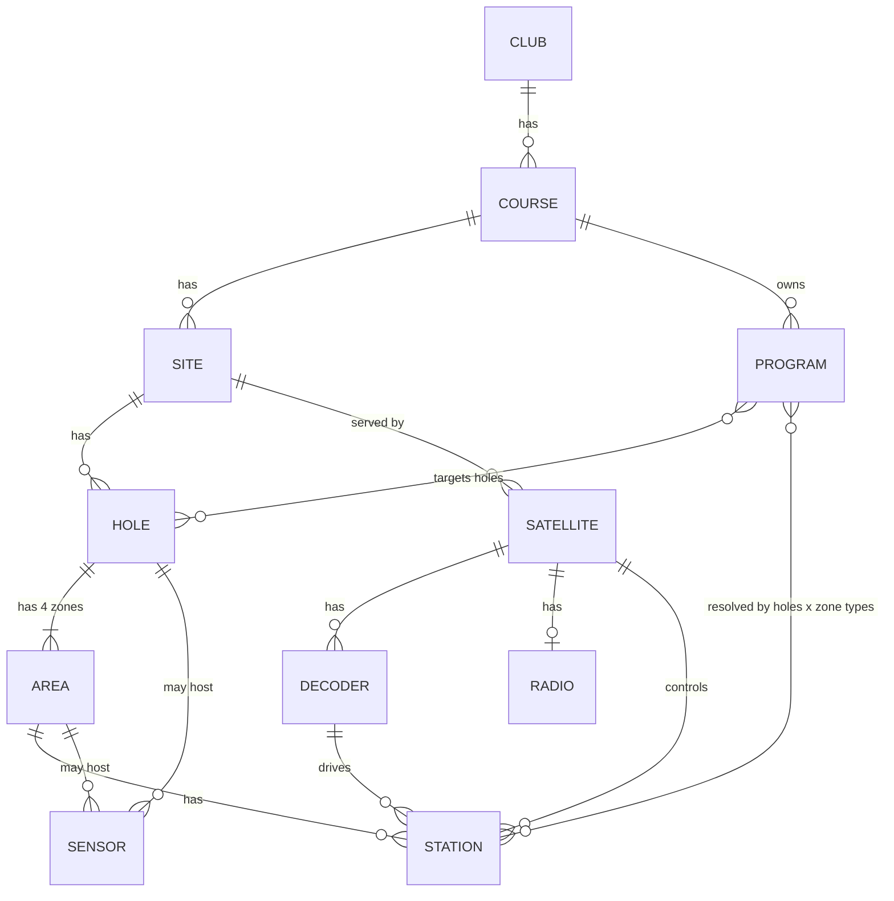
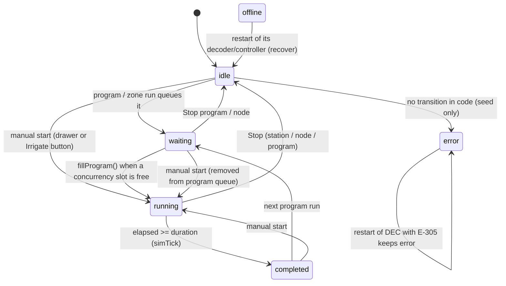
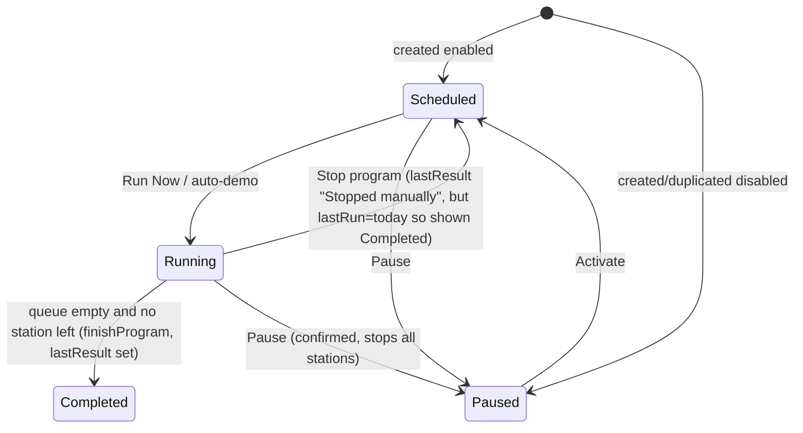
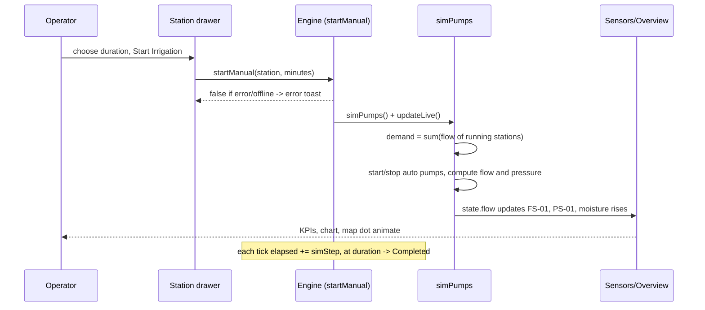
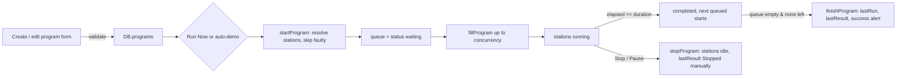
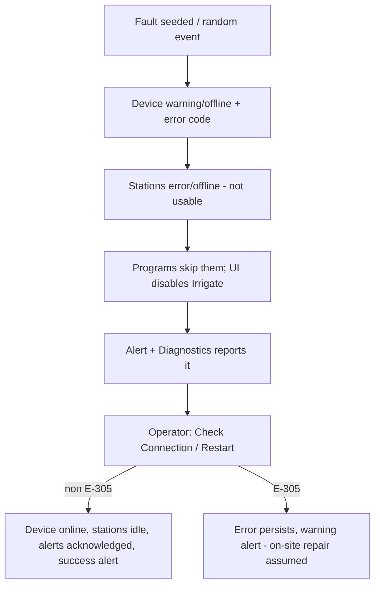

# IrriCourse - Golf Course Irrigation Management System (Static Demo)

# GUIDELINE (User, Business, Feature, Technical and QA)

> Scope: this document describes **only what is implemented** in `index.html`, `style.css` and `script.js` in the `irri-course` folder.
> Anything not found in the code is marked **"Assumption"** or **"Unknown / not implemented"**. No business rule has been invented.
> No pre-existing README exists in this folder (the folder contains only 3 files: `index.html`, `style.css`, `script.js`).

---

## Table of Contents

1. [Project Overview](#1-project-overview)
   - 1.1 Purpose
   - 1.2 Tech stack
   - 1.3 File structure
   - 1.4 How to run
   - 1.5 Data storage, seed data and credentials
   - 1.6 Terminology (UI naming pitfalls)
   - 1.7 Simulation clock and units
2. [User Guideline](#2-user-guideline)
   - 2.1 Roles and access
   - 2.2 Application layout
   - 2.3 Screens (pages) reference
   - 2.4 Step-by-step task guides
3. [Business Guideline](#3-business-guideline)
   - 3.1 Domain model (entities, fields, relationships)
   - 3.2 Statuses and state transitions
   - 3.3 Permissions per role
   - 3.4 Calculation formulas
   - 3.5 Thresholds, constants and settings
   - 3.6 Validation rules (all forms)
   - 3.7 Important business scenarios
4. [Feature Details](#4-feature-details)
5. [Key Workflows and Module Relationships](#5-key-workflows-and-module-relationships)
6. [Known Limitations and Gaps](#6-known-limitations-and-gaps)
7. [QA Test Checklist](#7-qa-test-checklist)
8. [Appendix](#8-appendix)

---

## 1. Project Overview

### 1.1 Purpose

IrriCourse is a **front-end-only demonstration** of a control and monitoring console for a golf-course irrigation system ("Riverside Golf Club", Hoa Vang, Da Nang). It lets an operator:

- browse the physical/logical structure (Club > Course > Area/Site > Hole > Irrigation Zone > Station/Sensor);
- see live (simulated) flow, pressure, pump status, alerts and irrigation progress;
- start/stop irrigation on a station, a zone, a hole, an area, or a whole program;
- create and manage irrigation programs (schedules);
- monitor field equipment (controllers, decoders, radios), run connectivity checks, and "restart" devices;
- manage 5 pumps (auto/manual, speed);
- read sensors (flow, pressure, soil moisture, temperature, rain, water level);
- view an interactive SVG map;
- produce reports (7 report types) with CSV export and print.

Everything is **simulated in the browser**; nothing is sent to any server. The header shows a "Live Demo" badge with the tooltip "Data is simulated and updates automatically".

### 1.2 Tech stack

| Item | Value (from code) |
|---|---|
| Language | Plain HTML5, CSS3, vanilla JavaScript (ES2020+, `'use strict'`) |
| Frameworks / libraries | None. No build step, no npm, no bundler |
| Charts | Custom `<canvas>` charting engine (`chart()`, `drawChart()`), inline SVG sparklines and SVG map |
| Icons | Inline SVG `<symbol>` sprite in `index.html` |
| Font | "Be Vietnam Pro" from Google Fonts (only external dependency; needs internet for the font, the app works without it using fallback fonts) |
| Routing | Hash routing (`#/page/sub`) via `location.hash` and `hashchange` |
| Randomness | Seeded PRNG `mulberry32(20260923)` for seed data (deterministic initial data); `Math`-independent runtime randomness continues from the same generator |
| Backend / API | None. There is no `fetch`, `XMLHttpRequest`, or WebSocket in the code |
| Persistence | None (see 1.5) |
| Responsive | CSS media queries at 1440, 1280, 1100, 960, 640 px; `prefers-reduced-motion` respected |

### 1.3 File structure

```
irri-course/
  index.html   205 lines  Shell: SVG icon sprite, sidebar nav, top bar, 10 empty <section class="page"> containers,
                          overlays (drawer, modal, toasts, tooltip). Loads style.css and script.js
  style.css    831 lines  All styling and responsive rules
  script.js   3228 lines  All logic, organised into numbered sections (see below)
  GUIDELINE.md            This document
```

`script.js` sections (by header comment):

| # | Section | Responsibility |
|---|---|---|
| 1 | Utilities | Formatting, date helpers, PRNG, `GAL_TO_M3 = 0.0037854`, escaping |
| 2 | Status dictionaries | `STATION_ST`, `EQ_ST`, `SENSOR_ST`, `PUMP_ST`, `PRIO` and badge helpers |
| 3 | Sample data | `buildData()` creates the whole in-memory DB `DB` and seeded anomalies/alerts; `genHistory`, `evalSensor` |
| 4 | Settings and state | `DEFAULT_SETTINGS`, `SETTINGS`, global `state`, query helpers (`inCtx`, `programStations`, `programLen`, `programVolume`, `progStatus`, ...) |
| 5 | Simulation engine | `simTick`, `simPumps`, `simSensors`, `simComms`, random `EVENTS`, program run engine (`startProgram`, `fillProgram`, `stopProgram`, `finishProgram`) |
| 6 | Notifications and alerts | `pushAlert`, bell badge, dropdown |
| 7 | Toast / modal / drawer / tooltip | Shared overlays |
| 8 | Canvas charts | Custom line/bar charts |
| 9 | Shared data tables | Sortable table renderer |
| 10 | Navigation | Router `PAGES`, context (course/area) selector, sidebar, global search, keyboard shortcuts |
| 11 | Global action handlers | `ACTIONS` map driven by `data-action` attributes |
| 12 | Detail drawer | Station, equipment, sensor and program drawers; ping and restart |
| 13-22 | Pages | Overview, Courses and Areas, Field Equipment, Irrigation Schedule, Flow and Pumps, Sensors, Irrigation Map, Diagnostics, Reports, Settings |
| 23 | Initialisation | `init()` |

### 1.4 How to run

1. Open `irri-course/index.html` directly in a modern browser (Chrome, Edge, Firefox, Safari). No server is required.
2. Optional: serve the folder statically, e.g. `python -m http.server` inside `irri-course`, then open `http://localhost:8000/`.
3. On load the URL becomes `#/dashboard` (set by `history.replaceState` when no hash is present).
4. Internet is only needed for the Google Font.

Reloading the page **resets everything** (all data lives in memory).

### 1.5 Data storage, seed data and credentials

| Topic | Fact |
|---|---|
| localStorage / sessionStorage / IndexedDB / cookies | **Not used** (no references in code). Nothing persists across reload |
| Where data lives | JS objects: `DB` (`courses, sites, holes, areas, stations, sensors, satellites, decoders, radios, pumps, programs, alerts`), `SETTINGS`, `state`. Index `byId` via `reindex()`/`get(id)` |
| Seed data | Generated by `buildData()` + `seedSimulation()` on every load (deterministic structure; some values use the running PRNG and `Date.now()`) |
| Login / credentials | **None.** There is no login screen. The header permanently shows user "Nguyen Van Minh", "Irrigation Technician", email `minh.nv@riversidegolf.vn`, "Shift: 04:00 - 12:00". "My Profile" shows the toast "Profile is unavailable in demo mode"; "Log Out" shows "Logout is disabled in demo mode" |
| Exports | CSV files are generated client-side (UTF-8 with BOM) and downloaded; no upload anywhere |

**Seed data volumes (derived from `buildData()`):**

| Entity | Count | IDs / notes |
|---|---|---|
| Club | 1 | `CLUB` "Riverside Golf Club" |
| Courses | 3 | `C01` North Course (21.6 ha), `C02` South Course (19.8 ha), `C03` Lake Course (20.4 ha) |
| Areas (Sites) | 6 | `S01`..`S06`, "Site 01".."Site 06", 2 per course, 3 holes each |
| Holes | 18 | `H01`..`H18`; par 3/4/5 derived from map distance; length in metres |
| Irrigation Zones (Areas) | 72 | 4 per hole: Tee `TE`, Fairway `FW`, Green `GR`, Rough `RO`; IDs like `A01-FW` |
| Stations | 126 | 7 per hole: Tee 1, Fairway 3, Green 2, Rough 1. IDs `ST-{hole}{seq}` e.g. `ST-0101` |
| Controllers (satellites) | 10 | `SAT-001`..`SAT-010`; per site: 2,2,2,1,2,1 |
| Decoders | 20 | `DEC-101`..`DEC-120`; 2 per controller |
| Radios | 10 | `RAD-201`..`RAD-210`; 1 per controller (`RAD-203` = UHF Signal Repeater; `RAD-206`, `RAD-209` = LoRa 923 MHz; others UHF Radio 450 MHz) |
| Sensors | 30 | Flow `FS-01..05`, Pressure `PS-01..05`, Soil moisture `SM-01..10`, Temperature `TS-01..04`, Rain `RS-01..03`, Water level `WL-01..03` |
| Pumps | 5 | `P-01..P-03` main (1000 GPM, 75 kW, VFD), `P-04` jockey (120 GPM, 11 kW), `P-05` Lake Course booster (600 GPM, 37 kW, manual mode, stopped) |
| Programs | 10 | `PRG-01`..`PRG-10` (`PRG-09` is paused/disabled) |
| Alerts | 8 initial | 2 critical, 4 warning (2 already read), 1 info, 1 success |

**Intentional demo anomalies (seeded):**

| Item | Anomaly |
|---|---|
| `DEC-102` | Warning, `E-305` "Abnormal solenoid current on 2 channels"; its first 2 stations are in `error` ("Solenoid not responding - current below threshold") |
| `DEC-114` | Offline, `E-401` "Not responding to query commands"; all its stations are `offline` ("Decoder DEC-114 offline"); last OK 48 min ago |
| `SAT-007` | Warning, `E-214` "High response time (> 800 ms)", ping 840 ms |
| `RAD-203` | Offline, `E-502` "Lost radio link with central controller" |
| `RAD-208` | Warning, `E-510` "Weak signal below -85 dBm threshold" (toggles randomly, see 4.13) |
| `P-02` | Permanent pressure offset of +16 PSI and `highFlag` -> "High Pressure" |
| `FS-05` (Hole 12 branch flow) | "Sticky" warning; measured flow is 82% of demand (possible leak or clogged head) |
| Programs at start | `PRG-02` and `PRG-03` are running on load (5 and 3 stations pre-completed); `PRG-01` stations are marked "Completed" |

### 1.6 Terminology (UI naming pitfalls)

The UI reuses some English words for different levels. **Read this before using the app.**

| UI term | Code entity | Meaning |
|---|---|---|
| Golf Course (Course) | `courses` | A course, e.g. North Course |
| **Area (Site)** | `sites` | A group of (usually 3) holes served by one or two controllers. Column header "Area Name" |
| Golf Hole (Hole) | `holes` | One hole, has Par and Length |
| **Irrigation Zone (Area)** | `areas` | Tee / Fairway / Green / Rough of a hole |
| Irrigation Station | `stations` | A valve/sprinkler circuit; the unit that actually irrigates |
| Controller | `satellites` (ID prefix `SAT`) | Field controller cabinet ("48-channel field controller"); the code and map still call it "Satellite" |
| Decoder | `decoders` (`DEC`) | Two-wire decoder connected to a controller, drives stations |
| Radio Device | `radios` (`RAD`) | Radio link of a controller |
| Irrigation Program / Schedule | `programs` (`PRG-nn`, manual `MAN-n`) | A repeating schedule definition |
| Drawer | Side panel | Detail panel opened from tables, map and tree |

### 1.7 Simulation clock and units

- A **tick** runs every `SETTINGS.interval` seconds (default 3 s).
- In each tick, simulated time advances by `SETTINGS.simStep` minutes (default 0.5 min = 30 s), i.e. the simulation runs about 10x real time at defaults. Station `elapsed` grows by `simStep` per tick; "minutes" shown for running stations are simulated minutes.
- The header clock and dates use the real browser time.
- Units: flow GPM (US gallons per minute), pressure PSI, volume m3 (conversion `GAL_TO_M3 = 0.0037854`), temperature Celsius, level m, rain mm, power kW/kWh (cost estimate `$0.12` per kWh).
- Time zone and unit selectors in Settings are disabled placeholders ("(GMT+07:00) Hanoi, Bangkok, Jakarta", "Flow GPM - Pressure PSI - Volume m3").

---

## 2. User Guideline

### 2.1 Roles and access

| Aspect | Implementation |
|---|---|
| Roles defined in code | **None.** There is a single hard-coded operator (Irrigation Technician "Nguyen Van Minh"). |
| Authentication | **Unknown / not implemented** |
| Authorization | **Unknown / not implemented** - every user can use every function, including delete of courses, holes, programs, and pump control |

Assumption (not in code): in a real deployment one would expect at least operator vs administrator roles. This is not implemented and is listed under limitations.

### 2.2 Application layout

```
+-----------+-----------------------------------------------------------------------+
| SIDEBAR   | TOP BAR: club name | Course select | Area select | Global search (/)  |
| Overview  |          Live Demo + last update | System status | Clock | Bell | User |
| Map       +-----------------------------------------------------------------------+
| Courses & | MAIN CONTENT (one page visible at a time)                              |
|  Areas    |                                                                       |
| Field     |  Right-side DRAWER (details)  /  centered MODAL (forms, confirmations) |
|  Equipment|  Toasts (bottom, max 4 visible, auto-hide 4 s)                         |
| Schedule  |                                                                       |
| Pumps     |                                                                       |
| Sensors   |                                                                       |
| Diagnostics|                                                                      |
| Reports   |                                                                       |
| Settings  |                                                                       |
| [Weather] |                                                                       |
| [Collapse]|                                                                       |
+-----------+-----------------------------------------------------------------------+
```

Top bar elements:

| Element | Behaviour |
|---|---|
| Club name | Text from Settings > Club Name; subtitle "Hoa Vang, Da Nang" |
| Course selector | "All Courses (3)" or a course. **Global context filter** (see 4.2) |
| Area selector | "All Areas" or a site of the selected course |
| Global search | Type to search; shortcut key `/` focuses it; `Up/Down` navigate, `Enter` opens (first result if none highlighted), `Esc` closes |
| Live Demo | Shows "Updated: hh:mm:ss" of last simulation tick, flashes on every tick |
| System status | "System status: Normal" / "System status: Needs attention" (amber) / "System status: Fault" (red). Tooltip: "{n} unacknowledged alerts, {x}/{y} pumps running" |
| Clock | Real time and "Weekday, dd/mm/yyyy" |
| Bell | Badge with unread count (shows `9+` above 9). Dropdown lists last 14 notifications; "Mark all as read"; "View all alerts on Overview" |
| User menu | My Profile (disabled toast), System Settings (link), Log Out (disabled toast) |

Sidebar: groups "Courses & Areas" (Golf Course, Area (Site), Golf Hole, Irrigation Zone (Area)) and "Field Equipment" (Controllers, Decoders, Radio Devices, Irrigation Stations) are expandable. The **Collapse** button shrinks the sidebar to icons (tooltips show names; clicking a group icon while collapsed navigates to its first sub-page). On phones the hamburger opens the sidebar with a backdrop. The footer shows the air temperature from sensor `TS-01` and a static text "Rain 24h: 0.0 mm".

Keyboard: `/` focus search; `Esc` closes modal, then drawer, then dropdowns; `Enter`/`Space` activates elements with `data-action`; the tree supports arrow keys.

### 2.3 Screens (pages) reference

Routes (hash): an unknown route falls back to `#/dashboard`.

| Route | Page | Purpose |
|---|---|---|
| `#/dashboard` | Irrigation System Overview | KPIs, live flow chart, irrigation status, pumps, alerts, running stations, today's schedule |
| `#/map` | Irrigation Map | Interactive SVG map per course |
| `#/structure/courses` `sites` `holes` `areas` | Courses and Areas | Tree + detail panel + list table of the selected level; add/edit/delete; irrigate whole hole/area/zone |
| `#/equipment/satellites` `decoders` `radios` `stations` | Field Equipment | Tabbed tables with filters, drawer, ping, restart, export |
| `#/schedule` | Irrigation Schedule | Day/Week/Month calendar + program table + program form |
| `#/pumps` | Flow and Pump Management | Summary, 5 pump cards, 3 charts |
| `#/sensors` | Sensors | Type tiles, 4 charts, sensor list, drawer |
| `#/diagnostics` | Diagnostics | Comm status table, run diagnostics console, error-code reference |
| `#/reports` and `#/reports/{water,runtime,pumps,flow,sensor,equipment,schedule}` | Reports | 7 report tabs |
| `#/settings` | Settings | System configuration |

Detail drawers (right side panel): **Station**, **Equipment** (controller/decoder/radio), **Sensor**, **Program**. Close with the X button, `Esc`, or clicking the dark backdrop.

### 2.4 Step-by-step task guides

#### T1. Read the overall system status
1. Open **Overview**.
2. KPI row: Golf Courses (with irrigated hectares), Areas (Sites), Golf Holes (sum of Par), Irrigation Stations (errors/disconnected count), Irrigating, Pumps Running (x/5), Current Flow (GPM) + pressure, Alerts (with critical count). Each KPI is a link to the related page.
3. Read "System Flow" (Actual vs Target, red "Max" and amber "Min" lines), "Irrigation Status" bar, "Pump Status" table, "Alerts", "Irrigating Stations", "Today's Irrigation Schedule".

#### T2. Filter everything by course or area
1. In the top bar choose a course; the toast "Viewing: {label}" appears. Optionally choose an area.
2. The Overview, Equipment, Sensors, Reports, Diagnostics, Schedule and Map follow the selection (details in 4.2).

#### T3. Irrigate one station manually
1. Open the station: from **Field Equipment > Irrigation Stations** (click row, or the **Irrigate** button for a quick run with the default duration), from the **tree**, the **map** (click a dot), or global search (e.g. `ST-0102`).
2. In the drawer choose "Manual irrigation duration" (3, 5, 10, 12, 15, 20, 30 min) and click **Start Irrigation**. Toast: "Started irrigating {name} for {n} minutes".
3. To stop, click **Stop Irrigation** and confirm ("Stop irrigating {name} ({id}) immediately?").
4. If the station is `error` or `offline`, the drawer shows a fault box and "Open Diagnostics Page" instead of controls. The **Irrigate** quick button is disabled.

#### T4. Irrigate a whole zone / hole / area manually
1. Go to **Courses & Areas**, select an Area (Site), Hole, or Irrigation Zone in the tree or the list.
2. Click **Irrigate Entire Area / Hole / Zone** (disabled if no usable station).
3. In "Manual Irrigation - {name}" choose Duration per Station (3, 5, 8, 10, 12, 15, 18, 20, 25, 30 min) and Concurrent Stations (1, 2, 3, 4, 6, 8, 12 but not more than the number of usable stations). A live summary shows stations, rounds, total time, estimated water and peak flow.
4. Click **Start Irrigation**. A temporary program `MAN-n` is created and stations run in rounds.
5. Stop with **Stop Irrigation** on the same node (confirm "Stop all {n} stations that are irrigating or waiting at {name}?").

#### T5. Create an irrigation program
1. Click **Create Irrigation Program** (Overview or Schedule).
2. Fill: Program Name, Golf Course, Priority Level (High/Medium/Low), Golf Holes (checkboxes grouped by area; Select All / Deselect All), Irrigation Zone chips (Tee/Fairway/Green/Rough), Start Time, Duration per Station (1-60), Concurrent Stations (1-30), Run Days (Mon-Sun toggles), Note, and "Activate program after saving".
3. Watch the blue summary: number of stations, total duration and time window, estimated water (m3), peak flow (GPM), a red "exceeds pump station limit" warning and an amber overlap warning.
4. Click **Create Program**. On validation failure the toast "Please review the irrigation program details" appears and invalid fields show messages.

#### T6. Run, pause, edit, duplicate, delete a program
1. In **Irrigation Schedule**, click a row in the programs table (or a block on the calendar) to select it; the toolbar shows "Selected: {name}".
2. Buttons: **Edit**, **Duplicate** (copy is named "{name} (copy)" and is created **inactive**), **Activate**, **Pause**, **Run Now** (or **Stop** when running), **Delete**.
3. Double-click a row or click a calendar block to open the program drawer with progress.
4. All destructive actions ask for confirmation (see 4.7).

#### T7. Control pumps
1. Open **Flow & Pumps**. Each pump has a card with a gauge (flow vs rated), Target, Pressure, Speed, Power, Temperature, Runtime.
2. Mode: **Auto** (system starts/stops main pumps based on demand) or **Manual**. In Manual you can change speed with +/- (steps of 5%, range 30-100) and use **Start** / **Stop**.
3. **Set All to Auto** puts all pumps in Auto.
4. Stopping a pump asks for confirmation (warns if no main pump would remain while irrigating).

#### T8. Check equipment health
1. **Field Equipment** > choose tab; use filters (Course, Area, Hole, Status, Type, search); sort by clicking column headers.
2. Click a row to open the drawer. Use **Check Connection** (4 simulated ping packets) or **Restart** (confirmation; device shows "Restarting").
3. **Export CSV** exports the currently filtered/sorted tab.

#### T9. Run diagnostics
1. Open **Diagnostics**, pick "Check Scope" (Entire System or a course) and click **Run Diagnostics**.
2. Watch the console progress; the final line summarises checks, passed, warnings, errors and duration. A toast "Diagnostics complete: {w} warnings, {e} errors" appears.
3. Use the error-code reference (E-120, E-214, E-305, E-401, E-502, E-510) for remediation hints.

#### T10. Acknowledge alerts
1. On **Overview > Alerts** click **Acknowledge** on a critical/warning alert, or **Acknowledge All**.
2. Toasts: "Alert acknowledged" / "All alerts acknowledged". Acknowledged alerts show "Acknowledged" and no longer count as active.
3. The bell list is separate: opening it and clicking **Mark all as read** only clears the unread badge (does not acknowledge).

#### T11. Read a sensor
1. **Sensors** page: click a type tile to filter (click again to clear), or use filters. Click a row for the drawer with the current value, allowed range, 24-hour chart (30 min per point), average and peak.
2. **Calibrate** only shows a toast (no real action). **View on Map** jumps to the map with the sensor selected.

#### T12. Generate a report
1. **Reports**: pick a tab, date range (or Quick: Today / 7 days / 30 days) and filters.
2. Use **Export CSV** or **Print Report**.
3. Data is simulated and labelled "Simulated data" in the footer.

#### T13. Change settings
1. **Settings**: edit values and click **Save Changes**; or **Restore Defaults** (confirmation).
2. Invalid fields display messages and the toast "Please review the fields marked below" appears.

#### T14. Add / edit / delete structure
1. **Courses & Areas**: buttons **Add Course**, **Add Area**, **Add Hole** (page header) or contextual **Add Area** (on a course) and **Add Hole** (on an area).
2. **Edit** and **Delete** buttons appear for every node except the Club. Delete requires confirmation and is a cascading delete (see 4.3).

---

## 3. Business Guideline

### 3.1 Domain model (entities, fields, relationships)



Entity fields (as stored in code):

| Entity | Key fields | Notes |
|---|---|---|
| Course | `id` (C01..), `name`, `en` (short name), `location`, `status`, `area` (ha), `ci` (map layout index), map anchor points | New course id via `nextId('C')` |
| Site (Area) | `id` (S01..), `courseId`, `name`, `location`, `status` | |
| Hole | `id` (H01..), `no` (1-99), `courseId`, `siteId`, `name` ("Hole 05"), `par` (3/4/5), `length` (m), `geo` (map geometry, null for user-added holes) | |
| Irrigation Zone (Area) | `id` (`A{hole}-{TE/FW/GR/RO}`), `holeId`, `type`, `name`, `desc`, `turf` (grass), `location` | Grass defaults: Tee "Zoysia Matrella grass", Fairway "Bermuda 419 grass", Green "Bermuda TifEagle grass", Rough "Paspalum grass" |
| Station | `id`, `name`, `holeId`, `areaId`, `siteId`, `courseId`, `type`, `flow` (GPM), `defRun` (default minutes), `head` (sprinkler head text), `status`, `elapsed`, `duration`, `program`, `lastRun`, `runsToday`, `pos` (map, null for user-added), `satelliteId`, `decoderId`, `fault` | |
| Controller | `id`, `name`, `siteId`, `ip`, `comm` (Fiber optic / 2-wire signal cable / UHF Radio), `firmware` (`v5.3.2` current; `SAT-004`, `SAT-009` on `v5.2.8`), `model`, `ping`, `signal` (%), `status`, `errorCode`, `errorMsg`, `lastSeen`, `lastOk`, `holeIds` | Firmware other than `v5.3.2` shows "Outdated"/"Update available" |
| Decoder | `id`, `siteId`, `satelliteId`, `address` (hex), `model` (4/8/12-channel), `current` (mA), `voltage` (V), `ping`, `status`, `errorCode`... | Each controller has 2 decoders; the controller's stations are split in two halves |
| Radio | `id`, `type`, `freq`, `satelliteId`, `signal` (dBm), `ping`, `status`... | |
| Sensor | `id`, `type`, `location`, `holeId`, `areaId`, `courseId`, `mapCourse`, `value`, `lo`, `hi`, `battery`, `status`, `sticky`, `history` (48 points x 30 min), `live` | "Shared infrastructure" sensors have no `holeId` (pump station, weather, reservoir) |
| Pump | `id`, `name`, `type`, `rated` (GPM), `kw`, `status`, `mode`, `setSpeed`, `flow`, `target`, `speed`, `pressure`, `power`, `temp`, `runtime` (h), `starts`, `anomaly`, `jockey`, `highFlag` | |
| Program | `id`, `name`, `courseId`, `holeIds[]`, `areaTypes[]`, `start` (HH:MM), `duration` (min/station), `days[]` (0=Mon..6=Sun), `priority`, `enabled`, `concurrency`, `note`, `lastRun`, `lastResult`, `state {running, queue, startedAt, skipped, total}`, `manual` (true for temporary `MAN-n`) | |
| Alert | `id` (`AL{n}`), `sev` (critical/warning/info/success), `title`, `source`, `ts`, `read`, `ack`, `cat` | Max 80 kept (oldest dropped) |

**Key relationships / derived sets**

- A program's stations = all stations where `station.holeId` is in `program.holeIds` **and** `station.type` is in `program.areaTypes` (`programStations`). There is no direct station list.
- Station -> controller and decoder are set at creation (halves of the controller's station list). Radios map to a station through the controller.
- Context filter `inCtx(o)` compares `o.courseId`/`o.siteId` with the selected top-bar context.

### 3.2 Statuses and state transitions

**Station status** (`STATION_ST`)

| Code | UI label | Meaning |
|---|---|---|
| `idle` | Ready | Can be started |
| `waiting` | Waiting | Queued by a running program or manual zone run |
| `running` | Irrigating | Valve open, `elapsed` increasing |
| `completed` | Completed | Finished a run (stays "Completed" until the next run; treated as usable/ready) |
| `error` | Error | Solenoid fault; not usable |
| `offline` | Disconnected | Decoder/controller lost; not usable |

`usable(s)` = status is neither `error` nor `offline`.



**Program status** (`progStatus`, evaluated for today)

| Key | Label | Rule (in order) |
|---|---|---|
| `run` | Running | `state.running` |
| `paused` | Paused | not `enabled` |
| `done` | Completed | (today is a run day **and** `start + programLen < current minutes`) **or** `lastRun` is today |
| `up` | Scheduled | otherwise |

For other days (`progStatusOn`): disabled -> Paused; past date -> Completed; future date -> Scheduled.



**Equipment status** (`EQ_ST`): `online` (Online), `warning` (Warning), `offline` (Offline).
Transitions in code: random `EVENTS` toggle `RAD-208` and `SAT-007` between online/warning; **Restart** returns a device to `online` except `E-305` decoders.

**Sensor status** (`SENSOR_ST`): `normal`, `warning` (value outside `lo`/`hi`, or sticky), `offline` = label "Signal Lost" (never assigned by code; unreachable).

**Pump status** (`PUMP_ST`): `running` (Running), `stopped` (Stopped), `fault` (Fault; never assigned by code). Display state (`pumpState`): `fault` / `stopped` / `warn` (High Pressure if `highFlag`, else High Temperature when temp > 70 C) / `running`.

**Alert lifecycle**: created (unread, unacknowledged) -> read (bell "Mark all as read", or Acknowledge) -> acknowledged (`ack`, only critical/warning can be acknowledged). Active alerts = not acknowledged **and** severity critical or warning.

**Priority**: High (`p-high`), Medium (`p-mid`), Low (`p-low`). Priority is used only for calendar colour and the report rule "postponed due to rain" (non-high programs). It does **not** change run order in the engine.

### 3.3 Permissions per role

| Function | Operator (only user) | Other roles |
|---|---|---|
| All read screens | Yes | Unknown / not implemented |
| Start/stop stations, programs, pumps | Yes | Unknown / not implemented |
| Create/edit/delete structure and programs | Yes | Unknown / not implemented |
| Change settings, restore defaults | Yes | Unknown / not implemented |
| Login/logout/profile | Disabled in demo | Unknown / not implemented |

### 3.4 Calculation formulas

| Name | Formula (from code) |
|---|---|
| Volume conversion | `m3 = GPM x minutes x 0.0037854` |
| Program stations | stations in selected holes with selected zone types (including faulty ones) |
| Program length (`programLen`) | `ceil(usableStations / concurrency) x duration` minutes (rounds x duration) |
| Program volume (`programVolume`) | `sum(flow of ALL matching stations) x duration x 0.0037854` (includes faulty stations) |
| Form peak flow | sum of flow of the first `concurrency` matching stations (ordered as in DB) |
| Manual zone summary | rounds = `ceil(stations / concurrent)`, total time = rounds x duration, water = `sum(flow) x duration x 0.0037854`, peak = flow of first `concurrent` stations |
| Station drawer estimate | `flow x defRun x 0.0037854` m3 (uses the default duration, not the selected one) |
| Program progress | `remaining = queue.length + running stations`; `pct = (total - remaining + sum(elapsed/duration of running)) / total x 100` |
| Auto pumps needed | `need = rest > 40 ? min(autoPumps, ceil(rest / 880)) : 0` where `rest = max(0, demand - manualPumpFlow)`, `demand` = sum of flow of running stations, per-pump capacity constant 880 GPM, `manualFlow = rated x setSpeed/100 x 0.92` |
| Auto pump stop | while running > need and ((running > 1 and `rest < (running-1) x 880 x 0.75`) or (need == 0 and 4 consecutive zero-demand ticks)) |
| Pump flow share | `rest / runningAutoPumps` (x random 0.97-1.03) |
| Pump speed (auto) | `clamp(round(28 + flow/rated x 72 + noise), 30, 100)` |
| Pump pressure | `66 + speed x 0.09 + noise(+/-1.2) + anomaly` |
| Pump power | `kW x (speed/100)^3 x 1.08` |
| Pump temperature | eases toward `40 + speed x 0.22` (running) or 31 (stopped) |
| Pump runtime | `+= simStep / 60` hours per tick |
| Pipeline pressure | mean of running main pumps' `(pressure - 0.6 x anomaly)` minus 1.5; if none, jockey pressure - 4; else 0 |
| Water used today | `+= currentFlow x simStep x 0.0037854` per tick, seeded at 1864 m3 |
| Electricity cost | `kW x 0.12` per hour (`$`) |
| Utilisation | `currentFlow / flowMax x 100` |
| Soil moisture sim | `+0.06..0.14` per tick while a station of its zone is running, else `-0..0.015`; clamped 8-45 |
| Sensor flow sim | `FS-01` = system flow; `FS-05` = 0.82 x demand of Hole 12; others = demand of the course x 0.97-1.03 |
| Report volume per hole/day | `sum(flow x defRun of stations) x 0.0037854 x 1.35 x weatherFactor x rand(0.9-1.1)` (simulated) |
| Report prior period | `total x rand(0.9-1.12)` (simulated) |
| Report weather | Deterministic per date via string hash: 20% chance of rain (not today) -> factor 0.3, else 0.88-1.14 |
| Hole par | distance on map < 230 -> 3; < 340 -> 4; else 5 (seed only) |

### 3.5 Thresholds, constants and settings

| Setting (Settings page) | Default | Allowed range | Effect |
|---|---|---|---|
| Club Name | Riverside Golf Club | >= 3 chars | Top bar name, "All of {club}" context label |
| Data Update Interval (seconds) | 3 | 1-30 | Tick frequency |
| Simulated Time per Cycle (minutes) | 0.5 | 0.1-5 | Simulated minutes per tick |
| Automatically start simulated irrigation programs | On | on/off | Auto-demo engine (4.13) |
| Max Pressure (PSI) | 85 | 60-120 | Pump "High Pressure" flag, chart threshold, Diagnostics E-120 |
| Min Flow (GPM) | 200 | 0-1000 | Amber line on flow charts only |
| Max Flow (GPM) | 2200 | 500-5000 and > Min Flow | Red line; system status Fault if current flow > max; form warning "exceeds pump station limit" |
| Min Soil Moisture (%) | 18 | 5-40 | Warning threshold of moisture sensors |
| Notify Critical / Warning / Info | On | on/off | Only pop-up toasts (all alerts are still stored in the bell list) |

Other hard-coded constants: pump capacity 880 GPM; sensor limits (pressure `lo`/`hi`, rain `hi` 5 mm, temperature and level limits); 80 alerts kept; 40 live points per sensor; 80 points of flow history; 62 max report days; latency colours (< 150 ms good, < 500 ms medium, otherwise bad); signal bars for radios (> -65 = 4 bars, > -75 = 3, > -85 = 2, else 1).

### 3.6 Validation rules (all forms)

| Form | Field | Rule | Message |
|---|---|---|---|
| Structure (course/site/area) | Name | required | "Please enter a name" |
| Course | Irrigated Area (ha) | > 0 | "Area must be greater than 0" |
| Course | Name | unique (case-insensitive) | "Course name already exists" |
| Site | Name | unique within the same course | "Area name already exists in this course" |
| Hole | Hole Number | integer 1-99 | "Hole number must be from 1 to 99" |
| Hole | Hole Number | unique among all holes | "Hole {nn} already exists" |
| Hole | Length | 60-700 m | "Length must be from 60 to 700 m" |
| Program | Name | required | "Please enter a program name" |
| Program | Name | max 80 | "Name must be at most 80 characters" |
| Program | Name | unique among real programs | "Program name already exists" |
| Program | Holes | at least 1 | "Select at least one golf hole" |
| Program | Zones | at least 1 | "Select at least one irrigation zone" |
| Program | Start | `HH:MM` | "Invalid start time" |
| Program | Duration | integer 1-60 | "From 1 to 60 minutes" |
| Program | Concurrency | integer 1-30 | "From 1 to 30 stations" |
| Program | Days | at least 1 | "Select at least one day" |
| Program | Selection | must match >= 1 station | "No irrigation stations match this selection" |
| Program (all) | Summary | any error | toast "Please review the irrigation program details" |
| Report filters | From | valid date | "Invalid start date" |
| Report filters | To | valid date | "Invalid end date" |
| Report filters | Range | from <= to | "End date must be after start date" (only `from > to` fails; equal dates are allowed) |
| Report filters | To | not in the future | "Cannot select a future date" |
| Report filters | Range | <= 61 days difference | "Maximum range is 62 days" |
| Settings | Club name | >= 3 chars | "Name must be at least 3 characters" |
| Settings | Interval | 1-30 | "Value from 1 to 30 seconds" |
| Settings | Sim step | 0.1-5 | "Value from 0.1 to 5 minutes" |
| Settings | Max pressure | 60-120 | "Value from 60 to 120 PSI" |
| Settings | Min flow | 0-1000 | "Value from 0 to 1,000 GPM" |
| Settings | Max flow | 500-5000 | "Value from 500 to 5,000 GPM" |
| Settings | Max flow | > Min flow | "Must be greater than min flow" |
| Settings | Min moisture | 5-40 | "Value from 5 to 40%" |
| Settings | Non-numeric | NaN | "Please enter a valid number" |
| Settings | Summary | any error | toast "Please review the fields marked below" |

### 3.7 Important business scenarios

| # | Scenario | Behaviour in code |
|---|---|---|
| S1 | Program includes faulty stations | On start, error/offline stations are **skipped** (`skipped` counter); result text becomes "Completed, skipped {n} faulty stations" |
| S2 | Program has no usable, idle station | `startProgram` returns false -> toast "No available stations to run this program" |
| S3 | Manual start on a station waiting in a program | Removed from the program queue and started manually (note box: "Manual irrigation will remove it from the queue.") |
| S4 | Stopping one station of a running program | Station goes idle and is removed from the queue; the program continues with others |
| S5 | Total demand rises | Auto pumps start one by one; alert info "Pump {id} started automatically due to increased flow demand" |
| S6 | Demand drops to zero | After 4 ticks main auto pumps stop; alert info "Pump {id} stopped automatically due to decreased flow demand" |
| S7 | Pump pressure over max | Flag `highFlag`, warning "Pump {id} has high pressure ({n} PSI)" and card warning "Pressure exceeds {max} PSI threshold - check relief valve" |
| S8 | Decoder offline | All its stations `offline`; restart of the decoder recovers them to `idle` and closes related alerts |
| S9 | Decoder `E-305` | Restart does **not** fix it: warning "{id} restarted but error E-305 persists - solenoid needs on-site inspection" |
| S10 | Delete a hole/area/site/course | Cascade delete of dependants and empty programs (4.3) |
| S11 | Flow exceeds Max Flow | System status "Fault" (red) |
| S12 | Rain in reports | Non-high-priority programs are "Postponed due to rain" in Schedule History (report only; the live engine has no rain logic) |

---

## 4. Feature Details

### 4.1 Overview (Dashboard)

| Item | Detail |
|---|---|
| Inputs | Course/area context; simulation state |
| Outputs | 8 KPI cards (clickable), flow chart, irrigation status bar and running programs, pump table (rows click to scroll to pump card), alerts list (up to 14; success alerts only if < 1 h old), running stations list (top 9 by progress, "and n more stations irrigating"), today's schedule timeline |
| Rules | Alerts KPI = unacknowledged critical + warning. "Error" count = `error` + `offline` stations in context. Irrigation bar segments: Irrigating, Completed, Waiting, Error, Ready |
| Empty states | "No alerts"; "No stations are currently irrigating" (+ button "Select a station to irrigate manually"); "No irrigation programs today"; "No irrigation programs currently running" |
| Edge cases | Pump table and alerts are **not** filtered by course; the KPI "Pumps Running" and "Alerts" use global data. Alert list is re-rendered on change or every 10 ticks |

### 4.2 Global context (course/area selector)

- Changing the course resets area to All and shows toast "Viewing: {label}".
- It sets: Equipment filters (course/site, hole reset), Sensors filter course, Reports filters (course/site, hole reset), Map course (if not All), and re-renders the current page.
- Used by `inCtx()` on: Overview counts and lists, Structure lists (sites/holes/areas tabs), Diagnostics devices, Schedule (course only via `schedPrograms`).
- Not filtered by context: courses list, pumps, alerts, the tree.
- Label: "All of {club name}", "{course}", or "{site}, {course}".

### 4.3 Courses and Areas (structure management)

| Sub-feature | Detail |
|---|---|
| Tree | Club > Course > Area > Hole > Zone > Station/Sensor. Status dot from station statuses (`run`, `err` if all unusable, `warn` if some unusable, `wait`, `ok`, `idle` if no stations). Meta shows counts. Search box filters by id/name/desc/location/sensor type, auto-expands matches. **Expand All** / **Collapse** buttons. Double-click toggles a node; arrow keys navigate |
| Detail panel | Name, Code, Status ("Irrigating", "Error", "Warning", "Waiting", "Active", "No stations yet"), Location, station count (with errors), sensor count, irrigating count; course adds Irrigated Area and Hole Count; hole adds Par and Length; zone adds Grass Type and Design Flow Rate; sub-level chips; station chips; connected equipment chips; sensors |
| List table | Segmented control: Golf Courses / Areas / Golf Holes / Irrigation Zones; sortable; text filter "Filter by name, code, location"; row click selects in the tree |
| Add | **Add Course** (Name, Short Name, Location, Irrigated Area default 18), **Add Area** (Name default `Site nn`, Course, Location), **Add Hole** (Number default max+1, Area, Par default 4, Length default 360, checkbox "Automatically create 4 irrigation zones (Tee, Fairway, Green, Rough) and 7 default stations", default checked) |
| Edit | Same forms; Course of a site and Area of a hole are locked (disabled); hole edit changes number/par/length only; zone edit changes name, grass type, location |
| Auto-created stations | Flow = midpoint of the zone's flow range (rounded: Tee 18, Fairway 49, Green 21, Rough 34), default duration Tee 10 / Fairway 18 / Green 12 / Rough 15 min; assigned to the **first** controller and **first** decoder of the site (or none if the site has no controller) |
| Delete | Confirmation text: "Delete {name} ({id}) along with all its data: {counts}? {n irrigating stations will be stopped.} This action cannot be undone." Button "Delete Permanently". Removes stations, zones, holes, sites; sensors under the node; for site/course also controllers, decoders and radios of removed sites; programs lose the removed holes and **programs left with no holes (or belonging to a deleted course) are deleted**. Toast "Deleted {type} {name}" (+ " and n related irrigation programs") |
| Irrigate entire node / Stop | See T4 and 4.6 |
| Errors | "You need to create an area before adding a hole" / "You need to create a golf course before adding an area" |
| Edge cases | New course/site/hole have no map geometry: the Map shows "This course has no digitized map data yet." for a course without holes with geometry; user-added holes/stations have `pos: null` and never appear on the map. Deleting the last course selects the Club node |

### 4.4 Field Equipment

| Item | Detail |
|---|---|
| Tabs | Controllers, Decoders, Radio Devices, Irrigation Stations (with counts; a red pill shows non-online devices for non-station tabs) |
| Filters | Search (code, name, IP, address, type, model, error code, head), Golf Course, Area, Golf Hole, Status (stations: Irrigating, Waiting, Completed, Ready, "Error / Disconnected"; devices: Online/Warning/Offline), Type (Comm Channel / Model / Radio Type / Irrigation Zone). **Clear Filters** resets |
| Columns | Controllers: Code, Name/Model, Course/Area, IP, Comm Channel, Stations, Firmware (Outdated badge), Signal, Ping, Status, Last Contact. Decoders: Code, Address, Model, Controller, Area, Stations, Current (amber above 45 mA), Status, Error Code, Last Contact. Radios: Code, Type, Frequency, Controller, Area, Signal (dBm), Ping, Status, Error Code, Last Contact. Stations: Code, Course/Hole, Zone, Decoder, Flow, Status, Progress/Last Run, action (Irrigate/Stop) |
| Drawer (equipment) | Fault box with error code and "Stable connection lost since {time}"; key values (IP, comm channel, firmware with "Update available" if not `v5.3.2`, signal, model, address, current, voltage, frequency, last contact, last successful contact); counts of connected stations; coverage chips (holes and stations, max 12 + "and n more stations") |
| Check Connection (`runPing`) | 4 packets every 550 ms. Online: `ping x rand(0.85-1.2)` ms (min 8), >500 ms shows warning icon. Offline: "Packet {i}: timed out (2000 ms)". Summary "Result: {ok}/4 packets successful, average {n} ms". Successful ping updates `lastSeen` |
| Restart (`rebootDevice`) | Confirmation "Restart {id}? The device will lose contact for about 30 seconds. {n irrigating stations} will pause and resume once the device reconnects." (the wording mentions 30 s and pausing, but the code waits 4.2 s and does **not** pause stations). While restarting: badge "Restarting", buttons disabled. After 4.2 s: see S8/S9. Success alert: "{id} reconnected[ and is operating normally][, n stations ready to irrigate]". Related non-success alerts mentioning the id are acknowledged |
| Export CSV | Downloads `equipment-{tab}-{yyyy-mm-dd}.csv` for filtered + sorted rows (action column removed), toast "Exported file {name}" |
| Sorting | Click header (toggle asc/desc); station status sorts by dictionary order |

### 4.5 Station drawer

See T3. Additional content: breadcrumbs (course > area > hole > zone, clickable), tag with id and status badge, Station Information (zone, grass, sprinkler head, design flow, default duration, controller, decoder, last run, runs today), Related Irrigation Programs (click opens program drawer), Nearby Sensors (same zone or same hole), **View on Map**, **Open {hole} in tree**. Running box shows program name prefix (e.g. "Program A") or "manually", progress bar, flow and remaining time.
Messages: "{name} cannot irrigate: {status label lowercase}" (error toast) when start is not possible. Stop toast: "Stopped irrigating {name}" (warning). 

### 4.6 Irrigation engine (programs, manual runs)

- `startProgram(p)`: for each matching station: skip if not usable (counts `skipped`); ignore if already running/waiting; else set `waiting` + `program=id` and queue. If queue empty, returns false. Then `fillProgram` starts stations up to `concurrency` slots, each with `duration = p.duration`.
- Every tick: running stations advance by `simStep`; at `elapsed >= duration` status becomes `completed`, `runsToday++`, `lastRun=now`, and the next queued station starts.
- Program finishes when queue is empty and no station has its id: `lastRun=now`, `lastResult`, success alert "Irrigation {name} completed" (source = course name, category `schedule`).
- **Run Now** confirmation: "Start {name} now with {n} stations, taking about {duration}?" (n counts usable stations). **Stop**: "Stop {name}? All irrigating and waiting stations for this program will stop immediately." Sets `lastResult = "Stopped manually"`.
- **Pause** on a running program: confirmation "{name} is currently running. Pausing will immediately stop all stations in this program. Continue?" then disables it.
- Editing a running program: if its course changes or it is deactivated, it is stopped first.
- Manual zone run: creates `MAN-n` program (priority high, `days: []`, flagged `manual`) and queues usable stations; these programs are excluded from the schedule list, calendar, name-uniqueness check and auto-demo. They accumulate in `DB.programs` (never removed except by cascade delete) and each produces a completion alert "Irrigation Manual Irrigation - {name} completed".
- Stop for a node: "Stop all {n} stations that are irrigating or waiting at {name}?"; empties manual programs whose stations are all gone.

### 4.7 Irrigation Schedule

| Item | Detail |
|---|---|
| Calendar | **Day** (Gantt 00:00-24:00 with hour scale every 2 h, a "now" line on today, blocks coloured by status, wraps past midnight into two blocks, minimum visible length 5 min, plus "Day's Sequence" list with duration and m3), **Week** (Monday-first columns, click a day header to open Day view), **Month** (6x7 grid, up to 3 items per day + "+n more"; disabled programs are hidden in Month only) |
| Navigation | Prev / Today / Next; step is 1 day / 7 days / 1 month |
| Table | Program, Course/Area, Holes (range "a-b (n)" if > 4), Zones, Stations, Start Time (+ days), Duration (total and per station), Water Volume, Priority, Status (+ progress bar), row actions (Run/Stop, Edit, Details). Filters: Golf Course and Status chips All / Running / Scheduled / Completed / Paused |
| Footer | "{shown} / {total} programs", "{active} active - {running} running - Total water/day ≈ {m3} m3" (enabled programs running today) |
| Form | See T5 and 3.6. Duplicate name: "{name} (copy)"; new id `PRG-{nn}` first free number. Overlap warning: "Overlaps with {ids} on the same course" (enabled programs of the same course sharing a day whose time windows intersect) |
| Confirmations | Delete: "Permanently delete {name} ({id})? {The running program will be stopped.} This action cannot be undone." |
| Toasts | "Created irrigation program {name} ({id})", "Saved {name}", "Activated {name}", "Paused {name}", "Deleted {name}", "Started {name}", "Stopped {name}" |

Important: the schedule **does not fire automatically at the program's start time** (see Limitations L1). Start time is used for display, ordering, overlap warnings and status computation.

### 4.8 Flow and Pumps

| Item | Detail |
|---|---|
| Summary strip | Total Flow (% of limit), Target Demand (stations irrigating), Pipeline Pressure (threshold), Pumps Running (ids), Power Consumption (kW, ≈ $/hr at 0.12), Water Today (m3) and lake level (`WL-01`) |
| Pump card | Badge (Running / Stopped / Fault / High Pressure / High Temperature), gauge (flow / rated), metrics, warning line "Pressure exceeds {max} PSI threshold - check relief valve" or "High motor temperature", "Rated {x} GPM - {kW} kW", "Starts today", mode switch, speed control, Start / Stop |
| Controls | Speed +/- only in Manual and between 30 and 100 (step 5); Start enabled only in Manual and when not running; Stop only in Manual and when running. Switching to Manual initialises `setSpeed` to the current speed rounded to 5 (clamped 30-100). Toasts: "{id} switched to Auto/Manual mode", "Started {name} at {n}% speed", "Stopped {name}", "All pumps switched to Auto mode" |
| Stop confirmation | "Stop {name} ({id}) currently supplying {n} GPM?" plus, if demand > 0 and no other main pump is running, "No main pumps will be running, irrigating stations may lack pressure." |
| Charts | Real-time flow (last ~4 min at defaults), main pipeline pressure (threshold and a fixed low line at 55 PSI, fixed y-axis 40-100), flow distribution by pump (current vs rated) |
| Rules | Jockey pump (`P-04`) is never auto-started/stopped by the demand logic (`autos` excludes jockey) but can be toggled in Manual. Manual pump flow = `rated x speed%` x 0.9-0.95 (x0.35 when there is no demand). Manual pumps can run even with zero demand |

### 4.9 Sensors

| Item | Detail |
|---|---|
| Type tiles | 6 tiles (Flow, Pressure, Soil Moisture, Temperature, Rainfall, Water Level) with aggregate value (Flow = `FS-01`; Rain = peak; others = average), sensor count and "n warnings". Click toggles a type filter (chip "x" clears it) |
| Charts | Soil moisture (average, lowest, highest + threshold line), Flow (FS-01, FS-02, FS-05), Pressure (PS-01, PS-03 + high threshold), Temperature (TS-01..03) |
| List | Code, Type, Location (+ course/hole), Value, 24h Trend sparkline, Threshold ("lo - hi unit"), Battery (red under 30%, "Mains Power" if none), Status, Updated. Filters: search (code/location/type), Golf Course, Type, Status. Footer: "Showing n / total sensors", warnings and signal-lost counts |
| Drawer | Value, Allowed Range, note for sticky sensors "The measured value is lower than expected for this branch's design flow rate. This may indicate a leak or a clogged sprinkler head.", 24-hour chart (bar chart for rain), location, type, unit, battery, updated, 24h average and peak, **View on Map**, **Calibrate** (toast "Calibration command sent to {id}. Results will be available in a few minutes") |
| Export | `sensors-{date}.csv` with Code, Type, Location, Course, Value, Unit, Status, Updated |
| Rules | `warning` if `value < lo` or `value > hi`; moisture `lo` comes from Settings; flow sensors have no limits; pressure sensor limits are fixed (do not follow Max Pressure setting); `FS-05` is permanently `warning` |

### 4.10 Irrigation Map

- Course switcher (segmented control) shows one course at a time; `Drag to pan - Scroll to zoom`; buttons zoom in/out (factor 0.75), reset. Zoom range: viewBox width 220-1000.
- Elements: stations (dots; blue ripple when irrigating; dimmed by status filter), controllers (squares labelled S1..S10), sensors (diamonds), pipes (animated when water flows: pump house -> hole midpoint -> stations).
- Status chips: All / Irrigating / Waiting / Ready (idle + completed) / Error (error + offline).
- Layers (checkboxes): Irrigation Stations, Controllers, Sensors, Pipes.
- Click station/controller/sensor opens the corresponding drawer; hover shows tooltip (status, remaining, flow, ping, value).
- Side cards: Station Status counts (Irrigating, Waiting, Ready / Done, Error / Disconnected) and a legend.
- Edge case: course/hole/station data added by the user has no geometry (see 4.3). Reopening the map with a selected item (from "View on Map") zooms to it (560 wide).

### 4.11 Diagnostics

| Item | Detail |
|---|---|
| Summary | Online x / total (percentage), Warning, Offline (+ stations affected), Average Ping (+ highest) - filtered by context |
| Table | Device, Type, Area, Status, Ping ("Timed out" if offline), Signal (radios dBm, controllers %, decoders "V - mA"), Error Code/Message, Last Contact, Last Success. Filters: chips All / Controllers / Decoders / Radio, Status select. Default sort: status (offline first). Rows for offline devices are highlighted |
| Run Diagnostics | Steps produced from current state with random 120-300 ms delays: control server "responding 4 ms, database synced", each controller (connected / slow / not responding), each of its decoders (connected / warning with error / "not responding - {n} stations cannot be controlled"), radios, pump station (only when scope is All or `C01`), pump high-pressure lines `(E-120)`, sensors "n/m responding" and out-of-range sensors. Final line: "Complete: {n} checks - {p} passed - {w} warnings - {e} errors - {s} seconds" |
| Edge cases | Console shows placeholder "Click "Run Diagnostics" to check connectivity for all field equipment, pumps, and sensors."; button disabled while running ("Running diagnostics..."); leaving the page continues the run; "Last run" shows "Not run in this session yet" |
| Error codes | E-120, E-214, E-305, E-401, E-502, E-510 with recommended actions (see Appendix) |

The diagnostics scope does not use the top-bar context; it has its own scope selector. The shown radios lines for offline radios use the warning symbol but count as errors.

### 4.12 Reports

| Tab | Content (all values simulated/deterministic from date + ids) |
|---|---|
| Water Usage | Stacked bar of daily m3 by group (course / site / hole depending on filters); table with Total, Rainfall (mm), ET0 (mm); KPIs: total (and gallons = m3 x 264.17), average/day, peak day, change vs previous period |
| Irrigation Runtime | Per hole: stations, total hours, runs, average minutes per run, completion % |
| Pump Performance | Per pump: runtime, avg flow, avg pressure, kWh (`kW x 0.56 x hours`), efficiency m3/kWh, start count, warnings |
| Flow History | Daily peak, peak time (04:xx-05:xx), average, volume, times over max threshold. Device filter: entire system (FS-01) or a flow sensor (scaled 0.34, or 0.1 for FS-05) |
| Sensor History | Per sensor (max 8) lowest/highest/average and days out of range; device filter = sensor type (rain excluded) |
| Equipment Status | Uptime %, online count, incidents, MTTR (random 1.2-3.8 h), per device table |
| Schedule History | Program runs per day (enabled programs), results: Completed / Running / "Completed, skipped n stations" / "Postponed due to rain" (non-high priority on rainy days) / "Stopped manually" (5% random); table capped at 300 rows; stacked chart |

Filters: From/To date (max = today), Quick (Today, 7 days, 30 days), Course, Area, Hole, Device/Sensor Type (depends on the tab). Actions: **Print Report** (`window.print()`), **Export CSV** (`report-{tab}-{from}_{to}.csv`; if there is no valid report: toast "No data to export - check your filters"). Empty table: "No data in the selected time range." Footer: "{n} rows - {from} - {to}" and "Simulated data". Validation messages: see 3.6.

### 4.13 Settings and simulation events

- Save applies immediately: club name, re-evaluate sensors, clear pump high-pressure flags when pressure is below the new limit (except anomaly pumps), restart the timer with the new interval.
- **Restore Defaults** confirmation: "Reset all settings to the system defaults?" -> toast "Default settings restored". Save toast: "System settings saved".
- Location, Time Zone and Units fields are disabled.
- **Random events** (every 16th tick with 60% probability, one of): toggle `RAD-208` between warning (-87 dBm, E-510) and online (-71 dBm) with alerts; warning alert "Abnormal pressure fluctuation at Hole 09 line end ({n} PSI)" (`PS-03`); toggle `SAT-007` between warning (860 ms, E-214) and online (96 ms).
- **Auto-demo**: when fewer than 2 programs are running, every 3 idle ticks it starts the next enabled, non-manual program that has at least one usable non-busy station (rotates by an index), with info alert "Irrigation {name} started on schedule" - regardless of the real time of day.

### 4.14 Notifications and alerts

- `pushAlert(sev, title, source, cat)`: adds to the top of the list, keeps max 80, shows a toast if the corresponding notification setting is on (except info alerts of category `pump`, which never toast), updates the badge and the open dropdown.
- Toast: max 4 stacked, auto-hide after 4 s. Types: success, warning, critical, error, info.
- Bell dropdown: last 14, unread highlighted; "No notifications" when empty.

### 4.15 Global search

Searches (case-insensitive substring), up to 5 hits per group: Golf Course (id, name, short name), Area (Site) (id, name), Golf Hole, Irrigation Station, Controller (id, name, IP), Decoder (id, address), Radio Device (id, type), Sensor (id, location, type). No match message: `No results found for "{q}". Try a device code like ST-0102, SAT-003, or a hole name.` Selecting a result: course/site/hole -> structure page with the node selected; station -> station drawer; sensor -> sensors page + drawer; equipment -> equipment tab + drawer (filters reset).

### 4.16 Responsiveness, accessibility, printing

Tables, tree, tabs and drawers have ARIA roles/attributes; focus is moved to the first input in modals; reduced-motion respected. The Reports page uses the browser print dialog; there is no dedicated print stylesheet other than what `style.css` contains (**Unknown** whether it hides navigation on print; only `@media` rules are the widths and reduced motion listed in 1.2).

---

## 5. Key Workflows and Module Relationships

### 5.1 Module and data-flow overview

```mermaid
flowchart TD
  A[init: buildData + seedSimulation] --> DB[(DB / SETTINGS / state in memory)]
  T[setInterval every SETTINGS.interval s] --> S[simTick]
  S --> ST[advance running stations]
  ST --> PR[fillProgram / finishProgram]
  S --> AD[auto-demo: startProgram]
  S --> P[simPumps: demand -> pumps -> flow, pressure]
  P --> SE[simSensors: values from flow/pressure/stations]
  SE --> C[simComms: ping/lastSeen drift]
  C --> EV[random EVENTS every 16 ticks]
  EV --> U[updateLive]
  U --> PG[PAGES[current].live]
  U --> DR[liveDrawer]
  U --> HD[header: last updated, badge, system status]
  PR -->|pushAlert| AL[(DB.alerts)]
  P -->|pushAlert| AL
  EV -->|pushAlert| AL
  AL --> BELL[bell badge + dropdown + toast]
  UI[User actions via data-action] --> ACT[ACTIONS map]
  ACT --> DB
  ACT --> P
  ACT --> U
```

### 5.2 Manual start of a station -> pump reaction



### 5.3 Program run workflow



### 5.4 Equipment fault workflow



### 5.5 Page-to-page navigation links

| From | To | Trigger |
|---|---|---|
| Overview KPIs | Structure / Equipment / Map / Pumps / Diagnostics | KPI click |
| Overview lists | Station drawer, Program drawer, Pump card | Row click |
| Station drawer | Map, Structure tree, Equipment drawer, Program drawer, Sensor drawer, Diagnostics | Buttons/links |
| Equipment drawer | Tree (hole), Station drawer, other equipment | Chips/links |
| Sensor drawer | Map | View on Map |
| Global search | Any of the above | Result selection |
| Schedule calendar | Program drawer / Day view | Click block / day |
| Pumps page | Sensors (Flow Sensors button) | Button |

---

## 6. Known Limitations and Gaps

Observed in the code (not speculation). "L" ids are for tracking.

| ID | Area | Observation |
|---|---|---|
| L1 | Scheduling | Programs are **not triggered by the clock**. Start time/days are display-only; runs happen only through **Run Now** or the auto-demo rotation (which ignores time of day). "Scheduled/Completed" status is computed from time but no run occurs |
| L2 | Persistence | No storage: all changes (structure, programs, settings, acknowledgements) are lost on reload |
| L3 | Security | No login, roles or permissions; destructive actions are open to everyone; profile/logout are placeholders |
| L4 | Data realism | Reports are pseudo-random/deterministic simulations and are **not** based on the live station/pump history; "Rain 24h: 0.0 mm" in the sidebar is static text |
| L5 | Default duration | Station drawer duration list is `3, 5, 10, 12, 15, 20, 30`; Fairway default duration is 18 min (not in the list), so the select shows the first option (3 min) instead of the default. The estimated water text always uses `defRun` even if a different duration is selected |
| L6 | Restart wording | Confirmation says ~30 seconds and that irrigating stations "will pause and resume"; code takes 4.2 s and does not pause stations |
| L7 | Unreachable states | Sensor `offline` ("Signal Lost"), pump `fault` and station `error` (beyond the seeded ones) are never produced by any action; a station in `error` can never recover (restart of `E-305` decoder keeps it) |
| L8 | Priority | Priority does not influence execution order or conflict resolution; there is no limit that prevents total concurrency across programs from exceeding pump capacity (only a warning in the form) |
| L9 | Overlap | Overlap between programs is only a warning at creation/edit; overlap check only considers enabled real programs of the same course |
| L10 | Cost of faulty stations | `programVolume` includes faulty stations while `programLen` counts only usable ones, so displayed volume can exceed what will actually be dispensed |
| L11 | Manual programs | `MAN-n` programs accumulate forever; their completion alerts read "Irrigation Manual Irrigation - ..."; property `only` is stored but unused |
| L12 | Daily counters | `runsToday`, pump `starts`, `runtime` ("Runtime Today") and "Water Used Today" are never reset at midnight; pump runtime accumulates with simulated time |
| L13 | Completed state | Stations remain "Completed" indefinitely; they are counted as ready |
| L14 | Auto-created hole | New holes/stations have no map position, no sensors; new site has no controller so its stations have no controller/decoder; sequence numbers can collide in IDs if hole numbers are reused after deletion |
| L15 | Delete cascade | Deleting a hole that is the only member of a program deletes that program; deleting a course that had shared-infrastructure sensors (no `courseId`) keeps those sensors; controller `holeIds` are only trimmed, not recalculated |
| L16 | Program name check | Uniqueness excludes manual programs; rename to an existing name differing in case is rejected (case-insensitive) |
| L17 | Sensor thresholds | Pressure/temperature/level limits are hard-coded per sensor and not editable; only moisture uses a setting; Max Pressure setting does not change pressure-sensor limits |
| L18 | Context filter | Not applied consistently (pumps, alerts, tree ignore it); Schedule ignores the area selection; Map ignores area selection |
| L19 | Localization | UI is English (with Vietnamese-based names in data, e.g. "Co Co River", "Hoa Vang"); no i18n mechanism; there is no Vietnamese UI text in the code |
| L20 | Fonts/network | Google Fonts request requires internet; otherwise fallback fonts |
| L21 | Alert dedupe | Repeated events can create duplicate alerts; only 80 kept; acknowledged alerts stay listed |
| L22 | Print | Report print relies on the general stylesheet; behaviour of navigation on print is unverified |
| L23 | Accessibility/QA | Input `type=time` may render differently across browsers; `Ctrl` shortcuts not defined; the `/` shortcut is ignored while typing in input/select/textarea |
| L24 | Tests | No automated tests exist in the project |
| L25 | Report range message | Both the 61-day rule and the message "Maximum range is 62 days" describe an inclusive range of 62 days (difference of 61 days) |

---

## 7. QA Test Checklist

Legend: P = precondition. Use a fresh reload for each block unless noted. Expected results are derived from code behaviour.

### 7.1 Startup and shell

| ID | Test | Expected |
|---|---|---|
| Q1 | Open `index.html` | URL becomes `#/dashboard`; title "Overview - IrriCourse"; clock ticks each second; "Updated" time changes every 3 s |
| Q2 | Load with unknown hash `#/abc` | Falls back to the Overview page |
| Q3 | Reload after any change | All data reset to seed (no persistence) |
| Q4 | Initial data | 3 courses, 6 areas, 18 holes, 126 stations, 10 controllers, 20 decoders, 10 radios, 30 sensors, 5 pumps, 10 programs; PRG-02 and PRG-03 running |
| Q5 | Initial system status | "System status: Normal"; bell badge shows unread count (5 unread of 8, shown as `5`) |
| Q6 | Collapse sidebar | Icon-only sidebar; tooltips on hover; charts redraw |
| Q7 | Resize < 960 px | Hamburger opens sidebar with backdrop; backdrop click closes |
| Q8 | Press `/` (not in input) | Global search gets focus; `Esc` closes results |
| Q9 | Click My Profile / Log Out | Toasts "Profile is unavailable in demo mode" / "Logout is disabled in demo mode" |

### 7.2 Context selector and search

| ID | Test | Expected |
|---|---|---|
| Q10 | Select "North Course" | Toast "Viewing: North Course"; Area list shows Site 01-02 only; Overview counts show 2 sites, 6 holes, 42 stations |
| Q11 | Select an area then change course | Area resets to All |
| Q12 | Search `ST-0102` | Station group lists it; Enter opens the station drawer |
| Q13 | Search `zzz` | Message `No results found for "zzz". Try a device code like ST-0102, SAT-003, or a hole name.` |
| Q14 | Search `SAT-003`, choose it | Opens Equipment > Controllers with filters cleared and drawer open |

### 7.3 Overview

| ID | Test | Expected |
|---|---|---|
| Q15 | Watch Current Flow | Non-zero while PRG-02/03 stations run; chart updates each tick |
| Q16 | Click "Acknowledge" on an alert | Toast "Alert acknowledged"; row shows "Acknowledged"; Alerts KPI decreases |
| Q17 | Click "Acknowledge All" | Toast "All alerts acknowledged"; KPI Alerts = 0 |
| Q18 | Click a pump row | Navigates to Pumps and scrolls to that card |
| Q19 | Stop all irrigation | "No stations are currently irrigating" with button; "No irrigation programs currently running" |

### 7.4 Structure

| ID | Test | Expected |
|---|---|---|
| Q20 | Expand tree, select Hole 01 | Detail shows Par, Length, 7 stations, equipment chips |
| Q21 | Tree search `ST-0101` | Only matching branch shown and expanded; no match -> `No results for "{q}"` |
| Q22 | Add Course with empty name | "Please enter a name" |
| Q23 | Add Course with area 0 or duplicate name | "Area must be greater than 0" / "Course name already exists" |
| Q24 | Add Area duplicate in same course | "Area name already exists in this course" |
| Q25 | Add Hole number 0, 100, existing 05 | "Hole number must be from 1 to 99" / "Hole 05 already exists" |
| Q26 | Add Hole length 59 or 701 | "Length must be from 60 to 700 m" |
| Q27 | Add Hole 19 with auto-zones checked | 4 zones (`A19-TE`, `A19-FW`, `A19-GR`, `A19-RO`) and 7 stations `ST-1901`..`ST-1907`; toast "Added golf hole Hole 19 (H19)" |
| Q28 | Add Hole with checkbox cleared | Hole created with no zones/stations; status "No stations yet" |
| Q29 | Edit hole | Area field disabled; par/length/number editable; toast "Saved changes to golf hole Hole nn" |
| Q30 | Delete a hole in a program | Confirm text lists counts; on confirm stations removed, program holes reduced; if program has no holes it is deleted and toast mentions "and n related irrigation programs" |
| Q31 | Delete while irrigating | Confirm text includes "n irrigating stations will be stopped." |
| Q32 | "Irrigate Entire Hole" | Modal defaults: duration 12, concurrent 4; summary matches formulas (7 stations, 2 rounds, 24 min) |
| Q33 | Zone irrigate default duration | Uses zone's default (Tee 10, Fairway 18, Green 12, Rough 15) |
| Q34 | Skipped faulty stations | Hole/zone with error stations shows "n stations with errors or disconnected will be skipped." |
| Q35 | Stop Irrigation on node | Confirmation then toast "Stopped irrigating n stations at {name}" |
| Q36 | Switch list tabs, sort, filter | Table updates; row click selects tree node |

### 7.5 Stations and equipment

| ID | Test | Expected |
|---|---|---|
| Q37 | Start a Ready station for 5 min | Status "Irrigating", progress increases with simulated time (5 min complete in about 50 s at defaults), then "Completed"; Last Run and Runs Today update |
| Q38 | Start a Fairway station in drawer | Select shows first option (3 min) - documented defect L5 |
| Q39 | Stop a running station | Confirmation; toast "Stopped irrigating {name}" |
| Q40 | Open an offline station (DEC-114 group) | Fault box "Decoder DEC-114 offline"; no start control; quick Irrigate button disabled |
| Q41 | Filter Stations by "Error / Disconnected" | Shows error + offline stations only |
| Q42 | Equipment search `E-401` | Finds DEC-114 |
| Q43 | Check Connection on an online device | 4 lines "Packet n: response x ms", summary with average |
| Q44 | Check Connection on RAD-203 | 4 lines "timed out (2000 ms)", "Result: 0/4 packets successful" |
| Q45 | Restart DEC-114 | Confirmation; "Restarting" badge; after ~4 s device Online, its stations become Ready, related alerts acknowledged, success alert "DEC-114 reconnected and is operating normally, {n} stations ready to irrigate" |
| Q46 | Restart DEC-102 | After ~4 s warning alert "DEC-102 restarted but error E-305 persists - solenoid needs on-site inspection"; status stays Warning |
| Q47 | Outdated firmware | `SAT-004` and `SAT-009` show "Outdated" |
| Q48 | Export CSV on each tab | Download with BOM, header labels, filtered rows; toast "Exported file equipment-{tab}-{date}.csv" |
| Q49 | Sort each column ascending/descending | Order toggles; `aria-sort` updates |

### 7.6 Schedule and programs

| ID | Test | Expected |
|---|---|---|
| Q50 | Open Schedule | Day view for today with Gantt; program table shows 10 rows; PRG-09 "Paused" |
| Q51 | Week / Month view | Week columns Monday-first; Month hides disabled programs; "+n more" when > 3 |
| Q52 | Prev/Next/Today | Date label updates: Day "Weekday, dd/mm/yyyy", Week "Week dd/mm - dd/mm/yyyy", Month "Month yyyy" |
| Q53 | Filter by status chip "Running" | Only running programs (PRG-02, PRG-03 initially) |
| Q54 | Create program with empty name / 81 chars / duplicate | Messages per 3.6 and toast "Please review the irrigation program details" |
| Q55 | No hole or no zone selected | "Select at least one golf hole" / "Select at least one irrigation zone" |
| Q56 | Duration 0 or 61, concurrency 0 or 31, no days | "From 1 to 60 minutes" / "From 1 to 30 stations" / "Select at least one day" |
| Q57 | Summary panel | Stations count, total duration and window, m3, peak GPM update live; overlap warning appears when a same-course enabled program intersects |
| Q58 | Create valid program | Toast "Created irrigation program {name} (PRG-11)"; appears selected in table |
| Q59 | Duplicate a program | Title "Duplicate Irrigation Program {id}", name "{name} (copy)", activation switch off |
| Q60 | Run Now for a paused program | Button disabled |
| Q61 | Run Now for a program | Confirmation text with station count and duration; toast "Started {name}"; progress bar in table and drawer |
| Q62 | Run Now when all stations faulty/busy | Toast "No available stations to run this program" |
| Q63 | Stop a running program | Confirmation; stations idle; `lastResult` "Stopped manually" |
| Q64 | Pause a running program | Confirmation text about stopping stations; status Paused |
| Q65 | Edit running program: change course | Program is stopped, saved |
| Q66 | Delete program | Confirmation; removed; drawer closes if open |
| Q67 | Let a program finish | Success alert "Irrigation {name} completed"; status "Completed" |
| Q68 | Auto-demo On/Off | With On, programs start automatically when < 2 running (about every 9 s at defaults); Off stops that behaviour |

### 7.7 Pumps

| ID | Test | Expected |
|---|---|---|
| Q69 | Stop all irrigation, wait 4+ ticks | Main auto pumps stop; info alerts (no toast) |
| Q70 | Start many stations | Additional auto pumps start (one per ~880 GPM) |
| Q71 | Switch P-03 to Manual | Speed buttons enabled, Start enabled; hint text for Auto disappears |
| Q72 | Speed at 30 and 100 | Minus disabled at 30; plus disabled at 100 |
| Q73 | Stop last main pump during irrigation | Confirmation includes "No main pumps will be running..." |
| Q74 | P-02 status | "High Pressure" with warning text using Max Pressure setting |
| Q75 | Set All to Auto | Toast "All pumps switched to Auto mode" |
| Q76 | Change Max Flow to 500 while irrigating | System status changes to "Fault" if flow > 500 |

### 7.8 Sensors

| ID | Test | Expected |
|---|---|---|
| Q77 | Click tile "Soil Moisture" | List filtered; chip appears; click tile again clears |
| Q78 | FS-05 | Status "Warning" permanently; drawer shows sticky note |
| Q79 | Set Min Soil Moisture to 30 | Moisture sensors below 30 become Warning; tile shows warnings count |
| Q80 | Start irrigation in a sensor's zone | Moisture value rises gradually |
| Q81 | Sensor drawer | Chart 48 points; Calibrate toast text; View on Map jumps and centers |
| Q82 | Export CSV | Columns Code, Type, Location, Course, Value, Unit, Status, Updated |

### 7.9 Map

| ID | Test | Expected |
|---|---|---|
| Q83 | Switch courses | Map re-renders, zoom reset, drawer closed |
| Q84 | Zoom in/out/reset, wheel, drag | View changes; click after drag does not open an item |
| Q85 | Status chip "Error" | Non-error stations dimmed |
| Q86 | Uncheck layers | Corresponding items disappear |
| Q87 | Click station/controller/sensor | Correct drawer opens; item highlighted; closing the drawer clears selection |
| Q88 | Hole added via UI | Not shown on map (no geometry) |

### 7.10 Diagnostics

| ID | Test | Expected |
|---|---|---|
| Q89 | Initial table | Offline devices first (DEC-114, RAD-203), then warnings |
| Q90 | Run diagnostics (Entire System) | Progress bar, log lines with symbols, final "Complete: ..." line, toast with counts; button disabled during the run |
| Q91 | Scope = South Course | Pump station lines omitted (only shown for All or North Course) |
| Q92 | Filter chips and status select | Table updates; footer "{n} devices" |
| Q93 | Click row | Equipment drawer opens |

### 7.11 Reports

| ID | Test | Expected |
|---|---|---|
| Q94 | Default range | Last 7 days ending today; Water tab renders chart and table |
| Q95 | Quick: Today / 7 days / 30 days | Dates update and report reloads |
| Q96 | From > To | "End date must be after start date"; body empty state; export gives toast "No data to export - check your filters" |
| Q97 | Future To date | Date input max blocks; if forced: "Cannot select a future date" |
| Q98 | Range 63 days | "Maximum range is 62 days" |
| Q99 | Each of 7 tabs | Renders KPIs, chart and table; switching updates URL `#/reports/{tab}`; device filter label changes to "Sensor Type" on Sensor tab |
| Q100 | Same filters twice | Same numbers (deterministic per date/id) |
| Q101 | Export CSV | File `report-{tab}-{from}_{to}.csv`, HTML stripped from cells |
| Q102 | Print | Browser print dialog opens |

### 7.12 Settings and notifications

| ID | Test | Expected |
|---|---|---|
| Q103 | Save with club name of 2 chars | "Name must be at least 3 characters" + toast "Please review the fields marked below" |
| Q104 | Interval 0 / 31; step 0.05 / 6; pressure 59 / 121; min flow -1 / 1001; max flow 499 / 5001; moisture 4 / 41 | Corresponding range messages (3.6) |
| Q105 | Max flow <= min flow | "Must be greater than min flow" |
| Q106 | Non-number in a number field | "Please enter a valid number" (browser may block letters) |
| Q107 | Valid save | Toast "System settings saved"; top bar club name updates; tick period changes |
| Q108 | Restore defaults | Confirmation, then defaults and toast |
| Q109 | Turn off Warning notifications | New warning alerts appear in the bell but no toast |
| Q110 | Bell | Badge decreases after "Mark all as read"; badge shows `9+` when > 9 unread |
| Q111 | Random events | Within a few minutes RAD-208/SAT-007 toggles produce alerts |

### 7.13 Non-functional

| ID | Test | Expected |
|---|---|---|
| Q112 | Long run (30+ min) | Memory stable; alerts capped at 80; toasts max 4 |
| Q113 | Keyboard | Tab/Enter/Space on rows, tree arrows, Esc chain (modal -> drawer -> dropdown) |
| Q114 | XSS | Names entered in forms are escaped (`esc`) in most renderings; try `<b>x</b>` in a program name and verify it is shown literally |
| Q115 | Browsers | Chrome/Edge/Firefox/Safari latest; verify canvas charts on high-DPI |

---

## 8. Appendix

### 8.1 Error codes (Diagnostics reference)

| Code | Meaning | Recommended action (text in app) |
|---|---|---|
| E-120 | Pump discharge pressure exceeds threshold | Check the relief valve, reduce VFD speed, check for a mistakenly closed manual valve |
| E-214 | Controller responding slowly (> 800 ms) | Check the comm line, radio interference, and controller CPU load |
| E-305 | Abnormal solenoid current | Measure solenoid coil resistance, check the waterproof connection at the valve box |
| E-401 | Decoder not responding to query commands | Check the 2-wire cable, lightning protection fuse, replace the decoder if needed |
| E-502 | Lost radio link with central controller | Check the repeater power and antenna, and any new obstruction in the signal path |
| E-510 | Radio signal weak below -85 dBm | Adjust antenna orientation, check the coaxial cable and connectors |

### 8.2 Zone defaults

| Zone | Code | Stations per hole | Flow range (GPM) | Default run (min) | Sprinkler head text |
|---|---|---|---|---|---|
| Tee | TE | 1 | 15-20 | 10 | 1" rotor sprinkler head - full circle |
| Fairway | FW | 3 | 42-55 | 18 | 1.5" rotor sprinkler head - full circle |
| Green | GR | 2 | 18-24 | 12 | 1" rotor sprinkler head - half circle |
| Rough | RO | 1 | 30-38 | 15 | 1.5" rotor sprinkler head - 180 degree arc |

### 8.3 Seeded programs

| ID | Name | Course | Holes | Zones | Start | Min/station | Days | Priority | Enabled | Concurrent |
|---|---|---|---|---|---|---|---|---|---|---|
| PRG-01 | Program A - Early Morning Green | C01 | 1-6 | Green | 04:30 | 12 | Daily | High | Yes | 12 |
| PRG-02 | Program B - North Course Fairway & Rough | C01 | 1-6 | Fairway, Rough | 05:10 | 18 | Daily | Medium | Yes | 16 |
| PRG-03 | Program C - South Course Green, Tee & Rough | C02 | 7-12 | Green, Tee, Rough | 05:40 | 12 | Daily | High | Yes | 16 |
| PRG-04 | Program D - South Course Fairway | C02 | 7-12 | Fairway | 06:30 | 18 | Mon, Wed, Fri, Sun | Medium | Yes | 12 |
| PRG-05 | Program E - Full Lake Course | C03 | 13-18 | All 4 | 21:30 | 15 | Daily | Medium | Yes | 14 |
| PRG-06 | Program F - North Course Rough Rotation | C01 | 1-6 | Rough | 22:30 | 15 | Tue, Thu, Sat | Low | Yes | 6 |
| PRG-07 | Program G - Midday Green Cooling | C02 | 7-12 | Green | 12:30 | 3 | Daily | High | Yes | 12 |
| PRG-08 | Program H - Lake Course Green | C03 | 13-18 | Green | 04:45 | 10 | Daily | High | Yes | 12 |
| PRG-09 | Program I - North Course Tee | C01 | 1-6 | Tee | 06:00 | 10 | Mon, Thu | Low | **No** ("Paused during overseeding") | 6 |
| PRG-10 | Program K - South Course Rough | C02 | 7-12 | Rough | 23:00 | 15 | Wed, Sat | Low | Yes | 6 |

(Note: PRG-07 has the note "Short cooling cycle when temperature exceeds 32 C" but there is **no** temperature-based trigger in the code.)

### 8.4 Pumps

| ID | Name | Rated GPM | kW | Initial status | Mode | Notes |
|---|---|---|---|---|---|---|
| P-01 | Main Pump 01 | 1000 | 75 | Running | Auto | |
| P-02 | Main Pump 02 | 1000 | 75 | Running | Auto | +16 PSI anomaly, High Pressure |
| P-03 | Main Pump 03 | 1000 | 75 | Stopped | Auto | |
| P-04 | Jockey Pump (Pressure Booster) | 120 | 11 | Running | Auto | Not auto-controlled by demand |
| P-05 | Lake Course Booster Pump | 600 | 37 | Stopped | Manual | |

### 8.5 Sensors (default limits)

| Type | IDs | Unit | Low / High limit (default) |
|---|---|---|---|
| Flow | FS-01..05 | GPM | none |
| Pressure | PS-01 (55-85), PS-02..04 (50-85), PS-05 suction (5-15) | PSI | as listed |
| Soil moisture | SM-01..10 | % | low from Settings (18), high 42 |
| Temperature | TS-01 (10-40), TS-02/03 (15-36), TS-04 (10-45) | C | as listed |
| Rain | RS-01..03 | mm | high 5 |
| Water level | WL-01 (1.5-4.5), WL-02 (1.2-3.5), WL-03 (1.2-2.6) | m | as listed |

### 8.6 Glossary

| Term | Meaning |
|---|---|
| GPM | US gallons per minute |
| PSI | Pounds per square inch |
| VFD | Variable frequency drive (pump speed control) |
| ET0 | Reference evapotranspiration (report column, simulated) |
| MTTR | Mean time to recovery (report KPI, simulated) |
| Tick | One simulation cycle (default every 3 s of real time = 0.5 simulated minutes) |
