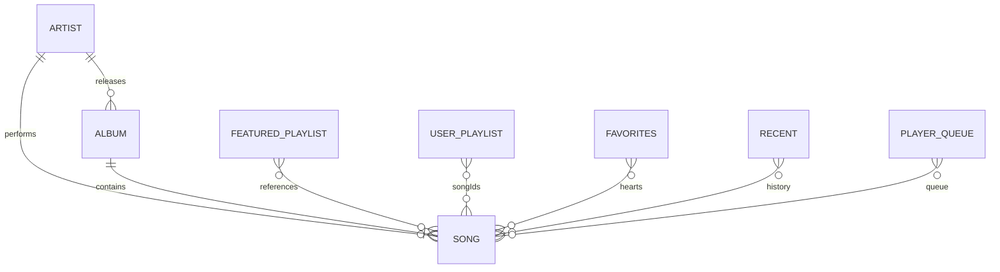
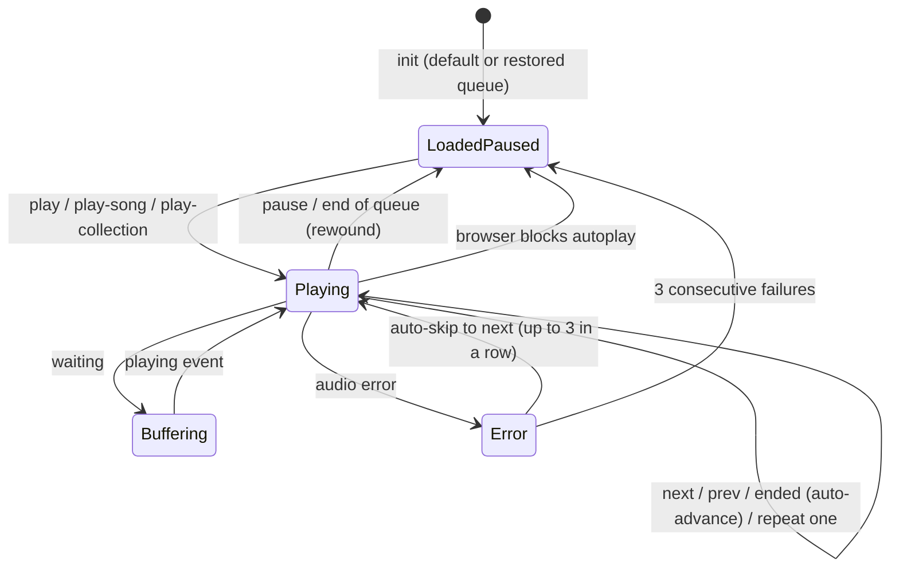
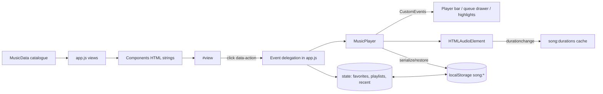

# Sóng Music App - Project Guideline

Audience: end users, developers, QA and business/product teams.
Scope: this document describes **only what is implemented** in the `music-app/` folder (static HTML/CSS/JS demo, no backend). Where behaviour is inferred or missing it is labelled **Assumption** or **Unknown / not implemented**.

UI language is English. Some catalogue content (song titles, artist bios, playlist names) is Vietnamese; original terms are kept, with English meaning in parentheses where useful.

---

## Table of Contents

1. [Project overview](#1-project-overview)
2. [User guideline](#2-user-guideline)
3. [Business guideline](#3-business-guideline)
4. [Feature details](#4-feature-details)
5. [Key workflows and module relationships](#5-key-workflows-and-module-relationships)
6. [Known limitations and gaps](#6-known-limitations-and-gaps)
7. [QA test checklist](#7-qa-test-checklist)
8. [Appendix: seed data and reference tables](#8-appendix-seed-data-and-reference-tables)

---

## 1. Project overview

### 1.1 Purpose

"Sóng" (Vietnamese for "wave") is a front-end **music streaming prototype**. It lets a visitor browse a small fictional catalogue, search, play music, build playlists, favourite songs and keep a listening history. Everything is client-side and stored in the browser; there is no server, no account system and no payments.

### 1.2 Tech stack

| Area | Technology |
| --- | --- |
| Markup | HTML5 (`index.html`, single page; semantic landmarks, `<dialog>` elements, SVG icon sprite) |
| Styling | CSS3 (`css/style.css`, CSS variables for dark/light theme; media queries at 1280, 1200, 1024, 640 px, `hover: none`, `prefers-reduced-motion`) |
| Logic | Vanilla JavaScript (ES6+), classic `<script>` tags (no modules, no build step, works from `file://`) |
| Audio | HTML5 `<audio>` element + Media Session API |
| Font | Google Fonts "Be Vietnam Pro" (falls back to system fonts offline) |
| Persistence | `window.localStorage` |
| Routing | Hash-based router (`#/home`, `#/album/<id>` ...) |
| Dependencies | None (no npm, no framework) |

### 1.3 File structure

```text
music-app/
├── index.html          App shell: icon sprite, sidebar, top bar, view container, queue drawer, player bar,
│                       mobile tab bar, <audio>, 3 dialogs, context menu, toast area, script tags
├── css/style.css       Theme tokens, layout, components, responsive rules
├── js/
│   ├── music-data.js   Catalogue (songs, artists, albums, featured playlists, seed playlists, genres),
│   │                   generated SVG artwork, helpers (normalize, formatTime, formatLong, formatCount)  -> window.MusicData
│   ├── storage.js      localStorage wrapper with "song:" prefix                                      -> window.AppStorage
│   ├── player.js       MusicPlayer class (queue, shuffle, repeat, seek, volume, events, Media Session) -> window.MusicPlayer
│   ├── components.js   Pure HTML-string template helpers (cards, track lists, section headers)       -> window.Components
│   └── app.js          Controller: state, router, views, event delegation, dialogs, menus, player UI
├── assets/
│   ├── audio/          empty (.gitkeep) - place own audio here
│   └── images/         empty (.gitkeep) - artwork is generated in code
├── README.md           Existing short readme
└── GUIDELINE.md        This file
```

Script load order (from `index.html`): `music-data.js` -> `storage.js` -> `player.js` -> `components.js` -> `app.js`. Order matters because each later file reads globals set by earlier ones.

### 1.4 How to run

1. Open `music-app/index.html` in a modern browser, **or**
2. In VS Code use "Open with Live Server" on `index.html`.

Requirements: internet connection for (a) audio streams from `https://www.soundhelix.com/examples/mp3/SoundHelix-Song-<n>.mp3` and (b) Google Fonts. Without internet the UI works but songs cannot play (see 4.6 error handling).

No install, build or test commands exist. **Unknown / not implemented:** automated tests, linting, deployment scripts.

### 1.5 Data storage (localStorage)

All keys are prefixed with `song:` (see `storage.js`). Values are JSON.

| Full key | Content | Written by | Notes |
| --- | --- | --- | --- |
| `song:theme` | `"dark"` or `"light"` | `applyTheme` (on toggle) | Also read by an inline script in `<head>` to avoid a theme flash |
| `song:favorites` | Array of song ids (numbers), insertion order | `persistFavorites` | Invalid ids are filtered on load |
| `song:playlists` | Array of user playlists `{id, name, songIds[], colors[2], createdAt}` | `persistPlaylists` | Seeded on first run (3 playlists) |
| `song:recent` | Array of song ids, most recent first, max 24 | `persistRecent` | |
| `song:player` | Player snapshot: `queue, original, index, shuffle, repeat, sourceKey, volume, muted, position` | `savePlayerState` | Saved on track/state/queue/volume change, every >5 s while playing, and on `pagehide` |
| `song:durations` | Map `{songId: seconds}` of real durations learned from audio metadata | `durationchange` handler | Overrides the approximate seed durations on next load |

Reset: DevTools -> Application -> Local Storage -> delete `song:*` keys, or run `AppStorage.clearAll(); location.reload();` in the console. Note: `clearAll` removes all six keys above, including the theme.

Storage failures (private mode, quota, disabled) are swallowed: reads return defaults, writes return `false` and log `[storage] Could not save <key>`.

### 1.6 Seed / mock data

- 16 songs, 8 artists, 8 albums, 6 featured (editorial) playlists, 8 genres, 3 starter user playlists. Full listing in [Appendix 8](#8-appendix-seed-data-and-reference-tables).
- All artists/albums/songs are fictional. Artwork is generated SVG (data URIs). Audio is 16 SoundHelix demo MP3s (song id n -> SoundHelix-Song-n).
- Play counts and follower counts are hard-coded numbers; they never change at runtime.

### 1.7 Demo credentials

**None.** There is no login, registration or user profile. The avatar icon in the top bar is decorative (`aria-hidden`, no click handler). Every visitor is the same anonymous local user.

---

## 2. User guideline

### 2.1 Roles

| Role | Description | Implemented? |
| --- | --- | --- |
| Visitor / Listener | Anyone who opens the page. Can use every feature. Data is private to this browser profile. | Yes (the only role) |
| Admin / Artist / Premium subscriber | - | **Unknown / not implemented** |

### 2.2 Screen and page map

| Route (hash) | Screen | Sidebar item highlighted | Purpose |
| --- | --- | --- | --- |
| `#/` or `#/home` | Home | Home | Greeting, hero album, Recently Played, Trending, Popular Artists, Recommended Albums/Playlists |
| `#/discover` (`?genre=<name>`) | Discover | Discover | Genre chips filter a track list; New releases; Playlists for every mood |
| `#/search` (`?q=<text>`) | Search | Search | Genre tiles when empty; grouped results when a query exists |
| `#/library` | Library | Library | Favorites tile, all user playlists, "New playlist" card, Recently Played shelf |
| `#/favorites` | Favorites | Favorites (shows count badge) | All hearted songs, newest first |
| `#/recent` | Recently Played | Recently Played | Last 24 songs, "Clear history" |
| `#/playlists` | Playlists | Playlists | "Your playlists" + "Made for you" (featured) |
| `#/albums` | Albums | Albums | All albums, newest year first |
| `#/artists` | Artists | Artists | All artists, most followers first |
| `#/album/<id>` | Album detail | Albums | Cover, meta, Play/Shuffle/Add to Playlist, tracks, "You might also like" |
| `#/artist/<id>` | Artist detail | Artists | Popular songs, discography, About, "Fans also like" |
| `#/playlist/<id>` | Playlist detail | Playlists | User or featured playlist; user ones can be renamed/deleted |
| any other hash | "Page not found" | none | Message + "Go home" button |

Persistent UI outside the routes:

| Area | Contents |
| --- | --- |
| Sidebar (desktop) / off-canvas drawer (<=1024 px) | Brand, Home/Discover/Search, "Your collection" links (Library, Favorites, Recently Played, Playlists, Albums, Artists), "Your Playlists" list with a "+" (Create playlist) button |
| Top bar | Menu button (compact layouts), Back/Forward, compact brand, search box (`/` hint), theme toggle, avatar (decorative) |
| Player bar (footer) | Cover, title (link to album), artist (link to artist), like button; shuffle, previous, play/pause, next, repeat; seek bar with elapsed/total time; mute, volume slider, queue button, "More options" (...) button |
| Queue drawer | "Now playing", "Next up", Clear, per-item remove |
| Mobile tab bar | Home, Discover, Search, Library, Favorites |
| Dialogs | Create/Rename playlist, Delete/Clear confirmation, Add to playlist |
| Toasts | Short status messages (max 3 visible, auto-dismiss after 2.6 s) |

### 2.3 Keyboard shortcuts

| Key | Action | Condition |
| --- | --- | --- |
| `Space` | Play / pause | Focus is not on a button/link/input |
| `Shift + Right` | Next track | Not typing in an input |
| `Shift + Left` | Previous track | Not typing in an input |
| `M` / `m` | Mute / unmute | Not typing |
| `L` / `l` | Favourite / unfavourite the current song | A song is loaded, not typing |
| `/` | Go to Search and focus the search box | Not typing |
| `Esc` | Close (in order): context menu, then queue drawer, then sidebar drawer. Ignored while a dialog is open (the dialog handles Esc natively) | |

Shortcuts are ignored while a dialog is open, or with Ctrl/Meta/Alt pressed.

### 2.4 Step-by-step: main tasks

**Play a song**
1. Click a song title/play button on a card, or the number/play area of a track row (clicking anywhere on a row that is not a link/button also plays it).
2. The player bar shows the song and starts playback. The clicked list becomes the queue, starting at that song.
3. Click the same song again to pause/resume.

**Play an album / artist / playlist / favorites / history**
1. Click the round play button on the card or detail page header.
2. The whole collection is queued from the beginning. Clicking it again while it is the active source toggles play/pause.
3. Click the shuffle icon on a detail page ("Shuffle play ...") to start in random order.

**Control playback**
1. Play/pause, previous, next buttons in the player bar (or `Space`, `Shift+Arrows`).
2. Drag the seek bar to jump within the song.
3. Drag the volume slider; click the speaker icon to mute/unmute.
4. Shuffle button toggles shuffle. Repeat button cycles Off -> All -> One song.

**Use the queue**
1. Click the queue icon in the player bar to open the drawer.
2. Click a queued song to play it; click the X to remove it; click "Clear" to remove all upcoming songs.
3. From any track row: `...` menu -> "Play next" or "Add to queue".

**Search**
1. Press `/` or click the search box and type. Results update about 180 ms after you stop typing. Accents are optional ("sai gon" finds "Sài Gòn").
2. Review the "Top result" card, the first 5 songs, then full song list (if more than 5), Artists, Albums, Playlists.
3. Clearing the box returns to the genre tiles view.

**Browse by genre**
1. Go to Discover (or click a genre tile on the Search page).
2. Click a chip (All, V-Pop, Pop, Indie, Electronic, R&B, Lo-fi, Rock, Ballad). The list filters instantly.

**Favourite a song**
1. Click the heart on a track row/player bar (or use `L` for the current song, or `...` -> "Add to Favorites").
2. View all on `Favorites` (newest first). Click the heart again to remove.

**Create a playlist**
1. Click "+" in the sidebar, "New playlist" on Library/Playlists, or the "New playlist" card.
2. Enter a name (max 40 characters). Default suggestion: `My Playlist #<n>`.
3. Click "Create". You are taken to the new (empty) playlist.

**Add songs to a playlist**
1. `...` on a song -> "Add to playlist...", or "Add to Playlist" on an album, a featured playlist or the hero.
2. In the dialog pick a playlist, or "New playlist" to create one that already contains the songs.
3. A toast confirms. Playlists that already contain all the chosen songs are shown as "Already added" and are not selectable.

**Remove a song from a playlist**
1. Open a user playlist. `...` on the song -> "Remove from this playlist".

**Rename / delete a playlist**
1. Open a user playlist. Click "Rename" (dialog, "Save") or "Delete" (confirmation "Delete playlist?"). Deletion returns you to Library.

**Clear listening history**
1. Recently Played -> "Clear history" -> confirm.

**Switch theme**
1. Click the sun/moon button in the top bar. The choice is remembered.

**Use on mobile/tablet**
1. Open the sidebar with the menu button (<=1024 px); use the bottom tab bar on small screens.

---

## 3. Business guideline

### 3.1 Domain overview

A read-only catalogue (artists, albums, songs, featured playlists, genres) is combined with a small amount of per-browser user data (favourites, user playlists, history, player state, preferences). There is no monetisation logic (no plans, prices, ads, royalties, limits) in the code. **Unknown / not implemented:** subscriptions, pricing, quotas, download/offline, social/sharing, follow artist, comments, lyrics.

### 3.2 Entities

**Catalogue entities (static, defined in `music-data.js`; cannot be edited by users)**

| Entity | Fields | Relationships |
| --- | --- | --- |
| Artist | `id` (slug), `name`, `genre`, `followers` (number), `colors[3]`, `bio`, derived `image` (SVG avatar with initials) | 1 artist -> N albums, N songs |
| Album | `id` (slug), `title`, `artistId`, `year`, `genre`, `variant` (art style), `colors[3]`, `description`; derived `artist` (name), `cover` (SVG) | belongs to 1 artist; has N songs |
| Song | `id` (int 1-16), `title`, `artistId`, `albumId`, `duration` (s), `plays` (number), SoundHelix track number; derived `artist`, `album`, `genre` (= album genre), `year` (= album year), `cover` (= album cover), `audio` (URL) | belongs to 1 album and 1 artist |
| Featured playlist ("Made for you") | `id`, `title`, `description`, `songIds[6]`, `colors`, `variant`; derived `cover` (SVG with title text) | references songs; read-only |
| Genre | `name`, `colors[2]`, `cover` (cover of first album with that genre) | 8 genres, derived from album genres |
| Hero | `albumId: 'midnight-postcards'` | Featured album on Home |

**User entities (stored in localStorage)**

| Entity | Fields | Notes |
| --- | --- | --- |
| User playlist | `id` (`u-<time base36><4 random chars>`; seeded ones `u-my-mix`, `u-road-trip`, `u-hoc-bai`), `name` (<=40 chars), `songIds[]` (unique, valid ids), `colors[2]`, `createdAt` | Colour pair chosen as `PALETTES[playlistCount % 6]` at creation time |
| Favorites | Set of song ids | Displayed newest first (reverse insertion order) |
| Recent | List of song ids, newest first, unique, max 24 | Recorded when playback actually starts |
| Player state | queue, original order, index, shuffle, repeat, sourceKey, volume, muted, position | Restored on reload (paused) |
| Duration cache | `{songId: seconds}` | Learned from audio metadata |
| Theme | `dark` / `light` | Default `dark` |

Entity relationship overview:



### 3.3 Permissions per role

Only one implicit role exists, so the matrix reduces to what is editable:

| Object | View | Create | Edit | Delete |
| --- | --- | --- | --- | --- |
| Artists / Albums / Songs / Genres | Yes | No | No | No |
| Featured playlists | Yes | No | No (only "Add to Playlist" copies songs to a user playlist) | No |
| User playlists | Yes | Yes | Rename; add/remove songs | Yes (with confirmation) |
| Favorites | Yes | Yes (heart) | - | Yes (un-heart) |
| Recently Played | Yes | Automatic | - | "Clear history" (all only; no per-item delete) |
| Queue | Yes | Add / Play next | Remove item, clear upcoming | Clear |

**Assumption:** since data lives in `localStorage`, "permission" is effectively per browser profile; any code running on the same origin can read/alter it.

### 3.4 Statuses and state transitions

There are no business "statuses" (e.g. draft/published). The meaningful state machines are below.

**Player state**

| State | How entered | Notes |
| --- | --- | --- |
| Empty (`is-empty`) | No queue | Only if the queue could not be initialised |
| Loaded-paused | Initial load (default queue = Top 10 trending, not autoplayed), restore from storage, end of queue, pause | Restored sessions never auto-resume |
| Playing | Any play action after a user gesture | Song added to Recently Played when it actually starts |
| Buffering | `waiting` event while `wantsPlay` | Body gets `is-buffering` |
| Blocked | Browser refuses autoplay (`NotAllowedError`) | Toast: "Press play to start listening" |
| Error | Audio fails to load | See 4.6 |



**Repeat mode:** `off -> all -> one -> off` (cycle on each click).
**Shuffle:** `off <-> on` toggle.
**Sidebar drawer** (<=1024 px): closed <-> open. **Queue drawer:** closed <-> open. **Theme:** dark <-> light.

### 3.5 Business rules

| # | Rule | Source |
| --- | --- | --- |
| BR-1 | Playlist names are trimmed, required (non-empty), truncated to 40 characters (input `maxlength="40"` plus `slice(0,40)`). Duplicate names are allowed. | `index.html`, `createPlaylist`, `promptRenamePlaylist` |
| BR-2 | A song can appear only once in a user playlist. Adding an existing song is skipped. | `addToPlaylist`, `createPlaylist` (Set) |
| BR-3 | Featured playlists cannot be renamed, deleted or edited; they offer "Add to Playlist" instead of Rename/Delete. | `viewPlaylist` |
| BR-4 | Deleting a playlist never deletes songs ("The songs stay in the catalogue."). | `promptDeletePlaylist` |
| BR-5 | Favorites list is shown newest first. | `collectionIds('favorites')` reverses the Set |
| BR-6 | Recently Played holds max 24 unique songs; re-playing a song moves it to the top. Home/Library shelf shows the first 12. | `addRecent`, `recent-cards` |
| BR-7 | A play is recorded to history only when audio actually starts (not on selecting/loading, not on restore). | `recordPending` in `bindPlayer` |
| BR-8 | "Trending" = top 10 songs by hard-coded `plays` (descending). The Artist page sorts songs by `plays` too. | `D.trending`, `songsByArtist` |
| BR-9 | Play counters are never incremented by listening. | code (no such logic) |
| BR-10 | Popular Artists sorted by `followers` desc; Albums page/New releases sorted by `year` desc (ties keep catalogue order). | `viewHome`, `viewArtists`, `viewAlbums`, `viewDiscover` |
| BR-11 | Song genre/year/cover are inherited from its album. | `music-data.js` |
| BR-12 | Home greeting depends on local hour: <5 "Late night listening", <12 "Good morning", <18 "Good afternoon", else "Good evening". | `viewHome` |
| BR-13 | Real durations replace the approximate ones once audio metadata loads (rounded to whole seconds) and are cached. | `durationchange` handler |
| BR-14 | Previous button restarts the song if more than 3 s have elapsed. | `MusicPlayer.prev` |
| BR-15 | Volume default 0.8 on first run. Un-muting at volume 0 restores 0.6. | `init`, `toggleMute` |

### 3.6 Calculations and formulas

| Item | Formula |
| --- | --- |
| Time display `formatTime(sec)` | Invalid/negative -> `0:00`; else `m:ss`, or `h:mm:ss` when >= 1 h |
| Long duration `formatLong(sec)` | `m = round(sec/60)`; `m < 60` -> `"<m> min"`; else `"<h> hr <m%60> min"` |
| Album/playlist total | Sum of `song.duration` (uses cached/real durations when known) |
| Counts `formatCount` | `Intl.NumberFormat('en', {notation:'compact', maxFractionDigits:1})`, e.g. 2480000 -> "2.5M" |
| Plural | `"<n> <word>"` + `s` unless n = 1 |
| Seek bar | 0-1000 scale; `value = round(currentTime / duration * 1000)`; seeking sets `currentTime = ratio * duration`, clamped to `[0, duration - 0.25]` |
| Volume slider | 0-100 maps to `audio.volume = v/100`; icon level: muted -> mute, `<50` -> low, else high |
| Search score | `3` exact match, `2` starts with, `1` contains, else `0` (on accent-stripped lower-case text). Top-result candidate score: artist name `+0.5`, song title `+0.3`, album title `+0.2`, playlist `+0`; only candidates with score >= 1 qualify; highest wins |
| Shuffle | Fisher-Yates shuffle of the rest of the queue; current song is kept first |
| Playlist colours | `PALETTES[playlists.length % 6]` at creation time |

**Pricing:** none. **Unknown / not implemented.**

### 3.7 Important scenarios

| Scenario | Behaviour |
| --- | --- |
| First visit | 3 seed playlists created; queue set to Top 10 trending (paused); volume 0.8; theme dark; empty history and favourites |
| Reload during playback | Queue, position, volume, mute, shuffle, repeat restored; stays paused; no auto-record to history until played |
| Same collection clicked twice | Second click toggles play/pause instead of restarting |
| Song not in catalogue (bad id in storage) | Filtered out silently on load |
| Storage disabled | App works for the session; nothing persisted (a console warning per failed write) |
| Offline | UI navigates; playback fails with offline toast |
| Delete the playlist you are viewing | Redirect to `#/library` |
| Delete a playlist whose songs are in the queue | Queue is unaffected (queue holds song ids, not playlist references) |

---

## 4. Feature details

### 4.1 Navigation and routing

- **Inputs:** URL hash. Patterns: `/` or `/home`, `/discover`, `/search`, `/library`, `/favorites`, `/recent`, `/playlists`, `/albums`, `/artists`, `/album/<id>`, `/artist/<id>`, `/playlist/<id>` (ids match `[\w-]+`).
- **Outputs:** View HTML injected into `#view`; `document.title = "<Title> · Sóng"`; active nav link marked with `is-active` / `aria-current="page"`; `body[data-route]` set.
- **Rules:** default hash is `#/home` (set with `replaceState` on load). Scroll resets to top only when the path changes. After navigation focus moves to the page title (`data-page-title`) or the search box on the Search page. On hash change the context menu and sidebar drawer close.
- **Errors:** unknown route, unknown album/artist/playlist id -> "Page not found" / "This page doesn't exist" / "The link may be broken or the playlist may have been deleted." with a "Go home" button.
- **Back/Forward buttons** call `history.back()` / `history.forward()`.

### 4.2 Home

- Hero: fixed album `midnight-postcards` ("Midnight Postcards" by Luna Rivers, 2024) with "Play Now" (label changes to "Pause" when that album is the active source and playing) and "Add to Playlist" (adds all album songs).
- Sections: Recently Played (first 12; empty state "Nothing played yet - Songs you play will appear here. Start with the featured album above or anything in Trending Music."), Trending Music (10 songs, compact two-column list, subtitle "Most played on Sóng this week" - static, see limitations), Popular Artists, Recommended Albums, Recommended Playlists (featured playlists). "Show all" links go to `#/recent`, `#/artists`, `#/albums`, `#/playlists`.
- Shelf scroll arrows scroll by 80% of the shelf width (smooth unless reduced-motion).

### 4.3 Discover

- **Inputs:** genre chip click or `?genre=<Name>`.
- **Rules:** valid genre in the URL is applied; no genre param -> "All"; an unknown genre value leaves the previously selected genre unchanged (**Assumption:** unintended). Chip click updates the URL with `history.replaceState` (no new history entry) and re-renders only the list.
- **Output:** heading "All tracks" (sorted by plays desc) or the genre name with "<n> song(s)"; then "New releases" (albums by year desc) and "Playlists for every mood".
- **Edge:** a genre with no songs would render a heading and no rows (all 8 current genres have songs).

### 4.4 Search

- **Input:** free text in the top bar. Typing debounced 180 ms; Enter submits immediately. Whitespace-only query = no query.
- **Matching:** case- and accent-insensitive (NFD strip, `đ`->`d`), substring match.
  - Songs: title, artist name or album title.
  - Artists: name or genre.
  - Albums: title or artist name.
  - Playlists (user + featured): title or description (user playlists have empty description).
- **Ordering:** songs by title score desc, then plays desc.
- **Output:** heading `"<q>"` and "<n> result(s) found"; "Top result" card (Artist/Song/Album/Playlist pill with play button); "Songs" (first 5); "All matching songs" only when more than 5 songs match; Artists, Albums, Playlists shelves (scroll arrows when more than 4).
- **Empty query:** "Browse all" page with genre tiles (each links to `#/discover?genre=<name>`).
- **No results:** title `No results for "<q>"`, text "Check the spelling, try fewer words, or search for an artist or genre instead.", button "Browse genres".
- **Edge cases:** the query is HTML-escaped when rendered. The search box is cleared when navigating to a non-search route (unless focused). While on `/search` typing replaces the history entry instead of adding one. A query that matches only through artist/album (title score 0) yields no Top result unless an artist/album candidate scores >= 1.

### 4.5 Playback

| Function | Behaviour |
| --- | --- |
| `play-song` on a list | Queue = ids in the list's `data-queue`, start at clicked index, source = list `data-source`. If clicked song is already current -> toggle play/pause |
| `play-collection` | Queue = collection ids (album order, artist songs by plays desc, playlist order, favorites newest first, history order, chart = trending 10). Empty collection -> toast "Nothing to play here yet". If `sourceKey` (`<type>:<id>`) equals current source and a song is loaded -> toggle |
| `shuffle-collection` | Turns global shuffle **on**, starts at a random index, first song stays at position 0 of the shuffled queue |
| Next | Index+1; wraps to first song even when repeat is off |
| Previous | If `currentTime > 3` -> restart; else index-1; at the first song: repeat "all" wraps to last, otherwise restart the song |
| Auto-advance (`ended`) | Repeat "one": replay. Otherwise next if not last, or if repeat "all". At end of queue with repeat off: stays on last song, rewound and paused; toast "End of queue" |
| Seek | Slider `input` previews time; `change` commits. If duration not yet known, seek is deferred (`_pendingSeek`) |
| Volume/mute | Slider and speaker button; moving volume above 0 auto-unmutes |
| Shuffle toggle | Toast "Shuffle on"/"Shuffle off". Turning on: current song first, rest shuffled, original order stored. Turning off: original order restored, position = current song |
| Repeat cycle | Toast "Repeat: off" / "Repeat: all" / "Repeat: one song" |
| Media Session | Handlers: play, pause, previoustrack, nexttrack, seekto; metadata title/artist/album/artwork (SVG cover) |
| Autoplay blocked | Toast "Press play to start listening" |
| Buffering | Body class `is-buffering` while `waiting` and play requested |

**Player bar link behaviour:** title and cover link to the album page; artist links to the artist page; like button toggles the current song.

### 4.6 Playback error handling

| Condition | Behaviour / message |
| --- | --- |
| Error event on a restored (not user-started) track | Ignored (no skip, no message) |
| `navigator.onLine === false` | Toast: `You're offline. Audio streams need an internet connection.` (no skip) |
| Online error, streak < min(3, queue length) | Toast: `Couldn't load "<title>". Skipping to the next song.` then `next()` after 1.2 s |
| Streak reaches min(3, queue length) | Pause and toast: `Audio couldn't be loaded. Check your connection and press play to retry.`; streak reset |
| Successful `playing` event | Streak reset to 0 |

### 4.7 Queue

| Action | Where | Behaviour |
| --- | --- | --- |
| Open/close | Player bar queue icon, player "..." menu ("Show queue"/"Hide queue"), `Esc`, X | Drawer has `inert` when closed; focus moves to the close button on open |
| Play next | Song `...` menu | Inserts right after current; toast "Playing next". If queue is empty -> starts playing it |
| Add to queue | Song `...` menu | Appends; toast "Added to queue". If queue is empty -> loads paused |
| Play queued item | Click item | Current item -> toggle; other -> `playAt(index)` |
| Remove item | X on non-current item | Current item cannot be removed |
| Clear | "Clear" (only shown if there are upcoming songs) | Removes all after current; toast "Queue cleared" |
| Notes | Below "Next up" | "Shuffle is on. Repeat: All/One song." if active; empty text: "Nothing else queued. Use "Add to queue" in any song's ... menu." or (repeat all) "The queue will start again from the top." |
| Empty drawer | | "Your queue is empty" / "Play something and upcoming songs will line up here." |

The same song may appear several times in the queue (add to queue is not de-duplicated).

### 4.8 Favorites

- **Toggle:** heart button (`data-like-id`), player bar heart, `L` key, `...` menu ("Add to Favorites"/"Remove from Favorites").
- **Output:** toast "Added to Favorites" / "Removed from Favorites"; all hearts for that song update (`aria-pressed`, pop animation); sidebar count badge (empty when 0); Favorites page/Library tile counts refresh live.
- **Favorites page:** header "Favorites - Every song you've hearted, newest first." with count `<n> song(s)`; play and shuffle buttons; empty state "Songs you like will appear here / Tap the heart next to any song to save it to Favorites." with "Find songs".
- **Edge:** `L` does nothing if no song loaded.

### 4.9 Recently Played

- Recorded on the first `statechange` where audio is playing after a `trackchange`.
- Page: "The last 24 songs you played on this device."; empty state "Your listening history is empty / Play any song and it will be saved here, even after you refresh the page." with "Discover music".
- "Clear history": confirm dialog title `Clear listening history?`, message `This removes every song from Recently Played on this device.`, confirm button `Clear history`. No-op if history is already empty. Toast: `Listening history cleared`.

### 4.10 Playlists

| Action | Inputs | Outputs / messages |
| --- | --- | --- |
| Create | Name (required, `maxlength=40`, default `My Playlist #<count+1>`) | Toast `Created "<name>"` (or `Created "<name>" with <n> song(s)` when created from Add-to-playlist). From the "+" / New playlist buttons user is navigated to the new playlist |
| Cancel / empty name / Esc / backdrop click | | Nothing is created and **no message** is shown (empty input also blocked by the HTML `required` attribute; whitespace-only returns null silently) |
| Rename | New name | Toast `Playlist renamed`. No-op if empty or unchanged |
| Delete | Confirm | Title `Delete playlist?`; message `"<name>" will be removed from your library. The songs stay in the catalogue.`; toast `Deleted "<name>"`; if viewing it -> go to Library |
| Add songs | Playlist pick | One song: `Added to "<name>"`; several: `Added <n> song(s) to "<name>"` (n = newly added); none new: `Already in "<name>"` |
| Pick disabled playlist (all songs present) | Click | Toast `Already in this playlist` |
| No playlists yet | Add dialog | "You don't have any playlists yet." (New playlist button still available) |
| Remove song | Song `...` menu on user playlist only | Toast `Removed from "<name>"`; view re-renders |
| Sidebar list | | Shows art (mosaic of up to 4 unique covers, single cover, or coloured placeholder), name, "<n> song(s)"; empty: "No playlists yet. Use + to create one." |
| Empty playlist page | | "This playlist is empty / Use the ... menu next to any song, or "Add to Playlist" on an album, to add music here." with "Find songs" |

Playlist page header meta: `<n> song(s), <formatLong total>`. Kicker: "Your playlist" (user) or "Playlist made for you" (featured). Playlists are not reorderable.

### 4.11 Song context menu ("..." on a track row)

Items in order: Play next, Add to queue, Add to playlist..., (Remove from this playlist - only on a user playlist page, styled danger), separator, Add to / Remove from Favorites, Go to album, Go to artist. Keyboard: Arrow Up/Down, Home, End, Tab closes, Esc closes and returns focus. Clicking outside, scrolling `#main` (after 250 ms) or resizing the window closes it. It is positioned below the button, flipped above if it would overflow.

Player bar "..." menu: Add to playlist..., Go to album, Go to artist (these three only when a song is loaded), separator, "Shuffle: On/Off", "Repeat: Off/All/One song", "Show queue"/"Hide queue".

### 4.12 Theme

- Default `dark`; stored in `song:theme`; applied by an inline head script before first paint and again by `applyTheme` (also updates `<meta name="theme-color">`: `#0d1220` dark, `#f3f5fa` light; button label "Switch to light mode"/"Switch to dark mode").

### 4.13 Responsive behaviour

| Width | Layout (from CSS breakpoints and JS `max-width: 1024px` query) |
| --- | --- |
| >1024 px | Fixed sidebar |
| <=1024 px | Sidebar becomes an off-canvas drawer (`inert` when closed), opened by the menu button, closed via scrim, Esc, link click |
| <=640 px | Bottom tab bar, compact player, swipeable shelves |
| `hover: none` | Touch-specific tweaks |
| `prefers-reduced-motion` | Animations/smooth scroll reduced |

**Assumption:** exact visual differences at 1280/1200 px are cosmetic; they were not analysed in detail.

### 4.14 Accessibility features present

Skip link ("Skip to content"), landmarks, `aria-pressed`/`aria-expanded`/`aria-current`, labelled icon buttons, `role="status" aria-live="polite"` toast region, native `<dialog>` modals, `inert` on closed drawers, focus management on route change, slider `aria-valuetext`.

---

## 5. Key workflows and module relationships

### 5.1 Module dependency

```text
index.html
  ├─ music-data.js  ──> window.MusicData      (no deps)
  ├─ storage.js     ──> window.AppStorage     (no deps)
  ├─ player.js      ──> window.MusicPlayer    (no deps; gets song resolver injected)
  ├─ components.js  ──> window.Components     (uses MusicData; isLiked injected via Components.init)
  └─ app.js         uses MusicData, AppStorage, MusicPlayer, Components
```

| Module | Responsibility | Talks to |
| --- | --- | --- |
| `music-data.js` | Static catalogue + lookup and format helpers | read by all |
| `storage.js` | `get/set/remove/clearAll` with `song:` prefix, `KEYS` | app.js, inline head script (reads `song:theme` directly) |
| `player.js` | Audio + queue logic. Emits DOM `CustomEvent`s: `trackchange`, `statechange`, `timeupdate`, `durationchange`, `queuechange`, `volumechange`, `playing`, `buffering`, `error`, `blocked`, `queueend` | app.js listens in `bindPlayer` |
| `components.js` | Pure functions returning HTML strings using `data-action` attributes | called by app.js views |
| `app.js` | State (`favorites`, `playlists`, `recent`, `theme`, `discoverGenre`, `queueOpen`), router, views, single document-level click handler dispatching `data-action`, dialogs, menus, toasts | all |

### 5.2 Data flow



### 5.3 Workflow: play a song from a list

```text
click [data-action=play-song]
  -> playSongFromEl(el)
       same song already current? -> player.toggle()
       else ids = list.dataset.queue ; index = ids.indexOf(id)
            -> player.setQueue(ids, index, {autoplay, source})
                 -> emits queuechange -> renderQueue + save state
                 -> _load(): audio.src = song.audio ; emits trackchange (recordPending = true)
                 -> play() ; browser 'play'/'playing' -> statechange
                       -> addRecent(id) (once) -> persist -> refresh Recent widgets
```

### 5.4 Workflow: add songs to a playlist

```text
"..." -> Add to playlist... / "Add to Playlist" button
  -> openAddToPlaylist(ids)  (dialog lists playlists; fully-contained ones disabled)
      pick playlist -> addToPlaylist(pid, ids) -> dedupe -> persist -> refresh sidebar (+ page if relevant) -> toast
      "New playlist" -> askName -> createPlaylist(name, ids) -> persist -> toast
```

### 5.5 Workflow: app start

```text
init()
  apply theme -> render sidebar playlists -> update favorites badge -> bindPlayer()
  player.restore(song:player)?  yes -> queue restored, paused, seek deferred to loadedmetadata
                                no  -> volume 0.8, queue = Top 10 trending (paused)
  render player bar -> set default hash #/home -> render() route
```

### 5.6 Key relationships between features

- Favorites, Recently Played and playlists change -> "live regions" (`data-live`) re-render in place (recent shelves/lists, favorites list/count, Library tile meta, Discover list) without a full page render; playlist edits re-render the current page only if it is that playlist, the Library or the Playlists page.
- `sourceKey` (`album:<id>`, `artist:<id>`, `playlist:<id>`, `favorites:all`, `recent:all`, `chart:trending`, `genre:<name>`, `search`) links the player to on-screen elements: elements with `data-source-key` get `is-source`, so the matching play button shows "pause" while playing.
- The currently playing song is highlighted everywhere (`is-current` on `[data-song-id]`).
- Durations learned by the player update every rendered `[data-dur-id]` and the stored cache.

---

## 6. Known limitations and gaps

| # | Observation | Type |
| --- | --- | --- |
| L-1 | No authentication, profiles or roles; the avatar is decorative. Data is per browser/profile and not synced. | Not implemented |
| L-2 | Audio depends on the external SoundHelix site and its availability; all 16 songs are generic demo tracks unrelated to titles. No bundled audio. | Design |
| L-3 | Catalogue is hard-coded; there is no admin, import or API. Play counts/followers/"Most played this week" never change. | Not implemented |
| L-4 | No "follow artist", sharing, lyrics, downloads, ratings, comments. | Not implemented |
| L-5 | Playlists cannot be reordered, and songs cannot be dragged; no per-item removal from Recently Played; no bulk operations. | Not implemented |
| L-6 | Creating/renaming with a blank name closes the dialog silently (no validation message). Duplicate playlist names are allowed. | Gap |
| L-7 | `Next` wraps to the first song even with repeat off (only auto-advance stops at the end). | Behaviour |
| L-8 | `Shuffle play` on a page turns on the global shuffle and it stays on for later plays; Previous in shuffle follows the shuffled order (no separate history). | Behaviour |
| L-9 | An invalid `?genre=` value on Discover keeps the previous selection instead of resetting. | Gap |
| L-10 | `AppStorage.clearAll()` also clears the theme; reload then reverts to dark. | Behaviour |
| L-11 | `MusicPlayer.seekBy` exists but is not bound to any key or button. | Dead code |
| L-12 | Media Session artwork is declared as 400x400 `image/svg+xml`; some OS UIs may not render SVG artwork. | **Assumption** (not tested) |
| L-13 | Search only substring-matches; no fuzzy match, no typo tolerance, no pagination or limit on lists. Playlist search compares only the title (user playlists have no description). | Limitation |
| L-14 | Queue permits duplicates (Add to queue twice); removing/adding uses id lookups (`lastIndexOf` in `original`), so in shuffled queues with duplicates the "original" order reconstruction may differ. | **Assumption** (from reading the code, not run) |
| L-15 | Playlist ids use time + random; theoretically not guaranteed unique but collisions are very unlikely. | Note |
| L-16 | localStorage is unencrypted and shared by any script on the same origin; there is no versioning/migration of stored data. | Not implemented |
| L-17 | No automated tests, CI or linting. README states manual testing only. | Not implemented |
| L-18 | External Google Font requires internet; system font fallback otherwise. | Design |
| L-19 | Error auto-skip counts consecutive failures only up to `min(3, queue length)`; in a queue of 1 song the first failure stops playback with the "Audio couldn't be loaded" message. | Behaviour |
| L-20 | No internationalisation: UI strings are English only, mixed with Vietnamese content. | Not implemented |

---

## 7. QA test checklist

Preconditions: fresh profile (or cleared `song:*` keys) unless stated; internet available.

### 7.1 First run and persistence

| ID | Steps | Expected |
| --- | --- | --- |
| TC-001 | Open `index.html` first time | Home at `#/home`, dark theme, player shows a Top-10 trending song, paused, volume 80 |
| TC-002 | Check sidebar "Your Playlists" | "My Mix" (4 songs), "Road Trip" (5), "Học Bài" (3) |
| TC-003 | Favorites badge | Empty (no number) |
| TC-004 | Play a song, wait, reload | Same song/position restored, paused; volume, shuffle, repeat retained |
| TC-005 | Toggle theme, reload | Theme remembered, no flash of the other theme |
| TC-006 | Run `AppStorage.clearAll(); location.reload()` | Data reset to first-run state (theme dark) |
| TC-007 | Block storage / private mode | App works; no crash |

### 7.2 Navigation and routing

| ID | Steps | Expected |
| --- | --- | --- |
| TC-010 | Visit each route in 2.2 | Correct page, correct sidebar highlight, document title `<Title> · Sóng` |
| TC-011 | Open `#/album/does-not-exist`, `#/artist/x`, `#/playlist/x`, `#/random` | "Page not found" with "Go home" |
| TC-012 | Click Back/Forward buttons | Browser history navigation works |
| TC-013 | Navigate between pages | Page scrolls to top; focus goes to page heading |
| TC-014 | Empty hash | Redirects to `#/home` |

### 7.3 Playback

| ID | Steps | Expected |
| --- | --- | --- |
| TC-020 | Click a track row (not on link/button) | Song plays; queue = that list starting at the row |
| TC-021 | Click the same song again | Pauses; again resumes |
| TC-022 | Click album play button twice | Plays from track 1, then toggles pause |
| TC-023 | Next at the last song (repeat off) | Wraps to first song and plays |
| TC-024 | Song ends at last track, repeat off | Stops, rewound at 0:00, paused, toast "End of queue" |
| TC-025 | Repeat: All, end of last track | Restarts queue from the first track |
| TC-026 | Repeat: One | Same song replays after ending |
| TC-027 | Previous after >3 s | Restarts current song |
| TC-028 | Previous within 3 s on first track, repeat off | Restarts the song; repeat all -> jumps to last track |
| TC-029 | Drag seek bar | Time preview updates during drag; playback jumps on release |
| TC-030 | Volume slider to 0, then click speaker | Unmutes to 60% |
| TC-031 | Mute via `M` | Icon changes, label "Unmute" |
| TC-032 | Shuffle on during playback | Current song stays first; queue order changes; off restores original order with current song position |
| TC-033 | Shuffle button on a detail page | Random start, shuffle enabled in player bar |
| TC-034 | Unknown/blocked autoplay (fresh page, keyboard action) | Toast "Press play to start listening" if the browser blocks |
| TC-035 | Duration display | Total time corrects to real duration after load; list durations update |
| TC-036 | OS media keys (if supported) | Play/pause/next/previous work; metadata shown |

### 7.4 Errors

| ID | Steps | Expected |
| --- | --- | --- |
| TC-040 | Go offline, press play | Toast "You're offline. Audio streams need an internet connection." |
| TC-041 | Block soundhelix.com (online), play in a multi-song queue | Toasts "Couldn't load ... Skipping to the next song." then after 3 consecutive failures pause + "Audio couldn't be loaded. Check your connection and press play to retry." |
| TC-042 | Reload with a restored track while offline | No error toast or skip |

### 7.5 Queue

| ID | Steps | Expected |
| --- | --- | --- |
| TC-050 | Open queue drawer | Shows Now playing and Next up; `Esc` closes it |
| TC-051 | "Play next" on a song | Appears right after current; toast "Playing next" |
| TC-052 | "Add to queue" | Appended at end; toast "Added to queue" |
| TC-053 | Remove a queued song via X | Removed; current cannot be removed (no X) |
| TC-054 | "Clear" | Upcoming cleared, toast "Queue cleared"; note text shown |
| TC-055 | Click a queued song | Jumps to and plays it |

### 7.6 Search

| ID | Steps | Expected |
| --- | --- | --- |
| TC-060 | Press `/` | Goes to Search, box focused |
| TC-061 | Type `sai gon` | Finds "Sài Gòn Mơ" album/tracks (accent-insensitive) |
| TC-062 | Type `pho cu` | Finds "Phố Cũ" |
| TC-063 | Type `luna` | Top result is artist Luna Rivers; songs list shows her songs |
| TC-064 | Type a query with >5 song matches (e.g. a single letter such as `a`) | "All matching songs" section appears |
| TC-065 | Type `zzzz` | Empty state: No results for "zzzz" + "Browse genres" |
| TC-066 | Type `<b>x</b>` | Rendered as text, no HTML injection |
| TC-067 | Clear the box | Genre tiles view returns |
| TC-068 | Click a genre tile | Discover with that chip selected |
| TC-069 | Type quickly | Only one navigation after ~180 ms; history not flooded while already on Search |

### 7.7 Discover

| ID | Steps | Expected |
| --- | --- | --- |
| TC-070 | Click each genre chip | List filtered; heading shows genre and count; `aria-pressed` updates; URL updated |
| TC-071 | Click "All" | Sorted by plays desc, heading "All tracks 16 songs" |
| TC-072 | Open `#/discover?genre=Rock` directly | Rock chip active |
| TC-073 | Open `#/discover?genre=Nope` | Previously selected genre remains (see L-9) |

### 7.8 Favorites

| ID | Steps | Expected |
| --- | --- | --- |
| TC-080 | Heart a song | Toast "Added to Favorites"; sidebar badge = 1; all hearts of that song filled |
| TC-081 | Press `L` with a song loaded | Toggles favourite of current song |
| TC-082 | Favorites page ordering | Newest hearted song first |
| TC-083 | Un-heart on Favorites page | Row disappears immediately; empty state when none |
| TC-084 | Reload | Favourites persist |

### 7.9 Recently Played

| ID | Steps | Expected |
| --- | --- | --- |
| TC-090 | Play 3 songs | They appear newest first on Home shelf and `#/recent` |
| TC-091 | Select a song but it is blocked/never starts | Not recorded |
| TC-092 | Replay an older song | Moves to top, no duplicate |
| TC-093 | Play more than 24 distinct songs (catalogue only has 16) | **Not testable with seed data**; max 24 enforced in code |
| TC-094 | Clear history -> Cancel | Nothing changes |
| TC-095 | Clear history -> confirm | Toast "Listening history cleared"; empty states |

### 7.10 Playlists

| ID | Steps | Expected |
| --- | --- | --- |
| TC-100 | Create playlist "Test" via sidebar "+" | Dialog default `My Playlist #4`; after Create, navigates to empty playlist; toast `Created "Test"` |
| TC-101 | Enter 60-character name | Field stops at 40 characters |
| TC-102 | Clear the field and submit | Blocked by required validation (no playlist) |
| TC-103 | Enter only spaces and submit | Dialog closes, nothing created, no message |
| TC-104 | Cancel / Esc / click backdrop | Nothing created |
| TC-105 | Add a song already present | Toast `Already in "<name>"`; dialog shows "Already added" |
| TC-106 | Add album via "Add to Playlist" (some songs present) | Toast `Added <n> songs to "<name>"` with only new songs |
| TC-107 | "New playlist" inside the Add dialog | Playlist created containing chosen songs; toast `Created "<name>" with <n> song(s)` |
| TC-108 | Remove song from user playlist | Toast `Removed from "<name>"`; list updates; sidebar count updates |
| TC-109 | Rename with same name / empty | No change, no toast |
| TC-110 | Rename to new name | Toast "Playlist renamed"; sidebar/title updated |
| TC-111 | Delete -> Cancel / Delete | Cancel keeps; Delete removes, toast, redirected to Library |
| TC-112 | Open featured playlist | No Rename/Delete; has "Add to Playlist"; no "Remove from this playlist" in song menu |
| TC-113 | Playlist art | 0 songs: coloured placeholder; 1-3 unique covers: first cover; 4+: 2x2 mosaic |
| TC-114 | Delete all playlists | Sidebar shows "No playlists yet. Use + to create one."; Add dialog shows "You don't have any playlists yet." |
| TC-115 | Create special chars `<script>` as name | Displayed as text (escaped) |

### 7.11 UI, theme and responsive

| ID | Steps | Expected |
| --- | --- | --- |
| TC-120 | Toggle theme | Colours switch; button label updates; persists |
| TC-121 | Resize to <=1024 px | Sidebar hidden; menu button opens drawer; scrim/Esc/link click closes |
| TC-122 | Resize to <=640 px | Bottom tab bar visible; player compact |
| TC-123 | Open song menu and scroll/resize | Menu closes (not within the first 250 ms) |
| TC-124 | Keyboard: navigate menu with arrows, Home, End, Tab, Esc | As described in 4.11 |
| TC-125 | `Space` with focus on a button | Activates the button, does not toggle playback |
| TC-126 | Toasts | Max 3 at once, auto-dismiss ~2.6 s |
| TC-127 | Reduced-motion OS setting | No smooth scrolling / animations |
| TC-128 | Screen reader / tab order | Skip link works; dialogs trap focus (native) |

---

## 8. Appendix: seed data and reference tables

### 8.1 Songs (16)

| ID | Title | Artist | Album | Genre | Duration seed (s) | Plays |
| --- | --- | --- | --- | --- | --- | --- |
| 1 | Perfect Night | Luna Rivers | Midnight Postcards | Pop | 372 | 48,210,331 |
| 2 | Mưa Tháng Sáu (June Rain) | Hà Linh | Mùa Hạ | V-Pop | 425 | 39,120,442 |
| 3 | Phố Cũ (Old Street) | Đông Phong | Hà Nội Về Đêm | Indie | 344 | 12,840,551 |
| 4 | Neon Hearts | Kai Sato | City Pulse | Electronic | 302 | 27,410,093 |
| 5 | Chạm Vào Nắng (Touch the Sun) | Hà Linh | Mùa Hạ | V-Pop | 353 | 33,500,210 |
| 6 | Amber Hour | Aria Vale | Paper Moons | R&B | 325 | 21,980,034 |
| 7 | Đêm Sài Gòn (Saigon Night) | Mây Trắng | Sài Gòn Mơ | Lo-fi | 426 | 9,870,112 |
| 8 | Perfectly Lost | The Northern Lights | Wildfield | Rock | 305 | 18,230,990 |
| 9 | Stardust Avenue | Luna Rivers | Midnight Postcards | Pop | 300 | 30,110,477 |
| 10 | Gió Biển (Sea Wind) | Bảo Khang | Miền Trung Nắng Gió | Ballad | 336 | 15,670,321 |
| 11 | Low Tide | Aria Vale | Paper Moons | R&B | 313 | 11,450,876 |
| 12 | Sóng Vỗ Bờ Xa (Waves on a Far Shore) | Bảo Khang | Miền Trung Nắng Gió | Ballad | 357 | 8,930,445 |
| 13 | Overdrive | Kai Sato | City Pulse | Electronic | 274 | 24,400,120 |
| 14 | Café Sáng (Morning Coffee) | Mây Trắng | Sài Gòn Mơ | Lo-fi | 310 | 13,210,567 |
| 15 | Echoes in the Pines | The Northern Lights | Wildfield | Rock | 328 | 10,020,389 |
| 16 | Ngày Mai Trời Lại Sáng (Tomorrow the Sky Brightens) | Đông Phong | Hà Nội Về Đêm | Indie | 237 | 16,780,214 |

Trending Top 10 (by plays): 1, 2, 5, 9, 4, 13, 6, 8, 16, 10 (derived from the table above).

### 8.2 Artists (8)

| ID | Name | Genre | Followers |
| --- | --- | --- | --- |
| luna-rivers | Luna Rivers | Pop | 2,480,000 |
| ha-linh | Hà Linh | V-Pop | 1,920,000 |
| kai-sato | Kai Sato | Electronic | 1,310,000 |
| northern-lights | The Northern Lights | Rock | 1,070,000 |
| aria-vale | Aria Vale | R&B | 890,000 |
| bao-khang | Bảo Khang | Ballad | 770,000 |
| dong-phong | Đông Phong | Indie | 640,000 |
| may-trang | Mây Trắng | Lo-fi | 455,000 |

### 8.3 Albums (8)

| ID | Title | Artist | Year | Genre |
| --- | --- | --- | --- | --- |
| midnight-postcards | Midnight Postcards | Luna Rivers | 2024 | Pop |
| mua-ha | Mùa Hạ (Summer) | Hà Linh | 2023 | V-Pop |
| ha-noi-ve-dem | Hà Nội Về Đêm (Hanoi at Night) | Đông Phong | 2021 | Indie |
| city-pulse | City Pulse | Kai Sato | 2024 | Electronic |
| paper-moons | Paper Moons | Aria Vale | 2022 | R&B |
| sai-gon-mo | Sài Gòn Mơ (Saigon Dream) | Mây Trắng | 2023 | Lo-fi |
| wildfield | Wildfield | The Northern Lights | 2020 | Rock |
| mien-trung | Miền Trung Nắng Gió (Central Vietnam, Sun and Wind) | Bảo Khang | 2024 | Ballad |

### 8.4 Featured playlists (6) and starter user playlists (3)

| ID | Title | Song ids |
| --- | --- | --- |
| chill-vibes | Chill Vibes | 7, 14, 11, 6, 3, 12 |
| vpop-hom-nay | V-Pop Hôm Nay (V-Pop Today) | 2, 5, 10, 16, 3, 12 |
| workout-energy | Workout Energy | 13, 4, 8, 1, 15, 9 |
| late-night-drive | Late Night Drive | 4, 1, 9, 13, 6, 11 |
| ca-phe-cuoi-tuan | Cà Phê Cuối Tuần (Weekend Coffee) | 14, 7, 3, 16, 11, 5 |
| focus-flow | Focus Flow | 15, 12, 10, 7, 14, 4 |
| u-my-mix (user) | My Mix | 1, 2, 4, 6 |
| u-road-trip (user) | Road Trip | 8, 13, 9, 10, 15 |
| u-hoc-bai (user) | Học Bài (Study) | 14, 7, 12 |

### 8.5 Genres (8)

All, V-Pop, Pop, Indie, Electronic, R&B, Lo-fi, Rock, Ballad ("All" is a UI filter, not a genre entity; the 8 real genres are derived from albums).

### 8.6 `sourceKey` values

`album:<id>`, `artist:<id>`, `playlist:<id>`, `favorites:all` / `favorites` collection (`favorites:all` on the page; `playCollection('favorites','all')` -> key `favorites:all`), `recent:all`, `chart:trending` (initial queue and Home Trending list), `genre:<name>` (Discover list), `search`.

### 8.7 Data-action reference (event delegation)

`play-song`, `play-collection`, `shuffle-collection`, `toggle-like`, `song-menu`, `add-to-playlist`, `create-playlist`, `rename-playlist`, `delete-playlist`, `toggle-theme`, `toggle-sidebar`, `close-sidebar`, `close-queue`, `queue-play`, `queue-remove`, `queue-clear`, `clear-recent`, `genre`, `scroll-shelf`, `history-back`, `history-forward`.
