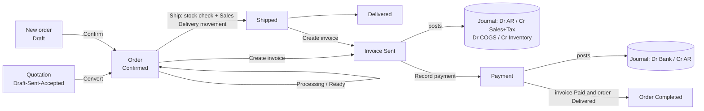
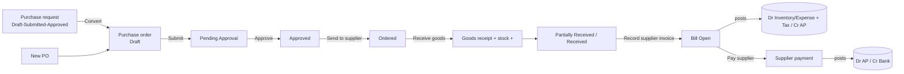

# NEXUS ERP - Complete Guideline

Audience: end users, business analysts, developers, QA engineers and business stakeholders.

Scope: this document describes NEXUS ERP exactly as it is implemented in the source code of the `nexus-erp` folder (`index.html`, `script.js`, `style.css`, `js/*.js`, `README.md`). Nothing here is a product promise beyond the code. Where the code is silent, ambiguous or incomplete, the item is labelled **Assumption** or **Unknown / not implemented**.

Conventions used in this document:

- UI text is English. There is no Vietnamese UI text in the code, except that **VND** (Vietnamese Dong) is one of the selectable display currencies ("VND - Vietnamese Dong"). Where a Vietnamese business term is useful it is given in parentheses, for example "Accounts Receivable (Cong no phai thu)". Those Vietnamese terms are explanatory only and are not shown in the UI.
- Quoted strings in `"double quotes"` or `code style` are the literal messages/constants found in the code.
- File references are relative to the `nexus-erp` folder.

---

## Table of Contents

1. [Project overview](#1-project-overview)
   1. [Purpose and scope](#11-purpose-and-scope)
   2. [Technology stack](#12-technology-stack)
   3. [File structure](#13-file-structure)
   4. [How to run](#14-how-to-run)
   5. [Data storage (localStorage)](#15-data-storage-localstorage)
   6. [Seed / mock data](#16-seed--mock-data)
   7. [Demo credentials](#17-demo-credentials)
2. [User guideline](#2-user-guideline)
   1. [Signing in, signing out, switching user](#21-signing-in-signing-out-switching-user)
   2. [Application layout](#22-application-layout)
   3. [Roles](#23-roles)
   4. [Screen catalogue (every page)](#24-screen-catalogue-every-page)
   5. [Common list-view behaviour](#25-common-list-view-behaviour)
   6. [Step-by-step tasks](#26-step-by-step-tasks)
3. [Business guideline](#3-business-guideline)
   1. [Domain model and entities](#31-domain-model-and-entities)
   2. [Status catalogues and state transitions](#32-status-catalogues-and-state-transitions)
   3. [Permission model and role matrix](#33-permission-model-and-role-matrix)
   4. [Pricing and calculation formulas](#34-pricing-and-calculation-formulas)
   5. [Accounting rules (posting table)](#35-accounting-rules-posting-table)
   6. [Inventory rules](#36-inventory-rules)
   7. [Numbering rules](#37-numbering-rules)
   8. [Important business scenarios](#38-important-business-scenarios)
4. [Feature details](#4-feature-details)
5. [Key workflows and module relationships](#5-key-workflows-and-module-relationships)
6. [Known limitations and gaps](#6-known-limitations-and-gaps)
7. [QA test checklist](#7-qa-test-checklist)
8. [Appendix](#8-appendix)

---

# 1. Project overview

## 1.1 Purpose and scope

NEXUS ERP ("Business Management & Finance Platform") is a front-end-only demonstration ERP. It shows how a small/medium business could connect the following processes end to end in one ledger:

`Quotation -> Sales order -> Stock reservation/delivery -> Invoice -> Payment -> Journal entries`
`Purchase request -> Purchase order -> Goods receipt -> Supplier invoice -> Supplier payment -> Journal entries`
`Project -> Tasks -> Expenses -> Project invoices -> Project profit`

The app is a **single-user-in-browser simulation**. There is no server, no real authentication, no real email sending and no file storage. Everything is computed and persisted in the visitor's browser.

Out of scope (see [Section 6](#6-known-limitations-and-gaps)): multi-user concurrency, server security, real e-mail, real file upload, multi-currency conversion, payroll, tax filing, credit notes, returns processing, period closing.

## 1.2 Technology stack

| Item | Value |
|---|---|
| Markup | HTML5 (`index.html`, single page) |
| Styling | Hand-written CSS3 (`style.css`): design tokens, light/dark themes, responsive breakpoints at 1280 / 1024 / 720 px, `prefers-reduced-motion`, print stylesheet |
| Logic | Vanilla JavaScript (ES6+), classic `<script>` tags, no modules, no bundler, no framework, no npm |
| Charts | Hand-written inline SVG (`Charts` object in `js/components.js`) |
| Icons | Inline SVG dictionary (`ICONS` in `js/utils.js`) so the app works offline from `file://` |
| Persistence | Browser `localStorage`, keys prefixed `nexus_erp_` |
| Routing | Hash-based SPA (`#/route/id?query`), `hashchange` listener |
| "Backend" | None. A fake async layer `API.request(fn, delay)` (`js/storage.js`) only delays rendering by 140 ms to show a skeleton loader |
| Fonts | System font stack (no web fonts referenced) |
| External requests | None |

Script loading order in `index.html` (order matters because there are no modules):
`utils.js -> storage.js -> services.js -> data.js -> components.js -> pages-core.js -> pages-crm.js -> pages-sales.js -> pages-inventory.js -> pages-purchasing.js -> pages-finance.js -> pages-accounting.js -> pages-projects.js -> pages-reports.js -> script.js`

`script.js` boots the app on `DOMContentLoaded` by calling `App.init()`.

## 1.3 File structure

```
nexus-erp/
|-- index.html            App shell: login screen, sidebar/topbar/main containers, script order
|-- style.css             Design tokens, themes, layout, components, responsive, print
|-- script.js             Router, NAV/ROUTES tables, App (shell, login, search, notifications, theme)
|-- README.md             Short project README (existing)
|-- GUIDELINE.md          This document
|-- assets/
|   |-- logo.svg
|   `-- icons/ (favicon.svg, README.txt)
`-- js/
    |-- utils.js          DOM helpers, money/date formatting, CSV, sort/filter/paginate, status badges, icons
    |-- storage.js        saveData/loadData, COLLECTIONS, DB (in-memory + CRUD + activity log), API stub
    |-- services.js       Auth, Lookup, Calc, Docs, Accounting, Inventory, Sales, Billing, Payments,
    |                     Purchasing, Expenses, Projects, Stats, Notify (ALL business logic)
    |-- data.js           DATA_VERSION and Seed.generate (deterministic sample data)
    |-- components.js     Toasts, Modal, confirmDialog, form engine/validation, menus, listView,
    |                     KPI/cards/tables, SVG charts, DocEditor (line items), printable document, sendDialog
    |-- pages-core.js     Dashboard, Notifications, Employees, Settings (+ shared helpers)
    |-- pages-crm.js      Customers, Suppliers, statements
    |-- pages-sales.js    Sales dashboard, Quotations, Orders
    |-- pages-inventory.js Products, Inventory (stock, warehouses, movements, transfers, adjustments)
    |-- pages-purchasing.js Purchase requests, purchase orders, goods receipts, supplier invoices
    |-- pages-finance.js  Billing/invoices, Payments, Expenses, Finance dashboard, AR, AP
    |-- pages-accounting.js Chart of accounts, Journal entries, General ledger, Financial reports
    |-- pages-projects.js Projects, Tasks (list + Kanban)
    `-- pages-reports.js  Reports center (21 reports)
```

Architecture rule of thumb: **pages-*.js render UI and call services in `services.js`; services mutate `DB` and post journals.** UI files never compute accounting themselves (with a few exceptions noted in [Section 6](#6-known-limitations-and-gaps)).

## 1.4 How to run

1. Open `index.html` in a modern browser (double-click works; it runs from `file://`). No install or build step.
2. Sign in with a demo account ([1.7](#17-demo-credentials)).
3. Optional: serve the folder with any static server (for example `python -m http.server`) - not required.

Requirements: JavaScript and `localStorage` enabled. **Unknown**: the exact minimum browser versions; the code uses ES2020 features (optional chaining `?.`, nullish `??`), `Intl.NumberFormat`, `Blob`, `URLSearchParams`, `MutationObserver`, `FileReader`, HTML5 drag and drop and `HTMLFormElement.requestSubmit` (with fallback).

## 1.5 Data storage (localStorage)

All keys are prefixed with `nexus_erp_` (`STORAGE_PREFIX` in `js/storage.js`). Values are JSON.

| Key (after the prefix) | Content | Written by |
|---|---|---|
| `version` | Integer `DATA_VERSION` (currently **7**, `js/data.js`) | `DB.reset()` |
| `settings` | Company profile, companies list, `activeCompany`, `currency`, `taxRate`, `taxes[]`, `paymentTerms[]`, `invoice{prefix,terms,footer,bank}`, `salesTarget`, `notify{}`, `appearance{density}` | Settings pages |
| `users` | Users incl. **plain-text password**, role, status, lastLogin | Settings > Users, login |
| `roles` | Role name, description, `modules[]` (or `['*']`), `perms{view,create,edit,delete,approve,export}` | Settings > Roles |
| `employees`, `customers`, `suppliers`, `products`, `warehouses` | Master data | respective pages |
| `quotations`, `orders`, `invoices`, `payments` | Sales/finance documents | services |
| `purchaseRequests`, `purchaseOrders`, `receipts`, `bills` | Purchasing documents (`receipts` = goods receipts, `bills` = supplier invoices) | services |
| `expenses`, `projects`, `tasks` | Operations | pages |
| `movements` | Stock movement ledger | `Inventory.move` |
| `accounts`, `journals` | Chart of accounts, journal entries | `Accounting.post` etc. |
| `notifications`, `activity` | Alerts; audit trail (max 400 entries, newest first) | `Notify`, `DB.log` |
| `session` | `{userId, ts}` of the signed-in user | `Auth.login`, switch user |
| `theme` | `"light"` or `"dark"` | theme toggle |
| `sidebar_collapsed` | boolean | sidebar toggle |
| `nav_open` | `{groupLabel: boolean}` expanded sidebar groups | sidebar |

`COLLECTIONS` (24 items): `settings, users, roles, employees, customers, suppliers, products, warehouses, quotations, orders, invoices, payments, purchaseRequests, purchaseOrders, receipts, bills, expenses, projects, tasks, movements, accounts, journals, notifications, activity`.

Lifecycle (`DB.init()`):

1. If `version` equals `DATA_VERSION` **and** every collection key exists -> load from localStorage.
2. Otherwise -> `DB.reset()` regenerates all sample data (`Seed.generate`) and saves it. **Any stored data with an older/different version is discarded silently.**
3. Every write (`insert`, `update`, `remove`, `save`) immediately serialises the whole collection to localStorage. If the browser refuses (quota), the toast `"Unable to save record - browser storage is full."` is shown (the code uses an em dash).
4. Another browser tab changing a `nexus_erp_*` key (except `theme`) triggers `DB.init()` + refresh in the current tab (`storage` event).

Backup/restore/reset are in **Settings > Data & Backup** ([4.20](#420-settings)).

## 1.6 Seed / mock data

`Seed.generate` (`js/data.js`) builds a related data set with a fixed pseudo-random seed (`20260925`), so the *random values* are repeatable, but **dates are relative to "today"** (a rolling window of the last 9 months, `periodStart()` = first day of the month 8 months ago). Documents are generated by *replaying* activity in date order through the same services the UI uses (`Inventory.move`, `Accounting.postInvoice`, `Payments.create`, `Purchasing.receive`, `Purchasing.createBill`, `Expenses.markPaid`), so stock and ledger are internally consistent.

| Data | Count / content |
|---|---|
| Company | "Nexus Holdings Inc." (USD, tax number US-94-7712345); three switchable company names: Nexus Holdings Inc., Nexus Europe GmbH, Nexus Asia Pte. Ltd. |
| Users | 7 (one per demo role, see 1.7) |
| Roles | 9 predefined |
| Employees | 20 (`EMP-001..020`; `EMP-020` "Natalie Evans" has status *On Leave*) |
| Customers | 20 (`CUS-001..020`; `CUS-018` Redwood Legal LLP *Inactive*, `CUS-020` Titan Automotive *Lead*), each with 2 contacts; `CUS-001` has one note |
| Suppliers | 15 (`SUP-001..015`; `SUP-015` *Inactive*) |
| Products | 50 (`SKU-101..150`): Electronics 14, Software 8, Services 8, Equipment 10, Office Supplies 10; `SKU-122` is *Inactive*. Type mapping: Services -> `service`, Software -> `digital`, everything else -> `stock` |
| Warehouses | 4: `WH-MAIN` Main Warehouse (Oakland), `WH-NORTH` (Portland), `WH-SOUTH` (Austin), `WH-RETAIL` Retail Store (San Francisco) |
| Sales orders | 30 (`ORD-10001..10030`): index 0-8,10-13 Completed, index 9 Cancelled, 14-19 Delivered, 20-21 Shipped, 22-23 Ready, 24-25 Processing, 26-27 Confirmed, 28-29 Draft |
| Quotations | 12: 6 *Converted* (linked to open orders) + Sent x3 (one of them dated 45 days ago so it shows as Expired), Accepted, Draft, Rejected |
| Invoices | One per shipped/delivered/completed order plus project invoices plus one Draft project invoice; numbered `INV-<year>-00101...` in date order |
| Payments | Full/partial invoice payments, supplier payments, one Refund (`RMA-2041`, 283.80 for Fusion Media Labs) and one Advance Payment (5,000 from Northstar Telecom) |
| Purchase orders | 20 (`PO-1001..1020`): Received x10, Partially Received x2, Ordered x3, Approved x2, Pending Approval x1, Draft x1, Cancelled x1 |
| Purchase requests | 8 (`PR-301..308`) in all statuses |
| Projects / Tasks | 10 projects (`PRJ-001..010`), 5 tasks each (`TSK-0001..0050`), 6 with a "Statement_of_Work.pdf" document record |
| Expenses | Monthly Salary, Rent, Utilities plus ~12 one-off and project expenses; mixed Pending/Approved/Paid, one Rejected |
| Stock | Opening balances sized so stock never goes negative; 6 transfers, one customer return (`RMA-2041`), cycle-count adjustments that create low/out-of-stock items |
| Journals | Opening balance (cash 18,500; bank 245,000; retained earnings 96,000; inventory = computed), loan drawdown 60,000, equipment purchase 24,500, loan repayment 7,500, monthly depreciation 520 and bank charges 42.50, plus all auto-posted document entries |
| Chart of accounts | 33 accounts (6 header groups + 27 posting accounts), see [8.1](#81-chart-of-accounts-seed) |
| Sales target | 70,000 per month |

Note: seed logic contains **hard-coded references** (for example project invoices reference `SKU-124`, refund references `CUS-006`, advance references `CUS-014`). If the product list is changed in code, the seed can break.

## 1.7 Demo credentials

Shown on the login screen ("Demo: admin@nexuserp.com / admin123") and as clickable role tiles ("Or choose a demo role"; clicking a tile fills the form and submits it).

| Role | Name | Email | Password |
|---|---|---|---|
| Administrator | Alex Carter | admin@nexuserp.com | admin123 |
| Finance Manager | Daniel Kim | finance@nexuserp.com | finance123 |
| Sales Manager | Sarah Mitchell | sales@nexuserp.com | sales123 |
| Inventory Manager | Kevin O'Brien | inventory@nexuserp.com | inventory123 |
| Accountant | Rachel Adams | accountant@nexuserp.com | account123 |
| Project Manager | Priya Patel | projects@nexuserp.com | project123 |
| Viewer (read-only) | Guest Viewer | viewer@nexuserp.com | viewer123 |

The roles **Sales Representative** and **Purchasing Manager** exist in the role table but have **no seeded user**. An administrator can create such users in Settings > Users. All passwords are stored in clear text in localStorage (demo only).

---

# 2. User guideline

## 2.1 Signing in, signing out, switching user

**Sign in**

1. Open `index.html`. If there is no session in localStorage, the login screen is shown.
2. Type email and password and press **Sign in**, or click a demo role tile.
3. Validation messages (under the password field, red):
   - `Enter your email and password.` (either empty)
   - `Enter a valid email address.` (fails `^[^\s@]+@[^\s@]+\.[^\s@]{2,}$`)
   - `The email or password is incorrect.` (unknown email or wrong password; email match is case-insensitive and trimmed; password is case-sensitive)
   - `This user account is inactive. Ask an administrator to activate it.`
4. On success a toast `Welcome back, <first name>` appears, `lastLogin` is stored and the activity log records "Signed in".

**Sign out**: click the user button (top right) -> **Sign out**. The session key is removed and the login screen returns.

**Switch demo user** (no password needed): user menu -> **Switch demo user** -> click a user. Inactive users produce the toast `That user is inactive.`. Administrators can also use Settings > Users > row menu > **Sign in as this user**.

**Theme**: the sun/moon button in the top bar (and on the login screen) toggles light/dark. It defaults to the operating-system preference the first time and is then remembered.

There is no session expiry, no lock-out after failed attempts and no "forgot password" feature (**Unknown / not implemented**).

## 2.2 Application layout

| Area | Description |
|---|---|
| **Sidebar** | Grouped navigation. Items are shown only if the current role can view the module (`Auth.canView`). Section headers with no visible items are hidden. Groups (Sales, Inventory, Purchasing) collapse/expand and remember state (`nav_open`). Collapse button at the top shrinks the sidebar to icons (remembered in `sidebar_collapsed`). On screens <= 1024 px the sidebar becomes a slide-in drawer. Footer text: "v1.0 - Demo data". |
| **Top bar** | Menu toggle, breadcrumb, global search, company selector, theme toggle, help, notifications bell (unread badge), user menu. |
| **Bottom navigation (mobile)** | Home, Orders, Invoices, Stock (only those the role can view) plus **More** (opens the drawer). |
| **Main area** | The current page. A skeleton loader is shown for 140 ms when navigating to a different page. |
| **Toasts** | Bottom messages (max 4, auto-dismiss after 3.6 s, error toasts use `role=alert`). |
| **Modals** | Stacked dialogs, focus-trapped, close with Esc, the X button, or by clicking the backdrop. |

**Company selector**: choosing another company only changes `settings.activeCompany` and `settings.company.name` (toast `Switched to <name>`). It does **not** switch data (see [Section 6](#6-known-limitations-and-gaps)).

**Global search**: focus with `/` or `Ctrl+K` (`Cmd+K`), type at least 2 characters. Results are grouped (Customers, Suppliers, Products, Orders, Quotations, Invoices, Purchase Orders, Projects, Employees, Transactions = payments and journals), max 5 per group, only for modules the role can view. Use Up/Down/Enter; "See all results" opens the `#/search?q=...` page. Empty result: `No results for "<q>"`.

**Keyboard shortcuts** (Help button opens the same list): `/` or `Ctrl+K` focus search; Up/Down/Enter navigate results; `Esc` closes dialogs/menus/search; `Alt+N` opens notifications.

**Notifications bell**: shows the 7 most recent notifications, **Mark all read**, link to the full list. See [4.19](#419-notifications).

## 2.3 Roles

Nine roles exist. What a role can *see* is controlled by its **module list**; what it can *do* is controlled by six **permission flags** that apply to the whole system (not per module). Details in [3.3](#33-permission-model-and-role-matrix).

| Role | Description (from code) | Typical use |
|---|---|---|
| Administrator | Full access to every module and setting. | Configuration, users, backup/reset |
| Finance Manager | Finance, billing, accounting and reporting. | Approvals, AR/AP, statements |
| Sales Manager | Customers, sales pipeline, orders and invoicing. | Quotes, orders, invoices |
| Sales Representative | Own customers, quotations and orders. | Create/edit quotes and orders (cannot delete/approve/export) |
| Inventory Manager | Products, warehouses and stock movements. | Stock, purchasing |
| Purchasing Manager | Suppliers, purchase orders and payables. | POs, supplier payments |
| Project Manager | Projects, tasks, teams and project costs. | Projects, tasks, expenses |
| Accountant | Journals, ledger and financial statements. | Journals, reports |
| Viewer | Read-only access to business data. | Read only |

Note: the description "Own customers..." for Sales Representative is text only; **there is no record-level ownership filtering** in the code (**Unknown / not implemented**).

## 2.4 Screen catalogue (every page)

Route = the hash after `#/`. "Module" = the module key that must be in the role's list. Every route also passes through `Auth.canView(module)`; otherwise the page shows "You don't have access to this page" (`Your role (<role>) does not include the <module> module. Ask an administrator to update your role permissions.`) with a "Go to dashboard" button. Unknown routes show "Page not found - The page "<route>" does not exist.".

| # | Route | Title | Module | Purpose | Main actions |
|---|---|---|---|---|---|
| 1 | `dashboard` | Dashboard | dashboard | KPI overview: Revenue, Expenses, Net Profit, Cash Balance (30-day vs previous 30-day deltas), AR, AP, Inventory Value, Outstanding Invoices; Revenue vs Expenses chart; Sales by Category donut; Sales Pipeline; Recent Transactions; Recent Orders; Low Stock | New order, New invoice (if permitted) |
| 2 | `customers` | Customers | customers | Customer list with KPI tiles (Total customers, Lifetime sales, Outstanding, Over credit limit) | Add, edit, duplicate, statement, delete, export, bulk delete |
| 3 | `customer/<id>` | Customer detail | customers | Tabs: Overview, Contacts, Orders, Invoices, Payments, Projects, Transactions, Notes | Edit, Statement, New quotation, New order, New invoice, Record payment, contacts CRUD, notes |
| 4 | `customer-statement/<id>?from&to` | Customer Statement | customers | Printable statement of account | Date range, Print, Download (HTML), Send (simulated) |
| 5 | `sales` | Sales Dashboard | sales | Net sales by month vs target, salesperson ranking, top customers/products, orders in progress, latest quotations | New quotation, New order |
| 6 | `quotations` | Quotations | sales | List with status tiles | New, edit, duplicate, send, accept, convert, delete |
| 7 | `quotation/<id>` | Quotation | sales | Printable quotation | Print, Download, Duplicate, Edit, Send/Resend, Reject, Mark accepted, Convert to order |
| 8 | `orders` | Orders | orders | List with tiles (Open, Shipping/delivered, Completed, Awaiting payment) | New, edit, advance status, invoice, duplicate, delete |
| 9 | `order/<id>` | Order | orders | Order document, status stepper, summary, status card, stock availability, activity | Advance, Cancel, Edit, Duplicate, Create invoice, Record payment |
| 10 | `products` | Products | products | Product list, tiles, CSV import/export | Add, edit, duplicate, adjust/transfer stock, delete |
| 11 | `product/<id>` | Product | products | Tabs: Overview, Inventory, Sales, Purchases, Pricing, Transactions | Adjust stock, Transfer, Reorder, Edit, update prices |
| 12 | `inventory` | Inventory | inventory | Tabs: Stock levels, Warehouses, Stock movements, Transfers | Stock adjustment, Stock transfer |
| 13 | `suppliers` | Suppliers | suppliers | Supplier list and tiles | Add, edit, duplicate, statement, new PO, delete |
| 14 | `supplier/<id>` | Supplier | suppliers | Tabs: Overview, Purchase Orders, Invoices, Payments, Products, Transactions | Edit, Statement, Pay supplier, New purchase order |
| 15 | `supplier-statement/<id>` | Supplier Statement | suppliers | Statement (no "Send" button) | Print, Download |
| 16 | `purchasing` | Purchasing | purchasing | Tabs: Purchase Requests, Purchase Orders, Goods Receipts, Supplier Invoices | New request, New PO, approvals |
| 17 | `po/<id>` | Purchase Order | purchasing | PO document, stepper, receiving progress, receipts, supplier invoices, activity | Submit, Approve, Reject, Send to supplier, Receive goods, Record supplier invoice, Cancel |
| 18 | `bill/<id>` | Supplier Invoice | purchasing | Bill document, payments, journals | Pay supplier, Void, Print |
| 19 | `billing` | Billing & Invoices | billing | Invoice list with tiles | New invoice, edit draft, send, record payment, cancel, delete draft |
| 20 | `invoice/<id>` | Invoice | billing | Invoice document, payment summary/history, related, journals | Print, Download, Duplicate, Edit, Cancel, Send/Send reminder, Record payment |
| 21 | `payments` | Payments | payments | Payment list | Record payment, view/void |
| 22 | `expenses` | Expenses | expenses | Expense list, category chart | New, edit, approve/reject, pay, delete |
| 23 | `finance` | Finance Dashboard | finance | Cash/bank/AR/AP KPIs, cash flow chart, aging charts, largest receivables, upcoming supplier payments | New journal entry, Financial reports |
| 24 | `accounts` | Chart of Accounts | accounts | Account list with balances | New account, edit, delete, view ledger |
| 25 | `journals` | Journal Entries | journals | List with source tiles | New journal entry, view, duplicate, reverse |
| 26 | `ledger?account&from&to` | General Ledger | ledger | Account ledger with running balance | Choose account/date, print, export |
| 27 | `ar` | Accounts Receivable | ar | Aging buckets, aging by customer, open invoices | Record receipt, reminder, export |
| 28 | `ap` | Accounts Payable | ap | Same for suppliers | Pay supplier, export |
| 29 | `finreports` | Financial Reports | finreports | Tabs: Profit & Loss, Balance Sheet, Cash Flow, Trial Balance | Date range, Print, Export CSV |
| 30 | `projects` | Projects | projects | Project list with health | New, edit, duplicate, delete |
| 31 | `project/<id>` | Project | projects | Tabs: Overview, Tasks, Team, Budget, Expenses, Revenue, Documents, Activity | Add task, Add expense, Invoice project, Edit, team, documents |
| 32 | `tasks` | Tasks | tasks | List view and Kanban board (`?view=kanban`) | New task, drag between columns |
| 33 | `employees` | Employees | employees | Employee list and department tiles | Add, edit, duplicate, delete, view profile (`?emp=<id>`) |
| 34 | `reports?cat&report&from&to` | Reports | reports | Reports center, 21 reports in 5 categories | Date range, filter, search, sort, print, CSV |
| 35 | `notifications` | Notifications | notifications | Notification list | Mark read/unread, dismiss, export |
| 36 | `settings?tab=` | Settings | settings | 11 tabs (see 4.20) | Company, users, roles, currency, tax, terms, warehouses, invoice, notifications, appearance, data |
| 37 | `search?q=` | Search Results | dashboard | Full search results | - |

Sidebar structure (sections): Dashboard; **Business** (Customers, Sales > Sales Dashboard/Quotations, Orders, Products, Inventory > Stock Overview/Warehouses/Stock Movements/Stock Transfers, Suppliers, Purchasing > Purchase Requests/Purchase Orders/Goods Receipts/Supplier Invoices); **Finance** (Billing, Payments, Expenses, Finance); **Accounting** (Chart of Accounts, Journal Entries, General Ledger, Accounts Receivable, Accounts Payable, Financial Reports); **Operations** (Projects, Tasks, Employees); **Reports** (Sales, Inventory, Purchasing, Financial, Accounting Reports); **System** (Notifications, Settings).

Deep-link examples supported by the code: `#/invoice/INV-2026-00125`, `#/billing?status=open`, `#/inventory?filter=low`, `#/reports?cat=sales&report=sales-month`, `#/tasks?view=kanban&project=PRJ-003`, `#/payments?pay=PAY-0012`, `#/journals?je=JE-00010`, `#/ledger?account=1020&from=2026-01-01&to=2026-06-30`.

## 2.5 Common list-view behaviour

Almost every table uses one component (`listView` in `js/components.js`):

| Feature | Behaviour |
|---|---|
| Search | Debounced 180 ms, case-insensitive substring over configured fields. |
| Filters | Drop-downs labelled "<Label>: All". Some pages pre-set a filter from the URL query (for example `?status=open`). Filter/sort/page state is kept per list in memory (`PageState`) while the browser tab stays open. |
| Date range | Where available, "From/To" inclusive by the document date. |
| Clear | The **Clear** button resets search/filters/dates. |
| Sorting | Click a column header; toggles ascending/descending. Text sorting is numeric-aware and case-insensitive. |
| Selection | Checkbox per row and "select all on this page". A bulk bar shows `N selected` with **Export selected**, **Delete selected** (only if the page defines bulk delete AND the role has `delete`) and **Clear selection**. |
| Pagination | Page sizes 10/25/50/100 (default 10; some lists 25 or 50, reports 25 or 100). Shows `Showing a-b of n`. |
| Row actions | "..." menu; items requiring a permission the role lacks are hidden. Clicking a row opens the record. |
| Export | **Export** button (needs `export` permission) downloads a UTF-8 CSV with BOM named `<name>-<yyyy-mm-dd>.csv`; toast `Exported N row(s) to CSV`. Without permission: `Your role does not allow exporting data.` |
| Empty states | With filters: `No <entity> found.` / `Try changing your search or filters.`; without: `No <entity> yet.` |
| Delete | Confirmation dialog `Delete <what>?` / `This action cannot be undone.` then toast `<what> deleted successfully`. Without `delete` permission: `Your role does not allow deleting records.` |

## 2.6 Step-by-step tasks

Permission words in brackets are the flags needed. "Confirm" buttons appear in modal dialogs.

### 2.6.1 Create and send a quotation  [create; edit to send]
1. Sales > Quotations (or Customer page > **New quotation**) > **New quotation**.
2. Choose Customer, Salesperson (list = Active employees in the Sales department), dates (expiration defaults to +30 days; changing the quotation date resets expiration to +30 days).
3. Add line items: pick a product (auto-fills description and price) or "Custom item...", enter Qty, Unit price, Disc %, Tax % (defaults to the default tax rate, 10). Totals update live.
4. **Save draft** (status Draft) or **Save & send** (status Sent immediately, no email dialog).
5. On the quotation page, **Send**/**Resend** opens a simulated email dialog; sending a Draft changes it to Sent.
6. When the customer agrees: **Mark accepted** (or **Reject**). Then **Convert to order**.

### 2.6.2 Run a sales order to cash  [edit for status buttons, create for invoice]
1. Orders > **New order** (or convert an accepted quotation, which creates a *Confirmed* order in warehouse `WH-MAIN`).
2. Pick customer (payment terms and addresses auto-fill), warehouse, shipping charge and lines. **Save draft** or **Save & confirm**.
3. On the order page the primary button walks the lifecycle: **Confirm order** -> **Start processing** -> **Mark ready to ship** -> **Ship order** -> **Mark delivered**.
4. **Ship order** deducts stock from the order's warehouse; if any stock item lacks quantity the action stops with `Insufficient stock in <warehouse> for: <products>.`
5. **Create invoice** (any time after Draft) creates and sends an invoice at once, due date = today + payment-term days.
6. **Record payment** (button on the order or invoice). When the invoice is fully paid and the order is *Delivered*, the order becomes *Completed* automatically.

### 2.6.3 Create an invoice manually  [create]
Billing > **New invoice** (or from a customer/project page). Choose customer, optional project, date, payment terms (due date recalculates from terms and date; you can override it), shipping, lines, notes/terms. **Save draft** or **Save & send** (posting to the ledger happens at send).

### 2.6.4 Record a customer payment  [create]
1. Payments > **Record payment**, or **Record payment** on an invoice/order/customer.
2. Choose **Payment type** (fields adapt): Invoice Payment, Customer Payment, Advance Payment, Refund (customer) or Supplier Payment.
3. Select party and the invoice/supplier invoice (open items only; the amount auto-fills with the balance).
4. Enter amount, method, "Paid into / from" account (1010 Cash or 1020 Bank), reference, notes.
5. Submit. Toast `Payment PAY-xxxx of $x recorded`. If the invoice becomes fully paid a "Invoice paid" notification is added.

### 2.6.5 Void a payment  [approve]
Payments > row menu > **Void payment** (or payment popup > **Void payment**) > confirm. The invoice/bill balance is restored and a reversing journal is posted.

### 2.6.6 Cancel an invoice  [edit]
Invoice page > **Cancel** (only if not Draft and nothing paid). Confirm "Cancel invoice <id>? Posted journal entries will be reversed." If payments exist you must void them first.

### 2.6.7 Purchase to pay  [create/edit/approve as noted]
1. (Optional) Purchasing > Purchase Requests > **New request**; **Submit request**; an approver (`approve`) uses **Approve** or **Reject**; approved requests can be **Convert to purchase order** (choose supplier).
2. Purchasing > **New purchase order** (or Supplier page, Product page **Reorder**, Inventory row action). **Save draft** or **Save & submit for approval**.
3. Approver clicks **Approve** (needs `approve`). Then **Send to supplier** (simulated e-mail) sets the status to *Ordered*.
4. When goods arrive: **Receive goods**, choose the receiving warehouse and date, enter Received and Rejected quantities per line, **Post goods receipt**. Stock increases by the received quantity.
5. **Record supplier invoice**: enter the supplier's invoice number and date. The bill covers received-but-unbilled quantities and posts to Inventory/Expense and Accounts Payable.
6. **Pay supplier** on the bill (Supplier Payment) until the balance is zero.

### 2.6.8 Adjust or transfer stock  [edit]
- Inventory or Product > **Stock adjustment**: pick product, warehouse, date, quantity change (+/-, whole number, not zero) and reason. It posts to the ledger.
- **Stock transfer**: product, from, to, quantity (>= 1), date, optional reason. No ledger entry.

### 2.6.9 Submit and pay an expense  [create; approve]
Expenses > **New expense** (amount excludes tax; tax auto-suggests amount x default tax rate when left blank) -> status *Pending*. An approver uses **Approve**/**Reject**. Approved expenses use **Mark as paid** (choose date, account, method), which posts to the ledger.

### 2.6.10 Manage a project  [create/edit]
Projects > **New project** (customer, manager, dates, budget >= 1, status, team). On the project page add tasks, expenses and an invoice. Monitor Budget, Revenue and Profit tiles, and the health badge.

### 2.6.11 Kanban tasks  [edit]
Tasks > **Board**. Drag a card to another column or use the card menu "Move to <status>". Keyboard: focus a card and press Left/Right arrow to change status, Enter to open.

### 2.6.12 Post a manual journal entry  [create]
Finance > **New journal entry** or Journal Entries > **New journal entry**. Fill date, optional reference, description; enter at least two lines with account and either debit or credit. The status shows **Balanced** when total debits equal total credits. **Post journal entry**.

### 2.6.13 Read financial statements  [finreports]
Financial Reports > choose tab and date range (chips: This month, Last 90 days, Year to date, Last 9 months). The Balance Sheet shows an "Assets = Liabilities + Equity" check banner.

### 2.6.14 Back up / restore / reset  [Administrator for restore and reset]
Settings > Data & Backup: **Download JSON backup**; **Restore from backup** (file); **Reset demo data** (confirm).

---

# 3. Business guideline

## 3.1 Domain model and entities

Ids are strings. "FK" = reference by id to another collection (no database enforcement).

### 3.1.1 Customer (`customers`)
| Field | Type / rule |
|---|---|
| id | `CUS-nnn` (regex `^[A-Z]{2,4}-\d{3,5}$`), unique, immutable after creation |
| company | required, unique (case-insensitive) |
| name | primary contact, required |
| email, phone | required (email format validated) |
| website, taxId, industry | optional; industry list: Technology, Healthcare, Manufacturing, Retail, Finance, Education, Energy, Hospitality, Government, Other |
| country | required, list of 15 countries |
| billingAddress | required; shippingAddress optional (defaults to billing) |
| paymentTerms | FK name of a payment term (default Net 30) |
| creditLimit | currency >= 0, required (default 50,000) |
| status | Active / Lead / Inactive |
| contacts[] | `{id,name,title,email,phone,primary}` |
| notes[] | `{id,date,user,text}` |
| createdAt | date |

### 3.1.2 Supplier (`suppliers`)
`SUP-nnn`, company (unique), contact, email, phone, category (Electronics, Software, Equipment, Office Supplies, Services), country, paymentTerms, taxId, website, address, status (Active/Inactive).

### 3.1.3 Product (`products`)
| Field | Rule |
|---|---|
| id (SKU) | regex `^[A-Z0-9-]{3,20}$`, unique |
| name, category, brand, unit | required (category in Electronics, Software, Services, Equipment, Office Supplies) |
| type | `stock` (Stock item), `digital` (Digital / licence), `service` (Service) |
| cost, price | currency >= 0; price must not be below cost |
| reorder | integer, required; forced to 0 for non-stock |
| supplierId | preferred supplier (FK) |
| barcode | unique if given |
| stock | `{warehouseId: quantity}` - only meaningful for `stock` type |
| status | Active / Inactive |

### 3.1.4 Warehouse (`warehouses`)
`id` (regex `^[A-Z0-9-]{3,12}$`), name, location, manager (Employee FK), capacity (units).

### 3.1.5 Quotation (`quotations`)
`QT-nnnn`; customerId, date, expiryDate (>= date), salesperson (Employee FK), items[], notes, terms, status, orderId (after conversion), createdAt.

### 3.1.6 Sales order (`orders`)
`ORD-nnnnn`; customerId, date, salesperson, warehouse (default `WH-MAIN`), paymentTerms, billingAddress, shippingAddress, items[], shipping, notes, status, invoiceId, quotationId, shippedDate, deliveredDate.

### 3.1.7 Line item (shared by quotation, order, invoice, PO, purchase request, bill)
`{productId, description, qty, price, discount(%), tax(%)}` plus for POs `{received, rejected, billed}`.
`productId` may be empty for a custom item (description required then).

### 3.1.8 Invoice (`invoices`, `kind:'invoice'`)
`INV-<year>-nnnnn`; customerId, orderId, projectId, date, paymentTerms, dueDate (>= date), items[], shipping, notes, terms, billingAddress, shippingAddress, paid (amount), status (stored: Draft / Sent / Cancelled), posted (boolean), sentAt.

### 3.1.9 Payment (`payments`)
`PAY-nnnn`; type, partyType (`customer`/`supplier`, derived), partyId, invoiceId or billId, date, method, account (`1010`/`1020`), amount (> 0), reference, notes, status (Cleared / Voided), createdBy.

### 3.1.10 Purchase request (`purchaseRequests`)
`PR-nnn`; requester (Employee FK), department, date, reason, items[], status, poId.

### 3.1.11 Purchase order (`purchaseOrders`)
`PO-nnnn`; supplierId, date, expectedDate (>= date), warehouse, paymentTerms, shipping (freight), items[] (with received/rejected/billed), notes, status, requestId, receivedDate.

### 3.1.12 Goods receipt (`receipts`)
`GR-nnnn`; poId, supplierId, warehouse, date, notes, user, lines[] `{productId, ordered, received, rejected}`.

### 3.1.13 Supplier invoice (`bills`, `kind:'bill'`)
`BILL-nnnn`; number (supplier's own invoice number), supplierId, poId, date, dueDate, paymentTerms, items[], paid, status (Open / Voided), posted, voidedDate.

### 3.1.14 Expense (`expenses`)
`EXP-nnnn`; date, category (Office, Travel, Marketing, Utilities, Salary, Software, Equipment, Rent, Other), vendor, description, amount (excl. tax), tax, method, account (`1010`/`1020`), projectId, employeeId, receipt (file name only), status (Pending / Approved / Paid / Rejected), paidDate, posted.

### 3.1.15 Project (`projects`) and Task (`tasks`)
Project: `PRJ-nnn`; name, customerId, manager, team[] (Employee ids), startDate, endDate (>= startDate), budget (>= 1), status (Planning / Active / On Hold / Completed / Cancelled), description, documents[] `{id,name,size,date,user}`, progress.
Task: `TSK-nnnn`; title, projectId, assignedTo, priority (Low / Medium / High / Critical), status (To Do / In Progress / Review / Completed / Blocked), startDate, dueDate (>= startDate), progress 0-100, description.

### 3.1.16 Employee (`employees`)
`EMP-nnn`; name, email (unique), department (Management, Sales, Finance, Projects, Operations, Purchasing, IT, HR), position, phone, manager (Employee FK), hireDate, status (Active / On Leave / Inactive).

### 3.1.17 Accounting: Account (`accounts`), Journal (`journals`), Stock movement (`movements`)
- Account: `id = code` (4 digits), name, type (Asset, Liability, Equity, Revenue, COGS, Expense), `header` (group, not postable), parent, `system` flag.
- Journal: `JE-nnnnn`; date, ref (document id), description, source (Manual, Sales, Purchasing, Payments, Expenses, Inventory, Reversal, Opening), status `Posted`, lines[] `{account, description, debit, credit}`, `reversed` flag, createdBy, createdAt.
- Movement: `MV-nnnnn`; date, ref, productId, warehouse, type (Purchase Receipt, Sales Delivery, Stock Adjustment, Transfer, Return, Opening Balance), qty (signed), before, after, user, note.

### 3.1.18 System entities
User (`USR-nnn`: name, email, password, role, status Active/Inactive, lastLogin), Role (`ROLE-n`), Notification (`{id,key,dynamic,date,read,type,title,text,link}`), Activity log entry (`{id,ts,user,action,ref}`).

### 3.1.19 Relationship overview

```
Customer 1--* Quotation 1--0..1 Order 1--0..1 Invoice 1--* Payment
Customer 1--* Project 1--* Task ; Project 1--* Expense ; Project 1--* Invoice
Order *--* Product (items) ; Order -> Warehouse -> stock per product
Supplier 1--* PurchaseOrder 1--* GoodsReceipt ; PurchaseOrder 1--* Bill 1--* Payment
PurchaseRequest 0..1--1 PurchaseOrder
Every posted document --> Journal(s) --> Account
Every stock change --> Movement
Employee: salesperson on Quotation/Order, requester on PR, manager/team on Project, assignee on Task, submitter on Expense, manager of Warehouse
```

Referential integrity is enforced only by "cannot delete when in use" checks in the UI (see 3.2/4). There are no cascading deletes except: deleting a Project also deletes its Tasks.

## 3.2 Status catalogues and state transitions

### 3.2.1 Quotation
Stored: Draft, Sent, Accepted, Rejected, Converted. Displayed status is computed: **Expired** = stored `Sent` and `expiryDate < today` (`Sales.quoteStatus`). Draft/Accepted never expire.

| From | To | Trigger | Condition / effect |
|---|---|---|---|
| (new) | Draft | Save draft | - |
| (new) | Sent | Save & send | - |
| Draft | Sent | Send (email dialog) | - |
| Sent | Sent | Resend | logs only |
| Sent (not expired) | Accepted | Mark accepted | needs `edit` |
| Sent (not expired) | Rejected | Reject (confirm) | needs `edit` |
| Accepted | Converted | Convert to order | needs `create` and view of Orders; creates order |
| Draft / Sent | Draft / Sent | Edit | only stored status Draft or Sent editable |
| Any except Converted | (deleted) | Delete | Converted: `Converted quotations cannot be deleted.` |

An Expired quotation cannot be accepted/rejected in the UI (buttons only for `Sent`); the page shows `This quotation expired on <date>. Duplicate it to send updated pricing.` Duplicate creates a Draft dated today with +30 days expiry.

### 3.2.2 Sales order
`ORDER_FLOW`: Draft -> Confirmed -> Processing -> Ready -> Shipped -> Delivered; Delivered -> Completed happens only via payment (or automatically when advancing to Delivered while the invoice is already Paid). Cancelled is terminal.

| Transition | Rule / side effect |
|---|---|
| Draft -> Confirmed | If the customer exists and `outstanding + order total > creditLimit`, a warning notification "Credit limit exceeded" is pushed. **The order is NOT blocked.** No stock check. |
| Confirmed -> Processing, Processing -> Ready | Status only. |
| Ready -> Shipped | Checks physical stock of every *stock-type* line in the order warehouse; if short: error `Insufficient stock in <wh> for: <products>.` and nothing changes. Otherwise creates a *Sales Delivery* movement per line (negative qty), sets `shippedDate`, and pushes "Low stock" warnings for products now at/below reorder. |
| Shipped -> Delivered | Sets `deliveredDate`. If the linked invoice is already fully Paid, status becomes **Completed** instead. |
| Delivered -> Completed | Automatic when a payment brings the invoice to Paid (`Payments.create`). |
| Draft/Confirmed/Processing/Ready -> Cancelled | Cancel order (confirm "Reserved stock will be released."). Shipped/Delivered/Completed: `Shipped orders cannot be cancelled. Create a return instead.` |

Edit: only Draft or Confirmed (`Only draft or confirmed orders can be edited.`). Delete: only Draft or Cancelled and no active invoice (`Only draft or cancelled orders can be deleted.` / `This order has an invoice.`). Advance error when no next step: `This order cannot be advanced further.`

Derived labels: **Fulfillment** = Draft "Unfulfilled", Confirmed/Processing "Reserved", Ready "Packed", Shipped "Shipped", Delivered/Completed "Delivered", Cancelled "Cancelled". **Payment status** = "Not Invoiced" (no invoice or invoice Cancelled), "Paid", "Partial" (some paid), "Unpaid".

### 3.2.3 Invoice
Stored: Draft, Sent, Cancelled. **Displayed status is computed** by `Docs.status`:

| Displayed | Condition |
|---|---|
| Draft / Cancelled / Voided | stored status |
| Paid | balance <= 0.009 |
| Overdue | balance > 0 and `dueDate < today` |
| Partially Paid | balance > 0, not overdue, paid > 0 |
| Sent (invoice) / Open (bill) | otherwise |

Balance = `total - paid` (0 for Draft/Cancelled/Voided). Note the order of checks: **Overdue takes precedence over Partially Paid**.

| Action | Rule |
|---|---|
| Send (Draft -> Sent) | Posts revenue and COGS journals once (`posted` flag). Re-sending a sent invoice only logs. |
| Edit | Draft only: `Only draft invoices can be edited. Cancel and re-issue posted invoices.` |
| Delete | Draft only: `Only draft invoices can be deleted. Cancel posted invoices instead.` Also clears the order's `invoiceId`. |
| Cancel | Not Draft/Cancelled and paid = 0: reverses journals, status Cancelled. Otherwise `Invoices with payments cannot be cancelled. Void the payments first.` |
| Record payment on Draft | The invoice is sent (and posted) automatically first. |

### 3.2.4 Payment
Cleared -> Voided (only; `Payment is already voided.` if repeated). Amount must be > 0.

### 3.2.5 Purchase request
Draft -> Submitted -> Approved -> Converted; Submitted -> Rejected. Approve/Reject need `approve`. Convert needs `create`. Edit only Draft/Submitted. Delete allowed unless Converted (no other check, and note it has no bulk delete).

### 3.2.6 Purchase order
Draft -> Pending Approval -> Approved -> Ordered -> Partially Received -> Received. Cancelled is terminal.

| Transition | Who / rule |
|---|---|
| Draft -> Pending Approval | Submit for approval (`edit`); creates notification "Purchase approval needed". |
| Pending Approval -> Approved | Approve, needs `approve` (`Your role cannot approve purchase orders.`). |
| Pending Approval -> Cancelled | "Reject" on the PO page (message "The purchase order will be cancelled."). Needs `approve` to see the button. |
| Approved -> Ordered | "Send to supplier" (simulated email) or "Mark as ordered" (`edit`). |
| Ordered / Partially Received -> ... | Receive goods; status becomes Partially Received until every line has `received + rejected = qty`, then Received (sets `receivedDate`). |
| Draft/Pending/Approved/Ordered -> Cancelled | Cancel; blocked if any quantity received: `Purchase orders with received goods cannot be cancelled.` Button hidden for Received/Cancelled/Partially Received. |

Edit only Draft or Pending Approval. Delete only Draft or Cancelled. The Receive dialog in code also accepts status `Approved` (`Goods can only be received for approved or ordered purchase orders.` otherwise), although the PO page button shows only for Ordered/Partially Received.

### 3.2.7 Supplier invoice (bill)
Open (displayed Open / Partially Paid / Overdue / Paid) -> Voided. Void only when paid = 0 and requires `approve`; error `Supplier invoices with payments cannot be voided.` Voiding reverses journals and makes the quantities billable again.

### 3.2.8 Expense
Pending -> Approved or Rejected (needs `approve`); Approved -> Paid (needs `approve`). Rejected cannot be paid (`Rejected expenses cannot be paid.`); Paid cannot be paid again (`Expense is already paid.`), edited (`Paid expenses cannot be edited.`) or deleted (`Paid expenses are posted to the ledger and cannot be deleted.`). Seeded Pending/Approved rows may be edited and deleted.

### 3.2.9 Project and Task
Project status is set manually by editing (Planning, Active, On Hold, Completed, Cancelled). Derived **health** (only shown for Active): Overdue (endDate < today), Over budget (cost > budget), At risk (cost > 85% of budget), else On track. Task statuses can jump to any other status (Kanban/menu). See 4.16.

### 3.2.10 Customer / Supplier / Product / Employee / User
Customer: Active, Lead, Inactive. Supplier: Active, Inactive. Product: Active, Inactive. Employee: Active, On Leave, Inactive. User: Active, Inactive.
Effect of Inactive: Customers/Suppliers with `Inactive` do not appear in the pick-lists for new documents (`Lookup.options.customers/suppliers`). Inactive products do not appear in the line-item product list (unless already on the document) and are excluded from low-stock alerts. Only *Active* employees appear in employee pick-lists (so *On Leave* and *Inactive* staff cannot be newly assigned).

## 3.3 Permission model and role matrix

### 3.3.1 How it works (from `Auth`)
- `Auth.canView(module)`: role has `perms.view` **and** (`modules` contains `'*'` or the module key).
- `Auth.can(action)`: the role's flag for `view | create | edit | delete | approve | export` - **global**, not per module.
- Route access: each route maps to a module (`ROUTES`). The app checks `canView` when rendering.
- Buttons and menu items call `Auth.can(...)` (helper `btn(..., {perm})`, `openMenu` filters items with `perm`, `guard`). Failing checks either hide the control or show a toast like `Your role does not allow creating records.` / `Your role does not allow deleting records.` / `Your role does not allow this action (edit).`
- Administrator has `modules ['*']` and all flags; its checkboxes are disabled in Settings > Roles.

### 3.3.2 Role x permission flags (seed values, editable by Administrator)

| Role | view | create | edit | delete | approve | export |
|---|---|---|---|---|---|---|
| Administrator | Y | Y | Y | Y | Y | Y |
| Finance Manager | Y | Y | Y | Y | Y | Y |
| Sales Manager | Y | Y | Y | Y | Y | Y |
| Sales Representative | Y | Y | Y | - | - | - |
| Inventory Manager | Y | Y | Y | Y | Y | Y |
| Purchasing Manager | Y | Y | Y | Y | Y | Y |
| Project Manager | Y | Y | Y | - | Y | Y |
| Accountant | Y | Y | Y | - | - | Y |
| Viewer | Y | - | - | - | - | - |

### 3.3.3 Role x module visibility (seed values)

Modules: dashboard (Dash), customers (Cust), sales, orders (Ord), products (Prod), inventory (Inv), suppliers (Sup), purchasing (Purch), billing (Bill), payments (Pay), expenses (Exp), finance (Fin), accounts (Acct), journals (Jrnl), ledger (Ledg), ar, ap, finreports (FinRep), projects (Proj), tasks, employees (Emp), reports (Rep), notifications (Notif), settings (Set).

| Module | Admin | Finance Mgr | Sales Mgr | Sales Rep | Inventory Mgr | Purchasing Mgr | Project Mgr | Accountant | Viewer |
|---|---|---|---|---|---|---|---|---|---|
| Dash | Y | Y | Y | Y | Y | Y | Y | Y | Y |
| Cust | Y | Y | Y | Y | - | - | Y | - | Y |
| sales | Y | - | Y | Y | - | - | - | - | Y |
| Ord | Y | Y | Y | Y | - | - | - | - | Y |
| Prod | Y | - | Y | Y | Y | Y | - | - | Y |
| Inv | Y | - | Y | - | Y | Y | - | - | Y |
| Sup | Y | Y | - | - | Y | Y | - | - | Y |
| Purch | Y | - | - | - | Y | Y | - | - | Y |
| Bill | Y | Y | Y | - | - | - | - | Y | Y |
| Pay | Y | Y | Y | - | - | Y | - | Y | - |
| Exp | Y | Y | - | - | - | - | Y | Y | - |
| Fin | Y | Y | - | - | - | - | - | Y | Y |
| Acct | Y | Y | - | - | - | - | - | Y | - |
| Jrnl | Y | Y | - | - | - | - | - | Y | - |
| Ledg | Y | Y | - | - | - | - | - | Y | - |
| ar | Y | Y | Y | - | - | - | - | Y | - |
| ap | Y | Y | - | - | - | Y | - | Y | - |
| FinRep | Y | Y | - | - | - | - | - | Y | - |
| Proj | Y | Y | Y | - | - | - | Y | - | Y |
| tasks | Y | - | - | - | - | - | Y | - | Y |
| Emp | Y | - | - | - | - | - | Y | - | - |
| Rep | Y | Y | Y | - | Y | Y | - | Y | Y |
| Notif | Y | Y | Y | Y | Y | Y | Y | Y | Y |
| Set | Y | - | - | - | - | - | - | - | - |

Consequences worth knowing:
- Only the Administrator can open **Settings** (the "My settings" menu item leads non-admins to the "no access" page). The read-only notice inside Settings ("Your role can view settings but not change them.") is therefore reachable only if an administrator edits role modules to grant `settings` to another role.
- Users/roles editing, backup restore and data reset are additionally guarded by `role === 'Administrator'` (name check), not by a permission flag.
- Because permissions are global, an Inventory Manager with `approve` can approve *expenses* only if the Expenses module is visible (it is not), but can approve *purchase orders*; a Project Manager (`approve`) can approve expenses.
- In Reports, the category list is `Auth.canView(c.module) || Auth.canView('reports')`, so **any role with the Reports module sees all five report categories** regardless of module visibility (see Section 6).

## 3.4 Pricing and calculation formulas

All in `Calc` (`js/services.js`). Percentages are entered as numbers (10 = 10%). Amounts are rounded with `round2` at document level only.

**Line**
```
gross    = qty x unit price
discount = gross x discount% / 100
net      = gross - discount
tax      = net x tax% / 100
total    = net + tax
```
**Document**
```
subtotal = sum(gross)                 (rounded to 2 decimals)
discount = sum(discount)
tax      = sum(tax)
net      = subtotal - discount
shipping = shipping (freight for PO)
GRAND TOTAL = subtotal - discount + tax + shipping
```
Tax is **not** charged on shipping. Line values shown in editors are unrounded; the document total is rounded once.

**Balances**
```
Invoice/Bill balance = round2(total - paid), 0 when Draft/Cancelled/Voided
Days overdue         = today - dueDate (only when open and > 0)
Aging bucket         = Current (<=0) | 1-30 | 31-60 | 61-90 | 90+ days overdue
Due date             = document date + payment-term days (Lookup.termsDays; unknown term defaults to 30)
```
Payment terms (seed): Due on Receipt 0, Net 15, Net 30, Net 45, Net 60.

**Credit control**
```
Customer outstanding = sum of balances of non-Draft, non-Cancelled invoices
Credit utilisation % = outstanding / creditLimit x 100
Alert threshold      = outstanding > creditLimit   (warning notification; not blocking)
```
Customer detail bar colour: > 80% warning, > 100% danger.

**Inventory**
```
On hand      = sum of stock over warehouses (stock-type products only)
Reserved     = sum of qty on orders with status Confirmed | Processing | Ready (all warehouses, or one warehouse)
Available    = On hand - Reserved
Stock value  = On hand x cost (product standard cost, not FIFO/average)
Level        = Non-stock | Out of Stock (<=0) | Low Stock (<= reorder) | In Stock
Suggested order (Low stock report) = max(0, reorder x 2 - on hand); est. cost = suggested x cost
Reorder button qty = max(reorder x 2 - on hand, 1)
Turnover     = COGS / current inventory value ; days on hand = period days / turnover
```
**Margins**: Gross margin % = (price - cost) / price; Markup % = (price - cost) / cost.

**Project**
```
Cost     = sum(expense.amount, excluding tax) of expenses not Rejected (Pending/Approved/Paid all count)
Revenue  = sum(net of invoices not Draft/Cancelled) (net = excl. tax, incl. discount deducted, shipping excluded)
Profit   = Revenue - Cost
Progress = average of task progress; if no tasks, project.progress
Health   = Overdue | Over budget (cost > budget) | At risk (cost > 85% budget) | On track
```
**Dashboard**: 30-day window = last 30 days including today vs the 30 days before; Net profit = revenue - COGS - operating expenses from posted journals; Cash = accounts 1010 + 1020.
**Sales dashboard**: monthly target progress = current-month net invoiced / target (70,000 default); win rate = (Converted + Accepted) / (Converted + Accepted + Rejected + Expired quotations).
**Formatting**: currency via `Intl.NumberFormat('en-US')`; JPY and VND (and "compact" values) show no decimals; compact format uses k / M / B.

## 3.5 Accounting rules (posting table)

Double entry with **balanced-entry enforcement**: `Accounting.post` rounds each line and throws `Journal is not balanced (debit X vs credit Y).` when the difference exceeds 0.009. Zero-amount lines are dropped; a journal with no non-zero lines is not created.

Account codes used by code: Cash 1010, Bank 1020, AR 1100, Inventory 1200, Fixed assets 1500, AP 2010, Taxes Payable 2100 (both output and input tax), Loan 2500, Owner Equity 3010, Retained Earnings 3100, Product Sales 4010, Service Revenue 4020, COGS 5010; expense categories map to 6010-6090.

| Event | Trigger | Debit | Credit |
|---|---|---|---|
| Invoice sent (once) | `Billing.send` | 1100 AR = total | 4010 product sales (product/stock lines net + shipping + rounding difference); 4020 service revenue (lines whose product type is `service`, or custom lines on a project invoice); 2100 tax |
| COGS on invoice | same, only if stock lines | 5010 COGS = sum(qty x product cost) for `stock` type lines | 1200 Inventory (same amount) |
| Customer/Invoice payment | `Payments.create` type Invoice/Customer/Advance | chosen cash account (1010/1020) | 1100 AR |
| Supplier payment | type Supplier Payment | 2010 AP | chosen cash account |
| Customer refund | type Refund | 4010 Product Sales (labelled "Customer refund") | chosen cash account |
| Supplier invoice recorded | `Purchasing.createBill` | 1200 Inventory (stock lines net + rounding difference); 6090 Other Expenses (non-stock lines); 2100 tax (input tax) | 2010 AP = total |
| Expense marked paid | `Expenses.markPaid` | expense account by category (amount); 2100 tax (input tax) | cash account (amount + tax) |
| Stock adjustment (-) | `Inventory.adjust` | 5010 COGS | 1200 Inventory (value = abs(qty) x cost) |
| Stock adjustment (+) | same | 1200 Inventory | 5010 COGS |
| New product with opening stock | Products form | 1200 Inventory | 3010 Owner Equity (qty x cost) |
| Cancel invoice / void payment / void bill | `Accounting.reverse` | mirror of every non-reversed, non-Reversal journal with the same `ref` (date = today) | mirror; original journals flagged `reversed` |
| Manual journal | Journal editor | user lines | user lines |
| Manual journal reversal | Journal view > Reverse entry (Manual source only, needs `approve`) | mirror | mirror |

Not posted: sales order confirmation/shipping (stock only), goods receipts (stock only - no GRNI accrual), stock transfers, expense approval, quotation. **Revenue and COGS are recognised at invoice send, not at delivery.**

**Reports built on the ledger**
- P&L: Revenue accounts (4xxx) minus COGS (5xxx) = Gross profit; minus Expense accounts (6xxx) = Net profit; amounts are normal-side balances within the date range.
- Balance Sheet (as-of date): Assets, Liabilities, Equity; plus a synthetic "Current Year Earnings" equity line = all revenue - COGS - expenses up to the date (there is no year-end close). Check: `|Assets - Liabilities - Equity| < 0.01`, displayed as banner.
- Cash Flow (direct method): each journal touching 1010/1020 (excluding source `Opening`) is classified by its largest non-cash counter line: `15xx` -> Investing; `25xx` or `3xxx` -> Financing; everything else -> Operating. Labels: 1100 "Receipts from customers", 2010 "Payments to suppliers", 2100 "Sales tax (net)", 4010 "Refunds to customers", 4020 "Service receipts", 1500 "Purchase of equipment", 2500 "Loan proceeds/Loan repayments", 3010 "Owner contributions", 3100 "Dividends", 6xxx "Operating expenses - <account>". Opening cash = balance the day before the start date.
- Trial balance: per account net debit/credit within the range; totals must match (badge Balanced/Unbalanced).

## 3.6 Inventory rules

- Only products with `type === 'stock'` have quantities. `Inventory.move` silently ignores non-stock products or zero quantity.
- Quantity model: `product.stock[warehouseId]`; every change writes a movement with `before` and `after`.
- Movement types and sign: Purchase Receipt (+), Sales Delivery (-), Transfer (- source, + destination, same `ref`), Stock Adjustment (+/-), Return (+, seed only), Opening Balance (+).
- **Shipping** checks per-warehouse physical quantity against line qty (not the "Available" figure). **Adjustment** refuses negative results: `Adjustment would make stock negative.` **Transfer** refuses insufficient source: `Only <n> units available in <warehouse>.`
- **Reservation is a calculated number**, not a stored allocation: it equals open order quantities. Confirming an order does not verify availability.
- **Low-stock rule**: `Inventory.lowStock()` = Active stock products with `total <= reorder` (includes out of stock). It drives the dashboard widget, notifications (when enabled) and the Low stock report. A product with `reorder = 0` is only flagged when quantity is 0 or less.
- Warehouse delete blocked when any product holds stock there; blocked message `Warehouses holding stock cannot be deleted. Transfer the stock first.`
- Valuation uses current standard cost; changing a product's cost immediately changes the total inventory value (no re-valuation entry).

## 3.7 Numbering rules

`DB.nextId(collection, prefix, width)` = prefix + (highest existing numeric suffix among ids starting with that prefix + 1) zero-padded. Consequences: deleting the newest record lets its number be reused; ids are never renumbered.

| Entity | Prefix / width | Notes |
|---|---|---|
| Customer / Supplier | `CUS-` / `SUP-` width 3 | id is editable on creation (validated) |
| Product | `SKU-` | next = highest numeric value found among all SKUs (min 100) + 1 |
| Quotation | `QT-` width 4 | seed starts at 2001 |
| Order | `ORD-` width 5 | seed 10001..10030 |
| Invoice | `INV-<current year>-` width 5 | the prefix includes the current year; the numeric counter restarts at 00001 for the first invoice of a new year. The "Number prefix" (`INV`) setting is disabled/not used |
| Payment | `PAY-` width 4 | |
| Purchase request | `PR-` width 3 | |
| Purchase order | `PO-` width 4 | |
| Goods receipt / Bill | `GR-` / `BILL-` width 4 | |
| Expense | `EXP-` width 4 | seed 4001.. |
| Project / Task / Employee / User | `PRJ-` 3, `TSK-` 4, `EMP-` 3, `USR-` 3 | |
| Journal / Movement | `JE-` / `MV-` width 5 | seed renumbers chronologically |
| Transfer reference | `TRF-` + (count of transfer movements / 2 + 1001) | computed, may repeat after deletions (movements are never deleted, so it grows) |
| Adjustment reference | `ADJ-` + (count of adjustment movements + 1001) | |
| Manual journal reference default | `MAN-` + last 6 digits of `Date.now()` | if Reference is left blank |
| Bill supplier number default | first 3 letters of supplier name + random 5 digits | only if no number given (UI requires one) |

## 3.8 Important business scenarios

| # | Scenario | Expected result |
|---|---|---|
| S1 | Quotation -> order -> ship -> invoice -> full payment | Order becomes Delivered, then Completed once the invoice is Paid; journals: Dr AR / Cr Sales + Tax; Dr COGS / Cr Inventory; Dr Bank / Cr AR |
| S2 | Partial payment | Invoice shows Partially Paid (or Overdue if past due); order stays Delivered; order Payment status "Partial" |
| S3 | Customer exceeds credit limit | Notification only; order still confirmed |
| S4 | Ship with not enough stock | Error, no movement, order status unchanged |
| S5 | Cancel invoice with payment | Refused; void payment first, then cancel |
| S6 | Invoice sent for order, invoice later cancelled | Order may be invoiced again (`Order already invoiced as ...` only if the existing invoice is not Cancelled) |
| S7 | Customer advance | Payment type Advance posts Dr Bank / Cr AR (credit on AR) but is not linked to an invoice; the customer statement shows it as a credit; not auto-applied |
| S8 | Refund | Dr Product Sales / Cr Bank; statement shows a debit; no invoice linkage |
| S9 | Partial goods receipt | PO -> Partially Received; can bill only received quantity; later receipt completes PO |
| S10 | Rejected goods | Rejected units count toward "remaining" but do not enter stock and are not billed |
| S11 | Bill payment above balance | Refused: `Amount exceeds the supplier invoice balance of <amount>.` |
| S12 | Void supplier invoice | Journals reversed; PO `billed` quantities reduced so it can be billed again; bill status Voided |
| S13 | Expense lifecycle | Pending -> Approved -> Paid posts Dr Expense (+ input tax) / Cr Bank; project cost counts even Pending/Approved expenses |
| S14 | Low stock after shipping | Notification "Low stock" for shipped products at/below reorder |
| S15 | Backup, reset, restore | JSON backup contains `version`, `exportedAt` and all collections; reset keeps the session and theme only |

---

# 4. Feature details

Each subsection lists inputs, outputs, rules, messages and edge cases. Common form behaviour first.

## 4.0 Form engine and validation (applies to all forms)

Source: `renderField`, `readFields`, `validateFields`, `showErrors`, `formModal` in `js/components.js`.

| Rule | Message |
|---|---|
| Required empty | `<Label> is required.` |
| Checkbox required unchecked | `<Label> is required.` |
| Email format | `Enter a valid email address.` |
| Number not finite | `Enter a valid number.` |
| Number/currency below min (default 0) | `Value cannot be negative.` (min 0) or `Value must be at least <min>.` |
| Above max | `Value must be <max> or less.` |
| Integer required | `Enter a whole number.` |
| Date format | `Enter a valid date.` |
| Date `after` another field | `Must be on or after <date>.` |
| Unique (collection field) | `<Label> "<value>" already exists.` |
| Custom validate | field-specific text |
| Summary toast | `Please fix the highlighted fields.` (error toast) |

Behaviour: the first invalid field receives focus; `aria-invalid` is set; submit handlers may return `{error}` to keep the dialog open (shown as an error toast); an exception inside the handler is caught and shown as a toast (`err.message` or `Unable to save record`). Number inputs are `type=number` (browser may also constrain). Default number minimum is 0, so negative values are impossible unless a field sets `min` (only the stock-adjustment quantity does).

Unknown / not implemented: server-side validation, XSS beyond output escaping (`esc()` is used for rendered values).

## 4.1 Authentication and session (`Auth`, `App`)

- Inputs: email, password. Output: session `{userId, ts}`; `lastLogin` update.
- Rules: see 2.1. Passwords compared as plain text. Session persists across reloads until sign-out or reset-with-clear (reset preserves session).
- Edge cases: if the stored session user no longer exists (for example after restore/delete), `Auth.user()` returns null and the login screen appears. Changing role permissions applies immediately on the next render (`App.renderShell()` is called from Roles tab).

## 4.2 Dashboard

- Data sources: `Accounting.pnl`, `cashBalance`, `Stats`, `Inventory`, invoices/quotations/orders.
- KPI deltas: `pctChange(cur, prev) = (cur - prev) / |prev| x 100`; if `prev` is 0 the delta is hidden. Expenses delta uses inverted colouring.
- **Sales pipeline stages**: Leads = Lead customers + Draft quotations (value = draft quotations); Quotation = Sent/Accepted (non-expired); Order = Draft/Confirmed/Processing/Ready; Delivery = Shipped/Delivered (Completed without invoice is excluded from count); Invoice = open invoices (value = outstanding balance); Paid = Paid invoices dated in the last 90 days.
- Sales by Category: net (after discount) of non-Draft/Cancelled invoices in the last 9 months; custom lines count as "Services".
- Buttons "New order"/"New invoice" open the editors (require `create`).

## 4.3 Customers

- Add/Edit form fields and validation in 3.1.1. Messages: `Use the format CUS-021.`; company uniqueness `Company "<x>" already exists.`
- Duplicate: copies fields, id = next id, company `<name> (Copy)`, email cleared (required, must be re-entered), contacts copied.
- Delete rule: blocked when the customer has any orders, invoices or projects: `<company> has <n> related orders, invoices or projects. Set the customer to Inactive instead.` Bulk delete keeps blocked ones (toast `x of y customers deleted - customers with transactions were kept`).
- Detail tabs: Contacts (Add/Edit/Remove; ticking Primary clears the flag on others), Notes (empty note: `Write a note before saving.`; delete needs `delete`), Transactions (running balance: invoice = debit, receipt = credit, Refund = debit; Voided payments excluded).
- Statement: opening balance = net of events before `from`; default period = start of the 9-month window to today. Invoice reference format: `Invoice - order ORD-x` or `- project PRJ-x`. Send = simulated email, logs "Sent statement to <company>". Download saves a standalone `.html` file.
- Edge: statements include *Advance Payment* and *Customer Payment* as credits even if unapplied.

## 4.4 Suppliers

- ID format message `Use the format SUP-016.`; company unique.
- Delete blocked if any PO or bill exists: `<company> has <n> purchase orders or invoices. Set the supplier to Inactive instead.`
- Supplier ledger: bills = credit (we owe), payments = debit, voided bill adds a compensating debit line "Invoice voided (credit)". Statement summary labels: Opening balance, Purchases, Payments, Credits, Outstanding balance.
- Row action "New purchase order" prefills supplier and terms.

## 4.5 Products

- Fields/validation: SKU `Use uppercase letters, digits and dashes (e.g. SKU-151).`; selling price below cost -> `Selling price is below cost - check pricing.` (blocks saving); barcode unique; reorder integer required; "Opening stock (Main Warehouse)" (create only) posts an Opening Balance movement in `WH-MAIN` plus Dr Inventory / Cr Owner Equity.
- Changing type to non-stock on edit forces reorder to 0 (existing stock quantities remain in data).
- Delete rule: blocked if used in orders, invoices, POs or movements: `<name> is used in orders, invoices or stock movements. Set it to Inactive instead.`
- **CSV import** (Products page > Import CSV): first row = headers (case-insensitive; spaces ignored); required columns `sku, name, category, cost, price`; optional `brand` (default "Generic"), `unit` (default "pcs"), `type` (default "stock"), `reorder` or `reorderlevel`, `status` (default "Active"). Row rules: `Row n: SKU and name are required`, `Row n: unknown category "x"`, `Row n: cost and price must be non-negative numbers`. Existing SKU -> updated (stock preserved); new SKU -> added. Toast `Import complete: a added, u updated[, s skipped]`; **row-level errors are only written to the browser console**. Header errors: `The file has no data rows.` / `Missing required columns: ...`. Not validated on import: `type` value, price >= cost, duplicate barcodes.
- CSV export columns: SKU, Name, Category, Brand, Unit, Cost, Price, Type, Reorder, Status, Stock.
- Product detail: Reserved/Available/Stock value tiles; Pricing tab has an inline form (`Selling price is below cost.` on violation) and a price analysis (average realised price, average purchase cost, margins). **Reorder** opens a PO editor prefilled with the preferred supplier.

## 4.6 Inventory

- KPI tiles: value, units, low stock (excluding zero), out of stock. Tabs: Stock levels (filters Level: low/out/ok, Warehouse: has stock > 0, Category), Warehouses (cards with capacity used % = units / capacity), Stock movements (filters Type, Warehouse, Direction; sorted newest first), Transfers (movements of type Transfer grouped by ref+product+date).
- Stock adjustment: reasons list (Stock count, Damaged goods, Lost / missing, Found stock, Expired, Other); messages `Select a product.`, `Adjustment quantity cannot be zero.`, `Quantity cannot be zero.`, `Adjustment would make stock negative.`; success toast `Adjustment ADJ-xxxx posted`.
- Stock transfer: messages `Select a product.`, `Source and destination warehouses must be different.` / `Choose a different destination warehouse.`, `Quantity must be greater than zero.`, `Only <n> units available in <warehouse>.`; a live hint shows available units; success `Transfer TRF-xxxx completed`.
- Edge: transfers and adjustments only list stock-type products; the movement table links refs starting `ORD-` and `GR-`.

## 4.7 Quotations

- Header fields: customer, salesperson, date, expiration (`after: date`), notes, terms (defaults: notes "Pricing valid for 30 days.", terms "Prices exclude shipping unless stated. Delivery 5-10 business days after order confirmation."). Selecting a customer fills nothing on a quotation except (no terms/address fields).
- Status tile row counts by *displayed* status with totals.
- Delete blocked for Converted.
- Conversion: `Sales.convertQuotation` creates an order with status **Confirmed**, warehouse `WH-MAIN`, customer's payment terms/addresses, copies items, shipping 0, sets quotation `Converted` and `orderId`. **The credit-limit check is skipped** in this path (it lives in `Sales.advance`).

## 4.8 Orders

- Header fields: customer, salesperson, date, payment terms, warehouse, shipping charge, billing/shipping addresses, notes. Choosing a customer overwrites payment terms and addresses.
- **Save & confirm** creates the order then calls `advance` (Draft -> Confirmed, credit warning rule applies).
- Order page: stepper (Draft, Confirmed, Processing, Ready, Shipped, Delivered, Completed), summary (paid amount, balance due = invoice balance or order total), stock availability table (highlights in red when warehouse stock is below the line qty for not-yet-shipped orders).
- Duplicate: new Draft with today's date, clears invoice/quotation/shipped/delivered fields.
- Bulk delete keeps non-draft/cancelled orders (`only draft/cancelled orders can be deleted`).
- The "Awaiting payment" tile links to `orders?payment=Unpaid` and shows Unpaid + Partial.
- Edge: editing a *Confirmed* order changes reserved quantities immediately.

## 4.9 Invoices (Billing)

- Header: customer, project (optional), date, payment terms, due date, shipping, notes, terms. Changing customer resets payment terms (and due date); changing terms or date recalculates due date.
- Line rules (DocEditor): `Line n: choose a product or enter a description.`; `Line n: quantity must be greater than zero.`; `Line n: price cannot be negative.`; `Line n: discount and tax must be between 0 and 100%.`; removing the last line: `A document needs at least one line item.`
- Summary tiles: invoiced last 30 days, outstanding, overdue, collected last 30 days (payments with an invoice), drafts. Overdue rows are tinted; the due-date cell shows "<n> days overdue".
- Send dialog fields: To (email, required), Subject (required), Message, Attach PDF copy; success toast `Email sent to <address>`; nothing is really sent.
- Duplicate creates a Draft: paid 0, date today, due recalculated, `orderId` cleared.
- Print: browser print of the page (print stylesheet hides controls). Download: standalone HTML copy (`Invoice-<id>.html`).

## 4.10 Payments

- Types and their behaviour (from `Payments.create` and `Accounting.postPayment`):

| Type | Party | Applies to document? | Journal |
|---|---|---|---|
| Invoice Payment | customer | invoice required (`Select the invoice being paid.`) | Dr Cash/Bank, Cr AR |
| Customer Payment | customer | invoice optional | Dr Cash/Bank, Cr AR |
| Advance Payment | customer | not applied (UI hides invoice field) | Dr Cash/Bank, Cr AR |
| Refund | customer | not applied | Dr 4010 Sales, Cr Cash/Bank |
| Supplier Payment | supplier | supplier invoice required (`Select the supplier invoice being paid.`) | Dr AP, Cr Cash/Bank |

- Validation messages: `Select a customer.` / `Select a supplier.`; date cannot be in the future (`Payment date cannot be in the future.`); amount minimum 0.01; `Amount must be greater than zero.`; `Invoice not found.`; `Amount exceeds the invoice balance of <x>.`; `Supplier invoice not found.`; `Amount exceeds the supplier invoice balance of <x>.` (tolerance 0.009).
- Paying a Draft invoice sends (posts) it first.
- The payment popup shows amount (green/red), type and status badges, party, applied document, method, account, reference, recorded by, notes and its journal entries, plus **Print receipt**.
- Void: see 3.2.4; the effect on an invoice is `paid = max(0, paid - amount)`. Voiding does **not** move a *Completed* order back to Delivered (see Section 6).
- Dashboard "Recent Transactions" shows Supplier Payment and Refund as negative amounts.

## 4.11 Expenses

- Fields: date (no future dates: `Expense date cannot be in the future.`), category, vendor, submitted by (Active employee), description, amount (excl. tax, min 0.01), tax, method, pay-from account (1010/1020), project (optional), receipt (file name only; nothing is stored).
- Tax auto-fill: when Amount changes and Tax is empty (or previously auto-filled) tax = `round2(amount x default tax rate / 100)`; the user may overwrite.
- Approve/Reject/Pay require `approve` (`Your role cannot approve expenses.`). Pay dialog shows `Amount due: <amount + tax> to <vendor>`.
- List filters: Category, Status, Project; the header tile "Spent (last 30 days)" and category chart exclude Rejected expenses and use amount excluding tax.
- Edge: The "View journal" action for Paid expenses navigates to `journals?q=<expense id>` (search text is pre-filled).

## 4.12 Purchasing

- **Purchase request** editor: requester, department, date, reason; lines use the product's cost as price. Tile "Awaiting approval" counts POs in Pending Approval plus requests in Submitted.
- **Purchase order** editor: supplier (fills payment terms), delivery warehouse, dates (expected >= order date), payment terms, freight, lines. The line product list excludes service products. Convert-from-request creates a Draft PO (expected +14 days, warehouse `WH-MAIN`, notes `From purchase request <id>: <reason>`).
- **Receive goods**: fields receiving warehouse (defaults to PO warehouse), date, per-line Received (default = remaining, max = remaining) and Rejected, notes. Errors: `Enter a received or rejected quantity for at least one line.`, `Quantities cannot be negative.`, `Line <n>: only <r> units remain to be received.` On success: goods receipt created, stock movements (`Purchase Receipt`, only for received > 0), PO status updated, notification "Goods received".
- **Supplier invoice**: errors `There are no received, unbilled quantities on this purchase order.`, `This supplier invoice number is already recorded.` (unique per supplier). Due date = invoice date + PO payment-term days. Prices, discount and tax copy from the PO lines; **freight is not billed** (bill has no shipping).
- List filters: PO status has combined choices "Open" (Approved, Ordered, Partially Received) and "To receive" (Ordered, Partially Received); bills filter has "Unpaid" (open) plus computed statuses.
- Row menu "Void" for bills requires `approve` and paid = 0.

## 4.13 Accounts, Journals, Ledger

- Chart of accounts: new account rules - type required, code 4 digits (`Use a 4-digit code.`), must start with the type's digit (`Asset accounts start with 1.` etc. with the type name), unique code, name required. Edit changes only name and description. Delete: `System accounts cannot be deleted.` / `This account has posted transactions.` Header rows (groups) have no actions. Balance column = normal-side balance as of today; headers show the sum of their children.
- Journal editor: see 2.6.12. Messages: `Enter at least two lines with amounts.`, `Every line with an amount needs an account.`, `Amounts cannot be negative.`, `A journal entry needs at least two lines.` (when removing a row below two), balance-status text `Enter debit and credit amounts. Debits must equal credits.`, badge Balanced/Unbalanced with "Difference <x>". Entering a debit clears the credit on the same row and vice versa. Any date is accepted, including future dates. Manual entries have no edit/delete.
- Journal view: shows status Posted or Reversed; **Reverse entry** only for Manual, not-yet-reversed entries, needs `approve`, posts a `Reversal` entry dated today.
- Ledger: default account `1020`; header accounts fall back to 1020; running balance is signed by the account's normal side; opening balance = balance up to the day before `from`.

## 4.14 Financial reports

See 3.5. Default range = January 1 of the current year to today (calendar year, **not** the "Fiscal year" setting). Balance Sheet uses only an "As of" date. CSV export columns for statements: Line, Code, Amount (trial balance: Code, Account, Type, Debit, Credit).

## 4.15 Finance dashboard, AR and AP

- Finance dashboard: 30-day P&L and cash flow, monthly charts, aging columns (clickable to AR/AP filtered by bucket), 5 largest open receivables, 5 next supplier bills by due date.
- AR/AP pages: subtitle compares open-document total with the ledger balance of 1100 / 2010 (note: ledger AR also includes unapplied advance/refund effects, so the two numbers can differ); aging table by party with totals row; open documents list defaulting to sort by days overdue descending; per-row "Send reminder" for AR (re-sends via `Invoices.send`, which only logs and updates `sentAt`).

## 4.16 Projects and Tasks

- Project form: budget minimum 1 (`Value must be at least 1.`), end date after start date, team list; manager is always added to the team. Delete blocked with invoices or paid expenses (`Projects with invoices or paid expenses cannot be deleted. Cancel the project instead.`); deleting removes its tasks.
- Team tab: cannot remove the manager; removing a member with open tasks is blocked: `Reassign this member's open tasks first.`
- Documents tab: records file name and size only (`Files are recorded by name only in this demo`).
- "Invoice project" opens the invoice editor prefilled with 40 hours of `SKU-124` (IT Consulting) at 150 and the customer's terms.
- Task form: progress integer 0-100 required; choosing status Completed sets progress to 100. Kanban move rules: Completed -> 100%; To Do -> 0%; any other status with 100% -> 90%. Cards sort by priority (highest first) within a column; cards are draggable only when the role has `edit`. Move without `edit`: `Your role does not allow editing tasks.`
- Task delete uses generic confirmation; bulk delete on the list deletes without protection.

## 4.17 Employees

- Fields per 3.1.16; email unique. Delete blocked when assigned: `<name> is assigned to orders, projects or tasks. Set the status to Inactive instead.` (expenses and quotations do not block).
- Profile popup shows assigned tasks, sales orders and counters; `?emp=<id>` deep-links to it.

## 4.18 Reports center

21 reports; date range chips 30 days / 90 days / YTD / 9 months; reports flagged "As of today" ignore dates.

| Category | Reports |
|---|---|
| Sales (4) | Sales by month; Sales by customer; Sales by product (filter Category); Sales by salesperson |
| Inventory (4) | Inventory valuation (filter Category); Inventory movement (filter Warehouse); Low stock report; Inventory turnover |
| Purchasing (3) | Purchases by supplier; Purchases by product; Purchase spending |
| Finance (5) | Cash flow report; Revenue report; Expense report (filter Status); Accounts receivable aging; Accounts payable aging |
| Accounting (5) | Trial balance; General ledger (filter Account); Profit & loss; Balance sheet; Cash flow statement |

Each report has search, sort, pagination (25 rows; statements 100), a totals strip, optional chart and CSV export (`report-<key>-<date>.csv`). Sales reports use non-Draft/Cancelled invoices dated within the range; "Sales by salesperson" uses orders (not invoices); "Purchases by supplier" excludes Draft/Cancelled POs.

## 4.19 Notifications

- Two kinds: **stored events** (pushed by actions: goods received, purchase approval needed, credit limit exceeded at confirmation, low stock after shipping, invoice paid) and **dynamic alerts** recomputed at every page render by `Notify.sync()`:

| Key | Type | Condition | Preference switch |
|---|---|---|---|
| `overdue-<invoice>` | danger | invoice displayed status Overdue | Overdue customer invoices |
| `low-<product>` | warning | Active stock product `total <= reorder` (title "Out of stock" when <= 0) | Products below reorder level |
| `credit-<customer>` | warning | outstanding > credit limit | Customers exceeding credit limit |
| `deadline-<project>` | info/danger | Active project with `endDate - today <= 21` days (danger when past) | Project deadlines within 21 days |

- Dynamic alerts disappear automatically when their condition ends.
- Bell shows unread count (99+ cap). Actions: open (marks read), mark read/unread, dismiss, bulk dismiss, mark all read, export. **A dismissed dynamic alert returns unread on the next sync while its condition still holds.**
- Notifications are global for the browser data set (not per user).

## 4.20 Settings

Only the Administrator sees Settings in the seed configuration. Tabs:

| Tab | What it does / rules |
|---|---|
| Company | Name, tax number, address (required), phone, email (required), website, base currency, fiscal year (select), logo (file name only). Save updates `settings.company`, `settings.currency`, the active company's name in the company selector. `fiscalYear` and `logo` are stored but not used anywhere else. |
| Users | List (filters Role, Status). Admin: **Invite user** / Edit (name, email unique, role, password >= 6 chars `Password must be at least 6 characters.`, status), **Sign in as this user**, Delete. Guards: `You cannot remove your own administrator access.`, `You cannot delete your own account.` The invite dialog pre-fills password `demo1234`, role Viewer. |
| Roles | Matrix of six permission checkboxes per role (immediate save, toast `<Role>: <perm> granted/revoked`, activity logged); **Edit modules** (description + multi-select of visible modules, both required); role preview by module. Administrator row is locked. Roles cannot be created or deleted in the UI. |
| Currency | Radio list USD, EUR, GBP, CAD, AUD, SGD, JPY, VND. Display-only: `Changing the display currency re-formats all amounts. Amounts are not converted (single-currency ledger).` |
| Tax | Default sales tax rate (0-100) used as the default `Tax %` on new lines and the expense tax suggestion; Tax codes list (Standard sales tax 10, Reduced rate 5, Zero-rated 0) with add (`A tax code with this name already exists.`) and remove. **Tax codes are informational; documents do not reference them.** |
| Payment Terms | List with customer counts; add (`This payment term already exists.`, days integer max 365); remove blocked when in use by a customer or supplier (`This payment term is in use and cannot be removed.`). Orders/invoices/POs that store a term name are not checked. |
| Warehouses | List with units and value; add/edit (code `Use 3-12 uppercase letters, digits or dashes.`, unique, immutable after creation); delete blocked when stock is held there. |
| Invoice Settings | Shows next invoice number; edits bank/payment details, default terms, footer. Number prefix is disabled (`INV`). Used by new invoices, the invoice print footer and the invoice email text. |
| Notifications | Toggles: overdue, lowStock, credit, deadlines, email (simulated), digest (no effect). Saving re-syncs alerts. |
| Appearance | Theme (light/dark), Table density (comfortable/compact), Collapse sidebar on desktop. Stored in the browser (theme and sidebar in their own keys, density in `settings.appearance`). |
| Data & Backup | Storage size estimate; counts; **Download JSON backup** (`nexus-erp-backup-<date>.json`, content `{version, exportedAt, data}`); Admin: **Restore from backup** (file; validated: must contain `data` and every collection as an array, except `settings`; error `Unable to restore: Invalid backup file`), **Reset demo data** (confirm "Reset all demo data?", keeps session and theme, clears all other `nexus_erp_` keys); latest 15 activity-log entries. |

Non-admins with `edit` permission (if granted the settings module) can change company, currency, tax, terms, invoice and notification settings but not users/roles/restore/reset.

## 4.21 Cross-cutting: printing, downloads, simulated email

- **Print**: `window.print()`; the print CSS hides shell and no-print elements; row actions "Print" navigate to the document and print after 450 ms.
- **Download** (documents, statements): standalone HTML copy `<Name>.html` with inline CSS (use browser Print > Save as PDF for PDF).
- **Send** dialogs (quotation, invoice, PO, statement): fields To/Subject/Message/Attach; nothing leaves the browser; result toast `Email sent to <address>` and an activity-log line.
- **Activity log**: `DB.log(action, ref)` prepends `{ts, user, action, ref}` (max 400). Shown on order, PO, project pages (by `ref`) and in Settings > Data & Backup. Not every action is logged.

---

# 5. Key workflows and module relationships

## 5.1 Order-to-cash



ASCII view:

```
Quotation --convert--> Order --advance--> ... --ship--> (Inventory.move -)  --deliver--> Delivered
                          \--create invoice--> Invoice --send--> Accounting.postInvoice (AR, Sales, Tax, COGS/Inventory)
                                                  \--record payment--> Payments.create --> postPayment (Bank/AR)
                                                                         \--> Delivered + Paid => Completed
```

## 5.2 Procure-to-pay



## 5.3 Expense and project flow

```
Expense (Pending) -> Approve -> Mark paid -> Journal (Dr Expense + Tax / Cr Bank)
     \-- projectId --> Project cost (counts from creation, excluding Rejected)
Project invoice (projectId) -> Project revenue (net of non-Draft, non-Cancelled)
Project profit = revenue - cost ; Tasks -> project progress (average)
```

## 5.4 Data flow between JS modules

```
index.html --loads--> utils -> storage -> services -> data -> components -> pages-* -> script.js
                                             |          |         |            |
                    DB (in-memory + localStorage)   Seed       Pages{} registry  App (router, shell)
                                             ^
 UI event (page file) --calls--> services (Sales/Billing/Payments/Purchasing/Inventory/Expenses)
                                    |-- mutate DB.data.<collection> and DB.save()
                                    |-- Accounting.post(...)  -> DB.insert('journals')
                                    |-- Inventory.move(...)   -> DB.data.movements + product.stock
                                    |-- DB.log(...)           -> activity
                                    `-- Notify.push(...)      -> notifications
 App.refresh() / App.render() --> Notify.sync() --> Pages[route](el, params) --> re-reads DB
```

Rendering model: every navigation replaces the `#page` node (so old listeners are dropped), calls `Notify.sync()` and the page function, which reads directly from `DB`. There is no reactive store; after mutating data, pages call `App.refresh()` to redraw in place (scroll position kept). Charts and tables are recomputed from raw collections each time (no cache; performance is adequate for the seed size only).

## 5.5 Module dependency map

| Module (file) | Reads | Writes / side effects |
|---|---|---|
| Sales (`pages-sales`) | customers, products, employees, quotations, orders, invoices | quotations, orders, invoices (via Billing), movements (ship), notifications, activity |
| Billing/Payments (`pages-finance`) | invoices, bills, customers, orders | invoices, payments, journals, orders (Completed), notifications |
| Inventory/Products (`pages-inventory`) | products, warehouses, movements, orders (reserved), POs | products, movements, journals (adjustments, opening stock) |
| Purchasing (`pages-purchasing`) | suppliers, products, POs | purchaseRequests, purchaseOrders, receipts, bills, movements, journals, notifications |
| Accounting (`pages-accounting`) | accounts, journals | accounts, journals |
| Projects (`pages-projects`) | projects, tasks, expenses, invoices | projects, tasks |
| Reports/Dashboards | everything | none (read only), except `Notify.sync` |
| Settings (`pages-core`) | settings, users, roles, warehouses | settings, users, roles, warehouses, all data (restore/reset) |

---

# 6. Known limitations and gaps

Observed directly in the code. Severity is a judgement; treat as **Assumption** where noted.

## 6.1 Security and access control
1. **Plain-text passwords** in localStorage, shown on the login screen and in the Users list data; no hashing, lock-out, expiry or MFA. (Demo by design.)
2. **Client-side only authorisation**: anyone can edit localStorage or call the JS objects in the console. Roles are a UX convenience.
3. **Global permission flags**: `create/edit/delete/approve/export` are not per module. Example: a role with `approve` can approve every approvable thing in the modules it can see.
4. **Reports category leak**: `Pages.reports` shows all five categories to any role with the Reports module (`Auth.canView(c.module) || Auth.canView('reports')`), so Inventory Manager / Purchasing Manager / Viewer can open Finance and Accounting reports they cannot open elsewhere.
5. **Settings is Administrator-only in practice** (only role with the module); "My settings" in the user menu is a dead end for others. Role checks for user management use the role *name* `'Administrator'`.
6. Several UI actions rely on module-visibility rather than permission (for example the Payments module for Purchasing Manager can record customer payments if `create` is on).
7. **No record-level ownership**: the "Sales Representative" description ("Own customers...") is not enforced.
8. **XSS surface**: rendered values are escaped with `esc()`, but the `confirmDialog` `message` and some `title`/`subtitle` strings accept HTML by design. Users can enter any text in fields that are escaped, so risk is low; a full review is **Unknown**.

## 6.2 Data integrity
9. **Version reset**: raising `DATA_VERSION` (or a missing key) silently regenerates the seed and destroys all user data. No migration path.
10. **Company selector does not isolate data**: switching company only renames the company shown on documents.
11. **Referential integrity is soft**: deletions are blocked only by specific checks; payment terms in use by orders/invoices/POs can be removed; deleting a warehouse is allowed if empty even if referenced by POs/orders/movements; unused checks for deleting employees referenced by expenses/quotations/warehouses.
12. **No concurrency control** between tabs beyond re-initialising from `storage` events (last write wins, in-flight edits can be lost).
13. **localStorage quota** (about 5 MB): the seed is large; many new records could exceed it. Only a toast warns; the in-memory data would then diverge from stored data.
14. **Dismissed dynamic notifications reappear** (see 4.19).
15. **Restore ignores `version`**: restoring a backup from another version is accepted if all collections are arrays; the `version` key is not rewritten.
16. `Payments.void` does not revert an Order that was auto-marked *Completed*, does not reverse notification "Invoice paid", and a voided payment on a Draft-auto-sent invoice leaves the invoice Sent.
17. **Reserved stock** is derived from open orders; Confirmed orders are never checked against availability, so overselling is possible until *Ship* (which then blocks). Reservation ignores per-warehouse when computing "Available" (`available()` uses total on hand minus reserved in all warehouses).
18. **Revenue timing**: revenue and COGS are booked when an invoice is *sent*, independent of shipment; an invoice can be issued before goods ship, and COGS then uses the product's current cost; changing cost later affects only future postings.
19. **Return / credit note process is missing**: an order in Shipped or later cannot be cancelled ("Create a return instead") but no return or credit-note feature exists. The only trace is the seed's stock "Return" movement and a manual Refund payment (which debits Product Sales without reversing COGS or stock).
20. **Advance payments** credit AR but are never applied to invoices; they are not shown as a separate liability/customer credit.
21. **Freight on POs** is not billed and not posted; goods receipts create no accrual (no GRNI), so inventory is recognised at bill time while stock quantities update at receipt time.
22. **Rounding**: line amounts are not rounded individually; only the document total is rounded, and posting uses round2 on aggregates, so a "rounding difference" is silently added to product sales (invoice) or inventory (bill).
23. **Project cost** counts *Pending* expenses (not yet posted to the ledger) - project cost can therefore differ from the ledger.
24. **Balance Sheet "Current Year Earnings"** accumulates all history (no period close / retained earnings roll-forward).
25. **Fiscal year** setting, company **logo**, **tax codes**, **email/digest** notification switches, **invoice prefix** and **currency conversion** are stored or displayed but have no functional effect.
26. **Sales quotation Expiry**: computed only when displayed; stored status remains `Sent`. Exports and filters use the computed status.
27. **Order conversion from quotation skips the credit-limit notification** and stock/availability checks.
28. **Multiple invoices per order** are not supported (one `invoiceId`); partial invoicing/shipments per order are not supported.
29. **Seed fragility**: relies on hard-coded ids (`SKU-124`, `CUS-006`, `CUS-014`, etc.) and on today's date; the seeded "Northstar Telecom" advance notification text is fixed at `$5,000.00` regardless of currency.

## 6.3 UX / functional
30. Bulk delete on Tasks and Purchase requests row menu has weaker guards than other lists (no "in use" checks).
31. CSV import row errors are only logged to the console; no on-screen error report.
32. Product import does not validate `type`, price >= cost or barcode uniqueness.
33. Editing a customer/supplier id is disabled after creation, but the create form allows any id matching the pattern.
34. No pagination/virtualisation for very large data sets other than list paging.
35. No undo. No audit of who changed what beyond the (partial) activity log.
36. Locale: dates are shown as `Mon D, YYYY`, numbers en-US; no i18n. There is no Vietnamese localisation.
37. `README.md` says "Role-based access for nine business roles" (true for the role table) but only seven demo users exist.
38. Accessibility: skip link, ARIA roles, focus trap and keyboard shortcuts are implemented; a formal accessibility audit is **Unknown**.
39. Cross-browser/print fidelity beyond modern Chromium/Firefox/Safari is **Unknown**.
40. There are no automated tests in the folder (**Unknown / not implemented**).

---

# 7. QA test checklist

Preconditions: fresh browser profile (or Settings > Reset demo data). Use Administrator unless stated. "Expect" values come from the code. IDs (P/N) = Pass/Fail column left blank for the tester.

## 7.1 Startup, storage and reset
| ID | Steps | Expected |
|---|---|---|
| ST-01 | Open `index.html` in a clean profile | Login screen shown; localStorage contains `nexus_erp_version = 7` and all collection keys |
| ST-02 | Reload after login | Still signed in (session key), lands on last route or `#/dashboard` |
| ST-03 | Delete one collection key (for example `nexus_erp_orders`) and reload | Data regenerated from seed (all custom data lost) |
| ST-04 | Change `nexus_erp_version` to 6 and reload | Seed regenerated |
| ST-05 | Settings > Data & Backup > Reset demo data > confirm | Toast "Demo data has been reset"; still signed in; custom records gone; theme kept |
| ST-06 | Backup then modify data then Restore the file | Toast "Backup restored successfully"; data matches backup |
| ST-07 | Restore a JSON file lacking `data` | Error toast starting "Unable to restore: Invalid backup file" |
| ST-08 | Non-admin tries Restore/Reset | Buttons not visible (and Settings not accessible) |
| ST-09 | Open app in two tabs, change data in one | The other tab re-initialises and refreshes |

## 7.2 Authentication and navigation
| ID | Steps | Expected |
|---|---|---|
| AU-01 | Submit empty form | `Enter your email and password.` |
| AU-02 | Email `abc` + any password | `Enter a valid email address.` |
| AU-03 | Wrong password | `The email or password is incorrect.`; password field selected |
| AU-04 | Email in different case with correct password | Login succeeds |
| AU-05 | Set a user Inactive (Settings > Users) then sign in as that user | `This user account is inactive. Ask an administrator to activate it.` |
| AU-06 | Click each demo role tile | Signs in immediately as that role |
| AU-07 | User menu > Switch demo user to an Inactive user | Toast `That user is inactive.` |
| AU-08 | Sign out | Login screen; hash reset to `#/dashboard` |
| AU-09 | Enter `#/orders` in the URL while signed out | Login screen (route not rendered) |
| AU-10 | Sign in as Viewer, open `#/settings` directly | "You don't have access to this page" message |
| AU-11 | Open `#/doesnotexist` | "Page not found" |
| AU-12 | Open `#/order/ORD-99999` | Error state "Order ORD-99999 was not found." |
| AU-13 | Browser Back/Forward across pages | Page changes accordingly, no duplicated listeners (single modal/toast per action) |
| AU-14 | Press `/` (not in an input), `Ctrl+K`, `Alt+N`, `Esc` | Search focused; search focused; notifications opened; overlays closed |
| AU-15 | Resize to <= 1024 px | Sidebar becomes drawer; bottom nav visible; "More" opens drawer |

## 7.3 Roles and permissions
| ID | Steps | Expected |
|---|---|---|
| RB-01 | Sign in as Viewer | Sidebar lacks Payments, Expenses, Accounting, Employees, Settings; no "New..." buttons; no Export buttons |
| RB-02 | Viewer opens an order and invoice | No edit/advance/payment buttons |
| RB-03 | Sales Representative (create via Settings > Users) | Can create quotes/orders; cannot delete (no Delete items), cannot approve or export |
| RB-04 | Accountant | Has Export, no Delete, cannot Approve (Void payment hidden; Void bill hidden) |
| RB-05 | Project Manager | Can approve expenses; cannot delete tasks/records |
| RB-06 | Admin unticks `export` for Finance Manager | Finance Manager immediately loses Export buttons after next render; toast `Finance Manager: export revoked` |
| RB-07 | Admin edits modules of a role (remove Orders) | Sidebar item disappears; `#/orders` shows no-access page |
| RB-08 | Admin tries to edit own role/status | `You cannot remove your own administrator access.` |
| RB-09 | Admin tries to delete own account | `You cannot delete your own account.` |
| RB-10 | Inventory Manager opens `#/reports?cat=finance` | (Current behaviour) page opens - record as defect if unintended (see 6.1 item 4) |

## 7.4 Customers and suppliers
| ID | Steps | Expected |
|---|---|---|
| CU-01 | Add customer leaving required fields empty | Required messages per field + toast `Please fix the highlighted fields.` |
| CU-02 | Add customer with id `CU-1` | `Use the format CUS-021.` |
| CU-03 | Add customer with an existing company name | `Company "<name>" already exists.` |
| CU-04 | Credit limit `-5` | `Value cannot be negative.` |
| CU-05 | Valid new customer | Toast `Customer created successfully`; id = next `CUS-021`; appears in list; billing address copied to shipping if blank |
| CU-06 | Delete a customer that has orders | Error toast `<company> has <n> related orders, invoices or projects. Set the customer to Inactive instead.` |
| CU-07 | Delete a fresh customer | Deleted; toast `Customer deleted successfully` |
| CU-08 | Set customer Inactive, open New order | Customer not offered in Customer list |
| CU-09 | Customer detail > Notes: submit empty | `Write a note before saving.` |
| CU-10 | Add second contact marked Primary | Only the new one has the Primary badge |
| CU-11 | Customer statement with date range | Opening balance = net of earlier events; running balance correct; Print/Download work |
| CU-12 | Over-credit customer | Customers tile "Over credit limit" counts it; outstanding in red; detail shows "Credit limit exceeded by ..." |
| SU-01 | Add supplier id `SUP-016` | Created; duplicate company name rejected |
| SU-02 | Delete supplier with POs | Error with counts |
| SU-03 | Supplier statement | Bills as credits, payments as debits; balance = amount owed; no Send button |

## 7.5 Products and inventory
| ID | Steps | Expected |
|---|---|---|
| PR-01 | Create product with price < cost | `Selling price is below cost - check pricing.`; not saved |
| PR-02 | SKU `sku-1` | `Use uppercase letters, digits and dashes (e.g. SKU-151).` |
| PR-03 | Create stock product with opening qty 10 | Movement "Opening Balance" +10 in Main Warehouse; journal Dr 1200 / Cr 3010 for 10 x cost |
| PR-04 | Delete a product used in orders | Error `... is used in orders, invoices or stock movements. Set it to Inactive instead.` |
| PR-05 | Import CSV without `price` column | `Missing required columns: price` |
| PR-06 | Import CSV with an unknown category row | Row skipped; toast shows "skipped" count; console shows row error |
| PR-07 | Import CSV updating an existing SKU | Fields updated, stock unchanged |
| PR-08 | Export products | CSV with BOM, 11 columns |
| IN-01 | Adjustment of 0 | `Quantity cannot be zero.` |
| IN-02 | Adjustment making stock negative | `Adjustment would make stock negative.` |
| IN-03 | Adjustment -3 | Movement type "Stock Adjustment", journal Dr 5010 / Cr 1200 = 3 x cost |
| IN-04 | Transfer with same source/destination | `Choose a different destination warehouse.` |
| IN-05 | Transfer more than available | `Only <n> units available in <warehouse>.` |
| IN-06 | Valid transfer | Two movements (- source, + destination) same ref; totals unchanged; no journal |
| IN-07 | Filter Level = Low & out of stock | Rows where total <= reorder |
| IN-08 | Delete warehouse holding stock | `Warehouses holding stock cannot be deleted. Transfer the stock first.` |
| IN-09 | Warehouse code `abc` | `Use 3-12 uppercase letters, digits or dashes.` |

## 7.6 Quotations and orders
| ID | Steps | Expected |
|---|---|---|
| QO-01 | New quotation with no line product and empty description | `Line 1: choose a product or enter a description.` |
| QO-02 | Qty 0 | `Line 1: quantity must be greater than zero.` |
| QO-03 | Discount 150 | `Line 1: discount and tax must be between 0 and 100%.` |
| QO-04 | Remove the only line | Warning `A document needs at least one line item.` |
| QO-05 | Expiration before date | `Must be on or after <date>.` |
| QO-06 | Verify totals: qty 2, price 100, disc 10%, tax 10%, shipping n/a | Subtotal 200, Discount 20, Tax 18, Total 198 |
| QO-07 | Save & send | Status Sent; Resend visible |
| QO-08 | Sent quotation with expiry in the past | Displays Expired; Accept/Reject hidden; notice shown |
| QO-09 | Accept, then Convert | Order created status Confirmed, warehouse Main; quotation Converted with link to the order; cannot be deleted |
| OR-01 | Order: verify grand total with shipping 45 | total = subtotal - discount + tax + 45 (tax excludes shipping) |
| OR-02 | Save & confirm | Order Confirmed; if over credit limit: warning notification "Credit limit exceeded" but order proceeds |
| OR-03 | Advance to Shipped with insufficient stock | Error `Insufficient stock in Main Warehouse for: ...`; status unchanged; no movement |
| OR-04 | Advance to Shipped (enough stock) | Movement "Sales Delivery" negative per stock line; `shippedDate` set; low-stock notification if applicable |
| OR-05 | Cancel a Confirmed order | Status Cancelled; reservation gone |
| OR-06 | Cancel a Shipped order | `Shipped orders cannot be cancelled. Create a return instead.` |
| OR-07 | Edit a Processing order | `Only draft or confirmed orders can be edited.` |
| OR-08 | Delete an order in Confirmed state | Not offered (only Draft/Cancelled) |
| OR-09 | Create invoice from order twice | Second attempt: `Order already invoiced as INV-...` (or the button turns into a link) |
| OR-10 | Deliver an order whose invoice is Paid | Status goes to Completed directly |
| OR-11 | Pay invoice for a Delivered order | Order becomes Completed |
| OR-12 | Reserved quantity check | Product page Reserved equals sum of Confirmed/Processing/Ready quantities |

## 7.7 Invoices and payments
| ID | Steps | Expected |
|---|---|---|
| IV-01 | Save invoice as draft | Status Draft; no journal; balance 0 |
| IV-02 | Send draft | Status Sent; one Sales journal (Dr 1100 = total, Cr 4010/4020 + 2100) and, if stock lines, COGS journal |
| IV-03 | Invoice with a service line only | Credit to 4020 Service Revenue; no COGS |
| IV-04 | Due date before invoice date | `Must be on or after <date>.` |
| IV-05 | Change payment terms to Net 60 | Due date = date + 60 days |
| IV-06 | Edit a Sent invoice | `Only draft invoices can be edited. Cancel and re-issue posted invoices.` |
| IV-07 | Delete a Sent invoice | `Only draft invoices can be deleted. Cancel posted invoices instead.` |
| IV-08 | Cancel a Sent invoice with no payments | Status Cancelled; reversal journal created; original journals flagged reversed |
| IV-09 | Cancel an invoice with a payment | `Invoices with payments cannot be cancelled. Void the payments first.` |
| IV-10 | Past-due invoice with partial payment | Displays Overdue (not Partially Paid); "n days overdue" shown; alert notification appears |
| PY-01 | Pay more than balance | `Amount exceeds the invoice balance of $x.` |
| PY-02 | Amount 0 | Form: `Value must be at least 0.01.` |
| PY-03 | Future payment date | `Payment date cannot be in the future.` |
| PY-04 | Invoice Payment without selecting invoice | `Select the invoice being paid.` |
| PY-05 | Pay a Draft invoice | Invoice is sent/posted automatically, payment recorded |
| PY-06 | Full payment | Invoice Paid; balance 0; notification "Invoice paid"; journal Dr Bank / Cr AR |
| PY-07 | Refund | Journal Dr 4010 / Cr Bank; statement debit; payments list shows negative amount |
| PY-08 | Advance payment | Journal Dr Bank / Cr AR; not attached to an invoice |
| PY-09 | Void payment (Accountant) | Void not available (needs approve); as Finance Manager: invoice paid amount reduced, reversal journal, status Voided; second void `Payment is already voided.` |
| PY-10 | Supplier payment above bill balance | `Amount exceeds the supplier invoice balance of $x.` |

## 7.8 Purchasing
| ID | Steps | Expected |
|---|---|---|
| PU-01 | PO expected date before order date | `Must be on or after <date>.` |
| PU-02 | Product list in PO editor | Services not offered |
| PU-03 | Save & submit for approval | Status Pending Approval; notification "Purchase approval needed" |
| PU-04 | Approve as Sales Representative (no approve) | Approve button absent; via crafted call `Your role cannot approve purchase orders.` |
| PU-05 | Reject a pending PO | Status Cancelled |
| PU-06 | Send to supplier | Simulated email; status Ordered |
| PU-07 | Receive more than remaining | `Line 1: only <n> units remain to be received.` |
| PU-08 | Receive nothing | `Enter a received or rejected quantity for at least one line.` |
| PU-09 | Partial receipt | PO Partially Received; stock + received qty; Purchase Receipt movement; GR created |
| PU-10 | Complete receipt with rejects | PO Received when received + rejected = ordered; rejected not added to stock |
| PU-11 | Cancel PO after a receipt | `Purchase orders with received goods cannot be cancelled.` |
| PU-12 | Record supplier invoice before any receipt | `There are no received, unbilled quantities on this purchase order.` |
| PU-13 | Duplicate supplier invoice number for same supplier | `This supplier invoice number is already recorded.` |
| PU-14 | Record supplier invoice | Bill Open; due date = invoice date + terms; journal Dr 1200 (+ 2100 tax) / Cr 2010 |
| PU-15 | Void a bill with payment | Not offered / `Supplier invoices with payments cannot be voided.` |
| PU-16 | Void an unpaid bill | Journals reversed; PO billed quantity reduced; can bill again |
| PU-17 | Convert an Approved purchase request | New Draft PO with note `From purchase request PR-xxx: ...`; request Converted with PO link |
| PU-18 | Delete a Received PO | Not offered (`Only draft or cancelled purchase orders can be deleted.`) |

## 7.9 Expenses
| ID | Steps | Expected |
|---|---|---|
| EX-01 | New expense with future date | `Expense date cannot be in the future.` |
| EX-02 | Type amount 100 with empty tax | Tax auto-fills 10.00 |
| EX-03 | Submit | Status Pending, toast `Expense EXP-xxxx submitted for approval` |
| EX-04 | Approve then Pay | Journal Dr expense account + Dr 2100 tax / Cr bank; status Paid; Paid date set |
| EX-05 | Edit/Delete a Paid expense | Edit: `Paid expenses cannot be edited.`; Delete not offered |
| EX-06 | Pay a Rejected expense | `Rejected expenses cannot be paid.` (defensive; action not offered) |
| EX-07 | Expense with project | Appears in the project's Expenses tab and increases project cost |

## 7.10 Accounting
| ID | Steps | Expected |
|---|---|---|
| AC-01 | Create account code `12` | `Use a 4-digit code.` |
| AC-02 | Create Asset account `2900` | `Asset accounts start with 1.` |
| AC-03 | Create duplicate code | `Account code "<code>" already exists.` |
| AC-04 | Delete a system account / used account | `System accounts cannot be deleted.` / `This account has posted transactions.` |
| AC-05 | Manual journal with one line | `Enter at least two lines with amounts.` |
| AC-06 | Manual journal with unequal totals | Status "Unbalanced - Difference x"; posting throws `Journal is not balanced (debit X vs credit Y).` |
| AC-07 | Line with amount but no account | `Every line with an amount needs an account.` |
| AC-08 | Post balanced journal | Toast `Journal entry JE-xxxxx posted`; visible in ledger and trial balance |
| AC-09 | Reverse manual journal (Accountant) | Button hidden (needs approve); as Finance Manager: reversal entry created, original flagged Reversed |
| AC-10 | Trial balance | Totals debit = credit, badge Balanced |
| AC-11 | Balance sheet | Banner "Assets = Liabilities + Equity" (green) |
| AC-12 | P&L | Net profit = Revenue - COGS - Expenses; percentages relative to revenue |
| AC-13 | Cash flow | Net change = closing - opening; opening excludes source Opening entries |
| AC-14 | Ledger for 1100 | Running balance correct; links open journal popup |

## 7.11 Projects, tasks, employees
| ID | Steps | Expected |
|---|---|---|
| PJ-01 | Budget 0 | `Value must be at least 1.` |
| PJ-02 | End date before start | `Must be on or after <date>.` |
| PJ-03 | Create project | Manager auto-added to team; id `PRJ-011`; navigates to project page |
| PJ-04 | Delete project with an invoice | Error `Projects with invoices or paid expenses cannot be deleted. Cancel the project instead.` |
| PJ-05 | Health badge | Active project with cost > budget shows "Over budget"; > 85% "At risk"; past end date "Overdue" |
| PJ-06 | Remove member with open task | `Reassign this member's open tasks first.` |
| PJ-07 | Remove project manager from team | Remove button not shown |
| TK-01 | Drag card to Completed | Progress 100 |
| TK-02 | Drag Completed card to In Progress | Progress 90 |
| TK-03 | Drag card to To Do | Progress 0 |
| TK-04 | Viewer drags a card | Cards not draggable; `Your role does not allow editing tasks.` if using menu |
| TK-05 | Task with progress 150 | `Value must be 100 or less.` |
| EM-01 | Delete employee assigned to tasks | Error `... is assigned to orders, projects or tasks. Set the status to Inactive instead.` |
| EM-02 | Duplicate employee email | `Email "<x>" already exists.` |

## 7.12 Notifications, search, reports, settings, UI
| ID | Steps | Expected |
|---|---|---|
| NT-01 | Open the bell | Up to 7 items, unread highlighted; clicking one marks it read and updates badge |
| NT-02 | Dismiss a dynamic alert | It reappears after navigation while its condition persists (known behaviour) |
| NT-03 | Turn off "Overdue customer invoices" | Overdue alerts vanish after next render |
| SE-01 | Type 1 character | No results panel |
| SE-02 | Type `abc` | Grouped results or "No results for ..." |
| SE-03 | Viewer searches "PAY" | Payments/journals (Transactions group) not shown |
| RP-01 | Change date range on a report | URL updates; data and chips refresh |
| RP-02 | Sales by product filter Category | Only that category rows |
| RP-03 | Export CSV of a report | File `report-<key>-<date>.csv`; blocked with toast for roles without export |
| RP-04 | Inventory valuation totals | "value" total equals dashboard Inventory Value |
| ST-10 | Settings > Currency to VND | Amounts show without decimals; no conversion of values |
| ST-11 | Payment term in use, click Remove | `This payment term is in use and cannot be removed.` |
| ST-12 | Add duplicate tax code | `A tax code with this name already exists.` |
| ST-13 | User password of 5 chars | `Password must be at least 6 characters.` |
| ST-14 | Toggle dark theme, reload | Theme persists with no flash |
| ST-15 | Company selector | Toast `Switched to <company>`; header/company name on new documents changes; data unchanged |
| UI-01 | Print an invoice | Only the document prints (controls hidden) |
| UI-02 | Download invoice | `Invoice-<id>.html` downloaded |
| UI-03 | Modal keyboard | Tab is trapped in the dialog; Esc closes; focus returns to the trigger |
| UI-04 | Storage full simulation | Error toast `Unable to save record - browser storage is full.` |

## 7.13 Regression sanity (after any code change)
1. Reset data; sign in; open every sidebar item without console errors.
2. Complete S1 (order to cash) and S9 (partial receipt) end to end.
3. Verify Trial balance Balanced and Balance sheet check green after the flows.
4. Verify AR/AP page totals versus ledger balances 1100 / 2010 (differences only explained by advances/refunds).

---

# 8. Appendix

## 8.1 Chart of accounts (seed)

| Code | Name | Type | Notes |
|---|---|---|---|
| 1000 | Assets | Asset | header |
| 1010 | Cash | Asset | |
| 1020 | Bank - Operating Account | Asset | |
| 1100 | Accounts Receivable | Asset | AR (Cong no phai thu) |
| 1200 | Inventory | Asset | |
| 1500 | Equipment & Fixed Assets | Asset | |
| 1510 | Accumulated Depreciation | Asset | |
| 2000 | Liabilities | Liability | header |
| 2010 | Accounts Payable | Liability | AP (Cong no phai tra) |
| 2100 | Taxes Payable | Liability | output and input tax |
| 2200 | Accrued Liabilities | Liability | |
| 2500 | Long-term Loan | Liability | |
| 3000 | Equity | Equity | header |
| 3010 | Owner Equity | Equity | |
| 3100 | Retained Earnings | Equity | |
| 4000 | Revenue | Revenue | header |
| 4010 | Product Sales | Revenue | |
| 4020 | Service Revenue | Revenue | |
| 4090 | Other Income | Revenue | |
| 5000 | Cost of Goods Sold | COGS | header |
| 5010 | Cost of Goods Sold | COGS | |
| 6000 | Operating Expenses | Expense | header |
| 6010 | Salaries | Expense | |
| 6020 | Rent | Expense | |
| 6030 | Utilities | Expense | |
| 6040 | Marketing | Expense | |
| 6050 | Software | Expense | |
| 6060 | Travel | Expense | |
| 6070 | Office Supplies | Expense | |
| 6080 | Equipment Expense | Expense | |
| 6090 | Other Expenses | Expense | |
| 6100 | Depreciation | Expense | |
| 6110 | Bank Fees | Expense | |

Normal balance: Asset, COGS, Expense = debit; Liability, Equity, Revenue = credit.

## 8.2 Expense category to account mapping
Office 6070, Travel 6060, Marketing 6040, Utilities 6030, Salary 6010, Software 6050, Equipment 6080, Rent 6020, Other 6090 (unknown category falls back to 6090).

## 8.3 Enumerations quick reference

| Enumeration | Values |
|---|---|
| Quotation statuses | Draft, Sent, Accepted, Rejected, Expired (computed), Converted |
| Order statuses | Draft, Confirmed, Processing, Ready, Shipped, Delivered, Completed, Cancelled |
| Invoice statuses (displayed) | Draft, Sent, Partially Paid, Paid, Overdue, Cancelled |
| PO statuses | Draft, Pending Approval, Approved, Ordered, Partially Received, Received, Cancelled |
| Purchase request statuses | Draft, Submitted, Approved, Rejected, Converted |
| Bill statuses (displayed) | Open, Partially Paid, Overdue, Paid, Voided |
| Payment types | Customer Payment, Invoice Payment, Supplier Payment, Refund, Advance Payment |
| Payment methods | Cash, Bank Transfer, Credit Card, Debit Card, Check, Other |
| Payment status | Cleared, Voided |
| Expense statuses | Pending, Approved, Paid, Rejected |
| Expense categories | Office, Travel, Marketing, Utilities, Salary, Software, Equipment, Rent, Other |
| Project statuses | Planning, Active, On Hold, Completed, Cancelled |
| Project health | On track, At risk, Over budget, Overdue |
| Task statuses | To Do, In Progress, Review, Completed, Blocked |
| Priorities | Low, Medium, High, Critical |
| Movement types | Purchase Receipt, Sales Delivery, Stock Adjustment, Transfer, Return, Opening Balance |
| Journal sources | Manual, Sales, Purchasing, Payments, Expenses, Inventory, Reversal, Opening |
| Aging buckets | Current, 1-30 Days, 31-60 Days, 61-90 Days, 90+ Days |
| Departments | Management, Sales, Finance, Projects, Operations, Purchasing, IT, HR |
| Currencies | USD, EUR, GBP, CAD, AUD, SGD, JPY, VND |
| Product categories | Electronics, Software, Services, Equipment, Office Supplies |
| Product types | stock (Stock item), digital (Digital / licence), service (Service) |
| Permissions | view, create, edit, delete, approve, export |

## 8.4 Status badge colours (`STATUS_TONES`)
- Success (green): Paid, Completed, Delivered, Active, Received, Approved, Accepted, Converted, Posted, In Stock, Current, Balanced, Cleared.
- Info (blue): Sent, Confirmed, Processing, Ordered, In Progress, Shipped, Submitted, Reserved, Packed, Customer Payment, Invoice Payment.
- Warning (amber): Partially Paid, Pending Approval, Partially Received, Pending, Review, Ready, Low Stock, On Hold, Planning, Partial, Medium, High, Advance Payment, 1-30 Days.
- Danger (red): Overdue, Cancelled, Rejected, Blocked, Out of Stock, Expired, Critical, Unpaid, Voided, Refund, 31-60 / 61-90 / 90+ Days, Unbalanced.
- Neutral (grey): anything else (for example Draft, Inactive, Open, Lead, To Do, Low).

## 8.5 Key constants and timings
| Constant | Value | Where |
|---|---|---|
| Storage prefix | `nexus_erp_` | storage.js |
| Data version | 7 | data.js |
| Seed random seed | 20260925 | data.js |
| Default tax rate | 10% | seed settings |
| Default sales target | 70,000 per month | seed settings |
| Reporting window | last 9 months (`periodStart`) | utils.js |
| Rolling KPI window | 30 days vs previous 30 days | pages-core.js |
| Balance tolerance | 0.009 (journal), 0.01 (balance-sheet check) | services.js |
| Quotation validity default | 30 days | components.js |
| PO expected delivery default | +14 days | components.js |
| Activity log cap | 400 entries | storage.js |
| Toast duration / max | 3.6 s / 4 | components.js |
| Simulated API latency | 140 ms (page skeleton), 160 ms default | script.js / storage.js |
| Search min length | 2 characters, 5 results per group | script.js |
| Password minimum (user form) | 6 characters | pages-core.js |
| Deadline alert window | 21 days | services.js |
| Credit-meter thresholds | > 80% warning, > 100% danger | pages-crm.js |
| Project "At risk" threshold | cost > 85% of budget | pages-projects.js |

End of document.
