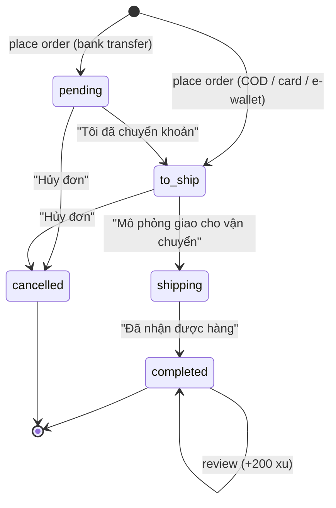
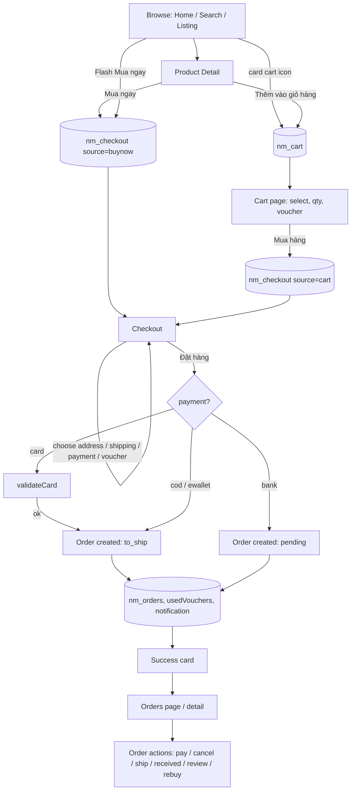
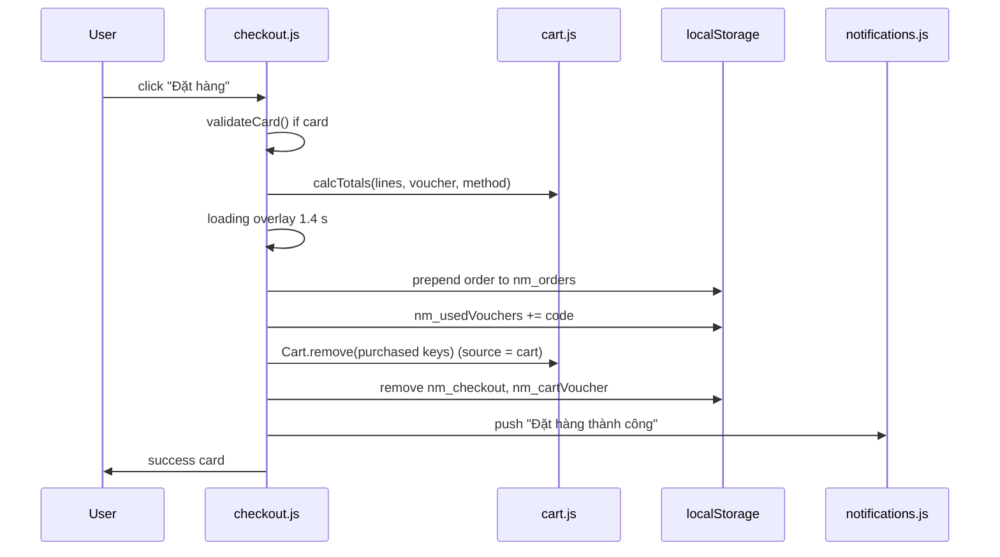

# NovaMart – Project Guideline

> Audience: end users, developers, QA and business/product teams.
> Scope: the static demo app in the `novamart/` folder only.
> Method: every statement below is derived from the actual source (HTML, `js/*.js`, `js/data.js`, `README.md`). Where the code is silent or a behavior is only implied, it is marked **Assumption** or **Unknown / not implemented**. UI text is Vietnamese; the original terms are kept in parentheses.
> CSS files were only skimmed (tokens and breakpoints); visual details are not documented here.

---

## Table of Contents

1. [Project Overview](#1-project-overview)
   - 1.1 Purpose
   - 1.2 Tech stack
   - 1.3 File structure
   - 1.4 How to run
   - 1.5 Data storage (localStorage keys)
   - 1.6 Seed / mock data
   - 1.7 Credentials and identity
   - 1.8 Script loading and module map
2. [User Guideline](#2-user-guideline)
   - 2.1 Roles
   - 2.2 Global layout (header, footer, mobile UI)
   - 2.3 Screen-by-screen reference
   - 2.4 Step-by-step task guides
3. [Business Guideline](#3-business-guideline)
   - 3.1 Domain entities and fields
   - 3.2 Relationships
   - 3.3 Order lifecycle and state transitions
   - 3.4 Permissions per role
   - 3.5 Pricing, shipping and voucher rules
   - 3.6 Worked calculation examples
   - 3.7 Validation rules summary
   - 3.8 Important scenarios
4. [Feature Details](#4-feature-details)
5. [Key Workflows and Module Relationships](#5-key-workflows-and-module-relationships)
6. [Known Limitations and Gaps](#6-known-limitations-and-gaps)
7. [QA Test Checklist](#7-qa-test-checklist)
8. [Appendix](#8-appendix)

---

## 1. Project Overview

### 1.1 Purpose

NovaMart ("Mua sắm thông minh, giá tốt mỗi ngày" – "Smart shopping, great prices every day") is a **front-end-only e-commerce marketplace demo** for the Vietnamese market. It demonstrates the full shopping journey: browse, search, filter, product detail, wishlist, cart, voucher, checkout with simulated payment, order tracking and a small account centre. The footer states: "Dự án demo frontend – không phải doanh nghiệp thật" (a demo front-end project, not a real business).

### 1.2 Tech stack

| Item | Value |
|---|---|
| Markup | HTML5, 7 pages, `lang="vi"` |
| Styling | Vanilla CSS: `css/style.css` (tokens/layout), `css/components.css`, `css/responsive.css` |
| Scripting | Vanilla JavaScript (IIFE modules attached to a global `window.NM` namespace), no framework, no bundler, no build step |
| Backend | None. No network calls except the Google Fonts stylesheet |
| Font | Be Vietnam Pro from Google Fonts; falls back to Segoe UI/system fonts offline |
| Images | Generated inline SVG (emoji "object" on a gradient plus brand tag) built by `NM.productSVG`; no image files (`assets/images/` contains only `.gitkeep`) |
| Persistence | Browser `localStorage`, all keys prefixed `nm_` |
| Design tokens | Primary coral `#FF5A36`, strong coral `#D6360F`, night ink `#241F4E`, sun `#FFC83D` (from `css/style.css`) |
| Responsive breakpoints | `max-width` 1280 / 1024 / 768 / 480 px, plus `(hover: none)` and `prefers-reduced-motion` handling |

### 1.3 File structure

```
novamart/
├── index.html            Home
├── products.html         Product listing / search results / sections
├── product-detail.html   Product detail (?id=pNNN)
├── cart.html             Shopping cart
├── checkout.html         Checkout (and success screen)
├── orders.html           Order list and order detail/tracking (?id=, ?tab=)
├── account.html          Account centre (#profile #orders #vouchers #wishlist #recent)
├── README.md             Short project readme
├── GUIDELINE.md          This document
├── assets/images/.gitkeep
├── css/
│   ├── style.css         Tokens, base, layout
│   ├── components.css    UI components
│   └── responsive.css    Breakpoints
└── js/
    ├── utils.js          Helpers: formatting, storage, toasts, modals, SVG images, countdown
    ├── data.js           Mock data: categories, 53 products, flash sale, vouchers, banners, brands, user, notifications, reviews generator
    ├── search.js         Accent-insensitive search + suggestion dropdown
    ├── cart.js           Cart state, pricing (calcTotals), cart page
    ├── wishlist.js       Wishlist + recently viewed
    ├── notifications.js  Notification store + header dropdown
    ├── filters.js        Listing page: filters, sorting, pagination
    ├── products.js       Product card, home sections, product detail page, buyNow
    ├── checkout.js       Vouchers, user, orders store, checkout flow
    ├── orders.js         Order list/detail/tracking + order actions
    ├── account.js        Account centre
    └── app.js            Shell (header/footer/drawer), global events, page router
```

### 1.4 How to run

1. Open `index.html` directly in a modern browser (works from `file://`). No server or install needed.
2. Optional: serve the folder with any static server (for example `python -m http.server`) – behavior is identical. **Assumption:** localStorage is scoped per origin, so `file://` and `http://localhost` keep separate data.
3. To reset all demo data: header user menu (click the avatar/name) → **"↺ Đặt lại dữ liệu demo"** (Reset demo data) → confirm **"Đặt lại"**. This removes every `nm_*` key and redirects to `index.html`.

### 1.5 Data storage (localStorage keys)

All keys are stored with the prefix `nm_` (helper `NM.store`, JSON-serialised; read/write errors are swallowed, so if storage is blocked the app silently runs without persistence).

| Key (`nm_` + …) | Written by | Content |
|---|---|---|
| `cart` | `cart.js` | Array of cart items: `{ key, id, qty, variant, selected, addedAt }` |
| `cartVoucher` | `cart.js` | Voucher code chosen on the cart page (string) |
| `checkout` | `cart.js` (cart checkout), `products.js` (`buyNow`) | Checkout session: `{ source: 'cart'|'buynow', items:[{key,id,qty,variant}], voucher }`; removed after a successful order |
| `orders` | `checkout.js` | Array of orders (newest first). Seeded with 3 orders on first read |
| `vouchers` | `checkout.js` | Array of collected voucher codes |
| `usedVouchers` | `checkout.js` | Array of used voucher codes |
| `user` | `checkout.js`, `account.js`, `orders.js` | Overrides merged over `DEFAULT_USER` (profile, address, `xu`) |
| `notifications` | `notifications.js` | Array (max 30), seeded from `DEFAULT_NOTIFICATIONS` on first read |
| `wishlist` | `wishlist.js` | Array of product ids (newest first) |
| `recent` | `wishlist.js` | Recently viewed product ids (max 12) |
| `searches` | `search.js` | Recent search terms (max 6) |

Not persisted: product data, flash-sale state, listing filters (they live in the URL query string), review "helpful" clicks, review lists (regenerated deterministically on every visit).

### 1.6 Seed / mock data (`js/data.js`)

| Dataset | Size / detail |
|---|---|
| Categories | 15 (`dien-thoai`, `laptop`, `thoi-trang-nam`, `thoi-trang-nu`, `giay-dep`, `my-pham`, `nha-cua`, `me-be`, `thuc-pham`, `suc-khoe`, `the-thao`, `phu-kien`, `gia-dung`, `sach`, `o-to-xe-may`) |
| Products | 53, ids `p001`…`p053`; 28 are NovaMall ("Mall"); 22 have list-price discount ≥ 30%; 27 have no variants; stock ranges 63–346 (generated, or set by formula `50 + (seq*37) % 300`) |
| Flash sale | 9 products with fixed sale prices and fake sold/total counters (see [Appendix A](#a-flash-sale-items)) |
| Vouchers | 6 (`NOVA50K`, `NOVA100K`, `GIAM10`, `FREESHIP`, `MALL300K`, `NEWBIE15`), see [3.5.4](#354-vouchers) |
| Banners | 4 hero slides (themes coral, indigo, rose, green) |
| Brands | 12 featured brand tiles |
| Default user | "Nguyễn Văn A", `nguyenvana@novamart.vn`, phone `0901 234 567`, gender Nam, birthday `1995-06-15`, tier "Thành viên Bạc", `xu` = 1250, address 123 Nguyễn Văn Linh, Nam Dương, Hải Châu, Đà Nẵng |
| Notifications | 4 seeded (3 unread, 1 read) with timestamps relative to the first load |
| Orders (seeded) | 3 orders, see [3.8](#38-important-scenarios) |
| Reviews | Generated per product with a seeded pseudo-random generator (`NM.seeded`), 8 reviews each, stable between visits |

### 1.7 Credentials and identity

- **There is no login, logout, registration or password.** The app always acts as a single pre-signed-in customer ("Nguyễn Văn A") stored in `DEFAULT_USER`.
- No demo credentials exist. **Unknown / not implemented:** authentication, sessions, multiple accounts, admin/seller back office.
- Test payment card (from README and validators): any 16 digits, future `MM/YY`, 3–4 digit CVV, for example `4111 1111 1111 1111`, `12/29`, `123`. **Note:** the expiry must be later than today; with the current date (2026-09-30) `12/29` is valid.

### 1.8 Script loading and module map

Every page loads the same 12 scripts in this order (only the page's `data-page` attribute decides what runs):

`utils.js` → `data.js` → `search.js` → `cart.js` → `wishlist.js` → `notifications.js` → `filters.js` → `products.js` → `checkout.js` → `orders.js` → `account.js` → `app.js`

`app.js` renders the shell on `DOMContentLoaded`, then calls the page initialiser selected by `<body data-page="…">`:

| `data-page` | Page | Initialiser |
|---|---|---|
| `home` | index.html | `NM.initHome` |
| `products` | products.html | `NM.initListingPage` |
| `detail` | product-detail.html | `NM.initProductDetail` |
| `cart` | cart.html | `NM.initCartPage` |
| `checkout` | checkout.html | `NM.initCheckout` |
| `orders` | orders.html | `NM.initOrdersPage` |
| `account` | account.html | `NM.initAccount` |

---

## 2. User Guideline

### 2.1 Roles

| Role | Exists in code? | Description |
|---|---|---|
| Customer (single demo user) | Yes | Implicit, always "logged in". Can do everything the UI offers |
| Guest / anonymous | No | There is no distinction; every visitor is the demo customer |
| Seller / shop | Only as display text | Product detail shows "<Brand> Official Store" / "<Brand> Store" with fabricated stats; no seller functions |
| Admin / back office | **Unknown / not implemented** | No admin screens. Order progress that a seller/carrier would perform is *simulated by the customer* with buttons (see 3.3) |

### 2.2 Global layout

**Header (all pages, built by `app.js`):**

| Element | Behavior |
|---|---|
| Announcement bar | "Nhập NEWBIE15 giảm 15% cho đơn đầu tiên | Freeship đơn từ ₫500K"; links: "Theo dõi đơn hàng" (orders.html), "Hỗ trợ 1900 6868" and "Tải ứng dụng" (anchors in footer) |
| Logo | Goes to `index.html` |
| Search box | Placeholder "Tìm iPhone, laptop, giày, tai nghe..."; live suggestions; 6 trending links below (iPhone, laptop, giày, tai nghe, áo sơ mi, máy giặt) |
| Bell (Thông báo) | Dropdown of notifications, unread badge (shows `9+` when more than 9) |
| Cart icon | Link to cart, badge with total quantity (`99+` above 99), hidden at 0 |
| User menu | Avatar/name; items: "Tài khoản của tôi", "Đơn mua", "Kho voucher", "Yêu thích", "Đã xem gần đây", "Đặt lại dữ liệu demo" |
| Main nav | "Danh mục" dropdown (15 categories) + links: "⚡ Flash Sale", "Bán chạy", "Hàng mới", "Voucher", "NovaMall", "Giảm từ 30%". The current `?section=` link is highlighted. **Hidden on the checkout page** |
| Mobile drawer | Hamburger menu with the same links, "Đơn mua", "Yêu thích" and all categories |

**Footer / mobile chrome:** four link columns, payment and shipping chips (informational only), hotline text, "Tải ứng dụng" badges (not real; "Ứng dụng demo chưa phát hành"), mobile **bottom navigation** (Trang chủ, Danh mục, Giỏ hàng, Đơn hàng, Tài khoản), a **back-to-top** button (appears after 600 px scroll), and on product detail a sticky **mobile buy bar** (♡, Thêm vào giỏ, Mua ngay).

**Keyboard/accessibility:** skip link "Bỏ qua đến nội dung chính"; `Esc` closes dropdowns, modals and the drawer; modals trap focus; ARIA roles on carousel, tabs, radio groups, progress bars and timers.

### 2.3 Screen-by-screen reference

#### 2.3.1 Home (`index.html`)

| Section | Content and actions |
|---|---|
| Hero carousel | 4 slides, auto-advance every 5 s (disabled when the OS requests reduced motion), pauses on hover/focus, prev/next buttons, dots, swipe (>50 px). Each slide has a CTA link to a category. Side promos: NovaMall, Kho voucher |
| Service strip | Four static promises (100% chính hãng, Freeship từ ₫500K, Đổi trả 15 ngày, Thanh toán an toàn) |
| Danh mục | 15 category tiles linking to `products.html?cat=<id>` |
| Flash Sale | Countdown to the end of the current 3-hour slot; rail of 9 items with price, discount %, sold progress bar ("Đã bán N%", or "Sắp hết – còn N" at ≥ 85%), "Còn lại N sản phẩm", **"Mua ngay"** button |
| Mã giảm giá hôm nay | 6 voucher cards with **"Lưu mã"** (Save) button; becomes "Đã lưu" (Saved) or "Đã dùng" (Used) |
| Gợi ý hôm nay | 12 products (skeleton for 350 ms) + **"Xem thêm sản phẩm"** (+12 each click). Ordering favours categories of recently viewed products |
| Promo row | Three banners linking to `?cat=gia-dung`, `?section=mall`, `?cat=sach` |
| Bán chạy nhất tuần | Top 12 by `sold`, with rank badges 1–12 |
| Thương hiệu nổi bật | 12 brand tiles → `products.html?q=<brand>` with product counts |
| Bạn đã xem gần đây | Up to 6 recently viewed items + "Xóa lịch sử" (hidden when empty) |

#### 2.3.2 Product listing (`products.html`)

URL parameters (also written back with `history.replaceState`, so pages are shareable): `q`, `cat`, `section` (`flash|best|new|mall|deal`), `min`, `max`, `rating`, `brands` (comma list), `discount`, `freeship=1`, `mall=1`, `sort`.

| Area | Content |
|---|---|
| Title/breadcrumb | Section name, category name, or `Kết quả tìm kiếm cho “<q>”`; page `<title>` updates |
| Filter sidebar ("Bộ lọc") | Category (with counts), price range (Từ / Đến + "Áp dụng" + 4 presets), rating (4,5 / 4 / 3 stars and up), brands (top 8, "Xem thêm" reveals all), discount (10/20/30/40%), services ("Miễn phí vận chuyển", "NovaMall chính hãng"), "Xóa tất cả bộ lọc". On mobile it is a slide-in drawer opened by "⚙ Bộ lọc" |
| Toolbar | Result count, sort buttons (Phổ biến, Bán chạy, Mới nhất, Đánh giá cao) and a price select (Giá: Thấp → Cao / Cao → Thấp) |
| Active filter chips | Removable chips (✕) for keyword, category, price, rating, brands, discount, Freeship, NovaMall |
| Grid | 20 products per page; button "Xem thêm N sản phẩm" loads the next page. Skeleton cards for 380 ms on first load |
| Empty state | "Không tìm thấy sản phẩm" with popular keyword chips and "Xóa bộ lọc" |

#### 2.3.3 Product detail (`product-detail.html?id=pNNN`)

Gallery (4 generated images, thumbnails, hover-zoom, lightbox on Enter or on touch devices), name with Mall badge, rating/reviews/sold, Flash Sale banner with countdown (flash items only), price box (current, struck-through list price, `-N%`), voucher chips (first three vouchers, click to save), shipping info, variant selectors, quantity stepper with "Còn N sản phẩm", **"🛒 Thêm vào giỏ hàng"**, **"Mua ngay"**, "↗ Chia sẻ", "Yêu thích". Below: tabs (Mô tả, Thông số kỹ thuật, Bảo hành, Vận chuyển), a shop card, the reviews section (filters: Tất cả, 5–1 sao, Có hình ảnh, Đã mua hàng; "👍 Hữu ích" toggle; photo lightbox), and 10 similar products. Not-found id shows "Không tìm thấy sản phẩm".

#### 2.3.4 Cart (`cart.html`)

Breadcrumb, "Giỏ hàng" title. Empty state: "Giỏ hàng đang trống" with "Tiếp tục mua sắm" and 10 suggestions. Otherwise: select-all checkbox, "Xóa mục đã chọn", one row per line (checkbox, image, name, variant text, Freeship / Flash Sale tags, unit price with struck list price, quantity stepper, line total, 🗑 remove) and the summary panel ("Tóm tắt đơn hàng": voucher select, subtotal, shipping, product discount, voucher, total, **"Mua hàng (N)"**).

#### 2.3.5 Checkout (`checkout.html`)

Step indicator (1 Giỏ hàng ✓, 2 Thanh toán, 3 Hoàn tất – static markup; all marked done on success). Blocks: address ("Thay đổi" opens a modal), products + note ("Lời nhắn cho người bán", max 120 chars), shipping method (3 options with computed fee), payment method (4 options with detail box), voucher (select + code entry "Áp dụng"), and the payment summary with **"Đặt hàng"**. After success, the page is replaced by a success card ("Đặt hàng thành công").

#### 2.3.6 Orders (`orders.html`)

- **List view:** "Đơn mua" with tabs Tất cả, Chờ thanh toán, Chờ lấy hàng, Đang giao, Hoàn thành, Đã hủy (count badge for non-empty status tabs). Each order card shows id, date, status badge, first item, "và N sản phẩm khác", total and context-sensitive action buttons. Tab is stored in `?tab=`.
- **Detail view (`?id=<orderId>`):** id, status, carrier and tracking code, timeline (tracker), actions, address, payment/shipping, note, items, and totals. Unknown id → "Không tìm thấy đơn hàng".

#### 2.3.7 Account (`account.html`, hash routing)

Left navigation with avatar, name, tier and xu balance; panels: `#profile` (Hồ sơ của tôi, default), `#orders` (status tiles + 3 latest orders), `#vouchers` (Kho voucher), `#wishlist` (Sản phẩm yêu thích), `#recent` (Đã xem gần đây). Unknown hash falls back to profile.

### 2.4 Step-by-step task guides

**A. Find a product**
1. Type in the header search box. Suggestions appear as you type (debounced 120 ms): a "Tìm “…”" row with result count, up to 2 matching categories, and up to 6 products.
2. Use ↑/↓ to pick a suggestion and Enter to open it, or press Enter with no selection / click "Tìm kiếm" to open the full result page.
3. Refine with the sidebar filters and sort buttons. Remove filters by clicking chips or "Xóa tất cả bộ lọc".
4. Empty focus on the box (no text) shows "Tìm kiếm gần đây" (with "Xóa") and "Từ khóa phổ biến".

**B. Add to cart**
- From any card: click the cart icon on the card (adds 1 with the *first option of every variant*).
- From detail: choose variants and quantity, click "Thêm vào giỏ hàng". Toast: "Đã thêm vào giỏ hàng".

**C. Buy now**
- Detail page "Mua ngay" or a Flash Sale card's "Mua ngay": goes straight to checkout with only that item; the cart is not modified.

**D. Manage the cart and check out**
1. Open the cart. Tick/untick items (only ticked items are purchased).
2. Change quantity with −/+ or type a number. Delete with 🗑 (confirmation dialog) or "Xóa mục đã chọn".
3. Pick a voucher in the select (options below the minimum spend are disabled with "(chưa đủ điều kiện)").
4. Click "Mua hàng (N)". Review address, shipping, payment, voucher; click "Đặt hàng".

**E. Save and use a voucher**
1. On the home page (or detail page voucher chips) click "Lưu mã". A notification is added.
2. At checkout pick it in the dropdown, **or** type the code and click "Áp dụng" (this also collects the code automatically if you had not saved it).

**F. Pay by card / e-wallet / bank / COD** – see [4.9](#49-checkout-payment).

**G. Track and manage an order** – open "Đơn mua"; use the buttons on the card (see 3.3 for which buttons appear at which status).

**H. Review an order** – on a completed order click "Đánh giá", pick stars (default 5), write at least 10 characters, "Gửi đánh giá"; you receive +200 xu.

**I. Wishlist** – click the heart on a card/detail page; manage under Account → "Sản phẩm yêu thích" ("Chuyển vào giỏ", "Xóa", "Thêm tất cả vào giỏ").

**J. Edit profile / address** – profile at Account → "Hồ sơ của tôi"; the shipping address can only be edited from the checkout page ("Thay đổi").

**K. Reset** – user menu → "Đặt lại dữ liệu demo".

---

## 3. Business Guideline

### 3.1 Domain entities and fields

#### Category
| Field | Type | Notes |
|---|---|---|
| `id` | string | Slug, used in `?cat=` |
| `name` | string | Vietnamese display name |
| `icon` | emoji | |
| `hue` | number | Colour hue for tiles/images |

#### Product (generated by factory `P()`)
| Field | Notes |
|---|---|
| `id` | `p` + zero-padded sequence (`p001`…) |
| `name`, `brand`, `category` | `category` references `Category.id` |
| `price` | Current list price (VND, integer) |
| `originalPrice` | Struck-through price |
| `discount` | `round((1 - price/originalPrice) * 100)` – based on `price`, **not** on the flash price |
| `rating`, `reviewCount`, `sold` | Static numbers (not updated by the app) |
| `image`, `images[4]`, `emoji`, `hue` | Generated SVG data URIs |
| `description`, `highlights[]`, `specifications{}`, `warranty` | Text; warranty default "Đổi trả miễn phí trong 15 ngày nếu sản phẩm lỗi do nhà sản xuất." |
| `variants{ name: [options] }` | e.g. `Màu sắc`, `Dung lượng`, `Kích cỡ`; may be empty |
| `freeShipping` | Default `true` unless `extra.freeShipping === false` (6 products are `false`: AKKO keyboard, bookshelf, exercise bike, 3 books) |
| `mall` | Boolean; shows the "Mall" badge |
| `stock` | `extra.stock || 50 + ((seq*37) % 300)` |
| `addedAt` | Timestamp used for "Mới nhất" sort |
| `tags[]` | Search keywords (ASCII/unaccented) |

#### Flash sale entry
`{ id, price, total, sold }` – `price` overrides the product price everywhere via `NM.priceOf`. `sold/total` only drives the progress bar.

#### Voucher
| Field | Notes |
|---|---|
| `code` | Uppercase code |
| `title`, `desc`, `tag` | Display text; `tag` values: Toàn sàn, Freeship, NovaMall, Khách mới |
| `type` | `fixed`, `percent`, `ship` |
| `value` | Amount (VND) or percent |
| `max` | Cap, only for `percent` |
| `min` | Minimum subtotal |
| `expires` | Display string only (dd/mm/yyyy) – **never checked in code** |

#### Cart item (`nm_cart`)
`key` = `<productId>|<variantValues joined by "/">`, `id`, `qty`, `variant{name:value}`, `selected` (default `true`), `addedAt`. Items whose product no longer exists are filtered out when read.

#### Checkout session (`nm_checkout`)
`source` (`cart`/`buynow`), `items[]` (`key,id,qty,variant`), `voucher`.

#### Order (`nm_orders`)
| Field | Notes |
|---|---|
| `id` | `NM` + `yy` + `mm` + `dd` + 4 random digits (1000–9999), e.g. `NM2409180021`; no uniqueness check |
| `status` | `pending`, `to_ship`, `shipping`, `completed`, `cancelled` |
| `createdAt` | Timestamp |
| `items[]` | `{ id, qty, variant, price }` – `price` is a **snapshot** of the effective unit price at purchase |
| `address` | Snapshot copy of the user's address at purchase |
| `shippingMethod` | `{ id, name }` |
| `payment` | `cod`, `bank`, `card`, `ewallet` |
| `wallet` | `momo`/`zalopay`/`vnpay`/`novapay` (e-wallet only) |
| `subtotal`, `shipping`, `discount`, `total` | `discount` = voucher discount + voucher shipping discount |
| `voucher` | Code or `null` (not on seeded orders) |
| `note` | Up to 120 chars |
| `history[]` | `{ status: placed|paid|prepared|shipping|delivered|cancelled, time }` |
| `carrier` | Always `NovaExpress` |
| `tracking` | `NVX` + last 6 characters of the order id |
| `cancelReason` | Set on cancel (also on the seeded cancelled order) |
| `reviewed` | `{ rating, text, time }` once reviewed |

#### User (`DEFAULT_USER` merged with `nm_user`)
`name`, `phone`, `email`, `gender` (Nam/Nữ/Khác), `birthday`, `address{name, phone, street, ward, district, city}`, `tier` (static "Thành viên Bạc"), `xu` (loyalty coins, 1250 initial).

#### Notification (`nm_notifications`)
`id` (`n`+timestamp), `icon`, `title`, `text`, `time`, `read`, `link`. Max 30 kept (newest first).

### 3.2 Relationships

```
Category 1───* Product
Product  1───0..1 FlashSale entry (overrides price)
Product  1───* Variant group (name → options)
User     1───* Order
Order    1───* OrderItem ───> Product (id; price snapshotted)
Order    *───0..1 Voucher (code; usage tracked in nm_usedVouchers, not on the voucher)
User     1───* CollectedVoucher (nm_vouchers) ; UsedVoucher (nm_usedVouchers)
User     1───* WishlistItem / RecentItem / Notification / CartItem
CartItem ───> Product (+ chosen variant)
```

### 3.3 Order lifecycle and state transitions

#### 3.3.1 Statuses (`NM.Orders.STATUS`)

| Code | UI label |
|---|---|
| `pending` | Chờ thanh toán (Awaiting payment) |
| `to_ship` | Chờ lấy hàng (Awaiting pickup/shipment) |
| `shipping` | Đang giao (Shipping) |
| `completed` | Hoàn thành (Completed) |
| `cancelled` | Đã hủy (Cancelled) |

#### 3.3.2 Initial status on placement

| Payment | Initial status | History entries created |
|---|---|---|
| `bank` | `pending` | `placed` |
| `cod`, `card`, `ewallet` | `to_ship` | `placed`, `paid` (+1 s) |

Note: the `paid` history step is also written for COD (see [Limitations](#6-known-limitations-and-gaps)).

#### 3.3.3 Transitions and available actions

| From | Button (Vietnamese) | Action code | To | Side effects |
|---|---|---|---|---|
| `pending` | Tôi đã chuyển khoản | `paid` | `to_ship` | history `paid`; toast "Đã xác nhận thanh toán" (no notification) |
| `pending` | Hủy đơn | `cancel` | `cancelled` | reason modal; history `cancelled`; notification "Đơn hàng đã hủy" |
| `to_ship` | Mô phỏng giao cho vận chuyển | `ship` | `shipping` | history `prepared` + `shipping`; notification "Đơn hàng đang được giao"; toast "Đơn hàng đã chuyển sang Đang giao" |
| `to_ship` | Hủy đơn | `cancel` | `cancelled` | as above |
| `shipping` | Đã nhận được hàng | `received` | `completed` | confirmation dialog; history `delivered`; notification "Giao hàng thành công … Đánh giá để nhận 200 xu."; toast "Đơn hàng đã hoàn thành" |
| `completed` | Đánh giá | `review` | (unchanged) | sets `reviewed`; +200 xu |
| `completed` | Đã đánh giá (disabled) | `reviewed` | – | shown once reviewed |
| `completed` | Mua lại | `rebuy` | (unchanged) | items added to cart, redirect to cart |
| `cancelled` | Mua lại | `rebuy` | (unchanged) | same |



`shipping` orders **cannot** be cancelled; `completed` and `cancelled` are terminal (only "Mua lại" / review).

#### 3.3.4 Tracker (timeline) mapping

Steps: 1 "Đơn hàng đã đặt" (placed), 2 "Đã xác nhận thanh toán" (paid), 3 "Đang chuẩn bị hàng" (prepared), 4 "Đang giao hàng" (shipping), 5 "Giao hàng thành công" (delivered).
Progress level: `pending`=1, `to_ship`=2, `shipping`=3, `completed`=5. Steps with index < level are "done" (timestamp from history), the step at index = level is "current" ("Đang chờ bạn thanh toán" for `pending`, otherwise "Đang xử lý"), later steps are "todo". Cancelled orders show a single block "Đơn hàng đã hủy lúc …" plus "Lý do: …".

### 3.4 Permissions per role

Because only one implicit role exists, this table lists what that role may do and what is absent.

| Capability | Customer (only role) | Notes |
|---|---|---|
| Browse, search, filter | Yes | No restrictions |
| Cart, wishlist, checkout | Yes | No login gate |
| Cancel order | Yes, only in `pending` / `to_ship` | Reasons from a fixed list |
| Confirm receipt | Yes, only in `shipping` | |
| Advance order to shipping / confirm bank transfer | Yes (simulation) | In reality a seller/carrier/payment system action |
| Review order | Yes, once per order, only when `completed` | |
| Edit profile | Yes | |
| Edit address | Yes, only at checkout | |
| Manage products, orders of others, users, vouchers | **Unknown / not implemented** | No back office |
| Return / refund request | **Unknown / not implemented** | Text promises exist ("Đổi trả 15 ngày") but no flow |

### 3.5 Pricing, shipping and voucher rules

#### 3.5.1 Effective price

```
priceOf(product) = flashSale[product.id].price   if the product is in FLASH_SALE
                 = product.price                 otherwise
```
The flash price applies **unconditionally** (no time window – see Limitations). Displayed discount % on cards/detail is `round((1 - priceOf/originalPrice) * 100)`; the filter/section "discount" uses the static `product.discount`.

#### 3.5.2 Totals (`NM.calcTotals(lines, voucherCode, methodId)`)

```
subtotal = Σ priceOf(p) × qty
saved    = Σ (originalPrice − priceOf(p)) × qty          (shown as "Giảm giá sản phẩm")
allFree  = lines not empty AND every product.freeShipping
shipping = method.fee (0 if there are no lines)
if method == 'standard' AND (allFree OR subtotal ≥ 500,000): shipping = 0
voucher  = evaluate(code, subtotal, shipping)
total    = max(0, subtotal + shipping − voucher.discount − voucher.shipDiscount)
```

#### 3.5.3 Shipping methods

| Id | Name (Vietnamese) | ETA text | Fee (₫) | Free-shipping rule applies? |
|---|---|---|---|---|
| `standard` | Giao tiêu chuẩn | Nhận hàng trong 3–5 ngày | 30,000 | Yes: free if all items are Freeship **or** subtotal ≥ ₫500,000 (notes: "Sản phẩm được miễn phí vận chuyển" or "Miễn phí cho đơn từ ₫500.000") |
| `fast` | Giao nhanh | Nhận hàng trong 1–2 ngày | 50,000 | No |
| `sameday` | Giao trong ngày | Nhận trước 21:00 hôm nay (nội thành) | 80,000 | No |

The cart page always uses `standard`; the method is chosen only at checkout. Estimated delivery date on the success screen = order time + 4 days (standard) / 2 days (fast) / 0 days (sameday). The product detail page shows a fixed estimate of "today + 3 days".

#### 3.5.4 Vouchers

| Code | Title | Type | Value | Min subtotal | Cap | Expires (display only) | Tag |
|---|---|---|---|---|---|---|---|
| `NOVA50K` | Giảm ₫50K | fixed | 50,000 | 299,000 | – | 31/12/2026 | Toàn sàn |
| `NOVA100K` | Giảm ₫100K | fixed | 100,000 | 799,000 | – | 31/12/2026 | Toàn sàn |
| `GIAM10` | Giảm 10% | percent | 10 | 500,000 | 200,000 | 30/11/2026 | Toàn sàn |
| `FREESHIP` | Miễn phí vận chuyển | ship | 30,000 | 0 | – | 31/10/2026 | Freeship |
| `MALL300K` | Giảm ₫300K | fixed | 300,000 | 3,000,000 | – | 31/12/2026 | NovaMall |
| `NEWBIE15` | Giảm 15% | percent | 15 | 150,000 | 100,000 | 31/12/2026 | Khách mới |

Evaluation (`Vouchers.evaluate`):

```
code not found                → error "Mã voucher không tồn tại."
subtotal < min                → error "Cần mua thêm ₫X để dùng voucher này."   (X = min − subtotal)
type fixed   → discount     = min(value, subtotal)
type percent → discount     = min(round(subtotal × value / 100), max)
type ship    → shipDiscount = min(value, shipping)
```

Rules on lifecycle: a voucher is *collected* (saved) → available in the dropdown → *used* when an order is placed with it. Used vouchers are permanently removed from the available list (`available() = collected − used`). Only **one** voucher per order. Voucher eligibility is based on the subtotal after flash pricing and before shipping.

#### 3.5.5 Loyalty coins (xu)
Only rule implemented: +200 xu for submitting an order review. There is no way to spend xu. The tier is a static label.

### 3.6 Worked calculation examples

| # | Scenario | Calculation | Result |
|---|---|---|---|
| 1 | 2 × Áo polo (p014, flash ₫159,000; freeShipping true), standard | subtotal 318,000; allFree → shipping 0; saved = (299,000−159,000)×2 = 280,000 | Total ₫318,000 |
| 2 | Same cart, Giao nhanh | shipping 50,000 (free rule only for standard) | Total ₫368,000 |
| 3 | Same cart, `NEWBIE15`, standard | subtotal 318,000 ≥ 150,000; 15% = 47,700 (< cap 100,000) | Total 318,000 − 47,700 = ₫270,300 |
| 4 | 1 × Nhà Giả Kim (₫69,000, freeShipping false), standard | subtotal 69,000 < 500,000 and not all free → shipping 30,000 | Total ₫99,000 |
| 5 | Scenario 4 + `FREESHIP` | shipDiscount = min(30,000, 30,000) | Total ₫69,000 |
| 6 | 1 × Sony WH-1000XM5 (flash ₫5,490,000) + `MALL300K` | subtotal 5,490,000 ≥ 3,000,000; discount 300,000; shipping 0 | Total ₫5,190,000 |
| 7 | Subtotal ₫1,000,000 + `GIAM10` | 10% = 100,000 (cap 200,000) | discount ₫100,000 |
| 8 | Subtotal ₫3,000,000 + `GIAM10` | 300,000 → capped | discount ₫200,000 |
| 9 | Subtotal ₫250,000 + `NOVA50K` | 250,000 < 299,000 | error "Cần mua thêm ₫49.000 để dùng voucher này." |

### 3.7 Validation rules summary

| Area | Rule |
|---|---|
| Phone (address modal, profile) | Regex `^0\d[\d\s]{7,11}$` (starts with 0, then a digit, then 7–11 digits/spaces) |
| Email (profile) | Regex `^\S+@\S+\.\S+$` |
| Profile name | Non-empty after trim |
| Address fields | All six non-empty after trim |
| Card number | Exactly 16 digits after removing spaces |
| Card holder | Non-empty |
| Card expiry | `MM/YY`, month 01–12, not in the past (valid through last day of month, 23:59) |
| CVV | 3 or 4 digits |
| Order note | `maxlength=120` |
| Review text | At least 10 characters after trim |
| Quantity | Min 1, max product `stock` (clamped) |
| Voucher | Must exist, not used, subtotal ≥ min |

### 3.8 Important scenarios

| Scenario | Behavior |
|---|---|
| First visit | 3 orders are seeded on first read of orders (relative to "now") |
| Seeded order NM2409180021 | `shipping`, created 1.2 days ago, items p039 ×1 + p014 ×2, Giao nhanh, card |
| Seeded order NM2409050007 | `completed`, 12 days ago, p048 ×1, p049 ×1, p031 ×2, standard, COD (not yet reviewed) |
| Seeded order NM2408220013 | `cancelled`, 30 days ago, p024 ×2, standard, e-wallet, reason "Thay đổi phương thức thanh toán" |
| Buy now | Does not touch the cart; on success the cart is unchanged |
| Cart checkout | Only ticked items are ordered and removed from the cart afterwards; unticked items stay |
| Same product, different variant | Separate cart lines (key includes variant values) |
| Same product/variant added again | Quantity merged, capped at stock |
| Bank transfer | Order waits in `pending` until "Tôi đã chuyển khoản" is clicked (simulation; no verification) |
| Cancelled order | Voucher is **not** returned to the customer, stock unaffected (see Limitations) |
| Re-buy | Adds items with the recorded variant and quantity (uses current prices), then opens the cart |

---

## 4. Feature Details

### 4.1 Search

| Aspect | Details |
|---|---|
| Input | Free text in `#searchInput` (also pre-filled from `?q=`) |
| Matching | Text is normalised: lower-case, Unicode NFD, diacritics removed, `đ`→`d`. Each whitespace-separated token must appear (substring) in the haystack `name + brand + category name + tags`. So "giay" matches "giày" |
| Ranking | `score = (name startsWith query ? 3 : 0) + (name includes query ? 2 : 0) + sold/100000`, descending |
| Suggestions | Debounced 120 ms; header row `Tìm “q”` + result count; up to 2 categories whose normalised name contains the query; up to 6 products with thumbnail, highlighted name (`<mark>`) and price. No result: "Không tìm thấy sản phẩm phù hợp" |
| Empty input | "Tìm kiếm gần đây" chips (max 6, de-duplicated by normalised form, newest first, "Xóa" clears) and 8 popular keywords: iPhone, laptop, giày, tai nghe, áo sơ mi, máy giặt, kem chống nắng, nồi chiên |
| Keyboard | ↑/↓ cycles through suggestion links, Enter opens the highlighted one, Esc closes; input blur closes after 120 ms |
| Submit | Blank/whitespace queries do nothing; otherwise saves the term and navigates to `products.html?q=<term>` |
| Edge cases | Search on the listing page keeps relevance order when sort is "Phổ biến"; any other sort re-sorts. Whitespace-only queries after trim are ignored on submit |

### 4.2 Listing, filters and sorting

| Feature | Rules |
|---|---|
| Base set | `q` → search results (else all products); then `cat`; `section=flash` keeps only products in FLASH_SALE (9); `section=deal` keeps `product.discount ≥ 30` (22) |
| `section=mall` | Implies the NovaMall filter (`mall = true`) |
| `section=best`/`new` | Only change the default sort (`best` → by sold, `new` → by `addedAt`); they do **not** restrict the product set |
| Filters | price `min ≤ priceOf ≤ max` (0 = unbounded, inclusive both ends), `rating ≥`, `brands` (any of), `discount ≥` (static `product.discount`), `freeShip`, `mall` |
| Price inputs | If min > max the values are swapped on "Áp dụng" |
| Category change | Resets selected brands |
| Brand counts | Computed on the base set (search/category/section), before other filters |
| Category counts | Computed from the search results (or all products) ignoring the active category |
| Sorting | `popular`: `rating × log10(reviewCount+10) + sold/20000`; `best`: `sold`; `newest`: `addedAt`; `rating`: rating then reviewCount; `price-asc`/`price-desc`: by `priceOf` |
| Default sort | `popular`, or `best` / `newest` per section |
| Pagination | `PAGE_SIZE = 20`; the "Xem thêm N sản phẩm" button shows `min(20, remaining)`; any filter/sort change resets to page 1 |
| Reset | "Xóa tất cả bộ lọc" clears q, category, **section**, price, rating, brands, discount, services and sort; empties the header search box |
| Errors | No-result empty state described in 2.3.2 |

### 4.3 Product detail

| Aspect | Rules |
|---|---|
| Load | Unknown/missing `id` → empty state "Không tìm thấy sản phẩm" ("Sản phẩm có thể đã ngừng kinh doanh hoặc đường dẫn không đúng.") and no tracking. Valid id → `Recent.track` (moved to the front, max 12) and page title `<name> | NovaMart` |
| Variants | Default selection = first option of each group. Selecting "Màu sắc" or "Màu son" also switches the main image to index `optionIndex % 4` |
| Quantity | Stepper/typed value clamped to 1…stock; − disabled at 1, + disabled at stock; empty/NaN → 1. No message on clamping |
| Add to cart | `Cart.add(id, qty, selectedVariant)`, toast "Đã thêm vào giỏ hàng" |
| Buy now | `NM.buyNow` → checkout session with `source: 'buynow'`, no voucher |
| Shipping line | Shows "Miễn phí" if `freeShipping` or the unit price ≥ ₫500,000 (quantity not considered); otherwise ₫30,000 |
| Voucher chips | First three vouchers (NOVA50K, NOVA100K, GIAM10) – click saves the voucher |
| Share | `navigator.share` if available; else copies URL ("Đã sao chép liên kết sản phẩm"); on failure "Không thể sao chép liên kết"; if neither is supported "Trình duyệt không hỗ trợ chia sẻ" |
| Reviews | 8 generated per product; filter chips Tất cả / 1–5 sao / Có hình ảnh / Đã mua hàng; empty: "Chưa có đánh giá phù hợp với bộ lọc."; "Hữu ích" toggles count +1 (not saved) |
| Shop card | Values are fabricated: reviews = `reviewCount × 7`, products = `brandProducts × 23`, response "98%" |
| Similar products | 10 other products, same category first, then by sold |
| Mobile | Sticky buy bar mirrors the actions |

### 4.4 Cart

| Feature | Inputs | Rules / outputs |
|---|---|---|
| Add | product id, qty, variant | Merges by key, caps at stock, new lines go to the top, `selected: true`. Cart badge gets a "bump" animation |
| Change quantity | −, +, typed number | Clamp 1…stock; if typed value > stock, toast "Chỉ còn N sản phẩm trong kho" (type `info`) and value set to stock |
| Select | line checkbox, "Chọn tất cả (N)" | Totals and checkout only consider selected lines |
| Remove line | 🗑 | Dialog: `Xóa “<name>” khỏi giỏ hàng?` [Hủy / Xóa]; toast "Đã xóa sản phẩm khỏi giỏ" |
| Remove selected | button | Dialog `Xóa N sản phẩm đã chọn khỏi giỏ hàng?`; toast "Đã xóa các sản phẩm đã chọn"; button disabled when nothing selected |
| Voucher | select of `available()` codes | Shows hint "Bạn chưa có voucher nào. Thu thập voucher ở trang chủ." if none. If the chosen voucher's minimum is not met after edits, an error line shows (for example "Cần mua thêm …") and the discount is 0 |
| Summary | | Subtotal (count of selected units), shipping ("Miễn phí" or amount, plus note), "Giảm giá sản phẩm" (−saved), "Voucher" (−discount), "Tổng thanh toán" |
| Checkout button | | Disabled with no selection; hint "Chọn ít nhất một sản phẩm để thanh toán." Click stores `nm_checkout` and goes to `checkout.html` |
| Cross-tab | | `storage` event on `nm_cart` refreshes the badge only |

### 4.5 Wishlist and recently viewed

| Feature | Rules |
|---|---|
| Toggle heart | Adds to the front or removes; toasts "Đã thêm vào danh sách yêu thích" / "Đã bỏ khỏi danh sách yêu thích" (info). Heart state is synced everywhere via `aria-pressed` and `is-on` |
| Account wishlist | Header count; "Chuyển vào giỏ" adds 1 (default variant) and removes from wishlist; "Xóa" removes; "Thêm tất cả vào giỏ" adds all but **keeps** them in the wishlist; toast "Đã thêm tất cả vào giỏ hàng" |
| Recently viewed | Only product detail visits are tracked; max 12; shown on home (6), and in Account → "Đã xem gần đây"; "Xóa lịch sử" clears, toast "Đã xóa lịch sử xem" |
| Empty states | "Chưa có sản phẩm yêu thích", "Chưa xem sản phẩm nào" |

### 4.6 Notifications

| Aspect | Details |
|---|---|
| Storage | Seeded once; newest first; capped at 30 |
| Badge | Unread count, `9+` above 9, hidden at 0 |
| Interactions | "Đánh dấu đã đọc" marks all read (button disabled when 0 unread); clicking a notification marks it read and follows its link (`#` if none) |
| Time text | `Vừa xong` (< 1 min), `N phút trước`, `N giờ trước`, `N ngày trước` |
| Generated by | Saving a voucher ("Đã lưu voucher …"), placing an order ("Đặt hàng thành công"), cancelling ("Đơn hàng đã hủy"), simulated shipping ("Đơn hàng đang được giao"), receipt confirmation ("Giao hàng thành công"). Not generated for bank-transfer confirmation or reviews |
| Empty | "Chưa có thông báo nào." |

### 4.7 Vouchers (collect and apply)

| Action | Rules and messages |
|---|---|
| Collect | Unknown code → returns false silently. Already collected → toast "Bạn đã lưu voucher này rồi" (info). Success → toast `Đã lưu voucher <title>` plus a notification whose text ends "Dùng khi thanh toán trước <expires>." (display only) |
| Home/detail UI | Collect button changes to "Đã lưu" (disabled) / "Đã dùng" |
| Apply by code (checkout) | Trimmed, upper-cased. Messages: empty → "Nhập mã voucher trước khi áp dụng" (info); unknown → "Mã voucher không tồn tại" (error); used → "Voucher này đã được sử dụng" (error); minimum not met → `Cần mua thêm ₫X để dùng voucher này.` (error); success → "Đã áp dụng voucher" and the code is auto-collected |
| Select (cart/checkout) | Lists collected, unused vouchers; options below minimum are disabled with "(chưa đủ điều kiện)". Selecting "Không dùng voucher" clears |
| Applied banner (checkout) | `✓ Đã áp dụng <title> – tiết kiệm ₫X` |
| Account → Kho voucher | Lists collected vouchers (with "Đã dùng" stamp or "Dùng ngay" link to the cart) and, below, "Voucher có thể lưu" |
| Consumption | On successful order the code is appended to `usedVouchers` |

### 4.8 Checkout – address, shipping, voucher

| Feature | Rules |
|---|---|
| Entry guard | No `nm_checkout` items (or all products invalid) → empty state "Chưa có sản phẩm để thanh toán" with "Đến giỏ hàng". Refreshing after a successful order shows this state (the session is removed) |
| Initial state | Shipping `standard`, payment `cod`, wallet `momo`, no note. Voucher from the session only if still available |
| Address | Shows the profile address. "Thay đổi" opens a modal with six required fields. Errors: "Vui lòng điền đầy đủ thông tin." and "Số điện thoại không hợp lệ (ví dụ 0901 234 567)." On save: the address is stored in `nm_user`, toast "Đã cập nhật địa chỉ nhận hàng" |
| Shipping options | Each option shows its fee computed for the current lines (standard may show "Miễn phí") |
| Re-validation | On each render, if the selected voucher is no longer valid for the current subtotal it is dropped |
| Summary | Tổng tiền hàng, Phí vận chuyển, Giảm phí vận chuyển (only if voucher type ship), Voucher giảm giá, Tổng thanh toán, "Bạn tiết kiệm ₫X" = `saved + voucher discounts`. Fine print: "Đây là bản demo – không có giao dịch thật." |

### 4.9 Checkout – payment

| Method | UI | Validation | Resulting status |
|---|---|---|---|
| `cod` "Thanh toán khi nhận hàng (COD)" | Info: "Thanh toán bằng tiền mặt khi nhận hàng. Vui lòng chuẩn bị đúng số tiền." | none | `to_ship` |
| `bank` "Chuyển khoản ngân hàng" | Bank box: NovaBank (demo), account `0123 4567 8910`, holder "CÔNG TY TNHH NOVAMART", content = order id | none | `pending`; success screen shows amount, account and order id, "Đơn sẽ được xử lý sau khi nhận tiền." |
| `card` "Thẻ Visa / Mastercard" | Form: number (auto-formats as `#### #### #### ####`), name, expiry (auto-inserts `/`), CVV | see below | `to_ship` |
| `ewallet` "Ví điện tử" | Choose MoMo, ZaloPay, VNPay, NovaPay (default MoMo) | none | `to_ship`, wallet stored |

Card validation order and messages (`validateCard`), shown as an error toast and focus goes to the number field:

1. "Số thẻ cần đủ 16 chữ số."
2. "Vui lòng nhập tên in trên thẻ."
3. "Ngày hết hạn có dạng MM/YY." (bad format or month outside 1–12)
4. "Thẻ đã hết hạn."
5. "Mã CVV gồm 3 hoặc 4 chữ số."

There is no Luhn/brand check. Card data is kept only in memory (not stored in the order).

Placing the order (`placeOrder`): recomputes totals, builds the order (address snapshot, price snapshot, `carrier: NovaExpress`, `tracking`), shows a loading overlay for 1.4 s ("Đang xác thực thanh toán..." for card/e-wallet, "Đang tạo đơn hàng..." otherwise), then: saves the order (prepended), marks the voucher used, removes the purchased lines from the cart (only when `source === 'cart'`), clears `checkout` and `cartVoucher`, pushes the notification `Đơn <id> trị giá ₫X đã được ghi nhận.`, toasts "Đặt hàng thành công" and renders the success card (id, total, payment, estimated delivery, and "Chúng tôi đã gửi xác nhận tới <email>" – no email is really sent). Buttons: "Xem đơn hàng", "Tiếp tục mua sắm".

### 4.10 Orders

| Feature | Rules |
|---|---|
| Tabs | Status filter; counts shown only for non-`all` tabs with count > 0; state stored in `?tab=`. An unknown tab value renders the empty state ("Chưa có đơn hàng") |
| Card | id, date `HH:mm dd/mm/yyyy`, status badge, first item (name, `xN`, "và N sản phẩm khác"), total, actions |
| Cancel dialog | Title "Hủy đơn hàng", text "Chọn lý do hủy đơn <id>:", radio reasons (first preselected): "Muốn thay đổi địa chỉ", "Muốn đổi sản phẩm/phân loại", "Tìm thấy giá tốt hơn", "Không còn nhu cầu"; buttons "Giữ đơn" / "Hủy đơn". Toast "Đã hủy đơn hàng" |
| Confirm receipt | Dialog "Xác nhận bạn đã nhận được hàng và sản phẩm không có vấn đề?" [Hủy / Đã nhận hàng] |
| Review dialog | Title "Đánh giá sản phẩm"; 5 stars (default 5); textarea placeholder "Chia sẻ trải nghiệm về sản phẩm (tối thiểu 10 ký tự)"; error "Nhận xét cần tối thiểu 10 ký tự." (dialog stays open); success toast "Cảm ơn bạn đã đánh giá – +200 xu". One review per **order**, not per product; the review is stored on the order only |
| Detail | Also shows carrier `NovaExpress`, tracking code, payment label (+wallet name upper-cased), shipping method, note, item lines with the snapshotted price, totals (`Voucher −₫discount`; the voucher code itself is not displayed) |

### 4.11 Account

| Section | Details |
|---|---|
| Profile form | Fields name, email, phone, birthday (date), gender radio. Address is read-only here ("Đổi địa chỉ tại bước thanh toán."). Validation error: "Kiểm tra lại họ tên, email và số điện thoại." (birthday and gender are not validated). Success: toast "Đã lưu hồ sơ", user menu re-rendered |
| Orders overview | Five status tiles linking to `orders.html?tab=<status>` with counts, and the 3 latest orders with working actions |
| Vouchers | See 4.7 |
| Wishlist / Recent | See 4.5 |
| Routing | Hash-based; on hash change the panel receives focus |

### 4.12 Home page extras

- Personalisation of "Gợi ý hôm nay": sort by (category viewed recently ? 1 : 0) then by `rating × reviewCount`.
- Flash card discount % = `round((1 − flash.price / originalPrice) × 100)`.
- Countdown: `flashSaleEnd()` = the next multiple of 3 hours in local time (00, 03, …, 21, 24); the timer updates every second on every element with `[data-countdown]` (home flash header, detail flash banner). It rolls to the next slot at zero; nothing else changes at that moment.

### 4.13 Shell details

- **Reset demo**: confirmation dialog "Xóa giỏ hàng, đơn hàng, voucher, yêu thích và lịch sử xem trên trình duyệt này?" (title "Đặt lại dữ liệu demo", danger button "Đặt lại"). Removes *all* `nm_` keys, including the profile, then reloads the home page.
- **Toasts**: types success (✓), error (!), info (i); auto-dismiss after 2.6 s.
- **Formatting**: `formatVND(n)` = `"₫" + Math.round(n).toLocaleString('vi-VN')` (for example ₫1.234.567); `formatShort` = `12,8k` / `1,2tr`; dates `HH:mm dd/mm/yyyy` or `dd/mm/yyyy`.

---

## 5. Key Workflows and Module Relationships

### 5.1 Module dependency overview

```
                          ┌────────────┐
                          │  utils.js  │  NM.$, store, toast, openModal, confirmDialog, productSVG, countdown
                          └─────┬──────┘
                                │
                          ┌─────▼──────┐
                          │  data.js   │  CATEGORIES, PRODUCTS, FLASH_SALE, VOUCHERS, DEFAULT_USER, reviewsFor
                          └─────┬──────┘
        ┌───────────┬───────────┼────────────┬────────────┐
   ┌────▼───┐  ┌────▼────┐ ┌────▼─────┐ ┌────▼──────┐ ┌───▼──────────┐
   │search  │  │ cart.js │ │wishlist  │ │notification│ │ filters.js   │
   │ .js    │  │ priceOf │ │ Recent   │ │ s.js       │ │ (uses search)│
   └────┬───┘  │calcTotals│ └────┬─────┘ └────▲──────┘ └───┬──────────┘
        │      └────┬─────┘      │            │            │
        │           │      ┌─────▼────────────┴────────────▼──────┐
        │           └─────►│ products.js  (cards, home, detail)   │
        │                  └───────────────┬──────────────────────┘
        │                                  │ buyNow / add-cart
        │                  ┌───────────────▼──────────────────────┐
        │                  │ checkout.js  Vouchers, Orders, user  │
        │                  └───────┬──────────────────┬───────────┘
        │                          │                  │
        │                  ┌───────▼──────┐   ┌───────▼───────┐
        │                  │  orders.js   │   │  account.js   │
        │                  │ actions/track│◄──┤ reuses actions│
        │                  └──────────────┘   └───────────────┘
        └────────────────► app.js: shell, global delegation, page router (loaded last)
```

Cross-module notes:
- `cart.js` calls `NM.Vouchers` (defined later in `checkout.js`) only at runtime, so load order works.
- `orders.js` exposes `NM.handleOrderAction` and `NM.orderCard`, reused by `account.js`.
- `products.js` exposes `NM.voucherCard` (used in Account) and `NM.renderHomeVouchers` (called by the global handler after "Lưu mã").
- `checkout.js` exposes `NM.getUser`, `NM.saveUser`, `NM.addressText`, `NM.Orders`, `NM.Vouchers`.
- Custom DOM events: `nm:cart` (badge and cart page re-render), `nm:wishlist` (Account re-render), `nm:vouchers` (Account re-render).
- Global click delegation in `app.js` handles `data-action` values `add-cart`, `toggle-wish`, `buy-now`, `collect-voucher`, plus `data-reset-demo`.

### 5.2 End-to-end purchase flow



### 5.3 Data flow for pricing

```
data.js (PRODUCTS, FLASH_SALE) ──► NM.priceOf(p)
                                     │
cart items (nm_cart) ──► lines ──► NM.calcTotals(lines, voucher, method)
                                     ├─► cart summary (method = standard)
                                     ├─► checkout summary (chosen method)
                                     ├─► shipping option prices (per method, voucher = null)
                                     └─► seeded orders (voucher = null)
NM.Vouchers.evaluate(code, subtotal, shipping) ◄── nm_vouchers / nm_usedVouchers
```

### 5.4 Voucher lifecycle

```
Available in catalogue ──"Lưu mã"/"Áp dụng" (auto-collect)──► Collected (nm_vouchers)
Collected ──selected at cart/checkout & order placed──► Used (nm_usedVouchers)  (permanent)
```

### 5.5 Sequence: placing an order



---

## 6. Known Limitations and Gaps

Observed from the code (not speculation). "Impact" is qualitative.

| # | Area | Observation | Impact |
|---|---|---|---|
| 1 | Auth | No login/registration/roles; one hard-coded user | Not a real multi-user system |
| 2 | Persistence | Data lives only in the browser; clearing storage or another browser/device loses everything; `file://` and `http://` origins are separate | Demo only |
| 3 | Flash sale | Sale prices are always active. The README says "3-hour rolling slots", but only the **countdown** follows 3-hour slots; prices never expire and `sold/total` never change on purchases | Countdown reaching zero has no business effect |
| 4 | Stock | Stock is used only to cap quantities; it is **not decremented** on order, not rechecked at checkout, and there is no "out of stock" state | Overselling possible |
| 5 | Voucher expiry | `expires` is display text; never validated. `FREESHIP` shows expiry 31/10/2026 but works afterwards | Rule gap |
| 6 | Voucher use | Used vouchers are permanent even if the order is later cancelled; single-use per browser | Cancel does not refund voucher |
| 7 | Voucher scope | Tags (Toàn sàn, NovaMall, Khách mới, Freeship) are labels only: `MALL300K` works on any items, `NEWBIE15` is not limited to a first order | Marketing text vs behavior mismatch (announcement says "cho đơn đầu tiên") |
| 8 | Voucher shipping | `FREESHIP` discounts at most ₫30K and is often worthless because standard shipping is already free for most carts (almost all products are Freeship) | Low utility |
| 9 | Freeship data | 47 of 53 products are Freeship by default, so standard shipping is free for most carts | Business data assumption |
| 10 | Cart page shipping | The cart always prices standard shipping; the actual method is picked at checkout | Totals differ between cart and checkout when another method is chosen |
| 11 | Detail shipping line | Free-shipping text uses unit price ≥ ₫500K and ignores quantity/cart context | Cosmetic inconsistency |
| 12 | Stale prices | Cart stores no price; prices always come from current data. Orders snapshot `price` but the order card total is the stored `total` | Consistent for demo |
| 13 | Order history for COD | COD orders record a `paid` step at placement, and the tracker step 2 reads "Đã xác nhận thanh toán" | Semantically odd for cash on delivery |
| 14 | Order simulation | Customer performs seller/carrier actions ("Mô phỏng giao cho vận chuyển", "Tôi đã chuyển khoản"); no real payment verification | By design for demo |
| 15 | Cancel policy | No restriction other than status; no refund, stock, or voucher restoration; no cancel once `shipping` | Rule gap |
| 16 | Returns/refunds | Marketing says "Đổi trả 15 ngày" (detail) and "30 ngày" (hero side promo, NovaMall banner), "Hoàn tiền 200%"; no return or refund flow exists. The 15 vs 30 day claims are inconsistent | Content mismatch |
| 17 | Reviews | A submitted review is saved on the order only; it does not appear on the product page; the product page reviews are generated fake data. Review is per order, not per item; `rating` and `text` are not shown anywhere afterward | Feature incomplete |
| 18 | Review distribution | Generated list never contains 1-star reviews (`r < 97 ? 3 : 2`), so the "1 sao" filter always shows the empty message | Data artefact |
| 19 | Loyalty | `xu` can be earned but not spent; tier never changes | Incomplete feature |
| 20 | Address book | Single address, editable only at checkout; profile name/phone changes do not update the address | Design limitation |
| 21 | Profile | Birthday and gender not validated; email not unique-checked | Minor |
| 22 | Email | Success text claims a confirmation email was sent; nothing is sent | Copy mismatch |
| 23 | Order ids | Random 4-digit suffix per day, no collision check | Rare collisions |
| 24 | Checkout session | `nm_checkout` persists until an order is placed; opening checkout later restores the old selection even if the cart changed; buy-now items are not editable at checkout | Stale session |
| 25 | Quantity capping | Adding beyond stock via `Cart.add` silently caps with no message | UX gap |
| 26 | Escaping | Most dynamic values are escaped with `escapeHTML`; notification `link`/`icon` and static data are inserted raw (internal data only). Modal `title`/`body` accept HTML by design | Low, no user-supplied HTML path found |
| 27 | Sections | `section=best` and `section=new` do not filter; "Hàng mới" is simply the full catalogue sorted by `addedAt` (a generated pseudo-date within the last 90 days) | Naming vs behavior |
| 28 | Discount filter | Uses static list discount (`product.discount`), while cards display the flash-based discount | A flash item can display a bigger % than the filter treats it as |
| 29 | Price presets | Boundaries are inclusive on both ends: a ₫500,000 product matches both "Dưới ₫500K" and "₫500K – ₫2tr" | Edge case |
| 30 | Reset filters | "Xóa tất cả bộ lọc" also removes `section` (for example leaves the Flash Sale page) | Behavior to be aware of |
| 31 | Multi-tab | Only cart badge syncs across tabs; other state can be overwritten by stale tabs (last write wins) | Race conditions |
| 32 | Static content | Footer links, app badges, hotline, "Hỗ trợ", "Hơn 200 thương hiệu" (12 brand tiles), shop card statistics are decorative | Not functional |
| 33 | Accessibility/i18n | Vietnamese only; no language switch. Dates use the browser timezone | – |
| 34 | Tests | No automated tests, linting, or build in the repository | – |
| 35 | Seeded data time | Seeded orders/notifications are dated relative to the first visit; after reset the dates shift | Expected |

**Assumptions recorded in this document**
- Assumption: localStorage is per browser origin (standard browser behavior).
- Assumption: the estimated "expiry validity" of the card is evaluated in the browser's local time.
- Assumption: CSS-only behaviors (animations, exact layouts) were not verified.

---

## 7. QA Test Checklist

Preconditions unless stated: fresh browser profile or after "Đặt lại dữ liệu demo". Priorities: P1 critical, P2 important, P3 minor.

### 7.1 General / shell
| ID | Priority | Steps | Expected |
|---|---|---|---|
| G-01 | P1 | Open `index.html` from disk | All sections render; no console errors; cart badge hidden; bell badge shows `3` |
| G-02 | P2 | Open the user menu → "Đặt lại dữ liệu demo" → Hủy | Dialog closes, data unchanged |
| G-03 | P1 | Confirm reset after creating cart/wishlist/orders | Redirect to home; cart empty; wishlist empty; orders back to the 3 seeded; profile back to default |
| G-04 | P2 | Press Esc with a dropdown / modal / drawer open | It closes |
| G-05 | P3 | Scroll down 600 px | "↑" button appears; click scrolls to top; header gets compact style after 40 px |
| G-06 | P2 | Resize to ≤ 768 px | Hamburger, bottom navigation appear; filters become a drawer; checkout has no main nav |
| G-07 | P3 | Tab through header with keyboard | Skip link appears first; focus visible; modal traps focus |
| G-08 | P2 | Block localStorage (private mode/blocked) | App loads; state does not persist; no crash (**Assumption**: some features such as cart appear not to update) |

### 7.2 Home
| ID | Priority | Steps | Expected |
|---|---|---|---|
| H-01 | P2 | Wait 5 s on hero | Slide advances; hover pauses it; dots/arrows/swipe work |
| H-02 | P1 | Check Flash Sale rail | 9 cards, prices equal the flash prices, progress % = sold/total (rounded); items ≥ 85% show "Sắp hết – còn N" |
| H-03 | P2 | Countdown | Shows hh:mm:ss to next 3-hour boundary; decrements each second |
| H-04 | P1 | Click "Lưu mã" on NOVA50K | Toast "Đã lưu voucher Giảm ₫50K"; button becomes "Đã lưu" disabled; bell gets a new unread notification |
| H-05 | P2 | "Xem thêm sản phẩm" in Gợi ý | +12 products each click; button hidden when all 53 shown |
| H-06 | P2 | View a product then go home | "Bạn đã xem gần đây" appears; "Xóa lịch sử" removes it with toast |
| H-07 | P2 | Bán chạy | 12 products ranked by `sold`, rank badges 1–12 |
| H-08 | P3 | Click a brand tile | `products.html?q=<brand>` with results |

### 7.3 Search
| ID | Priority | Steps | Expected |
|---|---|---|---|
| S-01 | P1 | Type `giay` | Suggestions include shoe products (accent-insensitive) and the "Giày dép" category |
| S-02 | P1 | Type `iphone 15` | Multi-token AND match; iPhone 15 Pro Max first |
| S-03 | P2 | Type gibberish | "Không tìm thấy sản phẩm phù hợp"; submitting shows empty state with popular chips |
| S-04 | P2 | Focus with empty input | Recent searches (after using search) and 8 popular terms |
| S-05 | P2 | Submit 8 different searches | Only the latest 6 kept, newest first; repeating a term de-duplicates |
| S-06 | P2 | ↑/↓ then Enter | Highlighted suggestion opens |
| S-07 | P3 | Whitespace only + Enter | Nothing happens |
| S-08 | P3 | "Xóa" recent searches | List cleared |

### 7.4 Listing / filters
| ID | Priority | Steps | Expected |
|---|---|---|---|
| L-01 | P1 | `products.html` | 20 items initially; result count = 53; "Xem thêm 20 sản phẩm" then "Xem thêm 13 sản phẩm" |
| L-02 | P1 | `?section=flash` | 9 products |
| L-03 | P1 | `?section=deal` | Only products with list discount ≥ 30% (22) |
| L-04 | P2 | `?section=mall` | Only Mall products; no removable "NovaMall" chip |
| L-05 | P1 | Apply price 500000–2000000 | Products using `priceOf` inside range inclusive; chip shows range |
| L-06 | P2 | Enter min 2000000, max 500000, "Áp dụng" | Values swapped |
| L-07 | P2 | Rating ≥ 4.5 | Only rating ≥ 4.5 |
| L-08 | P2 | Select two brands | Products of either brand |
| L-09 | P2 | Change category | Selected brands reset |
| L-10 | P2 | Sort by "Giá: Thấp → Cao" / "Cao → Thấp" | Ordered by effective (flash) price |
| L-11 | P2 | Combine filters leading to none | "Không tìm thấy sản phẩm" + "Xóa bộ lọc" |
| L-12 | P2 | Remove filter chips one by one | Each removal updates results and URL |
| L-13 | P3 | Reload with filters in URL | Same state restored |
| L-14 | P3 | "Xóa tất cả bộ lọc" on `?section=flash&min=1000` | All cleared including section |
| L-15 | P3 | Product priced exactly ₫500,000 (if any) with each preset | Matches both adjacent presets (inclusive) |

### 7.5 Product detail
| ID | Priority | Steps | Expected |
|---|---|---|---|
| D-01 | P1 | Open `?id=p001` | Correct name, price ₫29.990.000, list price, `-14%`, variants (Màu sắc, Dung lượng) |
| D-02 | P1 | Open flash item (`p039`) | Flash banner, countdown, price ₫5.490.000 |
| D-03 | P1 | Open `?id=xyz` or no id | "Không tìm thấy sản phẩm" |
| D-04 | P1 | Qty input 9999 | Clamped to stock; + disabled at stock; − disabled at 1 |
| D-05 | P1 | Select variants + Add to cart | Cart line shows chosen variants; toast shown |
| D-06 | P1 | Buy now | Goes to checkout with 1 line; cart unchanged |
| D-07 | P2 | Change "Màu sắc" | Main image changes |
| D-08 | P2 | Tabs with ←/→ keys | Panels switch |
| D-09 | P2 | Review filters, especially "1 sao" | Shows "Chưa có đánh giá phù hợp với bộ lọc." |
| D-10 | P3 | "Hữu ích" twice | +1 then back |
| D-11 | P2 | Click a voucher chip | Voucher saved |
| D-12 | P3 | Share button | Copy link toast or native share |
| D-13 | P2 | Visit 13 different products | Recently viewed keeps 12 |

### 7.6 Cart
| ID | Priority | Steps | Expected |
|---|---|---|---|
| C-01 | P1 | Empty cart page | "Giỏ hàng đang trống" + 10 suggestions |
| C-02 | P1 | Add same product twice from card | One line, qty 2; badge = 2 |
| C-03 | P1 | Add same product with two variants | Two lines |
| C-04 | P1 | Type qty above stock | Toast "Chỉ còn N sản phẩm trong kho"; qty = stock |
| C-05 | P1 | Untick a line | Subtotal excludes it; "Mua hàng (N)" updates |
| C-06 | P1 | Untick all | Button disabled, hint shown, shipping shows ₫0 |
| C-07 | P1 | Delete a line | Confirmation; after OK toast "Đã xóa sản phẩm khỏi giỏ" |
| C-08 | P2 | "Xóa mục đã chọn" | Confirmation with count; only ticked lines removed |
| C-09 | P1 | Subtotal < ₫500K containing a non-Freeship item | Shipping ₫30.000 |
| C-10 | P1 | Subtotal ≥ ₫500K | Shipping "Miễn phí" with note "Miễn phí cho đơn từ ₫500.000" |
| C-11 | P2 | Only Freeship items | Note "Sản phẩm được miễn phí vận chuyển" |
| C-12 | P1 | Voucher NOVA100K with subtotal < ₫799K | Option disabled "(chưa đủ điều kiện)" |
| C-13 | P2 | Select voucher then lower the subtotal below the minimum | Error hint "Cần mua thêm …", discount 0 |
| C-14 | P2 | No collected vouchers | Message "Bạn chưa có voucher nào. Thu thập voucher ở trang chủ." |
| C-15 | P2 | Reload | Cart, selections and cart voucher persist |
| C-16 | P3 | Second tab adds an item | First tab badge updates (storage event) |

### 7.7 Checkout
| ID | Priority | Steps | Expected |
|---|---|---|---|
| K-01 | P1 | Open `checkout.html` directly with no session | "Chưa có sản phẩm để thanh toán" |
| K-02 | P1 | Proceed from cart | Only ticked lines listed; quantities and prices match the cart |
| K-03 | P1 | Switch shipping methods | Fee updates (₫30K/₫50K/₫80K or free for standard when eligible); total updates |
| K-04 | P1 | Edit address with empty field | "Vui lòng điền đầy đủ thông tin." |
| K-05 | P1 | Edit address with phone `12345` | "Số điện thoại không hợp lệ (ví dụ 0901 234 567)." |
| K-06 | P2 | Save valid address | Toast; address shown; persists in later orders and profile page |
| K-07 | P1 | Card: 15 digits | Toast "Số thẻ cần đủ 16 chữ số." |
| K-08 | P1 | Card: empty name | "Vui lòng nhập tên in trên thẻ." |
| K-09 | P1 | Card: `13/29`, `1/29`, `00/29` | "Ngày hết hạn có dạng MM/YY." |
| K-10 | P1 | Card: last month | "Thẻ đã hết hạn." |
| K-11 | P1 | Card: CVV `12` | "Mã CVV gồm 3 hoặc 4 chữ số." |
| K-12 | P1 | Card valid (`4111 1111 1111 1111`, `12/29`, `123`) | Loading "Đang xác thực thanh toán..." then success; order status `to_ship` |
| K-13 | P1 | COD order | Loading "Đang tạo đơn hàng..."; status `to_ship` |
| K-14 | P1 | Bank transfer order | Status `pending`; success card shows bank instructions |
| K-15 | P2 | E-wallet ZaloPay | Order shows "Ví điện tử (ZALOPAY)" |
| K-16 | P1 | Enter code `nova50k` (lower case) with subtotal ≥ 299K | Accepted (upper-cased); discount ₫50K; code auto-collected |
| K-17 | P1 | Code `XYZ` | Toast "Mã voucher không tồn tại" |
| K-18 | P1 | Code below minimum | Error toast with amount needed |
| K-19 | P1 | Reuse a used code | "Voucher này đã được sử dụng" |
| K-20 | P2 | Empty code + Áp dụng | "Nhập mã voucher trước khi áp dụng" |
| K-21 | P1 | Place order from cart | Purchased lines removed from cart; unticked lines remain; `nm_checkout` cleared |
| K-22 | P1 | Buy-now order | Cart unchanged |
| K-23 | P2 | Refresh after success | Empty checkout state |
| K-24 | P2 | Note of >120 chars | Input limited to 120 |
| K-25 | P2 | Voucher FREESHIP with Giao nhanh | Shipping discount ₫30K row appears |
| K-26 | P2 | Verify total = subtotal + shipping − discounts (≥ 0) for each example in 3.6 | Matches |

### 7.8 Orders
| ID | Priority | Steps | Expected |
|---|---|---|---|
| O-01 | P1 | Open orders on fresh data | 3 seeded orders; tab counts: Đang giao 1, Hoàn thành 1, Đã hủy 1 |
| O-02 | P1 | Each tab | Filters by status; URL `?tab=` updates |
| O-03 | P1 | Open shipping order | Timeline steps 1–3 done, step 4 current ("Đang xử lý") |
| O-04 | P1 | "Đã nhận được hàng" → confirm | Status Hoàn thành; notification; buttons Đánh giá / Mua lại |
| O-05 | P1 | New bank order → "Tôi đã chuyển khoản" | Moves to Chờ lấy hàng, timeline step 2 done |
| O-06 | P1 | `to_ship` → "Mô phỏng giao cho vận chuyển" | Đang giao + notification |
| O-07 | P1 | Cancel from `pending` and `to_ship` | Reason modal; status Đã hủy; reason shown in the detail; notification |
| O-08 | P1 | Try to cancel a `shipping` order | No cancel button |
| O-09 | P1 | Review with 5 characters | "Nhận xét cần tối thiểu 10 ký tự." and dialog stays |
| O-10 | P1 | Review valid | Toast; xu +200 (1250 → 1450 in account nav); button becomes disabled "Đã đánh giá" |
| O-11 | P2 | "Mua lại" on completed/cancelled | Items in cart with same variants and quantities; redirected to cart |
| O-12 | P2 | `orders.html?id=BAD` | "Không tìm thấy đơn hàng" |
| O-13 | P2 | Order detail totals | Match stored subtotal/shipping/discount/total; item prices are snapshots |
| O-14 | P3 | Actions from Account → Đơn mua | Behave as on the Orders page |
| O-15 | P3 | `orders.html?tab=foo` | Empty state "Chưa có đơn hàng" |

### 7.9 Account, wishlist, vouchers, notifications
| ID | Priority | Steps | Expected |
|---|---|---|---|
| A-01 | P1 | Save profile with invalid email | "Kiểm tra lại họ tên, email và số điện thoại." |
| A-02 | P1 | Save valid profile | Toast "Đã lưu hồ sơ"; name updates in header and nav |
| A-03 | P2 | Unknown hash `#foo` | Profile shown |
| A-04 | P2 | Wishlist add/remove from card and detail | Heart states sync; Account count updates |
| A-05 | P2 | "Thêm tất cả vào giỏ" | Cart gets all items; wishlist unchanged |
| A-06 | P2 | "Chuyển vào giỏ" | Item added and removed from wishlist |
| A-07 | P2 | Voucher used in an order | Card shows "Đã dùng" and can no longer be chosen |
| A-08 | P2 | Notifications: click one | Marked read, badge decrements, navigates to its link |
| A-09 | P2 | "Đánh dấu đã đọc" | All read; button disabled |
| A-10 | P3 | 31+ notifications generated | List limited to 30 |
| A-11 | P3 | Badge with more than 9 unread | Shows `9+` |

### 7.10 Regression on business rules (calculation)
| ID | Priority | Case | Expected |
|---|---|---|---|
| R-01 | P1 | Flash item in cart | Uses flash price everywhere (card, cart, checkout, order snapshot) |
| R-02 | P1 | GIAM10 on ₫3,000,000 | Discount ₫200,000 (cap) |
| R-03 | P1 | NEWBIE15 on ₫1,000,000 | Discount ₫100,000 (cap) |
| R-04 | P1 | Total never negative | Verify with a large fixed voucher and small cart (min rules prevent, `max(0, …)` guard) |
| R-05 | P2 | Percentage rounding | `round(subtotal × pct / 100)` (for example ₫318,000 × 15% = ₫47,700) |

---

## 8. Appendix

### A. Flash sale items

| Product id | Name | List price (₫) | Flash price (₫) | Total / Sold (fake) |
|---|---|---|---|---|
| p039 | Tai nghe chống ồn Sony WH-1000XM5 | 5,990,000 | 5,490,000 | 120 / 98 |
| p044 | Nồi chiên không dầu Philips 4.1L HD9200 | 1,890,000 | 1,590,000 | 200 / 164 |
| p022 | Kem chống nắng La Roche-Posay Anthelios SPF50+ 50ml | 389,000 | 329,000 | 500 / 412 |
| p018 | Giày thể thao Nike Air Force 1 '07 | 2,649,000 | 2,290,000 | 80 / 51 |
| p014 | Áo polo nam cotton Pique thoáng khí | 199,000 | 159,000 | 300 / 276 |
| p010 | Chuột không dây Logitech MX Master 3S | 2,190,000 | 1,890,000 | 100 / 43 |
| p031 | Cà phê rang xay Trung Nguyên Legend 500g | 225,000 | 169,000 | 400 / 188 |
| p045 | Robot hút bụi lau nhà Xiaomi S10 | 4,990,000 | 4,490,000 | 60 / 57 |
| p043 | Sạc dự phòng Anker PowerCore 20000mAh | 790,000 | 590,000 | 250 / 131 |

### B. Status colour classes and labels
Status badges use the CSS class `status--<code>` (`pending`, `to_ship`, `shipping`, `completed`, `cancelled`).

### C. URL cheat sheet

| URL | Purpose |
|---|---|
| `index.html#vouchers` | Home, voucher section |
| `products.html?q=iphone` | Search |
| `products.html?cat=laptop` | Category |
| `products.html?section=flash|best|new|mall|deal` | Special listings |
| `products.html?cat=giay-dep&min=500000&max=2000000&rating=4&brands=Nike,Adidas&discount=20&freeship=1&mall=1&sort=price-asc` | Full filter example |
| `product-detail.html?id=p001` | Product detail |
| `orders.html?tab=shipping` | Orders tab |
| `orders.html?id=NM2409180021` | Order detail |
| `account.html#profile|orders|vouchers|wishlist|recent` | Account panels |

### D. Global JavaScript API (`window.NM`) – handy for debugging

| Member | Description |
|---|---|
| `NM.priceOf(p)` | Effective price |
| `NM.calcTotals(lines, code, methodId)` | Totals object `{subtotal, saved, shipping, shippingNote, method, voucher, total}` |
| `NM.Cart` | `items, lines, count, add, setQty, remove, setSelected, defaultVariant, keyOf` |
| `NM.Vouchers` | `collected, used, isCollected, isUsed, available, collect, markUsed, evaluate` |
| `NM.Orders` | `all, get, save, add, update, newId, counts, STATUS, PAYMENTS` |
| `NM.Wishlist`, `NM.Recent` | Wishlist and recently viewed |
| `NM.Notifications` | `all, unread, push, markAll, markRead, render, init` |
| `NM.Search` | `searchProducts, highlight, saveSearch, POPULAR` |
| `NM.store` | `get, set, remove` (adds the `nm_` prefix) |
| Quick reset in DevTools | `Object.keys(localStorage).filter(k=>k.startsWith('nm_')).forEach(k=>localStorage.removeItem(k))` |
| Advance time-sensitive QA | Edit `nm_orders` in DevTools to test states; seeded timestamps are absolute after first save |
